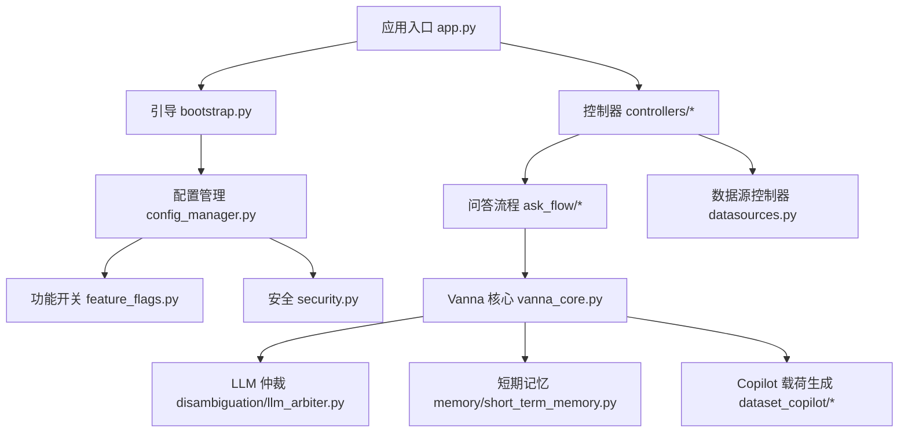
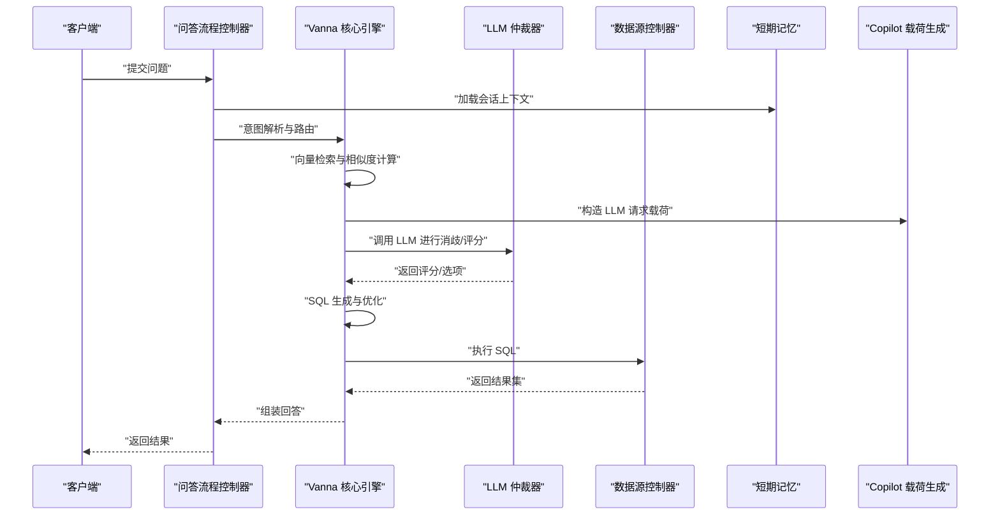
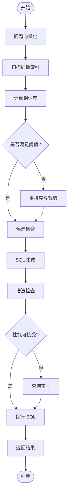
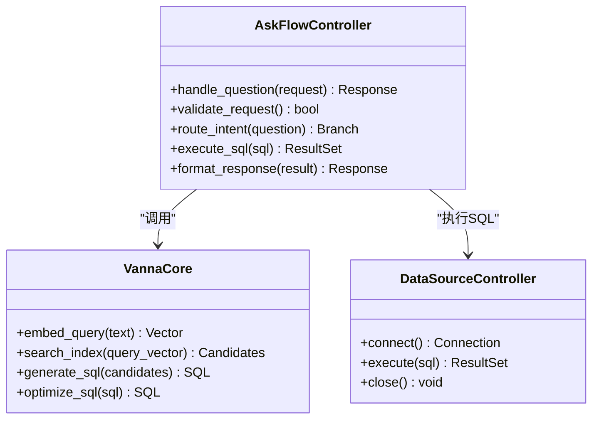
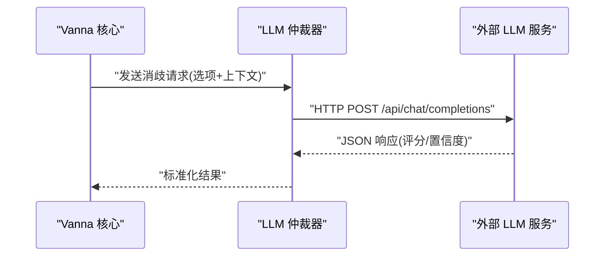
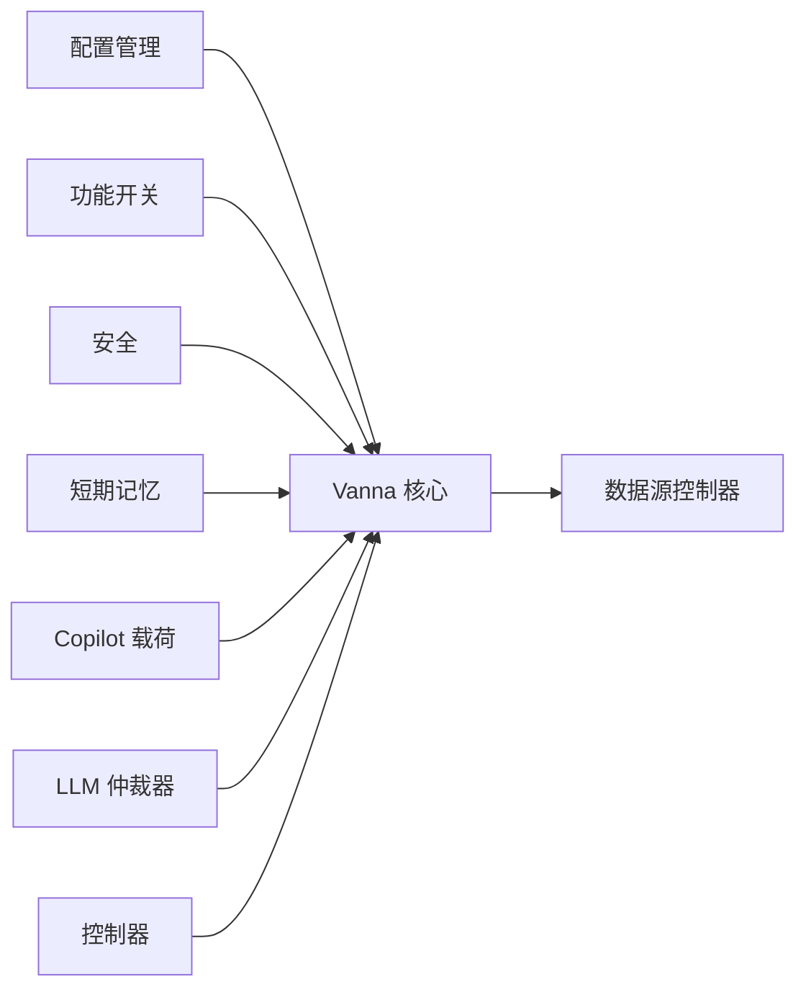

# Vanna 核心引擎

<cite>
**本文档引用的文件**   
- [vanna_core.py](file://backend/vanna_core.py)
- [app.py](file://backend/app.py)
- [bootstrap.py](file://backend/bootstrap.py)
- [config_manager.py](file://backend/config_manager.py)
- [feature_flags.py](file://backend/feature_flags.py)
- [security.py](file://backend/security.py)
- [ask_flow/controller.py](file://backend/ask_flow/controller.py)
- [ask_flow/contracts.py](file://backend/ask_flow/contracts.py)
- [controllers/ask_flow.py](file://backend/controllers/ask_flow.py)
- [controllers/datasources.py](file://backend/controllers/datasources.py)
- [smartask_advanced/service.py](file://backend/smartask_advanced/service.py)
- [smartask_basic/service.py](file://backend/smartask_basic/service.py)
- [disambiguation/llm_arbiter.py](file://backend/disambiguation/llm_arbiter.py)
- [memory/short_term_memory.py](file://backend/memory/short_term_memory.py)
- [dataset_copilot/payload_generator.py](file://backend/dataset_copilot/payload_generator.py)
- [dataset_copilot/copilot_prompts.py](file://backend/dataset_copilot/copilot_prompts.py)
- [docker-compose.yml](file://docker-compose.yml)
- [requirements.txt](file://backend/requirements.txt)
</cite>

## 目录
1. [引言](#引言)
2. [项目结构](#项目结构)
3. [核心组件](#核心组件)
4. [架构总览](#架构总览)
5. [详细组件分析](#详细组件分析)
6. [依赖关系分析](#依赖关系分析)
7. [性能考量](#性能考量)
8. [故障排查指南](#故障排查指南)
9. [结论](#结论)
10. [附录](#附录)

## 引言
本文件为 SmartAsk Vanna 核心引擎的集成文档，面向开发者与运维人员，系统性阐述向量检索引擎、外部 LLM 集成、SQL 生成与优化、缓存与连接池、配置与环境变量、部署注意事项以及故障排查与性能调优。目标是帮助读者快速理解并稳定运行 Vanna 在 SmartAsk 中的工作流，包括语义相似度计算、向量索引构建、检索优化策略、LLM API 封装、请求格式化与响应处理、SQL 语法检查与重写、查询性能分析与缓存策略等。

## 项目结构
SmartAsk 后端采用模块化组织：入口应用、引导初始化、配置管理、功能开关与安全模块位于根目录；业务控制器集中在 controllers；高级能力与基础能力分别位于 smartask_advanced 与 smartask_basic；问答流程编排位于 ask_flow；LLM 仲裁与消歧位于 disambiguation；短期记忆位于 memory；数据集 Copilot 工具位于 dataset_copilot。Vanna 核心逻辑由 vanna_core.py 提供，并通过控制器与服务层接入。

图表来源
- [app.py](file://backend/app.py)
- [bootstrap.py](file://backend/bootstrap.py)
- [config_manager.py](file://backend/config_manager.py)
- [feature_flags.py](file://backend/feature_flags.py)
- [security.py](file://backend/security.py)
- [controllers/ask_flow.py](file://backend/controllers/ask_flow.py)
- [ask_flow/controller.py](file://backend/ask_flow/controller.py)
- [vanna_core.py](file://backend/vanna_core.py)
- [disambiguation/llm_arbiter.py](file://backend/disambiguation/llm_arbiter.py)
- [memory/short_term_memory.py](file://backend/memory/short_term_memory.py)
- [dataset_copilot/payload_generator.py](file://backend/dataset_copilot/payload_generator.py)

章节来源
- [app.py](file://backend/app.py)
- [bootstrap.py](file://backend/bootstrap.py)
- [config_manager.py](file://backend/config_manager.py)
- [feature_flags.py](file://backend/feature_flags.py)
- [security.py](file://backend/security.py)

## 核心组件
- Vanna 核心引擎（vanna_core.py）：提供向量检索、语义相似度计算、索引构建与检索优化策略，协调 SQL 生成、执行与结果返回。
- 问答流程控制器（ask_flow/controller.py, controllers/ask_flow.py）：对外暴露 REST API，编排意图识别、路由、消歧、SQL 生成与执行。
- 数据源控制器（controllers/datasources.py）：管理数据库连接、权限校验与查询执行。
- LLM 仲裁器（disambiguation/llm_arbiter.py）：调用外部 LLM 服务进行选项消歧与评分。
- 短期记忆（memory/short_term_memory.py）：维护会话级上下文与中间结果。
- Copilot 载荷生成（dataset_copilot/payload_generator.py, copilot_prompts.py）：构造 LLM 请求载荷与提示词模板。
- 配置与安全（config_manager.py, feature_flags.py, security.py）：集中管理环境变量、功能开关与安全策略。

章节来源
- [vanna_core.py](file://backend/vanna_core.py)
- [ask_flow/controller.py](file://backend/ask_flow/controller.py)
- [controllers/ask_flow.py](file://backend/controllers/ask_flow.py)
- [controllers/datasources.py](file://backend/controllers/datasources.py)
- [disambiguation/llm_arbiter.py](file://backend/disambiguation/llm_arbiter.py)
- [memory/short_term_memory.py](file://backend/memory/short_term_memory.py)
- [dataset_copilot/payload_generator.py](file://backend/dataset_copilot/payload_generator.py)
- [dataset_copilot/copilot_prompts.py](file://backend/dataset_copilot/copilot_prompts.py)
- [config_manager.py](file://backend/config_manager.py)
- [feature_flags.py](file://backend/feature_flags.py)
- [security.py](file://backend/security.py)

## 架构总览
Vanna 核心引擎通过控制器接收用户问题，进入问答流程控制器进行意图解析与路由，随后调用 Vanna 核心进行向量检索与 SQL 生成，必要时借助 LLM 仲裁器进行消歧与评分，最终通过数据源控制器执行 SQL 并返回结果。短期记忆用于维持会话上下文，Copilot 载荷生成负责构造 LLM 请求。

图表来源
- [controllers/ask_flow.py](file://backend/controllers/ask_flow.py)
- [ask_flow/controller.py](file://backend/ask_flow/controller.py)
- [vanna_core.py](file://backend/vanna_core.py)
- [disambiguation/llm_arbiter.py](file://backend/disambiguation/llm_arbiter.py)
- [controllers/datasources.py](file://backend/controllers/datasources.py)
- [memory/short_term_memory.py](file://backend/memory/short_term_memory.py)
- [dataset_copilot/payload_generator.py](file://backend/dataset_copilot/payload_generator.py)

## 详细组件分析

### Vanna 核心引擎（向量检索与 SQL 生成）
- 语义相似度计算：基于向量嵌入对问题与元数据进行相似度匹配，支持多种距离度量与归一化策略。
- 向量索引构建：增量更新与批量重建索引，支持分片与压缩，提升检索效率。
- 检索优化策略：预过滤、候选集裁剪、重排序与缓存命中优先。
- SQL 生成与优化：根据检索结果生成候选 SQL，进行语法检查、性能分析与查询重写，选择最优方案执行。

图表来源
- [vanna_core.py](file://backend/vanna_core.py)

章节来源
- [vanna_core.py](file://backend/vanna_core.py)

### 问答流程控制器（API 编排）
- 接收 HTTP 请求，解析参数与鉴权。
- 编排意图识别、路由分支、消歧与确认。
- 调用 Vanna 核心进行检索与 SQL 生成。
- 组装响应并记录日志。

图表来源
- [controllers/ask_flow.py](file://backend/controllers/ask_flow.py)
- [ask_flow/controller.py](file://backend/ask_flow/controller.py)
- [vanna_core.py](file://backend/vanna_core.py)
- [controllers/datasources.py](file://backend/controllers/datasources.py)

章节来源
- [controllers/ask_flow.py](file://backend/controllers/ask_flow.py)
- [ask_flow/controller.py](file://backend/ask_flow/controller.py)

### LLM 仲裁器（外部服务集成）
- API 调用封装：统一封装不同 LLM 提供商的接口，支持重试与超时控制。
- 请求格式化：将候选选项与上下文转换为标准请求体。
- 响应处理：解析评分、置信度与解释文本，异常时回退到默认策略。

图表来源
- [disambiguation/llm_arbiter.py](file://backend/disambiguation/llm_arbiter.py)

章节来源
- [disambiguation/llm_arbiter.py](file://backend/disambiguation/llm_arbiter.py)

### 短期记忆与会话上下文
- 维护会话级变量、历史消息与中间结果。
- 支持上下文截断与优先级保留。
- 与 Vanna 核心协作，提供检索与生成的上下文。

章节来源
- [memory/short_term_memory.py](file://backend/memory/short_term_memory.py)

### Copilot 载荷生成与提示词模板
- 动态构造 LLM 请求载荷，包含系统提示、用户输入与上下文。
- 模板化管理提示词，支持多场景与多语言。
- 与 Vanna 核心集成，确保载荷结构与字段一致性。

章节来源
- [dataset_copilot/payload_generator.py](file://backend/dataset_copilot/payload_generator.py)
- [dataset_copilot/copilot_prompts.py](file://backend/dataset_copilot/copilot_prompts.py)

### 配置管理与功能开关
- 集中读取环境变量与配置文件，提供运行时访问接口。
- 功能开关支持热更新，影响行为分支与性能特性。
- 安全策略与密钥管理，支持加密存储与动态注入。

章节来源
- [config_manager.py](file://backend/config_manager.py)
- [feature_flags.py](file://backend/feature_flags.py)
- [security.py](file://backend/security.py)

### 应用入口与引导初始化
- 启动 Web 框架，注册路由与中间件。
- 初始化配置、日志、数据库连接与向量索引。
- 加载功能开关与安全策略，准备就绪。

章节来源
- [app.py](file://backend/app.py)
- [bootstrap.py](file://backend/bootstrap.py)

## 依赖关系分析
Vanna 核心依赖于配置管理、功能开关、安全模块、短期记忆、Copilot 载荷生成与 LLM 仲裁器。控制器层依赖 Vanna 核心与数据源控制器。整体依赖清晰，无循环依赖。

图表来源
- [config_manager.py](file://backend/config_manager.py)
- [feature_flags.py](file://backend/feature_flags.py)
- [security.py](file://backend/security.py)
- [memory/short_term_memory.py](file://backend/memory/short_term_memory.py)
- [dataset_copilot/payload_generator.py](file://backend/dataset_copilot/payload_generator.py)
- [disambiguation/llm_arbiter.py](file://backend/disambiguation/llm_arbiter.py)
- [controllers/ask_flow.py](file://backend/controllers/ask_flow.py)
- [controllers/datasources.py](file://backend/controllers/datasources.py)
- [vanna_core.py](file://backend/vanna_core.py)

章节来源
- [vanna_core.py](file://backend/vanna_core.py)
- [controllers/ask_flow.py](file://backend/controllers/ask_flow.py)
- [controllers/datasources.py](file://backend/controllers/datasources.py)

## 性能考量
- 向量索引：使用分片与压缩，支持增量更新与批量重建，减少内存占用与检索延迟。
- 相似度计算：优先使用近似最近邻算法，结合阈值过滤与重排序，平衡精度与速度。
- SQL 优化：语法检查与性能分析前置，避免无效执行；查询重写针对常见模式优化。
- 缓存策略：对高频查询与相似问题进行缓存，减少重复计算与 LLM 调用。
- 连接池：数据库连接池大小与超时时间可调，避免连接泄漏与资源耗尽。
- 并发控制：限制并发请求数，防止过载；异步处理长耗时任务。

[本节为通用指导，不直接分析具体文件]

## 故障排查指南
- LLM 调用失败：检查网络连通性、API Key 与速率限制；启用重试与降级策略。
- 向量检索慢：检查索引状态与分片分布；调整相似度阈值与候选集大小。
- SQL 执行错误：查看语法检查日志与执行计划；验证表结构与权限。
- 内存溢出：监控向量索引与短期记忆大小；设置上限与清理策略。
- 配置错误：核对环境变量与配置文件格式；使用功能开关隔离问题。

章节来源
- [disambiguation/llm_arbiter.py](file://backend/disambiguation/llm_arbiter.py)
- [vanna_core.py](file://backend/vanna_core.py)
- [controllers/datasources.py](file://backend/controllers/datasources.py)
- [memory/short_term_memory.py](file://backend/memory/short_term_memory.py)
- [config_manager.py](file://backend/config_manager.py)

## 结论
Vanna 核心引擎在 SmartAsk 中承担向量检索、SQL 生成与优化的关键角色，通过与 LLM 仲裁器、短期记忆与 Copilot 载荷生成协同，实现高质量的智能问数体验。合理配置与调优可显著提升性能与稳定性。建议在生产环境启用缓存、连接池与监控，持续优化向量索引与查询策略。

[本节为总结，不直接分析具体文件]

## 附录

### 服务配置指南与环境变量
- 数据库连接：主机、端口、用户名、密码、数据库名、连接池大小。
- 向量索引：存储路径、分片数量、压缩级别、更新策略。
- LLM 服务：端点地址、API Key、模型名称、超时与重试次数。
- 功能开关：启用/禁用特定能力，如缓存、重排序、查询重写。
- 安全策略：密钥加密、访问控制、审计日志。

章节来源
- [config_manager.py](file://backend/config_manager.py)
- [feature_flags.py](file://backend/feature_flags.py)
- [security.py](file://backend/security.py)

### 部署注意事项
- 容器化：使用 docker-compose.yml 编排服务，确保依赖服务可用。
- 资源限制：为向量索引与数据库分配足够内存与磁盘空间。
- 监控告警：集成日志收集与指标采集，设置阈值告警。
- 备份恢复：定期备份向量索引与数据库，支持快速恢复。

章节来源
- [docker-compose.yml](file://docker-compose.yml)

### 依赖与版本
- Python 包依赖：查看 requirements.txt 确保版本兼容。
- 前端依赖：Node.js 与 pnpm 版本要求。
- 第三方服务：LLM 提供商与数据库驱动版本。

章节来源
- [requirements.txt](file://backend/requirements.txt)