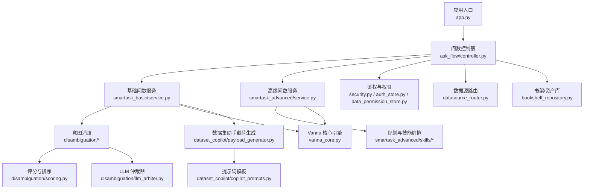
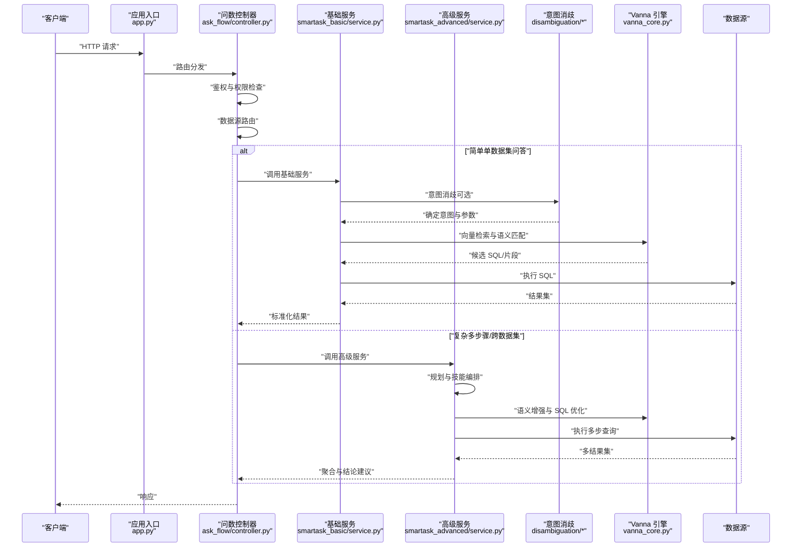
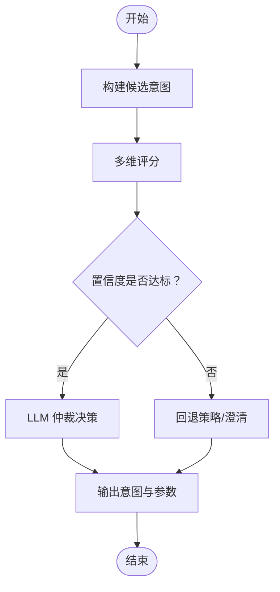
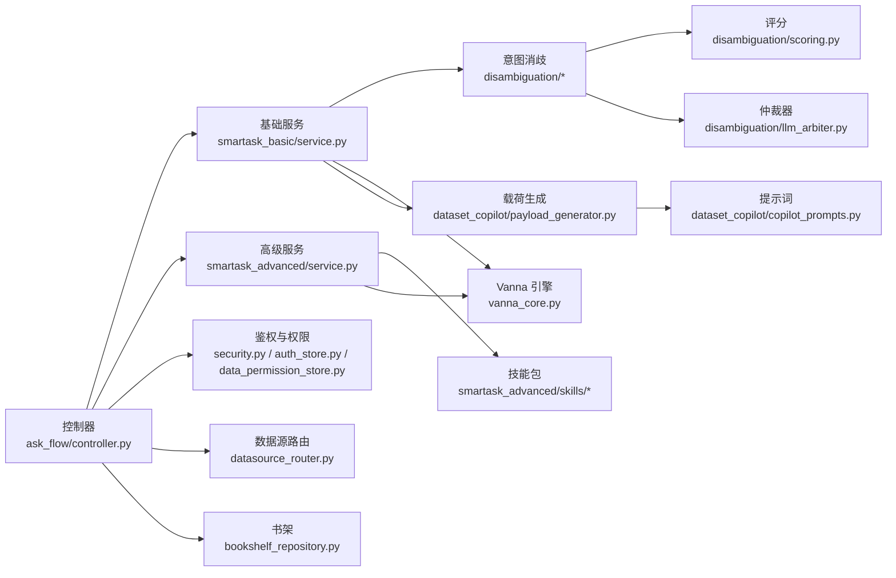

# 业务服务层

<cite>
**本文引用的文件**   
- [backend/app.py](file://backend/app.py)
- [backend/ask_flow/controller.py](file://backend/ask_flow/controller.py)
- [backend/ask_flow/contracts.py](file://backend/ask_flow/contracts.py)
- [backend/smartask_basic/service.py](file://backend/smartask_basic/service.py)
- [backend/smartask_advanced/service.py](file://backend/smartask_advanced/service.py)
- [backend/dataset_copilot/payload_generator.py](file://backend/dataset_copilot/payload_generator.py)
- [backend/dataset_copilot/copilot_prompts.py](file://backend/dataset_copilot/copilot_prompts.py)
- [backend/disambiguation/llm_arbiter.py](file://backend/disambiguation/llm_arbiter.py)
- [backend/disambiguation/scoring.py](file://backend/disambiguation/scoring.py)
- [backend/disambiguation/option_builder.py](file://backend/disambiguation/option_builder.py)
- [backend/vanna_core.py](file://backend/vanna_core.py)
- [backend/config_manager.py](file://backend/config_manager.py)
- [backend/security.py](file://backend/security.py)
- [backend/auth_store.py](file://backend/auth_store.py)
- [backend/data_permission_store.py](file://backend/data_permission_store.py)
- [backend/bookshelf_repository.py](file://backend/bookshelf_repository.py)
- [backend/datasource_router.py](file://backend/datasource_router.py)
- [backend/memory/short_term_memory.py](file://backend/memory/short_term_memory.py)
- [backend/controllers/advanced_capabilities.py](file://backend/controllers/advanced_capabilities.py)
- [backend/controllers/ask_flow.py](file://backend/controllers/ask_flow.py)
</cite>

## 目录
1. [简介](#简介)
2. [项目结构](#项目结构)
3. [核心组件](#核心组件)
4. [架构总览](#架构总览)
5. [详细组件分析](#详细组件分析)
6. [依赖关系分析](#依赖关系分析)
7. [性能考虑](#性能考虑)
8. [故障排查指南](#故障排查指南)
9. [结论](#结论)
10. [附录](#附录)

## 简介
本文件面向 SmartAsk 智能问数平台的“业务服务层”，聚焦基础问数服务与高级问数服务的架构设计与实现差异，覆盖查询处理流程、SQL 生成策略与结果优化机制；详解数据集助手服务的载荷生成器（提示词构建、上下文管理、参数传递）；阐述意图消歧服务的 LLM 仲裁器（多候选排序、置信度计算、最终决策）；并文档化 Vanna 核心引擎的集成（向量检索、语义匹配、SQL 优化）。同时提供错误处理、重试机制与缓存策略说明，以及性能调优建议与监控指标。

## 项目结构
业务服务层主要位于 backend 目录下，围绕 ask_flow 控制器编排、smartask_basic/basic 服务、smartask_advanced/advanced 服务、dataset_copilot 载荷生成、disambiguation 意图消歧、vanna_core 向量与 SQL 优化等模块组织。入口应用通过 app.py 注册路由与中间件，将外部请求分发至 ask_flow 控制器，再进入具体服务层执行。

图表来源
- [backend/app.py](file://backend/app.py)
- [backend/ask_flow/controller.py](file://backend/ask_flow/controller.py)
- [backend/smartask_basic/service.py](file://backend/smartask_basic/service.py)
- [backend/smartask_advanced/service.py](file://backend/smartask_advanced/service.py)
- [backend/disambiguation/llm_arbiter.py](file://backend/disambiguation/llm_arbiter.py)
- [backend/disambiguation/scoring.py](file://backend/disambiguation/scoring.py)
- [backend/dataset_copilot/payload_generator.py](file://backend/dataset_copilot/payload_generator.py)
- [backend/dataset_copilot/copilot_prompts.py](file://backend/dataset_copilot/copilot_prompts.py)
- [backend/vanna_core.py](file://backend/vanna_core.py)
- [backend/security.py](file://backend/security.py)
- [backend/auth_store.py](file://backend/auth_store.py)
- [backend/data_permission_store.py](file://backend/data_permission_store.py)
- [backend/datasource_router.py](file://backend/datasource_router.py)
- [backend/bookshelf_repository.py](file://backend/bookshelf_repository.py)

章节来源
- [backend/app.py](file://backend/app.py)
- [backend/ask_flow/controller.py](file://backend/ask_flow/controller.py)

## 核心组件
- 问数控制器（ask_flow/controller.py）：统一接收用户问题，解析会话上下文，调用基础或高级服务，协调权限校验、数据源路由与结果返回。
- 基础问数服务（smartask_basic/service.py）：面向单数据集/视图的快速问答，包含意图识别、过滤条件抽取、SQL 生成与执行、结果格式化。
- 高级问数服务（smartask_advanced/service.py）：面向复杂场景的多步骤规划、跨数据集关联、证据投票、质量自检与结论建议。
- 意图消歧（disambiguation/*）：对模糊意图进行候选构建、评分与 LLM 仲裁，输出确定性决策。
- 数据集助手载荷生成（dataset_copilot/*）：根据上下文与模板构建提示词载荷，支持参数注入与上下文裁剪。
- Vanna 核心引擎（vanna_core.py）：向量检索、语义匹配与 SQL 优化，为 SQL 生成提供知识增强。
- 安全与权限（security.py, auth_store.py, data_permission_store.py）：鉴权、角色与数据级权限控制。
- 数据源路由（datasource_router.py）：按租户/组织/数据集选择目标数据源。
- 书架/资产库（bookshelf_repository.py）：管理可复用资产与模板。
- 短期记忆（memory/short_term_memory.py）：会话内上下文维护。

章节来源
- [backend/ask_flow/controller.py](file://backend/ask_flow/controller.py)
- [backend/smartask_basic/service.py](file://backend/smartask_basic/service.py)
- [backend/smartask_advanced/service.py](file://backend/smartask_advanced/service.py)
- [backend/disambiguation/llm_arbiter.py](file://backend/disambiguation/llm_arbiter.py)
- [backend/disambiguation/scoring.py](file://backend/disambiguation/scoring.py)
- [backend/dataset_copilot/payload_generator.py](file://backend/dataset_copilot/payload_generator.py)
- [backend/dataset_copilot/copilot_prompts.py](file://backend/dataset_copilot/copilot_prompts.py)
- [backend/vanna_core.py](file://backend/vanna_core.py)
- [backend/security.py](file://backend/security.py)
- [backend/auth_store.py](file://backend/auth_store.py)
- [backend/data_permission_store.py](file://backend/data_permission_store.py)
- [backend/datasource_router.py](file://backend/datasource_router.py)
- [backend/bookshelf_repository.py](file://backend/bookshelf_repository.py)
- [backend/memory/short_term_memory.py](file://backend/memory/short_term_memory.py)

## 架构总览
下图展示从请求到响应的端到端流程，包括控制器编排、基础/高级服务分支、意图消歧、Vanna 增强与结果优化。

图表来源
- [backend/app.py](file://backend/app.py)
- [backend/ask_flow/controller.py](file://backend/ask_flow/controller.py)
- [backend/smartask_basic/service.py](file://backend/smartask_basic/service.py)
- [backend/smartask_advanced/service.py](file://backend/smartask_advanced/service.py)
- [backend/disambiguation/llm_arbiter.py](file://backend/disambiguation/llm_arbiter.py)
- [backend/vanna_core.py](file://backend/vanna_core.py)

## 详细组件分析

### 基础问数服务（smartask_basic/service.py）
- 职责
  - 解析用户问题，提取维度、度量与过滤条件。
  - 结合上下文与权限约束，生成目标 SQL。
  - 调用 Vanna 进行语义匹配与 SQL 片段增强。
  - 执行查询、结果格式化与异常处理。
- 关键流程
  - 输入校验与上下文加载（会话、权限、数据源）。
  - 意图识别与过滤抽取（必要时走意图消歧）。
  - SQL 生成（模板 + Vanna 增强 + 规则校验）。
  - 执行与结果优化（分页、聚合、字段映射）。
- 错误处理与重试
  - 捕获数据库连接/超时/语法错误，触发降级或重试。
  - 记录诊断信息，便于回溯。
- 性能要点
  - 优先使用索引友好的过滤条件。
  - 限制结果集大小，避免全表扫描。
  - 缓存热点查询结果（见缓存策略）。

章节来源
- [backend/smartask_basic/service.py](file://backend/smartask_basic/service.py)
- [backend/ask_flow/contracts.py](file://backend/ask_flow/contracts.py)

### 高级问数服务（smartask_advanced/service.py）
- 职责
  - 复杂问题的多步骤规划（拆解子任务、跨数据集关联）。
  - 技能编排（证据投票、质量自检、结论建议、模板策略）。
  - 与 Vanna 深度集成，进行语义匹配与 SQL 优化。
- 关键流程
  - 问题分解与计划生成。
  - 各子任务并行/串行执行，收集证据。
  - 证据聚合与一致性校验。
  - 生成结论与建议，输出结构化答案。
- 错误处理与重试
  - 子任务失败回退与替代路径。
  - 重试上限与退避策略。
- 性能要点
  - 并行执行独立子任务。
  - 增量更新证据，避免重复计算。
  - 结果缓存与去重。

章节来源
- [backend/smartask_advanced/service.py](file://backend/smartask_advanced/service.py)
- [backend/smartask_advanced/skills/planner.py](file://backend/smartask_advanced/skills/planner.py)
- [backend/smartask_advanced/skills/evidence_vote.py](file://backend/smartask_advanced/skills/evidence_vote.py)
- [backend/smartask_advanced/skills/sql_quality.py](file://backend/smartask_advanced/skills/sql_quality.py)
- [backend/smartask_advanced/skills/conclusion_advice.py](file://backend/smartask_advanced/skills/conclusion_advice.py)
- [backend/smartask_advanced/skills/template_policy.py](file://backend/smartask_advanced/skills/template_policy.py)

### 意图消歧服务（disambiguation/*）
- 职责
  - 构建候选意图选项（option_builder）。
  - 基于规则与模型打分（scoring）。
  - 使用 LLM 仲裁器（llm_arbiter）进行最终决策。
- 关键流程
  - 输入问题与上下文 → 候选构建 → 评分 → LLM 仲裁 → 输出确定性意图与参数。
- 评分与仲裁
  - 多维度评分（语义相似度、上下文契合度、历史命中率、业务规则）。
  - LLM 仲裁综合评分与置信度阈值判断。
- 错误处理
  - 低置信度时回退到默认意图或请求澄清。
  - 记录仲裁日志与原因。

图表来源
- [backend/disambiguation/option_builder.py](file://backend/disambiguation/option_builder.py)
- [backend/disambiguation/scoring.py](file://backend/disambiguation/scoring.py)
- [backend/disambiguation/llm_arbiter.py](file://backend/disambiguation/llm_arbiter.py)

章节来源
- [backend/disambiguation/option_builder.py](file://backend/disambiguation/option_builder.py)
- [backend/disambiguation/scoring.py](file://backend/disambiguation/scoring.py)
- [backend/disambiguation/llm_arbiter.py](file://backend/disambiguation/llm_arbiter.py)

### 数据集助手载荷生成器（dataset_copilot/payload_generator.py）
- 职责
  - 根据用户问题、上下文与模板构建提示词载荷。
  - 管理上下文窗口，裁剪无关信息。
  - 注入参数（如数据集元数据、权限约束、时间范围）。
- 关键流程
  - 加载模板（copilot_prompts.py）。
  - 填充变量（问题、上下文、约束）。
  - 生成结构化载荷（JSON/文本），供下游 LLM 消费。
- 错误处理
  - 模板缺失或变量未填充时的兜底策略。
  - 上下文过长时的分段与摘要。

章节来源
- [backend/dataset_copilot/payload_generator.py](file://backend/dataset_copilot/payload_generator.py)
- [backend/dataset_copilot/copilot_prompts.py](file://backend/dataset_copilot/copilot_prompts.py)

### Vanna 核心引擎（vanna_core.py）
- 职责
  - 向量检索：将问题与知识库（SQL 片段、表结构、字段描述）向量化，检索相关片段。
  - 语义匹配：匹配用户意图与领域术语，提升 SQL 生成准确性。
  - SQL 优化：对生成的 SQL 进行语法修正、性能优化与安全检查。
- 关键流程
  - 问题向量化 → 检索相似片段 → 拼接上下文 → 生成/优化 SQL → 校验与返回。
- 错误处理
  - 检索为空时的回退策略（模板 SQL）。
  - 优化失败时的降级与告警。

章节来源
- [backend/vanna_core.py](file://backend/vanna_core.py)

### 控制器与契约（ask_flow/controller.py, contracts.py）
- 职责
  - 统一接口定义与入参出参契约。
  - 编排基础/高级服务调用，协调权限、数据源与结果格式。
- 关键流程
  - 请求校验 → 鉴权 → 数据源路由 → 服务调用 → 结果封装。
- 错误处理
  - 统一异常码与消息，便于前端处理。

章节来源
- [backend/ask_flow/controller.py](file://backend/ask_flow/controller.py)
- [backend/ask_flow/contracts.py](file://backend/ask_flow/contracts.py)

### 安全与权限（security.py, auth_store.py, data_permission_store.py）
- 职责
  - 鉴权（认证令牌、会话状态）。
  - 角色与资源访问控制（RBAC）。
  - 数据级权限（行/列级过滤）。
- 关键流程
  - 请求拦截 → 身份验证 → 权限校验 → 动态注入过滤条件。

章节来源
- [backend/security.py](file://backend/security.py)
- [backend/auth_store.py](file://backend/auth_store.py)
- [backend/data_permission_store.py](file://backend/data_permission_store.py)

### 数据源路由（datasource_router.py）
- 职责
  - 根据租户、组织、数据集选择目标数据源。
  - 支持多数据源切换与故障转移。
- 关键流程
  - 解析请求上下文 → 路由决策 → 建立连接 → 执行查询。

章节来源
- [backend/datasource_router.py](file://backend/datasource_router.py)

### 书架/资产库（bookshelf_repository.py）
- 职责
  - 管理可复用的 SQL 模板、视图、指标定义。
  - 提供版本管理与发布流程。
- 关键流程
  - 查询资产 → 版本选择 → 注入参数 → 生成 SQL。

章节来源
- [backend/bookshelf_repository.py](file://backend/bookshelf_repository.py)

### 短期记忆（memory/short_term_memory.py）
- 职责
  - 维护会话内上下文（历史问题、已选意图、中间结果）。
  - 支持上下文裁剪与摘要，降低 LLM 成本。
- 关键流程
  - 写入新上下文 → 过期清理 → 读取最近 N 条。

章节来源
- [backend/memory/short_term_memory.py](file://backend/memory/short_term_memory.py)

## 依赖关系分析
业务服务层内部模块耦合清晰，控制器作为编排中心，基础/高级服务分别依赖意图消歧、Vanna 与安全权限模块。数据源路由与书架为横向支撑能力。

图表来源
- [backend/ask_flow/controller.py](file://backend/ask_flow/controller.py)
- [backend/smartask_basic/service.py](file://backend/smartask_basic/service.py)
- [backend/smartask_advanced/service.py](file://backend/smartask_advanced/service.py)
- [backend/disambiguation/llm_arbiter.py](file://backend/disambiguation/llm_arbiter.py)
- [backend/disambiguation/scoring.py](file://backend/disambiguation/scoring.py)
- [backend/dataset_copilot/payload_generator.py](file://backend/dataset_copilot/payload_generator.py)
- [backend/dataset_copilot/copilot_prompts.py](file://backend/dataset_copilot/copilot_prompts.py)
- [backend/vanna_core.py](file://backend/vanna_core.py)
- [backend/security.py](file://backend/security.py)
- [backend/auth_store.py](file://backend/auth_store.py)
- [backend/data_permission_store.py](file://backend/data_permission_store.py)
- [backend/datasource_router.py](file://backend/datasource_router.py)
- [backend/bookshelf_repository.py](file://backend/bookshelf_repository.py)

章节来源
- [backend/ask_flow/controller.py](file://backend/ask_flow/controller.py)
- [backend/smartask_basic/service.py](file://backend/smartask_basic/service.py)
- [backend/smartask_advanced/service.py](file://backend/smartask_advanced/service.py)

## 性能考虑
- 查询优化
  - 优先使用索引字段过滤，避免函数包裹索引列。
  - 限制结果集大小，采用分页与增量加载。
  - 合并多次查询为一次聚合查询（在合理范围内）。
- 并发与并行
  - 高级服务的子任务并行执行，注意资源竞争与锁。
  - 控制并发上限，避免数据库连接池耗尽。
- 缓存策略
  - 热点查询结果缓存（TTL 与失效策略）。
  - 向量检索结果缓存（同语义问题命中）。
  - 模板与资产缓存（书架内容）。
- 重试与退避
  - 幂等性保证下的有限重试，指数退避。
  - 失败快速回退到降级路径（模板 SQL、默认意图）。
- 监控指标
  - 请求延迟（P50/P95/P99）、QPS、错误率。
  - SQL 执行耗时、结果集大小、缓存命中率。
  - LLM 调用次数、Token 消耗、仲裁置信度分布。
  - 数据源连接池使用率、超时与重试次数。

[本节为通用指导，不直接分析具体文件]

## 故障排查指南
- 常见问题定位
  - 权限不足：检查鉴权与数据级权限配置。
  - SQL 生成失败：查看 Vanna 检索结果与模板可用性。
  - 意图消歧不稳定：检查评分权重与置信度阈值。
  - 数据源连接失败：检查路由配置与连接池状态。
- 调试手段
  - 启用详细日志（请求链路、SQL 语句、LLM 调用）。
  - 使用短期记忆回放上下文。
  - 借助书架资产版本对比定位回归。
- 恢复策略
  - 自动重试与降级。
  - 人工干预入口（澄清问题、替换模板）。

章节来源
- [backend/security.py](file://backend/security.py)
- [backend/vanna_core.py](file://backend/vanna_core.py)
- [backend/disambiguation/scoring.py](file://backend/disambiguation/scoring.py)
- [backend/datasource_router.py](file://backend/datasource_router.py)
- [backend/memory/short_term_memory.py](file://backend/memory/short_term_memory.py)
- [backend/bookshelf_repository.py](file://backend/bookshelf_repository.py)

## 结论
SmartAsk 业务服务层以控制器为核心编排点，基础服务追求高效简洁，高级服务强调复杂规划与证据聚合。意图消歧与 Vanna 引擎共同保障 SQL 生成的准确性与鲁棒性。通过完善的错误处理、重试与缓存策略，系统在稳定性与性能上具备良好表现。建议持续优化评分与仲裁策略、扩展向量知识库、完善监控与告警体系。

[本节为总结性内容，不直接分析具体文件]

## 附录
- 配置管理（config_manager.py）：集中管理运行时配置与特性开关。
- 控制器扩展（controllers/advanced_capabilities.py, controllers/ask_flow.py）：功能扩展与 API 暴露。

章节来源
- [backend/config_manager.py](file://backend/config_manager.py)
- [backend/controllers/advanced_capabilities.py](file://backend/controllers/advanced_capabilities.py)
- [backend/controllers/ask_flow.py](file://backend/controllers/ask_flow.py)