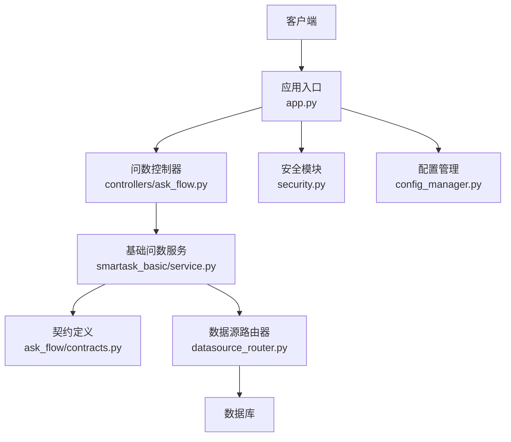
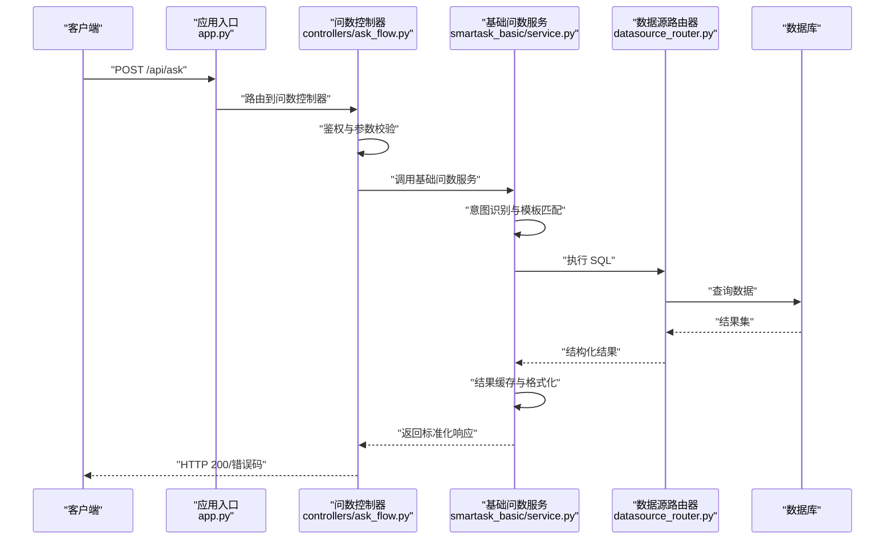
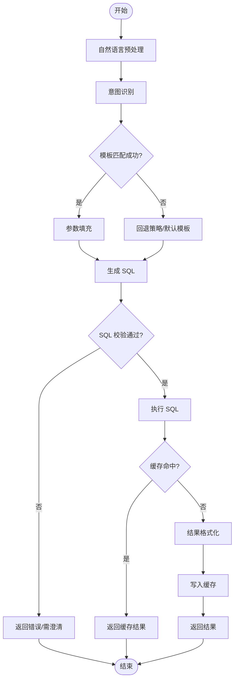
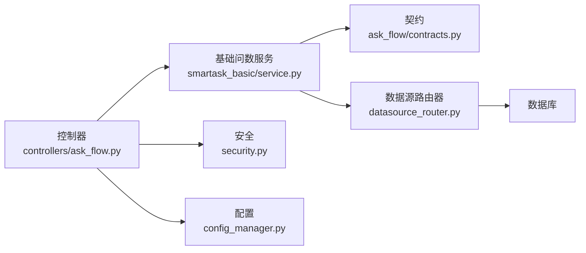

# 基础问数服务

<cite>
**本文引用的文件**   
- [backend/smartask_basic/service.py](file://backend/smartask_basic/service.py)
- [backend/controllers/ask_flow.py](file://backend/controllers/ask_flow.py)
- [backend/ask_flow/controller.py](file://backend/ask_flow/controller.py)
- [backend/ask_flow/contracts.py](file://backend/ask_flow/contracts.py)
- [backend/app.py](file://backend/app.py)
- [backend/datasource_router.py](file://backend/datasource_router.py)
- [backend/config_manager.py](file://backend/config_manager.py)
- [backend/security.py](file://backend/security.py)
- [backend/vanna_core.py](file://backend/vanna_core.py)
- [backend/tests/test_ask_flow_controller.py](file://backend/tests/test_ask_flow_controller.py)
</cite>

## 目录
1. [简介](#简介)
2. [项目结构](#项目结构)
3. [核心组件](#核心组件)
4. [架构总览](#架构总览)
5. [详细组件分析](#详细组件分析)
6. [依赖关系分析](#依赖关系分析)
7. [性能考虑](#性能考虑)
8. [故障排查指南](#故障排查指南)
9. [结论](#结论)
10. [附录](#附录) 

## 简介
本文件为 SmartAsk 基础问数服务的开发文档，聚焦“自然语言查询处理、简单 SQL 生成与结果返回”的核心能力。内容涵盖：
- 查询解析流程、意图识别与模板匹配策略
- 服务层错误处理、输入验证与参数校验机制
- 查询缓存策略、性能优化与监控指标
- 调用示例与结果处理
- 与数据库连接池的集成与执行优化

## 项目结构
SmartAsk 后端采用分层与模块化组织：
- 控制器层：HTTP 接口入口，负责请求路由、鉴权、参数校验与响应封装
- 业务服务层：实现基础问数的核心逻辑（解析、意图识别、SQL 生成、执行与结果组装）
- 数据访问层：通过数据源路由器与连接池管理数据库交互
- 配置与安全：集中式配置管理与安全校验

图表来源 
- [backend/app.py](file://backend/app.py)
- [backend/controllers/ask_flow.py](file://backend/controllers/ask_flow.py)
- [backend/smartask_basic/service.py](file://backend/smartask_basic/service.py)
- [backend/ask_flow/contracts.py](file://backend/ask_flow/contracts.py)
- [backend/datasource_router.py](file://backend/datasource_router.py)
- [backend/security.py](file://backend/security.py)
- [backend/config_manager.py](file://backend/config_manager.py)

章节来源
- [backend/app.py](file://backend/app.py)
- [backend/controllers/ask_flow.py](file://backend/controllers/ask_flow.py)
- [backend/smartask_basic/service.py](file://backend/smartask_basic/service.py)

## 核心组件
- 问数控制器（HTTP 层）
  - 职责：接收用户自然语言问题，进行鉴权与参数校验，调用基础问数服务，统一返回格式
  - 关键行为：请求体校验、权限检查、超时控制、结果序列化
- 基础问数服务（业务层）
  - 职责：自然语言解析、意图识别、模板匹配、SQL 生成、执行与结果聚合
  - 关键行为：输入清洗、规则/模板匹配、SQL 构造、执行与缓存命中、错误归一化
- 契约与数据结构
  - 职责：定义请求/响应模型、错误码、字段约束
- 数据源路由器
  - 职责：根据上下文选择数据源、管理连接池、执行 SQL 并返回结果集
- 配置与安全
  - 职责：加载运行时配置、启用特性开关、鉴权与审计

章节来源
- [backend/controllers/ask_flow.py](file://backend/controllers/ask_flow.py)
- [backend/smartask_basic/service.py](file://backend/smartask_basic/service.py)
- [backend/ask_flow/contracts.py](file://backend/ask_flow/contracts.py)
- [backend/datasource_router.py](file://backend/datasource_router.py)
- [backend/config_manager.py](file://backend/config_manager.py)
- [backend/security.py](file://backend/security.py)

## 架构总览
基础问数服务整体流程如下：
- 客户端发起自然语言查询
- 控制器完成鉴权与参数校验后，交由基础问数服务处理
- 服务层进行意图识别与模板匹配，生成 SQL
- 通过数据源路由器执行 SQL，获取结果集
- 服务层对结果进行格式化与缓存，最终由控制器返回

图表来源 
- [backend/app.py](file://backend/app.py)
- [backend/controllers/ask_flow.py](file://backend/controllers/ask_flow.py)
- [backend/smartask_basic/service.py](file://backend/smartask_basic/service.py)
- [backend/datasource_router.py](file://backend/datasource_router.py)

## 详细组件分析

### 问数控制器（HTTP 层）
- 功能要点
  - 接收自然语言问题与可选上下文（如数据集、时间范围、过滤条件）
  - 校验必填字段、类型与长度限制
  - 鉴权与权限检查（基于角色或资源级权限）
  - 调用基础问数服务并统一封装响应
- 错误处理
  - 参数缺失或非法时返回明确的错误码与提示
  - 鉴权失败返回未授权错误
  - 调用服务异常时记录日志并返回通用错误
- 性能与安全
  - 设置合理的超时与限流
  - 对输入进行脱敏与白名单校验

章节来源
- [backend/controllers/ask_flow.py](file://backend/controllers/ask_flow.py)
- [backend/security.py](file://backend/security.py)

### 基础问数服务（业务层）
- 功能要点
  - 自然语言预处理：去噪、分词、实体抽取（表名、维度、度量、时间等）
  - 意图识别：判断查询类型（统计、明细、趋势、对比等）
  - 模板匹配：将意图映射到预置 SQL 模板，填充参数
  - SQL 生成：组合 WHERE/GROUP BY/ORDER BY/LIMIT 等子句
  - 执行与结果：通过数据源路由器执行 SQL，返回结构化结果
  - 缓存：按查询指纹命中缓存，减少重复计算
- 算法与复杂度
  - 意图识别：基于规则与关键词匹配，时间复杂度 O(n)，n 为特征数量
  - 模板匹配：字典查找 O(1)，参数填充 O(m)，m 为模板变量数
  - SQL 生成：字符串拼接与校验，O(k)，k 为子句数量
- 错误处理
  - 意图无法识别时返回“需澄清”或默认意图
  - 模板参数缺失时回退到更通用模板
  - SQL 语法错误或执行失败时抛出可追踪的错误信息

图表来源 
- [backend/smartask_basic/service.py](file://backend/smartask_basic/service.py)
- [backend/ask_flow/contracts.py](file://backend/ask_flow/contracts.py)

章节来源
- [backend/smartask_basic/service.py](file://backend/smartask_basic/service.py)
- [backend/ask_flow/contracts.py](file://backend/ask_flow/contracts.py)

### 契约与数据结构
- 请求模型
  - 问题文本、上下文（数据集、时间范围、过滤条件）、选项（是否启用缓存、分页等）
- 响应模型
  - 状态码、消息、SQL、结果集、元数据（耗时、缓存命中标志）
- 错误码
  - 参数错误、意图识别失败、SQL 执行错误、权限不足等

章节来源
- [backend/ask_flow/contracts.py](file://backend/ask_flow/contracts.py)

### 数据源路由器与连接池
- 功能要点
  - 根据上下文选择数据源（多库/多实例）
  - 管理连接池大小、超时与重试策略
  - 执行 SQL 并返回结果集与元数据
- 优化策略
  - 连接复用与空闲回收
  - 只读查询优先与读写分离
  - 结果集分页与流式读取

章节来源
- [backend/datasource_router.py](file://backend/datasource_router.py)

### 配置与安全
- 配置管理
  - 动态加载特性开关、模板路径、缓存策略
- 安全校验
  - 鉴权、权限检查、输入白名单、敏感字段脱敏

章节来源
- [backend/config_manager.py](file://backend/config_manager.py)
- [backend/security.py](file://backend/security.py)

## 依赖关系分析
- 控制器依赖服务层与配置/安全模块
- 服务层依赖契约定义、数据源路由器与缓存
- 数据源路由器依赖数据库驱动与连接池
- 配置与安全贯穿各层

图表来源 
- [backend/controllers/ask_flow.py](file://backend/controllers/ask_flow.py)
- [backend/smartask_basic/service.py](file://backend/smartask_basic/service.py)
- [backend/ask_flow/contracts.py](file://backend/ask_flow/contracts.py)
- [backend/datasource_router.py](file://backend/datasource_router.py)
- [backend/security.py](file://backend/security.py)
- [backend/config_manager.py](file://backend/config_manager.py)

章节来源
- [backend/controllers/ask_flow.py](file://backend/controllers/ask_flow.py)
- [backend/smartask_basic/service.py](file://backend/smartask_basic/service.py)
- [backend/datasource_router.py](file://backend/datasource_router.py)

## 性能考虑
- 查询缓存
  - 使用查询指纹（规范化后的 SQL 与参数）作为键
  - 合理设置 TTL 与失效策略
- SQL 优化
  - 避免 SELECT *，仅选择必要列
  - 合理使用索引与过滤条件
  - 限制结果集大小（LIMIT）
- 连接池优化
  - 调整最大连接数与超时
  - 启用连接健康检查与自动重连
- 监控指标
  - 请求量、成功率、平均耗时、P95/P99 耗时
  - 缓存命中率、SQL 执行次数、错误率
  - 连接池使用率与等待时间

[本节为通用指导，不直接分析具体文件]

## 故障排查指南
- 常见问题
  - 意图识别失败：检查关键词与模板覆盖度
  - SQL 生成错误：检查参数填充与模板语法
  - 执行超时：检查数据库负载与索引
  - 权限不足：检查角色与资源权限配置
- 定位方法
  - 查看控制器与服务层日志
  - 打印生成的 SQL 与执行计划
  - 检查缓存键与命中率
  - 使用测试用例复现问题

章节来源
- [backend/tests/test_ask_flow_controller.py](file://backend/tests/test_ask_flow_controller.py)

## 结论
基础问数服务以“自然语言→意图→模板→SQL→执行→结果”为主线，结合缓存与连接池优化，提供稳定高效的问数能力。通过清晰的契约与错误处理机制，确保系统可维护性与可扩展性。建议持续完善意图识别与模板覆盖，强化监控与告警，提升用户体验与系统稳定性。

[本节为总结，不直接分析具体文件]

## 附录

### 调用示例与结果处理
- 调用步骤
  - 构造请求体：包含问题文本与上下文
  - 发送 HTTP 请求至问数接口
  - 解析响应：检查状态码、消息、SQL 与结果集
  - 处理错误：根据错误码提示用户或重试
- 结果处理
  - 展示表格或图表
  - 导出 CSV/Excel
  - 记录历史与反馈

[本节为概念性说明，不直接分析具体文件]

### 与 Vanna 核心集成（可选增强）
- 作用：在复杂场景下借助 Vanna 核心进行语义理解与 SQL 生成增强
- 集成点：服务层在模板匹配失败时回退到 Vanna 核心

章节来源
- [backend/vanna_core.py](file://backend/vanna_core.py)