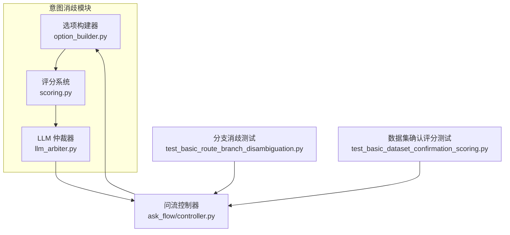
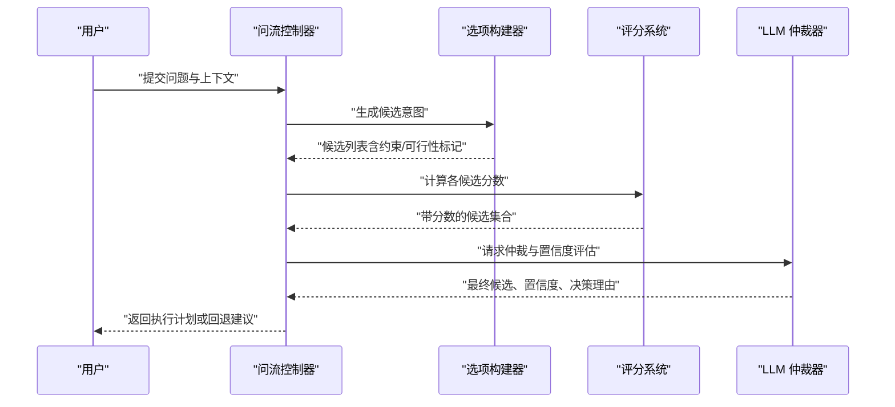
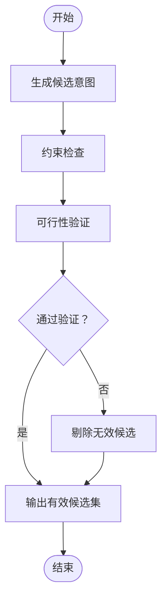
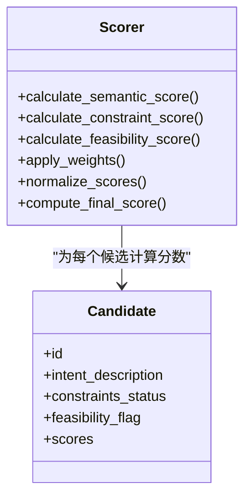
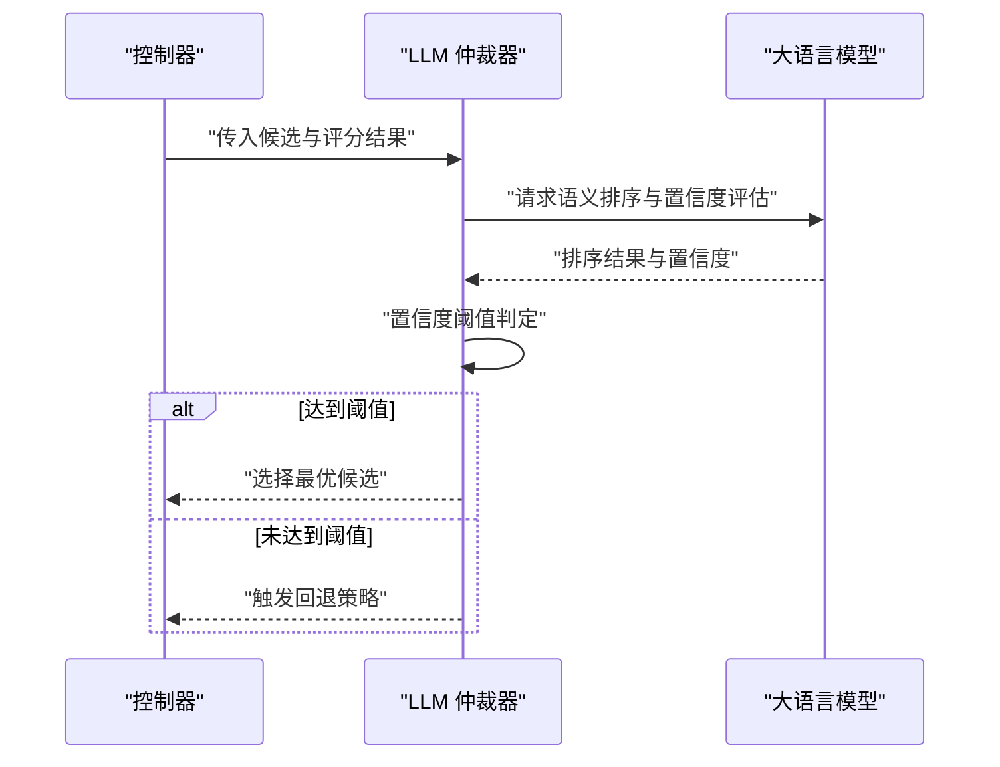
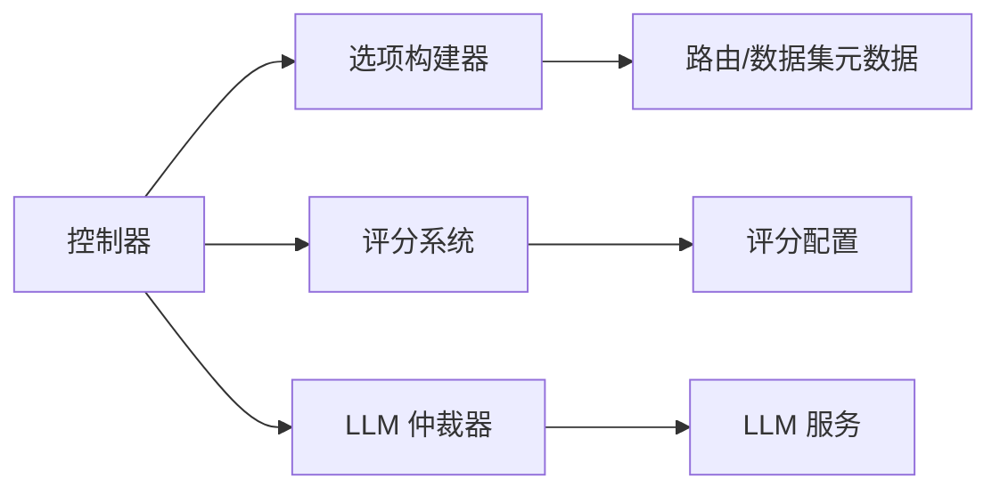

# 意图消歧服务

<cite>
**本文引用的文件**   
- [llm_arbiter.py](file://backend/disambiguation/llm_arbiter.py)
- [option_builder.py](file://backend/disambiguation/option_builder.py)
- [scoring.py](file://backend/disambiguation/scoring.py)
- [ask_flow_controller.py](file://backend/ask_flow/controller.py)
- [test_basic_route_branch_disambiguation.py](file://backend/tests/test_basic_route_branch_disambiguation.py)
- [test_basic_dataset_confirmation_scoring.py](file://backend/tests/test_basic_dataset_confirmation_scoring.py)
</cite>

## 目录
1. [简介](#简介)
2. [项目结构](#项目结构)
3. [核心组件](#核心组件)
4. [架构总览](#架构总览)
5. [详细组件分析](#详细组件分析)
6. [依赖关系分析](#依赖关系分析)
7. [性能考量](#性能考量)
8. [故障排查指南](#故障排查指南)
9. [结论](#结论)
10. [附录](#附录)

## 简介
本文件面向 SmartAsk 意图消歧服务的开发者与运维者，系统性阐述 LLM 仲裁器、选项构建器与评分系统的实现原理与使用方式。重点覆盖：
- 多候选排序算法、置信度计算模型与最终决策逻辑
- 候选意图生成、约束检查与可行性验证
- 评分标准、权重分配与综合评估机制
- 消歧策略配置项、阈值设置与自定义规则
- 服务调优、性能监控与调试方法
- 典型场景处理示例与边界情况处理

## 项目结构
意图消歧能力集中在 backend/disambiguation 模块中，由三个核心文件组成：
- llm_arbiter.py：LLM 仲裁器，负责基于 LLM 的候选排序、置信度估计与最终决策
- option_builder.py：选项构建器，负责从路由/数据集信息中生成候选意图、执行约束检查与可行性验证
- scoring.py：评分系统，定义评分维度、权重与综合评估流程

上层控制器 ask_flow/controller.py 将用户问题输入到消歧管线，协调选项构建、评分与仲裁，并输出最终决策。测试用例位于 backend/tests 下，用于验证分支消歧与数据集确认评分等关键路径。

图表来源
- [ask_flow_controller.py](file://backend/ask_flow/controller.py)
- [option_builder.py](file://backend/disambiguation/option_builder.py)
- [scoring.py](file://backend/disambiguation/scoring.py)
- [llm_arbiter.py](file://backend/disambiguation/llm_arbiter.py)
- [test_basic_route_branch_disambiguation.py](file://backend/tests/test_basic_route_branch_disambiguation.py)
- [test_basic_dataset_confirmation_scoring.py](file://backend/tests/test_basic_dataset_confirmation_scoring.py)

章节来源
- [ask_flow_controller.py](file://backend/ask_flow/controller.py)
- [option_builder.py](file://backend/disambiguation/option_builder.py)
- [scoring.py](file://backend/disambiguation/scoring.py)
- [llm_arbiter.py](file://backend/disambiguation/llm_arbiter.py)

## 核心组件
- 选项构建器（Option Builder）
  - 职责：根据上下文（用户问题、路由元数据、数据集描述等）生成候选意图；对每个候选进行约束检查（如权限、字段存在性、必填条件）与可行性验证（如 SQL 可构造性、参数完整性）。
  - 输出：结构化候选列表，包含候选 ID、意图描述、约束状态、可行性标记与初步评分依据。
- 评分系统（Scoring）
  - 职责：为每个候选计算多维分数（语义匹配、约束满足度、可行性、历史命中率等），按权重汇总得到综合分；支持归一化与阈值过滤。
  - 输出：带分数的候选集合，供仲裁器排序与决策。
- LLM 仲裁器（LLM Arbiter）
  - 职责：接收候选与评分结果，调用 LLM 进行二次校验与排序，结合置信度模型给出最终决策（选择某候选或回退策略）；记录推理摘要以便审计。
  - 输出：最终选择的候选、置信度、决策理由与可选的回退动作。

章节来源
- [option_builder.py](file://backend/disambiguation/option_builder.py)
- [scoring.py](file://backend/disambiguation/scoring.py)
- [llm_arbiter.py](file://backend/disambiguation/llm_arbiter.py)

## 架构总览
意图消歧的整体流程如下：
1. 控制器接收用户问题与上下文，调用选项构建器生成候选集。
2. 评分系统对候选进行多维度打分与加权汇总。
3. LLM 仲裁器对候选进行语义级仲裁，结合置信度模型做出最终决策。
4. 控制器根据仲裁结果进入后续执行或回退路径。

图表来源
- [ask_flow_controller.py](file://backend/ask_flow/controller.py)
- [option_builder.py](file://backend/disambiguation/option_builder.py)
- [scoring.py](file://backend/disambiguation/scoring.py)
- [llm_arbiter.py](file://backend/disambiguation/llm_arbiter.py)

## 详细组件分析

### 选项构建器（Option Builder）
- 候选意图生成
  - 基于路由元数据与数据集描述，提取可能的意图分支（如按数据集、指标、维度组合）。
  - 利用关键词匹配与模板填充，快速生成初始候选。
- 约束检查
  - 权限校验：用户是否有权访问目标数据集/字段。
  - 字段存在性与类型匹配：确保所需字段在目标数据集中可用。
  - 必填条件：如时间范围、分组维度等是否齐全。
- 可行性验证
  - 参数完整性：必要参数是否缺失或为空。
  - 可构造性：是否能生成合法查询（如 SQL 片段、聚合表达式）。
  - 冲突检测：同一候选内部是否存在矛盾约束。

图表来源
- [option_builder.py](file://backend/disambiguation/option_builder.py)

章节来源
- [option_builder.py](file://backend/disambiguation/option_builder.py)

### 评分系统（Scoring）
- 评分维度
  - 语义匹配度：问题与候选意图的文本相似度。
  - 约束满足度：约束检查通过的比重与严格程度。
  - 可行性得分：参数完整性和可构造性评分。
  - 历史命中权重：基于历史成功率的先验权重。
- 权重分配
  - 默认权重可按业务场景调整，支持动态配置。
  - 归一化处理确保不同维度分数在同一量纲比较。
- 综合评估
  - 加权求和得到总分，按阈值过滤低分候选。
  - 输出排序后的候选列表，供仲裁器进一步决策。

图表来源
- [scoring.py](file://backend/disambiguation/scoring.py)

章节来源
- [scoring.py](file://backend/disambiguation/scoring.py)

### LLM 仲裁器（LLM Arbiter）
- 多候选排序算法
  - 基于 LLM 的语义理解，对候选进行二次排序，考虑上下文细微差异与隐含意图。
  - 引入置信度模型，量化每个候选被选中的概率。
- 置信度计算模型
  - 融合评分系统输出与 LLM 判断，采用加权融合或贝叶斯更新方式计算置信度。
  - 支持阈值控制：低于阈值的候选将被拒绝或触发回退。
- 最终决策逻辑
  - 选择最高置信度的候选作为执行目标。
  - 若最高置信度未达阈值，则触发回退策略（如提示用户澄清、选择次优候选或失败响应）。
  - 输出决策理由与审计摘要，便于追踪与优化。

图表来源
- [llm_arbiter.py](file://backend/disambiguation/llm_arbiter.py)
- [ask_flow_controller.py](file://backend/ask_flow/controller.py)

章节来源
- [llm_arbiter.py](file://backend/disambiguation/llm_arbiter.py)

## 依赖关系分析
- 控制器依赖选项构建器与评分系统，再依赖 LLM 仲裁器完成最终决策。
- 选项构建器依赖路由与数据集元数据，评分系统依赖候选结构与评分配置。
- LLM 仲裁器依赖外部 LLM 服务与置信度配置。

图表来源
- [ask_flow_controller.py](file://backend/ask_flow/controller.py)
- [option_builder.py](file://backend/disambiguation/option_builder.py)
- [scoring.py](file://backend/disambiguation/scoring.py)
- [llm_arbiter.py](file://backend/disambiguation/llm_arbiter.py)

章节来源
- [ask_flow_controller.py](file://backend/ask_flow/controller.py)
- [option_builder.py](file://backend/disambiguation/option_builder.py)
- [scoring.py](file://backend/disambiguation/scoring.py)
- [llm_arbiter.py](file://backend/disambiguation/llm_arbiter.py)

## 性能考量
- 候选生成阶段应限制候选数量，避免过多候选导致评分与仲裁开销增大。
- 评分系统可采用缓存策略，对重复问题与相似上下文复用历史评分。
- LLM 仲裁器调用需设置超时与重试上限，避免阻塞主流程。
- 置信度阈值可根据业务 SLA 动态调整，平衡准确率与延迟。

[本节为通用指导，不直接分析具体文件]

## 故障排查指南
- 常见问题定位
  - 候选生成失败：检查路由元数据与数据集描述是否正确加载。
  - 评分异常：核对权重配置与归一化逻辑。
  - 仲裁失败：查看 LLM 服务可用性、超时与重试配置。
- 调试方法
  - 启用详细日志，记录候选生成、评分与仲裁的关键中间结果。
  - 使用单元测试验证分支消歧与数据集确认评分路径。
- 回退策略
  - 当置信度不足时，优先提示用户澄清或选择次优候选。
  - 记录失败案例用于后续模型与规则优化。

章节来源
- [test_basic_route_branch_disambiguation.py](file://backend/tests/test_basic_route_branch_disambiguation.py)
- [test_basic_dataset_confirmation_scoring.py](file://backend/tests/test_basic_dataset_confirmation_scoring.py)

## 结论
SmartAsk 意图消歧服务通过选项构建器、评分系统与 LLM 仲裁器的协同工作，实现了从候选生成到最终决策的完整闭环。合理配置评分权重与置信度阈值，结合有效的监控与调试手段，可显著提升消歧准确率与服务稳定性。

[本节为总结性内容，不直接分析具体文件]

## 附录
- 配置建议
  - 评分权重：根据业务重要性调整语义匹配与约束满足的权重比例。
  - 置信度阈值：高安全场景提高阈值，高吞吐场景适当降低阈值。
- 扩展点
  - 新增评分维度：在评分系统中扩展新维度并融入综合评估。
  - 自定义约束规则：在选项构建器中增加领域特定的约束检查。
- 最佳实践
  - 定期回顾失败案例，优化候选生成与仲裁策略。
  - 保持 LLM 服务的高可用与低延迟，确保仲裁时效性。

[本节为补充说明，不直接分析具体文件]