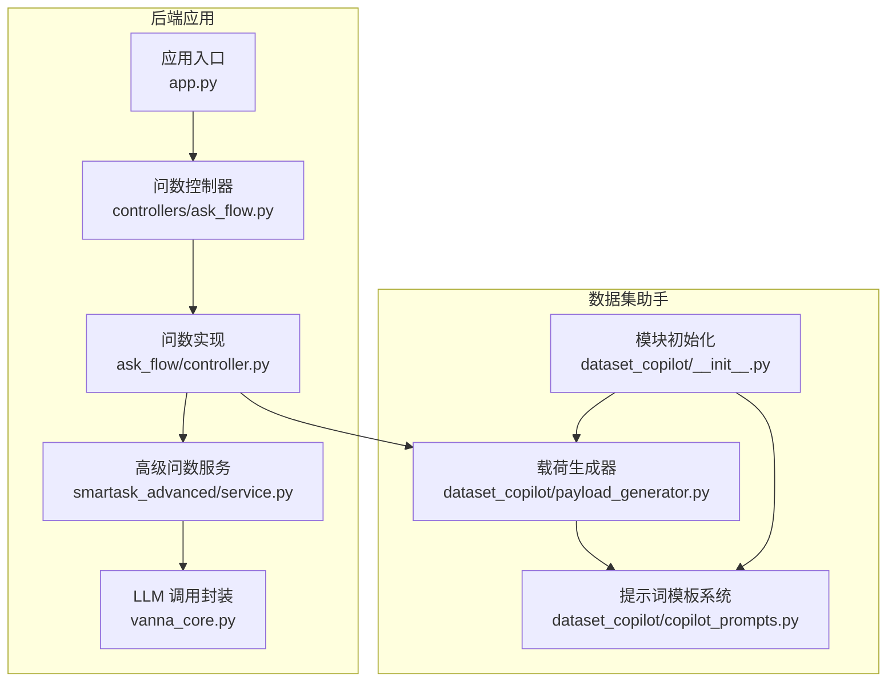
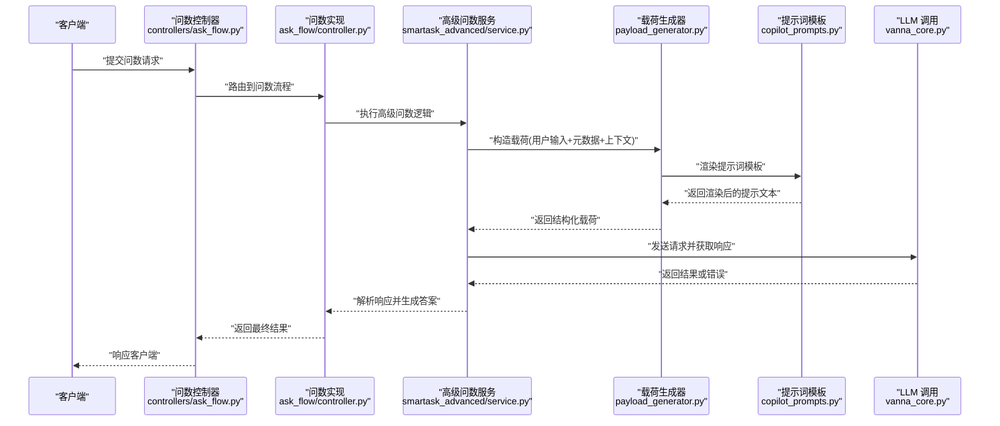
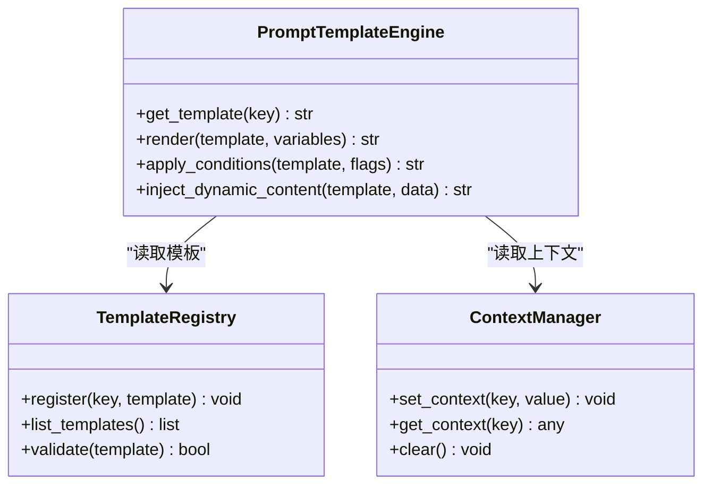
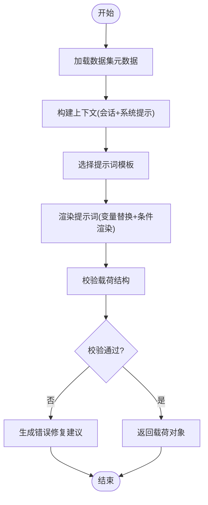
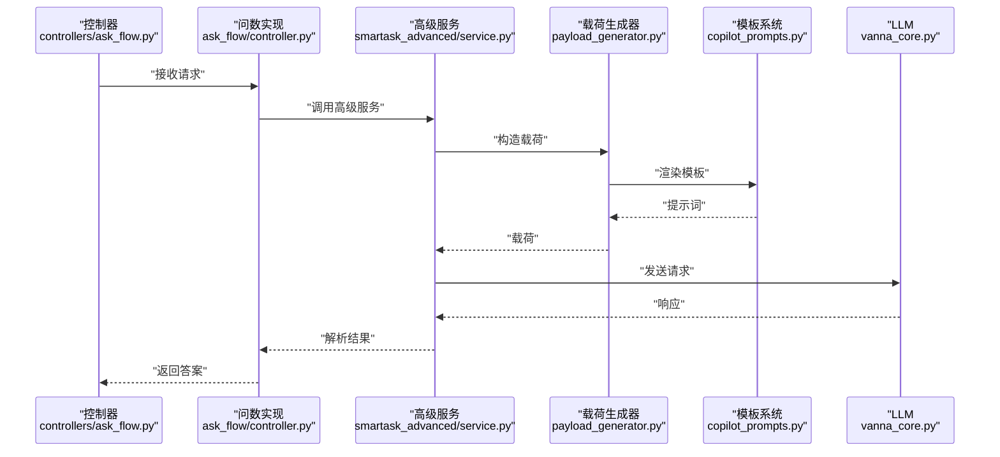
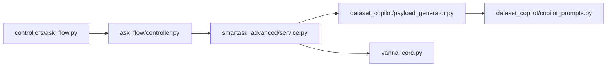

# 数据集助手服务

<cite>
**本文引用的文件**   
- [backend/dataset_copilot/__init__.py](file://backend/dataset_copilot/__init__.py)
- [backend/dataset_copilot/copilot_prompts.py](file://backend/dataset_copilot/copilot_prompts.py)
- [backend/dataset_copilot/payload_generator.py](file://backend/dataset_copilot/payload_generator.py)
- [backend/app.py](file://backend/app.py)
- [backend/ask_flow/controller.py](file://backend/ask_flow/controller.py)
- [backend/ask_flow/contracts.py](file://backend/ask_flow/contracts.py)
- [backend/controllers/ask_flow.py](file://backend/controllers/ask_flow.py)
- [backend/smartask_advanced/service.py](file://backend/smartask_advanced/service.py)
- [backend/vanna_core.py](file://backend/vanna_core.py)
</cite>

## 目录
1. [简介](#简介)
2. [项目结构](#项目结构)
3. [核心组件](#核心组件)
4. [架构总览](#架构总览)
5. [详细组件分析](#详细组件分析)
6. [依赖关系分析](#依赖关系分析)
7. [性能考量](#性能考量)
8. [故障排查指南](#故障排查指南)
9. [结论](#结论)
10. [附录](#附录)

## 简介
本开发文档面向 SmartAsk 的数据集助手服务，聚焦于载荷生成器与提示词模板系统的设计模式、实现原理与使用方式。内容涵盖：
- 载荷生成器的设计模式与实现：提示词构建、上下文管理、参数传递机制
- copilot_prompts 模块的模板系统：变量替换、条件渲染、动态内容生成
- 数据集元数据处理：字段映射、数据类型推断
- 与大语言模型（LLM）的交互流程：请求构造、响应解析、错误处理
- 使用示例与最佳实践建议

## 项目结构
dataset_copilot 模块位于后端 backend/dataset_copilot，主要包含：
- __init__.py：模块初始化与对外暴露能力
- copilot_prompts.py：提示词模板系统与渲染逻辑
- payload_generator.py：载荷生成器，负责将用户意图、数据集元数据与上下文组装为 LLM 请求载荷

此外，ask_flow 控制器与 contracts 定义了问数流程的契约与控制器入口；app.py 提供应用启动与路由挂载；smartask_advanced.service 与 vanna_core.py 提供高级问数能力与底层 LLM 调用封装。

**图表来源** 
- [backend/app.py](file://backend/app.py)
- [backend/controllers/ask_flow.py](file://backend/controllers/ask_flow.py)
- [backend/ask_flow/controller.py](file://backend/ask_flow/controller.py)
- [backend/smartask_advanced/service.py](file://backend/smartask_advanced/service.py)
- [backend/vanna_core.py](file://backend/vanna_core.py)
- [backend/dataset_copilot/__init__.py](file://backend/dataset_copilot/__init__.py)
- [backend/dataset_copilot/copilot_prompts.py](file://backend/dataset_copilot/copilot_prompts.py)
- [backend/dataset_copilot/payload_generator.py](file://backend/dataset_copilot/payload_generator.py)

**章节来源**
- [backend/dataset_copilot/__init__.py](file://backend/dataset_copilot/__init__.py)
- [backend/dataset_copilot/copilot_prompts.py](file://backend/dataset_copilot/copilot_prompts.py)
- [backend/dataset_copilot/payload_generator.py](file://backend/dataset_copilot/payload_generator.py)
- [backend/app.py](file://backend/app.py)
- [backend/controllers/ask_flow.py](file://backend/controllers/ask_flow.py)
- [backend/ask_flow/controller.py](file://backend/ask_flow/controller.py)
- [backend/smartask_advanced/service.py](file://backend/smartask_advanced/service.py)
- [backend/vanna_core.py](file://backend/vanna_core.py)

## 核心组件
- 提示词模板系统（copilot_prompts.py）
  - 职责：集中管理提示词模板，支持变量替换、条件渲染与动态内容生成
  - 关键点：模板命名空间、变量注入、条件分支渲染、安全转义
- 载荷生成器（payload_generator.py）
  - 职责：根据用户输入、数据集元数据与上下文信息，组装 LLM 请求载荷
  - 关键点：上下文管理（会话历史、系统提示）、参数传递（模型参数、工具定义）、结构化输出约束
- 模块初始化（__init__.py）
  - 职责：统一导出模板渲染器与载荷生成器，便于上层控制器与服务调用

**章节来源**
- [backend/dataset_copilot/copilot_prompts.py](file://backend/dataset_copilot/copilot_prompts.py)
- [backend/dataset_copilot/payload_generator.py](file://backend/dataset_copilot/payload_generator.py)
- [backend/dataset_copilot/__init__.py](file://backend/dataset_copilot/__init__.py)

## 架构总览
整体架构围绕“问数控制器 -> 高级问数服务 -> 载荷生成器 -> 提示词模板 -> LLM 调用”展开。载荷生成器作为中间层，屏蔽了模板渲染与上下文拼装细节，向上提供统一的载荷构造接口；提示词模板系统则专注于提示词的版本化与可配置化。

**图表来源** 
- [backend/controllers/ask_flow.py](file://backend/controllers/ask_flow.py)
- [backend/ask_flow/controller.py](file://backend/ask_flow/controller.py)
- [backend/smartask_advanced/service.py](file://backend/smartask_advanced/service.py)
- [backend/dataset_copilot/payload_generator.py](file://backend/dataset_copilot/payload_generator.py)
- [backend/dataset_copilot/copilot_prompts.py](file://backend/dataset_copilot/copilot_prompts.py)
- [backend/vanna_core.py](file://backend/vanna_core.py)

## 详细组件分析

### 提示词模板系统（copilot_prompts.py）
- 设计模式
  - 模板引擎模式：集中管理模板字符串，通过键名访问不同场景的提示词
  - 策略模式：针对不同数据集类型或任务目标选择相应模板策略
- 关键功能
  - 变量替换：支持占位符注入，如 {user_query}、{schema_summary}、{context}
  - 条件渲染：基于布尔标志或枚举值决定是否渲染某段内容
  - 动态内容生成：根据运行时数据（如字段统计、采样行）拼接片段
- 数据结构与复杂度
  - 模板字典：O(1) 查找，按场景键名加载
  - 渲染管线：字符串替换 O(n)，条件判断 O(k) 其中 k 为条件数量
- 错误处理
  - 缺失变量时回退默认值或抛出明确异常
  - 非法模板语法捕获并记录日志

**图表来源** 
- [backend/dataset_copilot/copilot_prompts.py](file://backend/dataset_copilot/copilot_prompts.py)

**章节来源**
- [backend/dataset_copilot/copilot_prompts.py](file://backend/dataset_copilot/copilot_prompts.py)

### 载荷生成器（payload_generator.py）
- 设计模式
  - 工厂模式：根据不同任务类型创建对应的载荷对象
  - 建造者模式：逐步构建复杂载荷结构，确保必填字段完整
- 关键功能
  - 上下文管理：维护会话历史、系统提示、工具定义等
  - 参数传递：模型参数（温度、最大长度）、输出格式约束
  - 结构化输出：强制 JSON Schema 或固定字段集合
- 数据处理
  - 字段映射：将数据集字段名映射到提示词中的语义名称
  - 类型推断：基于列值分布推断数值、时间、分类等类型
- 错误处理
  - 校验失败时返回明确的错误码与修复建议
  - 超时与重试策略

**图表来源** 
- [backend/dataset_copilot/payload_generator.py](file://backend/dataset_copilot/payload_generator.py)

**章节来源**
- [backend/dataset_copilot/payload_generator.py](file://backend/dataset_copilot/payload_generator.py)

### 模块初始化（__init__.py）
- 职责：统一导出模板引擎与载荷生成器实例，简化上层导入
- 最佳实践：避免循环依赖，延迟导入重型模块

**章节来源**
- [backend/dataset_copilot/__init__.py](file://backend/dataset_copilot/__init__.py)

### 问数流程集成（ask_flow/controller.py 与 contracts.py）
- controller.py：协调高级问数服务与载荷生成器，处理请求生命周期
- contracts.py：定义请求/响应契约，确保前后端一致性

**图表来源** 
- [backend/controllers/ask_flow.py](file://backend/controllers/ask_flow.py)
- [backend/ask_flow/controller.py](file://backend/ask_flow/controller.py)
- [backend/ask_flow/contracts.py](file://backend/ask_flow/contracts.py)
- [backend/smartask_advanced/service.py](file://backend/smartask_advanced/service.py)
- [backend/dataset_copilot/payload_generator.py](file://backend/dataset_copilot/payload_generator.py)
- [backend/dataset_copilot/copilot_prompts.py](file://backend/dataset_copilot/copilot_prompts.py)
- [backend/vanna_core.py](file://backend/vanna_core.py)

**章节来源**
- [backend/ask_flow/controller.py](file://backend/ask_flow/controller.py)
- [backend/ask_flow/contracts.py](file://backend/ask_flow/contracts.py)
- [backend/controllers/ask_flow.py](file://backend/controllers/ask_flow.py)
- [backend/smartask_advanced/service.py](file://backend/smartask_advanced/service.py)

## 依赖关系分析
- 内部依赖
  - dataset_copilot 模块被 ask_flow 控制器与高级服务依赖
  - 提示词模板系统被载荷生成器依赖
- 外部依赖
  - vanna_core.py 封装 LLM 调用，提供重试、超时、限流等能力
- 潜在循环依赖
  - 通过 __init__.py 延迟导入避免循环

**图表来源** 
- [backend/controllers/ask_flow.py](file://backend/controllers/ask_flow.py)
- [backend/ask_flow/controller.py](file://backend/ask_flow/controller.py)
- [backend/smartask_advanced/service.py](file://backend/smartask_advanced/service.py)
- [backend/dataset_copilot/payload_generator.py](file://backend/dataset_copilot/payload_generator.py)
- [backend/dataset_copilot/copilot_prompts.py](file://backend/dataset_copilot/copilot_prompts.py)
- [backend/vanna_core.py](file://backend/vanna_core.py)

**章节来源**
- [backend/controllers/ask_flow.py](file://backend/controllers/ask_flow.py)
- [backend/ask_flow/controller.py](file://backend/ask_flow/controller.py)
- [backend/smartask_advanced/service.py](file://backend/smartask_advanced/service.py)
- [backend/dataset_copilot/payload_generator.py](file://backend/dataset_copilot/payload_generator.py)
- [backend/dataset_copilot/copilot_prompts.py](file://backend/dataset_copilot/copilot_prompts.py)
- [backend/vanna_core.py](file://backend/vanna_core.py)

## 性能考量
- 模板渲染缓存：对常用模板进行内存缓存，减少重复渲染开销
- 上下文裁剪：仅保留最近 N 条对话历史，控制提示词长度
- 批量处理：对多字段元数据进行批处理推断，降低 I/O 次数
- LLM 调用优化：启用流式响应、合理设置温度与最大长度，避免过长输出

[本节为通用指导，不直接分析具体文件]

## 故障排查指南
- 常见错误
  - 模板变量缺失：检查变量注入是否完整，确认上下文键名一致
  - 载荷结构校验失败：核对 JSON Schema 与必填字段
  - LLM 调用超时：检查网络状态与模型配额，调整重试策略
- 调试技巧
  - 打印渲染后的提示词与载荷结构
  - 启用详细日志记录模板选择与条件分支
  - 使用单元测试覆盖边界情况（空上下文、特殊字符）

**章节来源**
- [backend/dataset_copilot/copilot_prompts.py](file://backend/dataset_copilot/copilot_prompts.py)
- [backend/dataset_copilot/payload_generator.py](file://backend/dataset_copilot/payload_generator.py)
- [backend/vanna_core.py](file://backend/vanna_core.py)

## 结论
SmartAsk 数据集助手服务通过模块化设计将提示词管理与载荷构造解耦，提升了系统的可维护性与扩展性。模板系统支持灵活的变量替换与条件渲染，载荷生成器确保结构化输出与健壮的错误处理。结合问数流程控制器与 LLM 调用封装，形成完整的智能问数链路。建议在生产环境中启用缓存、监控与限流，以保障稳定性与性能。

[本节为总结性内容，不直接分析具体文件]

## 附录
- 使用示例
  - 基本用法：加载模板引擎与载荷生成器，传入用户查询与数据集元数据，获取 LLM 请求载荷
  - 高级用法：自定义模板策略、注入业务上下文、配置输出约束
- 最佳实践
  - 模板版本化管理，避免破坏性变更
  - 严格校验输入输出，提供清晰的错误消息
  - 定期评估提示词效果，迭代优化

[本节为补充说明，不直接分析具体文件]