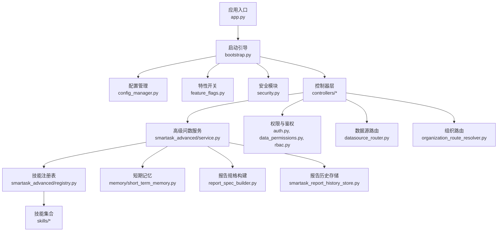
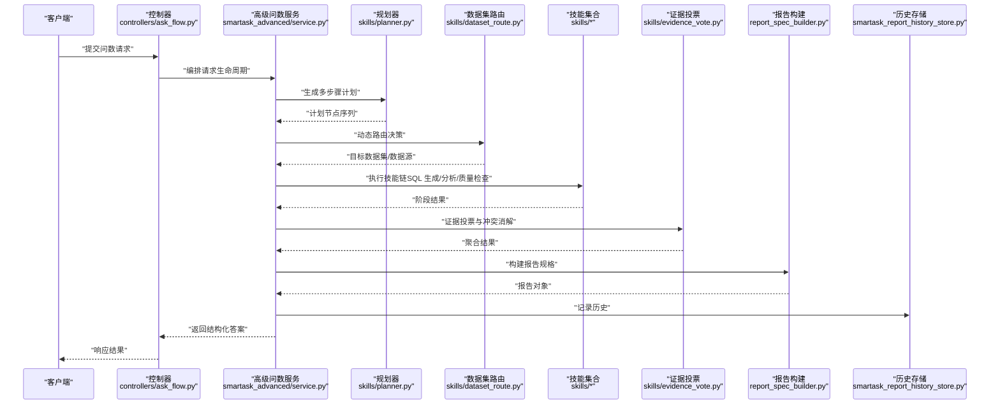
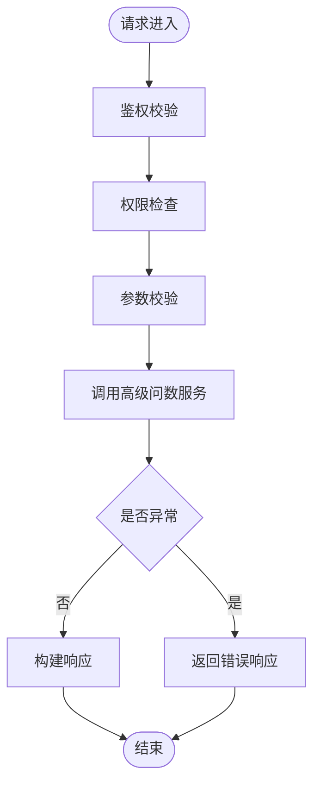
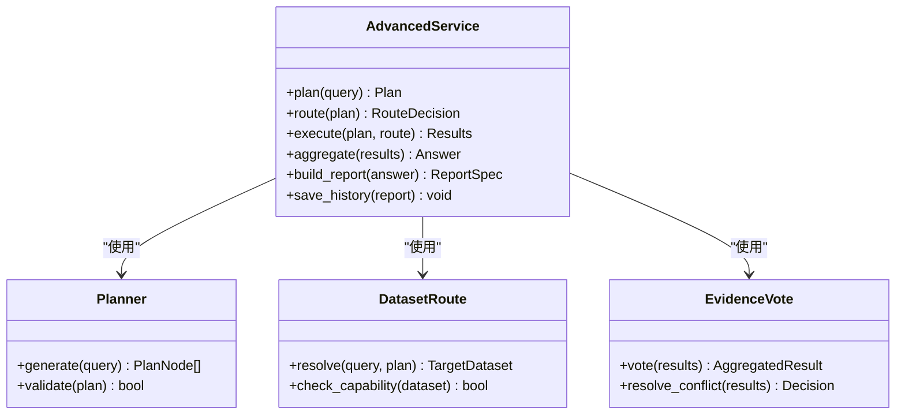
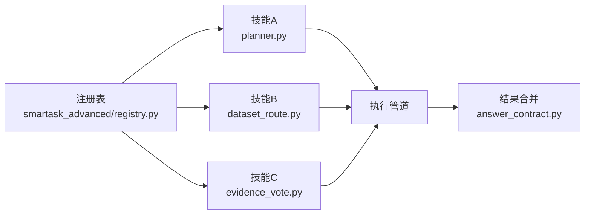
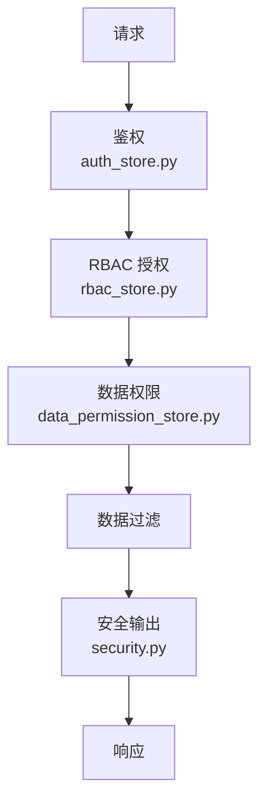
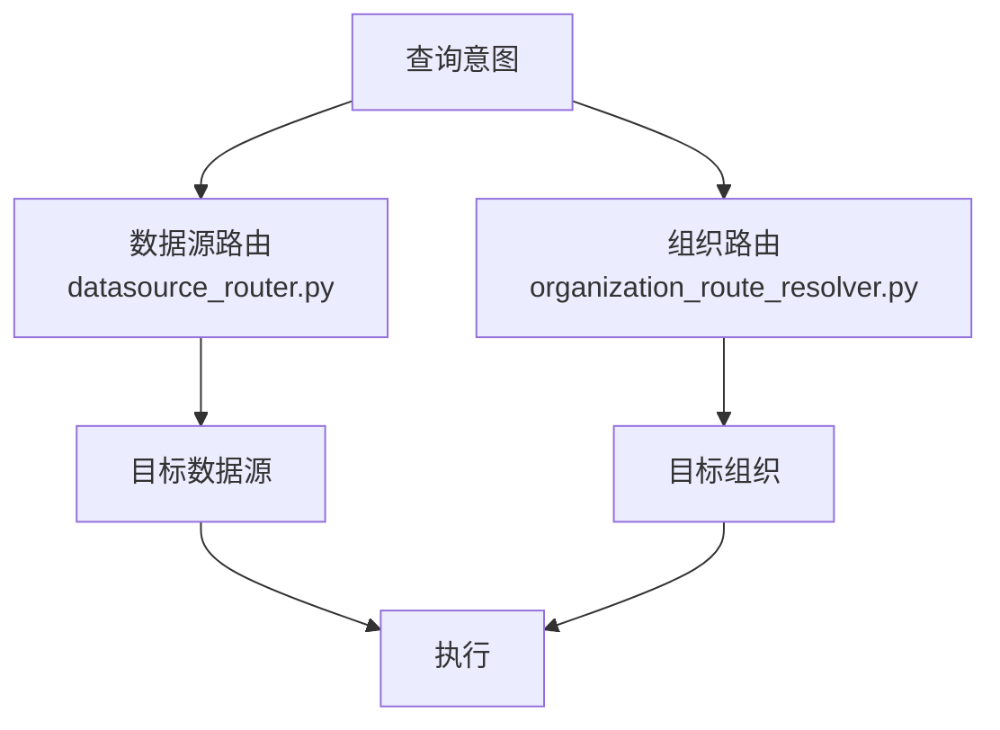
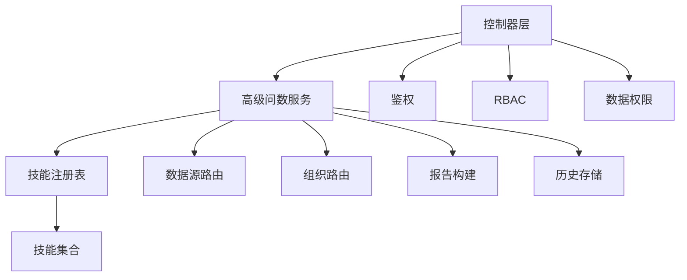

# 高级问数服务

<cite>
**本文引用的文件**   
- [backend/app.py](file://backend/app.py)
- [backend/bootstrap.py](file://backend/bootstrap.py)
- [backend/config_manager.py](file://backend/config_manager.py)
- [backend/feature_flags.py](file://backend/feature_flags.py)
- [backend/security.py](file://backend/security.py)
- [backend/auth_store.py](file://backend/auth_store.py)
- [backend/data_permission_store.py](file://backend/data_permission_store.py)
- [backend/rbac_store.py](file://backend/rbac_store.py)
- [backend/controllers/ask_flow.py](file://backend/controllers/ask_flow.py)
- [backend/controllers/auth.py](file://backend/controllers/auth.py)
- [backend/controllers/data_permissions.py](file://backend/controllers/data_permissions.py)
- [backend/controllers/rbac.py](file://backend/controllers/rbac.py)
- [backend/smartask_advanced/service.py](file://backend/smartask_advanced/service.py)
- [backend/smartask_advanced/config_store.py](file://backend/smartask_advanced/config_store.py)
- [backend/smartask_advanced/registry.py](file://backend/smartask_advanced/registry.py)
- [backend/smartask_advanced/skills/planner.py](file://backend/smartask_advanced/skills/planner.py)
- [backend/smartask_advanced/skills/dataset_route.py](file://backend/smartask_advanced/skills/dataset_route.py)
- [backend/smartask_advanced/skills/evidence_vote.py](file://backend/smartask_advanced/skills/evidence_vote.py)
- [backend/smartask_advanced/skills/template_policy.py](file://backend/smartask_advanced/skills/template_policy.py)
- [backend/smartask_advanced/skills/sql_quality.py](file://backend/smartask_advanced/skills/sql_quality.py)
- [backend/smartask_advanced/skills/self_check.py](file://backend/smartask_advanced/skills/self_check.py)
- [backend/smartask_advanced/skills/golden_sql.py](file://backend/smartask_advanced/skills/golden_sql.py)
- [backend/smartask_advanced/sills/pandas_analyze.py](file://backend/smartask_advanced/skills/pandas_analyze.py)
- [backend/smartask_advanced/skills/conclusion_advice.py](file://backend/smartask_advanced/skills/conclusion_advice.py)
- [backend/smartask_advanced/skills/asset_pack.py](file://backend/smartask_advanced/skills/asset_pack.py)
- [backend/smartask_advanced/skills/common.py](file://backend/smartask_advanced/skills/common.py)
- [backend/smartask_advanced/skills/route_guard.py](file://backend/smartask_advanced/skills/route_guard.py)
- [backend/smartask_advanced/skills/answer_contract.py](file://backend/smartask_advanced/skills/answer_contract.py)
- [backend/ask_flow/controller.py](file://backend/ask_flow/controller.py)
- [backend/ask_flow/contracts.py](file://backend/ask_flow/contracts.py)
- [backend/disambiguation/llm_arbiter.py](file://backend/disambiguation/llm_arbiter.py)
- [backend/disambiguation/option_builder.py](file://backend/disambiguation/option_builder.py)
- [backend/disambiguation/scoring.py](file://backend/disambiguation/scoring.py)
- [backend/memory/short_term_memory.py](file://backend/memory/short_term_memory.py)
- [backend/datasource_router.py](file://backend/datasource_router.py)
- [backend/organization_route_resolver.py](file://backend/organization_route_resolver.py)
- [backend/bookshelf_repository.py](file://backend/bookshelf_repository.py)
- [backend/report_spec_builder.py](file://backend/report_spec_builder.py)
- [backend/smartask_report_history_store.py](file://backend/smartask_report_history_store.py)
</cite>

## 目录
1. [简介](#简介)
2. [项目结构](#项目结构)
3. [核心组件](#核心组件)
4. [架构总览](#架构总览)
5. [详细组件分析](#详细组件分析)
6. [依赖关系分析](#依赖关系分析)
7. [性能考量](#性能考量)
8. [故障排查指南](#故障排查指南)
9. [结论](#结论)
10. [附录](#附录)

## 简介
本文件为 SmartAsk 高级问数服务的开发文档，面向开发者与集成方，系统性阐述多步骤查询规划、动态路由决策、智能结果聚合、权限验证与数据过滤、技能系统集成、配置与环境变量管理、并发与调度策略、以及故障恢复与降级机制。文档以代码级为依据，提供架构图、时序图与流程图，帮助读者快速理解并扩展该服务。

## 项目结构
后端采用模块化分层组织：
- 应用入口与启动引导：负责初始化配置、注册控制器、加载特性开关与安全模块
- 控制器层：对外暴露 HTTP API，编排请求生命周期
- 高级问数服务：实现复杂业务逻辑（规划、路由、证据投票、模板策略、SQL 质量校验等）
- 技能系统：可插拔的技能集合，通过注册表发现与执行
- 权限与鉴权：RBAC、数据权限、认证存储
- 记忆与上下文：短期记忆用于会话状态保持
- 数据源与组织路由：根据组织与数据源选择目标数据库
- 报告与历史：报告规格构建与历史记录存储

图表来源
- [backend/app.py](file://backend/app.py)
- [backend/bootstrap.py](file://backend/bootstrap.py)
- [backend/config_manager.py](file://backend/config_manager.py)
- [backend/feature_flags.py](file://backend/feature_flags.py)
- [backend/security.py](file://backend/security.py)
- [backend/controllers/ask_flow.py](file://backend/controllers/ask_flow.py)
- [backend/smartask_advanced/service.py](file://backend/smartask_advanced/service.py)
- [backend/smartask_advanced/registry.py](file://backend/smartask_advanced/registry.py)
- [backend/smartask_advanced/skills/planner.py](file://backend/smartask_advanced/skills/planner.py)
- [backend/datasource_router.py](file://backend/datasource_router.py)
- [backend/organization_route_resolver.py](file://backend/organization_route_resolver.py)
- [backend/memory/short_term_memory.py](file://backend/memory/short_term_memory.py)
- [backend/report_spec_builder.py](file://backend/report_spec_builder.py)
- [backend/smartask_report_history_store.py](file://backend/smartask_report_history_store.py)

章节来源
- [backend/app.py](file://backend/app.py)
- [backend/bootstrap.py](file://backend/bootstrap.py)

## 核心组件
- 应用入口与引导：统一装配依赖、加载配置、注册控制器与中间件
- 控制器层：封装 HTTP 请求处理，调用服务层进行编排
- 高级问数服务：实现多步骤规划、动态路由、证据投票、模板策略、SQL 质量自检与结论建议
- 技能系统：通过注册表发现与执行技能，支持插件化扩展
- 权限与鉴权：基于 RBAC 与数据权限的细粒度控制
- 数据源与组织路由：按组织维度与数据源能力选择执行目标
- 记忆与上下文：维护会话短期记忆，支撑连续对话与上下文传递
- 报告与历史：生成报告规格并持久化历史，便于回溯与分析

章节来源
- [backend/controllers/ask_flow.py](file://backend/controllers/ask_flow.py)
- [backend/smartask_advanced/service.py](file://backend/smartask_advanced/service.py)
- [backend/smartask_advanced/registry.py](file://backend/smartask_advanced/registry.py)
- [backend/smartask_advanced/skills/planner.py](file://backend/smartask_advanced/skills/planner.py)
- [backend/smartask_advanced/skills/dataset_route.py](file://backend/smartask_advanced/skills/dataset_route.py)
- [backend/smartask_advanced/skills/evidence_vote.py](file://backend/smartask_advanced/skills/evidence_vote.py)
- [backend/smartask_advanced/skills/template_policy.py](file://backend/smartask_advanced/skills/template_policy.py)
- [backend/smartask_advanced/skills/sql_quality.py](file://backend/smartask_advanced/skills/sql_quality.py)
- [backend/smartask_advanced/skills/self_check.py](file://backend/smartask_advanced/skills/self_check.py)
- [backend/smartask_advanced/skills/golden_sql.py](file://backend/smartask_advanced/skills/golden_sql.py)
- [backend/smartask_advanced/skills/pandas_analyze.py](file://backend/smartask_advanced/skills/pandas_analyze.py)
- [backend/smartask_advanced/skills/conclusion_advice.py](file://backend/smartask_advanced/skills/conclusion_advice.py)
- [backend/smartask_advanced/skills/asset_pack.py](file://backend/smartask_advanced/skills/asset_pack.py)
- [backend/smartask_advanced/skills/common.py](file://backend/smartask_advanced/skills/common.py)
- [backend/smartask_advanced/skills/route_guard.py](file://backend/smartask_advanced/skills/route_guard.py)
- [backend/smartask_advanced/skills/answer_contract.py](file://backend/smartask_advanced/skills/answer_contract.py)
- [backend/ask_flow/controller.py](file://backend/ask_flow/controller.py)
- [backend/ask_flow/contracts.py](file://backend/ask_flow/contracts.py)
- [backend/disambiguation/llm_arbiter.py](file://backend/disambiguation/llm_arbiter.py)
- [backend/disambiguation/option_builder.py](file://backend/disambiguation/option_builder.py)
- [backend/disambiguation/scoring.py](file://backend/disambiguation/scoring.py)
- [backend/memory/short_term_memory.py](file://backend/memory/short_term_memory.py)
- [backend/datasource_router.py](file://backend/datasource_router.py)
- [backend/organization_route_resolver.py](file://backend/organization_route_resolver.py)
- [backend/report_spec_builder.py](file://backend/report_spec_builder.py)
- [backend/smartask_report_history_store.py](file://backend/smartask_report_history_store.py)

## 架构总览
高级问数服务采用“控制器-服务-技能”的分层架构，结合“规划-路由-执行-聚合”的处理流水线。请求进入控制器后，由服务层进行多步骤规划，依据组织与数据源能力进行动态路由，调用技能完成 SQL 生成、分析与质量校验，最终通过证据投票与模板策略合并结果，输出结构化答案与报告。

图表来源
- [backend/controllers/ask_flow.py](file://backend/controllers/ask_flow.py)
- [backend/smartask_advanced/service.py](file://backend/smartask_advanced/service.py)
- [backend/smartask_advanced/skills/planner.py](file://backend/smartask_advanced/skills/planner.py)
- [backend/smartask_advanced/skills/dataset_route.py](file://backend/smartask_advanced/skills/dataset_route.py)
- [backend/smartask_advanced/skills/evidence_vote.py](file://backend/smartask_advanced/skills/evidence_vote.py)
- [backend/report_spec_builder.py](file://backend/report_spec_builder.py)
- [backend/smartask_report_history_store.py](file://backend/smartask_report_history_store.py)

## 详细组件分析

### 控制器层与请求编排
- 职责：接收 HTTP 请求，解析参数，调用服务层进行编排，返回标准化响应
- 关键流程：鉴权校验、权限检查、参数校验、调用高级问数服务、错误处理与日志记录
- 集成点：与认证控制器、数据权限控制器、RBAC 控制器协作

图表来源
- [backend/controllers/ask_flow.py](file://backend/controllers/ask_flow.py)
- [backend/controllers/auth.py](file://backend/controllers/auth.py)
- [backend/controllers/data_permissions.py](file://backend/controllers/data_permissions.py)
- [backend/controllers/rbac.py](file://backend/controllers/rbac.py)

章节来源
- [backend/controllers/ask_flow.py](file://backend/controllers/ask_flow.py)
- [backend/controllers/auth.py](file://backend/controllers/auth.py)
- [backend/controllers/data_permissions.py](file://backend/controllers/data_permissions.py)
- [backend/controllers/rbac.py](file://backend/controllers/rbac.py)

### 高级问数服务与服务编排
- 职责：实现多步骤查询规划、动态路由决策、智能结果聚合
- 编排模式：顺序执行与并行执行混合，支持条件分支与回退
- 任务调度：基于计划节点的拓扑排序与依赖解析，确保执行顺序正确
- 并发策略：对独立子任务进行并发执行，提升吞吐；对共享资源加锁避免竞争

图表来源
- [backend/smartask_advanced/service.py](file://backend/smartask_advanced/service.py)
- [backend/smartask_advanced/skills/planner.py](file://backend/smartask_advanced/skills/planner.py)
- [backend/smartask_advanced/skills/dataset_route.py](file://backend/smartask_advanced/skills/dataset_route.py)
- [backend/smartask_advanced/skills/evidence_vote.py](file://backend/smartask_advanced/skills/evidence_vote.py)

章节来源
- [backend/smartask_advanced/service.py](file://backend/smartask_advanced/service.py)
- [backend/smartask_advanced/skills/planner.py](file://backend/smartask_advanced/skills/planner.py)
- [backend/smartask_advanced/skills/dataset_route.py](file://backend/smartask_advanced/skills/dataset_route.py)
- [backend/smartask_advanced/skills/evidence_vote.py](file://backend/smartask_advanced/skills/evidence_vote.py)

### 技能系统与注册表
- 技能发现：通过注册表扫描与加载，支持热更新与版本管理
- 执行管道：技能按依赖顺序组成管道，支持中间结果传递
- 结果合并：不同技能的输出通过统一契约进行合并与格式化

图表来源
- [backend/smartask_advanced/registry.py](file://backend/smartask_advanced/registry.py)
- [backend/smartask_advanced/skills/planner.py](file://backend/smartask_advanced/skills/planner.py)
- [backend/smartask_advanced/skills/dataset_route.py](file://backend/smartask_advanced/skills/dataset_route.py)
- [backend/smartask_advanced/skills/evidence_vote.py](file://backend/smartask_advanced/skills/evidence_vote.py)
- [backend/smartask_advanced/skills/answer_contract.py](file://backend/smartask_advanced/skills/answer_contract.py)

章节来源
- [backend/smartask_advanced/registry.py](file://backend/smartask_advanced/registry.py)
- [backend/smartask_advanced/skills/answer_contract.py](file://backend/smartask_advanced/skills/answer_contract.py)

### 权限验证、数据过滤与安全控制
- 鉴权：基于令牌或会话的身份验证，校验用户身份有效性
- 授权：RBAC 模型控制接口访问权限，细粒度到按钮与字段级别
- 数据权限：行级与列级过滤，确保用户仅能访问授权数据
- 安全控制：输入校验、输出脱敏、敏感信息加密存储

图表来源
- [backend/auth_store.py](file://backend/auth_store.py)
- [backend/rbac_store.py](file://backend/rbac_store.py)
- [backend/data_permission_store.py](file://backend/data_permission_store.py)
- [backend/security.py](file://backend/security.py)

章节来源
- [backend/auth_store.py](file://backend/auth_store.py)
- [backend/rbac_store.py](file://backend/rbac_store.py)
- [backend/data_permission_store.py](file://backend/data_permission_store.py)
- [backend/security.py](file://backend/security.py)

### 数据源与组织路由
- 数据源路由：根据查询意图与数据集能力选择合适的数据源
- 组织路由：按组织维度解析访问路径，确保跨组织隔离
- 动态决策：结合实时指标与缓存信息进行路由优化

图表来源
- [backend/datasource_router.py](file://backend/datasource_router.py)
- [backend/organization_route_resolver.py](file://backend/organization_route_resolver.py)

章节来源
- [backend/datasource_router.py](file://backend/datasource_router.py)
- [backend/organization_route_resolver.py](file://backend/organization_route_resolver.py)

### 记忆与上下文
- 短期记忆：维护会话内上下文，支持连续对话与状态保持
- 上下文传递：将关键信息注入后续步骤，减少重复计算
- 清理策略：定期清理过期记忆，释放内存

章节来源
- [backend/memory/short_term_memory.py](file://backend/memory/short_term_memory.py)

### 报告构建与历史存储
- 报告规格：根据答案内容生成结构化报告规格
- 历史存储：持久化报告历史，支持回溯与分析
- 版本管理：支持报告版本对比与差异展示

章节来源
- [backend/report_spec_builder.py](file://backend/report_spec_builder.py)
- [backend/smartask_report_history_store.py](file://backend/smartask_report_history_store.py)

## 依赖关系分析
高级问数服务依赖多个子系统，形成清晰的依赖层次：
- 控制器层依赖服务层与权限模块
- 服务层依赖技能注册表与各技能实现
- 技能层依赖数据源路由与组织路由
- 报告与历史模块依赖存储服务

图表来源
- [backend/controllers/ask_flow.py](file://backend/controllers/ask_flow.py)
- [backend/smartask_advanced/service.py](file://backend/smartask_advanced/service.py)
- [backend/smartask_advanced/registry.py](file://backend/smartask_advanced/registry.py)
- [backend/datasource_router.py](file://backend/datasource_router.py)
- [backend/organization_route_resolver.py](file://backend/organization_route_resolver.py)
- [backend/report_spec_builder.py](file://backend/report_spec_builder.py)
- [backend/smartask_report_history_store.py](file://backend/smartask_report_history_store.py)
- [backend/auth_store.py](file://backend/auth_store.py)
- [backend/rbac_store.py](file://backend/rbac_store.py)
- [backend/data_permission_store.py](file://backend/data_permission_store.py)

章节来源
- [backend/controllers/ask_flow.py](file://backend/controllers/ask_flow.py)
- [backend/smartask_advanced/service.py](file://backend/smartask_advanced/service.py)
- [backend/smartask_advanced/registry.py](file://backend/smartask_advanced/registry.py)

## 性能考量
- 并发执行：对独立子任务进行并发执行，提升整体吞吐
- 缓存策略：对频繁查询的结果进行缓存，减少重复计算
- 资源限制：设置线程池大小与超时时间，防止资源耗尽
- 内存管理：及时清理临时对象与记忆，避免内存泄漏
- 监控告警：记录关键指标与异常，及时发现性能瓶颈

[本节为通用指导，不直接分析具体文件]

## 故障排查指南
- 常见问题：
  - 权限不足：检查 RBAC 配置与数据权限规则
  - 路由失败：确认数据源与组织路由配置是否正确
  - 技能执行异常：查看技能日志与错误堆栈
  - 性能问题：监控 CPU、内存与数据库连接池使用情况
- 调试工具：
  - 启用详细日志，记录关键步骤与参数
  - 使用单元测试与集成测试验证功能
  - 利用监控面板观察系统健康状态

章节来源
- [backend/security.py](file://backend/security.py)
- [backend/smartask_advanced/skills/sql_quality.py](file://backend/smartask_advanced/skills/sql_quality.py)
- [backend/smartask_advanced/skills/self_check.py](file://backend/smartask_advanced/skills/self_check.py)

## 结论
SmartAsk 高级问数服务通过分层架构与插件化技能系统，实现了复杂的查询规划、动态路由与智能结果聚合。其权限验证、数据过滤与安全控制确保了系统的可靠性与安全性。通过合理的并发策略与故障恢复机制，服务在高负载下仍能保持稳定运行。开发者可基于现有架构扩展新功能，满足多样化业务需求。

[本节为总结性内容，不直接分析具体文件]

## 附录
- 环境变量与配置管理：通过配置文件与环境变量管理服务行为，支持运行时调整
- 部署与运维：提供 Docker 镜像与脚本，简化部署流程
- 测试与验证：包含单元测试与集成测试用例，确保代码质量

章节来源
- [backend/config_manager.py](file://backend/config_manager.py)
- [backend/feature_flags.py](file://backend/feature_flags.py)
- [backend/bootstrap.py](file://backend/bootstrap.py)