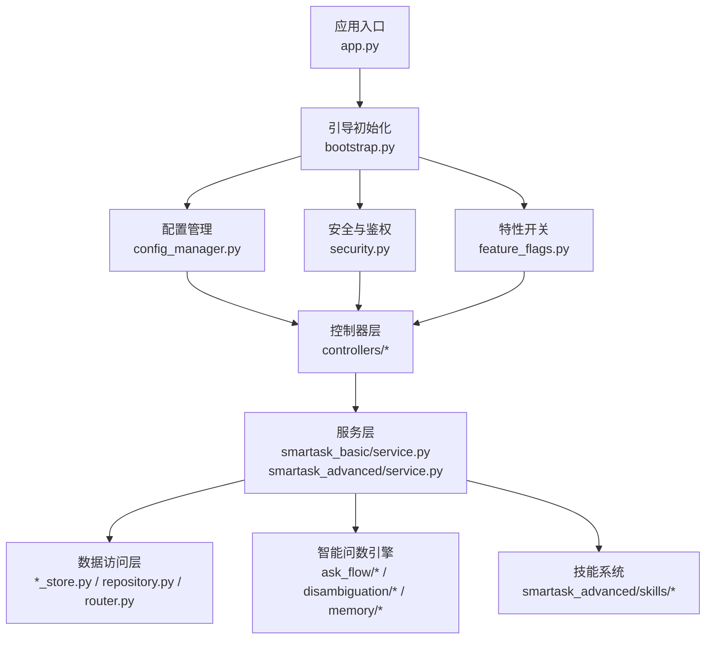
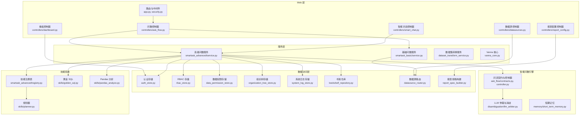
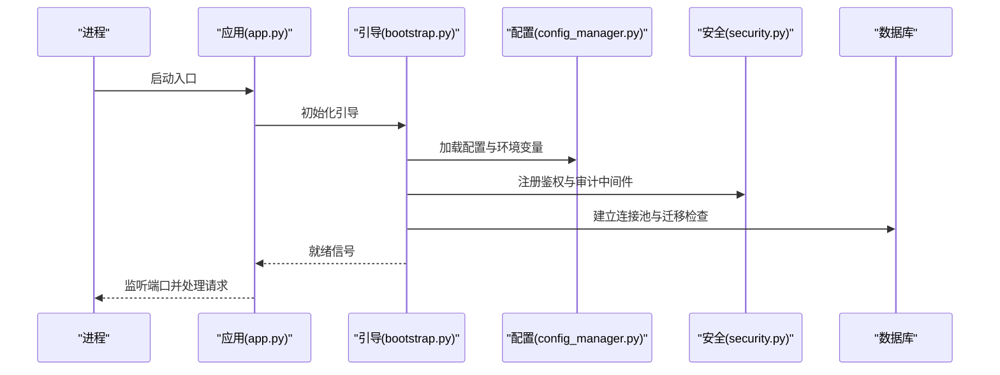
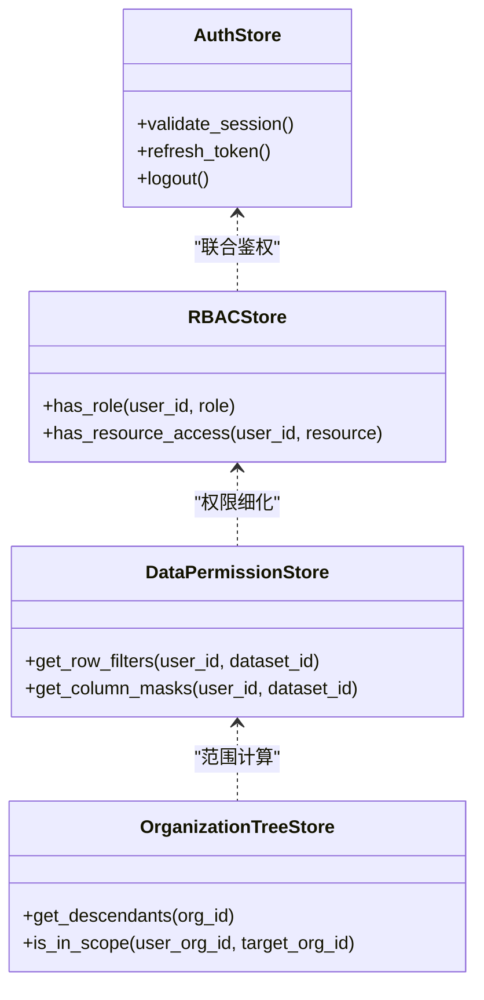
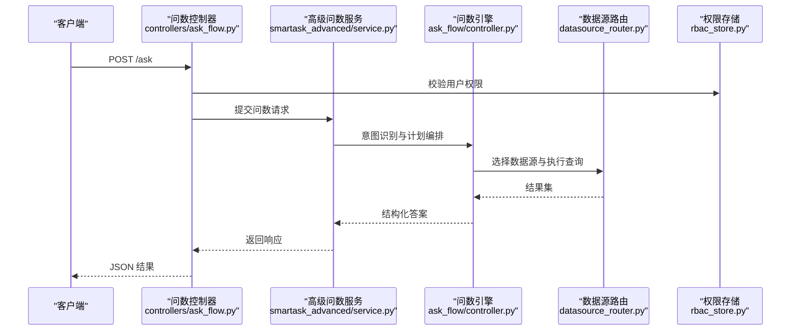
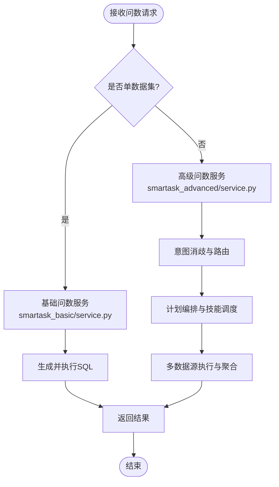
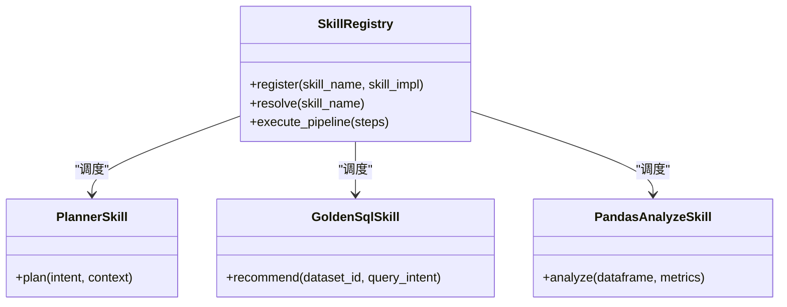
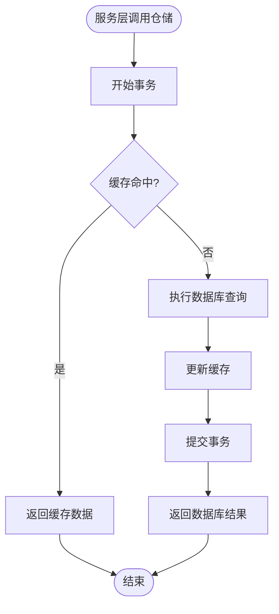
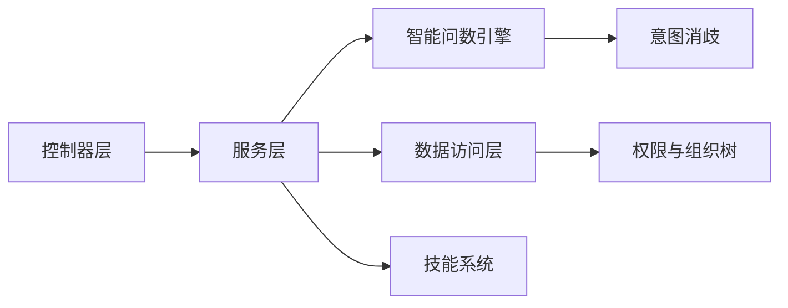

# 后端开发文档

<cite>
**本文引用的文件**   
- [app.py](file://backend/app.py)
- [bootstrap.py](file://backend/bootstrap.py)
- [config_manager.py](file://backend/config_manager.py)
- [security.py](file://backend/security.py)
- [auth_store.py](file://backend/auth_store.py)
- [rbac_store.py](file://backend/rbac_store.py)
- [data_permission_store.py](file://backend/data_permission_store.py)
- [organization_tree_store.py](file://backend/organization_tree_store.py)
- [system_log_store.py](file://backend/system_log_store.py)
- [ask_flow/controller.py](file://backend/ask_flow/controller.py)
- [ask_flow/contracts.py](file://backend/ask_flow/contracts.py)
- [controllers/ask_flow.py](file://backend/controllers/ask_flow.py)
- [controllers/smart_chat.py](file://backend/controllers/smart_chat.py)
- [controllers/datasources.py](file://backend/controllers/datasources.py)
- [controllers/report_config.py](file://backend/controllers/report_config.py)
- [controllers/dashboard.py](file://backend/controllers/dashboard.py)
- [smartask_advanced/service.py](file://backend/smartask_advanced/service.py)
- [smartask_basic/service.py](file://backend/smartask_basic/service.py)
- [smartask_advanced/registry.py](file://backend/smartask_advanced/registry.py)
- [smartask_advanced/config_store.py](file://backend/smartask_advanced/config_store.py)
- [smartask_advanced/skills/planner.py](file://backend/smartask_advanced/skills/planner.py)
- [smartask_advanced/skills/golden_sql.py](file://backend/smartask_advanced/skills/golden_sql.py)
- [smartask_advanced/skills/pandas_analyze.py](file://backend/smartask_advanced/skills/pandas_analyze.py)
- [dataset_transform_service.py](file://backend/dataset_transform_service.py)
- [vanna_core.py](file://backend/vanna_core.py)
- [feature_flags.py](file://backend/feature_flags.py)
- [agent_registry.py](file://backend/agent_registry.py)
- [disambiguation/llm_arbiter.py](file://backend/disambiguation/llm_arbiter.py)
- [memory/short_term_memory.py](file://backend/memory/short_term_memory.py)
- [bookshelf_repository.py](file://backend/bookshelf_repository.py)
- [datasource_router.py](file://backend/datasource_router.py)
- [report_spec_builder.py](file://backend/report_spec_builder.py)
- [report_contract_health.py](file://backend/report_contract_health.py)
- [runtime_migration.py](file://backend/runtime_migration.py)
</cite>

## 目录
1. [简介](#简介)
2. [项目结构](#项目结构)
3. [核心组件](#核心组件)
4. [架构总览](#架构总览)
5. [详细组件分析](#详细组件分析)
6. [依赖关系分析](#依赖关系分析)
7. [性能考虑](#性能考虑)
8. [故障排查指南](#故障排查指南)
9. [结论](#结论)
10. [附录](#附录)

## 简介
本文件面向 SmartAsk 智能问数平台的后端开发者，系统化阐述基于 Python 的 Web 应用（Flask/FastAPI 风格）的核心架构与实现要点。内容覆盖：
- 应用启动流程、配置管理、中间件机制与错误处理策略
- MVC 分层架构的职责划分与调用关系（控制器层、服务层、数据访问层）
- 智能问数核心引擎：基础问数服务与高级问数服务的区别与协作
- 技能系统插件架构：注册机制、执行管道与扩展点
- 数据访问层的仓储模式：ORM 使用、事务管理与缓存策略
- 新增控制器、服务方法与数据访问逻辑的实践示例
- 性能优化建议、调试技巧与最佳实践

## 项目结构
后端代码位于 backend 目录，采用按功能域划分的模块化组织方式：
- 入口与引导：app.py、bootstrap.py
- 配置与安全：config_manager.py、security.py、feature_flags.py
- 认证与权限：auth_store.py、rbac_store.py、data_permission_store.py、organization_tree_store.py
- 控制器层：controllers/* 提供 HTTP API 路由与请求校验
- 服务层：smartask_basic/service.py、smartask_advanced/service.py 等封装业务编排
- 数据访问层：各 *_store.py、repository.py、router.py 等实现仓储与外部集成
- 智能问数引擎：ask_flow/*、disambiguation/*、memory/*
- 技能系统：smartask_advanced/skills/* 插件化能力集合
- 工具与脚本：dataset_transform_service.py、vanna_core.py、report_spec_builder.py 等

图表来源
- [app.py:1-200](file://backend/app.py#L1-L200)
- [bootstrap.py:1-200](file://backend/bootstrap.py#L1-L200)
- [config_manager.py:1-200](file://backend/config_manager.py#L1-L200)
- [security.py:1-200](file://backend/security.py#L1-L200)
- [feature_flags.py:1-200](file://backend/feature_flags.py#L1-L200)

章节来源
- [app.py:1-200](file://backend/app.py#L1-L200)
- [bootstrap.py:1-200](file://backend/bootstrap.py#L1-L200)
- [config_manager.py:1-200](file://backend/config_manager.py#L1-L200)
- [security.py:1-200](file://backend/security.py#L1-L200)
- [feature_flags.py:1-200](file://backend/feature_flags.py#L1-L200)

## 核心组件
- 应用入口与引导
  - app.py：定义 Web 框架实例、全局异常处理、中间件挂载、路由注册与生命周期钩子
  - bootstrap.py：负责环境加载、配置注入、日志与监控初始化、数据库连接池与迁移检查
- 配置与安全
  - config_manager.py：集中式配置读取、环境变量解析、密钥解密与热更新支持
  - security.py：鉴权中间件、签名校验、速率限制、CORS 与审计日志
  - feature_flags.py：运行时特性开关，控制功能可见性与行为分支
- 认证与权限
  - auth_store.py：会话与令牌存储、登录态校验
  - rbac_store.py：角色与资源映射、接口级权限判定
  - data_permission_store.py：数据行/列级权限控制
  - organization_tree_store.py：组织架构树与范围继承
- 控制器层
  - controllers/*：HTTP 路由、参数校验、响应格式化、跨领域编排调用
- 服务层
  - smartask_basic/service.py：基础问数服务，聚焦单数据集 SQL 生成与执行
  - smartask_advanced/service.py：高级问数服务，多数据集路由、意图消歧、计划编排与结果聚合
- 数据访问层
  - *_store.py：仓储式数据访问，统一 ORM 抽象、事务边界与缓存策略
  - datasource_router.py：多数据源路由与连接选择
  - report_spec_builder.py：报表规格构建与校验
- 智能问数引擎
  - ask_flow/*：问数流程契约与控制器编排
  - disambiguation/*：意图消歧与 LLM 仲裁
  - memory/short_term_memory.py：短期记忆上下文维护
- 技能系统
  - smartask_advanced/skills/*：可插拔技能（规划器、SQL 质量评估、Pandas 分析、黄金 SQL 推荐等）
  - smartask_advanced/registry.py：技能注册表与生命周期管理

章节来源
- [app.py:1-200](file://backend/app.py#L1-L200)
- [bootstrap.py:1-200](file://backend/bootstrap.py#L1-L200)
- [config_manager.py:1-200](file://backend/config_manager.py#L1-L200)
- [security.py:1-200](file://backend/security.py#L1-L200)
- [feature_flags.py:1-200](file://backend/feature_flags.py#L1-L200)
- [auth_store.py:1-200](file://backend/auth_store.py#L1-L200)
- [rbac_store.py:1-200](file://backend/rbac_store.py#L1-L200)
- [data_permission_store.py:1-200](file://backend/data_permission_store.py#L1-L200)
- [organization_tree_store.py:1-200](file://backend/organization_tree_store.py#L1-L200)
- [controllers/ask_flow.py:1-200](file://backend/controllers/ask_flow.py#L1-L200)
- [controllers/smart_chat.py:1-200](file://backend/controllers/smart_chat.py#L1-L200)
- [smartask_basic/service.py:1-200](file://backend/smartask_basic/service.py#L1-L200)
- [smartask_advanced/service.py:1-200](file://backend/smartask_advanced/service.py#L1-L200)
- [smartask_advanced/registry.py:1-200](file://backend/smartask_advanced/registry.py#L1-L200)
- [smartask_advanced/config_store.py:1-200](file://backend/smartask_advanced/config_store.py#L1-L200)
- [smartask_advanced/skills/planner.py:1-200](file://backend/smartask_advanced/skills/planner.py#L1-L200)
- [smartask_advanced/skills/golden_sql.py:1-200](file://backend/smartask_advanced/skills/golden_sql.py#L1-L200)
- [smartask_advanced/skills/pandas_analyze.py:1-200](file://backend/smartask_advanced/skills/pandas_analyze.py#L1-L200)
- [dataset_transform_service.py:1-200](file://backend/dataset_transform_service.py#L1-L200)
- [vanna_core.py:1-200](file://backend/vanna_core.py#L1-L200)
- [disambiguation/llm_arbiter.py:1-200](file://backend/disambiguation/llm_arbiter.py#L1-L200)
- [memory/short_term_memory.py:1-200](file://backend/memory/short_term_memory.py#L1-L200)
- [bookshelf_repository.py:1-200](file://backend/bookshelf_repository.py#L1-L200)
- [datasource_router.py:1-200](file://backend/datasource_router.py#L1-L200)
- [report_spec_builder.py:1-200](file://backend/report_spec_builder.py#L1-L200)
- [report_contract_health.py:1-200](file://backend/report_contract_health.py#L1-L200)
- [runtime_migration.py:1-200](file://backend/runtime_migration.py#L1-L200)

## 架构总览
SmartAsk 后端采用“控制器-服务-数据访问”三层架构，结合“智能问数引擎”和“技能系统插件”形成可扩展的问答流水线。

图表来源
- [app.py:1-200](file://backend/app.py#L1-L200)
- [security.py:1-200](file://backend/security.py#L1-L200)
- [controllers/ask_flow.py:1-200](file://backend/controllers/ask_flow.py#L1-L200)
- [controllers/smart_chat.py:1-200](file://backend/controllers/smart_chat.py#L1-L200)
- [controllers/datasources.py:1-200](file://backend/controllers/datasources.py#L1-L200)
- [controllers/report_config.py:1-200](file://backend/controllers/report_config.py#L1-L200)
- [controllers/dashboard.py:1-200](file://backend/controllers/dashboard.py#L1-L200)
- [smartask_basic/service.py:1-200](file://backend/smartask_basic/service.py#L1-L200)
- [smartask_advanced/service.py:1-200](file://backend/smartask_advanced/service.py#L1-L200)
- [dataset_transform_service.py:1-200](file://backend/dataset_transform_service.py#L1-L200)
- [vanna_core.py:1-200](file://backend/vanna_core.py#L1-L200)
- [auth_store.py:1-200](file://backend/auth_store.py#L1-L200)
- [rbac_store.py:1-200](file://backend/rbac_store.py#L1-L200)
- [data_permission_store.py:1-200](file://backend/data_permission_store.py#L1-L200)
- [organization_tree_store.py:1-200](file://backend/organization_tree_store.py#L1-L200)
- [system_log_store.py:1-200](file://backend/system_log_store.py#L1-L200)
- [bookshelf_repository.py:1-200](file://backend/bookshelf_repository.py#L1-L200)
- [datasource_router.py:1-200](file://backend/datasource_router.py#L1-L200)
- [report_spec_builder.py:1-200](file://backend/report_spec_builder.py#L1-L200)
- [ask_flow/contracts.py:1-200](file://backend/ask_flow/contracts.py#L1-L200)
- [ask_flow/controller.py:1-200](file://backend/ask_flow/controller.py#L1-L200)
- [disambiguation/llm_arbiter.py:1-200](file://backend/disambiguation/llm_arbiter.py#L1-L200)
- [memory/short_term_memory.py:1-200](file://backend/memory/short_term_memory.py#L1-L200)
- [smartask_advanced/registry.py:1-200](file://backend/smartask_advanced/registry.py#L1-L200)
- [smartask_advanced/skills/planner.py:1-200](file://backend/smartask_advanced/skills/planner.py#L1-L200)
- [smartask_advanced/skills/golden_sql.py:1-200](file://backend/smartask_advanced/skills/golden_sql.py#L1-L200)
- [smartask_advanced/skills/pandas_analyze.py:1-200](file://backend/smartask_advanced/skills/pandas_analyze.py#L1-L200)

## 详细组件分析

### 应用启动与引导流程
- 入口 app.py 负责创建 Web 框架实例、注册全局异常处理器、挂载中间件（鉴权、限流、审计）、加载路由并启动服务
- bootstrap.py 在进程启动时完成配置加载、日志初始化、数据库连接池预热、迁移检查与特性开关加载
- 关键顺序：配置加载 → 安全中间件 → 路由注册 → 健康检查端点 → 服务就绪信号

图表来源
- [app.py:1-200](file://backend/app.py#L1-L200)
- [bootstrap.py:1-200](file://backend/bootstrap.py#L1-L200)
- [config_manager.py:1-200](file://backend/config_manager.py#L1-L200)
- [security.py:1-200](file://backend/security.py#L1-L200)

章节来源
- [app.py:1-200](file://backend/app.py#L1-L200)
- [bootstrap.py:1-200](file://backend/bootstrap.py#L1-L200)
- [config_manager.py:1-200](file://backend/config_manager.py#L1-L200)
- [security.py:1-200](file://backend/security.py#L1-L200)

### 配置管理与特性开关
- config_manager.py 提供统一的配置读取接口，支持环境变量、配置文件与加密密钥解码
- feature_flags.py 暴露运行时特性开关，用于灰度发布与功能裁剪
- 建议将敏感配置通过环境变量注入，并在启动阶段进行合法性校验

章节来源
- [config_manager.py:1-200](file://backend/config_manager.py#L1-L200)
- [feature_flags.py:1-200](file://backend/feature_flags.py#L1-L200)

### 中间件与错误处理
- security.py 实现鉴权、签名校验、CORS、限流与审计日志
- app.py 中注册全局异常处理器，统一返回错误码与消息，便于前端一致化处理
- 建议在中间件中记录请求链路 ID，便于分布式追踪

章节来源
- [security.py:1-200](file://backend/security.py#L1-L200)
- [app.py:1-200](file://backend/app.py#L1-L200)

### 认证与权限体系
- auth_store.py：会话与令牌存储，登录态校验与刷新
- rbac_store.py：角色-资源映射，接口级权限判定
- data_permission_store.py：数据行/列级权限控制，结合组织树进行范围过滤
- organization_tree_store.py：组织树结构与继承规则，支撑数据权限范围计算

图表来源
- [auth_store.py:1-200](file://backend/auth_store.py#L1-L200)
- [rbac_store.py:1-200](file://backend/rbac_store.py#L1-L200)
- [data_permission_store.py:1-200](file://backend/data_permission_store.py#L1-L200)
- [organization_tree_store.py:1-200](file://backend/organization_tree_store.py#L1-L200)

章节来源
- [auth_store.py:1-200](file://backend/auth_store.py#L1-L200)
- [rbac_store.py:1-200](file://backend/rbac_store.py#L1-L200)
- [data_permission_store.py:1-200](file://backend/data_permission_store.py#L1-L200)
- [organization_tree_store.py:1-200](file://backend/organization_tree_store.py#L1-L200)

### 控制器层职责与调用关系
- controllers/ask_flow.py：问数请求入口，参数校验、权限检查、调用服务层编排
- controllers/smart_chat.py：智能对话接口，维护会话上下文与历史
- controllers/datasources.py：数据源配置与连通性测试
- controllers/report_config.py：报表规格配置与校验
- controllers/dashboard.py：看板数据聚合与展示

图表来源
- [controllers/ask_flow.py:1-200](file://backend/controllers/ask_flow.py#L1-L200)
- [smartask_advanced/service.py:1-200](file://backend/smartask_advanced/service.py#L1-L200)
- [ask_flow/controller.py:1-200](file://backend/ask_flow/controller.py#L1-L200)
- [datasource_router.py:1-200](file://backend/datasource_router.py#L1-L200)
- [rbac_store.py:1-200](file://backend/rbac_store.py#L1-L200)

章节来源
- [controllers/ask_flow.py:1-200](file://backend/controllers/ask_flow.py#L1-L200)
- [controllers/smart_chat.py:1-200](file://backend/controllers/smart_chat.py#L1-L200)
- [controllers/datasources.py:1-200](file://backend/controllers/datasources.py#L1-L200)
- [controllers/report_config.py:1-200](file://backend/controllers/report_config.py#L1-L200)
- [controllers/dashboard.py:1-200](file://backend/controllers/dashboard.py#L1-L200)

### 智能问数核心引擎：基础与高级服务
- 基础问数服务（smartask_basic/service.py）：针对单一数据集的意图理解、SQL 生成与执行，强调低延迟与高吞吐
- 高级问数服务（smartask_advanced/service.py）：多数据集路由、意图消歧、计划编排、结果聚合与质量评估
- 两者协作：基础服务作为快速路径，复杂场景交由高级服务处理；必要时回退到基础服务保证可用性

图表来源
- [smartask_basic/service.py:1-200](file://backend/smartask_basic/service.py#L1-L200)
- [smartask_advanced/service.py:1-200](file://backend/smartask_advanced/service.py#L1-L200)
- [disambiguation/llm_arbiter.py:1-200](file://backend/disambiguation/llm_arbiter.py#L1-L200)

章节来源
- [smartask_basic/service.py:1-200](file://backend/smartask_basic/service.py#L1-L200)
- [smartask_advanced/service.py:1-200](file://backend/smartask_advanced/service.py#L1-L200)
- [ask_flow/contracts.py:1-200](file://backend/ask_flow/contracts.py#L1-L200)
- [ask_flow/controller.py:1-200](file://backend/ask_flow/controller.py#L1-L200)
- [disambiguation/llm_arbiter.py:1-200](file://backend/disambiguation/llm_arbiter.py#L1-L200)

### 技能系统插件架构
- 注册机制：smartask_advanced/registry.py 提供技能注册表，支持动态发现与生命周期管理
- 执行管道：服务层根据意图选择技能节点，依次执行（如规划器、SQL 质量评估、Pandas 分析）
- 扩展点：新技能只需实现标准接口并注册到注册表，即可被管道自动调度

图表来源
- [smartask_advanced/registry.py:1-200](file://backend/smartask_advanced/registry.py#L1-L200)
- [smartask_advanced/skills/planner.py:1-200](file://backend/smartask_advanced/skills/planner.py#L1-L200)
- [smartask_advanced/skills/golden_sql.py:1-200](file://backend/smartask_advanced/skills/golden_sql.py#L1-L200)
- [smartask_advanced/skills/pandas_analyze.py:1-200](file://backend/smartask_advanced/skills/pandas_analyze.py#L1-L200)

章节来源
- [smartask_advanced/registry.py:1-200](file://backend/smartask_advanced/registry.py#L1-L200)
- [smartask_advanced/skills/planner.py:1-200](file://backend/smartask_advanced/skills/planner.py#L1-L200)
- [smartask_advanced/skills/golden_sql.py:1-200](file://backend/smartask_advanced/skills/golden_sql.py#L1-L200)
- [smartask_advanced/skills/pandas_analyze.py:1-200](file://backend/smartask_advanced/skills/pandas_analyze.py#L1-L200)

### 数据访问层仓储模式
- 仓储抽象：*_store.py 提供统一的数据访问接口，屏蔽底层 ORM 差异
- 事务管理：服务层明确事务边界，确保读写一致性
- 缓存策略：热点数据（如权限、组织树）采用内存缓存或 Redis，降低数据库压力
- 数据源路由：datasource_router.py 根据数据集元数据选择合适的数据源连接

图表来源
- [auth_store.py:1-200](file://backend/auth_store.py#L1-L200)
- [rbac_store.py:1-200](file://backend/rbac_store.py#L1-L200)
- [data_permission_store.py:1-200](file://backend/data_permission_store.py#L1-L200)
- [organization_tree_store.py:1-200](file://backend/organization_tree_store.py#L1-L200)
- [datasource_router.py:1-200](file://backend/datasource_router.py#L1-L200)

章节来源
- [auth_store.py:1-200](file://backend/auth_store.py#L1-L200)
- [rbac_store.py:1-200](file://backend/rbac_store.py#L1-L200)
- [data_permission_store.py:1-200](file://backend/data_permission_store.py#L1-L200)
- [organization_tree_store.py:1-200](file://backend/organization_tree_store.py#L1-L200)
- [datasource_router.py:1-200](file://backend/datasource_router.py#L1-L200)

### 新增控制器、服务方法与数据访问逻辑实践
- 新增控制器
  - 在 controllers/ 下新建模块，定义路由与请求校验
  - 在 app.py 中注册路由与中间件
- 新增服务方法
  - 在 smartask_basic/service.py 或 smartask_advanced/service.py 中添加编排逻辑
  - 通过 ask_flow/contracts.py 定义的契约进行输入输出约束
- 新增数据访问逻辑
  - 在 *_store.py 中实现仓储方法，封装 ORM 操作
  - 在服务层调用仓储方法，并确保事务边界正确

章节来源
- [controllers/ask_flow.py:1-200](file://backend/controllers/ask_flow.py#L1-L200)
- [app.py:1-200](file://backend/app.py#L1-L200)
- [smartask_basic/service.py:1-200](file://backend/smartask_basic/service.py#L1-L200)
- [smartask_advanced/service.py:1-200](file://backend/smartask_advanced/service.py#L1-L200)
- [ask_flow/contracts.py:1-200](file://backend/ask_flow/contracts.py#L1-L200)
- [auth_store.py:1-200](file://backend/auth_store.py#L1-L200)

## 依赖关系分析
- 控制器层依赖服务层，服务层依赖数据访问层与智能问数引擎
- 技能系统通过注册表解耦，服务层按需调度
- 权限与组织树为所有数据访问的前置条件

图表来源
- [controllers/ask_flow.py:1-200](file://backend/controllers/ask_flow.py#L1-L200)
- [smartask_advanced/service.py:1-200](file://backend/smartask_advanced/service.py#L1-L200)
- [ask_flow/controller.py:1-200](file://backend/ask_flow/controller.py#L1-L200)
- [disambiguation/llm_arbiter.py:1-200](file://backend/disambiguation/llm_arbiter.py#L1-L200)
- [rbac_store.py:1-200](file://backend/rbac_store.py#L1-L200)
- [organization_tree_store.py:1-200](file://backend/organization_tree_store.py#L1-L200)

章节来源
- [controllers/ask_flow.py:1-200](file://backend/controllers/ask_flow.py#L1-L200)
- [smartask_advanced/service.py:1-200](file://backend/smartask_advanced/service.py#L1-L200)
- [ask_flow/controller.py:1-200](file://backend/ask_flow/controller.py#L1-L200)
- [disambiguation/llm_arbiter.py:1-200](file://backend/disambiguation/llm_arbiter.py#L1-L200)
- [rbac_store.py:1-200](file://backend/rbac_store.py#L1-L200)
- [organization_tree_store.py:1-200](file://backend/organization_tree_store.py#L1-L200)

## 性能考虑
- 连接池与并发：合理设置数据库连接池大小，避免连接耗尽
- 缓存策略：对热点权限、组织树与报表规格启用缓存，减少重复查询
- 异步与批处理：对耗时任务（如批量导入、报表生成）采用异步队列
- 查询优化：SQL 生成后加入执行计划分析与索引建议
- 限流与降级：在高负载时对非核心功能进行降级，保障核心问数链路稳定

[本节为通用指导，不直接分析具体文件]

## 故障排查指南
- 日志与审计：通过 system_log_store.py 记录关键操作与错误堆栈
- 健康检查：在 app.py 中暴露健康检查端点，便于运维监控
- 权限问题：优先检查 rbac_store.py 与 data_permission_store.py 的权限映射
- 数据源连通性：使用 controllers/datasources.py 提供的测试接口验证连接
- 意图消歧失败：查看 disambiguation/llm_arbiter.py 的仲裁日志与评分

章节来源
- [system_log_store.py:1-200](file://backend/system_log_store.py#L1-L200)
- [app.py:1-200](file://backend/app.py#L1-L200)
- [rbac_store.py:1-200](file://backend/rbac_store.py#L1-L200)
- [data_permission_store.py:1-200](file://backend/data_permission_store.py#L1-L200)
- [controllers/datasources.py:1-200](file://backend/controllers/datasources.py#L1-L200)
- [disambiguation/llm_arbiter.py:1-200](file://backend/disambiguation/llm_arbiter.py#L1-L200)

## 结论
SmartAsk 后端以清晰的 MVC 分层为基础，结合智能问数引擎与技能系统插件，实现了灵活可扩展的智能问数能力。通过统一的配置管理、安全中间件与仓储模式，保障了系统的稳定性与可维护性。建议在生产环境中强化监控与告警，持续优化查询与缓存策略，以提升整体性能与用户体验。

[本节为总结性内容，不直接分析具体文件]

## 附录
- 部署与运行：参考根目录部署脚本与 docker-compose.yml
- 测试与验证：使用 tests/ 下的单元测试与集成测试用例
- 扩展指南：遵循技能注册表与服务契约，逐步扩展新功能

[本节为补充信息，不直接分析具体文件]