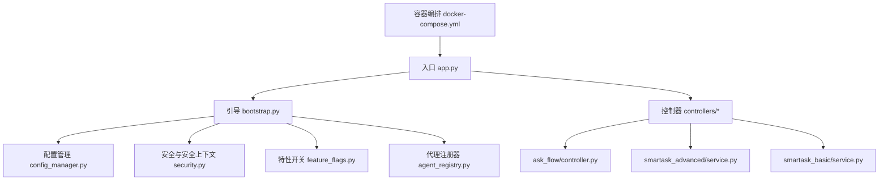
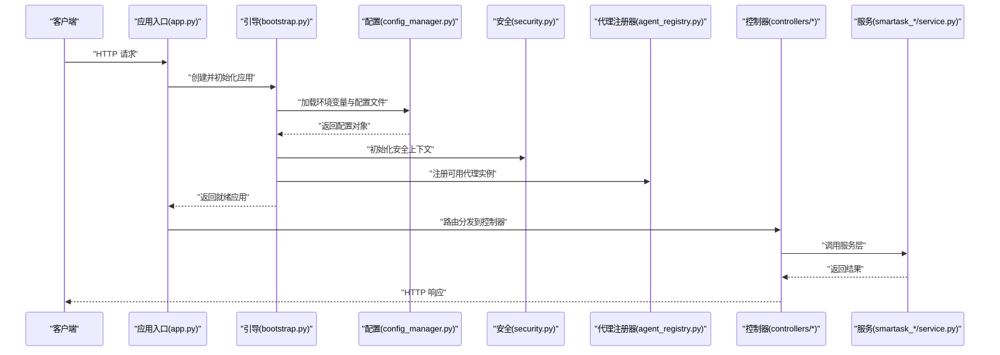
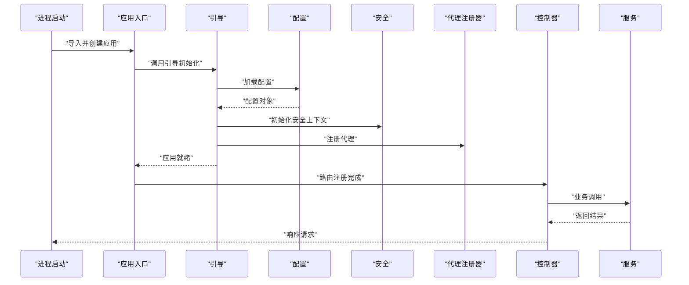
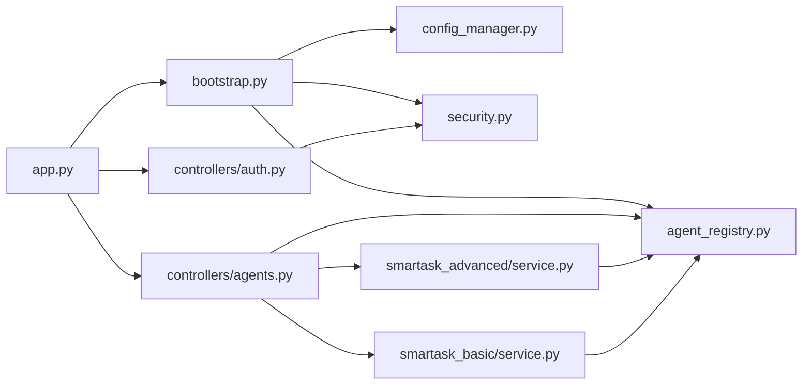

# 应用核心框架

<cite>
**本文引用的文件**   
- [app.py](file://backend/app.py)
- [bootstrap.py](file://backend/bootstrap.py)
- [config_manager.py](file://backend/config_manager.py)
- [agent_registry.py](file://backend/agent_registry.py)
- [security.py](file://backend/security.py)
- [feature_flags.py](file://backend/feature_flags.py)
- [controllers/auth.py](file://backend/controllers/auth.py)
- [controllers/agents.py](file://backend/controllers/agents.py)
- [ask_flow/controller.py](file://backend/ask_flow/controller.py)
- [smartask_advanced/service.py](file://backend/smartask_advanced/service.py)
- [smartask_basic/service.py](file://backend/smartask_basic/service.py)
- [docker-compose.yml](file://docker-compose.yml)
</cite>

## 目录
1. [简介](#简介)
2. [项目结构](#项目结构)
3. [核心组件](#核心组件)
4. [架构总览](#架构总览)
5. [详细组件分析](#详细组件分析)
6. [依赖关系分析](#依赖关系分析)
7. [性能考量](#性能考量)
8. [故障排查指南](#故障排查指南)
9. [结论](#结论)
10. [附录](#附录)

## 简介
本文件面向 SmartAsk 智能问数平台的应用核心框架，聚焦后端启动流程、配置管理、代理注册器与模块化架构。文档覆盖 Flask/FastAPI 应用的初始化、中间件注册、路由装配、错误处理机制；阐述环境变量加载、配置文件合并与动态更新；说明 AI 代理实例的注册与管理；并给出扩展应用、新增中间件与配置项的实践指引，同时包含性能监控、日志记录与调试技巧。

## 项目结构
后端采用模块化组织：入口与引导程序负责应用生命周期，配置管理器统一环境/文件配置，控制器按功能域划分，服务层封装业务逻辑，高级能力模块提供可插拔技能与策略。

图表来源
- [app.py](file://backend/app.py)
- [bootstrap.py](file://backend/bootstrap.py)
- [config_manager.py](file://backend/config_manager.py)
- [security.py](file://backend/security.py)
- [feature_flags.py](file://backend/feature_flags.py)
- [agent_registry.py](file://backend/agent_registry.py)
- [controllers/auth.py](file://backend/controllers/auth.py)
- [controllers/agents.py](file://backend/controllers/agents.py)
- [ask_flow/controller.py](file://backend/ask_flow/controller.py)
- [smartask_advanced/service.py](file://backend/smartask_advanced/service.py)
- [smartask_basic/service.py](file://backend/smartask_basic/service.py)
- [docker-compose.yml](file://docker-compose.yml)

章节来源
- [app.py](file://backend/app.py)
- [bootstrap.py](file://backend/bootstrap.py)
- [config_manager.py](file://backend/config_manager.py)
- [agent_registry.py](file://backend/agent_registry.py)
- [security.py](file://backend/security.py)
- [feature_flags.py](file://backend/feature_flags.py)
- [controllers/auth.py](file://backend/controllers/auth.py)
- [controllers/agents.py](file://backend/controllers/agents.py)
- [ask_flow/controller.py](file://backend/ask_flow/controller.py)
- [smartask_advanced/service.py](file://backend/smartask_advanced/service.py)
- [smartask_basic/service.py](file://backend/smartask_basic/service.py)
- [docker-compose.yml](file://docker-compose.yml)

## 核心组件
- 应用入口与引导
  - 入口文件负责创建应用实例、加载配置、注册中间件与路由、挂载错误处理器，并在开发模式下启用热重载。
  - 引导程序负责顺序化初始化：读取环境变量与配置文件、构建全局配置对象、初始化安全上下文、特性开关、代理注册器、数据库连接池等，最后返回已就绪的应用实例。
- 配置管理系统
  - 支持从环境变量、JSON/YAML/TOML 配置文件与环境特定覆盖文件（如 .env、dev/prod）中加载配置，提供默认值、类型校验与运行时更新接口。
- 代理注册器
  - 提供统一的代理工厂与注册表，支持按名称或能力维度注册不同 AI 代理实例，实现按需选择与切换。
- 安全与鉴权
  - 集中处理认证、授权、请求签名、限流与审计日志，为控制器提供安全的上下文注入。
- 特性开关
  - 以键值形式暴露功能开关，支持运行时刷新，便于灰度发布与实验控制。
- 控制器与服务层
  - 控制器负责 HTTP 协议适配、参数校验与响应格式化；服务层封装领域逻辑，调用外部系统或内部工具链。

章节来源
- [app.py](file://backend/app.py)
- [bootstrap.py](file://backend/bootstrap.py)
- [config_manager.py](file://backend/config_manager.py)
- [agent_registry.py](file://backend/agent_registry.py)
- [security.py](file://backend/security.py)
- [feature_flags.py](file://backend/feature_flags.py)
- [controllers/auth.py](file://backend/controllers/auth.py)
- [controllers/agents.py](file://backend/controllers/agents.py)
- [ask_flow/controller.py](file://backend/ask_flow/controller.py)
- [smartask_advanced/service.py](file://backend/smartask_advanced/service.py)
- [smartask_basic/service.py](file://backend/smartask_basic/service.py)

## 架构总览
SmartAsk 后端采用“入口 + 引导 + 配置 + 安全 + 控制器 + 服务”的分层架构。入口仅做装配，引导负责初始化顺序，配置与安全贯穿全链路，控制器对外暴露 API，服务层承载业务。

图表来源
- [app.py](file://backend/app.py)
- [bootstrap.py](file://backend/bootstrap.py)
- [config_manager.py](file://backend/config_manager.py)
- [security.py](file://backend/security.py)
- [agent_registry.py](file://backend/agent_registry.py)
- [controllers/auth.py](file://backend/controllers/auth.py)
- [controllers/agents.py](file://backend/controllers/agents.py)
- [smartask_advanced/service.py](file://backend/smartask_advanced/service.py)
- [smartask_basic/service.py](file://backend/smartask_basic/service.py)

## 详细组件分析

### 应用启动流程（Flask/FastAPI 通用模式）
- 应用初始化
  - 创建应用实例，设置基础路径、静态资源与模板引擎（如适用）。
  - 加载全局配置对象，注入到应用上下文。
- 中间件注册
  - 注册跨域、请求日志、访问审计、限流、压缩等中间件。
  - 在请求进入控制器前进行鉴权与参数校验。
- 路由配置
  - 按功能域导入控制器蓝图/路由集合，统一挂载到根路径或子路径。
  - 为每个路由绑定异常处理器与响应转换器。
- 错误处理
  - 定义全局异常映射，将业务异常转换为标准错误响应。
  - 对未捕获异常进行兜底处理，记录结构化日志并返回友好提示。

章节来源
- [app.py](file://backend/app.py)
- [bootstrap.py](file://backend/bootstrap.py)

### 配置管理系统设计
- 环境变量管理
  - 通过环境变量注入敏感信息与运行期差异配置，支持类型转换与默认值。
- 配置文件加载
  - 支持多格式配置文件与环境覆盖，按优先级合并：默认 < 环境文件 < 环境变量。
- 动态配置更新
  - 提供热更新接口，监听配置变更事件，触发相关组件重新初始化（如连接池、缓存、特性开关）。
- 配置校验与审计
  - 启动时执行必填字段校验与范围检查，失败则快速失败。
  - 记录关键配置变更与使用点，便于问题回溯。

章节来源
- [config_manager.py](file://backend/config_manager.py)

### 代理注册器的实现
- 注册与管理
  - 提供注册函数与工厂方法，支持按名称、能力标签或版本注册代理实例。
  - 维护代理元数据（能力、权重、健康状态），用于路由与负载均衡。
- 选择与切换
  - 根据请求上下文（如用户角色、数据集权限、意图识别）选择合适代理。
  - 支持灰度与回滚，基于特性开关或配置项动态切换。
- 生命周期与健康检查
  - 启动时预热常用代理，定期执行健康检查，剔除不可用实例。
  - 提供统计指标（QPS、延迟、错误率）供监控告警。

章节来源
- [agent_registry.py](file://backend/agent_registry.py)
- [controllers/agents.py](file://backend/controllers/agents.py)

### 安全与鉴权
- 认证与授权
  - 集成统一身份源，验证令牌与权限，注入用户上下文到请求。
  - 基于角色的访问控制（RBAC）与资源级权限校验。
- 安全中间件
  - 请求签名、防重放、速率限制、输入清洗与输出编码。
- 审计与追踪
  - 记录关键操作审计日志，关联请求 ID 与用户信息。

章节来源
- [security.py](file://backend/security.py)
- [controllers/auth.py](file://backend/controllers/auth.py)

### 特性开关
- 开关管理
  - 以键值形式管理功能开关，支持运行时刷新与持久化。
- 使用方式
  - 在控制器或服务层按开关分支执行差异化逻辑，配合灰度发布。
- 监控与回滚
  - 统计开关命中率与副作用，支持一键回滚。

章节来源
- [feature_flags.py](file://backend/feature_flags.py)

### 控制器与服务层协作
- 控制器职责
  - 解析请求、参数校验、调用服务层、格式化响应、处理业务异常。
- 服务层职责
  - 封装领域逻辑，协调多个子系统（如数据库、AI 代理、缓存、消息队列）。
- 典型流程
  - 问数流程控制器接收自然语言问题，调用 ask_flow 控制器进行意图识别与路由，再委托具体服务执行查询与生成回答。

章节来源
- [controllers/auth.py](file://backend/controllers/auth.py)
- [controllers/agents.py](file://backend/controllers/agents.py)
- [ask_flow/controller.py](file://backend/ask_flow/controller.py)
- [smartask_advanced/service.py](file://backend/smartask_advanced/service.py)
- [smartask_basic/service.py](file://backend/smartask_basic/service.py)

### 启动时序图（示例）

图表来源
- [app.py](file://backend/app.py)
- [bootstrap.py](file://backend/bootstrap.py)
- [config_manager.py](file://backend/config_manager.py)
- [security.py](file://backend/security.py)
- [agent_registry.py](file://backend/agent_registry.py)
- [controllers/auth.py](file://backend/controllers/auth.py)
- [controllers/agents.py](file://backend/controllers/agents.py)
- [smartask_advanced/service.py](file://backend/smartask_advanced/service.py)
- [smartask_basic/service.py](file://backend/smartask_basic/service.py)

## 依赖关系分析
- 模块耦合
  - 入口与引导低耦合，通过配置与安全上下文解耦控制器与服务。
  - 控制器依赖服务层，服务层依赖代理注册器与外部系统。
- 外部依赖
  - 数据库、缓存、消息队列、AI 模型服务等通过配置与注册器接入。
- 循环依赖规避
  - 使用延迟导入与接口抽象避免循环引用。

图表来源
- [app.py](file://backend/app.py)
- [bootstrap.py](file://backend/bootstrap.py)
- [config_manager.py](file://backend/config_manager.py)
- [security.py](file://backend/security.py)
- [agent_registry.py](file://backend/agent_registry.py)
- [controllers/auth.py](file://backend/controllers/auth.py)
- [controllers/agents.py](file://backend/controllers/agents.py)
- [smartask_advanced/service.py](file://backend/smartask_advanced/service.py)
- [smartask_basic/service.py](file://backend/smartask_basic/service.py)

章节来源
- [app.py](file://backend/app.py)
- [bootstrap.py](file://backend/bootstrap.py)
- [config_manager.py](file://backend/config_manager.py)
- [security.py](file://backend/security.py)
- [agent_registry.py](file://backend/agent_registry.py)
- [controllers/auth.py](file://backend/controllers/auth.py)
- [controllers/agents.py](file://backend/controllers/agents.py)
- [smartask_advanced/service.py](file://backend/smartask_advanced/service.py)
- [smartask_basic/service.py](file://backend/smartask_basic/service.py)

## 性能考量
- 启动优化
  - 延迟初始化非关键组件，减少冷启动时间。
  - 预编译路由与模板，避免首次请求抖动。
- 运行时优化
  - 连接池复用（数据库、HTTP、缓存）。
  - 异步处理耗时任务，避免阻塞主线程。
  - 合理设置超时与重试策略，提升鲁棒性。
- 监控与观测
  - 暴露关键指标（QPS、延迟、错误率、资源使用）。
  - 结构化日志与分布式追踪，定位瓶颈与异常。
- 缓存策略
  - 热点数据多级缓存（内存、Redis），降低下游压力。
  - 缓存失效与一致性保障。

[本节为通用指导，不直接分析具体文件]

## 故障排查指南
- 常见问题
  - 配置缺失或类型错误导致启动失败：检查环境变量与配置文件完整性。
  - 代理注册失败：确认代理实现与元数据正确，健康检查通过。
  - 鉴权失败：核对令牌、权限与路由白名单。
- 诊断步骤
  - 查看应用日志与错误堆栈，定位异常点。
  - 使用调试模式逐步跟踪请求链路。
  - 临时关闭特性开关或降级策略，缩小问题范围。
- 恢复策略
  - 快速回滚配置与代码版本。
  - 重启受影响组件，必要时扩容。

章节来源
- [security.py](file://backend/security.py)
- [config_manager.py](file://backend/config_manager.py)
- [agent_registry.py](file://backend/agent_registry.py)

## 结论
SmartAsk 后端框架通过清晰的入口与引导、统一的配置与安全、灵活的代理注册与模块化控制器/服务，实现了高内聚、低耦合与可扩展的架构。遵循本文档的扩展实践，可快速添加中间件、配置选项与新功能，同时保持系统的稳定性与可观测性。

[本节为总结，不直接分析具体文件]

## 附录
- 部署与环境
  - 使用容器编排统一管理后端、数据库与缓存服务。
  - 环境变量与密钥管理建议通过专用服务注入。
- 扩展清单
  - 新增中间件：在引导阶段注册，确保顺序与异常处理。
  - 新增配置项：在配置管理器中声明默认值与校验规则。
  - 新增代理：在注册器中实现元数据与能力描述，提供服务层调用入口。

章节来源
- [docker-compose.yml](file://docker-compose.yml)