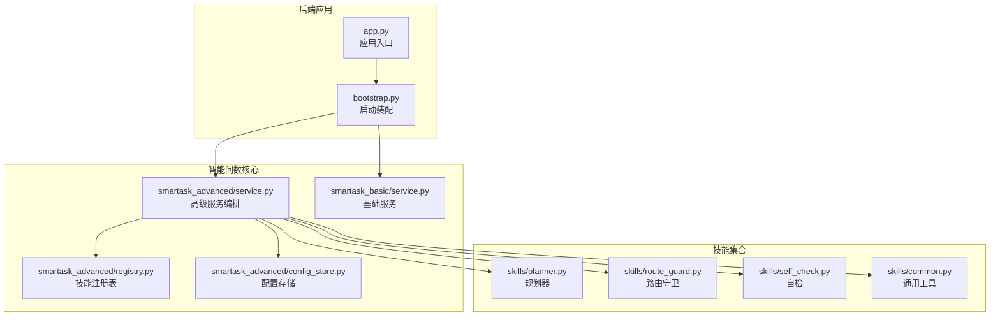
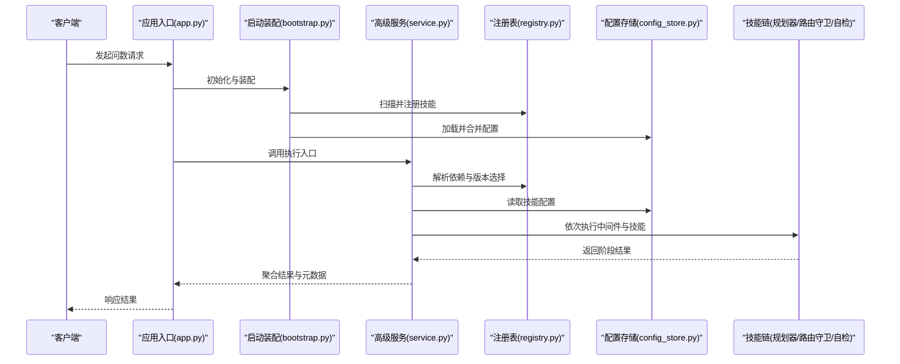
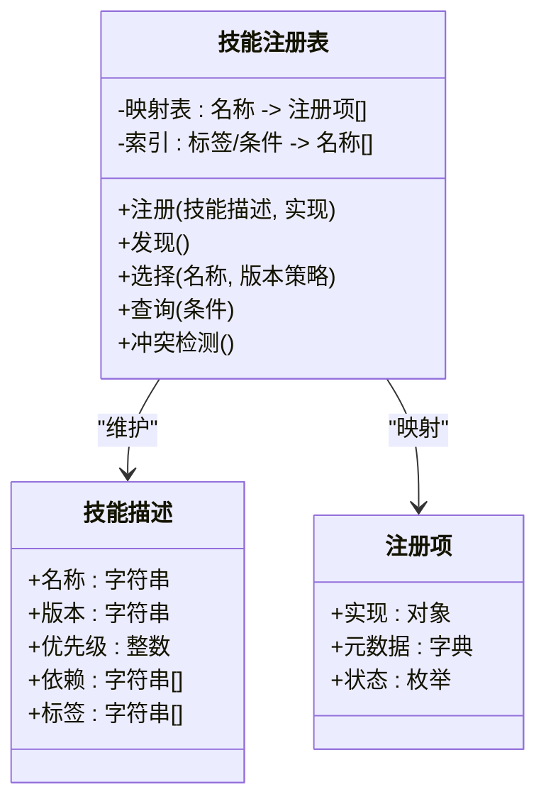
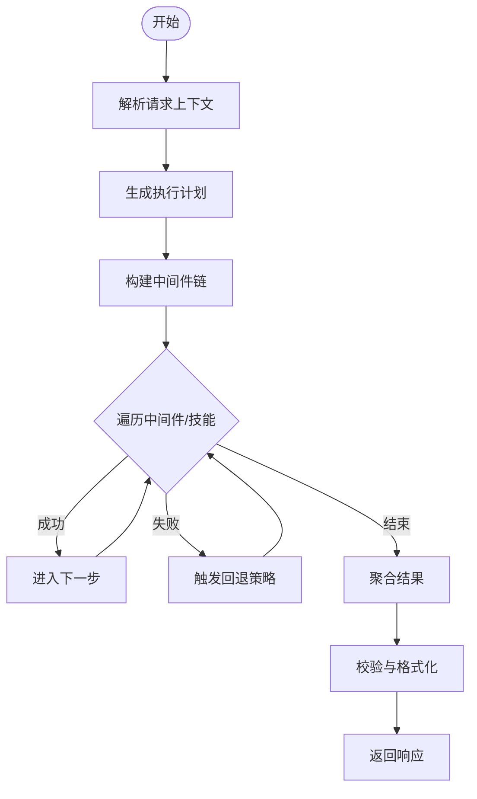
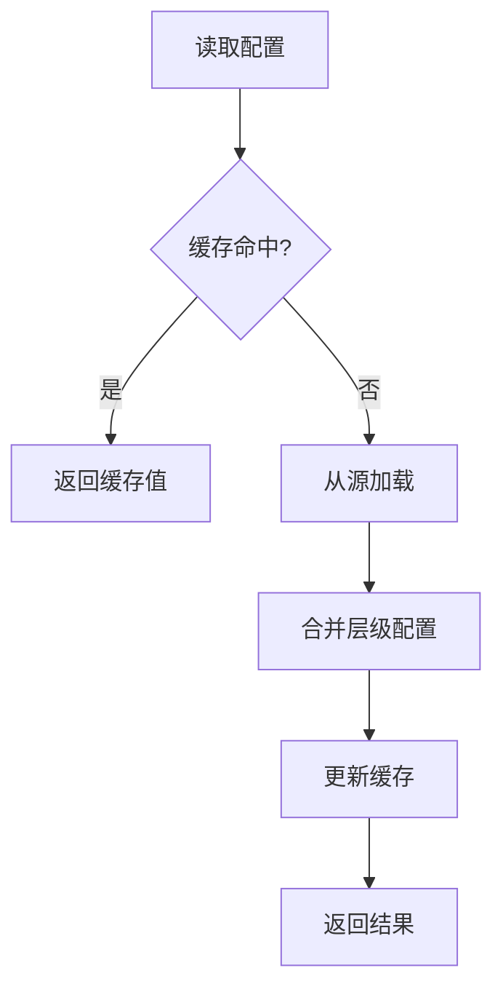
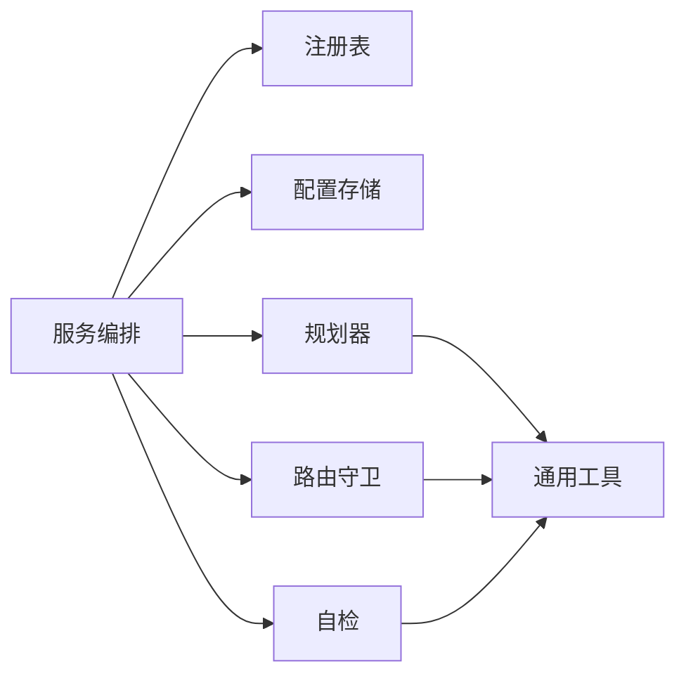

# 技能架构设计

<cite>
**本文引用的文件**   
- [backend/smartask_advanced/registry.py](file://backend/smartask_advanced/registry.py)
- [backend/smartask_advanced/service.py](file://backend/smartask_advanced/service.py)
- [backend/smartask_advanced/config_store.py](file://backend/smartask_advanced/config_store.py)
- [backend/smartask_advanced/skills/planner.py](file://backend/smartask_advanced/skills/planner.py)
- [backend/smartask_advanced/skills/route_guard.py](file://backend/smartask_advanced/skills/route_guard.py)
- [backend/smartask_advanced/skills/self_check.py](file://backend/smartask_advanced/skills/self_check.py)
- [backend/smartask_advanced/skills/common.py](file://backend/smartask_advanced/skills/common.py)
- [backend/smartask_basic/service.py](file://backend/smartask_basic/service.py)
- [backend/app.py](file://backend/app.py)
- [backend/bootstrap.py](file://backend/bootstrap.py)
</cite>

## 目录
1. [引言](#引言)
2. [项目结构](#项目结构)
3. [核心组件](#核心组件)
4. [架构总览](#架构总览)
5. [详细组件分析](#详细组件分析)
6. [依赖关系分析](#依赖关系分析)
7. [性能考量](#性能考量)
8. [故障排查指南](#故障排查指南)
9. [结论](#结论)
10. [附录](#附录)

## 引言
本文件面向 SmartAsk 技能系统的架构设计与实现，聚焦插件式技能架构的核心设计理念与工程实践。内容涵盖：
- 技能注册机制、生命周期管理、依赖注入与配置管理
- 技能注册表的工作原理（发现、加载、版本管理与冲突处理）
- 技能配置存储系统（层次结构、动态更新与缓存策略）
- 技能执行管道（中间件模式、错误处理与性能监控）
- 架构图与数据流图，说明组件交互
- 最佳实践与设计原则指导

## 项目结构
SmartAsk 的技能系统主要位于 backend/smartask_advanced 与 backend/smartask_basic 两个模块中：
- smartask_advanced：高级能力与插件化技能框架，包含注册表、服务编排、配置存储以及一系列内置技能（如规划器、路由守卫、自检等）
- smartask_basic：基础问数能力，提供简化的服务入口
- app.py 与 bootstrap.py：应用启动与初始化流程，负责装配各子系统并暴露对外接口

**图表来源** 
- [backend/app.py](file://backend/app.py)
- [backend/bootstrap.py](file://backend/bootstrap.py)
- [backend/smartask_advanced/service.py](file://backend/smartask_advanced/service.py)
- [backend/smartask_advanced/registry.py](file://backend/smartask_advanced/registry.py)
- [backend/smartask_advanced/config_store.py](file://backend/smartask_advanced/config_store.py)
- [backend/smartask_basic/service.py](file://backend/smartask_basic/service.py)
- [backend/smartask_advanced/skills/planner.py](file://backend/smartask_advanced/skills/planner.py)
- [backend/smartask_advanced/skills/route_guard.py](file://backend/smartask_advanced/skills/route_guard.py)
- [backend/smartask_advanced/skills/self_check.py](file://backend/smartask_advanced/skills/self_check.py)
- [backend/smartask_advanced/skills/common.py](file://backend/smartask_advanced/skills/common.py)

**章节来源**
- [backend/app.py](file://backend/app.py)
- [backend/bootstrap.py](file://backend/bootstrap.py)

## 核心组件
- 技能注册表（Registry）
  - 职责：技能的发现、注册、版本管理与冲突处理；提供按名称或条件查询的能力
  - 关键特性：支持多版本共存、优先级排序、冲突检测与回退策略
- 技能服务（Service）
  - 职责：编排技能执行顺序、注入依赖、协调中间件链路与结果聚合
  - 关键特性：可插拔的中间件模式、上下文传递、错误传播与恢复
- 配置存储（ConfigStore）
  - 职责：集中管理技能配置，支持层次化覆盖、动态刷新与缓存
  - 关键特性：键空间隔离、默认值合并、热更新通知
- 内置技能（Skills）
  - 规划器（Planner）：将用户意图拆解为可执行的子任务序列
  - 路由守卫（RouteGuard）：基于权限、数据集范围与业务规则进行分支决策
  - 自检（SelfCheck）：对输出质量、SQL 正确性与指标一致性进行校验
  - 通用工具（Common）：跨技能共享的工具函数与数据结构

**章节来源**
- [backend/smartask_advanced/registry.py](file://backend/smartask_advanced/registry.py)
- [backend/smartask_advanced/service.py](file://backend/smartask_advanced/service.py)
- [backend/smartask_advanced/config_store.py](file://backend/smartask_advanced/config_store.py)
- [backend/smartask_advanced/skills/planner.py](file://backend/smartask_advanced/skills/planner.py)
- [backend/smartask_advanced/skills/route_guard.py](file://backend/smartask_advanced/skills/route_guard.py)
- [backend/smartask_advanced/skills/self_check.py](file://backend/smartask_advanced/skills/self_check.py)
- [backend/smartask_advanced/skills/common.py](file://backend/smartask_advanced/skills/common.py)

## 架构总览
SmartAsk 技能系统采用“注册表 + 服务编排 + 中间件管道”的插件式架构。应用启动时完成注册表的构建与配置的加载；请求进入后由服务编排调度技能链，通过中间件实现横切关注点（鉴权、限流、日志、监控），最终返回结构化结果。

**图表来源** 
- [backend/app.py](file://backend/app.py)
- [backend/bootstrap.py](file://backend/bootstrap.py)
- [backend/smartask_advanced/service.py](file://backend/smartask_advanced/service.py)
- [backend/smartask_advanced/registry.py](file://backend/smartask_advanced/registry.py)
- [backend/smartask_advanced/config_store.py](file://backend/smartask_advanced/config_store.py)
- [backend/smartask_advanced/skills/planner.py](file://backend/smartask_advanced/skills/planner.py)
- [backend/smartask_advanced/skills/route_guard.py](file://backend/smartask_advanced/skills/route_guard.py)
- [backend/smartask_advanced/skills/self_check.py](file://backend/smartask_advanced/skills/self_check.py)

## 详细组件分析

### 技能注册表（Registry）
- 功能要点
  - 技能发现：扫描指定包或路径，识别符合约定的技能类/函数
  - 技能注册：维护名称到实现的映射，记录版本、优先级与依赖声明
  - 版本管理：支持同一技能的多版本并存，按策略选择最优版本
  - 冲突处理：当同名技能存在时，依据优先级与兼容性检查决定保留或拒绝
  - 查询接口：按名称、标签或条件检索可用技能
- 数据结构建议
  - 技能描述：名称、版本、优先级、依赖列表、能力标签
  - 注册项：实现引用、元数据、状态（启用/禁用）
- 复杂度与扩展性
  - 注册与查找时间复杂度接近 O(1)（哈希映射）
  - 版本选择与冲突检测为 O(n log n)（排序与比较）
  - 可扩展：支持插件热插拔、按需加载与延迟实例化

**图表来源** 
- [backend/smartask_advanced/registry.py](file://backend/smartask_advanced/registry.py)

**章节来源**
- [backend/smartask_advanced/registry.py](file://backend/smartask_advanced/registry.py)

### 技能服务（Service）
- 功能要点
  - 编排执行：根据输入上下文与配置生成技能执行计划
  - 依赖注入：从注册表解析依赖，构造实例并注入到技能
  - 中间件链：统一接入鉴权、限流、日志、监控、重试等横切逻辑
  - 结果聚合：收集各阶段输出，进行格式转换与校验
- 执行模型
  - 请求上下文贯穿全链路（用户、组织、数据集、权限）
  - 中间件以栈式方式入栈出栈，支持短路返回与异常捕获
  - 失败回退：在关键步骤失败时触发降级策略或替代技能

**图表来源** 
- [backend/smartask_advanced/service.py](file://backend/smartask_advanced/service.py)

**章节来源**
- [backend/smartask_advanced/service.py](file://backend/smartask_advanced/service.py)

### 配置存储（ConfigStore）
- 功能要点
  - 层次结构：支持全局、组织、会话等多级配置覆盖
  - 动态更新：监听外部变更事件，实时刷新内存缓存
  - 缓存策略：LRU/TTL 结合，保证高并发下的低延迟访问
  - 键空间隔离：按命名空间隔离不同模块的配置，避免污染
- 典型操作
  - 读取：优先命中缓存，未命中则回源加载并回填缓存
  - 写入：原子更新，广播失效事件，触发下游重建
  - 合并：按优先级合并多层配置，生成最终视图

**图表来源** 
- [backend/smartask_advanced/config_store.py](file://backend/smartask_advanced/config_store.py)

**章节来源**
- [backend/smartask_advanced/config_store.py](file://backend/smartask_advanced/config_store.py)

### 内置技能（Skills）
- 规划器（Planner）
  - 作用：将复杂问题分解为子任务序列，确定执行顺序与依赖关系
  - 关键点：任务节点建模、拓扑排序、并行度控制
- 路由守卫（RouteGuard）
  - 作用：基于权限、数据集范围与业务规则进行分支决策
  - 关键点：规则引擎、条件匹配、快速失败
- 自检（SelfCheck）
  - 作用：对输出质量、SQL 正确性与指标一致性进行校验
  - 关键点：断言集、阈值判定、告警上报
- 通用工具（Common）
  - 作用：跨技能共享的数据结构、序列化、日志与度量工具

**图表来源** 
- [backend/smartask_advanced/skills/planner.py](file://backend/smartask_advanced/skills/planner.py)
- [backend/smartask_advanced/skills/route_guard.py](file://backend/smartask_advanced/skills/route_guard.py)
- [backend/smartask_advanced/skills/self_check.py](file://backend/smartask_advanced/skills/self_check.py)
- [backend/smartask_advanced/skills/common.py](file://backend/smartask_advanced/skills/common.py)

**章节来源**
- [backend/smartask_advanced/skills/planner.py](file://backend/smartask_advanced/skills/planner.py)
- [backend/smartask_advanced/skills/route_guard.py](file://backend/smartask_advanced/skills/route_guard.py)
- [backend/smartask_advanced/skills/self_check.py](file://backend/smartask_advanced/skills/self_check.py)
- [backend/smartask_advanced/skills/common.py](file://backend/smartask_advanced/skills/common.py)

### 基础服务（Basic Service）
- 作用：提供简化的问数入口，适用于轻量场景
- 特点：减少中间件与技能链复杂度，直接调用核心能力

**章节来源**
- [backend/smartask_basic/service.py](file://backend/smartask_basic/service.py)

## 依赖关系分析
- 组件耦合
  - 服务编排强依赖注册表与配置存储，弱依赖具体技能实现
  - 技能之间通过通用工具与上下文对象通信，降低直接耦合
- 外部依赖
  - 数据库与缓存用于持久化配置与运行时状态
  - 消息总线或事件总线用于配置热更新与跨进程同步
- 循环依赖规避
  - 通过接口抽象与依赖注入避免环状引用
  - 使用事件驱动解耦横切关注点

**图表来源** 
- [backend/smartask_advanced/service.py](file://backend/smartask_advanced/service.py)
- [backend/smartask_advanced/registry.py](file://backend/smartask_advanced/registry.py)
- [backend/smartask_advanced/config_store.py](file://backend/smartask_advanced/config_store.py)
- [backend/smartask_advanced/skills/planner.py](file://backend/smartask_advanced/skills/planner.py)
- [backend/smartask_advanced/skills/route_guard.py](file://backend/smartask_advanced/skills/route_guard.py)
- [backend/smartask_advanced/skills/self_check.py](file://backend/smartask_advanced/skills/self_check.py)
- [backend/smartask_advanced/skills/common.py](file://backend/smartask_advanced/skills/common.py)

**章节来源**
- [backend/smartask_advanced/service.py](file://backend/smartask_advanced/service.py)
- [backend/smartask_advanced/registry.py](file://backend/smartask_advanced/registry.py)
- [backend/smartask_advanced/config_store.py](file://backend/smartask_advanced/config_store.py)

## 性能考量
- 注册表查询优化
  - 使用哈希映射与二级索引提升查找效率
  - 延迟实例化与懒加载减少启动开销
- 配置存储缓存
  - LRU/TTL 组合策略平衡一致性与性能
  - 批量更新与写扩散最小化
- 执行管道优化
  - 中间件链短小精悍，避免深层嵌套
  - 并行执行无依赖的子任务，缩短端到端时延
- 监控与可观测性
  - 埋点关键路径耗时与错误率
  - 指标上报与分布式追踪集成

[本节为通用指导，不直接分析具体文件]

## 故障排查指南
- 常见问题定位
  - 技能未注册：检查扫描路径与命名约定，确认注册表索引
  - 版本冲突：查看优先级与兼容性矩阵，调整版本策略
  - 配置未生效：验证层级覆盖顺序与缓存失效事件
  - 执行失败：检查中间件短路逻辑与异常传播
- 调试建议
  - 开启详细日志与上下文快照
  - 使用单元测试与集成测试覆盖关键路径
  - 引入熔断与降级开关，保障稳定性

**章节来源**
- [backend/smartask_advanced/registry.py](file://backend/smartask_advanced/registry.py)
- [backend/smartask_advanced/config_store.py](file://backend/smartask_advanced/config_store.py)
- [backend/smartask_advanced/service.py](file://backend/smartask_advanced/service.py)

## 结论
SmartAsk 技能系统通过注册表与服务编排实现了高度可扩展的插件式架构。借助层次化配置与中间件管道，系统在灵活性与性能之间取得良好平衡。遵循本文的最佳实践与设计原则，可有效提升系统的可维护性与演进能力。

[本节为总结性内容，不直接分析具体文件]

## 附录
- 最佳实践
  - 技能命名与版本规范：语义化版本与稳定 API 契约
  - 配置分层与覆盖策略：明确优先级与默认值
  - 中间件设计：单一职责、幂等与可组合
  - 错误处理：统一异常模型与回退策略
  - 性能优化：缓存、批处理与异步化
- 设计原则
  - 开闭原则：对扩展开放，对修改封闭
  - 依赖倒置：面向接口编程
  - 单一职责：每个组件只做一件事
  - 最少知识：降低耦合，提高内聚

[本节为概念性内容，不直接分析具体文件]