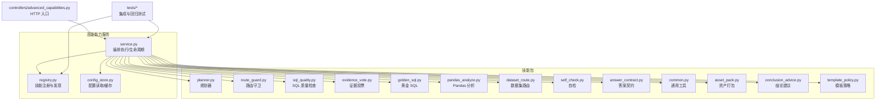
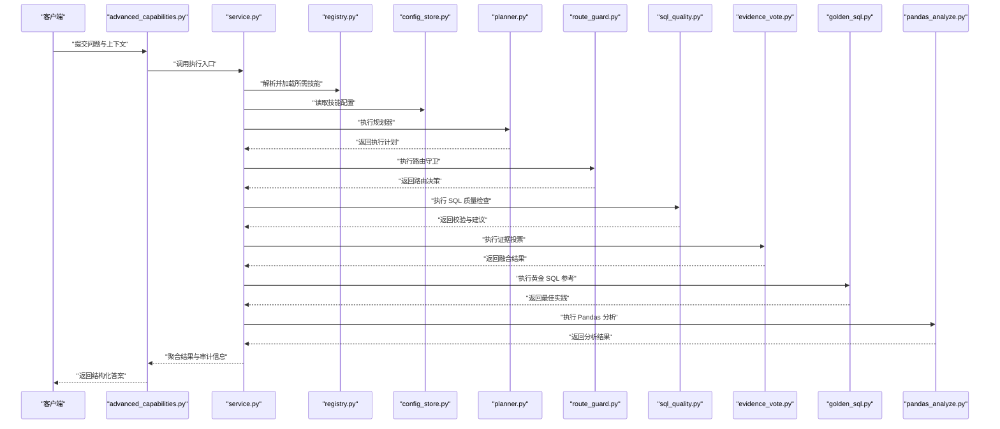
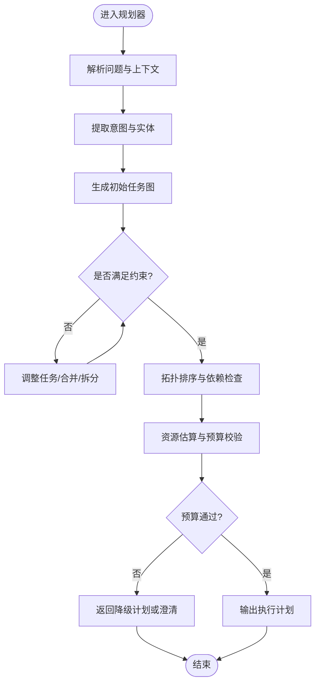
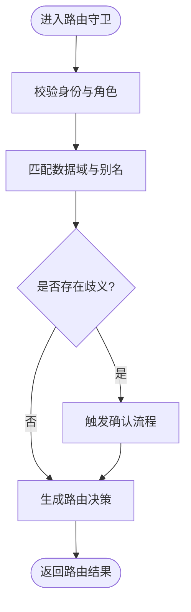
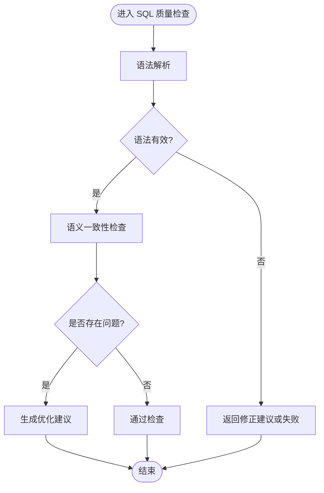
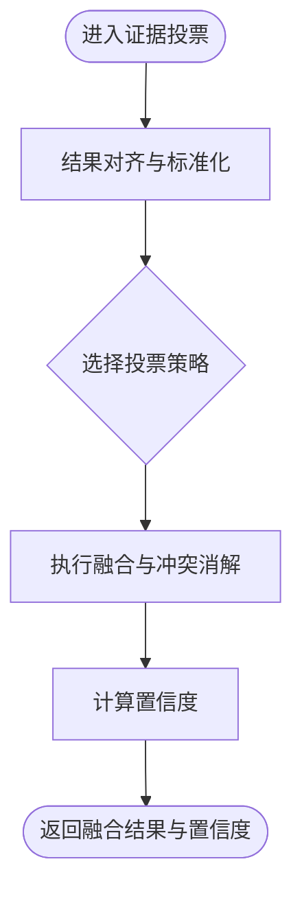
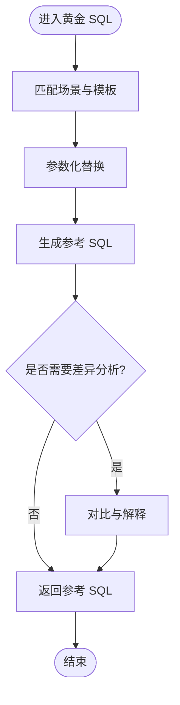
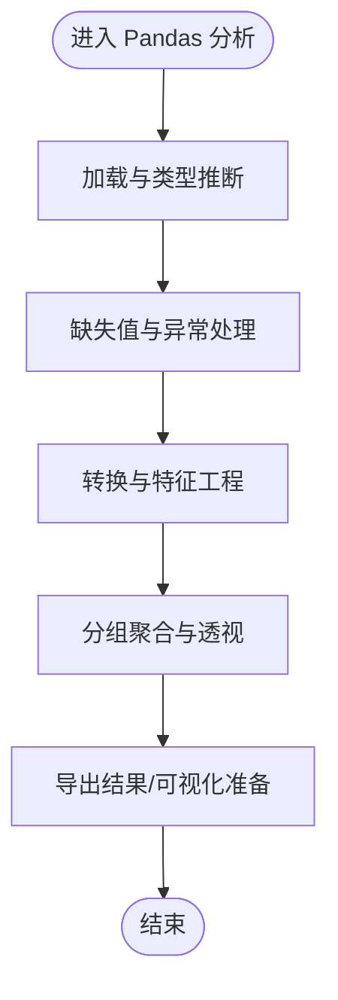
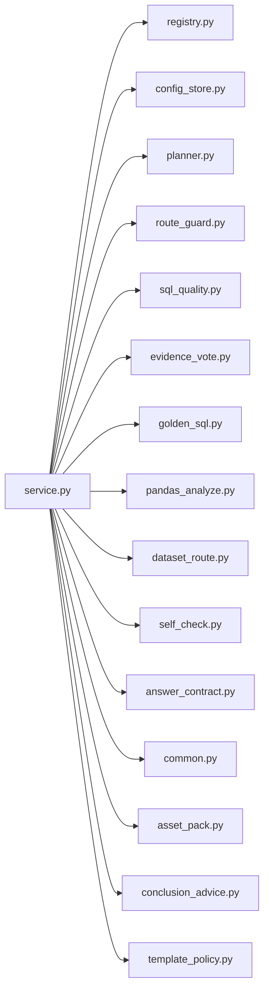

# 技能系统

<cite>
**本文引用的文件**   
- [backend/smartask_advanced/service.py](file://backend/smartask_advanced/service.py)
- [backend/smartask_advanced/registry.py](file://backend/smartask_advanced/registry.py)
- [backend/smartask_advanced/config_store.py](file://backend/smartask_advanced/config_store.py)
- [backend/smartask_advanced/skills/planner.py](file://backend/smartask_advanced/skills/planner.py)
- [backend/smartask_advanced/skills/route_guard.py](file://backend/smartask_advanced/skills/route_guard.py)
- [backend/smartask_advanced/skills/sql_quality.py](file://backend/smartask_advanced/skills/sql_quality.py)
- [backend/smartask_advanced/skills/evidence_vote.py](file://backend/smartask_advanced/skills/evidence_vote.py)
- [backend/smartask_advanced/skills/golden_sql.py](file://backend/smartask_advanced/skills/golden_sql.py)
- [backend/smartask_advanced/skills/pandas_analyze.py](file://backend/smartask_advanced/skills/pandas_analyze.py)
- [backend/smartask_advanced/skills/dataset_route.py](file://backend/smartask_advanced/skills/dataset_route.py)
- [backend/smartask_advanced/skills/self_check.py](file://backend/smartask_advanced/skills/self_check.py)
- [backend/smartask_advanced/skills/answer_contract.py](file://backend/smartask_advanced/skills/answer_contract.py)
- [backend/smartask_advanced/skills/common.py](file://backend/smartask_advanced/skills/common.py)
- [backend/smartask_advanced/skills/asset_pack.py](file://backend/smartask_advanced/skills/asset_pack.py)
- [backend/smartask_advanced/skills/conclusion_advice.py](file://backend/smartask_advanced/skills/conclusion_advice.py)
- [backend/smartask_advanced/skills/template_policy.py](file://backend/smartask_advanced/skills/template_policy.py)
- [backend/controllers/advanced_capabilities.py](file://backend/controllers/advanced_capabilities.py)
- [backend/tests/test_advanced_cross_dataset.py](file://backend/tests/test_advanced_cross_dataset.py)
- [backend/tests/test_advanced_route_guard_confirmation.py](file://backend/tests/test_advanced_route_guard_confirmation.py)
</cite>

## 目录
1. [简介](#简介)
2. [项目结构](#项目结构)
3. [核心组件](#核心组件)
4. [架构总览](#架构总览)
5. [详细组件分析](#详细组件分析)
6. [依赖关系分析](#依赖关系分析)
7. [性能考量](#性能考量)
8. [故障排查指南](#故障排查指南)
9. [结论](#结论)
10. [附录](#附录)

## 简介
本文件面向 SmartAsk 智能问数平台的“技能系统”，系统性阐述插件式技能架构的设计原理与实现要点，覆盖技能注册机制、执行管道与生命周期管理；并对以下核心技能进行深度解析：规划器技能（任务分解与执行计划）、路由守卫技能（权限检查与数据路由）、SQL 质量检查技能（语法验证与优化建议）、证据投票技能（多源结果融合）、黄金 SQL 技能（最佳实践参考）、Pandas 分析技能（数据处理与分析）。同时给出技能开发规范（接口定义、参数传递、错误处理、单元测试）以及配置管理与动态加载机制说明，并提供自定义技能开发的完整指南与最佳实践。

## 项目结构
SmartAsk 的技能系统位于后端模块 smartask_advanced 下，采用“服务 + 注册表 + 配置存储 + 技能包”的分层组织方式：
- 服务层 service.py：编排技能执行流程、生命周期管理、上下文透传与结果聚合。
- 注册表 registry.py：集中注册与发现技能，提供按名称查找、版本兼容与扩展点注入。
- 配置存储 config_store.py：统一读取与缓存技能运行期配置，支持热更新与默认值回退。
- 技能包 skills/*：每个技能一个独立文件，遵循统一的接口契约与错误模型。
- 控制器 advanced_capabilities.py：对外暴露能力入口，将 HTTP 请求映射到技能执行管线。
- 测试用例 tests/*：针对关键技能的集成与回归测试，保障行为稳定性。

图表来源
- [backend/smartask_advanced/service.py](file://backend/smartask_advanced/service.py)
- [backend/smartask_advanced/registry.py](file://backend/smartask_advanced/registry.py)
- [backend/smartask_advanced/config_store.py](file://backend/smartask_advanced/config_store.py)
- [backend/controllers/advanced_capabilities.py](file://backend/controllers/advanced_capabilities.py)

章节来源
- [backend/smartask_advanced/service.py](file://backend/smartask_advanced/service.py)
- [backend/smartask_advanced/registry.py](file://backend/smartask_advanced/registry.py)
- [backend/smartask_advanced/config_store.py](file://backend/smartask_advanced/config_store.py)
- [backend/controllers/advanced_capabilities.py](file://backend/controllers/advanced_capabilities.py)

## 核心组件
- 技能注册表（registry.py）
  - 职责：维护技能元数据（名称、版本、依赖、描述），提供注册、查询、校验与扩展点注入。
  - 关键点：唯一键约束、版本兼容性检查、按需懒加载、错误上报。
- 服务编排（service.py）
  - 职责：构建执行图、调度技能节点、管理上下文（用户、租户、会话、权限、数据源）、捕获异常并生成可观测日志。
  - 关键点：拓扑排序、短路/重试/熔断、结果合并、阶段化审计。
- 配置存储（config_store.py）
  - 职责：集中管理技能运行期配置，支持默认值、环境覆盖、热更新与降级。
  - 关键点：缓存失效策略、并发安全、配置校验。

章节来源
- [backend/smartask_advanced/registry.py](file://backend/smartask_advanced/registry.py)
- [backend/smartask_advanced/service.py](file://backend/smartask_advanced/service.py)
- [backend/smartask_advanced/config_store.py](file://backend/smartask_advanced/config_store.py)

## 架构总览
技能系统采用“插件式”架构：所有技能以统一接口接入，由服务编排器根据输入意图与上下文动态组装执行图，依次或并行执行各技能，最终汇聚为标准化答案。

图表来源
- [backend/controllers/advanced_capabilities.py](file://backend/controllers/advanced_capabilities.py)
- [backend/smartask_advanced/service.py](file://backend/smartask_advanced/service.py)
- [backend/smartask_advanced/registry.py](file://backend/smartask_advanced/registry.py)
- [backend/smartask_advanced/config_store.py](file://backend/smartask_advanced/config_store.py)
- [backend/smartask_advanced/skills/planner.py](file://backend/smartask_advanced/skills/planner.py)
- [backend/smartask_advanced/skills/route_guard.py](file://backend/smartask_advanced/skills/route_guard.py)
- [backend/smartask_advanced/skills/sql_quality.py](file://backend/smartask_advanced/skills/sql_quality.py)
- [backend/smartask_advanced/skills/evidence_vote.py](file://backend/smartask_advanced/skills/evidence_vote.py)
- [backend/smartask_advanced/skills/golden_sql.py](file://backend/smartask_advanced/skills/golden_sql.py)
- [backend/smartask_advanced/skills/pandas_analyze.py](file://backend/smartask_advanced/skills/pandas_analyze.py)

## 详细组件分析

### 规划器技能（planner.py）
- 目标：将用户自然语言问题拆解为可执行的子任务序列，输出结构化执行计划（步骤、依赖、输入输出、资源需求）。
- 关键逻辑：
  - 意图识别与实体抽取，形成初始任务图。
  - 任务分解与合并，消除冗余步骤。
  - 依赖分析与拓扑排序，确保执行顺序正确。
  - 资源估算与预算控制（时间、计算、I/O）。
- 错误处理：对无法解析的意图返回降级计划或澄清提示。
- 性能：使用有向无环图（DAG）表示依赖，复杂度 O(V+E)。

图表来源
- [backend/smartask_advanced/skills/planner.py](file://backend/smartask_advanced/skills/planner.py)

章节来源
- [backend/smartask_advanced/skills/planner.py](file://backend/smartask_advanced/skills/planner.py)

### 路由守卫技能（route_guard.py）
- 目标：基于用户权限、租户隔离与数据域规则，决定后续数据访问路径与可见范围。
- 关键逻辑：
  - 身份与角色校验（RBAC）。
  - 数据域匹配（组织树、数据集别名、维度层级）。
  - 分支决策（单域/跨域/确认分支）。
- 错误处理：权限不足时返回明确拒绝码与原因；歧义时触发确认流程。
- 性能：索引化权限矩阵，O(1) 快速判定。

图表来源
- [backend/smartask_advanced/skills/route_guard.py](file://backend/smartask_advanced/skills/route_guard.py)

章节来源
- [backend/smartask_advanced/skills/route_guard.py](file://backend/smartask_advanced/skills/route_guard.py)

### SQL 质量检查技能（sql_quality.py）
- 目标：对生成的 SQL 进行语法验证、语义检查与优化建议输出。
- 关键逻辑：
  - 语法解析与 AST 校验。
  - 语义一致性检查（字段存在性、类型匹配、过滤条件合理性）。
  - 优化建议（索引命中、避免全表扫描、分页与聚合优化）。
- 错误处理：不可修复错误直接失败；可修复错误返回修正建议。
- 性能：缓存解析结果与规则命中统计。

图表来源
- [backend/smartask_advanced/skills/sql_quality.py](file://backend/smartask_advanced/skills/sql_quality.py)

章节来源
- [backend/smartask_advanced/skills/sql_quality.py](file://backend/smartask_advanced/skills/sql_quality.py)

### 证据投票技能（evidence_vote.py）
- 目标：对来自多个数据源或多种查询策略的结果进行融合与投票，输出一致性与置信度评估。
- 关键逻辑：
  - 结果对齐（字段映射、单位换算、时间对齐）。
  - 投票策略（多数投票、加权投票、冲突消解）。
  - 置信度计算与不确定性标注。
- 错误处理：数据不一致时标记低置信度并保留原始证据。
- 性能：增量聚合与流式合并。

图表来源
- [backend/smartask_advanced/skills/evidence_vote.py](file://backend/smartask_advanced/skills/evidence_vote.py)

章节来源
- [backend/smartask_advanced/skills/evidence_vote.py](file://backend/smartask_advanced/skills/evidence_vote.py)

### 黄金 SQL 技能（golden_sql.py）
- 目标：提供最佳实践 SQL 模板与参考实现，辅助生成高质量查询。
- 关键逻辑：
  - 模板匹配（场景、维度、指标组合）。
  - 参数化替换与上下文注入。
  - 示例对比与差异分析。
- 错误处理：模板不匹配时回退到通用模板或提示补充上下文。
- 性能：模板索引与预编译。

图表来源
- [backend/smartask_advanced/skills/golden_sql.py](file://backend/smartask_advanced/skills/golden_sql.py)

章节来源
- [backend/smartask_advanced/skills/golden_sql.py](file://backend/smartask_advanced/skills/golden_sql.py)

### Pandas 分析技能（pandas_analyze.py）
- 目标：在内存中对数据进行清洗、转换、聚合与可视化准备。
- 关键逻辑：
  - 数据加载与类型推断。
  - 缺失值处理与异常检测。
  - 分组聚合、透视表与特征工程。
- 错误处理：数据类型不匹配时尝试自动转换，失败则记录诊断信息。
- 性能：分块处理与内存池复用。

图表来源
- [backend/smartask_advanced/skills/pandas_analyze.py](file://backend/smartask_advanced/skills/pandas_analyze.py)

章节来源
- [backend/smartask_advanced/skills/pandas_analyze.py](file://backend/smartask_advanced/skills/pandas_analyze.py)

### 其他支撑技能
- 数据集路由（dataset_route.py）：负责数据集级别的访问路由与别名解析。
- 自检（self_check.py）：运行时自检与能力可用性探测。
- 答案契约（answer_contract.py）：统一答案结构与字段规范。
- 通用工具（common.py）：公共函数、常量与错误模型。
- 资产打包（asset_pack.py）：将技能产物打包为可分发单元。
- 结论建议（conclusion_advice.py）：基于分析结果生成业务建议。
- 模板策略（template_policy.py）：模板选择与策略切换。

章节来源
- [backend/smartask_advanced/skills/dataset_route.py](file://backend/smartask_advanced/skills/dataset_route.py)
- [backend/smartask_advanced/skills/self_check.py](file://backend/smartask_advanced/skills/self_check.py)
- [backend/smartask_advanced/skills/answer_contract.py](file://backend/smartask_advanced/skills/answer_contract.py)
- [backend/smartask_advanced/skills/common.py](file://backend/smartask_advanced/skills/common.py)
- [backend/smartask_advanced/skills/asset_pack.py](file://backend/smartask_advanced/skills/asset_pack.py)
- [backend/smartask_advanced/skills/conclusion_advice.py](file://backend/smartask_advanced/skills/conclusion_advice.py)
- [backend/smartask_advanced/skills/template_policy.py](file://backend/smartask_advanced/skills/template_policy.py)

## 依赖关系分析
技能之间通过服务编排器解耦，依赖关系清晰且可观测。注册表保证技能发现的唯一性与版本兼容，配置存储提供运行时参数注入。

图表来源
- [backend/smartask_advanced/service.py](file://backend/smartask_advanced/service.py)
- [backend/smartask_advanced/registry.py](file://backend/smartask_advanced/registry.py)
- [backend/smartask_advanced/config_store.py](file://backend/smartask_advanced/config_store.py)
- [backend/smartask_advanced/skills/*.py](file://backend/smartask_advanced/skills/)

章节来源
- [backend/smartask_advanced/service.py](file://backend/smartask_advanced/service.py)
- [backend/smartask_advanced/registry.py](file://backend/smartask_advanced/registry.py)
- [backend/smartask_advanced/config_store.py](file://backend/smartask_advanced/config_store.py)

## 性能考量
- 执行图调度：优先并行执行无依赖节点，减少端到端延迟。
- 缓存策略：SQL 解析结果、模板匹配、权限矩阵与配置项均启用缓存。
- 资源限制：规划器阶段进行预算估算，防止过度消耗 CPU/内存/I/O。
- 流式处理：证据投票与 Pandas 分析支持增量合并与分块处理。
- 可观测性：关键路径埋点与耗时统计，便于定位瓶颈。

[本节为通用指导，无需特定文件引用]

## 故障排查指南
- 常见问题
  - 技能未注册或版本不兼容：检查注册表与依赖声明。
  - 权限拒绝：核对 RBAC 配置与数据域映射。
  - SQL 语法错误：查看质量检查输出的修正建议。
  - 结果不一致：检查证据投票策略与对齐规则。
  - 内存溢出：降低批大小或启用分块处理。
- 调试手段
  - 开启详细日志与审计追踪。
  - 使用单元测试与集成测试复现问题。
  - 通过配置开关临时禁用非关键技能以定位根因。

章节来源
- [backend/tests/test_advanced_cross_dataset.py](file://backend/tests/test_advanced_cross_dataset.py)
- [backend/tests/test_advanced_route_guard_confirmation.py](file://backend/tests/test_advanced_route_guard_confirmation.py)

## 结论
SmartAsk 技能系统通过插件式架构实现了高内聚、低耦合的可扩展能力体系。服务编排器、注册表与配置存储共同构成了稳定可靠的执行基座；六大核心技能覆盖了从任务规划、权限路由、SQL 质量、结果融合、最佳实践到数据分析的全链路。配合完善的开发规范与测试保障，团队可以快速迭代与扩展新技能，持续提升问数体验与准确性。

[本节为总结性内容，无需特定文件引用]

## 附录

### 技能开发规范
- 接口定义
  - 输入：统一上下文对象（用户、租户、会话、权限、数据源、配置）。
  - 输出：标准化结果结构（数据、元数据、审计信息、错误码）。
  - 错误模型：区分可恢复与不可恢复错误，附带诊断信息。
- 参数传递
  - 通过配置存储注入运行期参数，避免硬编码。
  - 敏感参数加密存储与最小权限访问。
- 错误处理
  - 捕获并分类异常，向上抛出结构化错误。
  - 提供降级路径与回退策略。
- 单元测试
  - 覆盖正常路径、边界条件与异常路径。
  - 使用模拟上下文与配置，确保可重复性。

章节来源
- [backend/smartask_advanced/skills/common.py](file://backend/smartask_advanced/skills/common.py)
- [backend/smartask_advanced/skills/answer_contract.py](file://backend/smartask_advanced/skills/answer_contract.py)

### 配置管理与动态加载
- 配置来源：环境变量、配置文件、数据库与远程配置中心。
- 优先级：远端 > 本地 > 默认值。
- 热更新：监听配置变更事件，刷新缓存并重新初始化相关技能。
- 动态加载：按需加载技能模块，减少启动开销与内存占用。

章节来源
- [backend/smartask_advanced/config_store.py](file://backend/smartask_advanced/config_store.py)
- [backend/smartask_advanced/registry.py](file://backend/smartask_advanced/registry.py)

### 自定义技能开发指南
- 步骤
  - 新建技能文件于 skills 目录，实现统一接口。
  - 在注册表中登记元数据与依赖。
  - 在服务编排图中添加节点与边。
  - 编写单元测试与集成测试。
  - 通过配置开关启用与灰度发布。
- 最佳实践
  - 单一职责，保持幂等与可重入。
  - 输入校验与输出规范化。
  - 可观测性：日志、指标与追踪。
  - 文档化：README、参数说明与示例。

章节来源
- [backend/smartask_advanced/skills/asset_pack.py](file://backend/smartask_advanced/skills/asset_pack.py)
- [backend/smartask_advanced/skills/template_policy.py](file://backend/smartask_advanced/skills/template_policy.py)