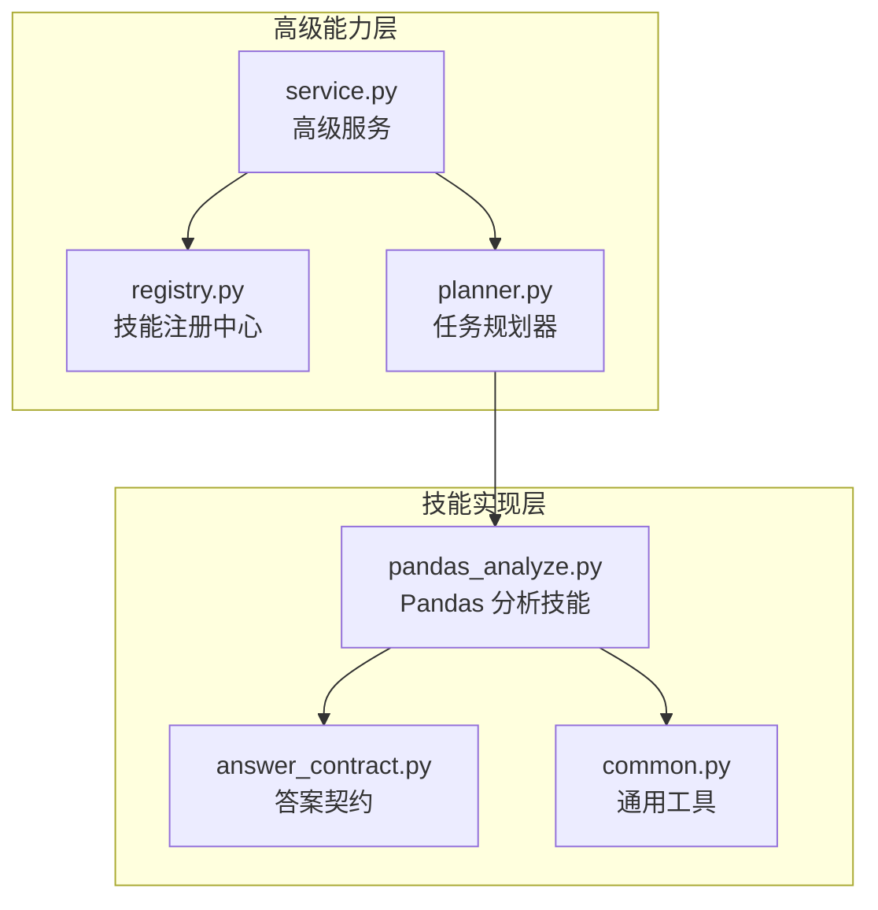
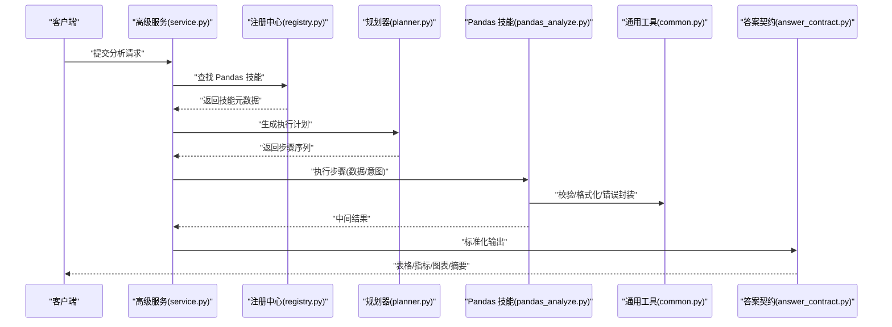
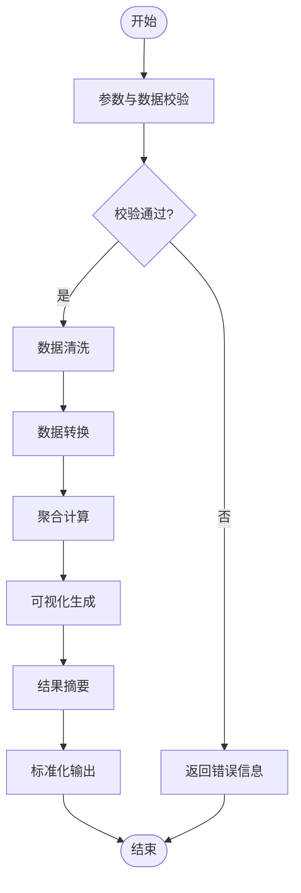
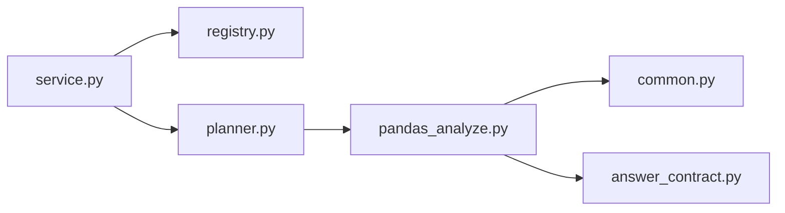

# Pandas 分析技能

<cite>
**本文引用的文件**   
- [pandas_analyze.py](file://backend/smartask_advanced/skills/pandas_analyze.py)
- [answer_contract.py](file://backend/smartask_advanced/skills/answer_contract.py)
- [common.py](file://backend/smartask_advanced/skills/common.py)
- [planner.py](file://backend/smartask_advanced/skills/planner.py)
- [service.py](file://backend/smartask_advanced/service.py)
- [registry.py](file://backend/smartask_advanced/registry.py)
</cite>

## 目录
1. [简介](#简介)
2. [项目结构](#项目结构)
3. [核心组件](#核心组件)
4. [架构总览](#架构总览)
5. [详细组件分析](#详细组件分析)
6. [依赖关系分析](#依赖关系分析)
7. [性能考量](#性能考量)
8. [故障排查指南](#故障排查指南)
9. [结论](#结论)
10. [附录](#附录)

## 简介
本文件面向 SmartAsk 智能问数平台的“Pandas 分析技能”，系统性阐述其数据处理管道、统计分析方法与可视化支持能力。文档聚焦数据清洗与转换、聚合计算、图表生成等关键环节，给出接口定义、处理流程、统计函数库与输出格式说明，并提供可复用的复杂分析与报表生成示例路径，帮助开发者快速理解并扩展该技能。

## 项目结构
Pandas 分析技能位于后端高级能力模块中，围绕“技能注册—编排—执行—结果标准化”的链路组织代码：
- 技能实现：pandas_analyze.py
- 答案契约与统一输出：answer_contract.py
- 通用工具与校验：common.py
- 任务规划与步骤编排：planner.py
- 高级服务入口与调度：service.py
- 技能注册中心：registry.py

**图示来源** 
- [service.py](file://backend/smartask_advanced/service.py)
- [registry.py](file://backend/smartask_advanced/registry.py)
- [planner.py](file://backend/smartask_advanced/skills/planner.py)
- [pandas_analyze.py](file://backend/smartask_advanced/skills/pandas_analyze.py)
- [answer_contract.py](file://backend/smartask_advanced/skills/answer_contract.py)
- [common.py](file://backend/smartask_advanced/skills/common.py)

**章节来源**
- [pandas_analyze.py](file://backend/smartask_advanced/skills/pandas_analyze.py)
- [answer_contract.py](file://backend/smartask_advanced/skills/answer_contract.py)
- [common.py](file://backend/smartask_advanced/skills/common.py)
- [planner.py](file://backend/smartask_advanced/skills/planner.py)
- [service.py](file://backend/smartask_advanced/service.py)
- [registry.py](file://backend/smartask_advanced/registry.py)

## 核心组件
- Pandas 分析技能（pandas_analyze.py）
  - 职责：接收结构化数据与用户意图，构建数据处理管道，执行清洗、转换、聚合与统计，生成可视化图表与结果摘要。
  - 关键能力：
    - 数据清洗：缺失值处理、类型推断与转换、异常值过滤、去重与排序。
    - 数据转换：字段映射、表达式计算、分组与透视、时间序列对齐。
    - 聚合计算：按维度分组求和/均值/计数/分位数/相关性等。
    - 可视化：折线、柱状、饼图、散点、热力图等，支持导出为图片/表格。
    - 结果标准化：统一输出为表格、指标卡片、图表对象与文本摘要。
- 答案契约（answer_contract.py）
  - 职责：定义统一的返回结构与字段约束，确保前端渲染一致性与下游消费稳定。
- 通用工具（common.py）
  - 职责：提供类型校验、数值格式化、日期解析、错误封装等基础能力。
- 任务规划（planner.py）
  - 职责：将自然语言或结构化查询拆解为可执行的步骤计划，驱动 Pandas 技能逐步执行。
- 高级服务（service.py）
  - 职责：对外暴露调用入口，协调注册中心与规划器，管理执行上下文与资源。
- 技能注册（registry.py）
  - 职责：维护技能元数据、版本与依赖声明，支持动态加载与路由分发。

**章节来源**
- [pandas_analyze.py](file://backend/smartask_advanced/skills/pandas_analyze.py)
- [answer_contract.py](file://backend/smartask_advanced/skills/answer_contract.py)
- [common.py](file://backend/smartask_advanced/skills/common.py)
- [planner.py](file://backend/smartask_advanced/skills/planner.py)
- [service.py](file://backend/smartask_advanced/service.py)
- [registry.py](file://backend/smartask_advanced/registry.py)

## 架构总览
Pandas 分析技能在整体架构中的位置如下：上层服务通过注册中心发现技能，规划器将用户请求分解为步骤，Pandas 技能按步骤执行数据处理与可视化，最终按答案契约返回统一结构。

**图示来源** 
- [service.py](file://backend/smartask_advanced/service.py)
- [registry.py](file://backend/smartask_advanced/registry.py)
- [planner.py](file://backend/smartask_advanced/skills/planner.py)
- [pandas_analyze.py](file://backend/smartask_advanced/skills/pandas_analyze.py)
- [common.py](file://backend/smartask_advanced/skills/common.py)
- [answer_contract.py](file://backend/smartask_advanced/skills/answer_contract.py)

## 详细组件分析

### Pandas 分析技能（pandas_analyze.py）
- 输入规范
  - 数据集：DataFrame 或可转换为 DataFrame 的结构化数据源。
  - 意图描述：字段选择、过滤条件、分组维度、聚合指标、时间窗口、排序与分页等。
  - 可视化偏好：图表类型、颜色主题、坐标轴标签、是否导出图片。
- 数据处理管道
  - 清洗阶段：空值填充/删除、类型转换、异常值检测与剔除、重复行处理。
  - 转换阶段：字段映射、派生列计算、时间对齐、透视表构建。
  - 聚合阶段：groupby 多维分组、多指标聚合、滚动窗口、相关性矩阵。
  - 可视化阶段：根据意图自动选择图表类型，生成图表对象与配置。
- 输出格式
  - 表格：结构化二维数据，含行列索引与数据类型。
  - 指标：关键业务指标（总量、均值、占比、同比环比等）。
  - 图表：矢量/位图图像与图表配置。
  - 摘要：自然语言总结与洞察提示。
- 错误处理
  - 参数校验失败：返回明确的字段与类型错误信息。
  - 数据质量异常：缺失过多、类型不匹配、数值溢出等，回退到安全策略。
  - 执行中断：记录步骤级日志，支持断点恢复与重试。

**图示来源** 
- [pandas_analyze.py](file://backend/smartask_advanced/skills/pandas_analyze.py)
- [common.py](file://backend/smartask_advanced/skills/common.py)

**章节来源**
- [pandas_analyze.py](file://backend/smartask_advanced/skills/pandas_analyze.py)
- [common.py](file://backend/smartask_advanced/skills/common.py)

### 答案契约（answer_contract.py）
- 统一返回结构
  - 表格：包含列名、数据类型、行数与样例数据。
  - 指标：键值对形式的业务指标集合。
  - 图表：图表类型、数据源、样式配置与图片二进制或 URL。
  - 摘要：自然语言描述与关键洞察。
- 字段约束与校验
  - 必填字段、可选字段、枚举值范围、长度限制。
  - 类型强制转换与默认值填充。
- 兼容性
  - 向前兼容旧版本字段，废弃字段标记与迁移建议。

**章节来源**
- [answer_contract.py](file://backend/smartask_advanced/skills/answer_contract.py)

### 通用工具（common.py）
- 数据校验：类型检查、范围验证、正则匹配。
- 格式化：金额、百分比、日期时间、科学计数法。
- 错误封装：统一错误码、消息模板、堆栈追踪。
- 辅助函数：字符串处理、列表操作、字典合并。

**章节来源**
- [common.py](file://backend/smartask_advanced/skills/common.py)

### 任务规划（planner.py）
- 意图解析：从自然语言或结构化查询中提取维度、度量、过滤、排序、分页等要素。
- 步骤生成：将意图转化为可执行的步骤序列，如“清洗→转换→聚合→可视化”。
- 依赖管理：步骤间的数据依赖与顺序约束。
- 优化策略：合并相邻步骤、跳过冗余计算、缓存中间结果。

**章节来源**
- [planner.py](file://backend/smartask_advanced/skills/planner.py)

### 高级服务（service.py）
- 入口方法：接收请求、解析参数、调用注册中心与规划器。
- 上下文管理：会话状态、权限校验、资源隔离。
- 结果组装：将各步骤结果按答案契约整合后返回。

**章节来源**
- [service.py](file://backend/smartask_advanced/service.py)

### 技能注册（registry.py）
- 技能元数据：名称、版本、依赖、能力描述。
- 动态加载：按需导入与实例化技能。
- 路由分发：根据意图匹配最合适的技能执行。

**章节来源**
- [registry.py](file://backend/smartask_advanced/registry.py)

## 依赖关系分析
Pandas 分析技能依赖上游的服务与规划器，同时依赖通用工具进行数据校验与格式化，并通过答案契约统一输出。

**图示来源** 
- [service.py](file://backend/smartask_advanced/service.py)
- [registry.py](file://backend/smartask_advanced/registry.py)
- [planner.py](file://backend/smartask_advanced/skills/planner.py)
- [pandas_analyze.py](file://backend/smartask_advanced/skills/pandas_analyze.py)
- [common.py](file://backend/smartask_advanced/skills/common.py)
- [answer_contract.py](file://backend/smartask_advanced/skills/answer_contract.py)

**章节来源**
- [service.py](file://backend/smartask_advanced/service.py)
- [registry.py](file://backend/smartask_advanced/registry.py)
- [planner.py](file://backend/smartask_advanced/skills/planner.py)
- [pandas_analyze.py](file://backend/smartask_advanced/skills/pandas_analyze.py)
- [common.py](file://backend/smartask_advanced/skills/common.py)
- [answer_contract.py](file://backend/smartask_advanced/skills/answer_contract.py)

## 性能考量
- 内存使用
  - 大数据集建议使用分块读取与惰性计算，避免一次性加载全量数据。
  - 及时释放中间结果，减少内存峰值。
- 计算效率
  - 优先使用向量化操作，避免逐行循环。
  - 合理设置 groupby 的 sort 与 dropna 参数，减少不必要的排序与空值处理。
- I/O 优化
  - 图表导出时选择合适的分辨率与格式，平衡清晰度与体积。
  - 缓存常用中间结果，避免重复计算。
- 并发与并行
  - 对于独立子任务可采用并行执行，注意线程安全与资源竞争。

[本节为通用指导，不涉及具体文件分析]

## 故障排查指南
- 常见错误
  - 参数校验失败：检查字段名、类型与取值范围。
  - 数据质量异常：查看缺失率、类型不一致、异常值分布。
  - 执行中断：定位具体步骤，检查依赖与中间结果。
- 调试建议
  - 启用详细日志，记录每一步输入输出。
  - 使用最小可复现数据集定位问题。
  - 逐步关闭优化选项以排除干扰。
- 恢复策略
  - 回退到上一个稳定步骤，重新执行后续步骤。
  - 调整阈值与策略参数，提升鲁棒性。

**章节来源**
- [common.py](file://backend/smartask_advanced/skills/common.py)
- [pandas_analyze.py](file://backend/smartask_advanced/skills/pandas_analyze.py)

## 结论
Pandas 分析技能在 SmartAsk 平台中承担核心数据处理与分析职责，通过清晰的管道设计、严格的契约约束与完善的工具支撑，实现了从数据清洗到可视化输出的端到端能力。开发者可基于本文档快速理解其架构与实现细节，并在现有基础上扩展更多统计方法与可视化场景。

[本节为总结性内容，不涉及具体文件分析]

## 附录
- 典型分析示例（路径参考）
  - 销售趋势分析：清洗订单数据、按时间与品类聚合、生成折线图与摘要。
  - 用户行为画像：清洗点击日志、构建用户特征、生成柱状图与饼图。
  - 库存健康度评估：清洗出入库记录、计算周转率与缺货率、生成热力图。
- 扩展建议
  - 新增统计函数：在 pandas_analyze.py 中注册新的聚合与衍生指标。
  - 增强可视化：扩展图表类型与交互配置，适配不同前端渲染需求。
  - 优化管道：引入更高效的中间表示与缓存机制，提升整体吞吐。

[本节为概念性内容，不涉及具体文件分析]