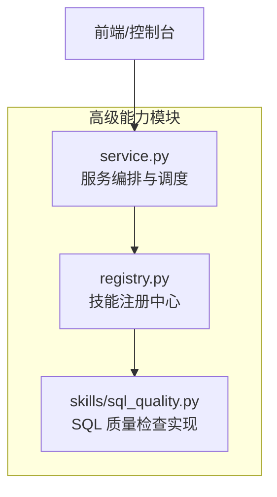
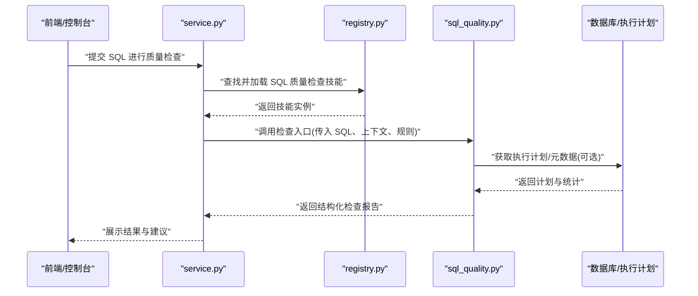
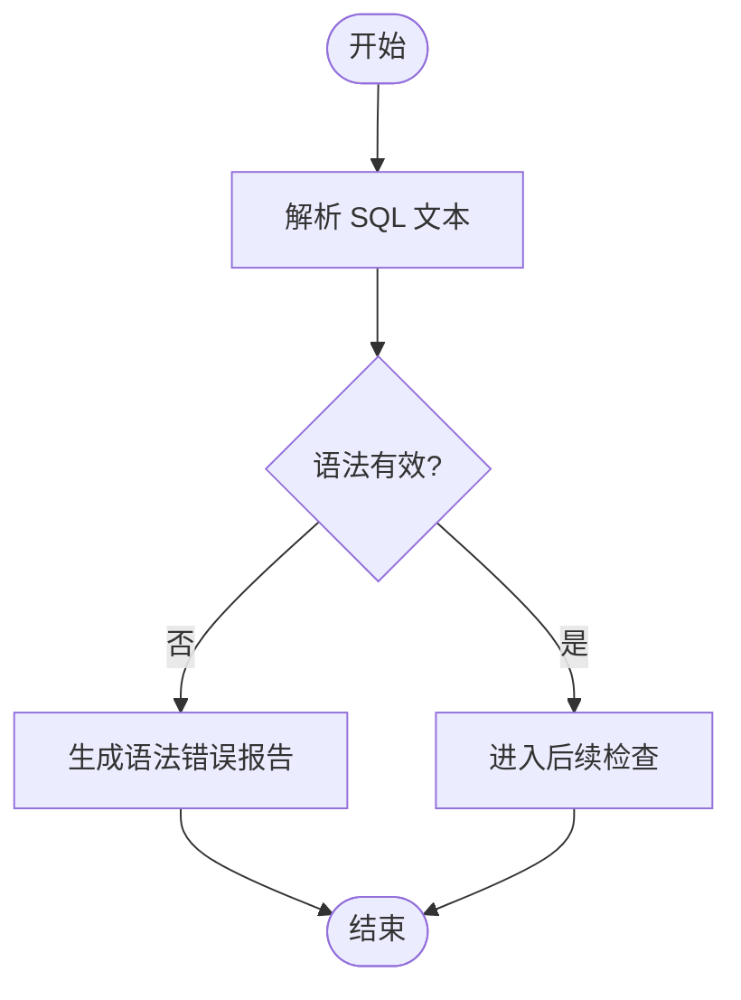
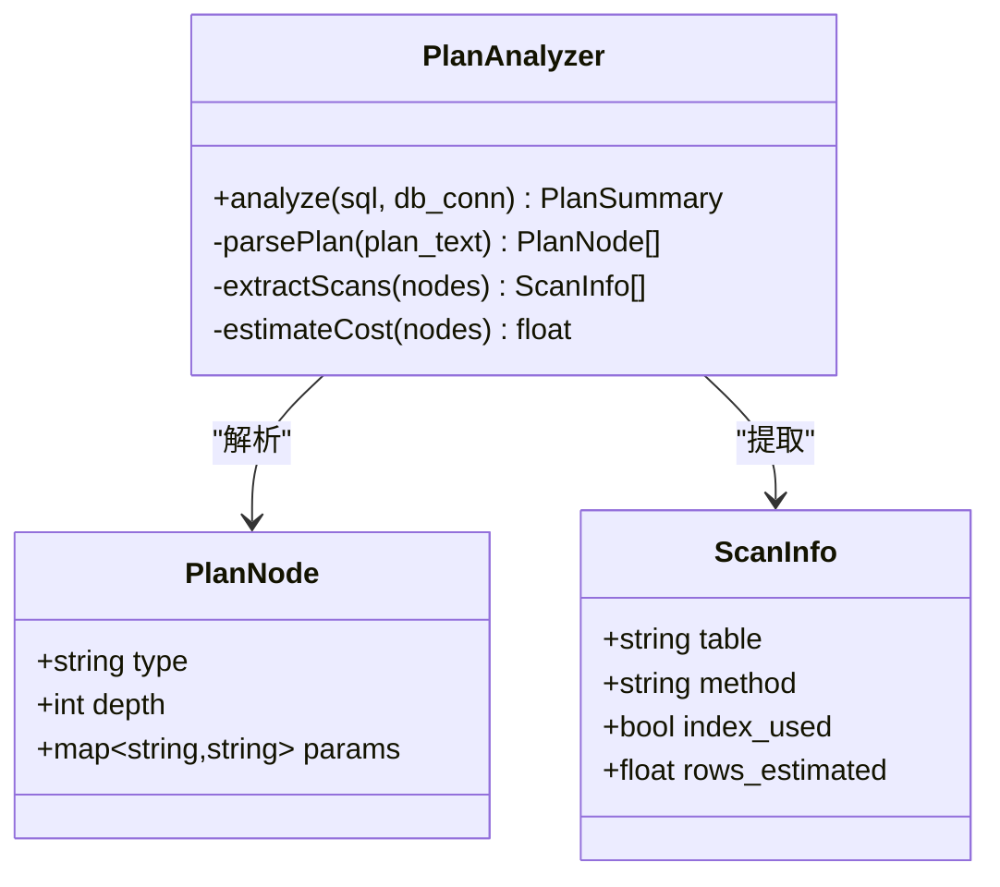
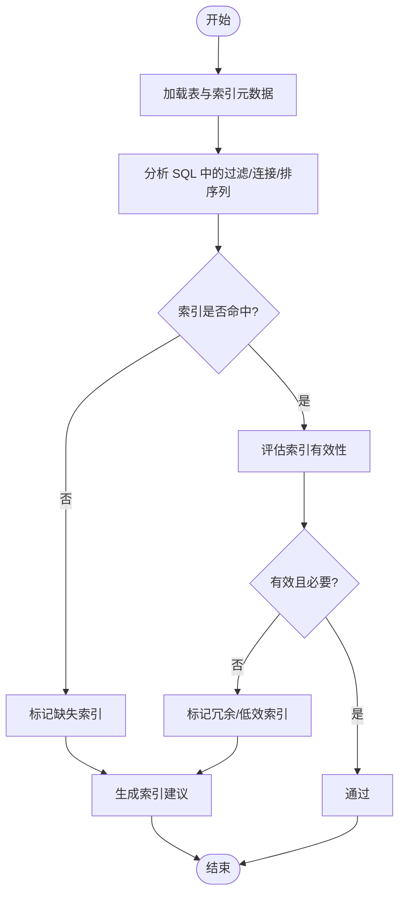
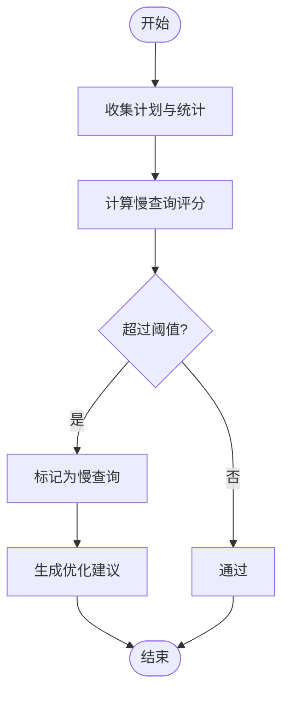

# SQL 质量检查技能

<cite>
**本文引用的文件**   
- [sql_quality.py](file://backend/smartask_advanced/skills/sql_quality.py)
- [service.py](file://backend/smartask_advanced/service.py)
- [registry.py](file://backend/smartask_advanced/registry.py)
- [SKILL.md](file://.agents/skills/smartask-skill-usage-guide/SKILL.md)
</cite>

## 目录
1. [简介](#简介)
2. [项目结构](#项目结构)
3. [核心组件](#核心组件)
4. [架构总览](#架构总览)
5. [详细组件分析](#详细组件分析)
6. [依赖关系分析](#依赖关系分析)
7. [性能考量](#性能考量)
8. [故障排查指南](#故障排查指南)
9. [结论](#结论)
10. [附录](#附录)

## 简介
本文件面向 SmartAsk 智能问数平台的“SQL 质量检查”技能，系统性阐述其目标、能力边界与使用方式。该技能聚焦于：
- SQL 语法验证：识别语法错误、非法关键字与不兼容的方言差异。
- 性能优化建议：基于查询计划分析、索引使用检查与慢查询识别，给出可操作的改写建议。
- 代码规范检查：统一命名、避免反模式、约束条件规范化等。
- 报告与配置：提供标准化的检查结果格式与规则配置项，便于集成到平台工作流中。

## 项目结构
SQL 质量检查技能位于后端高级能力模块的技能目录中，并通过注册表与服务层进行编排调用。关键路径如下：
- 技能实现：backend/smartask_advanced/skills/sql_quality.py
- 服务编排：backend/smartask_advanced/service.py
- 技能注册：backend/smartask_advanced/registry.py
- 技能使用说明（通用）：.agents/skills/smartask-skill-usage-guide/SKILL.md

图表来源 
- [sql_quality.py](file://backend/smartask_advanced/skills/sql_quality.py)
- [registry.py](file://backend/smartask_advanced/registry.py)
- [service.py](file://backend/smartask_advanced/service.py)

章节来源
- [sql_quality.py](file://backend/smartask_advanced/skills/sql_quality.py)
- [service.py](file://backend/smartask_advanced/service.py)
- [registry.py](file://backend/smartask_advanced/registry.py)
- [SKILL.md](file://.agents/skills/smartask-skill-usage-guide/SKILL.md)

## 核心组件
- SQL 语法验证器：负责解析 SQL、校验语法正确性与方言兼容性。
- 查询计划分析器：对接数据库执行计划，提取扫描类型、连接顺序、过滤与聚合位置等信息。
- 索引使用检查器：识别缺失索引、低效索引、冗余索引及索引未命中场景。
- 慢查询识别器：基于阈值与统计信息定位潜在慢查询并生成优化建议。
- 代码规范检查器：检查命名规范、反模式、过度选择字段、隐式转换等。
- 报告生成器：将上述检查结果汇总为结构化报告，包含问题级别、位置、描述与建议。

章节来源
- [sql_quality.py](file://backend/smartask_advanced/skills/sql_quality.py)

## 架构总览
SQL 质量检查技能通过服务层暴露接口，由上层控制器或任务触发。典型调用链如下：

图表来源 
- [service.py](file://backend/smartask_advanced/service.py)
- [registry.py](file://backend/smartask_advanced/registry.py)
- [sql_quality.py](file://backend/smartask_advanced/skills/sql_quality.py)

## 详细组件分析

### 组件一：SQL 语法验证器
- 职责：解析 SQL、检测语法错误、方言差异与保留字冲突。
- 输入：SQL 文本、目标方言（如 MySQL/PostgreSQL）、上下文（数据集/视图）。
- 输出：语法错误列表（行号、列号、错误类型、修复建议）。
- 复杂度：解析时间近似 O(n)，n 为 SQL 长度；错误定位与修复建议生成为线性扫描。
- 优化点：缓存已解析 AST 片段；对超长 SQL 分块校验。

章节来源
- [sql_quality.py](file://backend/smartask_advanced/skills/sql_quality.py)

### 组件二：查询计划分析器
- 职责：读取执行计划，识别全表扫描、嵌套循环、排序/哈希聚合、临时表使用等。
- 输入：SQL 文本、数据库连接或计划获取接口、统计开关。
- 输出：计划摘要（扫描类型、连接顺序、过滤/投影位置、代价估算）。
- 复杂度：取决于计划大小与解析逻辑，通常为 O(p)，p 为计划节点数。
- 优化点：限制计划深度；增量更新统计信息；并行获取多语句计划。

图表来源 
- [sql_quality.py](file://backend/smartask_advanced/skills/sql_quality.py)

章节来源
- [sql_quality.py](file://backend/smartask_advanced/skills/sql_quality.py)

### 组件三：索引使用检查器
- 职责：识别缺失索引、低效索引、冗余索引、索引未命中与覆盖不足。
- 输入：SQL、表元数据（列、索引、统计）、查询历史。
- 输出：索引问题清单（表名、列、问题类型、建议创建/删除索引）。
- 复杂度：O(t + i)，t 为涉及表数，i 为索引总数。
- 优化点：批量处理多表；结合查询频率与代价评估优先级。

章节来源
- [sql_quality.py](file://backend/smartask_advanced/skills/sql_quality.py)

### 组件四：慢查询识别器
- 职责：基于执行代价、扫描行数、排序/分组成本、临时表使用等指标识别慢查询。
- 输入：SQL、执行计划、统计阈值、历史执行记录。
- 输出：慢查询评分、风险等级、优化建议（改写、加索引、拆分查询）。
- 复杂度：O(q + s)，q 为查询节点数，s 为统计项数量。
- 优化点：阈值自适应；按业务权重加权评分。

章节来源
- [sql_quality.py](file://backend/smartask_advanced/skills/sql_quality.py)

### 组件五：代码规范检查器
- 职责：检查命名规范、反模式、过度选择字段、隐式类型转换、硬编码值等。
- 输入：SQL、规范规则集、上下文（数据集定义）。
- 输出：规范问题清单（严重级别、位置、描述、修复建议）。
- 复杂度：O(n)，n 为 SQL 令牌数。
- 优化点：规则引擎可扩展；支持自定义规则注入。

章节来源
- [sql_quality.py](file://backend/smartask_advanced/skills/sql_quality.py)

### 组件六：报告生成器
- 职责：汇总语法、计划、索引、慢查询、规范检查结果，生成标准化报告。
- 输入：各子组件输出、规则配置、上下文。
- 输出：结构化报告（问题列表、评分、建议、证据链接/片段）。
- 复杂度：O(r)，r 为问题条目数。
- 优化点：分页与去重；按需展开详情。

章节来源
- [sql_quality.py](file://backend/smartask_advanced/skills/sql_quality.py)

## 依赖关系分析
SQL 质量检查技能依赖注册表与服务编排，形成松耦合的可插拔架构。

图表来源 
- [service.py](file://backend/smartask_advanced/service.py)
- [registry.py](file://backend/smartask_advanced/registry.py)
- [sql_quality.py](file://backend/smartask_advanced/skills/sql_quality.py)

章节来源
- [service.py](file://backend/smartask_advanced/service.py)
- [registry.py](file://backend/smartask_advanced/registry.py)
- [sql_quality.py](file://backend/smartask_advanced/skills/sql_quality.py)

## 性能考量
- 解析与计划获取应异步化，避免阻塞主流程。
- 对大 SQL 采用分块解析与增量校验。
- 计划与统计缓存策略，减少重复开销。
- 规则与阈值可配置，按环境动态调整。
- 报告生成支持懒加载与分页，降低前端渲染压力。

## 故障排查指南
- 语法错误：查看错误行号与列号，核对方言关键字与函数可用性。
- 计划异常：确认统计信息是否最新，必要时强制刷新统计。
- 索引问题：检查索引维护任务是否成功，确认列选择性。
- 慢查询：对比历史执行时间与代价变化，定位最近变更。
- 规则误报：检查规则配置与上下文定义是否匹配。

章节来源
- [sql_quality.py](file://backend/smartask_advanced/skills/sql_quality.py)

## 结论
SQL 质量检查技能通过语法验证、计划分析、索引检查、慢查询识别与规范检查，形成完整的 SQL 质量治理闭环。借助可配置规则与标准化报告，能够持续改进查询性能与可维护性，提升 SmartAsk 平台的整体数据查询质量。

## 附录
- 接口定义（概念说明）
  - 输入：SQL 文本、目标方言、上下文（数据集/视图）、规则配置（阈值、启用项）。
  - 输出：结构化报告（语法错误、计划摘要、索引问题、慢查询评分、规范问题、优化建议）。
- 检查规则配置（概念说明）
  - 语法校验：开启/关闭、方言白名单。
  - 计划分析：启用/禁用、计划深度限制。
  - 索引检查：缺失/冗余/低效阈值。
  - 慢查询：代价阈值、扫描行数阈值、临时表使用阈值。
  - 规范检查：命名规则、反模式库、字段选择策略。
- 报告格式（概念说明）
  - 头部：版本、时间戳、SQL 摘要、环境信息。
  - 问题列表：级别、类别、位置、描述、证据、建议。
  - 评分与总结：综合评分、主要风险、优先优化项。
- 示例与最佳实践（概念说明）
  - 示例一：识别全表扫描并建议添加复合索引。
  - 示例二：发现隐式类型转换导致索引失效，建议显式转换。
  - 示例三：拆分复杂 JOIN 为子查询以提升可读性与执行效率。
  - 示例四：移除 SELECT *，仅选择必要字段以减少 I/O。

[本节为概念性内容，不直接分析具体文件]