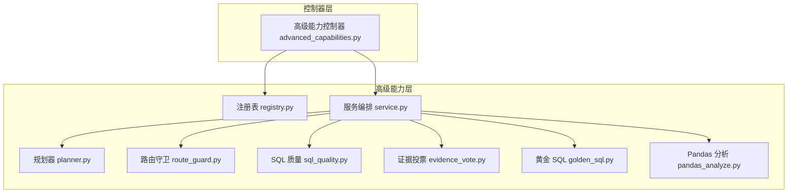
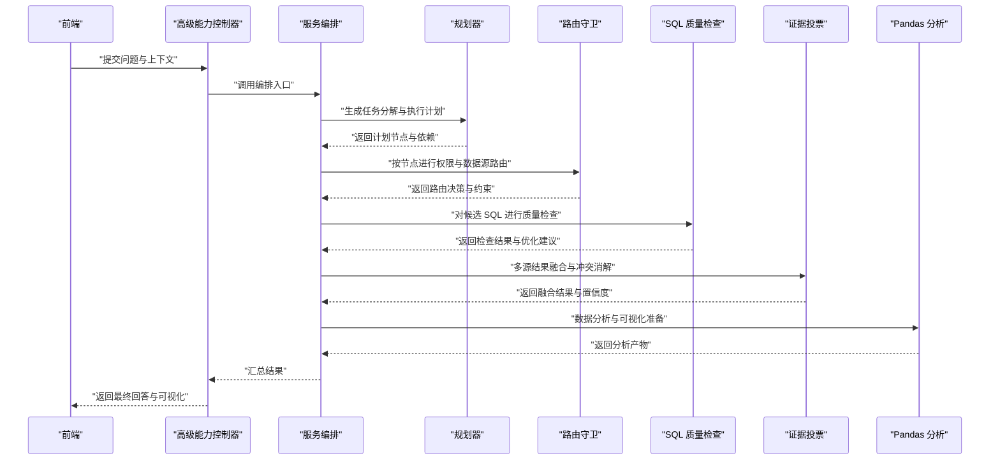
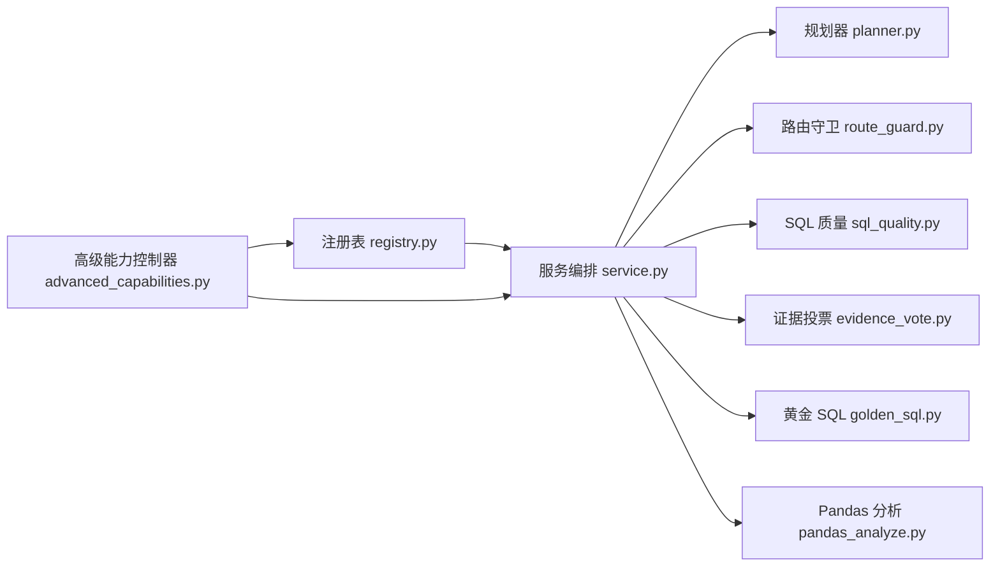

# 核心技能实现

<cite>
**本文引用的文件**   
- [backend/smartask_advanced/skills/planner.py](file://backend/smartask_advanced/skills/planner.py)
- [backend/smartask_advanced/skills/route_guard.py](file://backend/smartask_advanced/skills/route_guard.py)
- [backend/smartask_advanced/skills/sql_quality.py](file://backend/smartask_advanced/skills/sql_quality.py)
- [backend/smartask_advanced/skills/evidence_vote.py](file://backend/smartask_advanced/skills/evidence_vote.py)
- [backend/smartask_advanced/skills/golden_sql.py](file://backend/smartask_advanced/skills/golden_sql.py)
- [backend/smartask_advanced/skills/pandas_analyze.py](file://backend/smartask_advanced/skills/pandas_analyze.py)
- [backend/smartask_advanced/registry.py](file://backend/smartask_advanced/registry.py)
- [backend/smartask_advanced/service.py](file://backend/smartask_advanced/service.py)
- [backend/controllers/advanced_capabilities.py](file://backend/controllers/advanced_capabilities.py)
</cite>

## 目录
1. [简介](#简介)
2. [项目结构](#项目结构)
3. [核心组件](#核心组件)
4. [架构总览](#架构总览)
5. [详细组件分析](#详细组件分析)
6. [依赖关系分析](#依赖关系分析)
7. [性能考量](#性能考量)
8. [故障排除指南](#故障排除指南)
9. [结论](#结论)
10. [附录](#附录)

## 简介
本文件面向 SmartAsk 智能问数平台的核心技能实现，系统性阐述六大关键技能的职责、接口、数据流与算法要点：规划器技能（任务分解与执行计划生成）、路由守卫技能（权限检查、数据源路由与安全控制）、SQL 质量检查技能（语法验证、性能优化建议与代码规范）、证据投票技能（多源结果融合、置信度计算与冲突解决）、黄金 SQL 技能（最佳实践库、模板匹配与学习机制）、Pandas 分析技能（数据处理、统计分析与可视化支持）。文档同时提供使用示例与故障排除建议，帮助开发者快速集成与排障。

## 项目结构
SmartAsk 的高级能力以“技能”为粒度组织在 backend/smartask_advanced/skills 目录下，并通过 registry 注册、service 编排，最终由控制器暴露 API 供前端调用。

图表来源
- [backend/smartask_advanced/registry.py](file://backend/smartask_advanced/registry.py)
- [backend/smartask_advanced/service.py](file://backend/smartask_advanced/service.py)
- [backend/controllers/advanced_capabilities.py](file://backend/controllers/advanced_capabilities.py)

章节来源
- [backend/smartask_advanced/registry.py](file://backend/smartask_advanced/registry.py)
- [backend/smartask_advanced/service.py](file://backend/smartask_advanced/service.py)
- [backend/controllers/advanced_capabilities.py](file://backend/controllers/advanced_capabilities.py)

## 核心组件
- 规划器技能：将用户问题拆解为可执行的子任务，生成结构化执行计划，协调后续技能按序或并行执行。
- 路由守卫技能：基于角色、数据源可见性与安全策略进行访问控制，决定查询路由到哪个数据源或数据集。
- SQL 质量检查技能：对生成的 SQL 进行语法校验、性能启发式检查与代码规范审查，输出改进建议。
- 证据投票技能：汇聚多个候选结果（如不同数据源或不同 SQL），通过置信度评分与冲突消解策略得出最终答案。
- 黄金 SQL 技能：维护最佳实践 SQL 模板库，结合语义匹配与历史学习，推荐高质量 SQL 模板并持续优化。
- Pandas 分析技能：对中间结果进行数据清洗、聚合统计、特征工程与可视化准备，支撑报告与洞察生成。

章节来源
- [backend/smartask_advanced/skills/planner.py](file://backend/smartask_advanced/skills/planner.py)
- [backend/smartask_advanced/skills/route_guard.py](file://backend/smartask_advanced/skills/route_guard.py)
- [backend/smartask_advanced/skills/sql_quality.py](file://backend/smartask_advanced/skills/sql_quality.py)
- [backend/smartask_advanced/skills/evidence_vote.py](file://backend/smartask_advanced/skills/evidence_vote.py)
- [backend/smartask_advanced/skills/golden_sql.py](file://backend/smartask_advanced/skills/golden_sql.py)
- [backend/smartask_advanced/skills/pandas_analyze.py](file://backend/smartask_advanced/skills/pandas_analyze.py)

## 架构总览
整体流程从控制器接收请求，经服务编排调度各技能完成“理解—规划—路由—生成—校验—融合—分析”的闭环。

图表来源
- [backend/controllers/advanced_capabilities.py](file://backend/controllers/advanced_capabilities.py)
- [backend/smartask_advanced/service.py](file://backend/smartask_advanced/service.py)
- [backend/smartask_advanced/skills/planner.py](file://backend/smartask_advanced/skills/planner.py)
- [backend/smartask_advanced/skills/route_guard.py](file://backend/smartask_advanced/skills/route_guard.py)
- [backend/smartask_advanced/skills/sql_quality.py](file://backend/smartask_advanced/skills/sql_quality.py)
- [backend/smartask_advanced/skills/evidence_vote.py](file://backend/smartask_advanced/skills/evidence_vote.py)
- [backend/smartask_advanced/skills/pandas_analyze.py](file://backend/smartask_advanced/skills/pandas_analyze.py)

## 详细组件分析

### 规划器技能（planner）
- 功能概述
  - 对用户问题进行意图识别与任务分解，产出结构化执行计划（节点、依赖、输入输出契约）。
  - 支持串行、并行与条件分支的执行模式，便于后续路由守卫与 SQL 生成等技能协作。
- 接口定义
  - 输入参数
    - 问题文本、上下文信息（会话、用户角色、可用数据源清单）
    - 可选：历史计划、约束条件（时间范围、指标口径）
  - 返回值
    - 计划图（节点列表、边依赖、每个节点的输入输出类型）
    - 执行策略（并行度、重试策略、超时配置）
- 算法要点
  - 意图分类与实体抽取驱动的任务拆分
  - 依赖解析与拓扑排序保证执行顺序
  - 资源预估与并行度自适应调整
- 使用示例
  - 调用规划器生成计划后，交由服务编排依次执行路由守卫、SQL 生成与质量检查。
- 故障排除
  - 计划不可执行：检查节点依赖是否成环、输入输出类型是否匹配
  - 并行失败：确认下游技能是否线程安全，必要时降级为串行
  - 超时：调整节点超时阈值或拆分更细粒度任务

章节来源
- [backend/smartask_advanced/skills/planner.py](file://backend/smartask_advanced/skills/planner.py)

### 路由守卫技能（route_guard）
- 功能概述
  - 基于 RBAC 与数据源可见性策略，决定查询应路由至哪个数据源或数据集。
  - 支持别名解析、组织树过滤、字段级权限控制。
- 接口定义
  - 输入参数
    - 用户身份与角色、目标数据集/数据源标识、查询上下文（指标、维度、时间范围）
    - 策略配置（白名单、黑名单、脱敏规则）
  - 返回值
    - 路由决策（允许/拒绝/需确认）
    - 路由元数据（目标数据源、可见字段集、过滤条件）
- 算法要点
  - 角色-数据源映射与继承关系处理
  - 组织树路径匹配与层级权限叠加
  - 动态过滤条件注入（行级/列级）
- 使用示例
  - 在规划器生成节点后，对每个节点执行路由守卫，确保仅访问授权的数据源与字段。
- 故障排除
  - 权限不足：核对角色配置与数据源可见性策略
  - 路由歧义：补充别名或明确目标数据源
  - 脱敏异常：检查脱敏规则与字段映射

章节来源
- [backend/smartask_advanced/skills/route_guard.py](file://backend/smartask_advanced/skills/route_guard.py)

### SQL 质量检查技能（sql_quality）
- 功能概述
  - 对候选 SQL 进行语法校验、性能启发式检查与代码规范审查，输出改进建议与风险等级。
- 接口定义
  - 输入参数
    - SQL 文本、目标方言（MySQL/PostgreSQL 等）、上下文（表结构、索引信息）
    - 可选：规则集开关（性能、规范、安全）
  - 返回值
    - 检查结果（通过/警告/错误）
    - 建议列表（改写建议、索引建议、分页建议）
    - 风险评分与优先级
- 算法要点
  - 语法解析与 AST 遍历进行规则匹配
  - 性能启发式（全表扫描、笛卡尔积、低效连接）检测
  - 规范检查（命名约定、注释要求、禁止函数）
- 使用示例
  - 在 SQL 生成后进入质量检查，根据建议自动改写或人工确认后执行。
- 故障排除
  - 误报：更新规则集或放宽特定规则
  - 方言差异：切换目标方言或扩展方言适配
  - 性能建议无效：补充统计信息与索引元数据

章节来源
- [backend/smartask_advanced/skills/sql_quality.py](file://backend/smartask_advanced/skills/sql_quality.py)

### 证据投票技能（evidence_vote）
- 功能概述
  - 汇聚多源结果（不同数据源、不同 SQL、不同模型输出），通过置信度评分与冲突消解策略得到最终答案。
- 接口定义
  - 输入参数
    - 候选结果集合（含结果值、来源、置信度、时间戳）
    - 融合策略（加权平均、多数投票、时序优先）
    - 冲突阈值与回退策略
  - 返回值
    - 融合结果、综合置信度、来源权重分布
    - 冲突说明与处理记录
- 算法要点
  - 置信度归一化与动态权重更新
  - 冲突检测（数值偏差、语义不一致）
  - 回退机制（次优结果、保守估计）
- 使用示例
  - 当多数据源给出不同指标值时，使用证据投票融合并输出可信度最高的结果。
- 故障排除
  - 置信度失真：校准权重与评估指标
  - 冲突频繁：增加一致性校验或引入领域规则
  - 回退触发过多：优化上游生成质量

章节来源
- [backend/smartask_advanced/skills/evidence_vote.py](file://backend/smartask_advanced/skills/evidence_vote.py)

### 黄金 SQL 技能（golden_sql）
- 功能概述
  - 维护最佳实践 SQL 模板库，结合语义匹配与历史学习，推荐高质量 SQL 模板并持续优化。
- 接口定义
  - 输入参数
    - 查询意图描述、指标与维度、上下文（表结构、常用过滤）
    - 可选：历史成功模板、用户偏好
  - 返回值
    - 推荐模板（SQL 片段、参数占位符、适用场景）
    - 匹配得分与相似度说明
    - 学习反馈（采纳/修改/弃用）
- 算法要点
  - 模板索引与语义检索（关键词、结构相似性）
  - 历史采纳率与效果反馈驱动的学习
  - 模板版本管理与灰度发布
- 使用示例
  - 生成 SQL 前优先检索黄金模板，若命中则直接套用并微调参数。
- 故障排除
  - 匹配不准：扩充模板库与优化检索特征
  - 模板过时：定期审计与清理
  - 学习滞后：缩短反馈周期与提高标注质量

章节来源
- [backend/smartask_advanced/skills/golden_sql.py](file://backend/smartask_advanced/skills/golden_sql.py)

### Pandas 分析技能（pandas_analyze）
- 功能概述
  - 对中间结果进行数据清洗、聚合统计、特征工程与可视化准备，支撑报告与洞察生成。
- 接口定义
  - 输入参数
    - 数据帧（DataFrame）、分析目标（描述统计、趋势、对比）
    - 可选：分组键、时间窗口、可视化类型
  - 返回值
    - 分析结果（统计摘要、图表数据、洞察文本）
    - 可视化配置（图表类型、坐标轴、颜色方案）
- 算法要点
  - 缺失值处理与异常值检测
  - 时间序列重采样与滚动统计
  - 多维聚合与透视表构建
- 使用示例
  - 在证据投票后对融合结果进行趋势分析与可视化，输出图表数据与解读。
- 故障排除
  - 内存溢出：分块处理与降采样
  - 数据类型错误：统一类型转换与校验
  - 可视化异常：检查数据范围与标签格式

章节来源
- [backend/smartask_advanced/skills/pandas_analyze.py](file://backend/smartask_advanced/skills/pandas_analyze.py)

## 依赖关系分析
各技能通过注册表集中管理，服务编排统一调度，控制器对外暴露能力。

图表来源
- [backend/smartask_advanced/registry.py](file://backend/smartask_advanced/registry.py)
- [backend/smartask_advanced/service.py](file://backend/smartask_advanced/service.py)
- [backend/controllers/advanced_capabilities.py](file://backend/controllers/advanced_capabilities.py)

章节来源
- [backend/smartask_advanced/registry.py](file://backend/smartask_advanced/registry.py)
- [backend/smartask_advanced/service.py](file://backend/smartask_advanced/service.py)
- [backend/controllers/advanced_capabilities.py](file://backend/controllers/advanced_capabilities.py)

## 性能考量
- 规划器并行度：合理设置并发上限，避免下游资源争用；对 I/O 密集型任务采用异步。
- 路由守卫缓存：角色与数据源映射可缓存，减少重复计算。
- SQL 质量检查：规则集按需启用，避免全量扫描；利用 AST 预编译提升匹配速度。
- 证据投票：置信度更新可采用增量计算，降低全量重算开销。
- Pandas 分析：大数据集采用分块、向量化操作与合适的数据类型，减少内存占用。

## 故障排除指南
- 规划器
  - 现象：计划无法执行或循环依赖
  - 排查：检查节点依赖图是否有环，确认输入输出契约一致
- 路由守卫
  - 现象：权限拒绝或路由歧义
  - 排查：核对角色与数据源可见性策略，补充别名或明确目标
- SQL 质量检查
  - 现象：误报或建议无效
  - 排查：更新规则集、切换方言、补充统计信息
- 证据投票
  - 现象：置信度失真或冲突频繁
  - 排查：校准权重、增加一致性校验、优化上游生成
- 黄金 SQL
  - 现象：匹配不准或模板过时
  - 排查：扩充模板库、优化检索特征、定期审计
- Pandas 分析
  - 现象：内存溢出或数据类型错误
  - 排查：分块处理、统一类型、检查数据范围

## 结论
SmartAsk 的核心技能围绕“理解—规划—路由—生成—校验—融合—分析”形成完整闭环。通过清晰的接口定义、稳健的算法设计与完善的故障排除指南，平台能够稳定高效地支撑复杂问数场景。建议在生产环境中持续监控各技能的性能与准确率，结合反馈闭环不断优化模板与规则。

## 附录
- 术语表
  - 执行计划：由规划器生成的任务节点与依赖关系图
  - 路由守卫：基于权限与策略的数据源访问控制
  - 证据投票：多源结果融合与冲突消解机制
  - 黄金 SQL：最佳实践模板库与学习机制
  - Pandas 分析：数据处理、统计分析与可视化支持