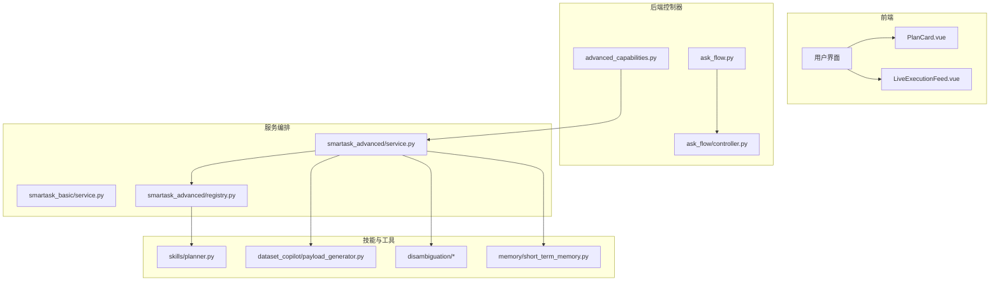
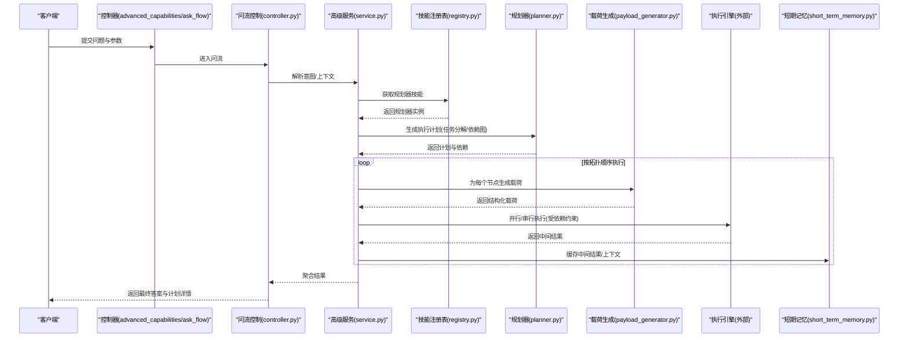
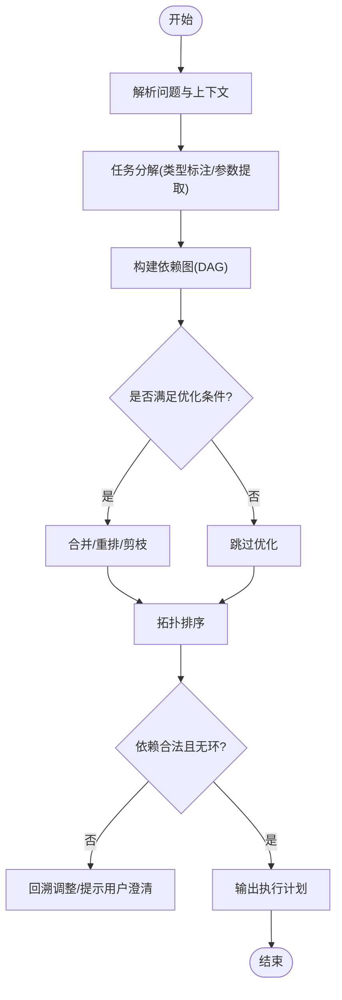
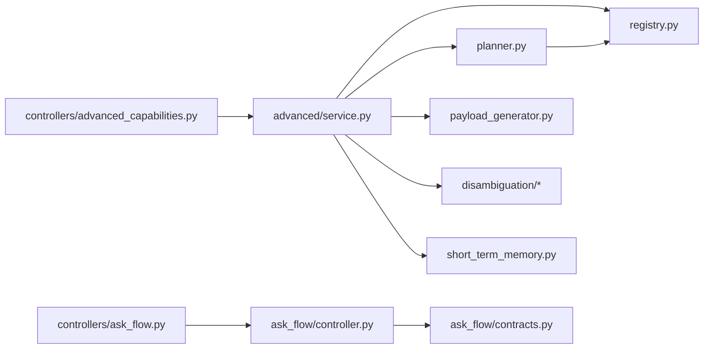

# 规划器技能

<cite>
**本文引用的文件**   
- [backend/smartask_advanced/skills/planner.py](file://backend/smartask_advanced/skills/planner.py)
- [backend/smartask_advanced/registry.py](file://backend/smartask_advanced/registry.py)
- [backend/smartask_advanced/service.py](file://backend/smartask_advanced/service.py)
- [backend/smartask_basic/service.py](file://backend/smartask_basic/service.py)
- [backend/controllers/advanced_capabilities.py](file://backend/controllers/advanced_capabilities.py)
- [backend/controllers/ask_flow.py](file://backend/controllers/ask_flow.py)
- [backend/ask_flow/controller.py](file://backend/ask_flow/controller.py)
- [backend/ask_flow/contracts.py](file://backend/ask_flow/contracts.py)
- [backend/dataset_copilot/payload_generator.py](file://backend/dataset_copilot/payload_generator.py)
- [backend/disambiguation/llm_arbiter.py](file://backend/disambiguation/llm_arbiter.py)
- [backend/disambiguation/option_builder.py](file://backend/disambiguation/option_builder.py)
- [backend/disambiguation/scoring.py](file://backend/disambiguation/scoring.py)
- [backend/memory/short_term_memory.py](file://backend/memory/short_term_memory.py)
- [frontend/src/components/smartask/PlanCard.vue](file://frontend/src/components/smartask/PlanCard.vue)
- [frontend/src/components/smartask/LiveExecutionFeed.vue](file://frontend/src/components/smartask/LiveExecutionFeed.vue)
</cite>

## 目录
1. [简介](#简介)
2. [项目结构](#项目结构)
3. [核心组件](#核心组件)
4. [架构总览](#架构总览)
5. [详细组件分析](#详细组件分析)
6. [依赖关系分析](#依赖关系分析)
7. [性能考虑](#性能考虑)
8. [故障排查指南](#故障排查指南)
9. [结论](#结论)
10. [附录](#附录)

## 简介
本文件面向 SmartAsk 智能问数平台的“规划器技能”，系统性阐述其任务分解算法、执行计划生成机制与复杂查询优化策略。文档覆盖多步骤查询处理、依赖关系管理、资源分配、接口定义、参数配置、执行流程、错误处理与性能优化建议，并提供具体使用示例，帮助读者快速掌握如何配置和执行复杂的分析任务。

## 项目结构
SmartAsk 的规划能力位于后端高级能力模块中，通过技能注册表暴露给上层控制器与服务编排层；前端通过可视化卡片与执行流展示计划与进度。关键路径如下：
- 技能实现：backend/smartask_advanced/skills/planner.py
- 技能注册与发现：backend/smartask_advanced/registry.py
- 高级服务编排：backend/smartask_advanced/service.py
- 基础服务编排：backend/smartask_basic/service.py
- 控制器入口（高级能力）：backend/controllers/advanced_capabilities.py
- 控制器入口（问答流程）：backend/controllers/ask_flow.py
- 问流控制与契约：backend/ask_flow/controller.py, backend/ask_flow/contracts.py
- 数据载荷生成：backend/dataset_copilot/payload_generator.py
- 歧义消解：backend/disambiguation/*
- 短期记忆：backend/memory/short_term_memory.py
- 前端计划与执行展示：frontend/src/components/smartask/PlanCard.vue, LiveExecutionFeed.vue

图表来源
- [backend/controllers/advanced_capabilities.py](file://backend/controllers/advanced_capabilities.py)
- [backend/controllers/ask_flow.py](file://backend/controllers/ask_flow.py)
- [backend/ask_flow/controller.py](file://backend/ask_flow/controller.py)
- [backend/smartask_advanced/service.py](file://backend/smartask_advanced/service.py)
- [backend/smartask_basic/service.py](file://backend/smartask_basic/service.py)
- [backend/smartask_advanced/registry.py](file://backend/smartask_advanced/registry.py)
- [backend/smartask_advanced/skills/planner.py](file://backend/smartask_advanced/skills/planner.py)
- [backend/dataset_copilot/payload_generator.py](file://backend/dataset_copilot/payload_generator.py)
- [backend/disambiguation/llm_arbiter.py](file://backend/disambiguation/llm_arbiter.py)
- [backend/disambiguation/option_builder.py](file://backend/disambiguation/option_builder.py)
- [backend/disambiguation/scoring.py](file://backend/disambiguation/scoring.py)
- [backend/memory/short_term_memory.py](file://backend/memory/short_term_memory.py)
- [frontend/src/components/smartask/PlanCard.vue](file://frontend/src/components/smartask/PlanCard.vue)
- [frontend/src/components/smartask/LiveExecutionFeed.vue](file://frontend/src/components/smartask/LiveExecutionFeed.vue)

章节来源
- [backend/smartask_advanced/skills/planner.py](file://backend/smartask_advanced/skills/planner.py)
- [backend/smartask_advanced/registry.py](file://backend/smartask_advanced/registry.py)
- [backend/smartask_advanced/service.py](file://backend/smartask_advanced/service.py)
- [backend/smartask_basic/service.py](file://backend/smartask_basic/service.py)
- [backend/controllers/advanced_capabilities.py](file://backend/controllers/advanced_capabilities.py)
- [backend/controllers/ask_flow.py](file://backend/controllers/ask_flow.py)
- [backend/ask_flow/controller.py](file://backend/ask_flow/controller.py)
- [backend/ask_flow/contracts.py](file://backend/ask_flow/contracts.py)
- [backend/dataset_copilot/payload_generator.py](file://backend/dataset_copilot/payload_generator.py)
- [backend/disambiguation/llm_arbiter.py](file://backend/disambiguation/llm_arbiter.py)
- [backend/disambiguation/option_builder.py](file://backend/disambiguation/option_builder.py)
- [backend/disambiguation/scoring.py](file://backend/disambiguation/scoring.py)
- [backend/memory/short_term_memory.py](file://backend/memory/short_term_memory.py)
- [frontend/src/components/smartask/PlanCard.vue](file://frontend/src/components/smartask/PlanCard.vue)
- [frontend/src/components/smartask/LiveExecutionFeed.vue](file://frontend/src/components/smartask/LiveExecutionFeed.vue)

## 核心组件
- 规划器技能（planner.py）：负责将自然语言问题拆解为可执行的子任务序列，构建依赖图，输出执行计划，并支持计划重算与回退。
- 技能注册表（registry.py）：维护技能名称到实现的映射，提供动态加载与调用入口。
- 高级服务编排（service.py）：串联意图识别、路由、规划、执行、结果聚合等阶段，协调各子系统。
- 基础服务编排（basic/service.py）：提供轻量级执行路径，用于简单查询场景。
- 控制器（advanced_capabilities.py, ask_flow.py）：对外暴露 HTTP API，接收请求、校验参数、转发至服务编排层。
- 问流控制与契约（ask_flow/controller.py, contracts.py）：定义流程状态机、输入输出契约与事件流。
- 数据载荷生成（payload_generator.py）：根据计划节点生成下游执行所需的结构化载荷。
- 歧义消解（disambiguation/*）：在意图或实体不明确时，生成候选选项并进行评分仲裁。
- 短期记忆（short_term_memory.py）：跨步骤共享上下文，避免重复推理与冗余计算。

章节来源
- [backend/smartask_advanced/skills/planner.py](file://backend/smartask_advanced/skills/planner.py)
- [backend/smartask_advanced/registry.py](file://backend/smartask_advanced/registry.py)
- [backend/smartask_advanced/service.py](file://backend/smartask_advanced/service.py)
- [backend/smartask_basic/service.py](file://backend/smartask_basic/service.py)
- [backend/controllers/advanced_capabilities.py](file://backend/controllers/advanced_capabilities.py)
- [backend/controllers/ask_flow.py](file://backend/controllers/ask_flow.py)
- [backend/ask_flow/controller.py](file://backend/ask_flow/controller.py)
- [backend/ask_flow/contracts.py](file://backend/ask_flow/contracts.py)
- [backend/dataset_copilot/payload_generator.py](file://backend/dataset_copilot/payload_generator.py)
- [backend/disambiguation/llm_arbiter.py](file://backend/disambiguation/llm_arbiter.py)
- [backend/disambiguation/option_builder.py](file://backend/disambiguation/option_builder.py)
- [backend/disambiguation/scoring.py](file://backend/disambiguation/scoring.py)
- [backend/memory/short_term_memory.py](file://backend/memory/short_term_memory.py)

## 架构总览
规划器处于“意图理解—计划生成—执行编排—结果聚合”的关键位置。上游通过控制器与问流契约传入用户问题与上下文；下游通过载荷生成器与执行引擎驱动 SQL/分析任务；歧义消解与短期记忆贯穿全链路，保障鲁棒性与效率。

图表来源
- [backend/controllers/advanced_capabilities.py](file://backend/controllers/advanced_capabilities.py)
- [backend/controllers/ask_flow.py](file://backend/controllers/ask_flow.py)
- [backend/ask_flow/controller.py](file://backend/ask_flow/controller.py)
- [backend/smartask_advanced/service.py](file://backend/smartask_advanced/service.py)
- [backend/smartask_advanced/registry.py](file://backend/smartask_advanced/registry.py)
- [backend/smartask_advanced/skills/planner.py](file://backend/smartask_advanced/skills/planner.py)
- [backend/dataset_copilot/payload_generator.py](file://backend/dataset_copilot/payload_generator.py)
- [backend/memory/short_term_memory.py](file://backend/memory/short_term_memory.py)

## 详细组件分析

### 规划器技能（planner.py）
- 职责
  - 任务分解：将复杂问题拆分为原子子任务，标注类型（如指标计算、过滤、分组、排序、关联）。
  - 依赖建模：构建有向无环图（DAG），表达子任务间的输入输出依赖。
  - 计划生成：输出可执行的步骤序列，包含每步的参数、资源需求与失败回退策略。
  - 计划优化：合并相邻同构步骤、消除冗余、基于代价估计进行重排。
  - 动态重算：当某一步失败或上下文变化时，局部重算受影响子树。
- 关键数据结构
  - 节点：标识、类型、参数、依赖列表、资源配额、重试策略。
  - 边：依赖方向与条件（可选）。
  - 计划：节点集合、拓扑序、全局约束（超时、并发度）。
- 复杂度与优化
  - DAG 构建与拓扑排序 O(V+E)。
  - 代价估计启发式：优先执行高收益低开销节点，减少后续分支。
  - 剪枝：对不可达或无效分支提前剔除。
- 错误处理
  - 节点级异常捕获与重试（指数退避）。
  - 计划级回滚：保留检查点，支持部分恢复。
  - 降级：当 LLM 或外部服务不可用时，退回规则化模板。

图表来源
- [backend/smartask_advanced/skills/planner.py](file://backend/smartask_advanced/skills/planner.py)

章节来源
- [backend/smartask_advanced/skills/planner.py](file://backend/smartask_advanced/skills/planner.py)

### 技能注册表（registry.py）
- 职责
  - 维护技能名到实现的映射。
  - 提供按需加载与版本兼容。
  - 统一调用入口，屏蔽实现细节。
- 设计要点
  - 插件化：新增技能无需改动主流程。
  - 元数据：描述技能能力、参数契约、兼容性矩阵。
- 扩展方式
  - 注册装饰器或显式注册函数。
  - 在高级服务编排中通过名称检索实例。

章节来源
- [backend/smartask_advanced/registry.py](file://backend/smartask_advanced/registry.py)

### 高级服务编排（service.py）
- 职责
  - 串联意图识别、路由、规划、执行、结果聚合。
  - 管理短期记忆与上下文传递。
  - 协调并发与超时、重试与回退。
- 关键流程
  - 输入校验与标准化。
  - 选择规划器技能（默认或指定）。
  - 生成计划后，按拓扑顺序调度执行。
  - 聚合中间结果，生成最终答案。
- 错误与恢复
  - 节点失败触发局部重算或降级策略。
  - 记录诊断信息供前端展示与调试。

章节来源
- [backend/smartask_advanced/service.py](file://backend/smartask_advanced/service.py)

### 基础服务编排（basic/service.py）
- 职责
  - 简化版执行路径，适用于单步或少量步骤的查询。
  - 降低延迟与资源消耗。
- 适用场景
  - 明确意图、单一数据集、无复杂依赖。

章节来源
- [backend/smartask_basic/service.py](file://backend/smartask_basic/service.py)

### 控制器与问流（advanced_capabilities.py, ask_flow.py, controller.py, contracts.py）
- 职责
  - 暴露 REST API，接收请求、鉴权、限流。
  - 定义问流状态机与事件契约。
  - 将请求分发至高级/基础服务编排。
- 契约要点
  - 输入：问题文本、上下文、参数、会话ID。
  - 输出：计划、步骤日志、中间结果、最终答案。
  - 事件：计划生成、步骤开始/完成、错误、完成。

章节来源
- [backend/controllers/advanced_capabilities.py](file://backend/controllers/advanced_capabilities.py)
- [backend/controllers/ask_flow.py](file://backend/controllers/ask_flow.py)
- [backend/ask_flow/controller.py](file://backend/ask_flow/controller.py)
- [backend/ask_flow/contracts.py](file://backend/ask_flow/contracts.py)

### 数据载荷生成（payload_generator.py）
- 职责
  - 将计划节点转换为下游执行引擎可消费的结构化载荷。
  - 注入上下文、权限、数据源路由信息。
- 关键点
  - 字段映射、类型转换、默认值填充。
  - 安全校验（SQL 白名单、参数化）。

章节来源
- [backend/dataset_copilot/payload_generator.py](file://backend/dataset_copilot/payload_generator.py)

### 歧义消解（disambiguation/*）
- 职责
  - 当意图或实体存在多种解释时，生成候选选项。
  - 基于评分模型与规则进行仲裁，选择最优解释。
- 组件
  - 选项构建：从知识库/历史/上下文中抽取候选。
  - 评分：语义相似度、业务规则、用户偏好。
  - 仲裁：LLM 辅助决策或确定性规则。

章节来源
- [backend/disambiguation/llm_arbiter.py](file://backend/disambiguation/llm_arbiter.py)
- [backend/disambiguation/option_builder.py](file://backend/disambiguation/option_builder.py)
- [backend/disambiguation/scoring.py](file://backend/disambiguation/scoring.py)

### 短期记忆（short_term_memory.py）
- 职责
  - 跨步骤共享上下文，避免重复推理。
  - 缓存中间结果，提升整体吞吐。
- 特性
  - TTL 过期、LRU 淘汰、键空间隔离（会话级）。

章节来源
- [backend/memory/short_term_memory.py](file://backend/memory/short_term_memory.py)

### 前端展示（PlanCard.vue, LiveExecutionFeed.vue）
- PlanCard
  - 渲染计划步骤、依赖关系、状态与耗时。
  - 支持展开/折叠与跳转查看细节。
- LiveExecutionFeed
  - 实时推送步骤开始/完成、错误与日志。
  - 支持回放与导出。

章节来源
- [frontend/src/components/smartask/PlanCard.vue](file://frontend/src/components/smartask/PlanCard.vue)
- [frontend/src/components/smartask/LiveExecutionFeed.vue](file://frontend/src/components/smartask/LiveExecutionFeed.vue)

## 依赖关系分析
规划器依赖技能注册表获取实现，被高级服务编排调用；同时与载荷生成、歧义消解、短期记忆协作。控制器与问流契约作为边界，确保前后端一致。

图表来源
- [backend/smartask_advanced/skills/planner.py](file://backend/smartask_advanced/skills/planner.py)
- [backend/smartask_advanced/registry.py](file://backend/smartask_advanced/registry.py)
- [backend/smartask_advanced/service.py](file://backend/smartask_advanced/service.py)
- [backend/dataset_copilot/payload_generator.py](file://backend/dataset_copilot/payload_generator.py)
- [backend/disambiguation/llm_arbiter.py](file://backend/disambiguation/llm_arbiter.py)
- [backend/disambiguation/option_builder.py](file://backend/disambiguation/option_builder.py)
- [backend/disambiguation/scoring.py](file://backend/disambiguation/scoring.py)
- [backend/memory/short_term_memory.py](file://backend/memory/short_term_memory.py)
- [backend/controllers/advanced_capabilities.py](file://backend/controllers/advanced_capabilities.py)
- [backend/controllers/ask_flow.py](file://backend/controllers/ask_flow.py)
- [backend/ask_flow/controller.py](file://backend/ask_flow/controller.py)
- [backend/ask_flow/contracts.py](file://backend/ask_flow/contracts.py)

章节来源
- [backend/smartask_advanced/skills/planner.py](file://backend/smartask_advanced/skills/planner.py)
- [backend/smartask_advanced/registry.py](file://backend/smartask_advanced/registry.py)
- [backend/smartask_advanced/service.py](file://backend/smartask_advanced/service.py)
- [backend/controllers/advanced_capabilities.py](file://backend/controllers/advanced_capabilities.py)
- [backend/controllers/ask_flow.py](file://backend/controllers/ask_flow.py)
- [backend/ask_flow/controller.py](file://backend/ask_flow/controller.py)
- [backend/ask_flow/contracts.py](file://backend/ask_flow/contracts.py)
- [backend/dataset_copilot/payload_generator.py](file://backend/dataset_copilot/payload_generator.py)
- [backend/disambiguation/llm_arbiter.py](file://backend/disambiguation/llm_arbiter.py)
- [backend/disambiguation/option_builder.py](file://backend/disambiguation/option_builder.py)
- [backend/disambiguation/scoring.py](file://backend/disambiguation/scoring.py)
- [backend/memory/short_term_memory.py](file://backend/memory/short_term_memory.py)

## 性能考虑
- 计划优化
  - 合并相邻同构步骤，减少调度开销。
  - 基于代价估计重排，优先执行高收益节点。
  - 剪枝不可达分支，降低搜索空间。
- 执行优化
  - 按依赖拓扑并行执行独立节点，提高吞吐。
  - 设置合理的并发度与超时，避免资源争用。
  - 使用短期记忆缓存中间结果，避免重复计算。
- 资源分配
  - 为不同节点设定 CPU/内存配额，防止热点阻塞。
  - 对重型任务采用异步队列与背压控制。
- 监控与调优
  - 采集步骤耗时、失败率、缓存命中率。
  - 基于观测调整阈值与策略（重试次数、退避系数）。

[本节为通用指导，不直接分析具体文件]

## 故障排查指南
- 常见问题
  - 计划生成失败：检查意图识别与上下文完整性，确认依赖图无环。
  - 节点执行超时：增大超时阈值或拆分大任务，检查下游服务健康。
  - 结果不一致：核对短期记忆键空间与 TTL，确保上下文稳定。
  - 歧义未解决：增加候选选项或调整评分权重，引入更多业务规则。
- 定位方法
  - 查看问流事件日志与步骤状态。
  - 导出计划与载荷，复现执行路径。
  - 启用调试模式，打印中间结构与依赖关系。
- 恢复策略
  - 局部重算受影响子树，利用检查点恢复。
  - 降级到规则化模板或简化计划。

章节来源
- [backend/ask_flow/controller.py](file://backend/ask_flow/controller.py)
- [backend/ask_flow/contracts.py](file://backend/ask_flow/contracts.py)
- [backend/smartask_advanced/service.py](file://backend/smartask_advanced/service.py)
- [backend/memory/short_term_memory.py](file://backend/memory/short_term_memory.py)

## 结论
规划器技能是 SmartAsk 的核心能力之一，通过任务分解、依赖建模与计划优化，支撑复杂多步骤查询的高效执行。结合技能注册表、服务编排、载荷生成、歧义消解与短期记忆，形成完整闭环。通过合理配置与持续优化，可在保证正确性的前提下显著提升性能与稳定性。

[本节为总结性内容，不直接分析具体文件]

## 附录

### 接口定义与参数配置
- 控制器接口
  - 输入：问题文本、上下文、参数、会话ID、计划选项（并发度、超时、重试策略）。
  - 输出：计划详情、步骤日志、中间结果、最终答案。
- 规划器参数
  - 任务类型枚举、依赖约束、资源配额、回退策略、优化开关。
- 载荷生成参数
  - 字段映射、类型转换、默认值、安全校验规则。
- 问流契约
  - 状态机定义、事件类型、错误码规范。

章节来源
- [backend/controllers/advanced_capabilities.py](file://backend/controllers/advanced_capabilities.py)
- [backend/controllers/ask_flow.py](file://backend/controllers/ask_flow.py)
- [backend/ask_flow/contracts.py](file://backend/ask_flow/contracts.py)
- [backend/dataset_copilot/payload_generator.py](file://backend/dataset_copilot/payload_generator.py)

### 执行流程与使用示例
- 端到端流程
  - 前端提交问题 → 控制器校验 → 问流进入 → 服务编排选择规划器 → 生成计划 → 按拓扑执行 → 聚合结果 → 返回前端。
- 配置示例
  - 设置并发度为 3，超时 30s，开启计划优化与短期记忆缓存。
  - 指定特定规划器技能版本，禁用降级以强制失败快速反馈。
- 执行示例
  - 多步骤查询：先过滤时间范围，再分组统计，最后排序取 TopN。
  - 依赖管理：步骤 B 依赖 A 的输出，步骤 C 与 D 并行执行。
  - 资源分配：为重型步骤分配更高内存与更长超时。

章节来源
- [backend/smartask_advanced/service.py](file://backend/smartask_advanced/service.py)
- [backend/smartask_advanced/skills/planner.py](file://backend/smartask_advanced/skills/planner.py)
- [backend/dataset_copilot/payload_generator.py](file://backend/dataset_copilot/payload_generator.py)
- [backend/memory/short_term_memory.py](file://backend/memory/short_term_memory.py)

### 复杂查询优化策略
- 计划层面
  - 合并同构步骤、消除冗余、剪枝不可达分支。
  - 基于代价估计重排，优先执行高收益节点。
- 执行层面
  - 并行执行独立节点，限制并发度避免过载。
  - 使用短期记忆缓存中间结果，减少重复计算。
- 资源层面
  - 节点级资源配额与超时控制。
  - 异步队列与背压，平滑峰值流量。

章节来源
- [backend/smartask_advanced/skills/planner.py](file://backend/smartask_advanced/skills/planner.py)
- [backend/smartask_advanced/service.py](file://backend/smartask_advanced/service.py)
- [backend/memory/short_term_memory.py](file://backend/memory/short_term_memory.py)

### 错误处理与回退
- 节点级
  - 捕获异常、指数退避重试、记录诊断信息。
- 计划级
  - 检查点保存、局部重算、降级到规则化模板。
- 系统级
  - 超时熔断、降级开关、快速失败策略。

章节来源
- [backend/smartask_advanced/service.py](file://backend/smartask_advanced/service.py)
- [backend/ask_flow/contracts.py](file://backend/ask_flow/contracts.py)

### 前端交互与可视化
- PlanCard
  - 展示计划步骤、依赖关系、状态与耗时。
  - 支持展开/折叠与跳转查看细节。
- LiveExecutionFeed
  - 实时推送步骤开始/完成、错误与日志。
  - 支持回放与导出。

章节来源
- [frontend/src/components/smartask/PlanCard.vue](file://frontend/src/components/smartask/PlanCard.vue)
- [frontend/src/components/smartask/LiveExecutionFeed.vue](file://frontend/src/components/smartask/LiveExecutionFeed.vue)