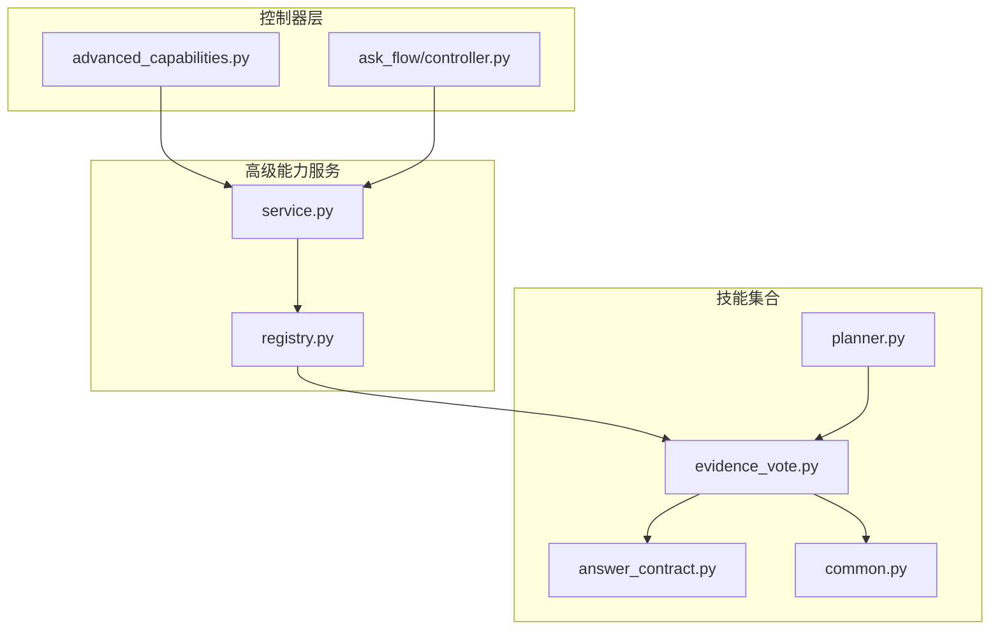
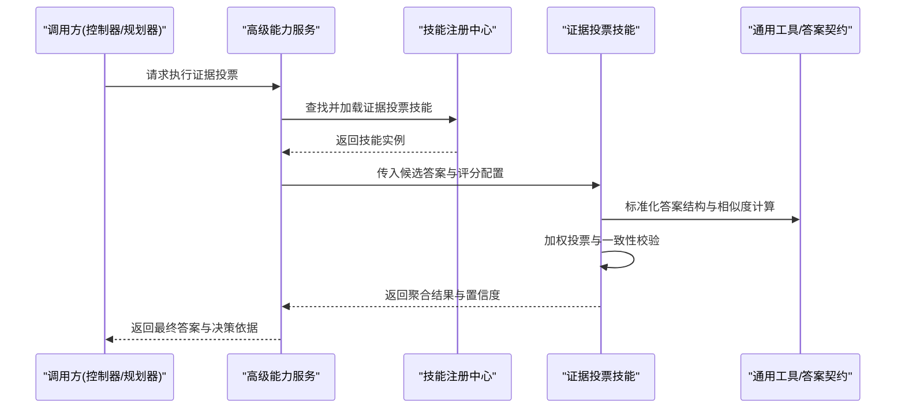
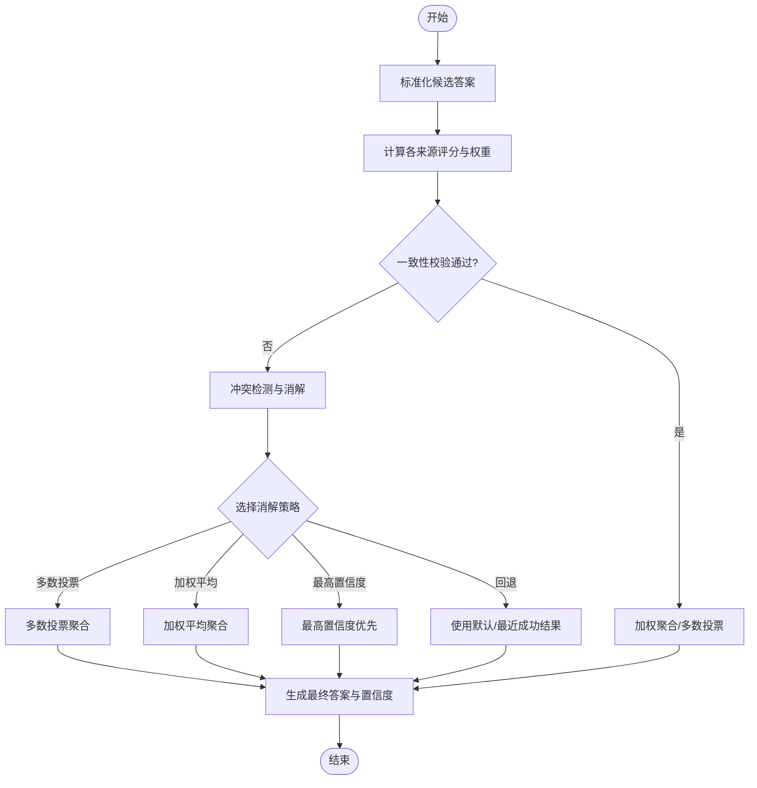
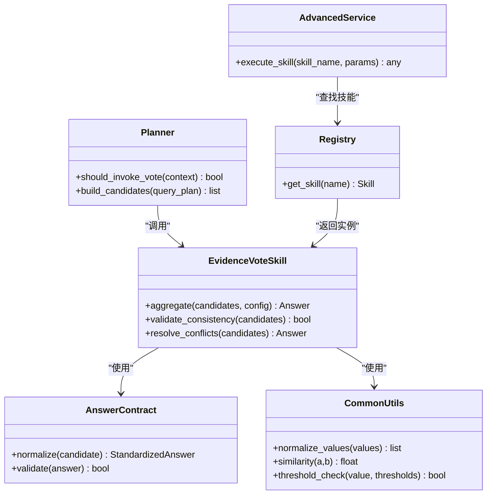

# 证据投票技能

<cite>
**本文引用的文件**   
- [evidence_vote.py](file://backend/smartask_advanced/skills/evidence_vote.py)
- [service.py](file://backend/smartask_advanced/service.py)
- [registry.py](file://backend/smartask_advanced/registry.py)
- [answer_contract.py](file://backend/smartask_advanced/skills/answer_contract.py)
- [common.py](file://backend/smartask_advanced/skills/common.py)
- [planner.py](file://backend/smartask_advanced/skills/planner.py)
- [advanced_capabilities.py](file://backend/controllers/advanced_capabilities.py)
- [ask_flow_controller.py](file://backend/ask_flow/controller.py)
</cite>

## 目录
1. [简介](#简介)
2. [项目结构](#项目结构)
3. [核心组件](#核心组件)
4. [架构总览](#架构总览)
5. [详细组件分析](#详细组件分析)
6. [依赖关系分析](#依赖关系分析)
7. [性能考虑](#性能考虑)
8. [故障排查指南](#故障排查指南)
9. [结论](#结论)
10. [附录](#附录)

## 简介
本文件为 SmartAsk 智能问数平台的“证据投票技能”提供系统化文档，聚焦多源结果融合算法、置信度计算模型与冲突解决策略。内容涵盖：
- 如何整合多个数据源的查询结果（SQL、Pandas 分析、模板化答案等）
- 权重分配与一致性验证机制
- 投票接口定义、评分算法配置、结果聚合逻辑与异常处理
- 典型投票示例与复杂场景处理建议，以提升最终答案的准确性与可解释性

## 项目结构
证据投票技能位于后端高级能力模块中，通过技能注册中心暴露给上层编排流程（规划器、控制器等）。关键路径如下：
- 技能实现：backend/smartask_advanced/skills/evidence_vote.py
- 技能注册与服务入口：backend/smartask_advanced/registry.py、backend/smartask_advanced/service.py
- 答案契约与通用工具：backend/smartask_advanced/skills/answer_contract.py、backend/smartask_advanced/skills/common.py
- 上层编排：backend/smartask_advanced/skills/planner.py、backend/controllers/advanced_capabilities.py、backend/ask_flow/controller.py

图表来源
- [service.py](file://backend/smartask_advanced/service.py)
- [registry.py](file://backend/smartask_advanced/registry.py)
- [evidence_vote.py](file://backend/smartask_advanced/skills/evidence_vote.py)
- [answer_contract.py](file://backend/smartask_advanced/skills/answer_contract.py)
- [common.py](file://backend/smartask_advanced/skills/common.py)
- [planner.py](file://backend/smartask_advanced/skills/planner.py)
- [advanced_capabilities.py](file://backend/controllers/advanced_capabilities.py)
- [ask_flow_controller.py](file://backend/ask_flow/controller.py)

章节来源
- [service.py](file://backend/smartask_advanced/service.py)
- [registry.py](file://backend/smartask_advanced/registry.py)
- [evidence_vote.py](file://backend/smartask_advanced/skills/evidence_vote.py)
- [answer_contract.py](file://backend/smartask_advanced/skills/answer_contract.py)
- [common.py](file://backend/smartask_advanced/skills/common.py)
- [planner.py](file://backend/smartask_advanced/skills/planner.py)
- [advanced_capabilities.py](file://backend/controllers/advanced_capabilities.py)
- [ask_flow_controller.py](file://backend/ask_flow/controller.py)

## 核心组件
- 证据投票技能（Evidence Vote Skill）
  - 职责：接收来自多数据源的候选答案与元信息，执行加权投票、一致性校验与冲突消解，输出最终答案及置信度。
  - 输入：候选答案列表（含来源类型、原始结果、评分、权重等）、评分策略配置、阈值与回退策略。
  - 输出：聚合后的答案、置信度、决策依据（各来源贡献度、冲突标记、一致性指标）。
- 答案契约（Answer Contract）
  - 职责：统一答案数据结构与字段语义，确保不同来源的结果具备可比性与可聚合性。
- 通用工具（Common Utilities）
  - 职责：数值归一化、相似度度量、阈值判定、异常封装与日志记录。
- 规划器（Planner）
  - 职责：在任务编排阶段决定何时调用证据投票技能，以及传入的参数与上下文。

章节来源
- [evidence_vote.py](file://backend/smartask_advanced/skills/evidence_vote.py)
- [answer_contract.py](file://backend/smartask_advanced/skills/answer_contract.py)
- [common.py](file://backend/smartask_advanced/skills/common.py)
- [planner.py](file://backend/smartask_advanced/skills/planner.py)

## 架构总览
证据投票技能嵌入到高级能力服务中，由控制器或规划器触发。整体流程包括：
- 上游收集多源候选答案（如 SQL 查询结果、Pandas 分析结果、模板答案等）
- 将候选答案标准化为统一答案契约
- 应用评分策略与权重分配
- 执行一致性校验与冲突检测
- 生成最终答案与置信度，并附带决策依据

图表来源
- [service.py](file://backend/smartask_advanced/service.py)
- [registry.py](file://backend/smartask_advanced/registry.py)
- [evidence_vote.py](file://backend/smartask_advanced/skills/evidence_vote.py)
- [answer_contract.py](file://backend/smartask_advanced/skills/answer_contract.py)
- [common.py](file://backend/smartask_advanced/skills/common.py)

## 详细组件分析

### 证据投票技能（Evidence Vote）
- 功能要点
  - 多源候选答案聚合：支持 SQL、Pandas、模板等多类型来源
  - 评分与权重：按来源可信度、结果质量、时间新鲜度等维度动态赋权
  - 一致性验证：基于数值区间、文本相似度、字段对齐进行一致性检查
  - 冲突解决：多数投票、加权平均、最高置信度优先、降级回退
  - 异常处理：缺失来源、评分失败、不一致阈值越界等
- 接口约定（概念性描述）
  - 输入参数：候选答案数组、评分策略配置、阈值配置、回退策略
  - 返回值：聚合答案、置信度、决策依据（来源贡献、冲突标记、一致性指标）
- 复杂度与优化
  - 相似度计算与一致性校验的时间复杂度取决于候选数量与字段规模
  - 可通过缓存相似度表、并行计算提升吞吐

图表来源
- [evidence_vote.py](file://backend/smartask_advanced/skills/evidence_vote.py)
- [common.py](file://backend/smartask_advanced/skills/common.py)
- [answer_contract.py](file://backend/smartask_advanced/skills/answer_contract.py)

章节来源
- [evidence_vote.py](file://backend/smartask_advanced/skills/evidence_vote.py)
- [common.py](file://backend/smartask_advanced/skills/common.py)
- [answer_contract.py](file://backend/smartask_advanced/skills/answer_contract.py)

### 答案契约（Answer Contract）
- 作用：统一不同来源的答案结构，确保字段一致、类型明确、可比较
- 关键字段（概念性描述）：来源类型、原始值、数值/文本表示、时间戳、元数据（如数据来源、版本）
- 约束：必填字段校验、类型转换、空值处理、单位与精度规范

章节来源
- [answer_contract.py](file://backend/smartask_advanced/skills/answer_contract.py)

### 通用工具（Common Utilities）
- 功能：数值归一化、相似度度量（文本/数值）、阈值判定、异常封装、日志记录
- 设计原则：无副作用、幂等、可测试、可替换实现

章节来源
- [common.py](file://backend/smartask_advanced/skills/common.py)

### 规划器（Planner）
- 作用：在任务编排中决定是否调用证据投票技能，以及如何组织候选答案与上下文
- 集成点：与控制器和服务层交互，传递参数与结果

章节来源
- [planner.py](file://backend/smartask_advanced/skills/planner.py)

## 依赖关系分析
证据投票技能依赖答案契约与通用工具；被服务层与注册中心管理；由控制器或规划器触发。

图表来源
- [evidence_vote.py](file://backend/smartask_advanced/skills/evidence_vote.py)
- [answer_contract.py](file://backend/smartask_advanced/skills/answer_contract.py)
- [common.py](file://backend/smartask_advanced/skills/common.py)
- [planner.py](file://backend/smartask_advanced/skills/planner.py)
- [service.py](file://backend/smartask_advanced/service.py)
- [registry.py](file://backend/smartask_advanced/registry.py)

章节来源
- [evidence_vote.py](file://backend/smartask_advanced/skills/evidence_vote.py)
- [answer_contract.py](file://backend/smartask_advanced/skills/answer_contract.py)
- [common.py](file://backend/smartask_advanced/skills/common.py)
- [planner.py](file://backend/smartask_advanced/skills/planner.py)
- [service.py](file://backend/smartask_advanced/service.py)
- [registry.py](file://backend/smartask_advanced/registry.py)

## 性能考虑
- 相似度计算与一致性校验可能成为瓶颈，建议：
  - 对相似度矩阵进行缓存与增量更新
  - 并行处理候选答案的评分与校验
  - 限制候选数量与字段规模，必要时采样
- 权重分配与聚合逻辑应尽量向量化，减少循环与分支
- 异常路径快速失败，避免阻塞主流程

[本节为通用指导，不直接分析具体文件]

## 故障排查指南
- 常见问题
  - 候选答案缺失或结构不一致：检查答案契约的标准化与校验逻辑
  - 评分失败或权重异常：确认评分策略配置与阈值设置
  - 一致性校验频繁失败：调整相似度阈值与数值容差
  - 冲突无法消解：检查回退策略与默认值配置
- 诊断步骤
  - 查看日志中的异常信息与决策依据
  - 打印中间结果（标准化后答案、评分分布、一致性指标）
  - 逐步缩小候选集定位问题来源

章节来源
- [evidence_vote.py](file://backend/smartask_advanced/skills/evidence_vote.py)
- [common.py](file://backend/smartask_advanced/skills/common.py)
- [answer_contract.py](file://backend/smartask_advanced/skills/answer_contract.py)

## 结论
证据投票技能通过统一的答案契约、灵活的评分与权重机制、严格的一致性校验与多种冲突消解策略，有效提升了多源数据融合结果的准确性与可解释性。在实际使用中，应结合业务场景调优评分策略与阈值，并充分利用日志与诊断工具定位问题。

[本节为总结性内容，不直接分析具体文件]

## 附录
- 典型投票示例（概念性说明）
  - 场景：同一指标从 SQL 查询、Pandas 分析与模板答案三个来源得到不同结果
  - 步骤：
    - 标准化答案结构，提取数值与时间戳
    - 计算相似度与一致性，识别冲突
    - 根据来源可信度与结果质量分配权重
    - 执行加权平均或多数投票，生成最终答案与置信度
  - 效果：在多源不一致时仍能给出稳健的最终答案，并提供决策依据供审计

[本节为概念性说明，不直接分析具体文件]