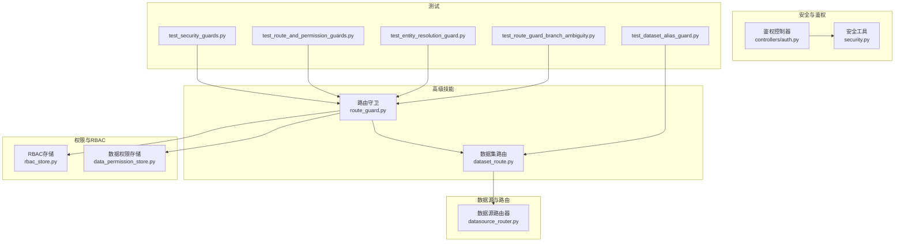
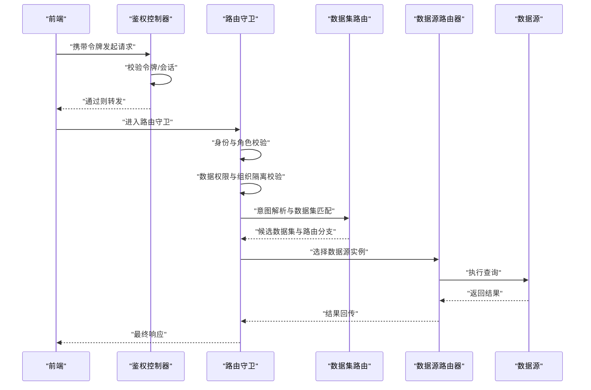
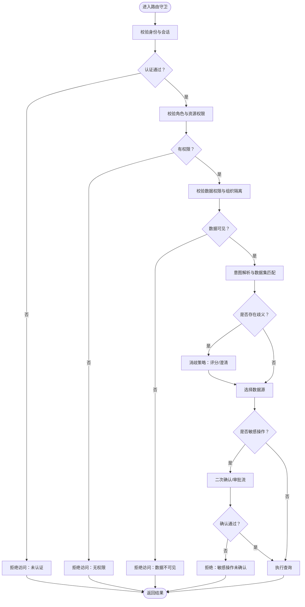
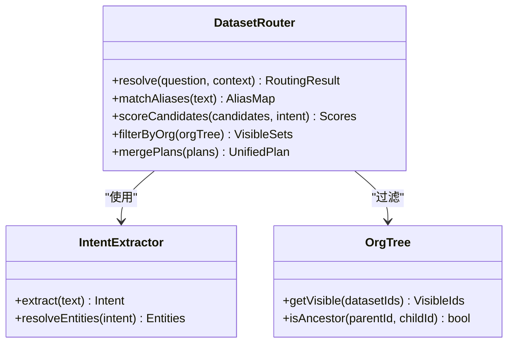
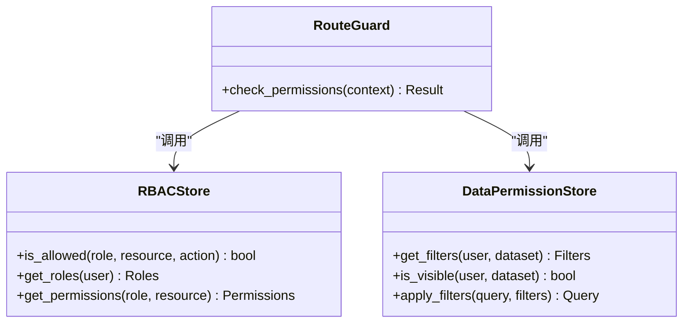
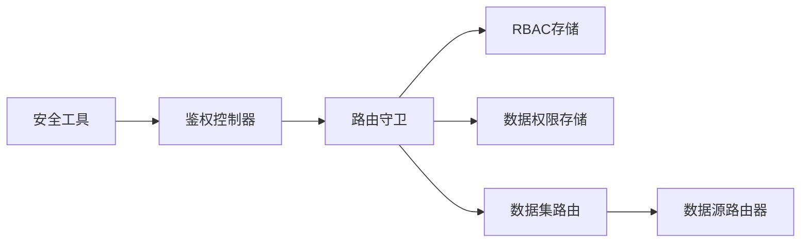

# 路由守卫技能

<cite>
**本文引用的文件**   
- [route_guard.py](file://backend/smartask_advanced/skills/route_guard.py)
- [dataset_route.py](file://backend/smartask_advanced/skills/dataset_route.py)
- [rbac_store.py](file://backend/rbac_store.py)
- [data_permission_store.py](file://backend/data_permission_store.py)
- [datasource_router.py](file://backend/datasource_router.py)
- [security.py](file://backend/security.py)
- [auth.py](file://backend/controllers/auth.py)
- [test_security_guards.py](file://backend/tests/test_security_guards.py)
- [test_route_and_permission_guards.py](file://backend/tests/test_route_and_permission_guards.py)
- [test_dataset_alias_guard.py](file://backend/tests/test_dataset_alias_guard.py)
- [test_entity_resolution_guard.py](file://backend/tests/test_entity_resolution_guard.py)
- [test_route_guard_branch_ambiguity.py](file://backend/tests/test_route_guard_branch_ambiguity.py)
</cite>

## 目录
1. [简介](#简介)
2. [项目结构](#项目结构)
3. [核心组件](#核心组件)
4. [架构总览](#架构总览)
5. [详细组件分析](#详细组件分析)
6. [依赖关系分析](#依赖关系分析)
7. [性能考量](#性能考量)
8. [故障排查指南](#故障排查指南)
9. [结论](#结论)
10. [附录：配置与示例](#附录配置与示例)

## 简介
本文件为 SmartAsk 智能问数平台“路由守卫技能”的权威技术文档，聚焦以下目标：
- 权限检查机制：用户身份、角色与数据权限的统一校验。
- 数据源路由逻辑：基于数据集、组织与实体解析的多分支路由决策。
- 安全控制策略：敏感操作防护、最小权限原则与审计可追溯。
- 接口定义与规则配置：路由守卫能力对外暴露的契约与配置项。
- 路由决策流程与异常处理：从请求进入至最终落库/查询的全链路控制点。
- 配置示例：不同角色的访问权限与数据隔离策略落地方法。

## 项目结构
围绕“路由守卫技能”的关键代码集中在后端高级能力模块与权限存储层：
- 高级技能实现：路由守卫、数据集路由等位于 smartask_advanced/skills 下。
- 权限与 RBAC：角色-资源-权限模型与数据级权限存储。
- 数据源路由：按数据集维度选择具体数据源与连接。
- 安全基础：通用安全工具与鉴权控制器。
- 测试用例：覆盖多场景的路由守卫与权限校验。

图表来源
- [route_guard.py](file://backend/smartask_advanced/skills/route_guard.py)
- [dataset_route.py](file://backend/smartask_advanced/skills/dataset_route.py)
- [rbac_store.py](file://backend/rbac_store.py)
- [data_permission_store.py](file://backend/data_permission_store.py)
- [datasource_router.py](file://backend/datasource_router.py)
- [security.py](file://backend/security.py)
- [auth.py](file://backend/controllers/auth.py)
- [test_security_guards.py](file://backend/tests/test_security_guards.py)
- [test_route_and_permission_guards.py](file://backend/tests/test_route_and_permission_guards.py)
- [test_dataset_alias_guard.py](file://backend/tests/test_dataset_alias_guard.py)
- [test_entity_resolution_guard.py](file://backend/tests/test_entity_resolution_guard.py)
- [test_route_guard_branch_ambiguity.py](file://backend/tests/test_route_guard_branch_ambiguity.py)

章节来源
- [route_guard.py](file://backend/smartask_advanced/skills/route_guard.py)
- [dataset_route.py](file://backend/smartask_advanced/skills/dataset_route.py)
- [rbac_store.py](file://backend/rbac_store.py)
- [data_permission_store.py](file://backend/data_permission_store.py)
- [datasource_router.py](file://backend/datasource_router.py)
- [security.py](file://backend/security.py)
- [auth.py](file://backend/controllers/auth.py)

## 核心组件
- 路由守卫（Route Guard）
  - 职责：在请求进入业务前进行身份、角色、数据权限与上下文一致性校验；决定路由分支或拒绝访问。
  - 关键能力：用户会话校验、RBAC 权限判定、数据集别名解析、实体解析约束、分支歧义处理、敏感操作拦截。
- 数据集路由（Dataset Route）
  - 职责：根据问题意图、组织上下文与数据集元数据，选择最匹配的数据集与查询路径。
  - 关键能力：别名映射、维度/指标匹配、组织树过滤、多数据集合并策略。
- RBAC 存储（RBAC Store）
  - 职责：维护角色、资源、权限三元组及继承关系，提供快速判定接口。
- 数据权限存储（Data Permission Store）
  - 职责：维护行级/列级数据权限、租户/组织隔离策略与动态过滤条件。
- 数据源路由器（Datasource Router）
  - 职责：将数据集映射到具体数据源实例，支持多库/多实例切换与连接池管理。
- 安全工具与安全控制器
  - 职责：通用加密、签名、令牌校验、输入清洗、审计日志等。

章节来源
- [route_guard.py](file://backend/smartask_advanced/skills/route_guard.py)
- [dataset_route.py](file://backend/smartask_advanced/skills/dataset_route.py)
- [rbac_store.py](file://backend/rbac_store.py)
- [data_permission_store.py](file://backend/data_permission_store.py)
- [datasource_router.py](file://backend/datasource_router.py)
- [security.py](file://backend/security.py)
- [auth.py](file://backend/controllers/auth.py)

## 架构总览
下图展示一次“智能问数”请求经过路由守卫的完整调用链：前端发起请求，鉴权控制器验证令牌，路由守卫执行权限与上下文校验，数据集路由选择目标数据集，数据源路由器选择具体数据源并执行查询，最后返回结果。

图表来源
- [auth.py](file://backend/controllers/auth.py)
- [route_guard.py](file://backend/smartask_advanced/skills/route_guard.py)
- [dataset_route.py](file://backend/smartask_advanced/skills/dataset_route.py)
- [datasource_router.py](file://backend/datasource_router.py)

## 详细组件分析

### 路由守卫（Route Guard）
- 设计要点
  - 入口统一：所有涉及数据访问的请求先经路由守卫。
  - 分层校验：身份认证 → 角色授权 → 数据权限 → 上下文一致性 → 敏感操作保护。
  - 分支决策：根据数据集匹配度、组织范围、实体解析结果选择路由分支。
  - 异常处理：对非法令牌、越权访问、歧义路由、缺失上下文等给出明确错误码与提示。
- 关键流程
  - 用户权限验证：校验会话有效性、角色是否具备所需资源权限。
  - 数据集访问控制：依据数据集别名、组织树、行列级权限过滤。
  - 敏感操作防护：对导出、批量删除、跨租户访问等进行二次确认或阻断。
  - 路由决策：当存在多个候选数据集时，采用评分与消歧策略确定唯一分支。
- 接口契约（概念性）
  - 输入：用户上下文（身份、角色、组织）、请求参数（问题文本、数据集标识、操作类型）。
  - 输出：路由决策（目标数据集、数据源、查询计划）、权限结果（允许/拒绝/需确认）、错误信息。
- 典型异常
  - 未认证/会话过期、无权限访问、数据集不存在或不可见、实体解析失败、分支歧义、敏感操作被拒。

图表来源
- [route_guard.py](file://backend/smartask_advanced/skills/route_guard.py)
- [rbac_store.py](file://backend/rbac_store.py)
- [data_permission_store.py](file://backend/data_permission_store.py)
- [dataset_route.py](file://backend/smartask_advanced/skills/dataset_route.py)

章节来源
- [route_guard.py](file://backend/smartask_advanced/skills/route_guard.py)
- [test_security_guards.py](file://backend/tests/test_security_guards.py)
- [test_route_and_permission_guards.py](file://backend/tests/test_route_and_permission_guards.py)
- [test_route_guard_branch_ambiguity.py](file://backend/tests/test_route_guard_branch_ambiguity.py)

### 数据集路由（Dataset Route）
- 设计要点
  - 别名映射：将自然语言中的数据集名称映射到内部数据集ID。
  - 维度/指标匹配：结合问题语义与数据集元数据进行匹配打分。
  - 组织树过滤：仅返回当前组织及其子组织可见的数据集。
  - 多数据集合并：当问题涉及多个数据集时，生成联合查询计划。
- 关键流程
  - 输入问题与上下文 → 提取实体与意图 → 检索候选数据集 → 评分排序 → 输出路由分支。
- 异常处理
  - 无匹配数据集、匹配度低于阈值、组织不可见、别名冲突等。

图表来源
- [dataset_route.py](file://backend/smartask_advanced/skills/dataset_route.py)

章节来源
- [dataset_route.py](file://backend/smartask_advanced/skills/dataset_route.py)
- [test_dataset_alias_guard.py](file://backend/tests/test_dataset_alias_guard.py)

### RBAC 与数据权限存储
- RBAC 存储
  - 维护角色-资源-权限三元组，支持继承与组合权限。
  - 提供 is_allowed(role, resource, action) 判定接口。
- 数据权限存储
  - 维护行级/列级权限、租户/组织隔离策略、动态过滤表达式。
  - 提供 get_filters(user, dataset) 返回 SQL 注入安全的过滤条件。
- 交互关系
  - 路由守卫在权限判定阶段调用 RBAC 与数据权限存储，确保最小权限与数据隔离。

图表来源
- [rbac_store.py](file://backend/rbac_store.py)
- [data_permission_store.py](file://backend/data_permission_store.py)
- [route_guard.py](file://backend/smartask_advanced/skills/route_guard.py)

章节来源
- [rbac_store.py](file://backend/rbac_store.py)
- [data_permission_store.py](file://backend/data_permission_store.py)

### 数据源路由器（Datasource Router）
- 职责：将数据集映射到具体数据源实例，支持多库/多实例、读写分离、连接池。
- 关键能力：数据源发现、健康检查、负载均衡、故障转移。
- 与路由守卫协作：在路由守卫完成权限与数据集选择后，由数据源路由器选择具体连接并执行查询。

章节来源
- [datasource_router.py](file://backend/datasource_router.py)

### 安全工具与鉴权控制器
- 安全工具：令牌签发/校验、签名、加密、输入清洗、审计日志。
- 鉴权控制器：统一入口校验用户身份与会话状态，失败直接拒绝。

章节来源
- [security.py](file://backend/security.py)
- [auth.py](file://backend/controllers/auth.py)

## 依赖关系分析
- 低耦合高内聚：路由守卫作为编排器，依赖 RBAC、数据权限、数据集路由与数据源路由器，但不直接实现其内部逻辑。
- 外部依赖：数据库、缓存（可选）、消息队列（审计日志可选）。
- 潜在循环依赖：应避免路由守卫与数据集路由之间出现双向调用，通过接口解耦。

图表来源
- [route_guard.py](file://backend/smartask_advanced/skills/route_guard.py)
- [rbac_store.py](file://backend/rbac_store.py)
- [data_permission_store.py](file://backend/data_permission_store.py)
- [dataset_route.py](file://backend/smartask_advanced/skills/dataset_route.py)
- [datasource_router.py](file://backend/datasource_router.py)
- [auth.py](file://backend/controllers/auth.py)
- [security.py](file://backend/security.py)

章节来源
- [route_guard.py](file://backend/smartask_advanced/skills/route_guard.py)
- [dataset_route.py](file://backend/smartask_advanced/skills/dataset_route.py)
- [rbac_store.py](file://backend/rbac_store.py)
- [data_permission_store.py](file://backend/data_permission_store.py)
- [datasource_router.py](file://backend/datasource_router.py)
- [auth.py](file://backend/controllers/auth.py)
- [security.py](file://backend/security.py)

## 性能考量
- 缓存策略：对常用数据集元数据、权限判定结果进行短期缓存，降低重复计算。
- 预取与懒加载：仅在需要时加载组织树与数据集索引，避免全量加载。
- 查询优化：数据权限过滤器以 SQL 片段形式注入，减少应用层过滤开销。
- 并发控制：对敏感操作引入限流与排队，防止滥用。
- 监控与度量：记录路由决策耗时、权限判定次数、缓存命中率等关键指标。

[本节为通用指导，不直接分析具体文件]

## 故障排查指南
- 常见问题定位
  - 未认证/会话过期：检查鉴权控制器与令牌校验逻辑。
  - 无权限访问：核对 RBAC 配置与用户角色分配。
  - 数据不可见：检查数据权限存储中的组织隔离与行列级权限。
  - 数据集匹配失败：查看意图解析与别名映射配置。
  - 分支歧义：审查评分阈值与消歧策略。
  - 敏感操作被拒：确认二次确认或审批流配置。
- 调试建议
  - 启用详细日志：记录每个守卫阶段的输入输出。
  - 单元测试覆盖：参考现有测试用例构造边界场景。
  - 模拟攻击面：尝试越权、注入、跨租户访问等异常输入。

章节来源
- [test_security_guards.py](file://backend/tests/test_security_guards.py)
- [test_route_and_permission_guards.py](file://backend/tests/test_route_and_permission_guards.py)
- [test_dataset_alias_guard.py](file://backend/tests/test_dataset_alias_guard.py)
- [test_entity_resolution_guard.py](file://backend/tests/test_entity_resolution_guard.py)
- [test_route_guard_branch_ambiguity.py](file://backend/tests/test_route_guard_branch_ambiguity.py)

## 结论
路由守卫技能是 SmartAsk 平台安全与可控性的核心。通过统一的权限校验、严谨的数据集路由与完善的安全策略，平台能够在复杂业务场景下保障数据安全与用户体验。建议在生产环境持续完善权限模型、强化审计与监控，并定期回归测试以确保策略一致性与稳定性。

[本节为总结性内容，不直接分析具体文件]

## 附录：配置与示例
- 角色与权限配置
  - 管理员：拥有全部数据集访问与敏感操作权限。
  - 分析师：仅可访问指定数据集，禁止导出与批量删除。
  - 访客：仅可读公开数据集，无敏感操作权限。
- 数据隔离策略
  - 组织级隔离：用户仅能访问所属组织及其子组织的数据集。
  - 行列级权限：按字段级别限制可见性，如隐藏薪资、身份证号等。
- 敏感操作防护
  - 导出、批量删除、跨租户访问需二次确认或审批。
- 路由决策阈值
  - 设置匹配度阈值与歧义处理策略，避免误路由。
- 示例步骤（概念性）
  - 在 RBAC 存储中创建角色与资源映射。
  - 在数据权限存储中配置组织隔离与行列级过滤。
  - 在数据集路由中配置别名映射与评分权重。
  - 在路由守卫中启用敏感操作拦截与二次确认。
  - 运行测试用例验证各场景下的行为是否符合预期。

[本节为概念性配置说明，不直接分析具体文件]