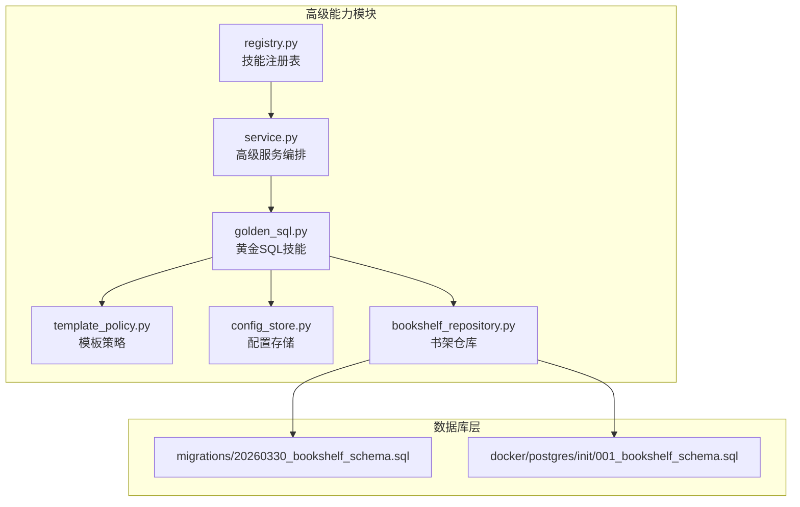
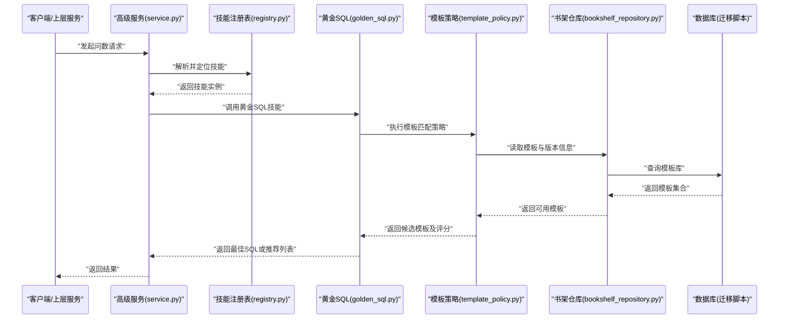
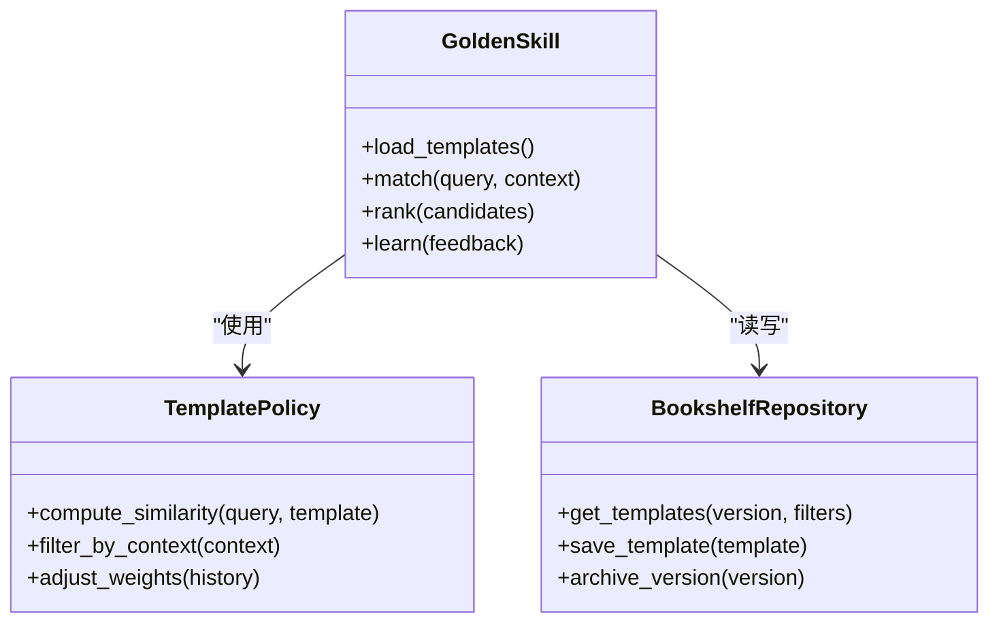
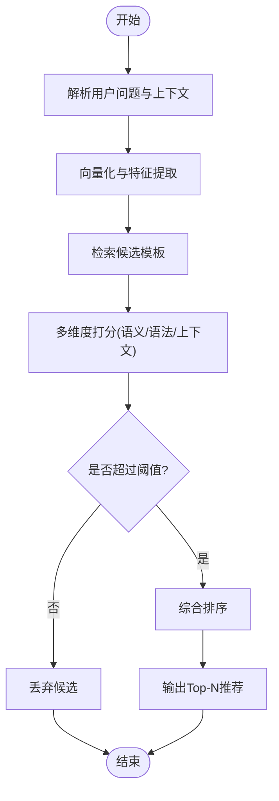
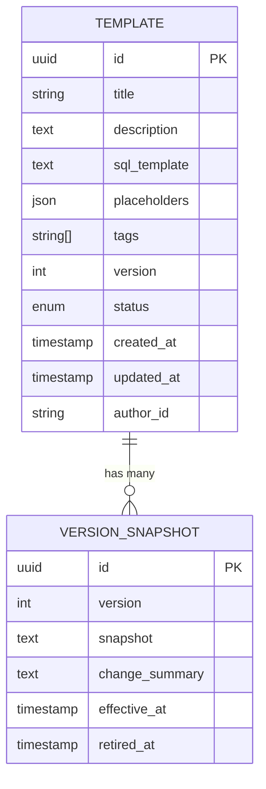
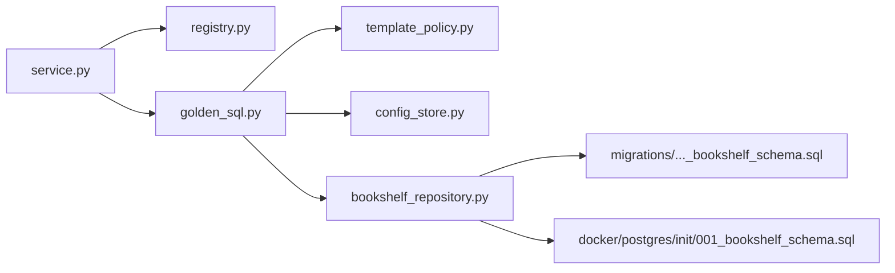

# 黄金 SQL 技能

<cite>
**本文引用的文件**   
- [golden_sql.py](file://backend/smartask_advanced/skills/golden_sql.py)
- [template_policy.py](file://backend/smartask_advanced/skills/template_policy.py)
- [service.py](file://backend/smartask_advanced/service.py)
- [registry.py](file://backend/smartask_advanced/registry.py)
- [config_store.py](file://backend/smartask_advanced/config_store.py)
- [bookshelf_repository.py](file://backend/bookshelf_repository.py)
- [migrations/20260330_bookshelf_schema.sql](file://backend/migrations/20260330_bookshelf_schema.sql)
- [docker/postgres/init/001_bookshelf_schema.sql](file://docker/postgres/init/001_bookshelf_schema.sql)
</cite>

## 目录
1. [简介](#简介)
2. [项目结构](#项目结构)
3. [核心组件](#核心组件)
4. [架构总览](#架构总览)
5. [详细组件分析](#详细组件分析)
6. [依赖关系分析](#依赖关系分析)
7. [性能考量](#性能考量)
8. [故障排查指南](#故障排查指南)
9. [结论](#结论)
10. [附录](#附录)

## 简介
本文件为 SmartAsk 智能问数平台的“黄金 SQL 技能”提供系统化技术文档。内容覆盖最佳实践库管理、模板匹配算法与持续学习机制，说明如何存储和优化常用查询模式、自动推荐相似查询并实现持续改进。文档同时给出接口定义、模板库结构、匹配策略与版本管理的详细说明，并提供构建与维护高质量 SQL 模板库的实践示例。

## 项目结构
黄金 SQL 技能位于后端高级能力模块中，围绕“技能注册—服务编排—模板策略—持久化存储”的链路组织代码：
- 技能实现与策略：skills/golden_sql.py、skills/template_policy.py
- 服务编排与注册：service.py、registry.py
- 配置与存储：config_store.py、bookshelf_repository.py
- 数据模型与迁移：migrations/20260330_bookshelf_schema.sql、docker/postgres/init/001_bookshelf_schema.sql

图表来源
- [golden_sql.py](file://backend/smartask_advanced/skills/golden_sql.py)
- [template_policy.py](file://backend/smartask_advanced/skills/template_policy.py)
- [service.py](file://backend/smartask_advanced/service.py)
- [registry.py](file://backend/smartask_advanced/registry.py)
- [config_store.py](file://backend/smartask_advanced/config_store.py)
- [bookshelf_repository.py](file://backend/bookshelf_repository.py)
- [migrations/20260330_bookshelf_schema.sql](file://backend/migrations/20260330_bookshelf_schema.sql)
- [docker/postgres/init/001_bookshelf_schema.sql](file://docker/postgres/init/001_bookshelf_schema.sql)

章节来源
- [golden_sql.py](file://backend/smartask_advanced/skills/golden_sql.py)
- [template_policy.py](file://backend/smartask_advanced/skills/template_policy.py)
- [service.py](file://backend/smartask_advanced/service.py)
- [registry.py](file://backend/smartask_advanced/registry.py)
- [config_store.py](file://backend/smartask_advanced/config_store.py)
- [bookshelf_repository.py](file://backend/bookshelf_repository.py)
- [migrations/20260330_bookshelf_schema.sql](file://backend/migrations/20260330_bookshelf_schema.sql)
- [docker/postgres/init/001_bookshelf_schema.sql](file://docker/postgres/init/001_bookshelf_schema.sql)

## 核心组件
- 黄金 SQL 技能（golden_sql.py）
  - 职责：封装黄金 SQL 的加载、匹配、推荐与学习更新流程；对外暴露统一的技能调用入口。
  - 关键能力：模板检索、相似度匹配、候选排序、结果回写与版本控制。
- 模板策略（template_policy.py）
  - 职责：定义模板匹配策略、权重计算、阈值与过滤规则；支持可插拔的策略扩展。
  - 关键能力：语义/语法混合匹配、上下文感知、动态权重调整。
- 高级服务编排（service.py）
  - 职责：串联黄金 SQL 技能与其他高级能力（如路由、校验、质量评估），形成端到端问数流程。
- 技能注册表（registry.py）
  - 职责：维护技能元数据、生命周期管理与发现机制。
- 配置存储（config_store.py）
  - 职责：集中管理黄金 SQL 相关配置项（如匹配阈值、缓存开关、学习策略）。
- 书架仓库（bookshelf_repository.py）
  - 职责：对模板库进行增删改查、版本归档、批量导入导出与权限隔离。

章节来源
- [golden_sql.py](file://backend/smartask_advanced/skills/golden_sql.py)
- [template_policy.py](file://backend/smartask_advanced/skills/template_policy.py)
- [service.py](file://backend/smartask_advanced/service.py)
- [registry.py](file://backend/smartask_advanced/registry.py)
- [config_store.py](file://backend/smartask_advanced/config_store.py)
- [bookshelf_repository.py](file://backend/bookshelf_repository.py)

## 架构总览
黄金 SQL 技能在整体架构中的位置与交互如下：

图表来源
- [service.py](file://backend/smartask_advanced/service.py)
- [registry.py](file://backend/smartask_advanced/registry.py)
- [golden_sql.py](file://backend/smartask_advanced/skills/golden_sql.py)
- [template_policy.py](file://backend/smartask_advanced/skills/template_policy.py)
- [bookshelf_repository.py](file://backend/bookshelf_repository.py)
- [migrations/20260330_bookshelf_schema.sql](file://backend/migrations/20260330_bookshelf_schema.sql)

## 详细组件分析

### 黄金 SQL 技能（golden_sql.py）
- 功能要点
  - 模板加载：从书架仓库获取当前版本的模板集，支持按标签、领域、数据集维度筛选。
  - 匹配流程：将用户问题转换为结构化特征（意图、实体、约束），交由模板策略计算相似度。
  - 候选排序：基于策略得分、使用频次、时效性衰减等综合排序，输出 Top-N 推荐。
  - 学习更新：对命中且被采纳的模板进行计数与反馈收集，触发周期性优化。
- 接口约定
  - 输入：用户问题文本、上下文参数（数据集、权限、时间范围）、可选历史偏好。
  - 输出：最佳 SQL、候选列表、匹配分数、命中模板 ID、建议修正提示。
- 错误处理
  - 模板缺失或版本不一致时降级到基础生成路径。
  - 匹配失败时记录日志并上报埋点，便于后续策略调优。

章节来源
- [golden_sql.py](file://backend/smartask_advanced/skills/golden_sql.py)

#### 类图（概念映射）

图表来源
- [golden_sql.py](file://backend/smartask_advanced/skills/golden_sql.py)
- [template_policy.py](file://backend/smartask_advanced/skills/template_policy.py)
- [bookshelf_repository.py](file://backend/bookshelf_repository.py)

### 模板策略（template_policy.py）
- 匹配算法
  - 语义匹配：基于问题与模板描述的向量相似度（可结合业务词典增强）。
  - 语法匹配：基于 SQL 骨架与占位符结构的对齐度。
  - 上下文匹配：根据数据集、权限、时间窗口等约束进行过滤与加权。
- 权重与阈值
  - 动态权重：依据历史命中率、采纳率、延迟表现调整各维度权重。
  - 阈值策略：低于阈值的候选直接丢弃，避免噪声干扰。
- 可扩展性
  - 策略插件化：新增匹配维度或打分函数无需改动主流程。

章节来源
- [template_policy.py](file://backend/smartask_advanced/skills/template_policy.py)

#### 流程图（匹配策略）

图表来源
- [template_policy.py](file://backend/smartask_advanced/skills/template_policy.py)

### 书架仓库（bookshelf_repository.py）
- 职责
  - 模板 CRUD：创建、更新、删除、批量导入导出。
  - 版本管理：每次发布生成新版本，支持回滚与对比。
  - 权限隔离：按组织/角色限制模板可见性与编辑权限。
- 数据结构
  - 模板字段：ID、标题、描述、SQL 骨架、占位符、标签、版本、状态、创建/更新时间、作者、审计信息。
  - 版本字段：版本号、快照、变更摘要、生效时间、下线时间。
- 与迁移脚本的关系
  - 通过迁移脚本初始化与升级书架表结构，确保部署一致性。

章节来源
- [bookshelf_repository.py](file://backend/bookshelf_repository.py)
- [migrations/20260330_bookshelf_schema.sql](file://backend/migrations/20260330_bookshelf_schema.sql)
- [docker/postgres/init/001_bookshelf_schema.sql](file://docker/postgres/init/001_bookshelf_schema.sql)

#### ER 图（模板库结构）

图表来源
- [migrations/20260330_bookshelf_schema.sql](file://backend/migrations/20260330_bookshelf_schema.sql)
- [docker/postgres/init/001_bookshelf_schema.sql](file://docker/postgres/init/001_bookshelf_schema.sql)

### 服务编排（service.py）与注册表（registry.py）
- 服务编排
  - 串联黄金 SQL 技能与路由、权限、质量评估等环节，形成统一问数流水线。
  - 支持特性开关与灰度发布，逐步引入黄金 SQL 能力。
- 注册表
  - 维护技能元数据（名称、版本、依赖、能力标签），提供发现与加载机制。
  - 支持热更新与多实例协调。

章节来源
- [service.py](file://backend/smartask_advanced/service.py)
- [registry.py](file://backend/smartask_advanced/registry.py)

## 依赖关系分析
黄金 SQL 技能的依赖关系如下：

图表来源
- [service.py](file://backend/smartask_advanced/service.py)
- [registry.py](file://backend/smartask_advanced/registry.py)
- [golden_sql.py](file://backend/smartask_advanced/skills/golden_sql.py)
- [template_policy.py](file://backend/smartask_advanced/skills/template_policy.py)
- [config_store.py](file://backend/smartask_advanced/config_store.py)
- [bookshelf_repository.py](file://backend/bookshelf_repository.py)
- [migrations/20260330_bookshelf_schema.sql](file://backend/migrations/20260330_bookshelf_schema.sql)
- [docker/postgres/init/001_bookshelf_schema.sql](file://docker/postgres/init/001_bookshelf_schema.sql)

章节来源
- [service.py](file://backend/smartask_advanced/service.py)
- [registry.py](file://backend/smartask_advanced/registry.py)
- [golden_sql.py](file://backend/smartask_advanced/skills/golden_sql.py)
- [template_policy.py](file://backend/smartask_advanced/skills/template_policy.py)
- [config_store.py](file://backend/smartask_advanced/config_store.py)
- [bookshelf_repository.py](file://backend/bookshelf_repository.py)
- [migrations/20260330_bookshelf_schema.sql](file://backend/migrations/20260330_bookshelf_schema.sql)
- [docker/postgres/init/001_bookshelf_schema.sql](file://docker/postgres/init/001_bookshelf_schema.sql)

## 性能考量
- 索引与查询优化
  - 为模板标签、版本、状态等高频过滤字段建立索引，提升检索效率。
  - 对 SQL 骨架与占位符进行规范化存储，减少字符串比较开销。
- 缓存策略
  - 热点模板与匹配结果短期缓存，降低重复计算。
  - 配置项与策略权重缓存，避免频繁 IO。
- 批处理与异步
  - 模板导入导出采用异步任务，避免阻塞主流程。
  - 学习更新与权重调整定时任务化，削峰填谷。
- 资源控制
  - 设置匹配超时与最大候选数，防止长尾请求拖慢系统。
  - 对大对象（如快照）进行分片或压缩存储。

[本节为通用性能指导，不直接分析具体文件]

## 故障排查指南
- 常见问题
  - 模板未命中：检查标签与上下文过滤条件是否正确；确认版本是否生效。
  - 匹配分数低：核对语义与语法匹配权重；补充模板描述与占位符标注。
  - 学习不生效：确认反馈采集链路是否打通；检查权重更新任务是否运行。
- 诊断步骤
  - 查看技能日志与埋点指标，定位匹配失败原因。
  - 使用调试工具回放匹配过程，观察中间特征与打分。
  - 校验书架仓库数据一致性与权限配置。
- 恢复措施
  - 回滚到上一稳定版本；修复模板后重新发布。
  - 重置缓存与权重，重新训练策略。

章节来源
- [golden_sql.py](file://backend/smartask_advanced/skills/golden_sql.py)
- [template_policy.py](file://backend/smartask_advanced/skills/template_policy.py)
- [bookshelf_repository.py](file://backend/bookshelf_repository.py)

## 结论
黄金 SQL 技能通过“模板策略+书架仓库+服务编排”的组合，实现了高效、可演进的最佳实践库管理。借助语义与语法混合匹配、动态权重与持续学习机制，平台能够自动推荐相似查询并不断优化模板质量。配合严格的版本管理与权限控制，团队可以安全地构建与维护高质量的 SQL 模板库，显著提升问数体验与稳定性。

[本节为总结性内容，不直接分析具体文件]

## 附录
- 使用示例（构建与维护模板库）
  - 新建模板：定义标题、描述、SQL 骨架与占位符，打上业务标签，提交审核并发布为新版本。
  - 优化模板：基于命中与采纳率反馈，调整描述与占位符，必要时拆分或合并模板。
  - 版本治理：定期归档旧版本，清理无效模板，保持库的整洁与高可用。
  - 集成测试：在沙箱环境验证模板在不同数据集与权限下的行为，确保稳定性。
- 最佳实践
  - 模板粒度适中：既不过于宽泛导致误匹配，也不过于狭窄难以复用。
  - 占位符标准化：统一命名与类型，便于解析与替换。
  - 描述清晰准确：包含业务含义、约束条件与典型用法，提升语义匹配效果。
  - 监控与度量：跟踪命中率、采纳率、延迟与错误率，驱动持续改进。

[本节为概念性指导，不直接分析具体文件]