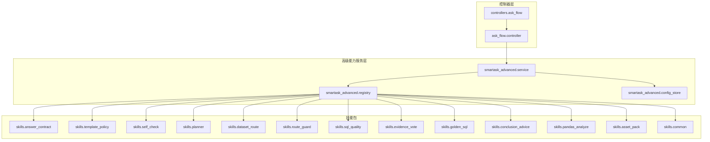
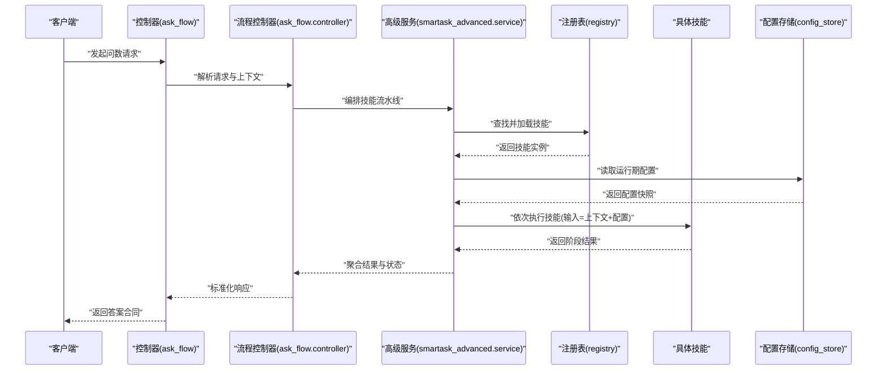
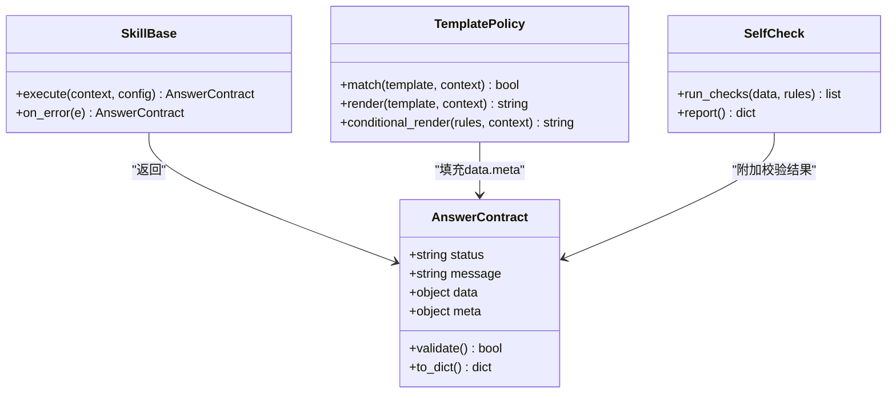
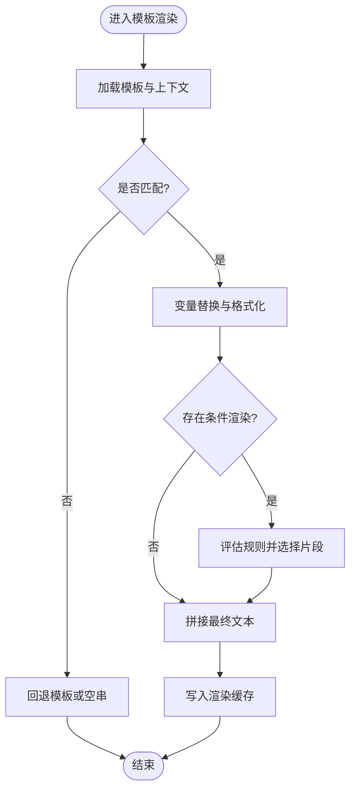
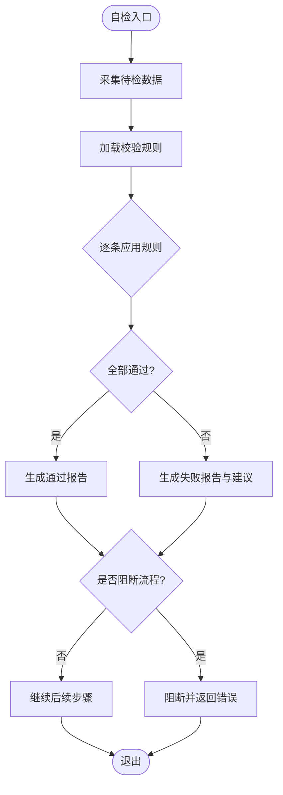
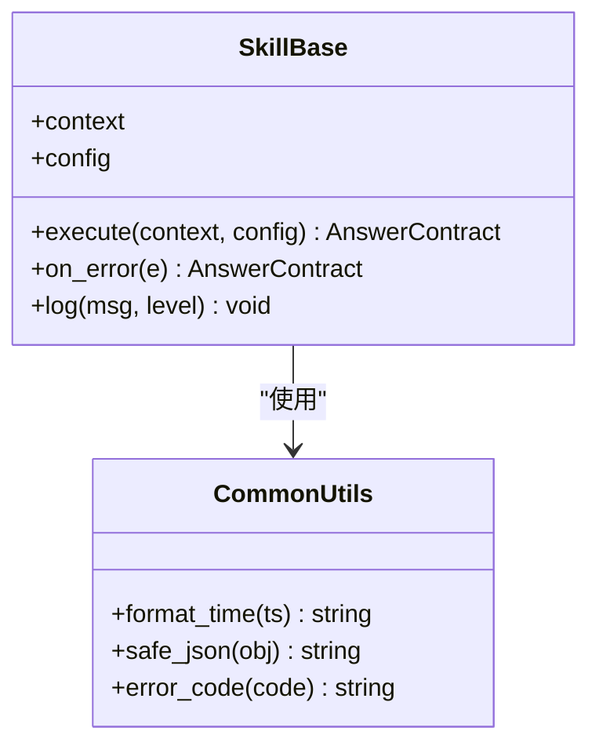
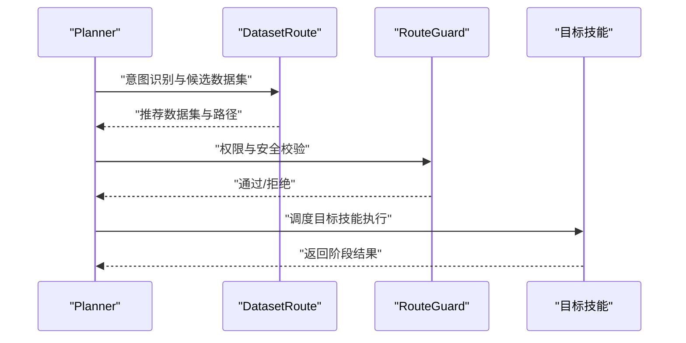
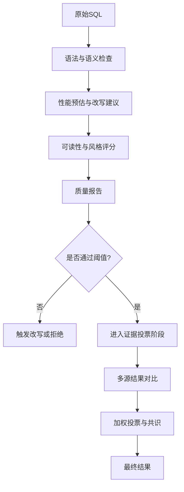
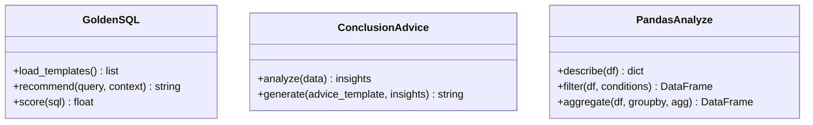
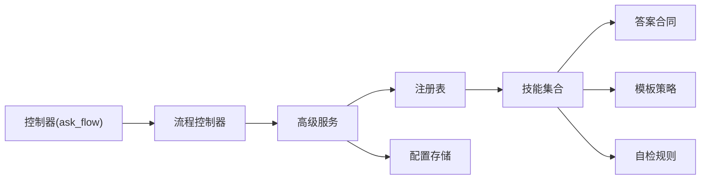

# 自定义技能开发

<cite>
**本文引用的文件**   
- [backend/smartask_advanced/service.py](file://backend/smartask_advanced/service.py)
- [backend/smartask_advanced/registry.py](file://backend/smartask_advanced/registry.py)
- [backend/smartask_advanced/config_store.py](file://backend/smartask_advanced/config_store.py)
- [backend/smartask_advanced/skills/answer_contract.py](file://backend/smartask_advanced/skills/answer_contract.py)
- [backend/smartask_advanced/skills/template_policy.py](file://backend/smartask_advanced/skills/template_policy.py)
- [backend/smartask_advanced/skills/self_check.py](file://backend/smartask_advanced/skills/self_check.py)
- [backend/smartask_advanced/skills/common.py](file://backend/smartask_advanced/skills/common.py)
- [backend/smartask_advanced/skills/planner.py](file://backend/smartask_advanced/skills/planner.py)
- [backend/smartask_advanced/skills/dataset_route.py](file://backend/smartask_advanced/skills/dataset_route.py)
- [backend/smartask_advanced/skills/route_guard.py](file://backend/smartask_advanced/skills/route_guard.py)
- [backend/smartask_advanced/skills/sql_quality.py](file://backend/smartask_advanced/skills/sql_quality.py)
- [backend/smartask_advanced/skills/evidence_vote.py](file://backend/smartask_advanced/skills/evidence_vote.py)
- [backend/smartask_advanced/skills/golden_sql.py](file://backend/smartask_advanced/skills/golden_sql.py)
- [backend/smartask_advanced/skills/conclusion_advice.py](file://backend/smartask_advanced/skills/conclusion_advice.py)
- [backend/smartask_advanced/skills/pandas_analyze.py](file://backend/smartask_advanced/skills/pandas_analyze.py)
- [backend/smartask_advanced/skills/asset_pack.py](file://backend/smartask_advanced/skills/asset_pack.py)
- [backend/controllers/ask_flow.py](file://backend/controllers/ask_flow.py)
- [backend/ask_flow/controller.py](file://backend/ask_flow/controller.py)
- [backend/ask_flow/contracts.py](file://backend/ask_flow/contracts.py)
</cite>

## 目录
1. [简介](#简介)
2. [项目结构](#项目结构)
3. [核心组件](#核心组件)
4. [架构总览](#架构总览)
5. [详细组件分析](#详细组件分析)
6. [依赖关系分析](#依赖关系分析)
7. [性能考量](#性能考量)
8. [故障排查指南](#故障排查指南)
9. [结论](#结论)
10. [附录](#附录)

## 简介
本指南面向 SmartAsk 智能问数平台的“自定义技能”开发者，目标是提供一套从规范到落地的完整方法论。内容覆盖：
- 技能接口定义、基类继承、参数传递与错误处理规范
- 答案合同（Answer Contract）的设计模式与数据结构
- 模板策略的实现机制（匹配、变量替换、条件渲染）
- 自检技能的开发方法（验证规则、测试用例、质量保证）
- 端到端开发流程（需求分析→设计→实现→测试→部署）
- 开发工具、调试技巧、性能优化与最佳实践
- 实际案例与代码示例路径，帮助快速上手

## 项目结构
SmartAsk 的技能体系位于后端高级能力模块 smartask_advanced 下，采用“服务+注册表+配置存储+技能包”的分层组织方式。控制器层通过 ask_flow 将用户请求编排为可执行的技能流水线。

**图表来源** 
- [backend/controllers/ask_flow.py](file://backend/controllers/ask_flow.py)
- [backend/ask_flow/controller.py](file://backend/ask_flow/controller.py)
- [backend/smartask_advanced/service.py](file://backend/smartask_advanced/service.py)
- [backend/smartask_advanced/registry.py](file://backend/smartask_advanced/registry.py)
- [backend/smartask_advanced/config_store.py](file://backend/smartask_advanced/config_store.py)
- [backend/smartask_advanced/skills/*.py](file://backend/smartask_advanced/skills/answer_contract.py)

**章节来源**
- [backend/controllers/ask_flow.py](file://backend/controllers/ask_flow.py)
- [backend/ask_flow/controller.py](file://backend/ask_flow/controller.py)
- [backend/smartask_advanced/service.py](file://backend/smartask_advanced/service.py)
- [backend/smartask_advanced/registry.py](file://backend/smartask_advanced/registry.py)
- [backend/smartask_advanced/config_store.py](file://backend/smartask_advanced/config_store.py)

## 核心组件
- 服务层（service.py）：对外暴露技能编排入口，负责生命周期管理、上下文构建、结果聚合与异常统一处理。
- 注册表（registry.py）：集中注册与发现技能实例，支持按名称或类型检索，维护依赖注入与版本兼容。
- 配置存储（config_store.py）：加载并缓存技能运行期配置，支持热更新与多环境隔离。
- 答案合同（answer_contract.py）：定义统一的输出契约，确保不同技能返回的数据结构一致，便于下游消费。
- 模板策略（template_policy.py）：实现模板匹配、变量替换与条件渲染，支撑报告与摘要的灵活生成。
- 自检技能（self_check.py）：内置校验规则与质量门禁，保障 SQL、数据与结论的可靠性。
- 通用工具（common.py）：跨技能共享的辅助函数、常量与错误码。
- 其他技能：planner、dataset_route、route_guard、sql_quality、evidence_vote、golden_sql、conclusion_advice、pandas_analyze、asset_pack 等，分别承担计划制定、路由、守卫、质量评估、证据投票、黄金SQL、结论建议、数据分析与资产打包职责。

**章节来源**
- [backend/smartask_advanced/service.py](file://backend/smartask_advanced/service.py)
- [backend/smartask_advanced/registry.py](file://backend/smartask_advanced/registry.py)
- [backend/smartask_advanced/config_store.py](file://backend/smartask_advanced/config_store.py)
- [backend/smartask_advanced/skills/answer_contract.py](file://backend/smartask_advanced/skills/answer_contract.py)
- [backend/smartask_advanced/skills/template_policy.py](file://backend/smartask_advanced/skills/template_policy.py)
- [backend/smartask_advanced/skills/self_check.py](file://backend/smartask_advanced/skills/self_check.py)
- [backend/smartask_advanced/skills/common.py](file://backend/smartask_advanced/skills/common.py)
- [backend/smartask_advanced/skills/planner.py](file://backend/smartask_advanced/skills/planner.py)
- [backend/smartask_advanced/skills/dataset_route.py](file://backend/smartask_advanced/skills/dataset_route.py)
- [backend/smartask_advanced/skills/route_guard.py](file://backend/smartask_advanced/skills/route_guard.py)
- [backend/smartask_advanced/skills/sql_quality.py](file://backend/smartask_advanced/skills/sql_quality.py)
- [backend/smartask_advanced/skills/evidence_vote.py](file://backend/smartask_advanced/skills/evidence_vote.py)
- [backend/smartask_advanced/skills/golden_sql.py](file://backend/smartask_advanced/skills/golden_sql.py)
- [backend/smartask_advanced/skills/conclusion_advice.py](file://backend/smartask_advanced/skills/conclusion_advice.py)
- [backend/smartask_advanced/skills/pandas_analyze.py](file://backend/smartask_advanced/skills/pandas_analyze.py)
- [backend/smartask_advanced/skills/asset_pack.py](file://backend/smartask_advanced/skills/asset_pack.py)

## 架构总览
下图展示了从控制器到技能执行的核心调用链路与数据流转。

**图表来源** 
- [backend/controllers/ask_flow.py](file://backend/controllers/ask_flow.py)
- [backend/ask_flow/controller.py](file://backend/ask_flow/controller.py)
- [backend/smartask_advanced/service.py](file://backend/smartask_advanced/service.py)
- [backend/smartask_advanced/registry.py](file://backend/smartask_advanced/registry.py)
- [backend/smartask_advanced/config_store.py](file://backend/smartask_advanced/config_store.py)

## 详细组件分析

### 答案合同（Answer Contract）
- 设计目标：统一所有技能的输出结构，确保下游消费稳定；包含字段校验、可选分支与扩展点。
- 关键要素：
  - 固定字段：如结果状态、消息、数据体、元数据、追踪ID等
  - 可选字段：如警告、建议、中间产物引用
  - 校验规则：必填项、类型约束、枚举值、范围限制
  - 扩展机制：通过扩展键保留向后兼容
- 使用方式：
  - 技能在返回前构造标准对象
  - 服务层统一序列化与校验
  - 控制器层透传至前端

**图表来源** 
- [backend/smartask_advanced/skills/answer_contract.py](file://backend/smartask_advanced/skills/answer_contract.py)
- [backend/smartask_advanced/skills/template_policy.py](file://backend/smartask_advanced/skills/template_policy.py)
- [backend/smartask_advanced/skills/self_check.py](file://backend/smartask_advanced/skills/self_check.py)

**章节来源**
- [backend/smartask_advanced/skills/answer_contract.py](file://backend/smartask_advanced/skills/answer_contract.py)

### 模板策略（Template Policy）
- 匹配机制：基于模板标识与上下文特征进行优先级排序与命中判定
- 变量替换：支持命名占位符、默认值、格式化器与嵌套展开
- 条件渲染：根据布尔表达式或规则集动态选择片段
- 性能优化：模板编译缓存、懒加载与增量渲染

**图表来源** 
- [backend/smartask_advanced/skills/template_policy.py](file://backend/smartask_advanced/skills/template_policy.py)

**章节来源**
- [backend/smartask_advanced/skills/template_policy.py](file://backend/smartask_advanced/skills/template_policy.py)

### 自检技能（Self Check）
- 验证规则：数据类型、范围、完整性、一致性、业务约束
- 执行流程：收集数据→应用规则→生成报告→影响后续决策
- 质量控制：阈值控制、告警级别、重试与降级策略

**图表来源** 
- [backend/smartask_advanced/skills/self_check.py](file://backend/smartask_advanced/skills/self_check.py)

**章节来源**
- [backend/smartask_advanced/skills/self_check.py](file://backend/smartask_advanced/skills/self_check.py)

### 技能基类与通用工具
- 基类（SkillBase）：定义 execute、on_error、生命周期钩子与上下文访问
- 通用工具（common.py）：错误码、日志封装、时间戳、序列化辅助
- 依赖注入：通过注册表获取外部服务（数据库、缓存、LLM等）

**图表来源** 
- [backend/smartask_advanced/skills/common.py](file://backend/smartask_advanced/skills/common.py)

**章节来源**
- [backend/smartask_advanced/skills/common.py](file://backend/smartask_advanced/skills/common.py)

### 计划与路由（Planner & Dataset Route & Route Guard）
- Planner：将自然语言问题分解为可执行步骤，产出任务图
- Dataset Route：根据意图与权限选择数据集与查询路径
- Route Guard：在进入具体技能前进行安全与权限校验

**图表来源** 
- [backend/smartask_advanced/skills/planner.py](file://backend/smartask_advanced/skills/planner.py)
- [backend/smartask_advanced/skills/dataset_route.py](file://backend/smartask_advanced/skills/dataset_route.py)
- [backend/smartask_advanced/skills/route_guard.py](file://backend/smartask_advanced/skills/route_guard.py)

**章节来源**
- [backend/smartask_advanced/skills/planner.py](file://backend/smartask_advanced/skills/planner.py)
- [backend/smartask_advanced/skills/dataset_route.py](file://backend/smartask_advanced/skills/dataset_route.py)
- [backend/smartask_advanced/skills/route_guard.py](file://backend/smartask_advanced/skills/route_guard.py)

### SQL 质量与证据投票（SQL Quality & Evidence Vote）
- SQL Quality：语法检查、性能预估、可读性评分、潜在风险标注
- Evidence Vote：多路结果投票合并，提升稳定性与鲁棒性

**图表来源** 
- [backend/smartask_advanced/skills/sql_quality.py](file://backend/smartask_advanced/skills/sql_quality.py)
- [backend/smartask_advanced/skills/evidence_vote.py](file://backend/smartask_advanced/skills/evidence_vote.py)

**章节来源**
- [backend/smartask_advanced/skills/sql_quality.py](file://backend/smartask_advanced/skills/sql_quality.py)
- [backend/smartask_advanced/skills/evidence_vote.py](file://backend/smartask_advanced/skills/evidence_vote.py)

### 黄金SQL、结论建议与数据分析（Golden SQL, Conclusion Advice, Pandas Analyze）
- Golden SQL：沉淀高质量SQL模板与最佳实践，供复用与学习
- Conclusion Advice：基于数据洞察生成结论与建议
- Pandas Analyze：在内存中进行轻量数据分析与可视化准备

**图表来源** 
- [backend/smartask_advanced/skills/golden_sql.py](file://backend/smartask_advanced/skills/golden_sql.py)
- [backend/smartask_advanced/skills/conclusion_advice.py](file://backend/smartask_advanced/skills/conclusion_advice.py)
- [backend/smartask_advanced/skills/pandas_analyze.py](file://backend/smartask_advanced/skills/pandas_analyze.py)

**章节来源**
- [backend/smartask_advanced/skills/golden_sql.py](file://backend/smartask_advanced/skills/golden_sql.py)
- [backend/smartask_advanced/skills/conclusion_advice.py](file://backend/smartask_advanced/skills/conclusion_advice.py)
- [backend/smartask_advanced/skills/pandas_analyze.py](file://backend/smartask_advanced/skills/pandas_analyze.py)

### 资产打包（Asset Pack）
- 作用：将多个技能产物打包为可分发单元，便于版本管理与迁移
- 内容：模板、规则、配置快照、依赖清单与校验脚本

**章节来源**
- [backend/smartask_advanced/skills/asset_pack.py](file://backend/smartask_advanced/skills/asset_pack.py)

## 依赖关系分析
技能之间通过注册表与服务层解耦，避免直接耦合；配置存储提供运行时配置；控制器层负责编排与协议转换。

**图表来源** 
- [backend/controllers/ask_flow.py](file://backend/controllers/ask_flow.py)
- [backend/ask_flow/controller.py](file://backend/ask_flow/controller.py)
- [backend/smartask_advanced/service.py](file://backend/smartask_advanced/service.py)
- [backend/smartask_advanced/registry.py](file://backend/smartask_advanced/registry.py)
- [backend/smartask_advanced/config_store.py](file://backend/smartask_advanced/config_store.py)
- [backend/smartask_advanced/skills/answer_contract.py](file://backend/smartask_advanced/skills/answer_contract.py)
- [backend/smartask_advanced/skills/template_policy.py](file://backend/smartask_advanced/skills/template_policy.py)
- [backend/smartask_advanced/skills/self_check.py](file://backend/smartask_advanced/skills/self_check.py)

**章节来源**
- [backend/controllers/ask_flow.py](file://backend/controllers/ask_flow.py)
- [backend/ask_flow/controller.py](file://backend/ask_flow/controller.py)
- [backend/smartask_advanced/service.py](file://backend/smartask_advanced/service.py)
- [backend/smartask_advanced/registry.py](file://backend/smartask_advanced/registry.py)
- [backend/smartask_advanced/config_store.py](file://backend/smartask_advanced/config_store.py)

## 性能考量
- 模板渲染：启用编译缓存与懒加载，减少重复计算
- 自检规则：批量校验与短路逻辑，避免不必要的深度检查
- 路由与守卫：缓存权限与数据集映射，降低频繁查询
- SQL 质量：异步分析与改写建议，避免阻塞主流程
- 结果聚合：流式聚合与增量更新，降低内存峰值
- 配置存储：本地缓存与失效策略，减少远程IO

[本节为通用指导，不直接分析具体文件]

## 故障排查指南
- 常见问题定位：
  - 模板未命中：检查模板标识与上下文特征匹配规则
  - 自检失败：查看校验报告中的失败规则与建议
  - 路由错误：确认权限与数据集映射是否正确
  - SQL 质量问题：关注性能预估与改写建议
- 调试技巧：
  - 开启详细日志与追踪ID
  - 使用单元测试与集成测试用例
  - 借助资产打包导出中间产物进行分析
- 恢复策略：
  - 降级到回退模板或默认策略
  - 跳过非关键自检并记录告警
  - 重试与熔断保护

**章节来源**
- [backend/smartask_advanced/skills/template_policy.py](file://backend/smartask_advanced/skills/template_policy.py)
- [backend/smartask_advanced/skills/self_check.py](file://backend/smartask_advanced/skills/self_check.py)
- [backend/smartask_advanced/skills/dataset_route.py](file://backend/smartask_advanced/skills/dataset_route.py)
- [backend/smartask_advanced/skills/sql_quality.py](file://backend/smartask_advanced/skills/sql_quality.py)
- [backend/smartask_advanced/skills/asset_pack.py](file://backend/smartask_advanced/skills/asset_pack.py)

## 结论
通过统一的技能接口、答案合同与模板策略，SmartAsk 实现了高内聚、低耦合的可扩展技能体系。结合自检与质量门禁，保障了输出的稳定性与可靠性。遵循本文档的规范与实践，开发者可以快速构建高质量的自定义技能并顺利上线。

[本节为总结性内容，不直接分析具体文件]

## 附录
- 开发流程建议：
  - 需求分析：明确输入、输出与约束
  - 设计：定义接口、数据模型与错误码
  - 实现：继承基类、实现 execute 与 on_error
  - 测试：编写单测与集成用例，覆盖边界与异常
  - 发布：资产打包、配置快照与灰度发布
- 最佳实践：
  - 保持幂等与可观测性
  - 合理拆分职责，避免大单体技能
  - 使用模板与规则驱动，提高可配置性
  - 持续沉淀黄金SQL与结论模板

[本节为通用指导，不直接分析具体文件]