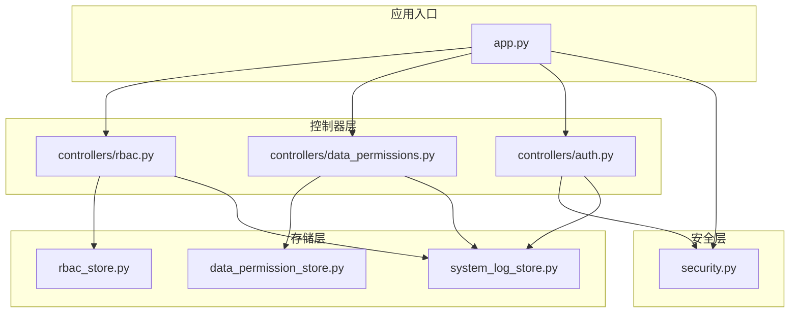
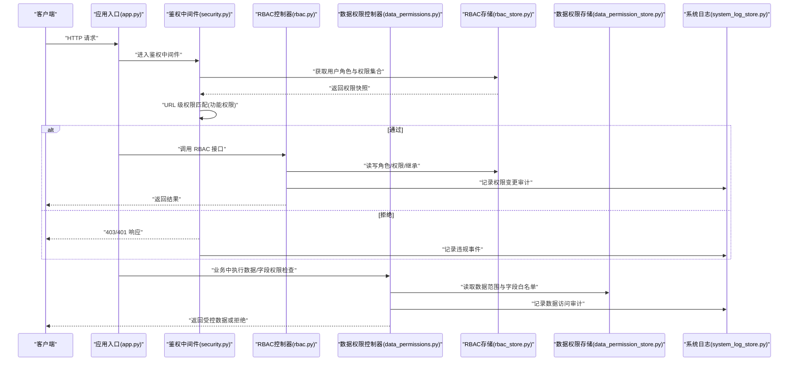
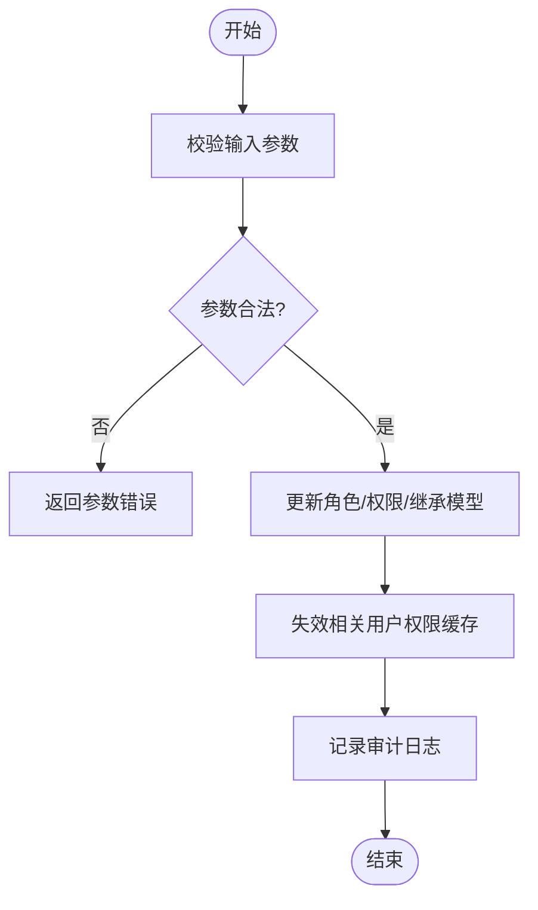
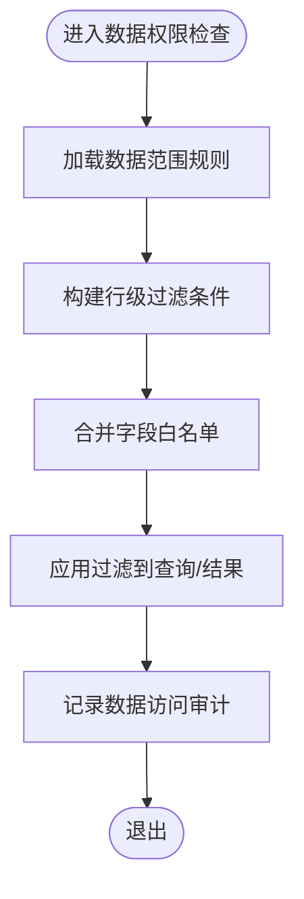
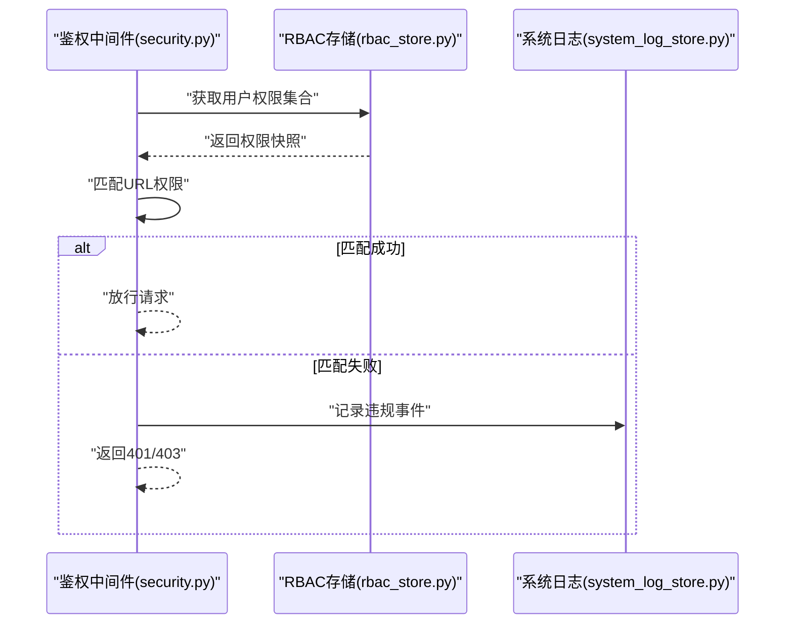
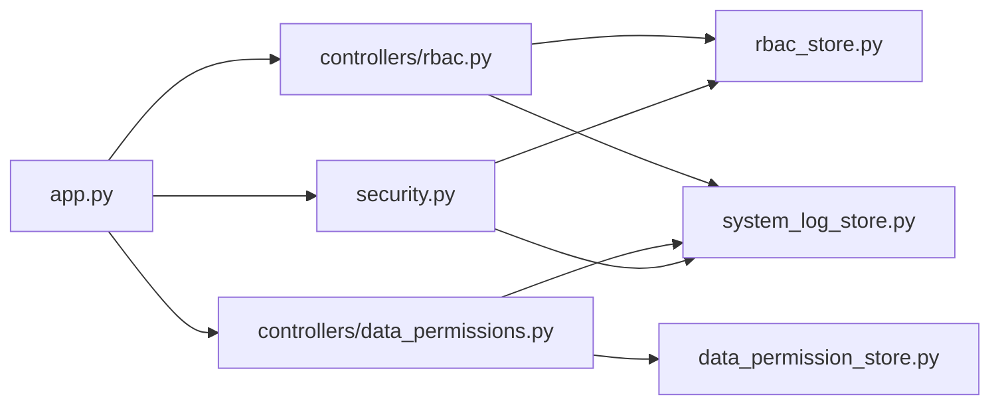

# RBAC权限控制器

<cite>
**本文引用的文件**   
- [rbac.py](file://backend/controllers/rbac.py)
- [auth.py](file://backend/controllers/auth.py)
- [data_permissions.py](file://backend/controllers/data_permissions.py)
- [rbac_store.py](file://backend/rbac_store.py)
- [data_permission_store.py](file://backend/data_permission_store.py)
- [security.py](file://backend/security.py)
- [system_log_store.py](file://backend/system_log_store.py)
- [app.py](file://backend/app.py)
</cite>

## 目录
1. [简介](#简介)
2. [项目结构](#项目结构)
3. [核心组件](#核心组件)
4. [架构总览](#架构总览)
5. [详细组件分析](#详细组件分析)
6. [依赖关系分析](#依赖关系分析)
7. [性能考量](#性能考量)
8. [故障排查指南](#故障排查指南)
9. [结论](#结论)
10. [附录](#附录)

## 简介
本文件为 SmartAsk 平台的基于角色的访问控制（RBAC）权限控制器提供系统化文档。内容涵盖用户、角色与权限的层次关系与继承机制，功能权限、数据权限与字段级权限的粒度设计；角色的动态分配、权限即时生效与继承计算逻辑；URL 级拦截与资源级访问控制的中间件实现；以及审计日志、违规检测与权限回收策略。同时给出扩展点与自定义权限类型的实现方法，帮助开发者在保障安全的前提下快速扩展权限能力。

## 项目结构
SmartAsk 后端采用模块化组织，RBAC 相关代码主要分布在以下位置：
- 控制器层：负责 HTTP 接口与业务编排
- 存储层：负责权限模型与数据的持久化
- 安全层：负责鉴权、签名校验与通用安全工具
- 应用入口：注册路由与全局中间件

**图示来源** 
- [rbac.py](file://backend/controllers/rbac.py)
- [auth.py](file://backend/controllers/auth.py)
- [data_permissions.py](file://backend/controllers/data_permissions.py)
- [rbac_store.py](file://backend/rbac_store.py)
- [data_permission_store.py](file://backend/data_permission_store.py)
- [system_log_store.py](file://backend/system_log_store.py)
- [security.py](file://backend/security.py)
- [app.py](file://backend/app.py)

**章节来源**
- [rbac.py](file://backend/controllers/rbac.py)
- [auth.py](file://backend/controllers/auth.py)
- [data_permissions.py](file://backend/controllers/data_permissions.py)
- [rbac_store.py](file://backend/rbac_store.py)
- [data_permission_store.py](file://backend/data_permission_store.py)
- [system_log_store.py](file://backend/system_log_store.py)
- [security.py](file://backend/security.py)
- [app.py](file://backend/app.py)

## 核心组件
- RBAC 控制器：提供角色管理、用户-角色分配、权限分配与查询等 API，并驱动权限缓存与审计记录。
- 数据权限控制器：提供数据集/表/行/列级别的访问控制配置与管理。
- 存储层：分别维护 RBAC 模型（用户、角色、权限、继承关系）与数据权限模型（数据范围、字段白名单等）。
- 安全模块：提供鉴权中间件、令牌校验、签名验证与通用安全工具。
- 系统日志：记录权限变更、访问结果与违规事件，支持审计与告警。

**章节来源**
- [rbac.py](file://backend/controllers/rbac.py)
- [data_permissions.py](file://backend/controllers/data_permissions.py)
- [rbac_store.py](file://backend/rbac_store.py)
- [data_permission_store.py](file://backend/data_permission_store.py)
- [security.py](file://backend/security.py)
- [system_log_store.py](file://backend/system_log_store.py)

## 架构总览
RBAC 权限体系由“用户-角色-权限”三层构成，并通过“功能权限 + 数据权限 + 字段级权限”实现细粒度控制。请求进入时，先经 URL 级鉴权中间件进行功能权限检查，再在业务层进行数据权限与字段级权限校验。所有关键操作均写入审计日志，便于追踪与合规。

**图示来源** 
- [app.py](file://backend/app.py)
- [security.py](file://backend/security.py)
- [rbac.py](file://backend/controllers/rbac.py)
- [data_permissions.py](file://backend/controllers/data_permissions.py)
- [rbac_store.py](file://backend/rbac_store.py)
- [data_permission_store.py](file://backend/data_permission_store.py)
- [system_log_store.py](file://backend/system_log_store.py)

## 详细组件分析

### RBAC 控制器（功能权限与角色管理）
- 职责
  - 管理角色定义、用户-角色分配、角色-权限分配与角色继承关系。
  - 提供权限查询接口，用于中间件与业务层快速获取用户有效权限集合。
  - 触发权限缓存更新，确保权限变更即时生效。
  - 记录权限相关的审计日志。
- 关键流程
  - 创建/更新/删除角色与权限映射。
  - 为用户分配/移除角色，支持批量操作。
  - 计算用户最终权限集（合并直接权限与继承权限）。
  - 暴露权限检查接口供中间件使用。
- 权限即时生效
  - 任何角色/权限/继承关系的变更都会使相关用户的权限缓存失效，并在下次鉴权时重新计算。
- 最佳实践
  - 避免过深的角色继承链，建议层级不超过 3 层。
  - 将高频访问的权限集做短期缓存，减少重复计算。
  - 对敏感操作（如超级管理员权限变更）强制二次确认与审计。

**图示来源** 
- [rbac.py](file://backend/controllers/rbac.py)
- [rbac_store.py](file://backend/rbac_store.py)
- [system_log_store.py](file://backend/system_log_store.py)

**章节来源**
- [rbac.py](file://backend/controllers/rbac.py)
- [rbac_store.py](file://backend/rbac_store.py)
- [system_log_store.py](file://backend/system_log_store.py)

### 数据权限控制器（数据范围与字段级权限）
- 职责
  - 管理数据集/表/视图的数据访问范围（行级过滤条件、组织隔离等）。
  - 管理字段级白名单，控制可访问列集合。
  - 在业务层对查询结果进行数据与字段裁剪。
- 关键流程
  - 根据用户角色与上下文（组织、租户、时间范围）生成数据过滤条件。
  - 合并字段白名单，限制输出列。
  - 记录数据访问审计，包括命中规则与拒绝原因。
- 最佳实践
  - 将数据权限规则抽象为可组合的条件表达式，便于复用与测试。
  - 对大表查询优先使用数据库侧过滤，减少内存与网络开销。
  - 对敏感字段默认关闭可见性，显式授权才开放。

**图示来源** 
- [data_permissions.py](file://backend/controllers/data_permissions.py)
- [data_permission_store.py](file://backend/data_permission_store.py)
- [system_log_store.py](file://backend/system_log_store.py)

**章节来源**
- [data_permissions.py](file://backend/controllers/data_permissions.py)
- [data_permission_store.py](file://backend/data_permission_store.py)
- [system_log_store.py](file://backend/system_log_store.py)

### 鉴权中间件（URL 级权限拦截）
- 职责
  - 解析请求路径与动作，匹配用户的有效权限集合。
  - 对未授权请求返回 401/403，并记录违规事件。
  - 与 RBAC 控制器协作，保证权限快照一致性。
- 关键流程
  - 从会话或令牌中提取用户身份与角色。
  - 查询用户权限集合（含继承），判断是否包含目标 URL 所需权限。
  - 若通过则放行，否则拒绝并审计。
- 最佳实践
  - 权限匹配应支持通配与精确匹配，兼顾灵活性与安全性。
  - 对高频路径启用短 TTL 的权限缓存，降低存储压力。
  - 对异常与边界情况（如缺失权限元数据）统一降级策略。

**图示来源** 
- [security.py](file://backend/security.py)
- [rbac_store.py](file://backend/rbac_store.py)
- [system_log_store.py](file://backend/system_log_store.py)

**章节来源**
- [security.py](file://backend/security.py)
- [rbac_store.py](file://backend/rbac_store.py)
- [system_log_store.py](file://backend/system_log_store.py)

### 存储层（RBAC 与数据权限）
- RBAC 存储
  - 维护用户、角色、权限实体及关系。
  - 提供角色继承图遍历与权限合并算法。
  - 支持权限快照与缓存失效通知。
- 数据权限存储
  - 维护数据范围规则、字段白名单与上下文绑定。
  - 提供按组织/租户/时间窗口的规则检索。
- 最佳实践
  - 使用索引优化常见查询（用户ID、角色ID、数据集ID）。
  - 对复杂继承关系采用闭包表或物化路径，提升查询性能。
  - 对规则变更引入版本化，支持回滚与审计。

**章节来源**
- [rbac_store.py](file://backend/rbac_store.py)
- [data_permission_store.py](file://backend/data_permission_store.py)

### 系统日志（审计与违规检测）
- 职责
  - 记录权限变更、访问结果、违规事件与数据访问明细。
  - 支持按用户、角色、资源、时间范围检索。
  - 为风控与合规提供数据基础。
- 最佳实践
  - 对敏感操作强制记录，避免遗漏。
  - 对日志写入进行异步化与限流，防止阻塞主流程。
  - 定期归档与脱敏处理，满足合规要求。

**章节来源**
- [system_log_store.py](file://backend/system_log_store.py)

## 依赖关系分析
RBAC 子系统内部耦合度较低，职责清晰：
- 控制器依赖存储层完成数据读写。
- 鉴权中间件依赖 RBAC 存储获取权限快照。
- 数据权限控制器依赖数据权限存储与系统日志。
- 应用入口统一注册路由与中间件。

**图示来源** 
- [app.py](file://backend/app.py)
- [security.py](file://backend/security.py)
- [rbac.py](file://backend/controllers/rbac.py)
- [data_permissions.py](file://backend/controllers/data_permissions.py)
- [rbac_store.py](file://backend/rbac_store.py)
- [data_permission_store.py](file://backend/data_permission_store.py)
- [system_log_store.py](file://backend/system_log_store.py)

**章节来源**
- [app.py](file://backend/app.py)
- [security.py](file://backend/security.py)
- [rbac.py](file://backend/controllers/rbac.py)
- [data_permissions.py](file://backend/controllers/data_permissions.py)
- [rbac_store.py](file://backend/rbac_store.py)
- [data_permission_store.py](file://backend/data_permission_store.py)
- [system_log_store.py](file://backend/system_log_store.py)

## 性能考量
- 权限计算
  - 合并直接权限与继承权限时，采用增量计算与缓存，避免全量重算。
  - 对高频路径的权限匹配使用短 TTL 缓存，降低存储压力。
- 数据权限
  - 优先在数据库侧应用过滤条件，减少数据传输与内存占用。
  - 对大表查询增加分页与限制返回字段，避免 OOM。
- 审计日志
  - 异步写入与批处理，避免影响主链路延迟。
  - 对高吞吐场景进行采样与聚合，平衡可观测性与性能。

[本节为通用指导，不直接分析具体文件]

## 故障排查指南
- 常见问题
  - 权限未生效：检查权限缓存是否失效、继承关系是否正确、中间件是否命中对应 URL。
  - 数据越权：核对数据范围规则与字段白名单，确认上下文（组织/租户）传递正确。
  - 审计缺失：确认日志写入通道正常，敏感操作是否开启强制审计。
- 定位步骤
  - 查看系统日志中的违规事件与权限变更记录。
  - 复现请求并抓取中间件与控制器日志，比对权限快照。
  - 校验存储层数据一致性与索引有效性。
- 恢复建议
  - 清理过期缓存，重建权限快照。
  - 修正规则后重新发布，观察监控指标。
  - 对持续异常的路径添加临时熔断与告警。

**章节来源**
- [system_log_store.py](file://backend/system_log_store.py)
- [security.py](file://backend/security.py)
- [rbac.py](file://backend/controllers/rbac.py)
- [data_permissions.py](file://backend/controllers/data_permissions.py)

## 结论
SmartAsk 的 RBAC 权限体系以“用户-角色-权限”为核心，结合功能、数据与字段级权限实现细粒度控制。通过中间件与业务层双重校验、缓存与审计机制，既保证了安全性与可观测性，也兼顾了性能与可扩展性。遵循本文的最佳实践与安全建议，可在复杂多租户环境中稳定运行并快速演进。

[本节为总结性内容，不直接分析具体文件]

## 附录

### 权限设计的最佳实践与安全建议
- 最小权限原则：仅授予必要权限，避免宽泛授权。
- 分层治理：功能权限与数据权限分离，字段级权限按需开放。
- 继承简化：控制角色继承深度，避免复杂链导致计算成本上升。
- 审计完备：对敏感操作与数据访问强制审计，支持追溯与合规。
- 灰度发布：权限规则变更采用灰度与回滚机制，降低风险。

[本节为通用指导，不直接分析具体文件]

### 权限系统的扩展点与自定义权限类型
- 扩展点
  - 新增权限类型：在 RBAC 存储中扩展权限模型，并在控制器中提供相应 API。
  - 自定义鉴权规则：在鉴权中间件中插入规则处理器，支持函数式或声明式规则。
  - 数据权限插件：在数据权限控制器中注册新的过滤策略（如基于标签、时间窗口）。
- 实现方法
  - 定义权限元数据与匹配器，注册到权限引擎。
  - 在存储层提供版本化与快照能力，确保一致性。
  - 在审计层记录扩展规则的命中与拒绝详情。

[本节为通用指导，不直接分析具体文件]