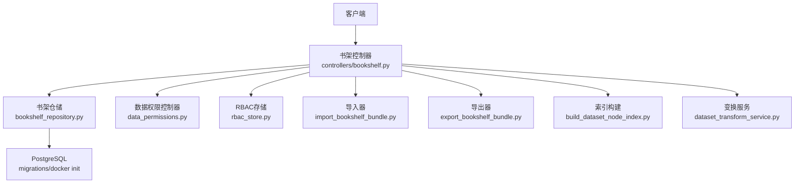
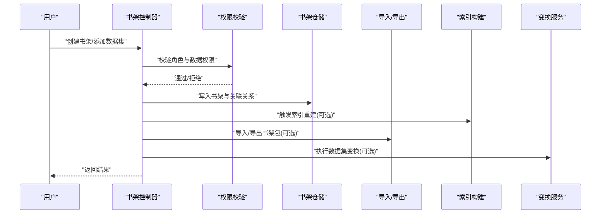
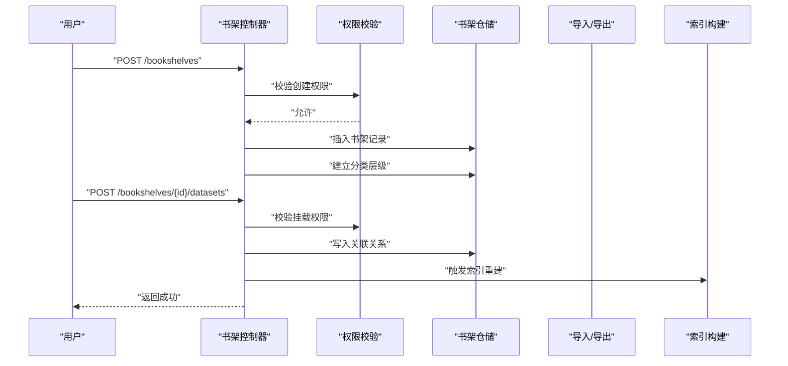
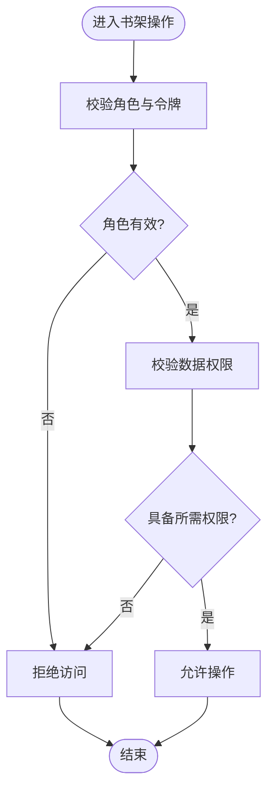
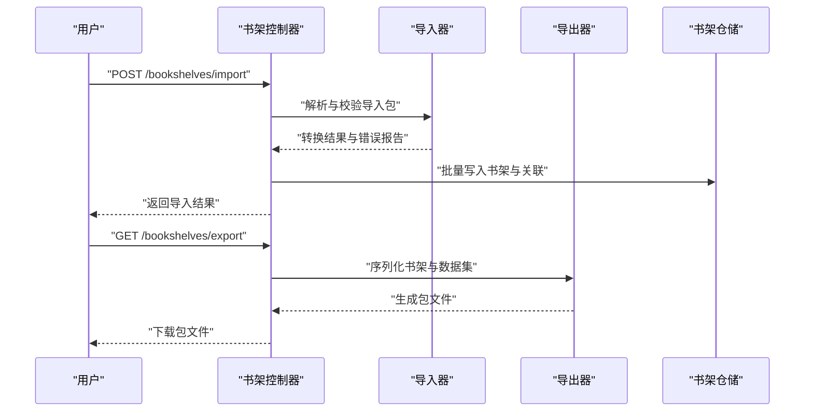
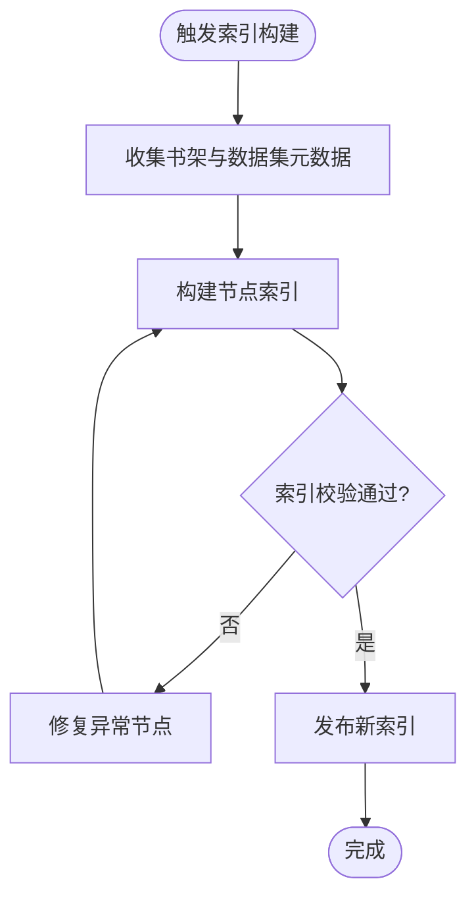
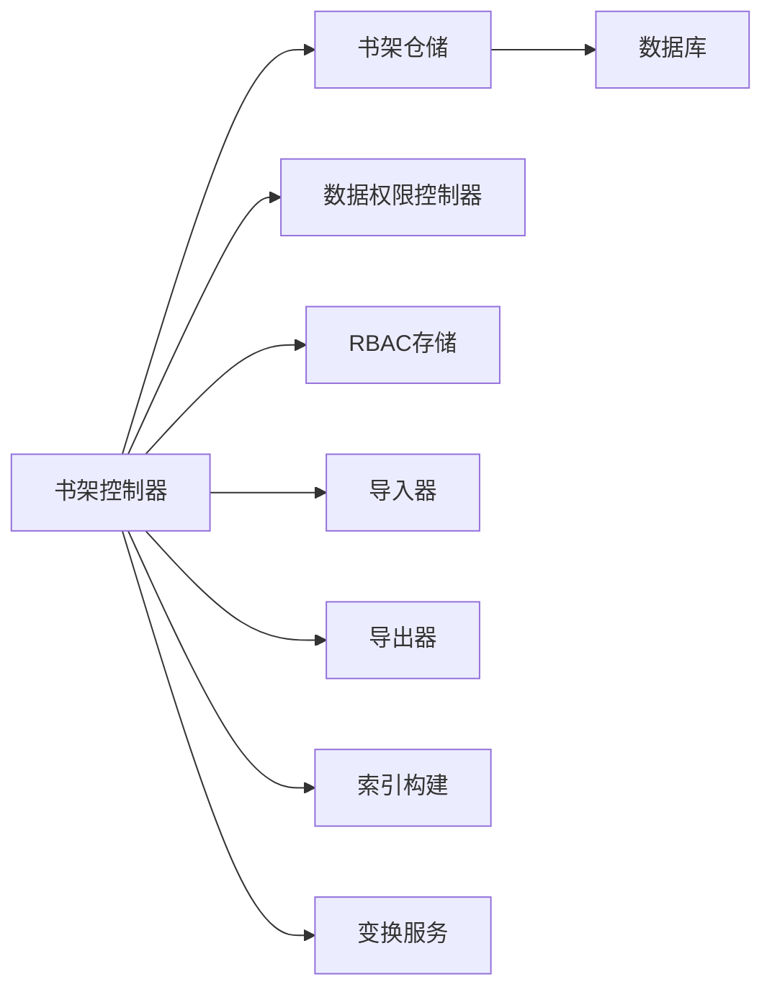

# 书架管理控制器

<cite>
**本文引用的文件**   
- [bookshelf.py](file://backend/controllers/bookshelf.py)
- [bookshelf_repository.py](file://backend/bookshelf_repository.py)
- [20260330_bookshelf_schema.sql](file://backend/migrations/20260330_bookshelf_schema.sql)
- [001_bookshelf_schema.sql](file://docker/postgres/init/001_bookshelf_schema.sql)
- [import_bookshelf_bundle.py](file://backend/import_bookshelf_bundle.py)
- [export_bookshelf_bundle.py](file://backend/export_bookshelf_bundle.py)
- [data_permissions.py](file://backend/controllers/data_permissions.py)
- [rbac_store.py](file://backend/rbac_store.py)
- [build_dataset_node_index.py](file://backend/build_dataset_node_index.py)
- [dataset_transform_service.py](file://backend/dataset_transform_service.py)
</cite>

## 目录
1. [简介](#简介)
2. [项目结构](#项目结构)
3. [核心组件](#核心组件)
4. [架构总览](#架构总览)
5. [详细组件分析](#详细组件分析)
6. [依赖关系分析](#依赖关系分析)
7. [性能考虑](#性能考虑)
8. [故障排查指南](#故障排查指南)
9. [结论](#结论)
10. [附录](#附录)

## 简介
本文件为 SmartAsk 平台的“书架管理控制器”提供全面文档，覆盖数据集的组织结构与管理机制、书架的创建与分类层级、数据集与书架的关联关系、元数据与版本控制、权限控制（共享、协作、访问限制）、导入导出功能与格式转换规则、模板与批量操作、搜索与索引优化、备份恢复与数据迁移策略等。读者可据此快速理解并正确使用书架管理能力，并在生产环境中进行调优与排障。

## 项目结构
围绕书架管理的后端实现主要包含以下模块：
- 控制器层：对外暴露 HTTP API，处理请求校验、权限检查与响应封装
- 仓储层：封装数据库访问逻辑，负责 CRUD、事务与一致性
- 迁移脚本：定义书架相关表结构与字段演进
- 导入导出工具：支持书架包导入导出与格式转换
- 权限与 RBAC：控制数据级与对象级访问权限
- 索引构建：构建数据集节点索引以支撑高效检索
- 变换服务：提供数据集维度与指标的统一变换能力

**图表来源** 
- [bookshelf.py](file://backend/controllers/bookshelf.py)
- [bookshelf_repository.py](file://backend/bookshelf_repository.py)
- [20260330_bookshelf_schema.sql](file://backend/migrations/20260330_bookshelf_schema.sql)
- [001_bookshelf_schema.sql](file://docker/postgres/init/001_bookshelf_schema.sql)
- [import_bookshelf_bundle.py](file://backend/import_bookshelf_bundle.py)
- [export_bookshelf_bundle.py](file://backend/export_bookshelf_bundle.py)
- [data_permissions.py](file://backend/controllers/data_permissions.py)
- [rbac_store.py](file://backend/rbac_store.py)
- [build_dataset_node_index.py](file://backend/build_dataset_node_index.py)
- [dataset_transform_service.py](file://backend/dataset_transform_service.py)

**章节来源**
- [bookshelf.py](file://backend/controllers/bookshelf.py)
- [bookshelf_repository.py](file://backend/bookshelf_repository.py)
- [20260330_bookshelf_schema.sql](file://backend/migrations/20260330_bookshelf_schema.sql)
- [001_bookshelf_schema.sql](file://docker/postgres/init/001_bookshelf_schema.sql)

## 核心组件
- 书架控制器：提供书架与数据集的增删改查、分类与层级管理、权限校验、导入导出编排、索引重建与批量操作入口
- 书架仓储：封装书架与数据集关联的持久化逻辑，保证事务性与一致性
- 权限与 RBAC：基于角色与数据权限模型，控制书架与数据集的可见性与操作权限
- 导入导出：统一书架包的序列化与反序列化，支持多格式与转换规则
- 索引构建：构建数据集节点索引，提升搜索与路由效率
- 变换服务：对数据集维度与指标进行标准化变换，保障跨源一致性

**章节来源**
- [bookshelf.py](file://backend/controllers/bookshelf.py)
- [bookshelf_repository.py](file://backend/bookshelf_repository.py)
- [data_permissions.py](file://backend/controllers/data_permissions.py)
- [rbac_store.py](file://backend/rbac_store.py)
- [import_bookshelf_bundle.py](file://backend/import_bookshelf_bundle.py)
- [export_bookshelf_bundle.py](file://backend/export_bookshelf_bundle.py)
- [build_dataset_node_index.py](file://backend/build_dataset_node_index.py)
- [dataset_transform_service.py](file://backend/dataset_transform_service.py)

## 架构总览
书架管理采用分层架构：控制器负责接口编排与权限校验；仓储负责数据访问；外部工具负责导入导出与索引构建；权限子系统提供细粒度访问控制。

**图表来源** 
- [bookshelf.py](file://backend/controllers/bookshelf.py)
- [bookshelf_repository.py](file://backend/bookshelf_repository.py)
- [data_permissions.py](file://backend/controllers/data_permissions.py)
- [import_bookshelf_bundle.py](file://backend/import_bookshelf_bundle.py)
- [export_bookshelf_bundle.py](file://backend/export_bookshelf_bundle.py)
- [build_dataset_node_index.py](file://backend/build_dataset_node_index.py)
- [dataset_transform_service.py](file://backend/dataset_transform_service.py)

## 详细组件分析

### 书架控制器（API 与编排）
职责概览：
- 书架生命周期管理：创建、更新、删除、查询、分页与筛选
- 分类与层级：支持多级分类树、父子关系维护、排序与移动
- 数据集关联：将数据集挂载到书架节点，支持批量挂载与解绑
- 元数据与版本：维护书架与数据集的元数据、版本标签与变更记录
- 权限控制：调用权限校验模块，确保仅授权用户可操作
- 导入导出：编排书架包导入导出流程，支持格式校验与转换
- 索引与变换：在变更后按需重建索引或执行数据集变换

关键流程示例（创建书架并挂载数据集）：

**图表来源** 
- [bookshelf.py](file://backend/controllers/bookshelf.py)
- [bookshelf_repository.py](file://backend/bookshelf_repository.py)
- [data_permissions.py](file://backend/controllers/data_permissions.py)
- [build_dataset_node_index.py](file://backend/build_dataset_node_index.py)

**章节来源**
- [bookshelf.py](file://backend/controllers/bookshelf.py)

### 书架仓储（数据访问与一致性）
职责概览：
- 书架与分类树的 CRUD 操作
- 数据集与书架节点的关联关系维护
- 元数据与版本记录的持久化
- 事务边界与并发安全控制
- 批量操作的原子性保障

典型操作：
- 创建书架与子节点
- 挂载/解绑数据集
- 更新元数据与版本标签
- 批量移动与排序

**章节来源**
- [bookshelf_repository.py](file://backend/bookshelf_repository.py)

### 权限控制（共享、协作与访问限制）
职责概览：
- 基于角色的访问控制（RBAC）与数据权限模型结合
- 书架与数据集的共享范围控制（私有、团队、公开）
- 协作模式下的读写权限细化（只读、编辑、管理员）
- 访问限制策略（组织隔离、租户隔离、字段级限制）

权限决策流程：

**图表来源** 
- [data_permissions.py](file://backend/controllers/data_permissions.py)
- [rbac_store.py](file://backend/rbac_store.py)

**章节来源**
- [data_permissions.py](file://backend/controllers/data_permissions.py)
- [rbac_store.py](file://backend/rbac_store.py)

### 导入导出（格式与转换规则）
职责概览：
- 书架包导入：解析 JSON/YAML/CSV 等格式，校验结构，转换为内部模型
- 书架包导出：将书架与数据集关联、元数据与版本信息序列化为标准包
- 转换规则：字段映射、类型转换、缺失值处理、冲突解决策略
- 批量导入：支持大规模书架与数据集的批量挂载与更新

导入导出时序：

**图表来源** 
- [import_bookshelf_bundle.py](file://backend/import_bookshelf_bundle.py)
- [export_bookshelf_bundle.py](file://backend/export_bookshelf_bundle.py)
- [bookshelf_repository.py](file://backend/bookshelf_repository.py)

**章节来源**
- [import_bookshelf_bundle.py](file://backend/import_bookshelf_bundle.py)
- [export_bookshelf_bundle.py](file://backend/export_bookshelf_bundle.py)

### 模板与批量操作
- 模板：预定义书架分类与数据集挂载模板，支持一键应用
- 批量操作：批量创建书架、批量挂载/解绑数据集、批量更新元数据与版本标签
- 幂等性：批量操作需支持重试与幂等键，避免重复写入

**章节来源**
- [bookshelf.py](file://backend/controllers/bookshelf.py)
- [bookshelf_repository.py](file://backend/bookshelf_repository.py)

### 搜索、索引与性能调优
- 索引构建：按书架节点与数据集维度构建索引，支持前缀匹配与模糊搜索
- 缓存策略：热点书架与常用查询结果缓存，降低数据库压力
- 分页与过滤：服务端分页、多维度过滤与排序
- 异步任务：索引重建与批量导入导出采用异步队列，避免阻塞主线程

索引构建流程：

**图表来源** 
- [build_dataset_node_index.py](file://backend/build_dataset_node_index.py)

**章节来源**
- [build_dataset_node_index.py](file://backend/build_dataset_node_index.py)

### 元数据管理与版本控制
- 元数据：书架名称、描述、分类路径、标签、所有者、创建/更新时间戳
- 版本控制：书架与数据集的版本标签、变更日志、回滚能力
- 审计追踪：记录关键操作的审计日志，便于问题定位与合规审计

**章节来源**
- [bookshelf_repository.py](file://backend/bookshelf_repository.py)
- [20260330_bookshelf_schema.sql](file://backend/migrations/20260330_bookshelf_schema.sql)
- [001_bookshelf_schema.sql](file://docker/postgres/init/001_bookshelf_schema.sql)

### 数据集变换服务
- 维度与指标标准化：统一不同数据源的字段命名与类型
- 变换规则：支持 SQL/Python 表达式、函数映射与条件分支
- 验证与测试：变换规则的可测试性与回归验证

**章节来源**
- [dataset_transform_service.py](file://backend/dataset_transform_service.py)

## 依赖关系分析
书架管理模块之间的依赖关系如下：
- 控制器依赖仓储、权限、导入导出、索引构建与变换服务
- 仓储依赖数据库迁移定义的表结构
- 权限子系统依赖 RBAC 存储与数据权限配置
- 导入导出依赖统一的序列化/反序列化与校验逻辑

**图表来源** 
- [bookshelf.py](file://backend/controllers/bookshelf.py)
- [bookshelf_repository.py](file://backend/bookshelf_repository.py)
- [data_permissions.py](file://backend/controllers/data_permissions.py)
- [rbac_store.py](file://backend/rbac_store.py)
- [import_bookshelf_bundle.py](file://backend/import_bookshelf_bundle.py)
- [export_bookshelf_bundle.py](file://backend/export_bookshelf_bundle.py)
- [build_dataset_node_index.py](file://backend/build_dataset_node_index.py)
- [dataset_transform_service.py](file://backend/dataset_transform_service.py)

**章节来源**
- [bookshelf.py](file://backend/controllers/bookshelf.py)
- [bookshelf_repository.py](file://backend/bookshelf_repository.py)
- [data_permissions.py](file://backend/controllers/data_permissions.py)
- [rbac_store.py](file://backend/rbac_store.py)
- [import_bookshelf_bundle.py](file://backend/import_bookshelf_bundle.py)
- [export_bookshelf_bundle.py](file://backend/export_bookshelf_bundle.py)
- [build_dataset_node_index.py](file://backend/build_dataset_node_index.py)
- [dataset_transform_service.py](file://backend/dataset_transform_service.py)

## 性能考虑
- 索引优化：定期重建索引，增量更新热点节点，减少全量扫描
- 缓存策略：对高频查询结果进行缓存，设置合理的过期时间
- 分页与限流：服务端分页与请求限流，防止大查询导致资源耗尽
- 异步处理：导入导出与索引重建走异步队列，避免阻塞主流程
- 连接池与批处理：数据库连接池调优，批量写入使用事务批处理

[本节为通用性能建议，不直接分析具体文件]

## 故障排查指南
常见问题与排查步骤：
- 权限拒绝：检查角色与数据权限配置，确认用户具备所需权限
- 导入失败：查看导入包的格式与字段映射，核对必填项与类型转换
- 索引异常：检查节点元数据完整性，修复异常节点后重新构建索引
- 性能退化：监控慢查询与缓存命中率，调整分页大小与缓存策略
- 版本回滚失败：确认版本标签与变更日志一致性，必要时手动修复

**章节来源**
- [data_permissions.py](file://backend/controllers/data_permissions.py)
- [import_bookshelf_bundle.py](file://backend/import_bookshelf_bundle.py)
- [build_dataset_node_index.py](file://backend/build_dataset_node_index.py)

## 结论
书架管理控制器为 SmartAsk 平台提供了完整的数据集组织与管理能力，涵盖创建、分类、层级、关联、元数据与版本控制、权限控制、导入导出、模板与批量操作、搜索与索引优化、备份恢复与迁移等。通过分层架构与模块化设计，系统具备良好的扩展性与可维护性。在生产环境中，应重点关注权限配置、索引优化与性能调优，以确保稳定高效的运行。

[本节为总结性内容，不直接分析具体文件]

## 附录
- 数据库迁移：书架相关表结构与字段演进见迁移脚本
- 模板与批量操作：建议使用预定义模板与批量接口提高效率
- 备份恢复：定期导出书架包并进行异地备份，制定恢复演练计划

**章节来源**
- [20260330_bookshelf_schema.sql](file://backend/migrations/20260330_bookshelf_schema.sql)
- [001_bookshelf_schema.sql](file://docker/postgres/init/001_bookshelf_schema.sql)
- [export_bookshelf_bundle.py](file://backend/export_bookshelf_bundle.py)
- [import_bookshelf_bundle.py](file://backend/import_bookshelf_bundle.py)