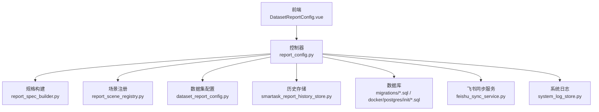
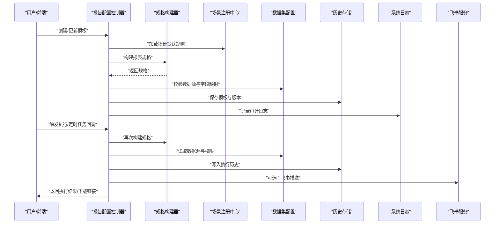
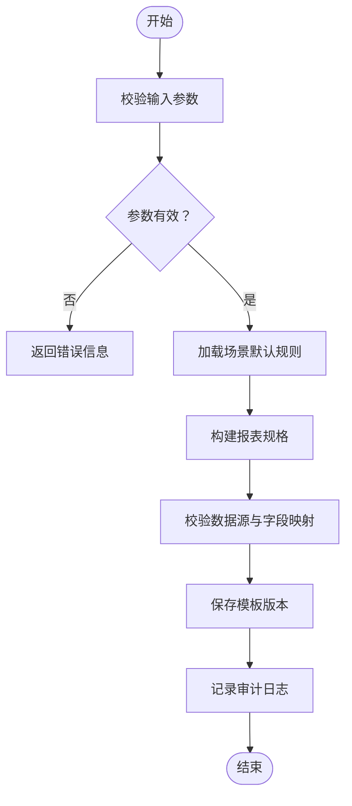
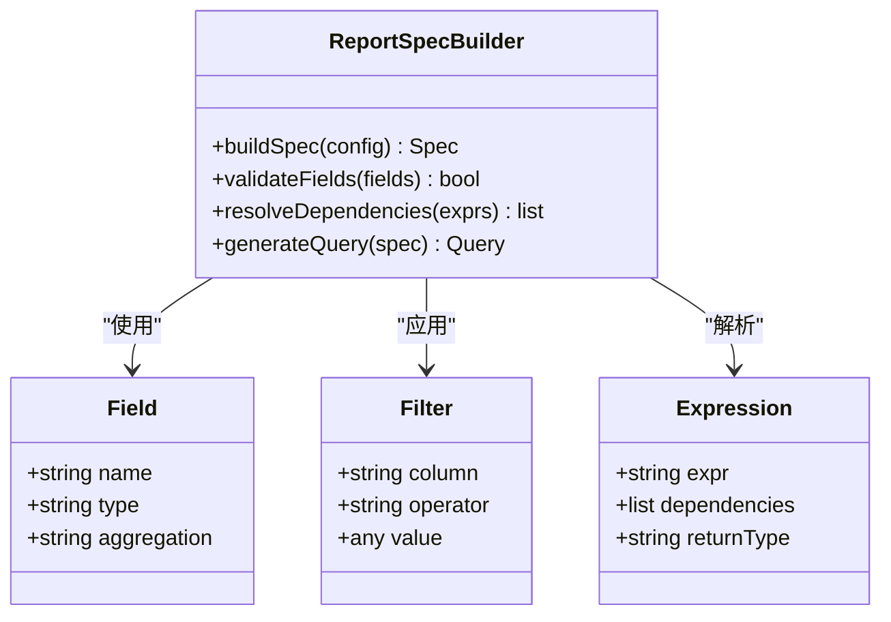
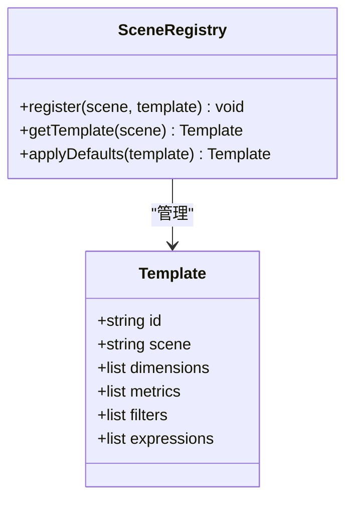
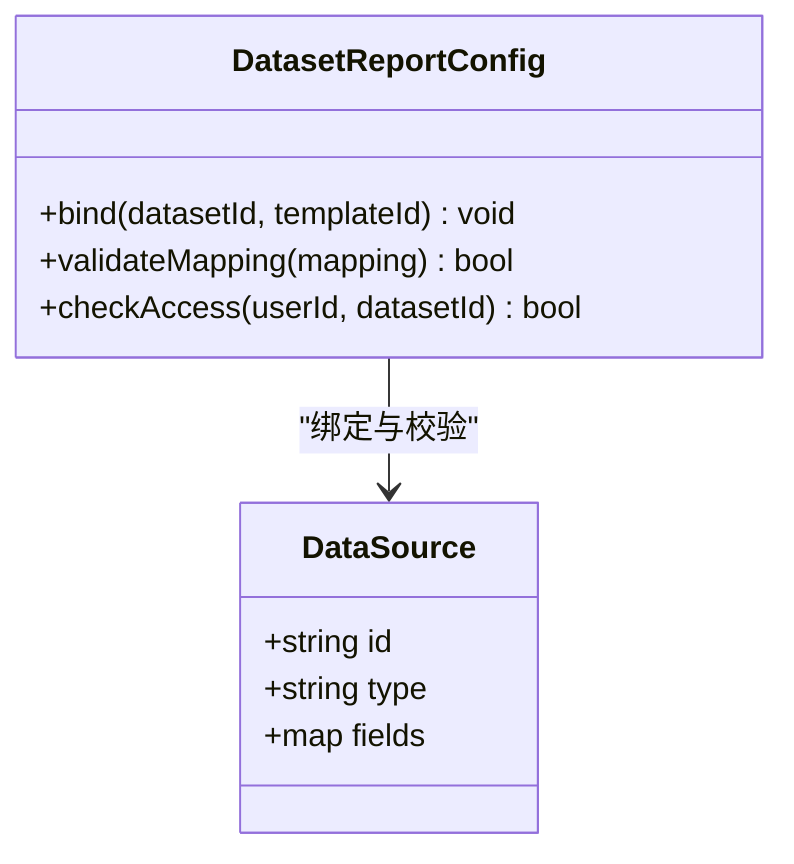
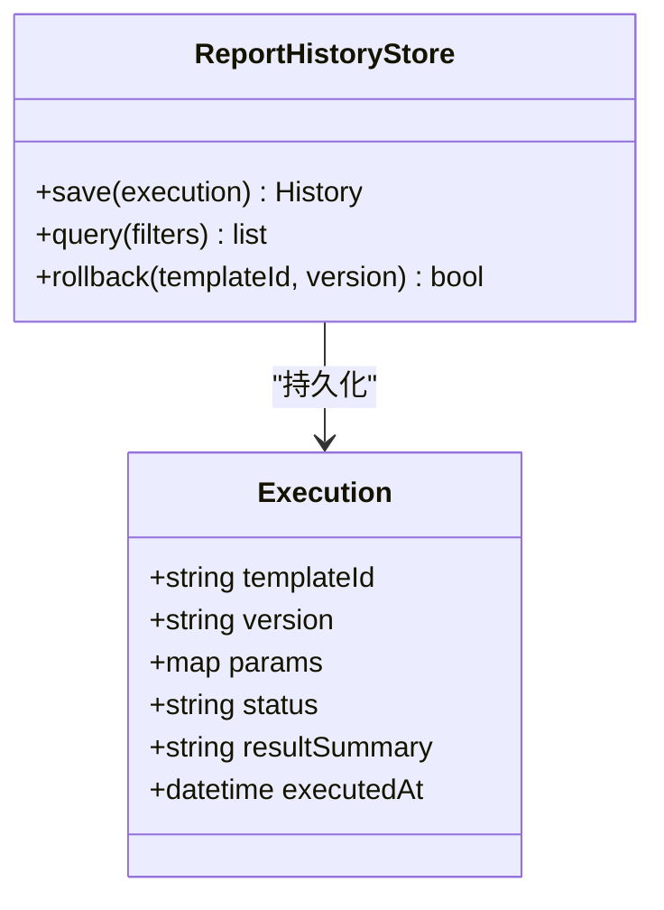
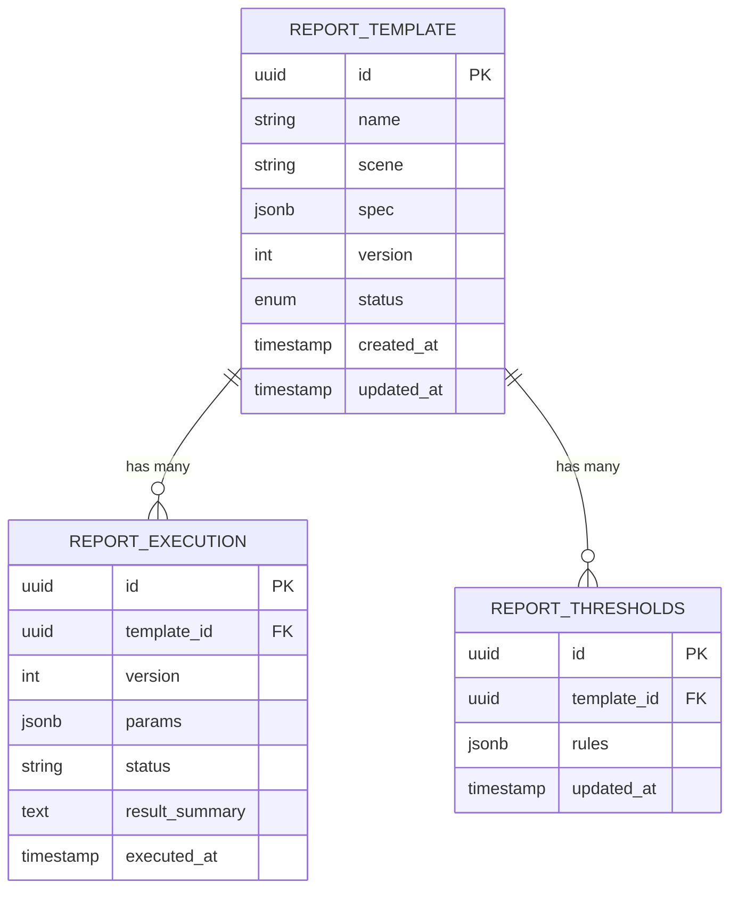
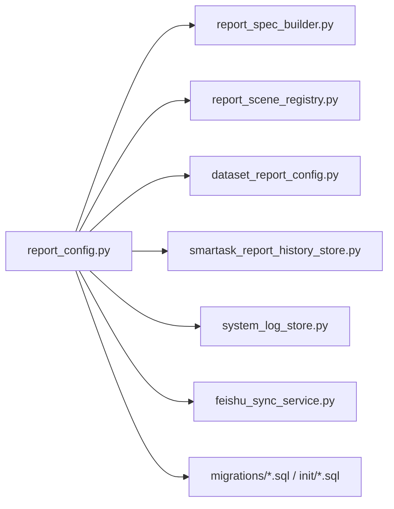

# 报告配置控制器

<cite>
**本文引用的文件**   
- [report_config.py](file://backend/controllers/report_config.py)
- [dataset_report_config.py](file://backend/dataset_report_config.py)
- [report_spec_builder.py](file://backend/report_spec_builder.py)
- [report_scene_registry.py](file://backend/report_scene_registry.py)
- [smartask_report_history_store.py](file://backend/smartask_report_history_store.py)
- [20260430_report_config.sql](file://backend/migrations/20260430_report_config.sql)
- [20260509_report_thresholds.sql](file://backend/migrations/20260509_report_thresholds.sql)
- [004_report_config.sql](file://docker/postgres/init/004_report_config.sql)
- [005_report_thresholds.sql](file://docker/postgres/init/005_report_thresholds.sql)
- [app.py](file://backend/app.py)
- [system_log_store.py](file://backend/system_log_store.py)
- [feishu_sync_service.py](file://backend/feishu_sync_service.py)
- [DatasetReportConfig.vue](file://frontend/src/views/DatasetReportConfig.vue)
</cite>

## 目录
1. [简介](#简介)
2. [项目结构](#项目结构)
3. [核心组件](#核心组件)
4. [架构总览](#架构总览)
5. [详细组件分析](#详细组件分析)
6. [依赖关系分析](#依赖关系分析)
7. [性能考虑](#性能考虑)
8. [故障排查指南](#故障排查指南)
9. [结论](#结论)
10. [附录](#附录)

## 简介
本文件为 SmartAsk 平台的“报告配置控制器”提供系统化文档，聚焦报表模板的生命周期管理（创建、编辑、版本控制与部署）、报告参数配置（数据源绑定、过滤条件、计算字段）、定时任务调度（执行频率、依赖关系、失败重试）、分发策略（邮件发送、飞书推送、文件下载），以及开发规范、最佳实践、性能监控与缓存优化建议、审计日志与版本回溯能力。

## 项目结构
围绕报告配置的核心代码主要分布在后端控制器、服务层、迁移脚本与前端视图：
- 控制器层：负责 HTTP API 路由与请求校验
- 服务层：封装报表模板、场景注册、规格构建、历史存储等逻辑
- 数据层：PostgreSQL 表结构与初始化脚本
- 前端：报告配置页面与交互流程

图表来源
- [report_config.py](file://backend/controllers/report_config.py)
- [report_spec_builder.py](file://backend/report_spec_builder.py)
- [report_scene_registry.py](file://backend/report_scene_registry.py)
- [dataset_report_config.py](file://backend/dataset_report_config.py)
- [smartask_report_history_store.py](file://backend/smartask_report_history_store.py)
- [20260430_report_config.sql](file://backend/migrations/20260430_report_config.sql)
- [20260509_report_thresholds.sql](file://backend/migrations/20260509_report_thresholds.sql)
- [004_report_config.sql](file://docker/postgres/init/004_report_config.sql)
- [005_report_thresholds.sql](file://docker/postgres/init/005_report_thresholds.sql)
- [feishu_sync_service.py](file://backend/feishu_sync_service.py)
- [system_log_store.py](file://backend/system_log_store.py)
- [DatasetReportConfig.vue](file://frontend/src/views/DatasetReportConfig.vue)

章节来源
- [app.py](file://backend/app.py)
- [report_config.py](file://backend/controllers/report_config.py)

## 核心组件
- 报告配置控制器：暴露 RESTful 接口，处理模板的增删改查、版本发布、参数校验与执行触发。
- 报表规格构建器：将用户配置的维度、指标、过滤条件、计算字段转换为可执行的报表规格。
- 场景注册中心：维护不同业务场景下的默认模板与规则，支持按场景快速生成报告。
- 数据集报告配置：管理与数据集绑定的数据源、字段映射、权限与可见性。
- 报告历史存储：记录每次生成的报告实例、执行上下文、结果摘要与状态，用于回溯与审计。
- 系统日志与飞书集成：记录操作审计日志，并支持通过飞书通道推送报告或通知。

章节来源
- [report_config.py](file://backend/controllers/report_config.py)
- [report_spec_builder.py](file://backend/report_spec_builder.py)
- [report_scene_registry.py](file://backend/report_scene_registry.py)
- [dataset_report_config.py](file://backend/dataset_report_config.py)
- [smartask_report_history_store.py](file://backend/smartask_report_history_store.py)
- [system_log_store.py](file://backend/system_log_store.py)
- [feishu_sync_service.py](file://backend/feishu_sync_service.py)

## 架构总览
报告配置控制器作为统一入口，协调规格构建、场景注册、数据集配置、历史存储与外部渠道（飞书、邮件、文件下载）。

图表来源
- [report_config.py](file://backend/controllers/report_config.py)
- [report_spec_builder.py](file://backend/report_spec_builder.py)
- [report_scene_registry.py](file://backend/report_scene_registry.py)
- [dataset_report_config.py](file://backend/dataset_report_config.py)
- [smartask_report_history_store.py](file://backend/smartask_report_history_store.py)
- [system_log_store.py](file://backend/system_log_store.py)
- [feishu_sync_service.py](file://backend/feishu_sync_service.py)

## 详细组件分析

### 报告配置控制器（API 与生命周期）
- 职责
  - 模板 CRUD：创建、编辑、删除、查询列表与详情
  - 版本控制：版本快照、回滚、发布与停用
  - 参数校验：数据源绑定、过滤条件、计算字段合法性检查
  - 执行触发：手动执行与定时任务回调
  - 分发策略：邮件、飞书、文件下载
  - 审计日志：记录关键操作与执行结果
- 关键流程
  - 模板创建/更新：加载场景默认 -> 构建规格 -> 校验数据源 -> 持久化版本 -> 审计日志
  - 执行流程：解析参数 -> 构建规格 -> 读取数据 -> 生成结果 -> 写入历史 -> 可选分发
  - 版本回滚：根据版本号恢复模板快照并标记新版本状态

图表来源
- [report_config.py](file://backend/controllers/report_config.py)
- [report_spec_builder.py](file://backend/report_spec_builder.py)
- [report_scene_registry.py](file://backend/report_scene_registry.py)
- [dataset_report_config.py](file://backend/dataset_report_config.py)
- [smartask_report_history_store.py](file://backend/smartask_report_history_store.py)
- [system_log_store.py](file://backend/system_log_store.py)

章节来源
- [report_config.py](file://backend/controllers/report_config.py)

### 报表规格构建器（参数与计算字段）
- 职责
  - 将维度、指标、过滤条件、计算字段组合为可执行规格
  - 校验字段类型、聚合方式、表达式合法性
  - 生成 SQL 或查询计划（由下游执行引擎实现）
- 关键点
  - 计算字段需声明依赖与类型，避免循环依赖
  - 过滤条件支持时间范围、枚举值、数值区间
  - 指标聚合需明确分组维度与排序规则

图表来源
- [report_spec_builder.py](file://backend/report_spec_builder.py)

章节来源
- [report_spec_builder.py](file://backend/report_spec_builder.py)

### 场景注册中心（模板工厂）
- 职责
  - 维护业务场景的默认模板与规则
  - 提供按场景快速生成模板的能力
  - 支持场景级覆盖与扩展点
- 关键点
  - 场景模板应包含常用维度、指标与过滤预设
  - 支持多租户/组织隔离的场景配置

图表来源
- [report_scene_registry.py](file://backend/report_scene_registry.py)

章节来源
- [report_scene_registry.py](file://backend/report_scene_registry.py)

### 数据集报告配置（数据源绑定与权限）
- 职责
  - 管理数据集与报告模板的绑定关系
  - 校验字段映射、数据类型与权限
  - 支持只读/读写模式与可见性控制
- 关键点
  - 数据源变更需触发模板重新校验
  - 权限不足时拒绝访问或返回空结果

图表来源
- [dataset_report_config.py](file://backend/dataset_report_config.py)

章节来源
- [dataset_report_config.py](file://backend/dataset_report_config.py)

### 报告历史存储（审计与回溯）
- 职责
  - 记录每次报告执行的历史，包括参数、规格、结果摘要、状态
  - 支持按模板、时间范围、执行状态检索
  - 提供版本回溯与对比能力
- 关键点
  - 历史数据需保留一定周期，便于审计与问题定位
  - 大结果集仅存储摘要，原始数据走对象存储或临时路径

图表来源
- [smartask_report_history_store.py](file://backend/smartask_report_history_store.py)

章节来源
- [smartask_report_history_store.py](file://backend/smartask_report_history_store.py)

### 数据库模型与迁移
- 报告配置表与阈值表在迁移脚本中定义，确保 schema 一致性
- 初始化脚本用于本地/测试环境快速搭建

图表来源
- [20260430_report_config.sql](file://backend/migrations/20260430_report_config.sql)
- [20260509_report_thresholds.sql](file://backend/migrations/20260509_report_thresholds.sql)
- [004_report_config.sql](file://docker/postgres/init/004_report_config.sql)
- [005_report_thresholds.sql](file://docker/postgres/init/005_report_thresholds.sql)

章节来源
- [20260430_report_config.sql](file://backend/migrations/20260430_report_config.sql)
- [20260509_report_thresholds.sql](file://backend/migrations/20260509_report_thresholds.sql)
- [004_report_config.sql](file://docker/postgres/init/004_report_config.sql)
- [005_report_thresholds.sql](file://docker/postgres/init/005_report_thresholds.sql)

### 前端交互（报告配置页面）
- 职责
  - 提供可视化模板编辑界面
  - 绑定数据源、设置维度/指标/过滤条件
  - 触发执行与查看历史
- 关键点
  - 表单校验与实时预览
  - 版本切换与回滚提示

章节来源
- [DatasetReportConfig.vue](file://frontend/src/views/DatasetReportConfig.vue)

## 依赖关系分析
- 控制器依赖规格构建器、场景注册、数据集配置、历史存储、系统日志与飞书服务
- 数据层依赖迁移脚本定义的表结构
- 前端依赖控制器 API 进行交互

图表来源
- [report_config.py](file://backend/controllers/report_config.py)
- [report_spec_builder.py](file://backend/report_spec_builder.py)
- [report_scene_registry.py](file://backend/report_scene_registry.py)
- [dataset_report_config.py](file://backend/dataset_report_config.py)
- [smartask_report_history_store.py](file://backend/smartask_report_history_store.py)
- [system_log_store.py](file://backend/system_log_store.py)
- [feishu_sync_service.py](file://backend/feishu_sync_service.py)
- [20260430_report_config.sql](file://backend/migrations/20260430_report_config.sql)
- [20260509_report_thresholds.sql](file://backend/migrations/20260509_report_thresholds.sql)
- [004_report_config.sql](file://docker/postgres/init/004_report_config.sql)
- [005_report_thresholds.sql](file://docker/postgres/init/005_report_thresholds.sql)

章节来源
- [report_config.py](file://backend/controllers/report_config.py)

## 性能考虑
- 查询优化
  - 合理设置维度与指标，避免过度聚合
  - 对高频过滤字段建立索引
  - 分页与限流，防止大结果集拖垮服务
- 缓存策略
  - 对静态模板与场景默认规则进行缓存
  - 对热点数据集查询结果做短期缓存（注意失效策略）
- 内存优化
  - 流式处理大结果集，避免一次性加载到内存
  - 限制并发执行数，避免资源争用
- 监控与告警
  - 记录执行耗时、失败率、资源占用
  - 对慢查询与超时进行告警

[本节为通用指导，不直接分析具体文件]

## 故障排查指南
- 常见问题
  - 数据源连接失败：检查连接配置与网络连通性
  - 字段映射错误：核对字段类型与名称一致性
  - 权限不足：确认用户角色与数据集可见性
  - 执行超时：调整查询复杂度或增加超时阈值
- 诊断步骤
  - 查看系统日志与执行历史，定位错误上下文
  - 使用调试工具验证 SQL 或查询计划
  - 逐步缩小过滤条件范围，定位问题字段
- 恢复措施
  - 回滚到上一个稳定版本
  - 清理缓存与临时文件
  - 重启相关服务或扩容资源

章节来源
- [system_log_store.py](file://backend/system_log_store.py)
- [smartask_report_history_store.py](file://backend/smartask_report_history_store.py)

## 结论
报告配置控制器为 SmartAsk 平台提供了完整的报表模板管理能力，涵盖从模板创建、参数配置、版本控制到执行与分发的全链路。通过场景注册、规格构建、数据集绑定与历史存储，实现了高内聚、低耦合的模块化设计。结合性能优化、监控与审计能力，能够满足企业级报表系统的稳定性与可运维性要求。

[本节为总结性内容，不直接分析具体文件]

## 附录
- 开发规范与最佳实践
  - 模板命名与版本语义化（主版本.次版本.修订号）
  - 计算字段需声明依赖与类型，避免循环引用
  - 过滤条件遵循最小权限原则，减少不必要的数据扫描
  - 定时任务设置合理的执行频率与重试策略
- 分发策略建议
  - 邮件：适合正式报告与归档
  - 飞书：适合即时通知与协作
  - 文件下载：适合离线分析与批量处理
- 定时任务调度
  - 支持 Cron 表达式与依赖图
  - 失败重试采用指数退避与最大重试次数限制
  - 执行状态与结果持久化，便于追踪与审计

[本节为补充说明，不直接分析具体文件]