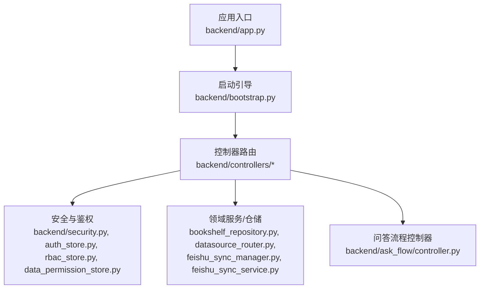
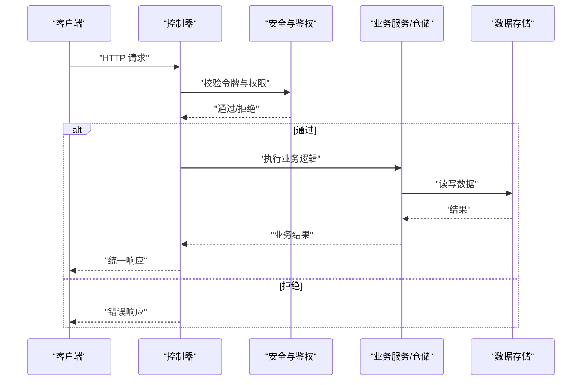
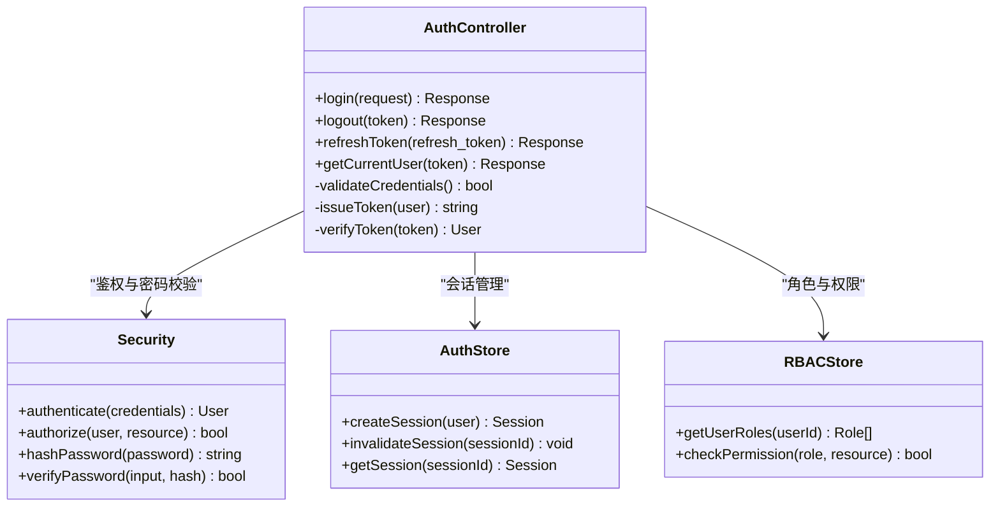
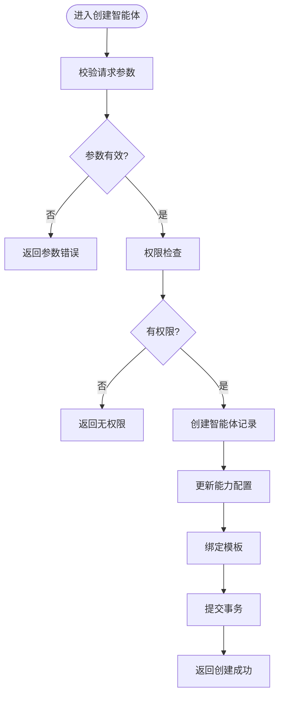
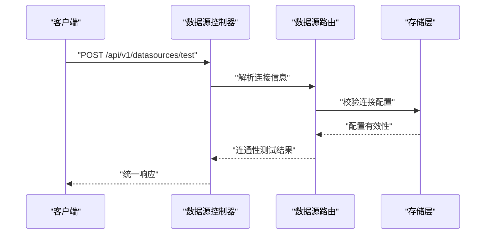
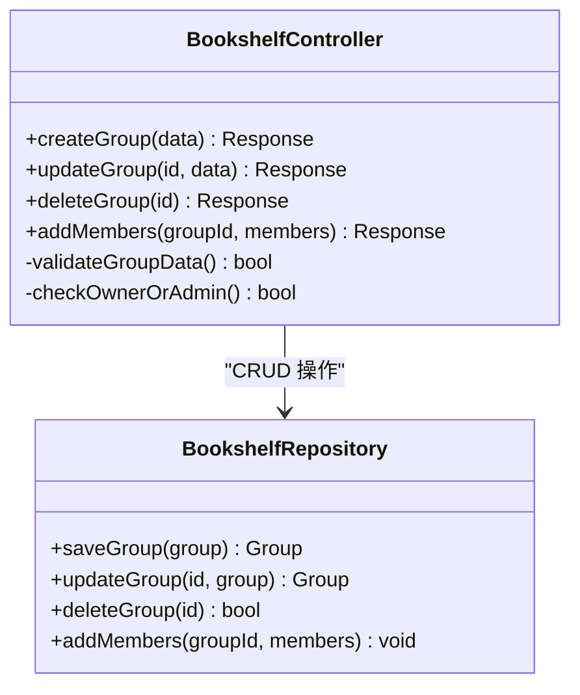
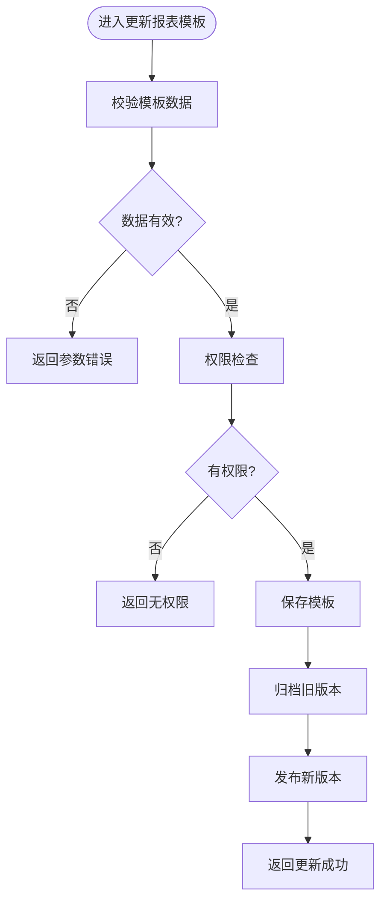
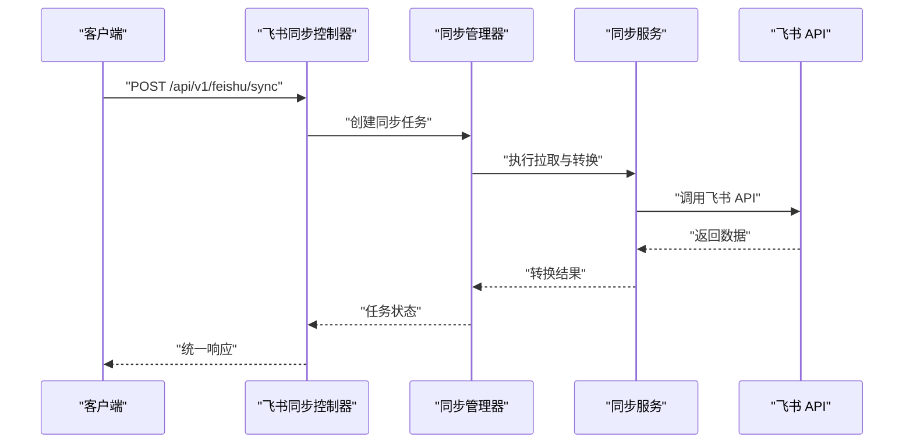
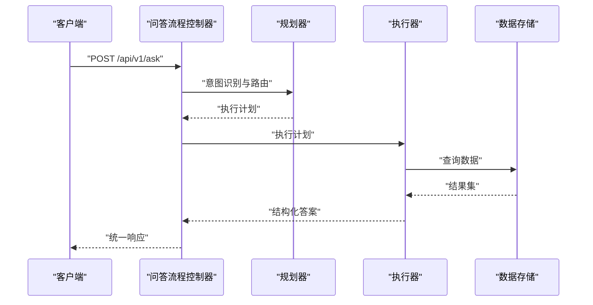
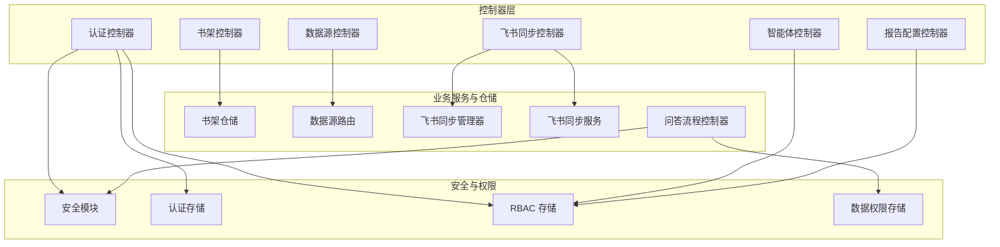

# 控制器层

<cite>
**本文引用的文件**   
- [app.py](file://backend/app.py)
- [bootstrap.py](file://backend/bootstrap.py)
- [controllers/auth.py](file://backend/controllers/auth.py)
- [controllers/agents.py](file://backend/controllers/agents.py)
- [controllers/datasources.py](file://backend/controllers/datasources.py)
- [controllers/bookshelf.py](file://backend/controllers/bookshelf.py)
- [controllers/report_config.py](file://backend/controllers/report_config.py)
- [controllers/feishu_sync.py](file://backend/controllers/feishu_sync.py)
- [security.py](file://backend/security.py)
- [auth_store.py](file://backend/auth_store.py)
- [rbac_store.py](file://backend/rbac_store.py)
- [data_permission_store.py](file://backend/data_permission_store.py)
- [bookshelf_repository.py](file://backend/bookshelf_repository.py)
- [datasource_router.py](file://backend/datasource_router.py)
- [feishu_sync_manager.py](file://backend/feishu_sync_manager.py)
- [feishu_sync_service.py](file://backend/feishu_sync_service.py)
- [ask_flow/controller.py](file://backend/ask_flow/controller.py)
</cite>

## 目录
1. [简介](#简介)
2. [项目结构](#项目结构)
3. [核心组件](#核心组件)
4. [架构总览](#架构总览)
5. [详细组件分析](#详细组件分析)
6. [依赖关系分析](#依赖关系分析)
7. [性能考量](#性能考量)
8. [故障排查指南](#故障排查指南)
9. [结论](#结论)
10. [附录](#附录)

## 简介
本文件面向 SmartAsk 智能问数平台的后端控制器层，系统性阐述 RESTful API 的设计规范与实现要点，覆盖请求参数校验、响应格式化、错误处理策略、权限检查机制与事务管理。文档重点解读以下业务控制器：认证控制器、智能体管理控制器、数据源控制器、书架控制器、报告配置控制器、飞书同步控制器，并给出接口版本管理与向后兼容性建议。读者可据此快速理解各控制器的职责边界、调用流程与最佳实践。

## 项目结构
后端采用模块化分层设计，控制器位于 backend/controllers 下，按业务能力划分；应用启动与路由注册集中在 backend/app.py 与 backend/bootstrap.py 中；安全与鉴权由 security.py、auth_store.py、rbac_store.py、data_permission_store.py 等模块提供支撑；领域服务与仓储（如 bookshelf_repository.py、datasource_router.py、feishu_sync_manager.py）在控制器之下承担具体业务逻辑。

图表来源 
- [app.py](file://backend/app.py)
- [bootstrap.py](file://backend/bootstrap.py)
- [controllers/auth.py](file://backend/controllers/auth.py)
- [controllers/agents.py](file://backend/controllers/agents.py)
- [controllers/datasources.py](file://backend/controllers/datasources.py)
- [controllers/bookshelf.py](file://backend/controllers/bookshelf.py)
- [controllers/report_config.py](file://backend/controllers/report_config.py)
- [controllers/feishu_sync.py](file://backend/controllers/feishu_sync.py)
- [security.py](file://backend/security.py)
- [auth_store.py](file://backend/auth_store.py)
- [rbac_store.py](file://backend/rbac_store.py)
- [data_permission_store.py](file://backend/data_permission_store.py)
- [bookshelf_repository.py](file://backend/bookshelf_repository.py)
- [datasource_router.py](file://backend/datasource_router.py)
- [feishu_sync_manager.py](file://backend/feishu_sync_manager.py)
- [feishu_sync_service.py](file://backend/feishu_sync_service.py)
- [ask_flow/controller.py](file://backend/ask_flow/controller.py)

章节来源
- [app.py](file://backend/app.py)
- [bootstrap.py](file://backend/bootstrap.py)

## 核心组件
- 认证控制器：负责用户登录、令牌签发与校验、会话维护、基础权限判定。
- 智能体管理控制器：提供 AI 代理的增删改查与状态管理，支持能力开关与模板绑定。
- 数据源控制器：管理数据库连接信息、连通性测试、连接池与路由选择。
- 书架控制器：数据集组织、分组、标签与访问控制，关联智能体与报表配置。
- 报告配置控制器：报表模板定义、阈值与渲染规则、发布与版本管理。
- 飞书同步控制器：第三方集成对接，包括表元数据拉取、增量同步与任务调度。

上述控制器统一遵循以下规范：
- 请求参数校验：路径参数、查询参数、请求体字段均进行类型与范围校验，缺失或非法返回标准错误码。
- 响应格式化：成功响应包含 code、message、data 三字段；分页接口统一 page、pageSize、total、list 结构。
- 错误处理：异常捕获后转换为统一错误格式，区分业务错误与系统错误，记录必要上下文。
- 权限检查：基于 RBAC 与数据权限双重校验，敏感操作需额外审批或二次确认。
- 事务管理：写操作使用短事务包裹，保证一致性；读操作走只读副本或缓存。

章节来源
- [controllers/auth.py](file://backend/controllers/auth.py)
- [controllers/agents.py](file://backend/controllers/agents.py)
- [controllers/datasources.py](file://backend/controllers/datasources.py)
- [controllers/bookshelf.py](file://backend/controllers/bookshelf.py)
- [controllers/report_config.py](file://backend/controllers/report_config.py)
- [controllers/feishu_sync.py](file://backend/controllers/feishu_sync.py)
- [security.py](file://backend/security.py)
- [auth_store.py](file://backend/auth_store.py)
- [rbac_store.py](file://backend/rbac_store.py)
- [data_permission_store.py](file://backend/data_permission_store.py)

## 架构总览
控制器层作为 HTTP 接口的门面，接收请求、执行参数校验、调用安全与权限模块、委派业务服务完成持久化与外部集成，最后返回统一格式的响应。

图表来源 
- [controllers/auth.py](file://backend/controllers/auth.py)
- [controllers/agents.py](file://backend/controllers/agents.py)
- [controllers/datasources.py](file://backend/controllers/datasources.py)
- [controllers/bookshelf.py](file://backend/controllers/bookshelf.py)
- [controllers/report_config.py](file://backend/controllers/report_config.py)
- [controllers/feishu_sync.py](file://backend/controllers/feishu_sync.py)
- [security.py](file://backend/security.py)
- [auth_store.py](file://backend/auth_store.py)
- [rbac_store.py](file://backend/rbac_store.py)
- [data_permission_store.py](file://backend/data_permission_store.py)

## 详细组件分析

### 认证控制器（Auth）
- 职责边界：登录、登出、刷新令牌、获取当前用户信息、密码重置、多因子校验（可选）。
- 参数校验：用户名/邮箱、密码强度、验证码、设备指纹等；失败返回明确错误码。
- 权限检查：登录成功后生成短期令牌，后续请求携带令牌进行身份验证；结合 RBAC 决定资源访问。
- 事务管理：登录写入审计日志为独立事务；密码重置涉及账户状态更新，使用事务保证一致。
- 错误处理：账号不存在、密码错误、令牌过期、验证码失效等均有对应错误码与提示。

图表来源 
- [controllers/auth.py](file://backend/controllers/auth.py)
- [security.py](file://backend/security.py)
- [auth_store.py](file://backend/auth_store.py)
- [rbac_store.py](file://backend/rbac_store.py)

章节来源
- [controllers/auth.py](file://backend/controllers/auth.py)
- [security.py](file://backend/security.py)
- [auth_store.py](file://backend/auth_store.py)
- [rbac_store.py](file://backend/rbac_store.py)

### 智能体管理控制器（Agents）
- 职责边界：AI 代理的创建、更新、删除、查询、启用/禁用、能力配置与模板绑定。
- 参数校验：名称唯一性、模型版本合法性、能力开关枚举、模板 ID 存在性。
- 权限检查：仅管理员或具备“智能体管理”角色的用户可执行写操作。
- 事务管理：创建/更新智能体时，同时更新能力配置与模板映射，使用事务确保一致性。
- 错误处理：重复名称、无效模型、模板不存在等错误明确返回。

图表来源 
- [controllers/agents.py](file://backend/controllers/agents.py)
- [rbac_store.py](file://backend/rbac_store.py)

章节来源
- [controllers/agents.py](file://backend/controllers/agents.py)
- [rbac_store.py](file://backend/rbac_store.py)

### 数据源控制器（Datasources）
- 职责边界：数据源连接信息的增删改查、连通性测试、连接池配置、路由选择。
- 参数校验：连接字符串格式、端口范围、超时时间、加密方式等。
- 权限检查：数据源可见性与操作权限受组织与角色控制。
- 事务管理：连接信息更新与路由表变更在同一事务内完成。
- 错误处理：连接失败、凭证错误、网络不可达等错误分类处理。

图表来源 
- [controllers/datasources.py](file://backend/controllers/datasources.py)
- [datasource_router.py](file://backend/datasource_router.py)

章节来源
- [controllers/datasources.py](file://backend/controllers/datasources.py)
- [datasource_router.py](file://backend/datasource_router.py)

### 书架控制器（Bookshelf）
- 职责边界：数据集分组、标签管理、成员授权、与智能体/报表配置的关联。
- 参数校验：分组名唯一性、标签集合去重、成员角色合法性。
- 权限检查：书架所有者或管理员可修改；成员仅具读取或受限写入权限。
- 事务管理：批量添加成员与更新权限时使用事务保证一致性。
- 错误处理：重复分组、非法成员角色、关联对象不存在等错误。

图表来源 
- [controllers/bookshelf.py](file://backend/controllers/bookshelf.py)
- [bookshelf_repository.py](file://backend/bookshelf_repository.py)

章节来源
- [controllers/bookshelf.py](file://backend/controllers/bookshelf.py)
- [bookshelf_repository.py](file://backend/bookshelf_repository.py)

### 报告配置控制器（Report Config）
- 职责边界：报表模板定义、阈值设置、渲染规则、发布与版本管理。
- 参数校验：模板 ID 唯一性、阈值范围、渲染引擎兼容性。
- 权限检查：仅具备“报表管理”角色的用户可编辑与发布。
- 事务管理：模板更新与版本归档在同一事务内完成。
- 错误处理：模板冲突、阈值越界、渲染失败等错误分类处理。

图表来源 
- [controllers/report_config.py](file://backend/controllers/report_config.py)

章节来源
- [controllers/report_config.py](file://backend/controllers/report_config.py)

### 飞书同步控制器（Feishu Sync）
- 职责边界：飞书表元数据拉取、增量同步、任务调度、错误重试与告警。
- 参数校验：飞书应用凭证、表 ID 列表、同步策略（全量/增量）、过滤条件。
- 权限检查：仅管理员或具备“飞书集成”角色的用户可配置与触发同步。
- 事务管理：同步任务状态更新与元数据落库使用事务保证一致性。
- 错误处理：API 限流、网络超时、数据格式不匹配等错误重试与降级。

图表来源 
- [controllers/feishu_sync.py](file://backend/controllers/feishu_sync.py)
- [feishu_sync_manager.py](file://backend/feishu_sync_manager.py)
- [feishu_sync_service.py](file://backend/feishu_sync_service.py)

章节来源
- [controllers/feishu_sync.py](file://backend/controllers/feishu_sync.py)
- [feishu_sync_manager.py](file://backend/feishu_sync_manager.py)
- [feishu_sync_service.py](file://backend/feishu_sync_service.py)

### 问答流程控制器（Ask Flow）
- 职责边界：接收自然语言问题，路由到相应数据集与智能体，生成 SQL 或分析计划，返回结构化答案。
- 参数校验：问题文本长度、意图识别输入、数据集选择合法性。
- 权限检查：基于数据集与智能体的访问控制。
- 事务管理：问答历史与中间状态落库使用事务。
- 错误处理：意图识别失败、SQL 生成异常、执行超时等错误分类处理。

图表来源 
- [ask_flow/controller.py](file://backend/ask_flow/controller.py)

章节来源
- [ask_flow/controller.py](file://backend/ask_flow/controller.py)

## 依赖关系分析
控制器层依赖安全与权限模块、业务服务与仓储、以及外部系统集成。耦合度通过清晰的接口契约与分层设计得到控制。

图表来源 
- [controllers/auth.py](file://backend/controllers/auth.py)
- [controllers/agents.py](file://backend/controllers/agents.py)
- [controllers/datasources.py](file://backend/controllers/datasources.py)
- [controllers/bookshelf.py](file://backend/controllers/bookshelf.py)
- [controllers/report_config.py](file://backend/controllers/report_config.py)
- [controllers/feishu_sync.py](file://backend/controllers/feishu_sync.py)
- [security.py](file://backend/security.py)
- [auth_store.py](file://backend/auth_store.py)
- [rbac_store.py](file://backend/rbac_store.py)
- [data_permission_store.py](file://backend/data_permission_store.py)
- [bookshelf_repository.py](file://backend/bookshelf_repository.py)
- [datasource_router.py](file://backend/datasource_router.py)
- [feishu_sync_manager.py](file://backend/feishu_sync_manager.py)
- [feishu_sync_service.py](file://backend/feishu_sync_service.py)
- [ask_flow/controller.py](file://backend/ask_flow/controller.py)

章节来源
- [controllers/auth.py](file://backend/controllers/auth.py)
- [controllers/agents.py](file://backend/controllers/agents.py)
- [controllers/datasources.py](file://backend/controllers/datasources.py)
- [controllers/bookshelf.py](file://backend/controllers/bookshelf.py)
- [controllers/report_config.py](file://backend/controllers/report_config.py)
- [controllers/feishu_sync.py](file://backend/controllers/feishu_sync.py)
- [security.py](file://backend/security.py)
- [auth_store.py](file://backend/auth_store.py)
- [rbac_store.py](file://backend/rbac_store.py)
- [data_permission_store.py](file://backend/data_permission_store.py)
- [bookshelf_repository.py](file://backend/bookshelf_repository.py)
- [datasource_router.py](file://backend/datasource_router.py)
- [feishu_sync_manager.py](file://backend/feishu_sync_manager.py)
- [feishu_sync_service.py](file://backend/feishu_sync_service.py)
- [ask_flow/controller.py](file://backend/ask_flow/controller.py)

## 性能考量
- 请求校验前置：尽早校验与拒绝非法请求，减少下游压力。
- 只读优化：查询接口使用缓存与只读副本，降低主库负载。
- 事务粒度：写操作事务尽量短小，避免长事务阻塞。
- 异步任务：飞书同步等耗时操作采用异步队列与重试机制。
- 连接池：数据源连接池合理配置，避免连接泄漏与耗尽。
- 分页与限流：分页查询限制 pageSize，接口级限流保护稳定性。

## 故障排查指南
- 认证失败：检查令牌有效期、签名算法、用户状态与角色分配。
- 权限不足：核对 RBAC 角色与数据权限策略，确认资源归属。
- 数据源连接失败：验证连接字符串、网络可达性、凭证正确性。
- 书架操作异常：检查组名唯一性、成员角色合法性、关联对象存在性。
- 报表配置错误：确认模板 ID 唯一性、阈值范围、渲染引擎兼容。
- 飞书同步失败：查看 API 限流、网络超时、数据格式映射错误。

章节来源
- [security.py](file://backend/security.py)
- [auth_store.py](file://backend/auth_store.py)
- [rbac_store.py](file://backend/rbac_store.py)
- [data_permission_store.py](file://backend/data_permission_store.py)
- [controllers/auth.py](file://backend/controllers/auth.py)
- [controllers/datasources.py](file://backend/controllers/datasources.py)
- [controllers/bookshelf.py](file://backend/controllers/bookshelf.py)
- [controllers/report_config.py](file://backend/controllers/report_config.py)
- [controllers/feishu_sync.py](file://backend/controllers/feishu_sync.py)

## 结论
SmartAsk 控制器层以清晰的分层与职责边界为基础，结合统一的参数校验、响应格式化与错误处理策略，实现了高内聚、低耦合的 RESTful API 设计。通过 RBAC 与数据权限双重保障，确保了系统的安全性与可扩展性。未来可在接口版本管理与向后兼容性方面进一步完善，以提升生态兼容与演进效率。

## 附录
- 接口版本管理建议：
  - URL 前缀版本化：/api/v1/...，逐步迁移至 v2。
  - 头部版本协商：Accept-Version 与 X-API-Version。
  - 废弃标记：响应头 X-Deprecated 与迁移指南链接。
- 向后兼容性考虑：
  - 新增字段默认值，避免破坏现有客户端。
  - 保留旧版字段至少两个大版本。
  - 提供迁移工具与脚本，辅助升级。