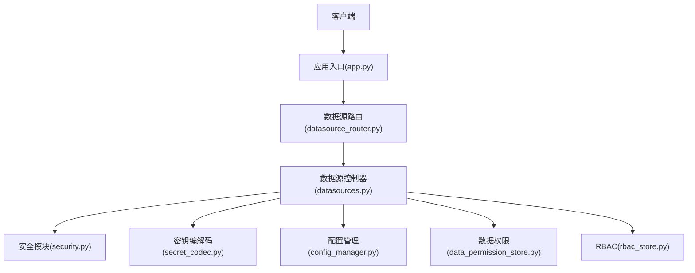
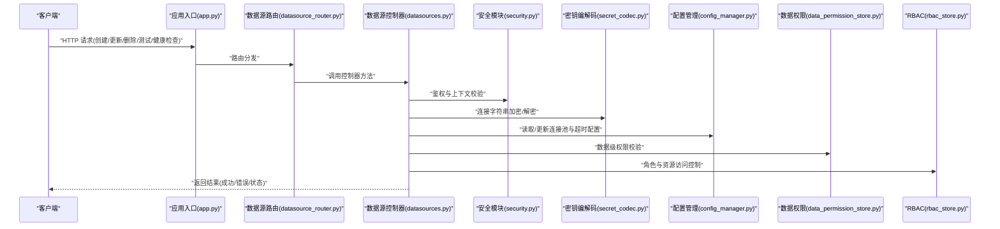
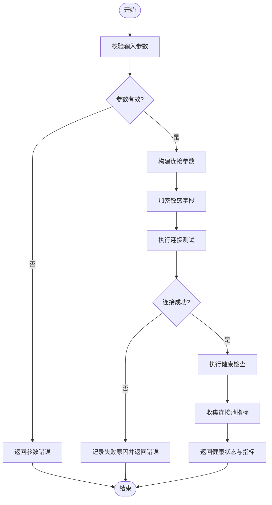
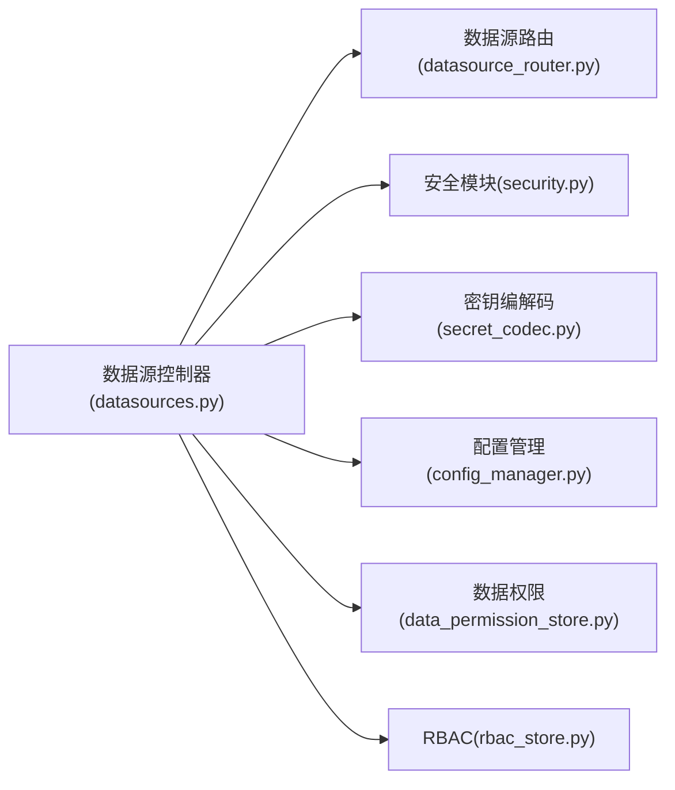

# 数据源管理控制器

<cite>
**本文档引用的文件**   
- [datasources.py](file://backend/controllers/datasources.py)
- [datasource_router.py](file://backend/datasource_router.py)
- [security.py](file://backend/security.py)
- [secret_codec.py](file://backend/secret_codec.py)
- [app.py](file://backend/app.py)
- [config_manager.py](file://backend/config_manager.py)
- [data_permission_store.py](file://backend/data_permission_store.py)
- [rbac_store.py](file://backend/rbac_store.py)
</cite>

## 目录
1. [简介](#简介)
2. [项目结构](#项目结构)
3. [核心组件](#核心组件)
4. [架构总览](#架构总览)
5. [详细组件分析](#详细组件分析)
6. [依赖关系分析](#依赖关系分析)
7. [性能考虑](#性能考虑)
8. [故障排查指南](#故障排查指南)
9. [结论](#结论)
10. [附录](#附录)

## 简介
本文件面向 SmartAsk 平台的数据源管理控制器，系统性阐述多数据源连接管理、数据库连接池配置、连接测试与健康检查机制；详细说明支持的数据库类型（PostgreSQL、MySQL、Oracle 等）及其特定配置项；文档化数据源的 CRUD 接口，包括连接字符串加密存储、连接超时设置与故障转移策略；解释权限控制与访问隔离机制；提供配置最佳实践与性能优化建议；并给出连接池监控、慢查询日志与故障诊断工具的使用说明，以及数据源的动态加载与热更新机制。

## 项目结构
SmartAsk 后端采用模块化组织，数据源相关能力主要分布在以下模块：
- 控制器层：数据源 HTTP 接口定义与请求处理
- 路由层：数据源路由分发与鉴权集成
- 安全与加密：敏感信息加解密与访问控制
- 应用入口：服务启动、中间件注册与全局配置
- 配置管理：运行时配置与数据源参数管理
- 权限与 RBAC：数据级权限与角色访问控制

图表来源
- [app.py](file://backend/app.py)
- [datasource_router.py](file://backend/datasource_router.py)
- [datasources.py](file://backend/controllers/datasources.py)
- [security.py](file://backend/security.py)
- [secret_codec.py](file://backend/secret_codec.py)
- [config_manager.py](file://backend/config_manager.py)
- [data_permission_store.py](file://backend/data_permission_store.py)
- [rbac_store.py](file://backend/rbac_store.py)

章节来源
- [app.py](file://backend/app.py)
- [datasource_router.py](file://backend/datasource_router.py)
- [datasources.py](file://backend/controllers/datasources.py)

## 核心组件
- 数据源控制器：提供数据源的增删改查、连接测试、健康检查、连接池参数调整、连接超时与重试策略配置等 API。
- 数据源路由：将外部请求路由到控制器方法，并注入鉴权上下文。
- 安全与加密：对连接字符串中的敏感字段进行加密存储与解密读取，确保凭据安全。
- 配置管理：集中管理数据源连接池大小、超时、重试、健康检查间隔等参数。
- 权限与 RBAC：基于角色与数据级权限实现访问隔离，限制不同租户/组织对数据源的可见性与操作范围。

章节来源
- [datasources.py](file://backend/controllers/datasources.py)
- [datasource_router.py](file://backend/datasource_router.py)
- [security.py](file://backend/security.py)
- [secret_codec.py](file://backend/secret_codec.py)
- [config_manager.py](file://backend/config_manager.py)
- [data_permission_store.py](file://backend/data_permission_store.py)
- [rbac_store.py](file://backend/rbac_store.py)

## 架构总览
数据源管理的整体流程如下：客户端通过 HTTP 调用数据源控制器，路由层完成鉴权后进入控制器；控制器根据请求执行数据源 CRUD、连接测试与健康检查；敏感信息通过加密模块处理；连接池与超时等参数由配置管理模块统一维护；权限与 RBAC 模块确保访问隔离。

图表来源
- [app.py](file://backend/app.py)
- [datasource_router.py](file://backend/datasource_router.py)
- [datasources.py](file://backend/controllers/datasources.py)
- [security.py](file://backend/security.py)
- [secret_codec.py](file://backend/secret_codec.py)
- [config_manager.py](file://backend/config_manager.py)
- [data_permission_store.py](file://backend/data_permission_store.py)
- [rbac_store.py](file://backend/rbac_store.py)

## 详细组件分析

### 数据源控制器（CRUD、连接测试、健康检查）
- 功能要点
  - 数据源 CRUD：创建、读取、更新、删除数据源元信息与连接参数。
  - 连接测试：使用最小化查询验证连通性，支持多种数据库驱动。
  - 健康检查：周期性或按需检查连接池状态、活跃连接数、等待队列长度。
  - 连接超时与重试：为连接建立、查询执行、事务提交设置超时与重试策略。
  - 故障转移：在连接失败时自动切换至备用数据源或重试其他节点。
- 关键流程
  - 创建/更新：接收连接参数，校验必填项，加密敏感字段，写入配置与权限映射。
  - 连接测试：构建最小查询语句，执行并返回结果或错误码。
  - 健康检查：汇总连接池指标，输出健康状态与告警信息。
- 异常处理
  - 网络异常：捕获连接超时、DNS 解析失败、SSL/TLS 握手失败。
  - 认证失败：用户名/密码错误或权限不足。
  - 数据库差异：方言差异导致的 SQL 语法不兼容。

章节来源
- [datasources.py](file://backend/controllers/datasources.py)

#### 连接测试与健康检查流程图

图表来源
- [datasources.py](file://backend/controllers/datasources.py)
- [secret_codec.py](file://backend/secret_codec.py)
- [config_manager.py](file://backend/config_manager.py)

### 数据源路由与鉴权
- 路由职责
  - 将 /api/datasources/* 路径分发到控制器对应方法。
  - 注入用户身份与租户上下文，供后续权限校验使用。
- 鉴权集成
  - 结合安全模块与 RBAC，校验用户对数据源资源的访问权限。
  - 支持按组织/项目维度隔离数据源可见性与操作权限。

章节来源
- [datasource_router.py](file://backend/datasource_router.py)
- [security.py](file://backend/security.py)
- [rbac_store.py](file://backend/rbac_store.py)

### 安全与加密
- 连接字符串加密
  - 对连接字符串中的用户名、密码、令牌等敏感字段进行加密存储。
  - 读取时自动解密，避免明文泄露。
- 安全策略
  - 传输层启用 HTTPS。
  - 服务端存储加密密钥与盐值，定期轮换。
  - 审计日志记录敏感操作但不包含明文凭据。

章节来源
- [security.py](file://backend/security.py)
- [secret_codec.py](file://backend/secret_codec.py)

### 配置管理与连接池
- 连接池参数
  - 最大连接数、最小连接数、连接空闲超时、获取连接超时、连接存活时间。
  - 查询超时、事务超时、批量操作超时。
- 健康检查与监控
  - 周期任务扫描连接池状态，输出活跃连接、等待队列、失败率。
  - 慢查询日志：记录超过阈值的查询语句与耗时。
- 动态加载与热更新
  - 支持在不重启服务的情况下更新连接池参数与数据源配置。
  - 变更生效前进行预检，失败则回滚。

章节来源
- [config_manager.py](file://backend/config_manager.py)
- [datasources.py](file://backend/controllers/datasources.py)

### 权限控制与访问隔离
- 数据级权限
  - 基于数据权限存储，限定用户可访问的库、表、列级别。
- 角色与资源控制
  - 通过 RBAC 模型分配角色，绑定数据源资源与操作权限。
- 组织隔离
  - 按组织维度隔离数据源，防止跨组织访问。

章节来源
- [data_permission_store.py](file://backend/data_permission_store.py)
- [rbac_store.py](file://backend/rbac_store.py)
- [datasources.py](file://backend/controllers/datasources.py)

## 依赖关系分析
数据源控制器依赖多个内部模块以实现完整功能：
- 路由层负责请求分发与上下文注入。
- 安全与加密模块保障凭据安全。
- 配置管理模块统一维护连接池与超时参数。
- 权限与 RBAC 模块实现访问隔离与细粒度控制。

图表来源
- [datasources.py](file://backend/controllers/datasources.py)
- [datasource_router.py](file://backend/datasource_router.py)
- [security.py](file://backend/security.py)
- [secret_codec.py](file://backend/secret_codec.py)
- [config_manager.py](file://backend/config_manager.py)
- [data_permission_store.py](file://backend/data_permission_store.py)
- [rbac_store.py](file://backend/rbac_store.py)

章节来源
- [datasources.py](file://backend/controllers/datasources.py)
- [datasource_router.py](file://backend/datasource_router.py)
- [security.py](file://backend/security.py)
- [secret_codec.py](file://backend/secret_codec.py)
- [config_manager.py](file://backend/config_manager.py)
- [data_permission_store.py](file://backend/data_permission_store.py)
- [rbac_store.py](file://backend/rbac_store.py)

## 性能考虑
- 连接池调优
  - 根据并发量与数据库容量合理设置最大连接数与空闲超时。
  - 避免连接泄漏，确保及时释放连接。
- 超时与重试
  - 设置合理的连接与查询超时，避免长时间阻塞。
  - 重试策略需幂等且具备退避机制。
- 健康检查频率
  - 高频健康检查会增加开销，建议按需调整间隔。
- 慢查询优化
  - 开启慢查询日志，定位瓶颈语句并进行索引优化。
- 动态更新
  - 热更新参数时需评估影响范围，避免抖动。

[本节为通用指导，不直接分析具体文件]

## 故障排查指南
- 常见问题
  - 连接失败：检查网络连通性、防火墙、DNS 解析、SSL/TLS 证书。
  - 认证失败：核对用户名、密码、令牌有效期与权限。
  - 连接池耗尽：增加最大连接数或优化查询耗时。
  - 慢查询：查看慢查询日志，优化 SQL 与索引。
- 诊断步骤
  - 使用连接测试接口验证基本连通性。
  - 查看健康检查报告，分析连接池指标。
  - 检查加密模块是否正确解密凭据。
  - 审查权限与 RBAC 配置是否匹配。
- 工具与建议
  - 启用连接池监控与告警。
  - 定期导出慢查询日志进行分析。
  - 使用压测工具模拟高并发场景。

章节来源
- [datasources.py](file://backend/controllers/datasources.py)
- [secret_codec.py](file://backend/secret_codec.py)
- [config_manager.py](file://backend/config_manager.py)
- [data_permission_store.py](file://backend/data_permission_store.py)
- [rbac_store.py](file://backend/rbac_store.py)

## 结论
SmartAsk 的数据源管理控制器提供了完善的多数据源管理能力，涵盖连接池配置、连接测试与健康检查、连接字符串加密存储、超时与重试策略、故障转移、权限控制与访问隔离、动态加载与热更新等关键特性。通过合理的配置与监控，可有效提升系统稳定性与性能。

[本节为总结性内容，不直接分析具体文件]

## 附录
- 支持的数据库类型与特定配置选项
  - PostgreSQL：支持 SSL、连接池参数、查询超时、扩展插件。
  - MySQL：支持字符集、SSL、连接池参数、查询超时。
  - Oracle：支持 TNS、SSL、连接池参数、查询超时、会话参数。
- 最佳实践
  - 使用最小权限原则配置数据库账户。
  - 定期轮换加密密钥与数据库凭据。
  - 在生产环境启用慢查询日志与健康检查告警。
  - 对关键数据源实施主备与故障转移策略。

[本节为补充信息，不直接分析具体文件]