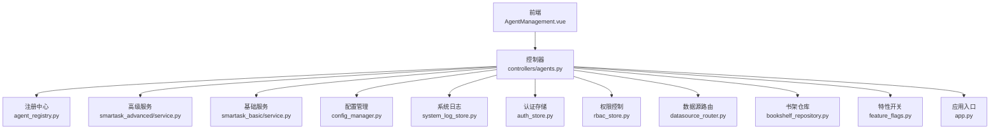
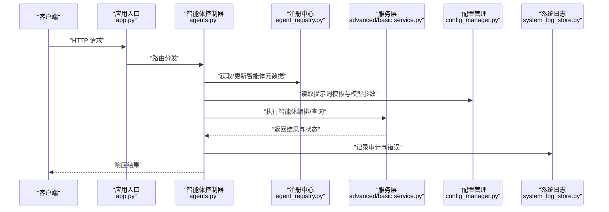
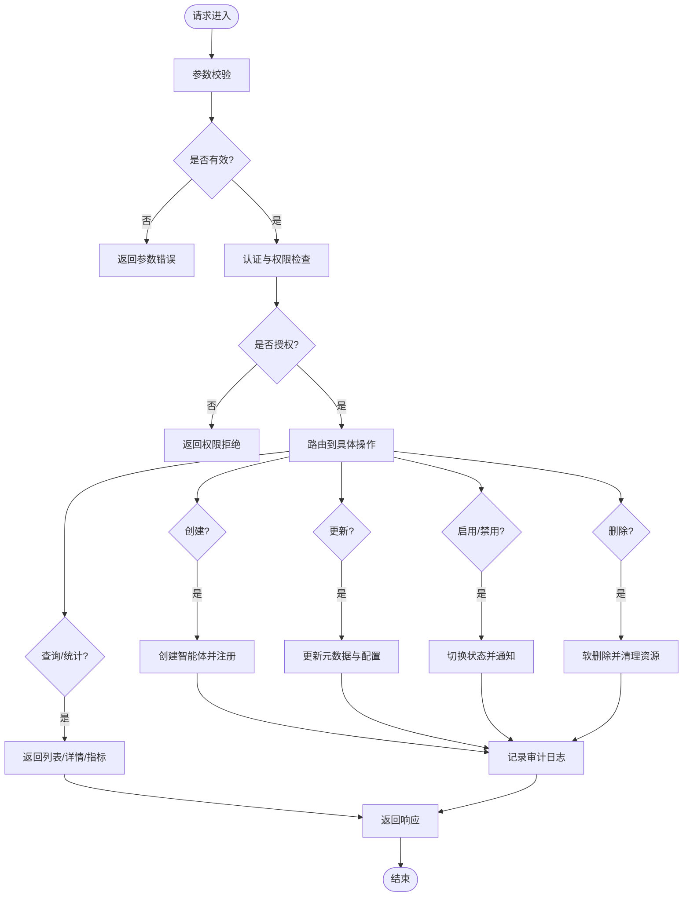
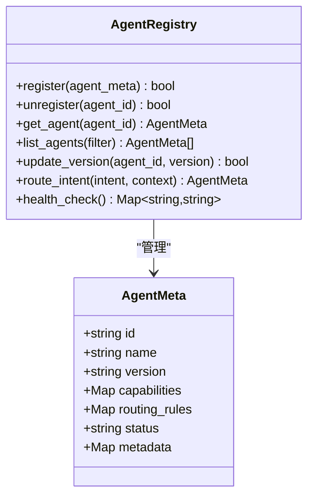
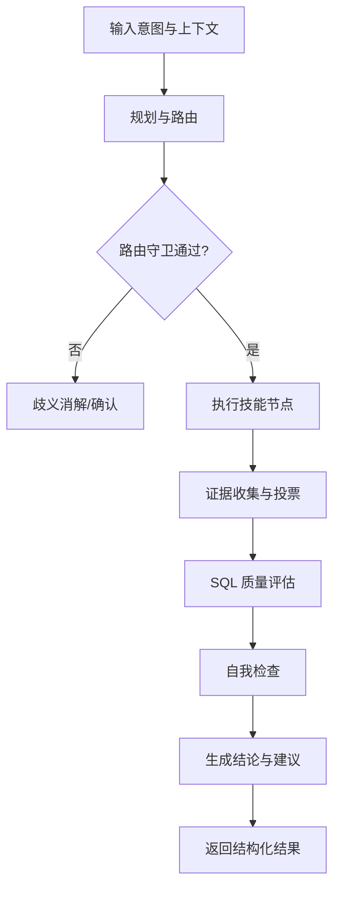
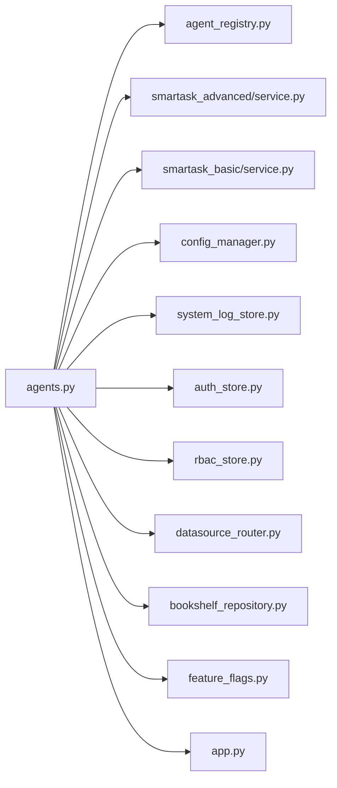

# 智能体管理控制器

<cite>
**本文引用的文件**   
- [backend/controllers/agents.py](file://backend/controllers/agents.py)
- [backend/agent_registry.py](file://backend/agent_registry.py)
- [backend/app.py](file://backend/app.py)
- [backend/smartask_advanced/service.py](file://backend/smartask_advanced/service.py)
- [backend/smartask_basic/service.py](file://backend/smartask_basic/service.py)
- [backend/config_manager.py](file://backend/config_manager.py)
- [backend/system_log_store.py](file://backend/system_log_store.py)
- [backend/feature_flags.py](file://backend/feature_flags.py)
- [backend/auth_store.py](file://backend/auth_store.py)
- [backend/rbac_store.py](file://backend/rbac_store.py)
- [backend/datasource_router.py](file://backend/datasource_router.py)
- [backend/bookshelf_repository.py](file://backend/bookshelf_repository.py)
- [backend/report_contract_health.py](file://backend/report_contract_health.py)
- [backend/runtime_migration.py](file://backend/runtime_migration.py)
- [frontend/src/views/AgentManagement.vue](file://frontend/src/views/AgentManagement.vue)
</cite>

## 目录
1. [简介](#简介)
2. [项目结构](#项目结构)
3. [核心组件](#核心组件)
4. [架构总览](#架构总览)
5. [详细组件分析](#详细组件分析)
6. [依赖关系分析](#依赖关系分析)
7. [性能考虑](#性能考虑)
8. [故障排查指南](#故障排查指南)
9. [结论](#结论)
10. [附录](#附录)

## 简介
本文件为 SmartAsk 平台的“智能体管理控制器”提供系统化、可操作的技术文档。内容覆盖智能体的全生命周期（创建、配置、启用/禁用、删除）、注册与能力声明、路由规则、执行上下文与状态跟踪、结果聚合、编排与组合使用示例，以及性能监控、错误处理与调试工具的使用。同时给出版本管理与灰度发布策略建议，帮助开发者与管理者高效治理智能体资产。

## 项目结构
SmartAsk 后端采用模块化分层设计：
- 控制器层：对外暴露 HTTP API，负责请求校验、权限检查、调用服务层与返回响应。
- 服务层：封装业务逻辑，如高级问数流程、基础问数流程、配置管理、日志记录等。
- 基础设施层：认证、RBAC、数据源路由、运行时迁移、系统日志、特性开关等。
- 前端：管理界面与交互视图，例如 AgentManagement 页面用于可视化管理智能体。

图表来源
- [backend/controllers/agents.py](file://backend/controllers/agents.py)
- [backend/agent_registry.py](file://backend/agent_registry.py)
- [backend/smartask_advanced/service.py](file://backend/smartask_advanced/service.py)
- [backend/smartask_basic/service.py](file://backend/smartask_basic/service.py)
- [backend/config_manager.py](file://backend/config_manager.py)
- [backend/system_log_store.py](file://backend/system_log_store.py)
- [backend/auth_store.py](file://backend/auth_store.py)
- [backend/rbac_store.py](file://backend/rbac_store.py)
- [backend/datasource_router.py](file://backend/datasource_router.py)
- [backend/bookshelf_repository.py](file://backend/bookshelf_repository.py)
- [backend/feature_flags.py](file://backend/feature_flags.py)
- [backend/app.py](file://backend/app.py)

章节来源
- [backend/controllers/agents.py](file://backend/controllers/agents.py)
- [backend/app.py](file://backend/app.py)
- [frontend/src/views/AgentManagement.vue](file://frontend/src/views/AgentManagement.vue)

## 核心组件
- 智能体控制器（agents.py）：提供智能体的 CRUD、启用/禁用、批量操作、查询与统计等接口；协调注册中心、服务层与基础设施。
- 智能体注册中心（agent_registry.py）：维护智能体元数据、能力声明、路由规则与版本信息；支持按名称或能力检索。
- 高级问数服务（smartask_advanced/service.py）：实现复杂编排、多数据集路由、证据投票、SQL 质量评估、模板策略等。
- 基础问数服务（smartask_basic/service.py）：实现基础问答、简单路由与快速回答。
- 配置管理器（config_manager.py）：集中管理提示词模板、模型选择、参数调优与业务规则。
- 系统日志（system_log_store.py）：记录关键事件、错误与审计日志。
- 认证与权限（auth_store.py, rbac_store.py）：用户身份验证与基于角色的访问控制。
- 数据源路由（datasource_router.py）：根据智能体能力与业务规则选择合适的数据源。
- 书架仓库（bookshelf_repository.py）：持久化智能体相关资产（如提示词、模板、报告规范）。
- 特性开关（feature_flags.py）：按环境或租户开启/关闭功能。
- 应用入口（app.py）：挂载控制器路由、初始化依赖、启动服务。

章节来源
- [backend/controllers/agents.py](file://backend/controllers/agents.py)
- [backend/agent_registry.py](file://backend/agent_registry.py)
- [backend/smartask_advanced/service.py](file://backend/smartask_advanced/service.py)
- [backend/smartask_basic/service.py](file://backend/smartask_basic/service.py)
- [backend/config_manager.py](file://backend/config_manager.py)
- [backend/system_log_store.py](file://backend/system_log_store.py)
- [backend/auth_store.py](file://backend/auth_store.py)
- [backend/rbac_store.py](file://backend/rbac_store.py)
- [backend/datasource_router.py](file://backend/datasource_router.py)
- [backend/bookshelf_repository.py](file://backend/bookshelf_repository.py)
- [backend/feature_flags.py](file://backend/feature_flags.py)
- [backend/app.py](file://backend/app.py)

## 架构总览
智能体管理控制器作为统一入口，将外部请求分派到注册中心与服务层，结合配置与权限进行安全访问控制，并通过日志与特性开关实现可观测性与灵活发布。

图表来源
- [backend/app.py](file://backend/app.py)
- [backend/controllers/agents.py](file://backend/controllers/agents.py)
- [backend/agent_registry.py](file://backend/agent_registry.py)
- [backend/smartask_advanced/service.py](file://backend/smartask_advanced/service.py)
- [backend/smartask_basic/service.py](file://backend/smartask_basic/service.py)
- [backend/config_manager.py](file://backend/config_manager.py)
- [backend/system_log_store.py](file://backend/system_log_store.py)

## 详细组件分析

### 智能体控制器（agents.py）
- 职责：定义 RESTful 接口，处理智能体的创建、更新、启用/禁用、删除、查询、批量操作、健康检查与统计。
- 关键点：
  - 请求校验与参数绑定：确保必填字段、类型与范围正确。
  - 权限校验：通过认证与 RBAC 控制访问。
  - 事务性操作：在创建/更新/删除时保证一致性。
  - 异步任务：对耗时操作（如批量导入、健康检查）采用异步队列。
  - 响应标准化：统一成功/失败结构与错误码。

图表来源
- [backend/controllers/agents.py](file://backend/controllers/agents.py)

章节来源
- [backend/controllers/agents.py](file://backend/controllers/agents.py)

### 智能体注册中心（agent_registry.py）
- 职责：维护智能体注册表，包括 ID、名称、版本、能力声明、路由规则、状态、元数据与扩展点。
- 关键点：
  - 能力声明：描述支持的领域、数据源、输出格式与约束。
  - 路由规则：按意图、数据集、组织树或业务规则选择执行路径。
  - 版本管理：支持多版本并存与灰度流量分配。
  - 热更新：在不重启服务的情况下更新注册表。

图表来源
- [backend/agent_registry.py](file://backend/agent_registry.py)

章节来源
- [backend/agent_registry.py](file://backend/agent_registry.py)

### 高级问数服务（smartask_advanced/service.py）
- 职责：实现复杂编排流程，包括多数据集路由、证据投票、SQL 质量评估、模板策略、自我检查与结论建议。
- 关键点：
  - 编排器：将多个技能节点串联，形成 DAG 或流水线。
  - 路由守卫：在分支前进行确认与歧义消解。
  - 模板策略：动态注入提示词与业务规则。
  - 质量评估：对 SQL 与答案进行评分与修正。

图表来源
- [backend/smartask_advanced/service.py](file://backend/smartask_advanced/service.py)

章节来源
- [backend/smartask_advanced/service.py](file://backend/smartask_advanced/service.py)

### 基础问数服务（smartask_basic/service.py）
- 职责：提供轻量级问答能力，适合简单意图与单数据集查询。
- 关键点：
  - 快速路由：基于关键词或简单规则匹配。
  - 模板渲染：替换占位符生成最终提示词。
  - 结果格式化：统一输出结构。

章节来源
- [backend/smartask_basic/service.py](file://backend/smartask_basic/service.py)

### 配置管理器（config_manager.py）
- 职责：集中管理提示词模板、模型选择、参数调优与业务规则。
- 关键点：
  - 模板库：按场景/版本/语言分类。
  - 模型路由：根据负载与成本选择模型。
  - 参数调优：温度、最大长度、TopP 等。
  - 业务规则：阈值、白名单、黑名单与合规约束。

章节来源
- [backend/config_manager.py](file://backend/config_manager.py)

### 系统日志（system_log_store.py）
- 职责：记录审计、错误与性能指标，支持查询与导出。
- 关键点：
  - 分级日志：INFO/WARN/ERROR。
  - 关联追踪：请求 ID、智能体 ID、用户 ID。
  - 采样与归档：高吞吐下的存储优化。

章节来源
- [backend/system_log_store.py](file://backend/system_log_store.py)

### 认证与权限（auth_store.py, rbac_store.py）
- 职责：用户身份验证与基于角色的访问控制。
- 关键点：
  - Token 签发与校验。
  - 角色-权限映射与继承。
  - 细粒度资源访问控制。

章节来源
- [backend/auth_store.py](file://backend/auth_store.py)
- [backend/rbac_store.py](file://backend/rbac_store.py)

### 数据源路由（datasource_router.py）
- 职责：根据智能体能力与业务规则选择数据源。
- 关键点：
  - 数据源发现与健康检查。
  - 负载均衡与故障转移。
  - 权限隔离与租户隔离。

章节来源
- [backend/datasource_router.py](file://backend/datasource_router.py)

### 书架仓库（bookshelf_repository.py）
- 职责：持久化智能体相关资产，如提示词、模板、报告规范。
- 关键点：
  - 版本化存储与回滚。
  - 依赖解析与冲突检测。
  - 批量导入/导出。

章节来源
- [backend/bookshelf_repository.py](file://backend/bookshelf_repository.py)

### 特性开关（feature_flags.py）
- 职责：按环境或租户开启/关闭功能。
- 关键点：
  - 动态开关与灰度发布。
  - 条件表达式与优先级。
  - 审计与回滚。

章节来源
- [backend/feature_flags.py](file://backend/feature_flags.py)

### 应用入口（app.py）
- 职责：挂载控制器路由、初始化依赖、启动服务。
- 关键点：
  - 中间件链：鉴权、限流、日志。
  - 健康端点与就绪探针。
  - 优雅启动与关闭。

章节来源
- [backend/app.py](file://backend/app.py)

### 前端管理界面（AgentManagement.vue）
- 职责：提供可视化界面进行智能体的创建、编辑、启用/禁用、删除与监控。
- 关键点：
  - 表单校验与实时反馈。
  - 列表分页与搜索过滤。
  - 操作审计与状态同步。

章节来源
- [frontend/src/views/AgentManagement.vue](file://frontend/src/views/AgentManagement.vue)

## 依赖关系分析
智能体控制器依赖注册中心、服务层、配置管理、日志、认证与权限、数据源路由、书架仓库与特性开关。这些依赖通过依赖注入或模块导入方式耦合，保持高内聚低耦合。

图表来源
- [backend/controllers/agents.py](file://backend/controllers/agents.py)
- [backend/agent_registry.py](file://backend/agent_registry.py)
- [backend/smartask_advanced/service.py](file://backend/smartask_advanced/service.py)
- [backend/smartask_basic/service.py](file://backend/smartask_basic/service.py)
- [backend/config_manager.py](file://backend/config_manager.py)
- [backend/system_log_store.py](file://backend/system_log_store.py)
- [backend/auth_store.py](file://backend/auth_store.py)
- [backend/rbac_store.py](file://backend/rbac_store.py)
- [backend/datasource_router.py](file://backend/datasource_router.py)
- [backend/bookshelf_repository.py](file://backend/bookshelf_repository.py)
- [backend/feature_flags.py](file://backend/feature_flags.py)
- [backend/app.py](file://backend/app.py)

章节来源
- [backend/controllers/agents.py](file://backend/controllers/agents.py)

## 性能考虑
- 缓存策略：对热点配置与模板进行内存缓存，降低 I/O 压力。
- 异步处理：对耗时操作（批量导入、健康检查）使用消息队列。
- 连接池：数据库与外部服务连接复用。
- 限流与熔断：保护下游服务与避免雪崩。
- 采样与归档：日志与指标采样，定期归档历史数据。
- 水平扩展：无状态控制器与有状态服务分离，便于扩容。

[本节为通用指导，不直接分析具体文件]

## 故障排查指南
- 常见问题定位：
  - 参数错误：检查请求体与校验规则。
  - 权限拒绝：核对用户角色与资源权限。
  - 路由失败：查看注册中心能力声明与路由规则。
  - 数据源异常：检查数据源健康与网络连通性。
  - 模板缺失：确认书架仓库中模板存在且版本匹配。
- 调试工具：
  - 系统日志：按请求 ID 与智能体 ID 过滤。
  - 健康检查：查看各组件状态与延迟。
  - 特性开关：临时关闭可疑功能以隔离问题。
  - 运行时迁移：检查迁移脚本执行状态与回滚点。
  - 合同健康：验证输出契约与兼容性。

章节来源
- [backend/system_log_store.py](file://backend/system_log_store.py)
- [backend/feature_flags.py](file://backend/feature_flags.py)
- [backend/runtime_migration.py](file://backend/runtime_migration.py)
- [backend/report_contract_health.py](file://backend/report_contract_health.py)

## 结论
智能体管理控制器为 SmartAsk 平台提供了统一的智能体治理能力，涵盖生命周期管理、注册与路由、执行编排、配置与权限、可观测性与发布策略。通过模块化设计与清晰的依赖关系，平台具备良好的可扩展性与可维护性。建议在生产环境中强化监控、限流与灰度发布，确保稳定性与可控性。

[本节为总结性内容，不直接分析具体文件]

## 附录
- 智能体生命周期最佳实践：
  - 创建：明确能力声明与路由规则，设置默认模板与模型。
  - 配置：按需调整参数与业务规则，进行沙箱测试。
  - 启用：逐步放量，观察指标与错误率。
  - 禁用：保留历史版本，支持快速回滚。
  - 删除：软删除并清理引用，归档审计日志。
- 编排与组合示例：
  - 多数据集路由：先识别意图，再选择数据集与技能节点。
  - 证据投票：并行查询多个数据源，综合评分后决策。
  - 模板策略：按场景动态注入提示词与约束。
- 版本管理与灰度发布：
  - 多版本并存：按权重分流，逐步扩大新版本流量。
  - A/B 测试：对比不同版本的回答质量与性能。
  - 回滚策略：一键回滚至稳定版本，保障业务连续性。

[本节为概念性内容，不直接分析具体文件]