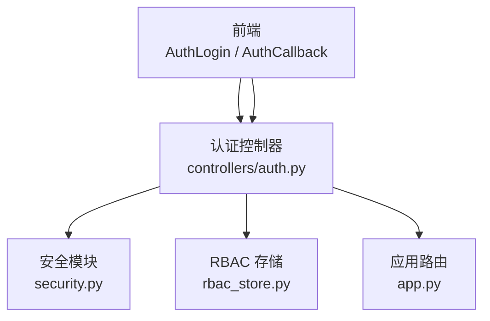
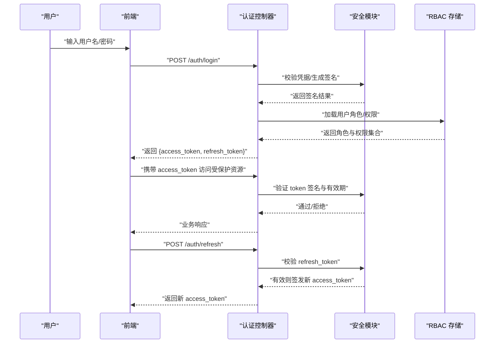
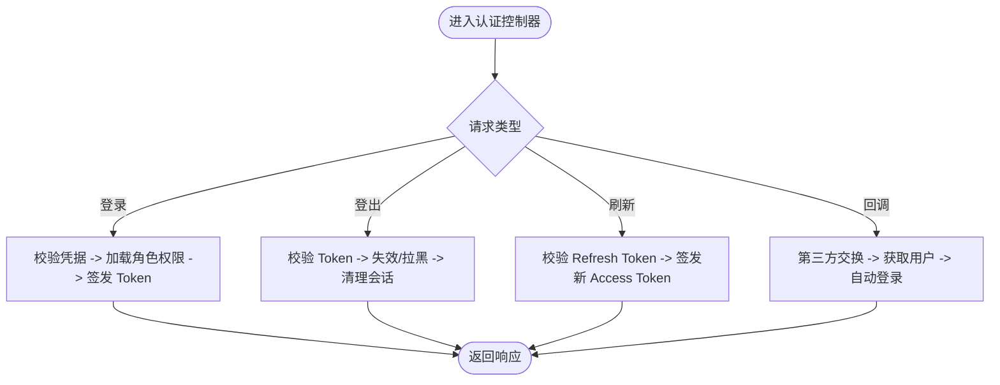
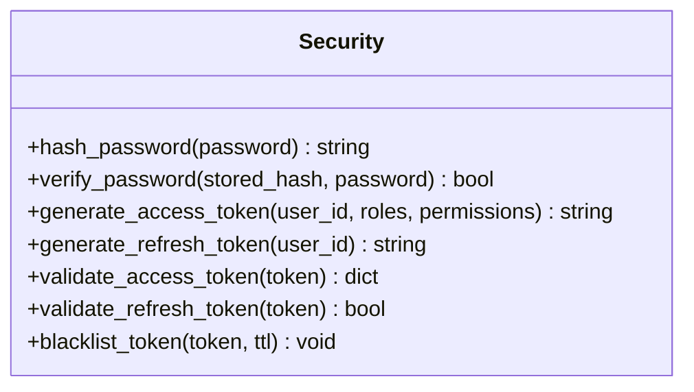
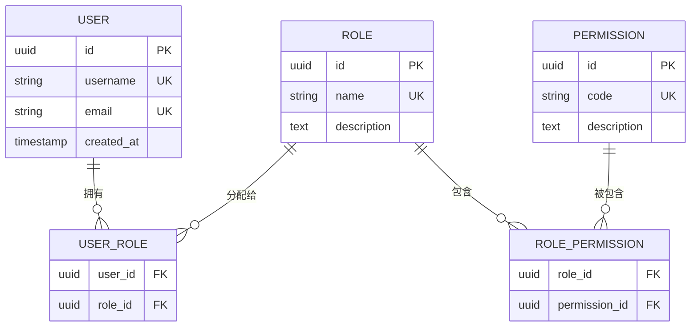
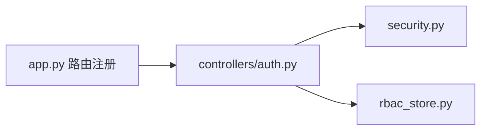
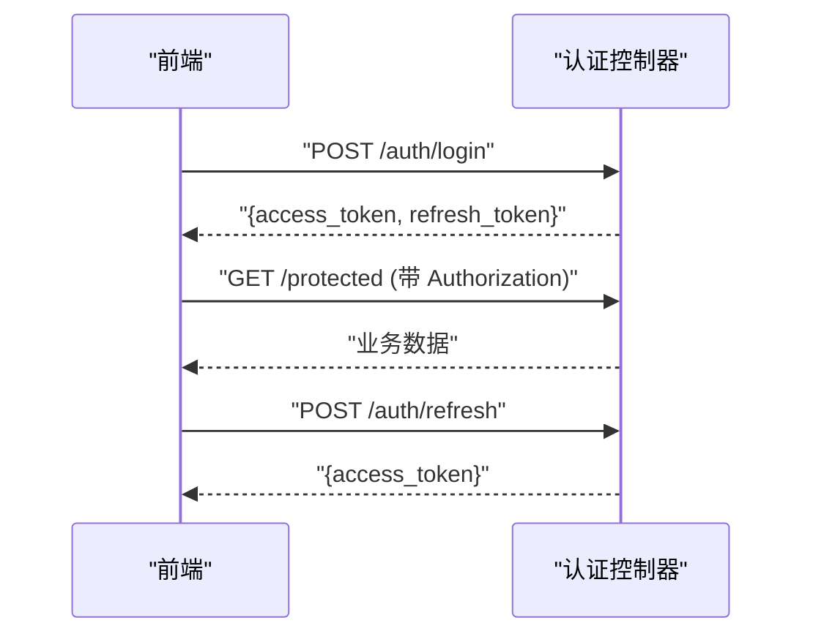
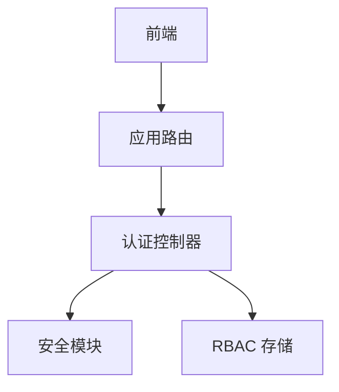

# 认证控制器

<cite>
**本文档引用的文件**   
- [backend/controllers/auth.py](file://backend/controllers/auth.py)
- [backend/rbac_store.py](file://backend/rbac_store.py)
- [backend/security.py](file://backend/security.py)
- [backend/app.py](file://backend/app.py)
- [frontend/src/api/index.js](file://frontend/src/api/index.js)
- [frontend/src/views/AuthCallback.vue](file://frontend/src/views/AuthCallback.vue)
</cite>

## 目录
1. [简介](#简介)
2. [项目结构](#项目结构)
3. [核心组件](#核心组件)
4. [架构总览](#架构总览)
5. [详细组件分析](#详细组件分析)
6. [依赖关系分析](#依赖关系分析)
7. [性能考量](#性能考量)
8. [故障排查指南](#故障排查指南)
9. [结论](#结论)
10. [附录](#附录)

## 简介
本文件面向 SmartAsk 平台的认证控制器，系统性说明用户身份验证流程、JWT Token 的生成/验证/刷新策略、密码加密存储方案、会话管理机制，以及 RBAC 权限模型在认证与授权中的应用。文档同时覆盖所有认证相关 API 端点的请求参数、响应结构与错误码，并提供成功与失败场景的调用示例与安全最佳实践（CSRF/XSS 防护、敏感信息保护）。

## 项目结构
认证相关代码主要位于后端 controllers 层与支撑模块：
- 认证控制器：处理登录、登出、Token 签发与校验、第三方回调等
- RBAC 存储：角色与权限数据访问
- 安全模块：密码哈希、签名密钥、加解密工具
- 应用路由：注册认证相关接口
- 前端：登录页面、API 封装、回调处理

图表来源
- [backend/controllers/auth.py](file://backend/controllers/auth.py)
- [backend/security.py](file://backend/security.py)
- [backend/rbac_store.py](file://backend/rbac_store.py)
- [backend/app.py](file://backend/app.py)
- [frontend/src/api/index.js](file://frontend/src/api/index.js)
- [frontend/src/views/AuthCallback.vue](file://frontend/src/views/AuthCallback.vue)

章节来源
- [backend/controllers/auth.py](file://backend/controllers/auth.py)
- [backend/security.py](file://backend/security.py)
- [backend/rbac_store.py](file://backend/rbac_store.py)
- [backend/app.py](file://backend/app.py)
- [frontend/src/api/index.js](file://frontend/src/api/index.js)
- [frontend/src/views/AuthCallback.vue](file://frontend/src/views/AuthCallback.vue)

## 核心组件
- 认证控制器：提供登录、登出、Token 刷新、第三方回调、权限检查等能力
- 安全模块：负责密码哈希、JWT 签名与验签、随机令牌生成、时间戳与过期控制
- RBAC 存储：提供角色、权限、用户-角色映射的查询与缓存
- 应用路由：将 HTTP 端点绑定到控制器方法，并统一错误处理与鉴权中间件

章节来源
- [backend/controllers/auth.py](file://backend/controllers/auth.py)
- [backend/security.py](file://backend/security.py)
- [backend/rbac_store.py](file://backend/rbac_store.py)
- [backend/app.py](file://backend/app.py)

## 架构总览
认证流程采用“无状态 JWT + 可选短期会话”的组合模式：
- 登录成功后签发 Access Token（短效）与 Refresh Token（长效）
- 后续请求携带 Access Token，服务端验签通过后放行
- 使用 Refresh Token 换取新的 Access Token，避免频繁登录
- 登出时销毁或加入黑名单（若实现），并清理本地存储

图表来源
- [backend/controllers/auth.py](file://backend/controllers/auth.py)
- [backend/security.py](file://backend/security.py)
- [backend/rbac_store.py](file://backend/rbac_store.py)

## 详细组件分析

### 认证控制器（登录、登出、Token 管理）
- 登录
  - 输入：用户名、密码（或第三方授权码）
  - 处理：校验凭据、加载用户信息、计算角色与权限、签发 Access/Refresh Token
  - 输出：包含 Token 与必要用户信息的响应体
- 登出
  - 输入：当前有效 Token 或 Refresh Token
  - 处理：根据策略加入黑名单或失效化、清理本地会话
  - 输出：成功/失败状态
- Token 刷新
  - 输入：有效的 Refresh Token
  - 处理：校验有效性、签发新的 Access Token
  - 输出：新的 Access Token
- 第三方回调
  - 输入：第三方平台回调参数（如 code/state）
  - 处理：交换令牌、获取用户信息、自动登录或注册
  - 输出：标准登录响应

图表来源
- [backend/controllers/auth.py](file://backend/controllers/auth.py)

章节来源
- [backend/controllers/auth.py](file://backend/controllers/auth.py)

### 安全模块（密码加密、JWT 签名、令牌管理）
- 密码加密
  - 使用强哈希算法（如 bcrypt/scrypt）进行单向加密存储
  - 每次密码更新重新哈希，避免弱哈希与明文存储
- JWT 签发与验证
  - Access Token：短时效，用于快速鉴权
  - Refresh Token：长时效，仅用于刷新 Access Token
  - 签名密钥集中管理，支持轮换与版本兼容
- 令牌管理
  - 支持黑名单机制（可选）以支持即时登出
  - 防重放：结合时间戳与一次性标记（可选）

图表来源
- [backend/security.py](file://backend/security.py)

章节来源
- [backend/security.py](file://backend/security.py)

### RBAC 存储（角色与权限）
- 数据模型
  - 角色：定义一组权限集合
  - 权限：细粒度操作标识（如 resource:action）
  - 用户-角色：多对多映射，支持继承与组织范围
- 查询与缓存
  - 提供按用户、角色、组织的权限聚合查询
  - 热点数据缓存以减少数据库压力

图表来源
- [backend/rbac_store.py](file://backend/rbac_store.py)

章节来源
- [backend/rbac_store.py](file://backend/rbac_store.py)

### 应用路由（认证端点注册）
- 路由注册
  - 将认证控制器方法与 HTTP 路径绑定
  - 统一错误处理与鉴权中间件注入
- 中间件
  - 全局鉴权：校验 Access Token
  - 权限检查：基于 RBAC 的细粒度授权

图表来源
- [backend/app.py](file://backend/app.py)
- [backend/controllers/auth.py](file://backend/controllers/auth.py)
- [backend/security.py](file://backend/security.py)
- [backend/rbac_store.py](file://backend/rbac_store.py)

章节来源
- [backend/app.py](file://backend/app.py)

### 前端集成（登录、回调、Token 管理）
- 登录页
  - 提交用户名/密码至 /auth/login
  - 保存 access_token 与 refresh_token（建议 HttpOnly Cookie 或内存存储）
- 回调页
  - 处理第三方回调参数，完成自动登录
- API 封装
  - 统一拦截器：附加 Authorization 头、处理 401/403、自动刷新 Token

图表来源
- [frontend/src/api/index.js](file://frontend/src/api/index.js)
- [frontend/src/views/AuthCallback.vue](file://frontend/src/views/AuthCallback.vue)
- [backend/controllers/auth.py](file://backend/controllers/auth.py)

章节来源
- [frontend/src/api/index.js](file://frontend/src/api/index.js)
- [frontend/src/views/AuthCallback.vue](file://frontend/src/views/AuthCallback.vue)

## 依赖关系分析
- 控制器依赖安全模块进行密码校验与 Token 签发
- 控制器依赖 RBAC 存储进行角色与权限解析
- 路由层统一挂载控制器方法，并注入鉴权中间件
- 前端通过 API 封装与回调页面完成认证交互

图表来源
- [backend/controllers/auth.py](file://backend/controllers/auth.py)
- [backend/security.py](file://backend/security.py)
- [backend/rbac_store.py](file://backend/rbac_store.py)
- [backend/app.py](file://backend/app.py)
- [frontend/src/api/index.js](file://frontend/src/api/index.js)

章节来源
- [backend/controllers/auth.py](file://backend/controllers/auth.py)
- [backend/security.py](file://backend/security.py)
- [backend/rbac_store.py](file://backend/rbac_store.py)
- [backend/app.py](file://backend/app.py)
- [frontend/src/api/index.js](file://frontend/src/api/index.js)

## 性能考量
- Token 校验尽量无状态，避免每次请求查库；必要时引入本地缓存
- 密码哈希选择合适强度，平衡安全性与性能
- 刷新 Token 限流与并发控制，防止滥用
- 权限查询结果缓存，减少重复计算

[本节为通用指导，不直接分析具体文件]

## 故障排查指南
- 登录失败
  - 检查凭据格式与大小写
  - 确认用户是否存在且未被锁定
  - 查看日志中的哈希校验与 RBAC 加载错误
- Token 无效
  - 确认 Access Token 是否过期
  - 检查 Refresh Token 是否被吊销或过期
  - 核对签名密钥配置是否正确
- 权限不足
  - 确认用户角色与权限映射
  - 检查组织范围与继承规则
  - 查看权限代码是否与接口要求一致

章节来源
- [backend/controllers/auth.py](file://backend/controllers/auth.py)
- [backend/security.py](file://backend/security.py)
- [backend/rbac_store.py](file://backend/rbac_store.py)

## 结论
SmartAsk 认证体系以 JWT 为核心，结合 RBAC 权限模型与安全的密码存储方案，提供稳定、可扩展的身份验证与授权能力。通过短效 Access Token 与长效 Refresh Token 的组合，既保证安全性又提升用户体验。配合前端拦截器与统一错误处理，形成完整的认证闭环。

[本节为总结性内容，不直接分析具体文件]

## 附录

### 认证相关 API 端点规范
- 登录
  - 方法：POST
  - 路径：/auth/login
  - 请求体：用户名、密码（或第三方授权码）
  - 响应：access_token、refresh_token、用户基本信息
  - 错误码：400（参数缺失）、401（凭据错误）、500（服务器错误）
- 登出
  - 方法：POST
  - 路径：/auth/logout
  - 请求头：Authorization（Bearer access_token）
  - 响应：成功/失败状态
  - 错误码：401（Token 无效）、500（服务器错误）
- 刷新 Token
  - 方法：POST
  - 路径：/auth/refresh
  - 请求体：refresh_token
  - 响应：新的 access_token
  - 错误码：400（参数缺失）、401（刷新令牌无效）、500（服务器错误）
- 第三方回调
  - 方法：GET/POST
  - 路径：/auth/callback
  - 请求参数：code、state（由第三方平台返回）
  - 响应：标准登录响应
  - 错误码：400（参数缺失）、401（回调失败）、500（服务器错误）

章节来源
- [backend/controllers/auth.py](file://backend/controllers/auth.py)
- [backend/app.py](file://backend/app.py)

### 调用示例（成功与失败场景）
- 登录成功
  - 请求：POST /auth/login，包含用户名与密码
  - 响应：返回 access_token 与 refresh_token
  - 后续：在 Authorization 头中携带 access_token 访问受保护资源
- 登录失败
  - 请求：POST /auth/login，包含错误凭据
  - 响应：返回 401 与错误描述
- 刷新 Token
  - 请求：POST /auth/refresh，包含有效 refresh_token
  - 响应：返回新的 access_token
- 刷新失败
  - 请求：POST /auth/refresh，包含过期或无效的 refresh_token
  - 响应：返回 401 与错误描述

章节来源
- [backend/controllers/auth.py](file://backend/controllers/auth.py)
- [frontend/src/api/index.js](file://frontend/src/api/index.js)

### 安全最佳实践
- CSRF 防护
  - 使用 SameSite Cookie 与 CSRF Token 双重保护
  - 跨域请求严格校验 Origin 与 Referer
- XSS 防护
  - 对所有用户输入进行转义与白名单过滤
  - 设置 Content-Security-Policy 限制脚本执行
- 敏感信息保护
  - 不在日志中打印密码、Token 与用户隐私
  - 传输层强制 HTTPS，禁用不安全协议
  - 最小权限原则：按需授予角色与权限

[本节为通用指导，不直接分析具体文件]