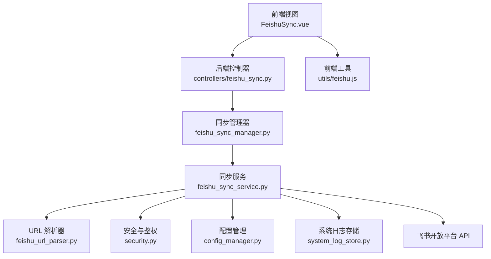
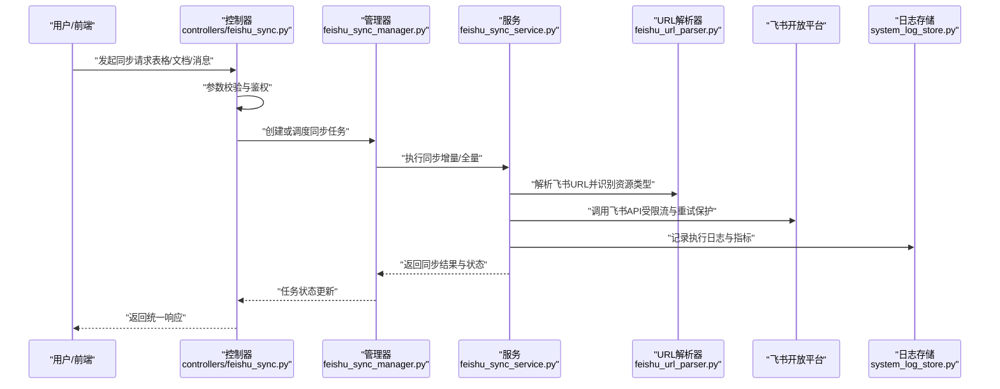
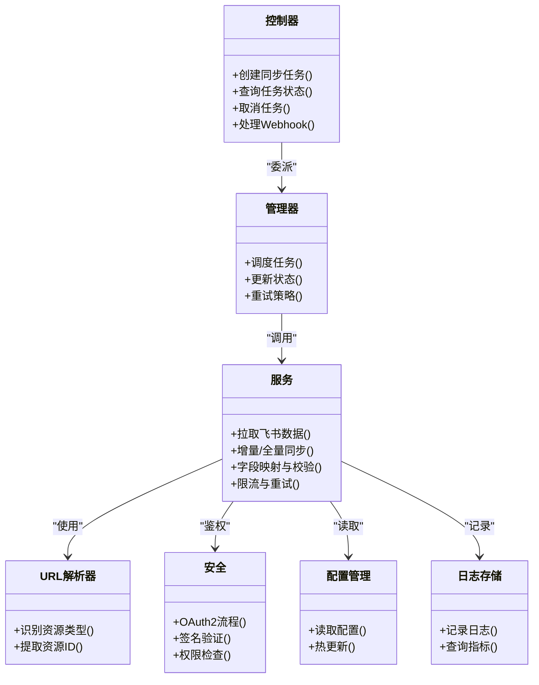
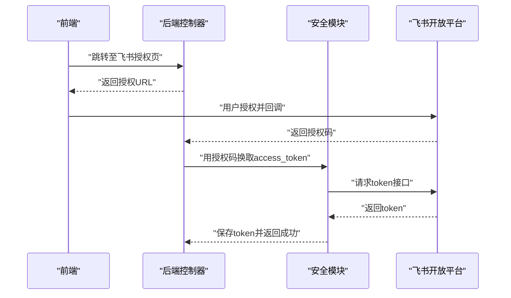
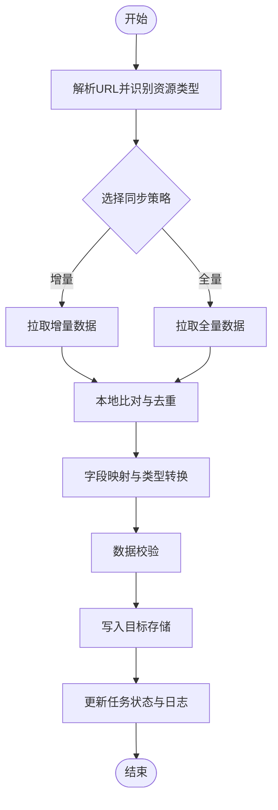

# 飞书同步控制器

<cite>
**本文引用的文件**   
- [controllers/feishu_sync.py](file://backend/controllers/feishu_sync.py)
- [feishu_sync_manager.py](file://backend/feishu_sync_manager.py)
- [feishu_sync_service.py](file://backend/feishu_sync_service.py)
- [feishu_url_parser.py](file://backend/feishu_url_parser.py)
- [start_feishu_sync.py](file://backend/start_feishu_sync.py)
- [app.py](file://backend/app.py)
- [config_manager.py](file://backend/config_manager.py)
- [security.py](file://backend/security.py)
- [system_log_store.py](file://backend/system_log_store.py)
- [frontend/src/views/FeishuSync.vue](file://frontend/src/views/FeishuSync.vue)
- [frontend/src/utils/feishu.js](file://frontend/src/utils/feishu.js)
</cite>

## 目录
1. [简介](#简介)
2. [项目结构](#项目结构)
3. [核心组件](#核心组件)
4. [架构总览](#架构总览)
5. [详细组件分析](#详细组件分析)
6. [依赖关系分析](#依赖关系分析)
7. [性能考量](#性能考量)
8. [故障排查指南](#故障排查指南)
9. [结论](#结论)
10. [附录](#附录)

## 简介
本文件为 SmartAsk 平台的“飞书同步控制器”提供全面文档，覆盖以下关键主题：
- 飞书 OAuth2 认证流程、API 限流与错误重试机制
- 数据同步策略：增量同步、全量同步与冲突解决算法
- 飞书表格、文档与消息的同步接口（字段映射、格式转换、数据校验）
- 同步任务配置管理（触发条件、过滤规则、异常处理）
- 飞书 Webhook 事件的消息格式与签名验证
- 同步状态监控、日志记录与故障排查
- 飞书权限模型与访问控制实现

## 项目结构
后端围绕飞书同步能力提供了控制器、服务层、管理器、URL 解析器以及启动脚本；前端提供可视化配置与操作入口。

图表来源
- [controllers/feishu_sync.py](file://backend/controllers/feishu_sync.py)
- [feishu_sync_manager.py](file://backend/feishu_sync_manager.py)
- [feishu_sync_service.py](file://backend/feishu_sync_service.py)
- [feishu_url_parser.py](file://backend/feishu_url_parser.py)
- [security.py](file://backend/security.py)
- [config_manager.py](file://backend/config_manager.py)
- [system_log_store.py](file://backend/system_log_store.py)
- [frontend/src/views/FeishuSync.vue](file://frontend/src/views/FeishuSync.vue)
- [frontend/src/utils/feishu.js](file://frontend/src/utils/feishu.js)

章节来源
- [controllers/feishu_sync.py](file://backend/controllers/feishu_sync.py)
- [feishu_sync_manager.py](file://backend/feishu_sync_manager.py)
- [feishu_sync_service.py](file://backend/feishu_sync_service.py)
- [feishu_url_parser.py](file://backend/feishu_url_parser.py)
- [start_feishu_sync.py](file://backend/start_feishu_sync.py)
- [app.py](file://backend/app.py)
- [config_manager.py](file://backend/config_manager.py)
- [security.py](file://backend/security.py)
- [system_log_store.py](file://backend/system_log_store.py)
- [frontend/src/views/FeishuSync.vue](file://frontend/src/views/FeishuSync.vue)
- [frontend/src/utils/feishu.js](file://frontend/src/utils/feishu.js)

## 核心组件
- 控制器（Controller）
  - 暴露 HTTP 路由，负责请求参数校验、鉴权、调用服务层并返回统一响应。
- 同步管理器（Manager）
  - 编排同步任务生命周期：调度、状态跟踪、并发控制、失败重试与告警。
- 同步服务（Service）
  - 封装飞书 API 调用、OAuth2 令牌管理、限流与重试、增量/全量同步逻辑、字段映射与数据校验。
- URL 解析器（URL Parser）
  - 解析飞书表格、文档、消息等链接，提取资源类型与标识，用于路由到对应同步处理器。
- 配置管理（Config Manager）
  - 集中管理飞书应用凭证、同步策略、过滤规则、Webhook 配置与开关。
- 安全与鉴权（Security）
  - 实现 OAuth2 授权码流程、Token 刷新、签名校验与权限检查。
- 日志与监控（System Log Store）
  - 记录同步任务执行轨迹、错误堆栈、性能指标与审计信息。
- 前端集成（Frontend）
  - 提供飞书同步配置、任务触发、状态查看与结果导出界面。

章节来源
- [controllers/feishu_sync.py](file://backend/controllers/feishu_sync.py)
- [feishu_sync_manager.py](file://backend/feishu_sync_manager.py)
- [feishu_sync_service.py](file://backend/feishu_sync_service.py)
- [feishu_url_parser.py](file://backend/feishu_url_parser.py)
- [config_manager.py](file://backend/config_manager.py)
- [security.py](file://backend/security.py)
- [system_log_store.py](file://backend/system_log_store.py)
- [frontend/src/views/FeishuSync.vue](file://frontend/src/views/FeishuSync.vue)
- [frontend/src/utils/feishu.js](file://frontend/src/utils/feishu.js)

## 架构总览
整体采用分层架构：控制器接收请求并委派给管理器与服务层；服务层负责与飞书开放平台交互；配置与安全贯穿各层；日志与监控保障可观测性。

图表来源
- [controllers/feishu_sync.py](file://backend/controllers/feishu_sync.py)
- [feishu_sync_manager.py](file://backend/feishu_sync_manager.py)
- [feishu_sync_service.py](file://backend/feishu_sync_service.py)
- [feishu_url_parser.py](file://backend/feishu_url_parser.py)
- [system_log_store.py](file://backend/system_log_store.py)

## 详细组件分析

### 控制器：controllers/feishu_sync.py
职责
- 定义 RESTful 路由：同步任务创建、查询、取消、批量操作、Webhook 回调等。
- 统一入参校验、鉴权拦截、错误包装与响应格式化。
- 将业务委托给管理器与服务层，保持薄控制器原则。

关键流程
- 同步任务创建：校验请求体 -> 鉴权 -> 调用管理器创建任务 -> 返回任务ID与初始状态。
- Webhook 回调：接收事件 -> 签名验证 -> 解析事件 -> 触发相应同步动作 -> 记录日志。

章节来源
- [controllers/feishu_sync.py](file://backend/controllers/feishu_sync.py)

### 管理器：feishu_sync_manager.py
职责
- 任务编排：根据配置决定增量/全量同步、并发度、批大小、重试策略。
- 状态机：维护任务状态（待执行、运行中、成功、失败、部分成功），持久化进度。
- 异常处理：捕获超时、网络错误、API 限流，进行退避重试与降级。

关键流程
- 调度器轮询或事件驱动触发 -> 加载配置与上下文 -> 分片执行 -> 汇总结果 -> 更新状态与日志。

章节来源
- [feishu_sync_manager.py](file://backend/feishu_sync_manager.py)

### 服务层：feishu_sync_service.py
职责
- 飞书 API 客户端：封装表格、文档、消息等资源的增删改查与分页拉取。
- OAuth2 管理：获取授权码、换取 access_token、自动刷新与过期处理。
- 限流与重试：基于速率限制计数器与指数退避策略，避免触发飞书 API 限流。
- 数据同步：增量对比（时间戳/版本号）、全量覆盖、冲突检测与合并策略。
- 字段映射与校验：将飞书字段映射到内部模型，进行类型转换与约束校验。

关键流程
- 解析 URL -> 选择处理器（表格/文档/消息）-> 拉取数据 -> 本地比对与转换 -> 写入目标存储 -> 记录差异与结果。

章节来源
- [feishu_sync_service.py](file://backend/feishu_sync_service.py)

### URL 解析器：feishu_url_parser.py
职责
- 识别飞书链接类型：表格、多维表格、文档、知识库、消息等。
- 提取资源 ID、工作空间、权限范围等元数据。
- 为后续处理器提供标准化输入。

章节来源
- [feishu_url_parser.py](file://backend/feishu_url_parser.py)

### 启动脚本：start_feishu_sync.py
职责
- 初始化配置、日志、数据库连接与定时任务。
- 启动后台同步进程或 Worker，监听队列或事件源。

章节来源
- [start_feishu_sync.py](file://backend/start_feishu_sync.py)

### 路由注册：app.py
职责
- 挂载控制器路由，统一中间件（鉴权、限流、日志）。
- 提供健康检查与调试端点。

章节来源
- [app.py](file://backend/app.py)

### 配置管理：config_manager.py
职责
- 读取并缓存飞书应用凭证、同步策略、过滤规则、Webhook 密钥。
- 支持热更新与环境变量注入。

章节来源
- [config_manager.py](file://backend/config_manager.py)

### 安全与鉴权：security.py
职责
- 实现 OAuth2 授权码流程、Token 存储与刷新。
- Webhook 签名验证（HMAC/SHA256）与防重放。
- 细粒度权限检查（按组织、工作空间、资源类型）。

章节来源
- [security.py](file://backend/security.py)

### 日志与监控：system_log_store.py
职责
- 记录任务执行轨迹、错误堆栈、耗时与吞吐指标。
- 提供查询与导出能力，支撑排障与审计。

章节来源
- [system_log_store.py](file://backend/system_log_store.py)

### 前端集成：FeishuSync.vue 与 utils/feishu.js
职责
- FeishuSync.vue：展示同步任务列表、创建/编辑配置、查看执行状态与结果。
- utils/feishu.js：封装前端对飞书相关接口的调用与错误提示。

章节来源
- [frontend/src/views/FeishuSync.vue](file://frontend/src/views/FeishuSync.vue)
- [frontend/src/utils/feishu.js](file://frontend/src/utils/feishu.js)

## 依赖关系分析
组件间依赖清晰，控制器依赖管理器，管理器依赖服务层，服务层依赖 URL 解析器、安全模块、配置管理与日志存储。

图表来源
- [controllers/feishu_sync.py](file://backend/controllers/feishu_sync.py)
- [feishu_sync_manager.py](file://backend/feishu_sync_manager.py)
- [feishu_sync_service.py](file://backend/feishu_sync_service.py)
- [feishu_url_parser.py](file://backend/feishu_url_parser.py)
- [security.py](file://backend/security.py)
- [config_manager.py](file://backend/config_manager.py)
- [system_log_store.py](file://backend/system_log_store.py)

章节来源
- [controllers/feishu_sync.py](file://backend/controllers/feishu_sync.py)
- [feishu_sync_manager.py](file://backend/feishu_sync_manager.py)
- [feishu_sync_service.py](file://backend/feishu_sync_service.py)
- [feishu_url_parser.py](file://backend/feishu_url_parser.py)
- [security.py](file://backend/security.py)
- [config_manager.py](file://backend/config_manager.py)
- [system_log_store.py](file://backend/system_log_store.py)

## 性能考量
- 限流与重试
  - 基于飞书 API 速率限制动态调整并发与退避间隔，避免触发 429。
  - 指数退避 + 抖动策略，降低雪崩风险。
- 增量同步
  - 通过时间戳或版本字段减少拉取量，提升吞吐。
- 批处理与分页
  - 大表分批拉取与写入，控制内存占用与事务大小。
- 缓存与去重
  - 本地缓存最近变更集，避免重复处理。
- 异步与队列
  - 任务拆分与并行执行，提高整体吞吐量。

[本节为通用指导，不直接分析具体文件]

## 故障排查指南
常见问题与定位步骤
- 认证失败
  - 检查 OAuth2 配置（App ID/Secret）、回调地址与权限范围。
  - 确认 Token 未过期且已正确刷新。
- 限流触发
  - 观察 429 错误频率，调整并发与退避策略。
  - 检查是否同时存在多个同步任务竞争资源。
- 数据不一致
  - 核对增量字段（更新时间/版本号）是否正确。
  - 检查字段映射与类型转换规则。
- Webhook 未触发
  - 验证签名密钥与事件订阅配置。
  - 检查回调地址可达性与防火墙策略。
- 日志与监控
  - 在系统日志中搜索任务 ID 与错误堆栈。
  - 关注耗时与失败率指标，定位瓶颈。

章节来源
- [security.py](file://backend/security.py)
- [system_log_store.py](file://backend/system_log_store.py)
- [controllers/feishu_sync.py](file://backend/controllers/feishu_sync.py)

## 结论
SmartAsk 的飞书同步控制器通过清晰的层次化设计与完善的错误处理、限流重试、增量同步与权限控制，实现了稳定高效的飞书数据集成。前端提供直观的配置与监控界面，便于运维与使用。建议在生产环境启用详细的日志与指标采集，持续优化限流与并发策略，确保高可用与一致性。

[本节为总结性内容，不直接分析具体文件]

## 附录

### OAuth2 认证流程（序列图）

图表来源
- [controllers/feishu_sync.py](file://backend/controllers/feishu_sync.py)
- [security.py](file://backend/security.py)

### 数据同步策略（流程图）

图表来源
- [feishu_sync_service.py](file://backend/feishu_sync_service.py)
- [feishu_url_parser.py](file://backend/feishu_url_parser.py)

### 字段映射与校验要点
- 飞书字段到内部模型的映射规则需明确类型、必填项与默认值。
- 校验包括格式、长度、枚举值与关联完整性。
- 转换失败应记录详细错误并回滚或跳过该条记录。

[本节为通用指导，不直接分析具体文件]

### Webhook 事件处理与签名验证
- 事件格式遵循飞书开放平台规范，包含事件类型、时间戳、签名与数据体。
- 服务端需验证签名（HMAC/SHA256）与时间戳防重放。
- 根据事件类型触发相应同步动作（如文档更新、消息转发）。

章节来源
- [security.py](file://backend/security.py)
- [controllers/feishu_sync.py](file://backend/controllers/feishu_sync.py)

### 同步任务配置管理
- 触发条件：定时、事件驱动、手动触发。
- 过滤规则：按组织、工作空间、资源类型、标签或关键字过滤。
- 异常处理：重试次数、退避策略、失败告警与降级路径。

章节来源
- [config_manager.py](file://backend/config_manager.py)
- [feishu_sync_manager.py](file://backend/feishu_sync_manager.py)

### 飞书权限模型与访问控制
- 基于应用权限与工作空间权限控制资源访问。
- 控制器层进行细粒度权限检查，确保仅允许授权用户/角色操作。
- 支持按组织隔离与数据行级权限。

章节来源
- [security.py](file://backend/security.py)
- [controllers/feishu_sync.py](file://backend/controllers/feishu_sync.py)