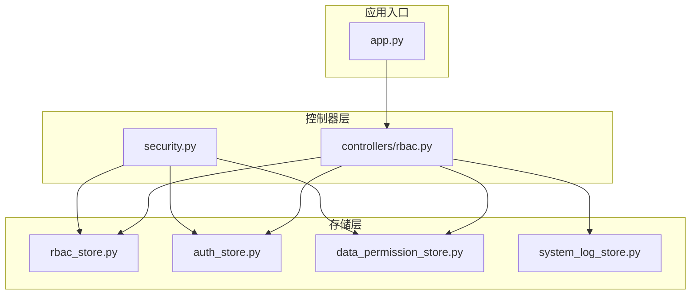
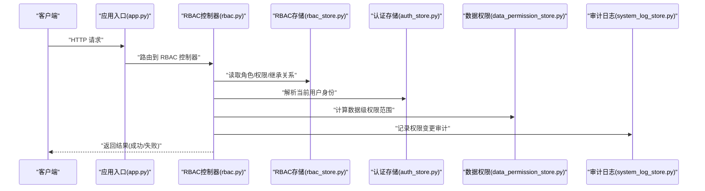
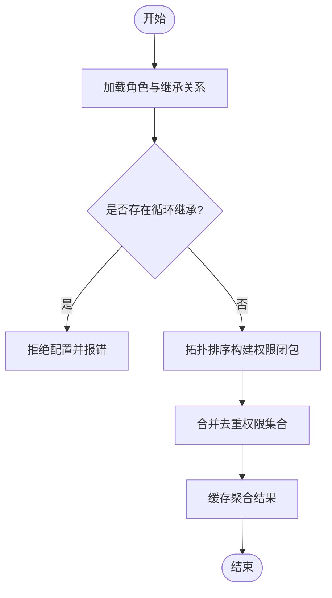
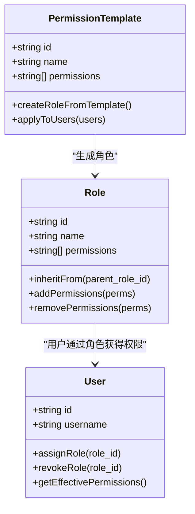
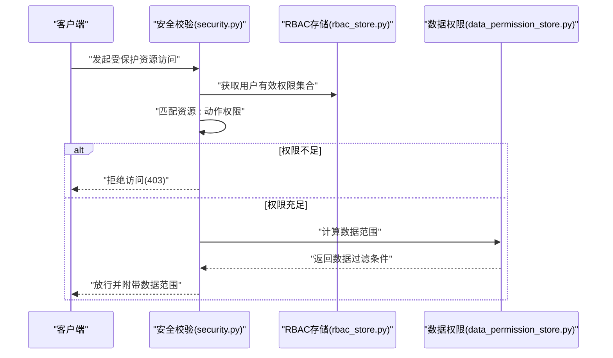
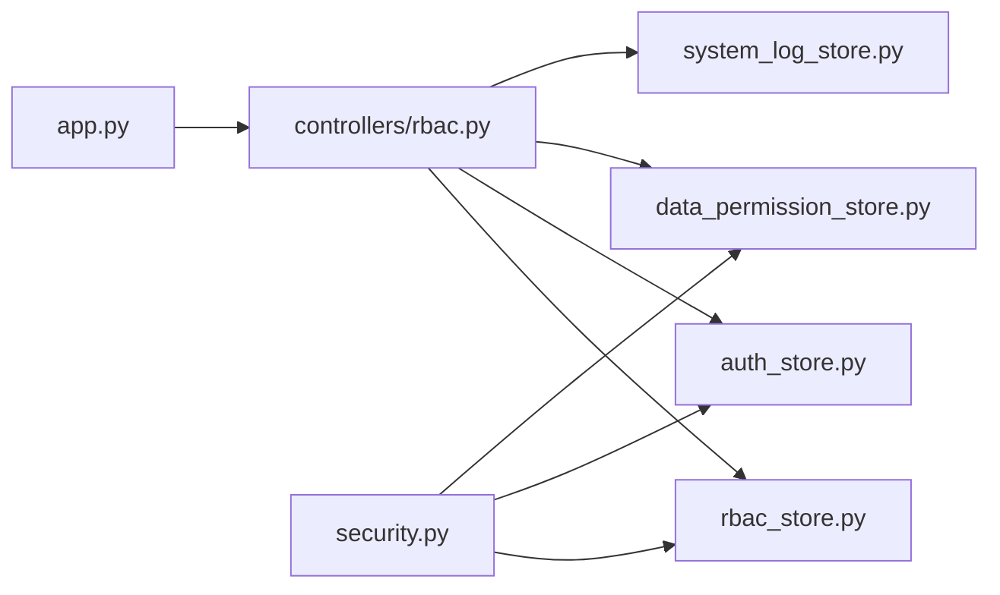

# RBAC 存储

<cite>
**本文引用的文件**   
- [rbac_store.py](file://backend/rbac_store.py)
- [controllers/rbac.py](file://backend/controllers/rbac.py)
- [security.py](file://backend/security.py)
- [auth_store.py](file://backend/auth_store.py)
- [data_permission_store.py](file://backend/data_permission_store.py)
- [system_log_store.py](file://backend/system_log_store.py)
- [app.py](file://backend/app.py)
</cite>

## 目录
1. [简介](#简介)
2. [项目结构](#项目结构)
3. [核心组件](#核心组件)
4. [架构总览](#架构总览)
5. [详细组件分析](#详细组件分析)
6. [依赖关系分析](#依赖关系分析)
7. [性能考虑](#性能考虑)
8. [故障排查指南](#故障排查指南)
9. [结论](#结论)
10. [附录：配置与示例](#附录配置与示例)

## 简介
本文件面向 SmartAsk 智能问数平台的 RBAC（基于角色的访问控制）存储模块，系统化阐述角色-权限-用户三元关系模型的设计与实现，覆盖角色继承、权限聚合算法、权限验证流程、权限模板系统、批量操作与审计、缓存策略、并发控制以及冲突检测与解决策略。文档同时提供可操作的配置示例与最佳实践，帮助开发者快速落地与维护 RBAC 能力。

## 项目结构
RBAC 相关代码主要分布在后端目录中，围绕“存储层 + 控制器层 + 安全校验”三层展开：
- 存储层：负责角色、权限、用户、数据级权限、审计日志等持久化与查询。
- 控制器层：暴露管理接口，处理角色创建/更新、权限分配、用户角色绑定、批量操作等。
- 安全校验：在请求链路中进行权限检查与鉴权。

图表来源
- [controllers/rbac.py](file://backend/controllers/rbac.py)
- [rbac_store.py](file://backend/rbac_store.py)
- [security.py](file://backend/security.py)
- [auth_store.py](file://backend/auth_store.py)
- [data_permission_store.py](file://backend/data_permission_store.py)
- [system_log_store.py](file://backend/system_log_store.py)
- [app.py](file://backend/app.py)

章节来源
- [controllers/rbac.py](file://backend/controllers/rbac.py)
- [rbac_store.py](file://backend/rbac_store.py)
- [security.py](file://backend/security.py)
- [auth_store.py](file://backend/auth_store.py)
- [data_permission_store.py](file://backend/data_permission_store.py)
- [system_log_store.py](file://backend/system_log_store.py)
- [app.py](file://backend/app.py)

## 核心组件
- 角色-权限-用户三元模型
  - 角色：一组权限的集合，支持继承形成层级或组合关系。
  - 权限：细粒度的操作标识（如资源:动作），可聚合为更高层级的权限点。
  - 用户：通过直接授权或角色继承获得权限。
- 权限模板系统
  - 预定义常用权限集合作为模板，便于快速复制与批量下发。
- 数据级权限
  - 在功能权限之外，对数据范围进行限制（如组织、数据集维度）。
- 审计与日志
  - 记录角色与权限变更、用户角色分配等关键事件。

章节来源
- [rbac_store.py](file://backend/rbac_store.py)
- [data_permission_store.py](file://backend/data_permission_store.py)
- [system_log_store.py](file://backend/system_log_store.py)

## 架构总览
RBAC 存储模块采用“控制器-存储”分层设计，控制器负责业务编排与参数校验，存储层封装数据访问与一致性约束。安全校验模块在请求进入时调用存储层完成权限判定。

图表来源
- [app.py](file://backend/app.py)
- [controllers/rbac.py](file://backend/controllers/rbac.py)
- [rbac_store.py](file://backend/rbac_store.py)
- [auth_store.py](file://backend/auth_store.py)
- [data_permission_store.py](file://backend/data_permission_store.py)
- [system_log_store.py](file://backend/system_log_store.py)

## 详细组件分析

### 角色-权限-用户三元模型与继承机制
- 模型要点
  - 角色包含多个权限点；权限点可被多个角色引用。
  - 角色之间支持继承，子角色自动拥有父角色的全部权限。
  - 用户可通过直接赋权或加入角色间接获得权限。
- 继承与聚合算法
  - 使用拓扑排序或闭包计算，将继承链上的权限合并去重，得到最终权限集合。
  - 对于循环继承，需检测并拒绝非法配置。
- 复杂度与优化
  - 继承图规模较大时，建议缓存聚合结果，避免重复计算。

图表来源
- [rbac_store.py](file://backend/rbac_store.py)

章节来源
- [rbac_store.py](file://backend/rbac_store.py)

### 权限模板系统与批量操作
- 模板系统
  - 预置模板包含一组常用权限点，用于快速创建角色或批量赋权。
  - 模板可被复用，支持版本化管理与差异对比。
- 批量操作
  - 支持一次性为多用户分配/撤销角色，或对多角色批量添加/移除权限。
  - 批量操作需保证原子性与回滚能力，确保一致性。

图表来源
- [rbac_store.py](file://backend/rbac_store.py)

章节来源
- [rbac_store.py](file://backend/rbac_store.py)

### 权限验证流程与安全校验
- 验证步骤
  - 解析用户身份与上下文（租户/组织）。
  - 计算用户有效权限集合（含继承与模板）。
  - 匹配目标资源与动作是否被允许。
  - 若涉及数据级权限，进一步裁剪数据范围。
- 错误处理
  - 未命中权限时返回明确错误码与原因。
  - 对异常状态进行审计记录。

图表来源
- [security.py](file://backend/security.py)
- [rbac_store.py](file://backend/rbac_store.py)
- [data_permission_store.py](file://backend/data_permission_store.py)

章节来源
- [security.py](file://backend/security.py)
- [rbac_store.py](file://backend/rbac_store.py)
- [data_permission_store.py](file://backend/data_permission_store.py)

### 数据级权限与范围裁剪
- 数据级权限
  - 以组织、数据集、时间范围等维度限定可见数据。
  - 支持按用户、角色、模板动态计算数据范围。
- 裁剪策略
  - 将权限范围转换为查询条件，注入到数据访问层。
  - 对复杂场景（跨组织、跨数据集）进行合并与去重。

章节来源
- [data_permission_store.py](file://backend/data_permission_store.py)

### 审计与日志
- 审计内容
  - 角色创建/删除、权限分配/撤销、用户角色变更、模板修改等。
- 日志格式
  - 统一结构化字段：操作者、时间、对象、变更前后值、结果。
- 查询与分析
  - 支持按时间、对象类型、操作类型检索，便于合规审计。

章节来源
- [system_log_store.py](file://backend/system_log_store.py)

## 依赖关系分析
RBAC 控制器依赖存储层完成数据读写，安全校验模块依赖认证与权限存储。整体依赖清晰，无循环依赖。

图表来源
- [app.py](file://backend/app.py)
- [controllers/rbac.py](file://backend/controllers/rbac.py)
- [rbac_store.py](file://backend/rbac_store.py)
- [auth_store.py](file://backend/auth_store.py)
- [data_permission_store.py](file://backend/data_permission_store.py)
- [system_log_store.py](file://backend/system_log_store.py)
- [security.py](file://backend/security.py)

章节来源
- [app.py](file://backend/app.py)
- [controllers/rbac.py](file://backend/controllers/rbac.py)
- [rbac_store.py](file://backend/rbac_store.py)
- [auth_store.py](file://backend/auth_store.py)
- [data_permission_store.py](file://backend/data_permission_store.py)
- [system_log_store.py](file://backend/system_log_store.py)
- [security.py](file://backend/security.py)

## 性能考虑
- 权限聚合缓存
  - 对角色继承闭包与用户有效权限进行缓存，降低重复计算开销。
  - 缓存失效策略：角色/权限/用户关系变更时主动失效。
- 批量操作优化
  - 使用事务与批处理减少数据库往返。
  - 对大规模赋权任务采用异步队列处理。
- 并发控制
  - 对写操作加锁（行级锁或分布式锁）防止竞态。
  - 读操作支持只读副本或缓存加速。
- 查询优化
  - 为高频查询建立索引（用户ID、角色ID、权限点）。
  - 分页与限流保护系统稳定性。

[本节为通用性能指导，不直接分析具体文件]

## 故障排查指南
- 常见问题
  - 循环继承导致权限计算失败：检查角色继承图是否存在环。
  - 权限未生效：确认缓存是否过期、用户是否重新登录。
  - 数据级权限裁剪异常：核对数据范围规则与上下文租户/组织。
- 定位方法
  - 查看审计日志，追踪最近的角色/权限变更。
  - 打印用户有效权限集合，比对期望权限。
  - 检查并发写入是否触发锁竞争或超时。

章节来源
- [system_log_store.py](file://backend/system_log_store.py)
- [rbac_store.py](file://backend/rbac_store.py)

## 结论
RBAC 存储模块通过清晰的三元模型、完善的继承与聚合机制、模板与批量操作能力、数据级权限与审计体系，为 SmartAsk 平台提供了稳定可扩展的权限基础。结合缓存与并发控制策略，可在高并发场景下保持高性能与一致性。建议在迭代中持续完善模板库、监控指标与自动化测试，提升系统的可维护性与可靠性。

[本节为总结性内容，不直接分析具体文件]

## 附录：配置与示例
- 角色创建
  - 定义角色名称与描述，选择模板或直接指定权限点。
  - 可选设置继承自已有角色，形成权限层次。
- 权限绑定
  - 为角色添加/移除权限点，支持批量导入导出。
  - 对敏感权限点进行审批流程与审计记录。
- 用户角色分配
  - 为用户分配一个或多个角色，支持按组织/部门批量分配。
  - 撤销角色后即时刷新用户权限缓存。
- 复杂权限场景
  - 跨组织数据访问：结合数据级权限与租户隔离。
  - 临时授权：设置有效期与自动回收策略。
  - 冲突检测：当同一用户对同一资源存在允许与拒绝时，采用“拒绝优先”策略并记录冲突详情。

章节来源
- [controllers/rbac.py](file://backend/controllers/rbac.py)
- [rbac_store.py](file://backend/rbac_store.py)
- [data_permission_store.py](file://backend/data_permission_store.py)
- [system_log_store.py](file://backend/system_log_store.py)