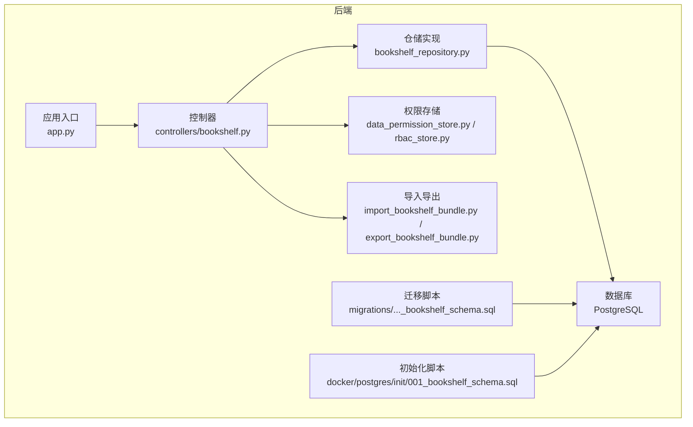
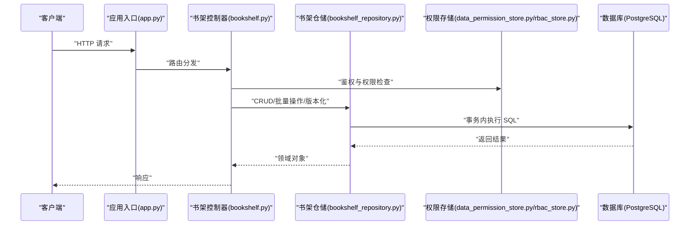
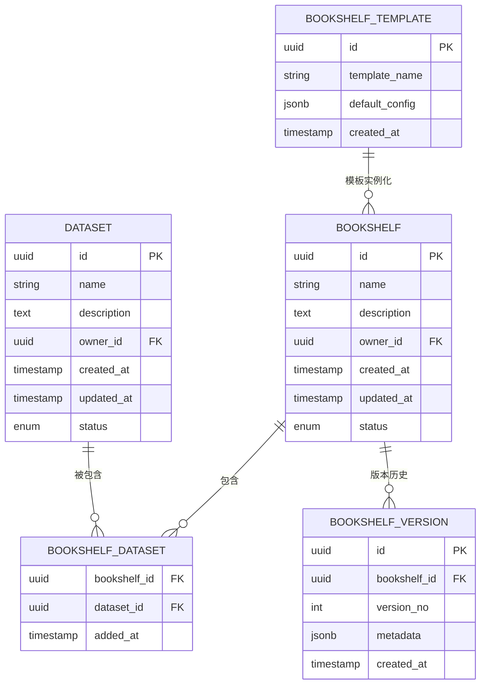
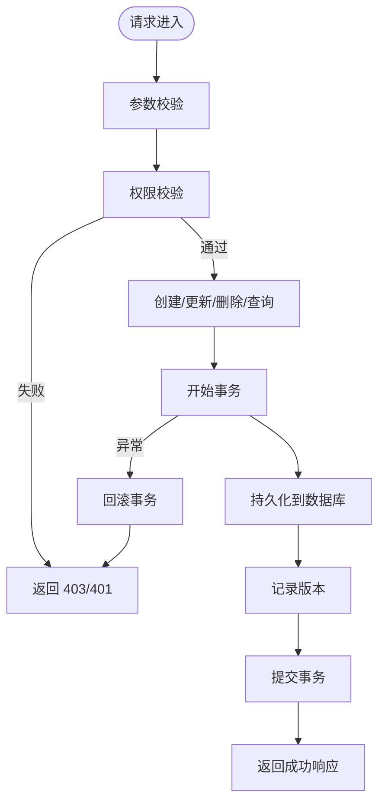
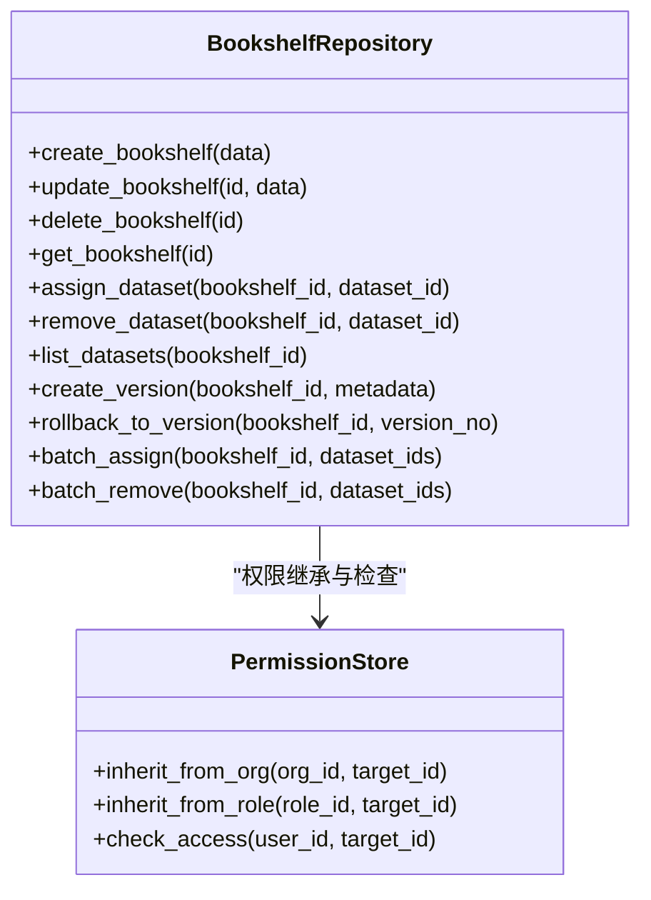
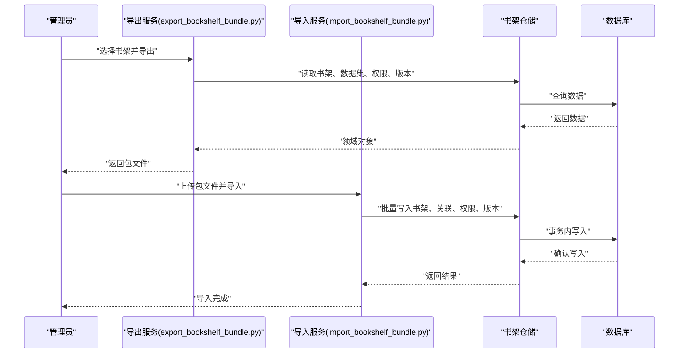
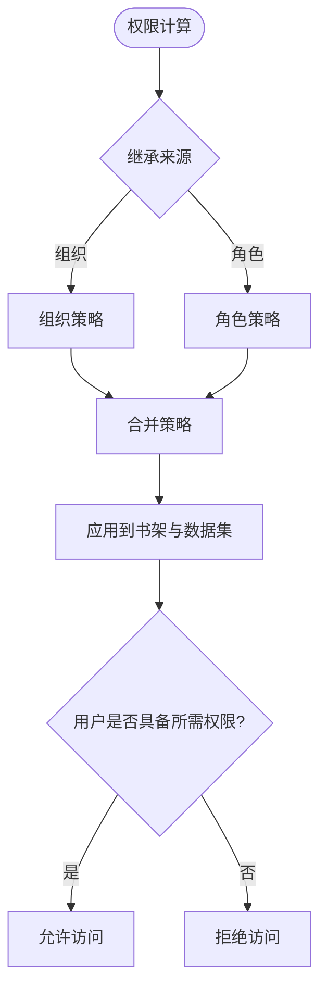
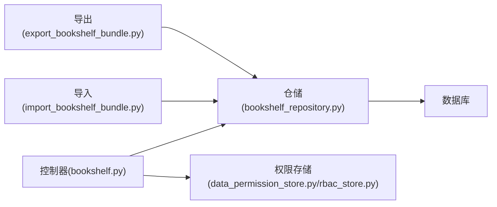

# 书架仓储

<cite>
**本文引用的文件**   
- [bookshelf_repository.py](file://backend/bookshelf_repository.py)
- [controllers/bookshelf.py](file://backend/controllers/bookshelf.py)
- [migrations/20260330_bookshelf_schema.sql](file://backend/migrations/20260330_bookshelf_schema.sql)
- [docker/postgres/init/001_bookshelf_schema.sql](file://docker/postgres/init/001_bookshelf_schema.sql)
- [import_bookshelf_bundle.py](file://backend/import_bookshelf_bundle.py)
- [export_bookshelf_bundle.py](file://backend/export_bookshelf_bundle.py)
- [data_permission_store.py](file://backend/data_permission_store.py)
- [rbac_store.py](file://backend/rbac_store.py)
- [app.py](file://backend/app.py)
</cite>

## 目录
1. [简介](#简介)
2. [项目结构](#项目结构)
3. [核心组件](#核心组件)
4. [架构总览](#架构总览)
5. [详细组件分析](#详细组件分析)
6. [依赖关系分析](#依赖关系分析)
7. [性能考虑](#性能考虑)
8. [故障排查指南](#故障排查指南)
9. [结论](#结论)
10. [附录](#附录)

## 简介
本文件为 SmartAsk 智能问数平台的“书架仓储”模块提供完整开发文档。书架（Bookshelf）作为数据集的组织容器，承担以下职责：
- 组织与聚合数据集，形成可复用的知识集合
- 管理书架元数据、版本与模板
- 继承并传递权限策略，确保跨数据集的访问控制一致性
- 提供 CRUD 接口、批量操作、导入导出能力
- 通过查询优化与事务处理保障一致性与性能

## 项目结构
书架仓储相关代码主要分布在后端目录中，包括控制器、仓储实现、数据库迁移脚本以及导入导出工具。前端通过 API 调用后端控制器完成交互。

**图表来源** 
- [controllers/bookshelf.py](file://backend/controllers/bookshelf.py)
- [bookshelf_repository.py](file://backend/bookshelf_repository.py)
- [migrations/20260330_bookshelf_schema.sql](file://backend/migrations/20260330_bookshelf_schema.sql)
- [docker/postgres/init/001_bookshelf_schema.sql](file://docker/postgres/init/001_bookshelf_schema.sql)
- [data_permission_store.py](file://backend/data_permission_store.py)
- [rbac_store.py](file://backend/rbac_store.py)
- [import_bookshelf_bundle.py](file://backend/import_bookshelf_bundle.py)
- [export_bookshelf_bundle.py](file://backend/export_bookshelf_bundle.py)
- [app.py](file://backend/app.py)

**章节来源**
- [controllers/bookshelf.py](file://backend/controllers/bookshelf.py)
- [bookshelf_repository.py](file://backend/bookshelf_repository.py)
- [migrations/20260330_bookshelf_schema.sql](file://backend/migrations/20260330_bookshelf_schema.sql)
- [docker/postgres/init/001_bookshelf_schema.sql](file://docker/postgres/init/001_bookshelf_schema.sql)
- [import_bookshelf_bundle.py](file://backend/import_bookshelf_bundle.py)
- [export_bookshelf_bundle.py](file://backend/export_bookshelf_bundle.py)
- [data_permission_store.py](file://backend/data_permission_store.py)
- [rbac_store.py](file://backend/rbac_store.py)
- [app.py](file://backend/app.py)

## 核心组件
- 控制器层（BookshelfController）
  - 暴露 RESTful 接口：创建、更新、删除、获取书架；分配/移除数据集；权限继承配置；版本化操作；批量操作；导入导出
  - 负责请求校验、鉴权、事务边界与错误封装
- 仓储层（BookshelfRepository）
  - 封装对书架、书架-数据集关联、版本表、模板表的持久化操作
  - 提供事务性方法，保证多表写入的一致性
- 权限与 RBAC
  - 基于 RBAC 模型，支持从组织或角色继承权限到书架及其数据集
  - 数据权限存储用于细粒度访问控制
- 导入导出
  - 将书架及其关联的数据集、权限、版本信息打包导出
  - 支持批量导入以快速构建环境或迁移

**章节来源**
- [controllers/bookshelf.py](file://backend/controllers/bookshelf.py)
- [bookshelf_repository.py](file://backend/bookshelf_repository.py)
- [data_permission_store.py](file://backend/data_permission_store.py)
- [rbac_store.py](file://backend/rbac_store.py)
- [import_bookshelf_bundle.py](file://backend/import_bookshelf_bundle.py)
- [export_bookshelf_bundle.py](file://backend/export_bookshelf_bundle.py)

## 架构总览
书架仓储采用分层架构：控制器负责 HTTP 接口与业务编排，仓储负责数据访问与事务，权限子系统提供鉴权与授权，数据库通过迁移脚本维护 schema。

**图表来源** 
- [app.py](file://backend/app.py)
- [controllers/bookshelf.py](file://backend/controllers/bookshelf.py)
- [bookshelf_repository.py](file://backend/bookshelf_repository.py)
- [data_permission_store.py](file://backend/data_permission_store.py)
- [rbac_store.py](file://backend/rbac_store.py)

## 详细组件分析

### 书架数据模型与关系
书架与数据集是多对多关系，通过中间表建立关联。书架支持版本化，每次变更生成新版本记录。模板系统允许复用书架结构与默认权限策略。

**图表来源** 
- [migrations/20260330_bookshelf_schema.sql](file://backend/migrations/20260330_bookshelf_schema.sql)
- [docker/postgres/init/001_bookshelf_schema.sql](file://docker/postgres/init/001_bookshelf_schema.sql)

**章节来源**
- [migrations/20260330_bookshelf_schema.sql](file://backend/migrations/20260330_bookshelf_schema.sql)
- [docker/postgres/init/001_bookshelf_schema.sql](file://docker/postgres/init/001_bookshelf_schema.sql)

### 控制器层：CRUD 与权限继承
- 创建书架：校验输入、设置所有者、初始化默认权限、写入书架与初始版本
- 更新书架：增量更新元数据、记录版本变更
- 删除书架：软删除或级联清理关联关系
- 获取书架：按 ID/名称/状态过滤，支持分页与排序
- 权限继承：从组织或角色继承策略，应用到书架及已分配数据集
- 版本控制：每次关键变更生成新版本，支持回滚与对比

**图表来源** 
- [controllers/bookshelf.py](file://backend/controllers/bookshelf.py)
- [bookshelf_repository.py](file://backend/bookshelf_repository.py)

**章节来源**
- [controllers/bookshelf.py](file://backend/controllers/bookshelf.py)
- [bookshelf_repository.py](file://backend/bookshelf_repository.py)

### 仓储层：事务与一致性
- 事务边界：所有涉及多表写入的操作在仓储层统一开启事务，确保原子性
- 并发控制：使用行级锁或乐观锁防止竞态条件
- 索引策略：为常用查询字段建立索引，提升检索性能
- 批量操作：提供批量插入/更新接口，减少往返开销

**图表来源** 
- [bookshelf_repository.py](file://backend/bookshelf_repository.py)
- [data_permission_store.py](file://backend/data_permission_store.py)
- [rbac_store.py](file://backend/rbac_store.py)

**章节来源**
- [bookshelf_repository.py](file://backend/bookshelf_repository.py)
- [data_permission_store.py](file://backend/data_permission_store.py)
- [rbac_store.py](file://backend/rbac_store.py)

### 导入导出与模板系统
- 导出：序列化书架、关联数据集、权限策略与版本历史为包文件
- 导入：解析包文件，重建书架、关联与权限，支持冲突解决策略
- 模板：定义书架默认结构与权限策略，快速实例化新书架

**图表来源** 
- [export_bookshelf_bundle.py](file://backend/export_bookshelf_bundle.py)
- [import_bookshelf_bundle.py](file://backend/import_bookshelf_bundle.py)
- [bookshelf_repository.py](file://backend/bookshelf_repository.py)

**章节来源**
- [export_bookshelf_bundle.py](file://backend/export_bookshelf_bundle.py)
- [import_bookshelf_bundle.py](file://backend/import_bookshelf_bundle.py)
- [bookshelf_repository.py](file://backend/bookshelf_repository.py)

### 权限继承与 RBAC
- 继承来源：组织树或角色
- 继承范围：书架本身及其已分配数据集
- 策略类型：读、写、管理、审计等
- 冲突解决：更具体的权限覆盖通用权限

**图表来源** 
- [data_permission_store.py](file://backend/data_permission_store.py)
- [rbac_store.py](file://backend/rbac_store.py)

**章节来源**
- [data_permission_store.py](file://backend/data_permission_store.py)
- [rbac_store.py](file://backend/rbac_store.py)

## 依赖关系分析
书架仓储依赖权限子系统与数据库，控制器依赖仓储与权限存储。导入导出工具依赖仓储进行数据读写。

**图表来源** 
- [controllers/bookshelf.py](file://backend/controllers/bookshelf.py)
- [bookshelf_repository.py](file://backend/bookshelf_repository.py)
- [data_permission_store.py](file://backend/data_permission_store.py)
- [rbac_store.py](file://backend/rbac_store.py)
- [import_bookshelf_bundle.py](file://backend/import_bookshelf_bundle.py)
- [export_bookshelf_bundle.py](file://backend/export_bookshelf_bundle.py)

**章节来源**
- [controllers/bookshelf.py](file://backend/controllers/bookshelf.py)
- [bookshelf_repository.py](file://backend/bookshelf_repository.py)
- [data_permission_store.py](file://backend/data_permission_store.py)
- [rbac_store.py](file://backend/rbac_store.py)
- [import_bookshelf_bundle.py](file://backend/import_bookshelf_bundle.py)
- [export_bookshelf_bundle.py](file://backend/export_bookshelf_bundle.py)

## 性能考虑
- 索引优化：为书架名称、所有者、状态、更新时间等高频查询字段建立索引
- 查询优化：避免 N+1 查询，使用 JOIN 或批量加载关联数据
- 事务最小化：仅在必要时开启事务，缩短持有时间
- 批量操作：使用批量插入/更新减少网络往返
- 缓存策略：对只读元数据使用缓存，降低数据库压力
- 分页与限流：对列表接口实施分页与速率限制

[本节为通用指导，不直接分析具体文件]

## 故障排查指南
- 权限问题：检查 RBAC 配置与继承策略是否正确应用
- 事务失败：查看数据库日志，确认是否存在死锁或约束冲突
- 导入失败：验证包文件格式与完整性，检查目标环境是否存在冲突数据
- 性能瓶颈：使用慢查询日志定位热点 SQL，优化索引与查询语句

**章节来源**
- [data_permission_store.py](file://backend/data_permission_store.py)
- [rbac_store.py](file://backend/rbac_store.py)
- [bookshelf_repository.py](file://backend/bookshelf_repository.py)

## 结论
书架仓储模块通过清晰的层次划分、严谨的事务处理与完善的权限继承机制，为 SmartAsk 平台提供了稳定高效的数据集组织能力。结合模板系统与导入导出功能，可显著提升运维效率与用户体验。建议在生产环境中持续监控性能指标，并根据实际负载优化索引与查询策略。

[本节为总结性内容，不直接分析具体文件]

## 附录
- 实际使用示例
  - 创建书架：调用控制器创建接口，传入名称、描述与所有者
  - 分配数据集：通过分配接口将数据集加入书架，自动继承权限
  - 权限配置：从组织或角色继承策略，细化到数据集级别
  - 查询优化：为常用筛选条件添加索引，使用分页与缓存
  - 版本回滚：选择历史版本进行回滚，恢复书架状态
- 最佳实践
  - 保持元数据简洁，避免过度嵌套
  - 定期清理未使用的书架与数据集
  - 使用模板标准化书架结构
  - 监控权限继承链，避免权限扩散

[本节为补充说明，不直接分析具体文件]