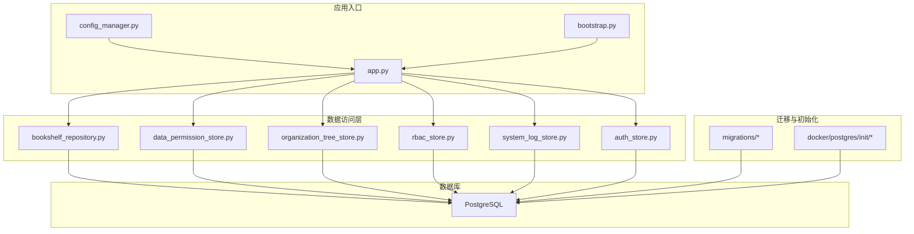
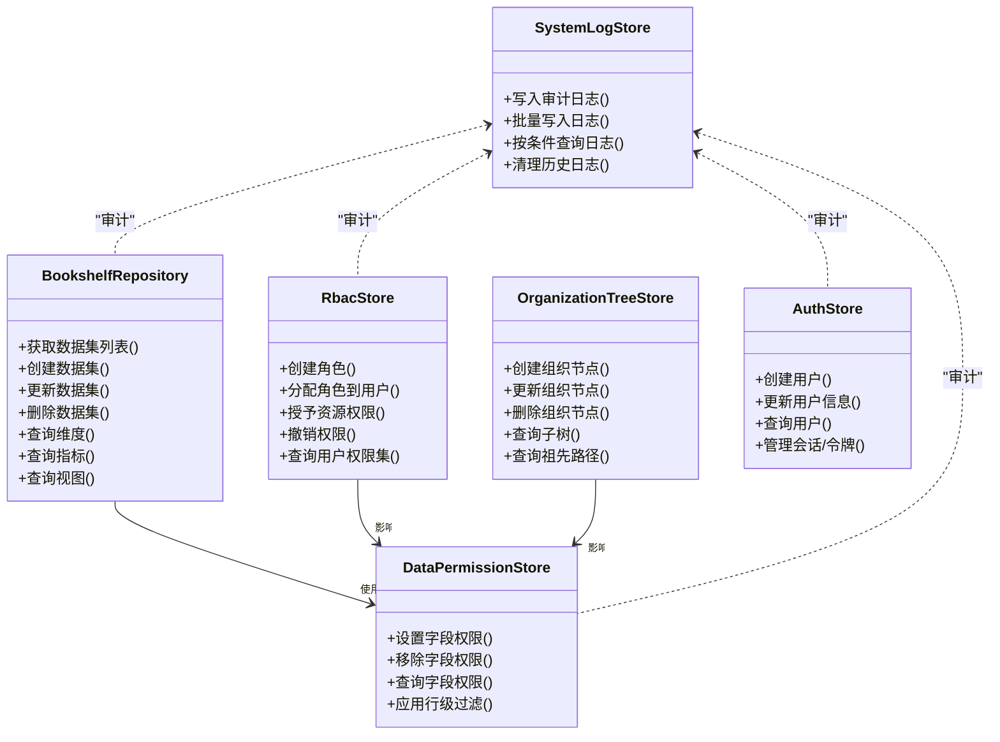
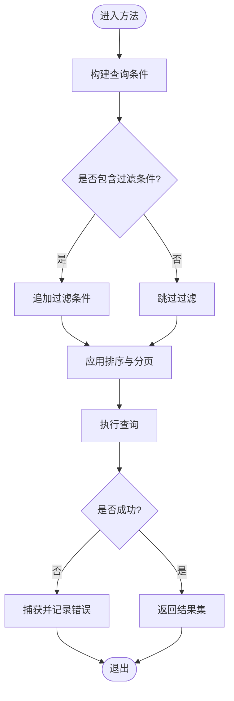
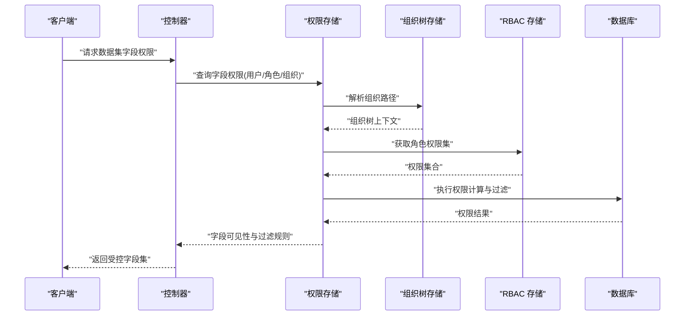
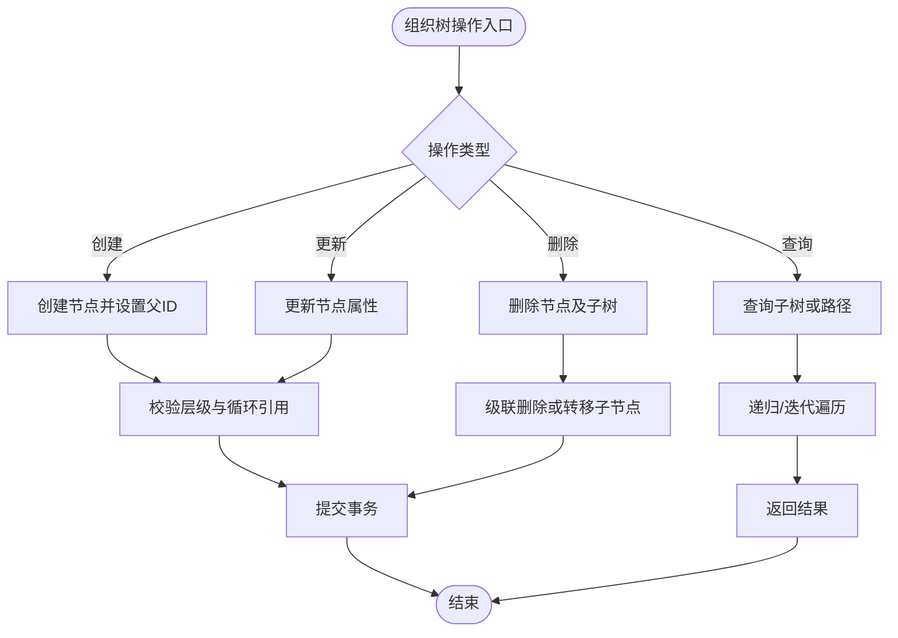
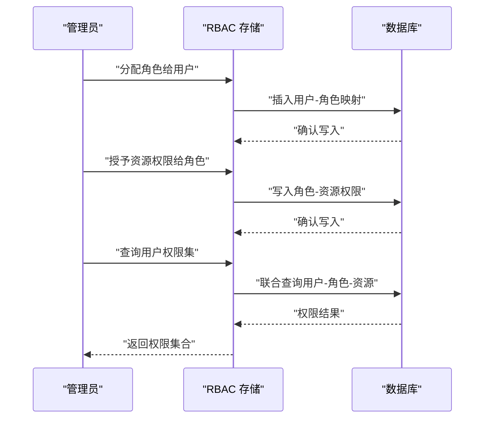
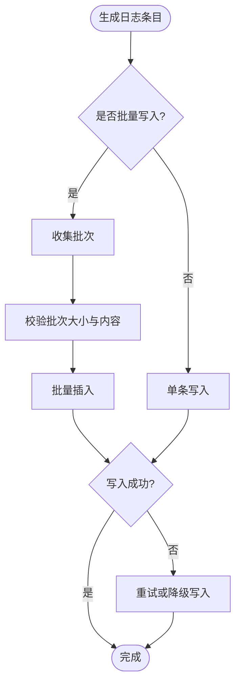
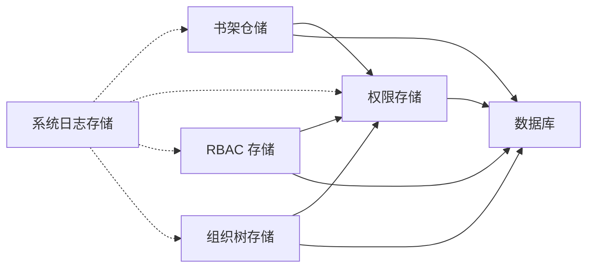

# 数据访问层

<cite>
**本文引用的文件**   
- [bookshelf_repository.py](file://backend/bookshelf_repository.py)
- [data_permission_store.py](file://backend/data_permission_store.py)
- [organization_tree_store.py](file://backend/organization_tree_store.py)
- [rbac_store.py](file://backend/rbac_store.py)
- [system_log_store.py](file://backend/system_log_store.py)
- [auth_store.py](file://backend/auth_store.py)
- [app.py](file://backend/app.py)
- [bootstrap.py](file://backend/bootstrap.py)
- [config_manager.py](file://backend/config_manager.py)
- [security.py](file://backend/security.py)
- [migrations/20260330_bookshelf_schema.sql](file://backend/migrations/20260330_bookshelf_schema.sql)
- [migrations/20260512_system_event_logs.sql](file://backend/migrations/20260512_system_event_logs.sql)
- [docker/postgres/init/001_bookshelf_schema.sql](file://docker/postgres/init/001_bookshelf_schema.sql)
- [docker/postgres/init/006_system_event_logs.sql](file://docker/postgres/init/006_system_event_logs.sql)
</cite>

## 目录
1. [引言](#引言)
2. [项目结构](#项目结构)
3. [核心组件](#核心组件)
4. [架构总览](#架构总览)
5. [详细组件分析](#详细组件分析)
6. [依赖关系分析](#依赖关系分析)
7. [性能考量](#性能考量)
8. [故障排查指南](#故障排查指南)
9. [结论](#结论)
10. [附录](#附录)

## 引言
本文件面向 SmartAsk 智能问数平台的数据访问层，系统性阐述仓储模式实现、数据抽象、查询构建与事务管理；深入解析书架仓储、权限存储、组织树存储、RBAC 存储与系统日志存储等关键组件；总结 ORM 使用规范、SQL 优化技巧与批量操作处理；并给出数据一致性、并发控制、缓存策略、迁移备份恢复、性能监控以及数据安全与隐私保护的最佳实践。文档力求在技术深度与可读性之间取得平衡，帮助开发者快速理解与高效扩展数据访问能力。

## 项目结构
后端数据访问层以“仓储/存储”模块为核心，围绕数据库连接、ORM 模型、迁移脚本与配置管理展开。关键目录与文件：
- backend 下各 store/repository 文件分别封装领域数据的 CRUD、查询与事务边界
- migrations 与 docker/postgres/init 存放数据库初始化与演进脚本
- app.py、bootstrap.py、config_manager.py 负责应用启动、依赖注入与配置加载
- security.py 提供安全相关工具（如加密、鉴权辅助）

**图示来源** 
- [app.py](file://backend/app.py)
- [bootstrap.py](file://backend/bootstrap.py)
- [config_manager.py](file://backend/config_manager.py)
- [bookshelf_repository.py](file://backend/bookshelf_repository.py)
- [data_permission_store.py](file://backend/data_permission_store.py)
- [organization_tree_store.py](file://backend/organization_tree_store.py)
- [rbac_store.py](file://backend/rbac_store.py)
- [system_log_store.py](file://backend/system_log_store.py)
- [auth_store.py](file://backend/auth_store.py)
- [migrations/20260330_bookshelf_schema.sql](file://backend/migrations/20260330_bookshelf_schema.sql)
- [migrations/20260512_system_event_logs.sql](file://backend/migrations/20260512_system_event_logs.sql)
- [docker/postgres/init/001_bookshelf_schema.sql](file://docker/postgres/init/001_bookshelf_schema.sql)
- [docker/postgres/init/006_system_event_logs.sql](file://docker/postgres/init/006_system_event_logs.sql)

**章节来源**
- [app.py](file://backend/app.py)
- [bootstrap.py](file://backend/bootstrap.py)
- [config_manager.py](file://backend/config_manager.py)

## 核心组件
- 书架仓储（数据集组织和元数据管理）：负责数据集、维度、指标、视图等元数据的持久化与检索，支撑上层问数编排与路由。
- 权限存储（字段级权限）：维护数据集与字段的访问控制策略，支持行列级过滤与字段可见性控制。
- 组织树存储（企业组织架构）：管理企业部门/团队层级结构，为权限与数据范围提供上下文。
- RBAC 存储（角色权限映射）：承载角色定义、资源授权与用户-角色分配，支撑细粒度权限决策。
- 系统日志存储（审计与操作记录）：统一记录关键操作、事件与异常，便于审计追踪与问题定位。
- 认证存储（鉴权基础）：管理用户、会话与令牌等认证相关数据。

上述组件通过统一的数据库连接与 ORM 抽象进行交互，遵循一致的查询构建与事务边界约定。

**章节来源**
- [bookshelf_repository.py](file://backend/bookshelf_repository.py)
- [data_permission_store.py](file://backend/data_permission_store.py)
- [organization_tree_store.py](file://backend/organization_tree_store.py)
- [rbac_store.py](file://backend/rbac_store.py)
- [system_log_store.py](file://backend/system_log_store.py)
- [auth_store.py](file://backend/auth_store.py)

## 架构总览
数据访问层采用仓储模式，将业务领域对象与底层数据库解耦。应用控制器调用仓储接口，仓储内部封装 ORM 模型、SQL 构建与事务管理，确保一致性与可测试性。

**图示来源** 
- [bookshelf_repository.py](file://backend/bookshelf_repository.py)
- [data_permission_store.py](file://backend/data_permission_store.py)
- [organization_tree_store.py](file://backend/organization_tree_store.py)
- [rbac_store.py](file://backend/rbac_store.py)
- [system_log_store.py](file://backend/system_log_store.py)
- [auth_store.py](file://backend/auth_store.py)

## 详细组件分析

### 书架仓储（数据集组织和元数据管理）
职责与要点：
- 数据集、维度、指标、视图的增删改查与关联关系维护
- 查询构建：基于条件组合、分页排序、聚合统计
- 事务边界：批量导入/导出、元数据版本变更需原子性保证
- 索引与约束：主键、唯一约束、外键关系确保数据完整性

**图示来源** 
- [bookshelf_repository.py](file://backend/bookshelf_repository.py)

**章节来源**
- [bookshelf_repository.py](file://backend/bookshelf_repository.py)
- [migrations/20260330_bookshelf_schema.sql](file://backend/migrations/20260330_bookshelf_schema.sql)
- [docker/postgres/init/001_bookshelf_schema.sql](file://docker/postgres/init/001_bookshelf_schema.sql)

### 权限存储（字段级权限）
职责与要点：
- 字段级可见性与读写权限控制
- 行级过滤策略（基于组织、角色、用户）
- 权限继承与合并（组织树与 RBAC 联动）
- 审计记录：权限变更与访问尝试

**图示来源** 
- [data_permission_store.py](file://backend/data_permission_store.py)
- [organization_tree_store.py](file://backend/organization_tree_store.py)
- [rbac_store.py](file://backend/rbac_store.py)

**章节来源**
- [data_permission_store.py](file://backend/data_permission_store.py)
- [organization_tree_store.py](file://backend/organization_tree_store.py)
- [rbac_store.py](file://backend/rbac_store.py)

### 组织树存储（企业组织架构管理）
职责与要点：
- 节点增删改查、父子关系维护
- 子树遍历、祖先路径计算
- 与权限系统的集成：组织范围决定数据可见性

**图示来源** 
- [organization_tree_store.py](file://backend/organization_tree_store.py)

**章节来源**
- [organization_tree_store.py](file://backend/organization_tree_store.py)

### RBAC 存储（角色权限映射）
职责与要点：
- 角色定义、资源授权、用户-角色分配
- 权限查询：用户有效权限集、资源访问矩阵
- 审计：权限变更、越权尝试记录

**图示来源** 
- [rbac_store.py](file://backend/rbac_store.py)

**章节来源**
- [rbac_store.py](file://backend/rbac_store.py)

### 系统日志存储（审计和操作记录）
职责与要点：
- 统一写入审计日志（操作人、时间、资源、动作、结果）
- 批量写入提升吞吐
- 按条件查询与清理历史日志

**图示来源** 
- [system_log_store.py](file://backend/system_log_store.py)

**章节来源**
- [system_log_store.py](file://backend/system_log_store.py)
- [migrations/20260512_system_event_logs.sql](file://backend/migrations/20260512_system_event_logs.sql)
- [docker/postgres/init/006_system_event_logs.sql](file://docker/postgres/init/006_system_event_logs.sql)

### 认证存储（鉴权基础）
职责与要点：
- 用户信息管理、会话与令牌生命周期
- 与权限系统协作，提供鉴权上下文

**章节来源**
- [auth_store.py](file://backend/auth_store.py)

## 依赖关系分析
数据访问层组件之间的耦合与协作：
- 权限存储依赖组织树与 RBAC 存储，形成“组织-角色-用户”三维权限模型
- 系统日志存储被其他仓储调用，用于审计与可观测性
- 书架仓储与权限存储协同，确保数据集与字段的访问控制

**图示来源** 
- [bookshelf_repository.py](file://backend/bookshelf_repository.py)
- [data_permission_store.py](file://backend/data_permission_store.py)
- [organization_tree_store.py](file://backend/organization_tree_store.py)
- [rbac_store.py](file://backend/rbac_store.py)
- [system_log_store.py](file://backend/system_log_store.py)

**章节来源**
- [bookshelf_repository.py](file://backend/bookshelf_repository.py)
- [data_permission_store.py](file://backend/data_permission_store.py)
- [organization_tree_store.py](file://backend/organization_tree_store.py)
- [rbac_store.py](file://backend/rbac_store.py)
- [system_log_store.py](file://backend/system_log_store.py)

## 性能考量
- 查询优化
  - 合理使用索引：对高频过滤字段建立索引，避免全表扫描
  - 分页与限制：使用 LIMIT/OFFSET 或游标分页，减少大结果集传输
  - 预聚合：对复杂统计提前物化视图或汇总表
- 批量操作
  - 批量插入/更新：减少往返次数，提高吞吐
  - 事务分组：合理划分事务边界，避免长事务锁竞争
- 并发控制
  - 乐观锁：版本号字段防止覆盖写
  - 悲观锁：必要时使用行级锁保证强一致
- 缓存策略
  - 热点数据缓存：权限集、组织树路径可短期缓存
  - 失效策略：权限/组织变更时主动失效缓存
- ORM 使用规范
  - 避免 N+1 查询：使用 JOIN 或预加载
  - 显式选择字段：减少不必要列读取
  - 参数化查询：防止 SQL 注入

[本节为通用指导，不直接分析具体文件]

## 故障排查指南
- 常见问题
  - 权限计算结果不符合预期：检查组织树路径、角色分配与字段权限策略
  - 日志缺失：确认写入流程与批量批次大小，检查事务回滚
  - 查询缓慢：查看执行计划，补充索引或改写查询
- 调试建议
  - 开启详细日志：记录关键步骤与参数
  - 使用慢查询日志：定位耗时 SQL
  - 单元测试与集成测试：验证权限与组织树逻辑

**章节来源**
- [security.py](file://backend/security.py)
- [system_log_store.py](file://backend/system_log_store.py)

## 结论
SmartAsk 数据访问层通过仓储模式实现了清晰的数据抽象与稳定的事务边界，结合权限、组织与 RBAC 的协同，提供了细粒度的访问控制与完整的审计能力。遵循 ORM 规范、SQL 优化与批量操作最佳实践，可有效提升性能与可靠性。建议在后续迭代中持续完善缓存策略、监控告警与安全加固，以支撑更大规模的企业级使用场景。

[本节为总结性内容，不直接分析具体文件]

## 附录
- 数据迁移与备份恢复
  - 迁移脚本：migrations 与 docker/postgres/init 中的 SQL 文件应版本化管理，上线前进行回滚演练
  - 备份策略：定期全量与增量备份，保留多版本快照
  - 恢复演练：定期验证恢复流程与数据一致性
- 性能监控
  - 指标采集：QPS、延迟、错误率、锁等待、慢查询
  - 告警阈值：根据业务峰值设定合理阈值
- 数据安全与隐私
  - 敏感数据加密：存储与传输加密
  - 最小权限原则：按需授权，定期审计
  - 脱敏与匿名化：日志与报表中避免明文敏感信息

[本节为通用指导，不直接分析具体文件]