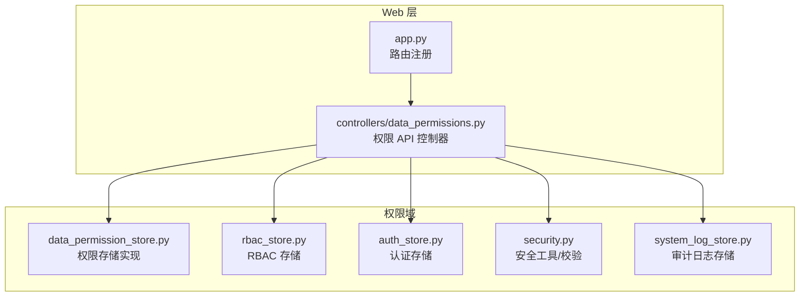
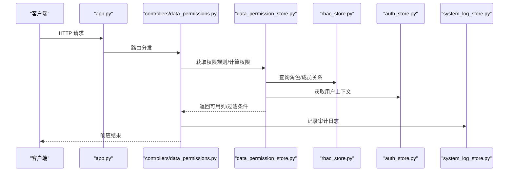
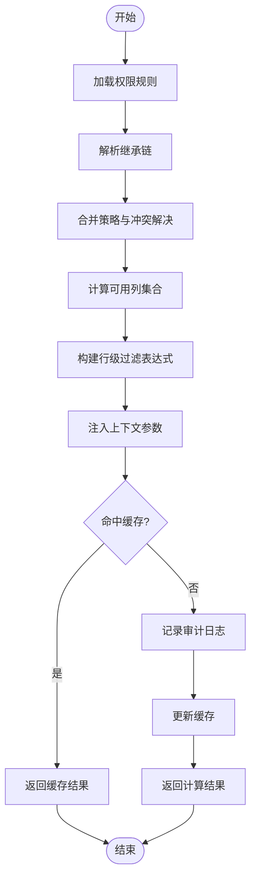
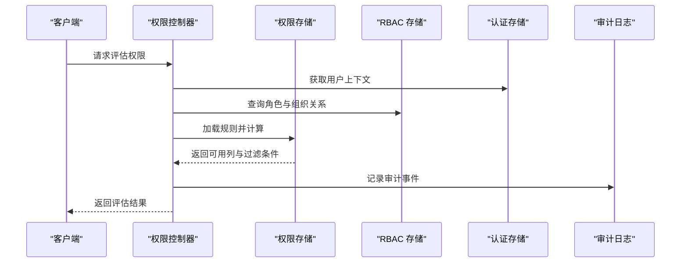
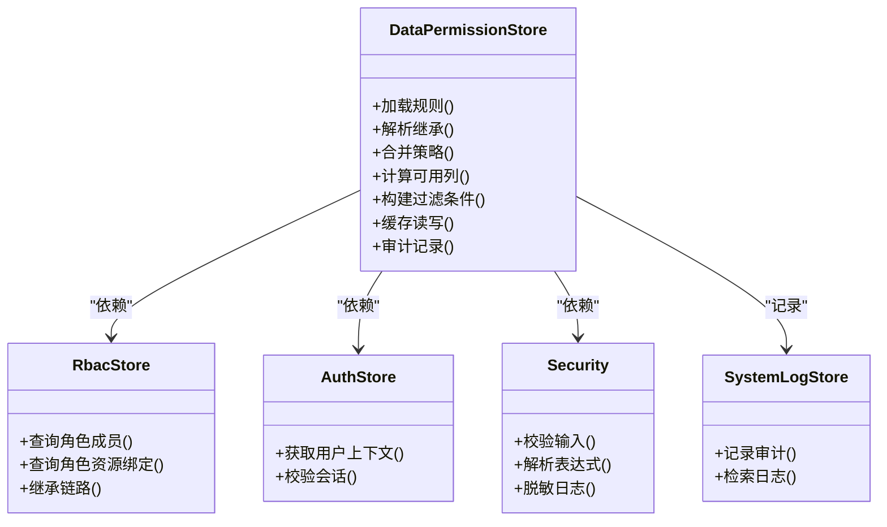
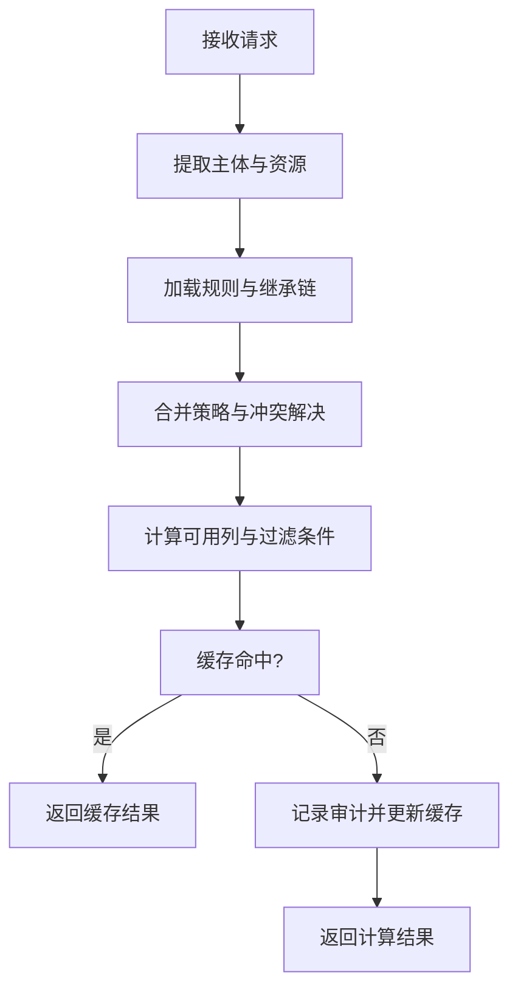

# 权限存储

<cite>
**本文档引用的文件**   
- [data_permission_store.py](file://backend/data_permission_store.py)
- [controllers/data_permissions.py](file://backend/controllers/data_permissions.py)
- [rbac_store.py](file://backend/rbac_store.py)
- [auth_store.py](file://backend/auth_store.py)
- [security.py](file://backend/security.py)
- [system_log_store.py](file://backend/system_log_store.py)
- [app.py](file://backend/app.py)
</cite>

## 目录
1. [简介](#简介)
2. [项目结构](#项目结构)
3. [核心组件](#核心组件)
4. [架构总览](#架构总览)
5. [详细组件分析](#详细组件分析)
6. [依赖关系分析](#依赖关系分析)
7. [性能考虑](#性能考虑)
8. [故障排查指南](#故障排查指南)
9. [结论](#结论)
10. [附录](#附录) 

## 简介
本文件为 SmartAsk 智能问数平台“数据权限存储模块”的全面开发文档，聚焦字段级权限控制与行级数据过滤、动态权限计算、权限继承机制、缓存策略与验证流程。文档同时覆盖权限模型设计、规则定义、冲突解决、审计日志、变更追踪与性能优化，并提供配置示例与扩展方法，帮助开发者快速理解并安全地扩展权限系统。

## 项目结构
围绕数据权限的核心代码主要位于后端目录：
- 权限存储与持久化：data_permission_store.py
- 权限控制器（API）：controllers/data_permissions.py
- RBAC 存储：rbac_store.py
- 认证存储：auth_store.py
- 安全工具与校验：security.py
- 系统日志存储：system_log_store.py
- Web 应用入口与路由注册：app.py

**图示来源** 
- [app.py](file://backend/app.py)
- [controllers/data_permissions.py](file://backend/controllers/data_permissions.py)
- [data_permission_store.py](file://backend/data_permission_store.py)
- [rbac_store.py](file://backend/rbac_store.py)
- [auth_store.py](file://backend/auth_store.py)
- [security.py](file://backend/security.py)
- [system_log_store.py](file://backend/system_log_store.py)

**章节来源**
- [app.py](file://backend/app.py)
- [controllers/data_permissions.py](file://backend/controllers/data_permissions.py)
- [data_permission_store.py](file://backend/data_permission_store.py)
- [rbac_store.py](file://backend/rbac_store.py)
- [auth_store.py](file://backend/auth_store.py)
- [security.py](file://backend/security.py)
- [system_log_store.py](file://backend/system_log_store.py)

## 核心组件
- 权限存储（DataPermissionStore）
  - 负责字段级权限（列白名单/黑名单）、行级过滤条件、动态权限表达式、权限继承与合并、缓存读写与失效。
- 权限控制器（DataPermissionsController）
  - 暴露权限管理 API：创建/更新/删除权限规则、查询可用列、执行行级过滤、刷新缓存、审计记录。
- RBAC 存储（RbacStore）
  - 提供角色、成员、角色-资源绑定等能力，支撑权限继承与聚合。
- 认证存储（AuthStore）
  - 提供用户上下文、会话信息，用于权限计算时的主体识别。
- 安全工具（Security）
  - 提供输入校验、表达式解析辅助、敏感信息脱敏等能力。
- 系统日志（SystemLogStore）
  - 记录权限变更、访问审计、错误事件，支持可追溯性。

**章节来源**
- [data_permission_store.py](file://backend/data_permission_store.py)
- [controllers/data_permissions.py](file://backend/controllers/data_permissions.py)
- [rbac_store.py](file://backend/rbac_store.py)
- [auth_store.py](file://backend/auth_store.py)
- [security.py](file://backend/security.py)
- [system_log_store.py](file://backend/system_log_store.py)

## 架构总览
权限系统在请求处理中的关键路径如下：
- 控制器接收权限相关请求，调用权限存储进行规则读取与计算。
- 权限存储结合 RBAC 与认证上下文，完成字段级与行级权限判定。
- 结果写入审计日志，必要时触发缓存更新。

**图示来源** 
- [app.py](file://backend/app.py)
- [controllers/data_permissions.py](file://backend/controllers/data_permissions.py)
- [data_permission_store.py](file://backend/data_permission_store.py)
- [rbac_store.py](file://backend/rbac_store.py)
- [auth_store.py](file://backend/auth_store.py)
- [system_log_store.py](file://backend/system_log_store.py)

## 详细组件分析

### 权限存储（DataPermissionStore）
职责与能力：
- 字段级权限：维护数据集的列白名单/黑名单，支持按用户/角色/组织维度配置。
- 行级数据过滤：基于条件表达式生成 SQL 或内存过滤逻辑，支持动态参数注入。
- 动态权限计算：根据上下文（用户、角色、组织、时间、环境）实时计算最终可见集合。
- 权限继承：从角色、组织、默认模板继承权限，合并时遵循优先级与冲突解决策略。
- 缓存策略：对高频查询结果进行缓存，支持 TTL、键空间管理与失效通知。
- 审计与追踪：记录规则变更、计算结果摘要、异常事件。

典型数据结构（概念说明）：
- 权限规则：包含资源标识、主体类型（用户/角色/组织）、字段列表、行级条件、生效范围、优先级。
- 继承链：主体到角色的映射、角色到资源的绑定、组织树与继承关系。
- 缓存项：键（主体+资源+维度）、值（可用列集合、过滤表达式、过期时间）。

权限合并与冲突解决策略：
- 白名单优先于黑名单；显式允许优于隐式拒绝。
- 高优先级规则覆盖低优先级规则；最新生效的规则优先。
- 当存在冲突时，采用“最小权限”原则，仅保留交集。

缓存策略要点：
- 键设计包含主体、资源、维度与版本，避免脏读。
- TTL 设置与规则版本联动，规则变更后主动失效相关缓存。
- 热点数据使用本地缓存，跨节点一致性通过事件广播或版本号校验保证。

**章节来源**
- [data_permission_store.py](file://backend/data_permission_store.py)

#### 权限计算流程图（概念）

[此图为概念流程图，不直接映射具体源码文件]

### 权限控制器（DataPermissionsController）
职责与能力：
- 提供权限规则的增删改查接口。
- 提供“可用列查询”“行级过滤生成”“权限评估”等接口。
- 触发缓存刷新与审计记录。
- 对输入进行严格校验，防止非法表达式与越权操作。

典型 API 行为：
- 创建/更新权限规则：校验主体、资源、字段列表、行级条件、优先级与生效范围。
- 查询可用列：基于当前用户与资源，返回字段级白名单。
- 生成行级过滤：返回可用于 SQL 或内存过滤的条件片段。
- 刷新缓存：按主体或资源维度清理缓存。
- 审计记录：记录操作人、动作、对象、结果与时间戳。

**章节来源**
- [controllers/data_permissions.py](file://backend/controllers/data_permissions.py)

#### 权限评估序列图（概念）

[此图为概念序列图，不直接映射具体源码文件]

### RBAC 存储（RbacStore）
职责与能力：
- 管理角色、成员、角色-资源绑定。
- 提供继承查询：从用户到角色再到资源的完整链路。
- 支持批量操作与事务，确保一致性。

与权限存储协作：
- 权限存储在计算时调用 RBAC 获取主体-角色-资源关系，作为继承基础。
- 权限规则变更时，RBAC 变更可能触发权限缓存失效。

**章节来源**
- [rbac_store.py](file://backend/rbac_store.py)

### 认证存储（AuthStore）
职责与能力：
- 提供用户身份、会话、租户/组织上下文。
- 支持令牌校验与上下文提取。

与权限存储协作：
- 权限计算需要用户与组织上下文，AuthStore 提供必要信息。

**章节来源**
- [auth_store.py](file://backend/auth_store.py)

### 安全工具（Security）
职责与能力：
- 输入校验与表达式解析辅助。
- 敏感信息脱敏与日志安全。
- 权限边界检查与防越权。

与权限存储协作：
- 权限规则与表达式在存储前需经 Security 校验。
- 审计日志输出前进行脱敏处理。

**章节来源**
- [security.py](file://backend/security.py)

### 系统日志（SystemLogStore）
职责与能力：
- 记录权限变更、访问审计、错误事件。
- 支持按主体、资源、时间范围检索。
- 提供导出与归档能力。

与权限存储协作：
- 权限计算与规则变更均记录审计事件，便于问题定位与合规审查。

**章节来源**
- [system_log_store.py](file://backend/system_log_store.py)

## 依赖关系分析
权限存储模块依赖 RBAC、认证与安全工具，并通过控制器对外暴露能力。日志存储贯穿整个流程，保障可追溯性。

**图示来源** 
- [data_permission_store.py](file://backend/data_permission_store.py)
- [rbac_store.py](file://backend/rbac_store.py)
- [auth_store.py](file://backend/auth_store.py)
- [security.py](file://backend/security.py)
- [system_log_store.py](file://backend/system_log_store.py)

**章节来源**
- [data_permission_store.py](file://backend/data_permission_store.py)
- [rbac_store.py](file://backend/rbac_store.py)
- [auth_store.py](file://backend/auth_store.py)
- [security.py](file://backend/security.py)
- [system_log_store.py](file://backend/system_log_store.py)

## 性能考虑
- 缓存命中率优化
  - 合理设计缓存键，减少冷数据占用。
  - 针对热点主体与资源设置更长 TTL。
- 规则加载与合并
  - 增量加载与懒加载，避免全量扫描。
  - 合并过程采用位图或集合运算，降低复杂度。
- 表达式求值
  - 预编译常用表达式，避免重复解析。
  - 限制表达式复杂度，防止恶意构造导致性能退化。
- I/O 与并发
  - 对 RBAC 与认证查询进行连接池与并发控制。
  - 异步记录审计日志，避免阻塞主流程。

[本节为通用性能建议，不直接分析具体文件]

## 故障排查指南
常见问题与定位步骤：
- 权限未生效
  - 检查规则是否已保存且生效范围正确。
  - 确认缓存是否已失效，必要时手动刷新。
  - 查看审计日志中是否有错误事件。
- 行级过滤无效
  - 校验表达式语法与上下文参数注入是否正确。
  - 检查 RBAC 与认证上下文是否完整。
- 性能下降
  - 监控缓存命中率与规则合并耗时。
  - 分析热点查询与表达式复杂度。

定位工具：
- 审计日志检索：按主体、资源、时间范围筛选。
- 缓存状态检查：查看键空间与过期时间。
- 规则版本对比：确认最近变更与影响范围。

**章节来源**
- [system_log_store.py](file://backend/system_log_store.py)
- [security.py](file://backend/security.py)

## 结论
SmartAsk 的数据权限存储模块以字段级与行级控制为核心，结合 RBAC 与认证上下文，实现动态权限计算与高效缓存。通过严格的输入校验、完善的审计日志与清晰的冲突解决策略，保障了系统的安全性与可维护性。建议在扩展自定义权限规则时，遵循最小权限原则与模块化设计，确保系统的可扩展性与稳定性。

[本节为总结性内容，不直接分析具体文件]

## 附录

### 权限模型设计要点
- 主体维度：用户、角色、组织。
- 资源维度：数据集、表、视图、字段。
- 策略类型：白名单、黑名单、条件过滤。
- 优先级：显式 > 隐式，高优先级 > 低优先级，最新 > 旧版。

### 权限规则定义示例（概念）
- 用户级规则：指定用户可访问的字段集合与行级条件。
- 角色级规则：为角色定义字段与过滤模板，成员继承。
- 组织级规则：按组织维度设定默认权限与例外。

### 权限冲突解决策略
- 白名单优先于黑名单。
- 显式允许优于隐式拒绝。
- 高优先级覆盖低优先级。
- 冲突时取交集，遵循最小权限。

### 权限缓存策略
- 键包含主体、资源、维度与版本。
- TTL 与规则版本联动，变更即失效。
- 热点数据本地缓存，跨节点一致性通过事件或版本号校验。

### 权限验证流程（概念）

[此图为概念流程图，不直接映射具体源码文件]

### 扩展与自定义权限规则
- 新增策略类型：在权限存储中扩展策略解析与合并逻辑。
- 自定义表达式：在安全工具中增加表达式解析器与校验器。
- 插件化规则引擎：将规则计算抽象为可插拔组件，便于扩展与维护。

[本节为通用指导，不直接分析具体文件]