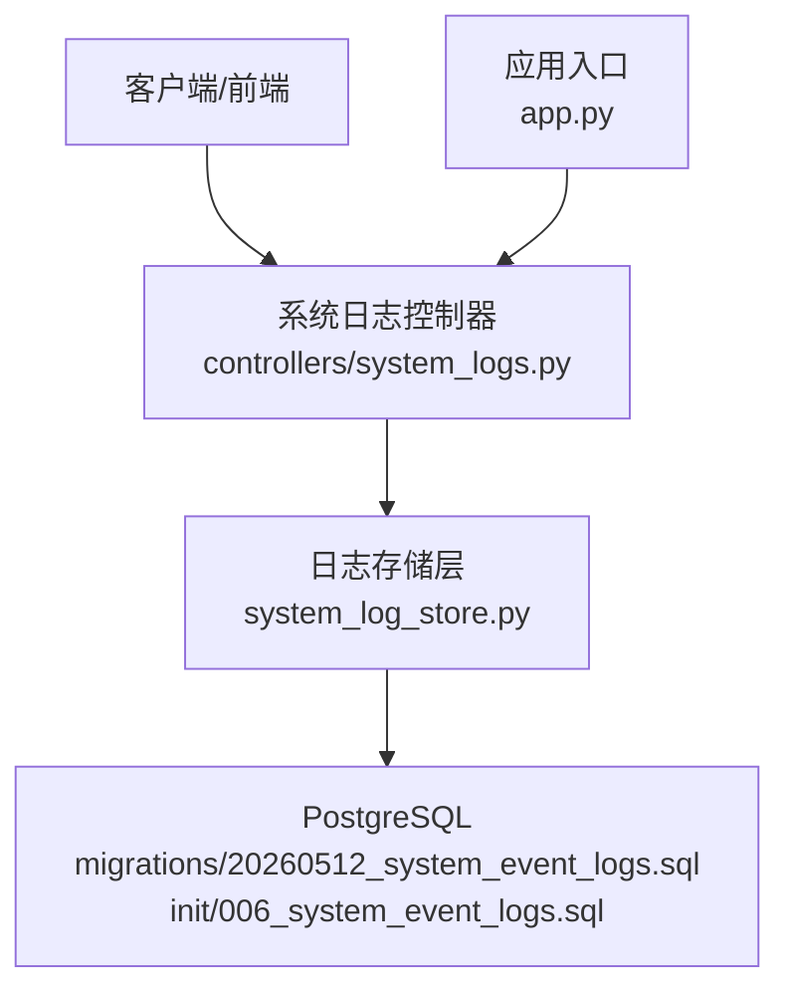
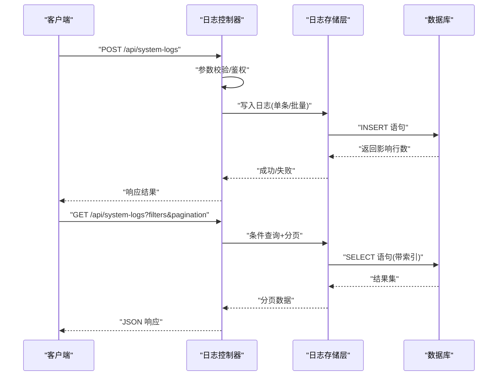

# 系统日志存储

<cite>
**本文引用的文件**   
- [system_log_store.py](file://backend/system_log_store.py)
- [system_logs.py](file://backend/controllers/system_logs.py)
- [20260512_system_event_logs.sql](file://backend/migrations/20260512_system_event_logs.sql)
- [006_system_event_logs.sql](file://docker/postgres/init/006_system_event_logs.sql)
- [app.py](file://backend/app.py)
</cite>

## 目录
1. [简介](#简介)
2. [项目结构](#项目结构)
3. [核心组件](#核心组件)
4. [架构总览](#架构总览)
5. [详细组件分析](#详细组件分析)
6. [依赖关系分析](#依赖关系分析)
7. [性能考量](#性能考量)
8. [故障排查指南](#故障排查指南)
9. [结论](#结论)
10. [附录](#附录)

## 简介
本文件面向 SmartAsk 智能问数平台的“系统日志存储模块”，聚焦审计日志的设计与实现，覆盖操作记录、错误追踪与安全审计。文档阐述日志分类体系、存储策略、查询接口、采集机制、异步写入、轮转策略、分析接口、统计报表、异常告警、使用示例、生命周期管理（归档与清理）、查询优化（索引与大数据量处理）等关键主题，帮助开发者快速理解并扩展该模块。

## 项目结构
与系统日志存储相关的代码主要分布在以下位置：
- 后端控制器：提供 REST API 用于日志的写入与查询
- 存储层：封装数据库访问逻辑
- 数据库迁移脚本：定义日志表结构与索引
- 应用初始化：注册路由与启动配置

图表来源
- [system_logs.py](file://backend/controllers/system_logs.py)
- [system_log_store.py](file://backend/system_log_store.py)
- [20260512_system_event_logs.sql](file://backend/migrations/20260512_system_event_logs.sql)
- [006_system_event_logs.sql](file://docker/postgres/init/006_system_event_logs.sql)
- [app.py](file://backend/app.py)

章节来源
- [system_logs.py](file://backend/controllers/system_logs.py)
- [system_log_store.py](file://backend/system_log_store.py)
- [20260512_system_event_logs.sql](file://backend/migrations/20260512_system_event_logs.sql)
- [006_system_event_logs.sql](file://docker/postgres/init/006_system_event_logs.sql)
- [app.py](file://backend/app.py)

## 核心组件
- 日志存储层：负责将结构化日志持久化到数据库，提供批量写入、条件查询、分页与聚合能力
- 日志控制器：暴露 REST 接口，接收请求参数，校验输入，调用存储层完成读写
- 数据库模型与迁移：定义日志表字段、约束与索引，确保查询性能与数据一致性
- 应用集成：在应用启动时注册日志相关路由，统一鉴权与限流策略

章节来源
- [system_log_store.py](file://backend/system_log_store.py)
- [system_logs.py](file://backend/controllers/system_logs.py)
- [20260512_system_event_logs.sql](file://backend/migrations/20260512_system_event_logs.sql)
- [006_system_event_logs.sql](file://docker/postgres/init/006_system_event_logs.sql)
- [app.py](file://backend/app.py)

## 架构总览
系统日志存储采用“控制器 + 存储层 + 数据库”的分层架构。控制器负责协议适配与参数校验；存储层封装 SQL 与事务；数据库通过迁移脚本维护表结构与索引。整体流程如下：

图表来源
- [system_logs.py](file://backend/controllers/system_logs.py)
- [system_log_store.py](file://backend/system_log_store.py)
- [20260512_system_event_logs.sql](file://backend/migrations/20260512_system_event_logs.sql)

## 详细组件分析

### 日志存储层（system_log_store.py）
职责与要点：
- 提供统一的写入接口，支持单条与批量插入，便于高吞吐场景下的异步写入
- 提供条件查询接口，支持按时间范围、事件类型、用户、资源、状态等维度过滤
- 提供分页与排序能力，避免大结果集导致内存压力
- 内部封装事务与重试策略，保证写入一致性与可靠性
- 可选的异步队列集成点（如消息队列或线程池），用于削峰填谷

复杂度与优化：
- 批量写入采用多行 INSERT，减少网络往返与事务开销
- 查询路径依赖数据库索引（见迁移脚本），避免全表扫描
- 分页采用键集分页或游标方式，提升大数据量下的稳定性

章节来源
- [system_log_store.py](file://backend/system_log_store.py)

### 日志控制器（controllers/system_logs.py）
职责与要点：
- 暴露 RESTful 接口：创建日志、批量写入、查询列表、导出与分析
- 参数校验与鉴权：确保只有授权角色可访问敏感日志
- 限流与熔断：防止恶意或异常流量打垮日志服务
- 统一错误码与响应格式，便于前端与监控消费

接口设计建议：
- POST /api/system-logs：写入日志（支持单条与批量）
- GET /api/system-logs：条件查询与分页
- POST /api/system-logs/export：导出 CSV/JSON
- POST /api/system-logs/analyze：统计分析（按维度聚合）

章节来源
- [system_logs.py](file://backend/controllers/system_logs.py)

### 数据库模型与迁移（20260512_system_event_logs.sql, 006_system_event_logs.sql）
表结构与索引：
- 主键：自增 ID 或 UUID，确保唯一性
- 时间戳：创建时间与可选更新时间，支持时间范围查询
- 事件类型：操作、错误、安全三类，便于分类检索
- 主体信息：用户 ID、租户/组织、IP、UA 等
- 资源信息：资源类型、资源 ID、操作动作
- 上下文：请求 ID、会话 ID、链路追踪 ID
- 结果与详情：状态码、错误码、错误消息、摘要与详情 JSON
- 索引：时间戳、事件类型、用户 ID、资源 ID、请求 ID 等常用查询列

迁移脚本作用：
- 初始化表结构、约束与默认值
- 建立必要索引，保障查询性能
- 提供版本化管理，便于升级与回滚

章节来源
- [20260512_system_event_logs.sql](file://backend/migrations/20260512_system_event_logs.sql)
- [006_system_event_logs.sql](file://docker/postgres/init/006_system_event_logs.sql)

### 应用集成（app.py）
- 注册日志相关路由，挂载到统一前缀
- 注入中间件：鉴权、限流、请求日志、错误捕获
- 启动后台任务：异步写入、日志轮转、归档与清理

章节来源
- [app.py](file://backend/app.py)

## 依赖关系分析
组件间依赖清晰，遵循分层解耦原则：
- 控制器依赖存储层，不直接访问数据库
- 存储层依赖数据库驱动与连接池
- 迁移脚本由部署工具执行，生成数据库对象
- 应用入口统一装配路由与中间件

图表来源
- [app.py](file://backend/app.py)
- [system_logs.py](file://backend/controllers/system_logs.py)
- [system_log_store.py](file://backend/system_log_store.py)
- [20260512_system_event_logs.sql](file://backend/migrations/20260512_system_event_logs.sql)
- [006_system_event_logs.sql](file://docker/postgres/init/006_system_event_logs.sql)

章节来源
- [app.py](file://backend/app.py)
- [system_logs.py](file://backend/controllers/system_logs.py)
- [system_log_store.py](file://backend/system_log_store.py)
- [20260512_system_event_logs.sql](file://backend/migrations/20260512_system_event_logs.sql)
- [006_system_event_logs.sql](file://docker/postgres/init/006_system_event_logs.sql)

## 性能考量
- 写入性能
  - 批量插入：合并多条日志为一次事务提交，降低 IO 与锁竞争
  - 异步写入：通过队列或线程池缓冲写入，避免阻塞请求链路
  - 连接池：合理设置最大连接数与超时，避免连接耗尽
- 查询性能
  - 索引设计：对高频过滤字段建立复合索引（如时间+事件类型+用户）
  - 分页策略：优先使用键集分页，避免深分页导致的性能退化
  - 查询裁剪：仅选择必要字段，减少数据传输与序列化成本
- 存储与轮转
  - 分区表：按时间分区（月/周），便于归档与清理
  - 压缩与冷热分离：历史数据压缩存储，热数据保留高性能介质
  - 清理策略：基于时间窗口与大小阈值自动清理过期数据

[本节为通用指导，无需特定文件引用]

## 故障排查指南
常见问题与定位方法：
- 写入失败
  - 检查数据库连接与权限
  - 查看事务冲突与死锁日志
  - 确认字段长度与约束是否满足
- 查询缓慢
  - 验证索引是否命中，必要时添加复合索引
  - 检查是否存在全表扫描与大结果集
  - 评估分页深度与排序字段
- 数据丢失或不一致
  - 核对异步写入队列积压与重试策略
  - 检查幂等性与去重逻辑
  - 确认备份与恢复流程有效

章节来源
- [system_log_store.py](file://backend/system_log_store.py)
- [system_logs.py](file://backend/controllers/system_logs.py)
- [20260512_system_event_logs.sql](file://backend/migrations/20260512_system_event_logs.sql)

## 结论
SmartAsk 的系统日志存储模块以清晰的层次化设计与完善的数据库建模为基础，提供了可靠的审计日志能力。通过合理的索引与分页策略、异步写入与批量处理，能够在高并发与大数据量场景下保持稳定与高效。后续可扩展分析接口、统计报表与告警能力，进一步提升运维与治理能力。

[本节为总结性内容，无需特定文件引用]

## 附录

### 日志分类体系
- 操作记录：用户行为、资源变更、审批流转
- 错误追踪：异常堆栈、错误码、上下文快照
- 安全审计：登录登出、权限变更、敏感操作

章节来源
- [20260512_system_event_logs.sql](file://backend/migrations/20260512_system_event_logs.sql)

### 存储策略
- 热数据：近段时间内的高频访问日志，保留高性能介质
- 冷数据：历史归档数据，压缩存储，按需检索
- 分区与分库：按时间或租户维度拆分，提升可维护性

章节来源
- [20260512_system_event_logs.sql](file://backend/migrations/20260512_system_event_logs.sql)

### 查询接口
- 条件查询：时间范围、事件类型、用户、资源、状态
- 分页与排序：页码/游标、时间倒序、优先级排序
- 导出与分析：CSV/JSON 导出、维度聚合、趋势统计

章节来源
- [system_logs.py](file://backend/controllers/system_logs.py)
- [system_log_store.py](file://backend/system_log_store.py)

### 采集机制与异步写入
- 采集点：网关、业务控制器、服务层、外部调用
- 异步写入：消息队列或线程池缓冲，退避重试
- 背压与限流：控制写入速率，保护下游存储

章节来源
- [system_log_store.py](file://backend/system_log_store.py)
- [system_logs.py](file://backend/controllers/system_logs.py)

### 日志轮转与生命周期管理
- 轮转策略：按时间或大小切分，避免单文件过大
- 归档策略：按月归档，压缩存储，保留周期可配置
- 清理机制：基于时间窗口与容量阈值自动清理

章节来源
- [20260512_system_event_logs.sql](file://backend/migrations/20260512_system_event_logs.sql)

### 日志分析接口与统计报表
- 分析接口：按维度聚合（用户、资源、事件类型、时间）
- 报表生成：日/周/月趋势、TopN 排行、异常峰值
- 告警规则：阈值触发、通知渠道、抑制与升级

章节来源
- [system_logs.py](file://backend/controllers/system_logs.py)
- [system_log_store.py](file://backend/system_log_store.py)

### 使用示例
- 操作审计：记录用户登录、资源修改、审批操作
- 性能监控：记录接口耗时、错误率、资源占用
- 安全事件：记录越权访问、异常 IP、暴力破解

章节来源
- [system_logs.py](file://backend/controllers/system_logs.py)
- [system_log_store.py](file://backend/system_log_store.py)

### 查询优化与索引设计
- 索引设计：时间戳、事件类型、用户 ID、资源 ID、请求 ID
- 复合索引：时间+事件类型+用户，覆盖常见查询
- 查询裁剪：只取必要字段，避免 SELECT *

章节来源
- [20260512_system_event_logs.sql](file://backend/migrations/20260512_system_event_logs.sql)

### 大数据量处理方案
- 分区表：按时间分区，提升查询与维护效率
- 冷热分离：热数据在线，冷数据归档
- 读写分离：读多写少场景下，扩展只读副本

章节来源
- [20260512_system_event_logs.sql](file://backend/migrations/20260512_system_event_logs.sql)