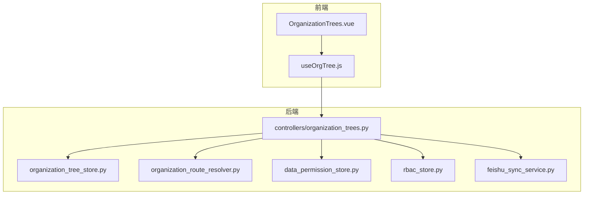
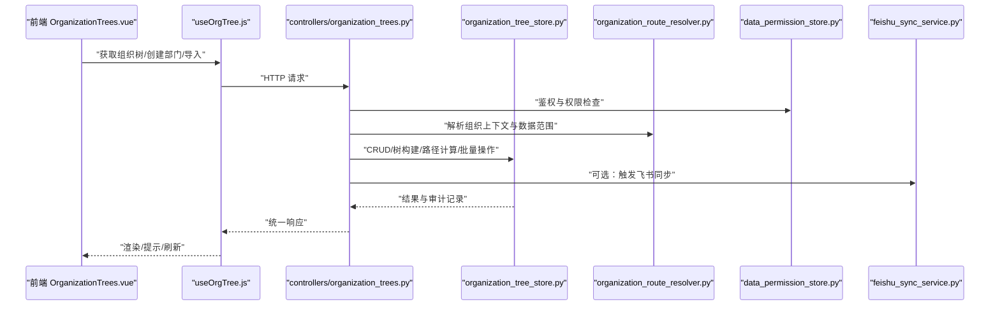
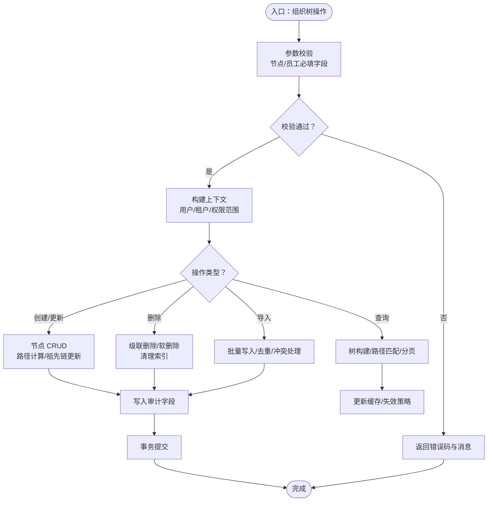
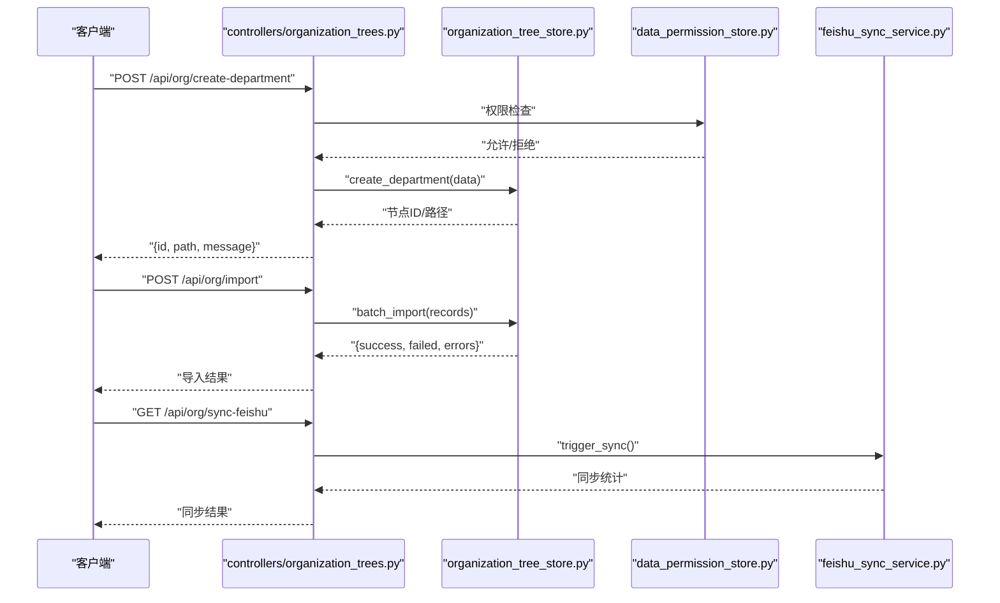
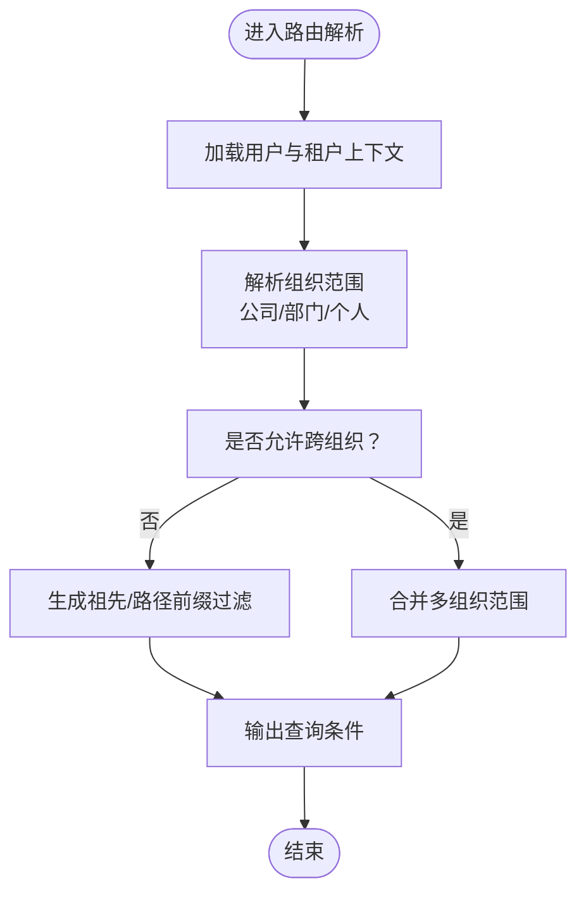
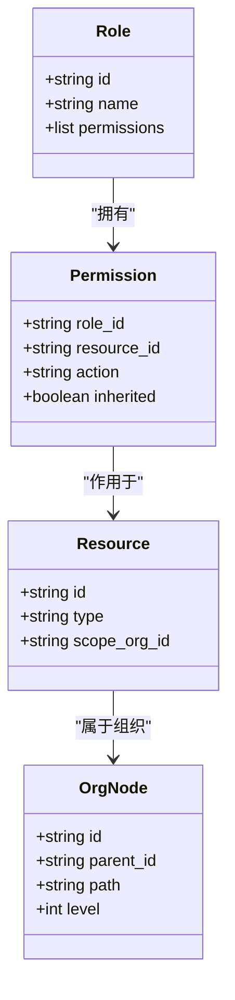
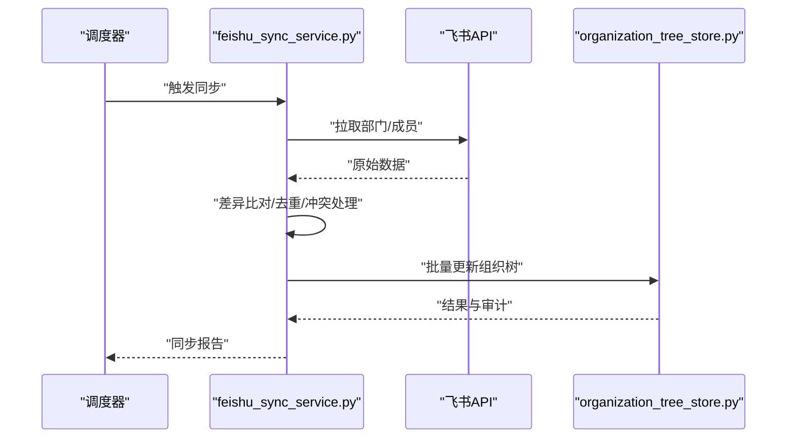
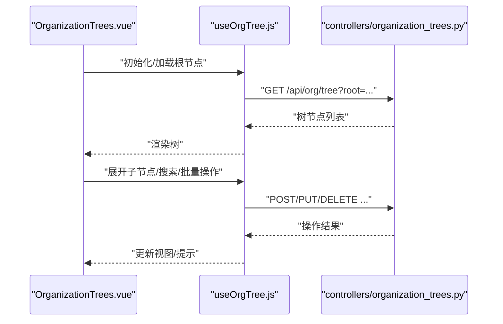
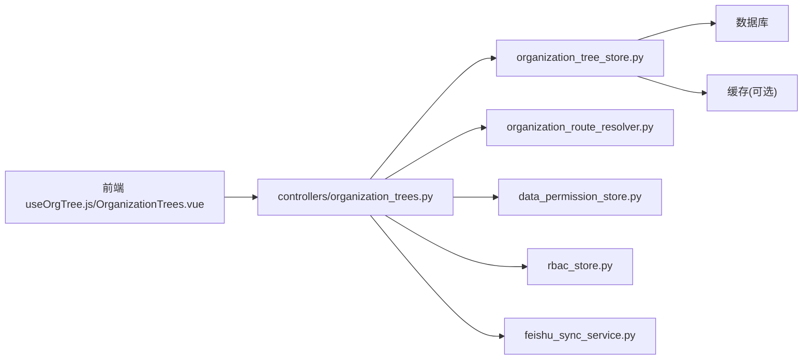

# 组织树存储

<cite>
**本文引用的文件**   
- [organization_tree_store.py](file://backend/organization_tree_store.py)
- [controllers/organization_trees.py](file://backend/controllers/organization_trees.py)
- [organization_route_resolver.py](file://backend/organization_route_resolver.py)
- [data_permission_store.py](file://backend/data_permission_store.py)
- [rbac_store.py](file://backend/rbac_store.py)
- [feishu_sync_service.py](file://backend/feishu_sync_service.py)
- [frontend/src/composables/useOrgTree.js](file://frontend/src/composables/useOrgTree.js)
- [frontend/src/views/OrganizationTrees.vue](file://frontend/src/views/OrganizationTrees.vue)
</cite>

## 目录
1. [简介](#简介)
2. [项目结构](#项目结构)
3. [核心组件](#核心组件)
4. [架构总览](#架构总览)
5. [详细组件分析](#详细组件分析)
6. [依赖关系分析](#依赖关系分析)
7. [性能考虑](#性能考虑)
8. [故障排查指南](#故障排查指南)
9. [结论](#结论)
10. [附录](#附录)

## 简介
本文件为 SmartAsk 智能问数平台的“组织树存储”模块提供完整的开发文档。内容涵盖企业组织架构的层次结构设计（部门层级、员工归属与组织关系）、组织树的 CRUD 操作、树形结构查询与路径计算算法、权限继承机制、数据隔离策略与跨组织访问控制，以及组织同步接口、批量导入导出与变更追踪。同时给出组织管理示例（部门创建、员工分配、权限继承、查询优化）和大规模组织数据的性能优化与缓存策略建议。

## 项目结构
围绕组织树的核心代码主要分布在后端服务层、控制器层、权限与路由解析、飞书同步服务以及前端组合式 API 与页面中：
- 后端存储与服务：organization_tree_store.py
- 控制器与 API：controllers/organization_trees.py
- 组织路由解析：organization_route_resolver.py
- 数据权限与 RBAC：data_permission_store.py、rbac_store.py
- 飞书同步：feishu_sync_service.py
- 前端组织树交互：useOrgTree.js、OrganizationTrees.vue

**图表来源** 
- [controllers/organization_trees.py](file://backend/controllers/organization_trees.py)
- [organization_tree_store.py](file://backend/organization_tree_store.py)
- [organization_route_resolver.py](file://backend/organization_route_resolver.py)
- [data_permission_store.py](file://backend/data_permission_store.py)
- [rbac_store.py](file://backend/rbac_store.py)
- [feishu_sync_service.py](file://backend/feishu_sync_service.py)
- [frontend/src/composables/useOrgTree.js](file://frontend/src/composables/useOrgTree.js)
- [frontend/src/views/OrganizationTrees.vue](file://frontend/src/views/OrganizationTrees.vue)

**章节来源**
- [controllers/organization_trees.py](file://backend/controllers/organization_trees.py)
- [organization_tree_store.py](file://backend/organization_tree_store.py)
- [organization_route_resolver.py](file://backend/organization_route_resolver.py)
- [data_permission_store.py](file://backend/data_permission_store.py)
- [rbac_store.py](file://backend/rbac_store.py)
- [feishu_sync_service.py](file://backend/feishu_sync_service.py)
- [frontend/src/composables/useOrgTree.js](file://frontend/src/composables/useOrgTree.js)
- [frontend/src/views/OrganizationTrees.vue](file://frontend/src/views/OrganizationTrees.vue)

## 核心组件
- 组织树存储层（organization_tree_store.py）
  - 负责组织节点（部门/团队/公司）与员工的持久化、树形构建、祖先/后代遍历、路径计算、版本与审计字段维护等。
  - 关键能力包括：节点增删改查、父子关系维护、路径编码（如段码或全路径）、子树展开、按路径/ID 快速定位、批量导入导出。
- 控制器层（controllers/organization_trees.py）
  - 暴露 RESTful API：创建部门、移动部门、添加/移除员工、查询树、批量导入/导出、同步飞书、变更日志查询等。
  - 校验输入、权限检查、事务边界、错误封装与返回。
- 组织路由解析（organization_route_resolver.py）
  - 根据当前用户所属组织上下文，解析数据访问范围（租户/部门/个人），决定查询过滤条件与可见性。
- 数据权限与 RBAC（data_permission_store.py、rbac_store.py）
  - 定义角色、资源、权限模型；支持基于组织的权限继承与覆盖；提供权限判定与合并策略。
- 飞书同步（feishu_sync_service.py）
  - 对接飞书组织架构，增量/全量同步部门与成员，处理冲突与去重，触发组织树重建与缓存更新。
- 前端组合式 API（useOrgTree.js）与页面（OrganizationTrees.vue）
  - 封装组织树请求、本地状态管理、懒加载子树、搜索与筛选、拖拽排序、批量操作与反馈。

**章节来源**
- [organization_tree_store.py](file://backend/organization_tree_store.py)
- [controllers/organization_trees.py](file://backend/controllers/organization_trees.py)
- [organization_route_resolver.py](file://backend/organization_route_resolver.py)
- [data_permission_store.py](file://backend/data_permission_store.py)
- [rbac_store.py](file://backend/rbac_store.py)
- [feishu_sync_service.py](file://backend/feishu_sync_service.py)
- [frontend/src/composables/useOrgTree.js](file://frontend/src/composables/useOrgTree.js)
- [frontend/src/views/OrganizationTrees.vue](file://frontend/src/views/OrganizationTrees.vue)

## 架构总览
整体采用分层架构：前端通过组合式 API 调用后端控制器，控制器协调存储层、权限与路由解析、外部同步服务，最终落库并维护缓存与审计信息。

**图表来源** 
- [controllers/organization_trees.py](file://backend/controllers/organization_trees.py)
- [organization_tree_store.py](file://backend/organization_tree_store.py)
- [organization_route_resolver.py](file://backend/organization_route_resolver.py)
- [data_permission_store.py](file://backend/data_permission_store.py)
- [feishu_sync_service.py](file://backend/feishu_sync_service.py)
- [frontend/src/composables/useOrgTree.js](file://frontend/src/composables/useOrgTree.js)
- [frontend/src/views/OrganizationTrees.vue](file://frontend/src/views/OrganizationTrees.vue)

## 详细组件分析

### 组织树存储层（organization_tree_store.py）
- 职责
  - 组织节点（部门/团队/公司）与员工记录的增删改查
  - 树形结构构建（根节点识别、父子关系、深度/层级）
  - 路径计算（段码/全路径/祖先链）
  - 子树展开、祖先/后代遍历、路径前缀匹配
  - 批量导入/导出、变更审计字段维护（创建人、时间戳、版本号）
- 数据结构要点
  - 节点：唯一标识、父节点、名称、类型、路径、层级、状态、扩展属性
  - 员工：唯一标识、姓名、邮箱、所属节点、入职/离职时间、状态
  - 索引：父节点索引、路径前缀索引、节点 ID 索引、员工-组织映射
- 复杂度与优化
  - 树构建 O(n log n) 或 O(n)（取决于排序与哈希）
  - 路径前缀查询利用 B-tree/倒排索引，避免全表扫描
  - 批量操作使用事务与分批提交，降低锁竞争
- 错误处理
  - 循环引用检测、非法路径、重复 ID、外键约束失败
  - 幂等写入与重试策略（导入场景）

**图表来源** 
- [organization_tree_store.py](file://backend/organization_tree_store.py)

**章节来源**
- [organization_tree_store.py](file://backend/organization_tree_store.py)

### 控制器层（controllers/organization_trees.py）
- 职责
  - 暴露组织树相关 API：创建部门、移动部门、添加/移除员工、查询树、批量导入/导出、同步飞书、变更日志
  - 输入校验、权限检查、事务边界、错误封装
- 典型流程
  - 接收请求 -> 鉴权 -> 解析组织上下文 -> 调用存储层 -> 返回结果
  - 批量导入：分片读取、并发写入、失败回滚与部分成功报告
  - 同步接口：拉取飞书数据、差异比对、增量更新、触发重建

**图表来源** 
- [controllers/organization_trees.py](file://backend/controllers/organization_trees.py)
- [organization_tree_store.py](file://backend/organization_tree_store.py)
- [data_permission_store.py](file://backend/data_permission_store.py)
- [feishu_sync_service.py](file://backend/feishu_sync_service.py)

**章节来源**
- [controllers/organization_trees.py](file://backend/controllers/organization_trees.py)

### 组织路由解析（organization_route_resolver.py）
- 职责
  - 根据当前用户与租户上下文，解析数据访问范围（公司/部门/个人）
  - 将组织范围转换为查询过滤条件（如 WHERE org_path LIKE '.../%'）
  - 与权限系统联动，决定是否允许跨组织访问
- 关键点
  - 路径前缀匹配 vs 祖先集合匹配的性能权衡
  - 缓存组织范围映射，减少重复计算

**图表来源** 
- [organization_route_resolver.py](file://backend/organization_route_resolver.py)

**章节来源**
- [organization_route_resolver.py](file://backend/organization_route_resolver.py)

### 数据权限与 RBAC（data_permission_store.py、rbac_store.py）
- 职责
  - 定义角色、资源、权限三元组
  - 支持基于组织的权限继承（上级部门权限向下传递，可被覆盖）
  - 提供权限判定接口（是否允许读/写/管理某资源）
- 设计要点
  - 权限合并策略：显式拒绝优先、显式允许次之、默认拒绝
  - 组织维度权限与全局权限的优先级
  - 审计与变更记录（谁在何时修改了权限）

**图表来源** 
- [data_permission_store.py](file://backend/data_permission_store.py)
- [rbac_store.py](file://backend/rbac_store.py)

**章节来源**
- [data_permission_store.py](file://backend/data_permission_store.py)
- [rbac_store.py](file://backend/rbac_store.py)

### 飞书同步（feishu_sync_service.py）
- 职责
  - 定时/手动触发同步，拉取飞书部门与成员数据
  - 增量对比：新增、更新、删除（离职/调岗）
  - 冲突处理：同名部门、重复员工、历史路径变化
  - 触发组织树重建与缓存失效
- 关键点
  - 幂等写入（基于外部 ID 去重）
  - 失败重试与告警
  - 同步进度与结果报告

**图表来源** 
- [feishu_sync_service.py](file://backend/feishu_sync_service.py)
- [organization_tree_store.py](file://backend/organization_tree_store.py)

**章节来源**
- [feishu_sync_service.py](file://backend/feishu_sync_service.py)

### 前端组合式 API 与页面（useOrgTree.js、OrganizationTrees.vue）
- 职责
  - useOrgTree.js：封装组织树请求、本地状态、懒加载、搜索筛选、批量操作
  - OrganizationTrees.vue：展示树形结构、拖拽排序、创建/编辑/删除、导入导出、同步状态
- 交互流程
  - 首次加载根节点 -> 按需展开子节点 -> 搜索高亮 -> 批量选中 -> 提交变更
  - 错误提示与重试机制

**图表来源** 
- [frontend/src/composables/useOrgTree.js](file://frontend/src/composables/useOrgTree.js)
- [frontend/src/views/OrganizationTrees.vue](file://frontend/src/views/OrganizationTrees.vue)
- [controllers/organization_trees.py](file://backend/controllers/organization_trees.py)

**章节来源**
- [frontend/src/composables/useOrgTree.js](file://frontend/src/composables/useOrgTree.js)
- [frontend/src/views/OrganizationTrees.vue](file://frontend/src/views/OrganizationTrees.vue)

## 依赖关系分析
- 控制器依赖存储层、权限与路由解析、同步服务
- 存储层依赖数据库与缓存（如有）
- 权限系统依赖 RBAC 与组织树结构
- 前端依赖控制器 API 与本地状态管理

**图表来源** 
- [controllers/organization_trees.py](file://backend/controllers/organization_trees.py)
- [organization_tree_store.py](file://backend/organization_tree_store.py)
- [organization_route_resolver.py](file://backend/organization_route_resolver.py)
- [data_permission_store.py](file://backend/data_permission_store.py)
- [rbac_store.py](file://backend/rbac_store.py)
- [feishu_sync_service.py](file://backend/feishu_sync_service.py)
- [frontend/src/composables/useOrgTree.js](file://frontend/src/composables/useOrgTree.js)
- [frontend/src/views/OrganizationTrees.vue](file://frontend/src/views/OrganizationTrees.vue)

**章节来源**
- [controllers/organization_trees.py](file://backend/controllers/organization_trees.py)
- [organization_tree_store.py](file://backend/organization_tree_store.py)
- [organization_route_resolver.py](file://backend/organization_route_resolver.py)
- [data_permission_store.py](file://backend/data_permission_store.py)
- [rbac_store.py](file://backend/rbac_store.py)
- [feishu_sync_service.py](file://backend/feishu_sync_service.py)
- [frontend/src/composables/useOrgTree.js](file://frontend/src/composables/useOrgTree.js)
- [frontend/src/views/OrganizationTrees.vue](file://frontend/src/views/OrganizationTrees.vue)

## 性能考虑
- 树构建与查询
  - 使用路径前缀索引与祖先集合索引，避免递归查询
  - 分页与懒加载：仅加载当前可见节点，按需展开子树
- 批量操作
  - 分批次写入，设置合理批次大小，避免长事务
  - 使用 UPSERT 与幂等键，减少重复写入
- 缓存策略
  - 热点组织树片段缓存（TTL 与失效策略）
  - 权限范围缓存，减少解析开销
- 并发与锁
  - 读写分离：读多写少场景下，读副本加速查询
  - 细粒度锁：按节点或路径段加锁，降低冲突
- 监控与告警
  - 慢查询日志、导入耗时、同步失败率、缓存命中率

[本节为通用性能指导，不直接分析具体文件]

## 故障排查指南
- 常见问题
  - 循环引用：创建/移动部门时检测到环路，需检查父子关系
  - 路径不一致：路径前缀与祖先链不一致，需重建索引
  - 权限不足：RBAC 未授予相应角色或组织范围限制
  - 同步失败：飞书 API 限流或认证过期，需重试与刷新令牌
- 排查步骤
  - 查看控制器日志与错误码
  - 检查存储层审计字段与版本号
  - 验证权限配置与组织范围解析
  - 确认同步任务状态与飞书返回码

**章节来源**
- [controllers/organization_trees.py](file://backend/controllers/organization_trees.py)
- [organization_tree_store.py](file://backend/organization_tree_store.py)
- [data_permission_store.py](file://backend/data_permission_store.py)
- [feishu_sync_service.py](file://backend/feishu_sync_service.py)

## 结论
组织树存储模块以清晰的层次结构与完善的权限体系为核心，支撑企业级组织架构管理与数据隔离。通过路径计算、祖先/后代遍历、批量导入导出与飞书同步，满足复杂组织场景下的 CRUD、查询与变更需求。结合缓存、索引与并发控制，可在大规模组织数据下保持良好性能与稳定性。

[本节为总结性内容，不直接分析具体文件]

## 附录
- 组织管理示例
  - 部门创建：调用控制器创建接口，自动计算路径与祖先链
  - 员工分配：绑定员工到目标节点，更新员工-组织映射
  - 权限继承：上级部门权限向下传递，支持覆盖与例外
  - 查询优化：使用路径前缀与祖先集合索引，分页与懒加载
- 变更追踪
  - 审计字段记录创建/修改人、时间戳、版本号
  - 导入/同步任务记录成功/失败明细
- 最佳实践
  - 保持路径语义一致，避免频繁重构
  - 批量操作分片提交，监控失败率
  - 权限最小化原则，定期审计

[本节为补充说明，不直接分析具体文件]