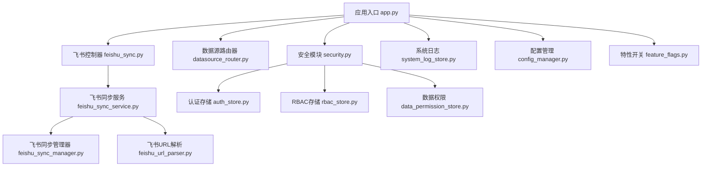
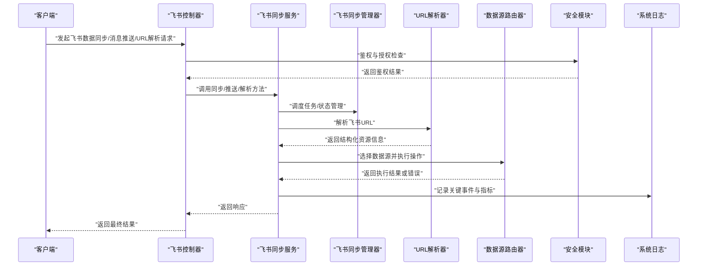
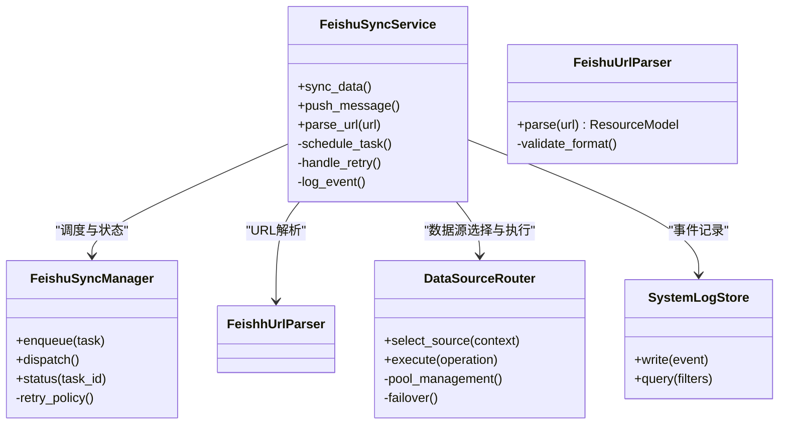
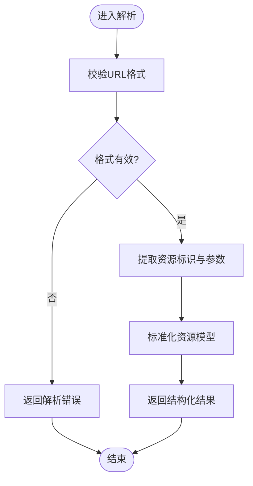
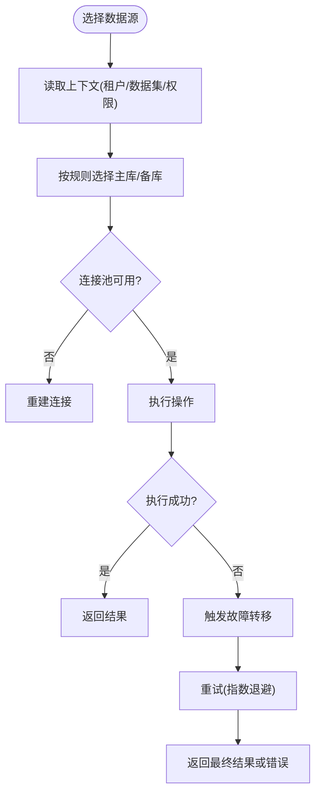
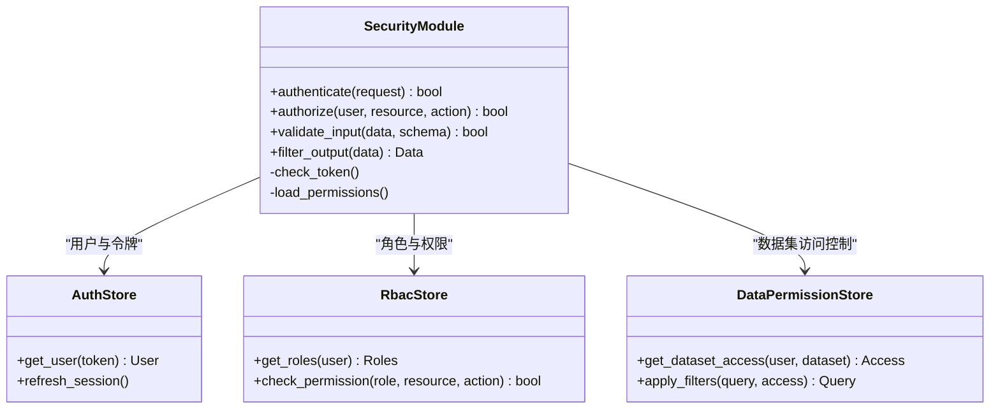
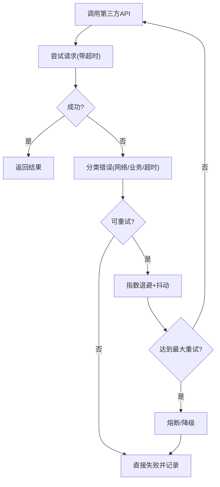
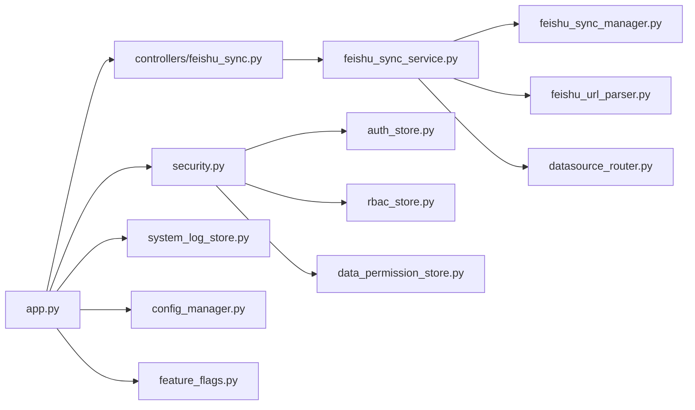

# 系统集成

<cite>
**本文引用的文件**   
- [backend/app.py](file://backend/app.py)
- [backend/controllers/feishu_sync.py](file://backend/controllers/feishu_sync.py)
- [backend/feishu_sync_service.py](file://backend/feishu_sync_service.py)
- [backend/feishu_sync_manager.py](file://backend/feishu_sync_manager.py)
- [backend/feishu_url_parser.py](file://backend/feishu_url_parser.py)
- [backend/datasource_router.py](file://backend/datasource_router.py)
- [backend/security.py](file://backend/security.py)
- [backend/auth_store.py](file://backend/auth_store.py)
- [backend/rbac_store.py](file://backend/rbac_store.py)
- [backend/data_permission_store.py](file://backend/data_permission_store.py)
- [backend/system_log_store.py](file://backend/system_log_store.py)
- [backend/config_manager.py](file://backend/config_manager.py)
- [backend/feature_flags.py](file://backend/feature_flags.py)
- [scripts/integration_test.py](file://scripts/integration_test.py)
</cite>

## 目录
1. [简介](#简介)
2. [项目结构](#项目结构)
3. [核心组件](#核心组件)
4. [架构总览](#架构总览)
5. [详细组件分析](#详细组件分析)
6. [依赖关系分析](#依赖关系分析)
7. [性能考量](#性能考量)
8. [故障排查指南](#故障排查指南)
9. [结论](#结论)
10. [附录](#附录)

## 简介
本文件为 SmartAsk 智能问数平台的“系统集成”模块提供全面开发文档，重点覆盖以下方面：
- 飞书集成：数据同步服务、消息推送与 URL 解析能力
- 数据源路由器：多数据库支持、连接池管理与故障转移策略
- 安全模块：身份认证、授权控制、输入验证与输出过滤
- 第三方 API 集成最佳实践：错误处理、重试机制与限流控制
- 集成测试策略与模拟服务使用
- 性能监控、日志记录与故障排查

## 项目结构
系统集成相关代码主要位于后端目录 backend 中，围绕控制器、服务层、存储层与配置管理展开。关键路径如下：
- 飞书集成：controllers/feishu_sync.py、feishu_sync_service.py、feishu_sync_manager.py、feishu_url_parser.py
- 数据源路由：datasource_router.py
- 安全与权限：security.py、auth_store.py、rbac_store.py、data_permission_store.py
- 系统日志：system_log_store.py
- 应用入口与装配：app.py
- 配置与特性开关：config_manager.py、feature_flags.py
- 集成测试：scripts/integration_test.py

**图表来源** 
- [backend/app.py](file://backend/app.py)
- [backend/controllers/feishu_sync.py](file://backend/controllers/feishu_sync.py)
- [backend/feishu_sync_service.py](file://backend/feishu_sync_service.py)
- [backend/feishu_sync_manager.py](file://backend/feishu_sync_manager.py)
- [backend/feishu_url_parser.py](file://backend/feishu_url_parser.py)
- [backend/datasource_router.py](file://backend/datasource_router.py)
- [backend/security.py](file://backend/security.py)
- [backend/auth_store.py](file://backend/auth_store.py)
- [backend/rbac_store.py](file://backend/rbac_store.py)
- [backend/data_permission_store.py](file://backend/data_permission_store.py)
- [backend/system_log_store.py](file://backend/system_log_store.py)
- [backend/config_manager.py](file://backend/config_manager.py)
- [backend/feature_flags.py](file://backend/feature_flags.py)

**章节来源**
- [backend/app.py](file://backend/app.py)
- [backend/controllers/feishu_sync.py](file://backend/controllers/feishu_sync.py)
- [backend/feishu_sync_service.py](file://backend/feishu_sync_service.py)
- [backend/feishu_sync_manager.py](file://backend/feishu_sync_manager.py)
- [backend/feishu_url_parser.py](file://backend/feishu_url_parser.py)
- [backend/datasource_router.py](file://backend/datasource_router.py)
- [backend/security.py](file://backend/security.py)
- [backend/auth_store.py](file://backend/auth_store.py)
- [backend/rbac_store.py](file://backend/rbac_store.py)
- [backend/data_permission_store.py](file://backend/data_permission_store.py)
- [backend/system_log_store.py](file://backend/system_log_store.py)
- [backend/config_manager.py](file://backend/config_manager.py)
- [backend/feature_flags.py](file://backend/feature_flags.py)

## 核心组件
- 飞书数据同步服务：负责拉取/推送飞书数据、调度任务、状态管理与异常恢复
- 飞书 URL 解析器：统一解析飞书链接（文档、表格、多维表等），提取资源标识与访问参数
- 数据源路由器：根据上下文选择目标数据库，维护连接池并实现故障转移
- 安全模块：统一鉴权、授权、输入校验与输出过滤
- 系统日志与配置管理：记录运行事件、暴露配置项与特性开关

**章节来源**
- [backend/feishu_sync_service.py](file://backend/feishu_sync_service.py)
- [backend/feishu_sync_manager.py](file://backend/feishu_sync_manager.py)
- [backend/feishu_url_parser.py](file://backend/feishu_url_parser.py)
- [backend/datasource_router.py](file://backend/datasource_router.py)
- [backend/security.py](file://backend/security.py)
- [backend/system_log_store.py](file://backend/system_log_store.py)
- [backend/config_manager.py](file://backend/config_manager.py)
- [backend/feature_flags.py](file://backend/feature_flags.py)

## 架构总览
系统集成采用分层设计：控制器接收请求，服务层编排业务逻辑，存储层对接外部系统与持久化，配置与特性开关驱动运行时行为。

**图表来源** 
- [backend/controllers/feishu_sync.py](file://backend/controllers/feishu_sync.py)
- [backend/feishu_sync_service.py](file://backend/feishu_sync_service.py)
- [backend/feishu_sync_manager.py](file://backend/feishu_sync_manager.py)
- [backend/feishu_url_parser.py](file://backend/feishu_url_parser.py)
- [backend/datasource_router.py](file://backend/datasource_router.py)
- [backend/security.py](file://backend/security.py)
- [backend/system_log_store.py](file://backend/system_log_store.py)

## 详细组件分析

### 飞书数据同步服务
职责与流程：
- 接收来自控制器的同步/推送/解析请求
- 通过管理器进行任务调度、状态跟踪与失败重试
- 调用 URL 解析器将飞书链接转换为内部资源模型
- 借助数据源路由器执行数据读写或转换
- 记录关键事件到系统日志

**图表来源** 
- [backend/feishu_sync_service.py](file://backend/feishu_sync_service.py)
- [backend/feishu_sync_manager.py](file://backend/feishu_sync_manager.py)
- [backend/feishu_url_parser.py](file://backend/feishu_url_parser.py)
- [backend/datasource_router.py](file://backend/datasource_router.py)
- [backend/system_log_store.py](file://backend/system_log_store.py)

**章节来源**
- [backend/feishu_sync_service.py](file://backend/feishu_sync_service.py)
- [backend/feishu_sync_manager.py](file://backend/feishu_sync_manager.py)
- [backend/feishu_url_parser.py](file://backend/feishu_url_parser.py)
- [backend/datasource_router.py](file://backend/datasource_router.py)
- [backend/system_log_store.py](file://backend/system_log_store.py)

### 飞书 URL 解析器
功能要点：
- 识别不同飞书资源类型（文档、表格、多维表等）
- 提取资源 ID、组织空间、权限参数等
- 对非法或过期链接进行快速失败与提示

**图表来源** 
- [backend/feishu_url_parser.py](file://backend/feishu_url_parser.py)

**章节来源**
- [backend/feishu_url_parser.py](file://backend/feishu_url_parser.py)

### 数据源路由器
工作机制：
- 基于上下文（租户、数据集、权限）选择目标数据源
- 管理连接池，复用连接并限制并发
- 实现故障转移：主库不可用时自动切换到备用库
- 统一封装查询执行与结果归一化

**图表来源** 
- [backend/datasource_router.py](file://backend/datasource_router.py)

**章节来源**
- [backend/datasource_router.py](file://backend/datasource_router.py)

### 安全模块
实现要点：
- 身份认证：统一鉴权入口，校验令牌/会话
- 授权控制：基于 RBAC 的数据与接口级权限校验
- 输入验证：对请求参数进行严格校验与清洗
- 输出过滤：对返回数据进行脱敏与格式化

**图表来源** 
- [backend/security.py](file://backend/security.py)
- [backend/auth_store.py](file://backend/auth_store.py)
- [backend/rbac_store.py](file://backend/rbac_store.py)
- [backend/data_permission_store.py](file://backend/data_permission_store.py)

**章节来源**
- [backend/security.py](file://backend/security.py)
- [backend/auth_store.py](file://backend/auth_store.py)
- [backend/rbac_store.py](file://backend/rbac_store.py)
- [backend/data_permission_store.py](file://backend/data_permission_store.py)

### 第三方 API 集成最佳实践
建议模式：
- 错误处理：区分网络错误、业务错误与超时，统一包装为可追踪的错误对象
- 重试机制：指数退避与抖动，避免雪崩；设置最大重试次数与熔断阈值
- 限流控制：基于令牌桶或滑动窗口，保护下游服务与自身稳定性
- 幂等性：对写操作提供幂等键，确保重复请求不产生副作用
- 监控与日志：记录请求耗时、状态码、错误堆栈与关键指标

[本图为概念性流程图，不映射具体源码文件]

## 依赖关系分析
系统集成模块的依赖关系清晰，控制器依赖服务层，服务层依赖管理器、解析器与路由器，安全模块贯穿各层，日志与配置作为横切关注点。

**图表来源** 
- [backend/app.py](file://backend/app.py)
- [backend/controllers/feishu_sync.py](file://backend/controllers/feishu_sync.py)
- [backend/feishu_sync_service.py](file://backend/feishu_sync_service.py)
- [backend/feishu_sync_manager.py](file://backend/feishu_sync_manager.py)
- [backend/feishu_url_parser.py](file://backend/feishu_url_parser.py)
- [backend/datasource_router.py](file://backend/datasource_router.py)
- [backend/security.py](file://backend/security.py)
- [backend/auth_store.py](file://backend/auth_store.py)
- [backend/rbac_store.py](file://backend/rbac_store.py)
- [backend/data_permission_store.py](file://backend/data_permission_store.py)
- [backend/system_log_store.py](file://backend/system_log_store.py)
- [backend/config_manager.py](file://backend/config_manager.py)
- [backend/feature_flags.py](file://backend/feature_flags.py)

**章节来源**
- [backend/app.py](file://backend/app.py)
- [backend/controllers/feishu_sync.py](file://backend/controllers/feishu_sync.py)
- [backend/feishu_sync_service.py](file://backend/feishu_sync_service.py)
- [backend/feishu_sync_manager.py](file://backend/feishu_sync_manager.py)
- [backend/feishu_url_parser.py](file://backend/feishu_url_parser.py)
- [backend/datasource_router.py](file://backend/datasource_router.py)
- [backend/security.py](file://backend/security.py)
- [backend/auth_store.py](file://backend/auth_store.py)
- [backend/rbac_store.py](file://backend/rbac_store.py)
- [backend/data_permission_store.py](file://backend/data_permission_store.py)
- [backend/system_log_store.py](file://backend/system_log_store.py)
- [backend/config_manager.py](file://backend/config_manager.py)
- [backend/feature_flags.py](file://backend/feature_flags.py)

## 性能考量
- 连接池优化：合理设置最大连接数、空闲回收与超时时间，避免连接泄漏
- 异步与批处理：对飞书数据同步与消息推送采用异步队列与批量提交，降低延迟
- 缓存策略：对频繁读取的配置与元数据使用本地/分布式缓存
- 限流与背压：在第三方 API 调用与数据库写入处实施限流，防止过载
- 监控指标：采集 QPS、延迟分布、错误率、连接池使用率与 GC 情况

[本节为通用指导，不直接分析具体文件]

## 故障排查指南
常见问题与定位步骤：
- 飞书同步失败：检查 URL 解析是否成功、任务调度状态、重试次数与错误日志
- 数据源连接异常：查看连接池状态、主备切换日志、SQL 执行耗时与错误码
- 鉴权失败：确认令牌有效性、角色权限配置、数据集访问控制规则
- 第三方 API 错误：核对限流与熔断状态、重试策略与超时配置
- 日志与监控：集中检索系统日志，结合指标看板定位瓶颈与异常

**章节来源**
- [backend/system_log_store.py](file://backend/system_log_store.py)
- [backend/config_manager.py](file://backend/config_manager.py)
- [backend/feature_flags.py](file://backend/feature_flags.py)

## 结论
系统集成模块以清晰的层次结构与模块化设计支撑了飞书集成、数据源路由与安全管控。通过合理的连接池管理、故障转移、重试与限流策略，系统在稳定性与可扩展性上具备良好基础。建议在后续迭代中持续完善监控与可观测性，强化自动化测试与模拟服务，提升整体交付质量与运维效率。

[本节为总结性内容，不直接分析具体文件]

## 附录
- 集成测试策略：使用 scripts/integration_test.py 构建端到端用例，覆盖飞书同步、URL 解析、数据源路由与安全校验
- 模拟服务：针对飞书 API 与外部数据源提供 Mock 服务，隔离不稳定依赖，加速开发与回归测试
- 部署与配置：通过 config_manager.py 与 feature_flags.py 管理环境变量与特性开关，支持灰度发布与动态调整

**章节来源**
- [scripts/integration_test.py](file://scripts/integration_test.py)
- [backend/config_manager.py](file://backend/config_manager.py)
- [backend/feature_flags.py](file://backend/feature_flags.py)