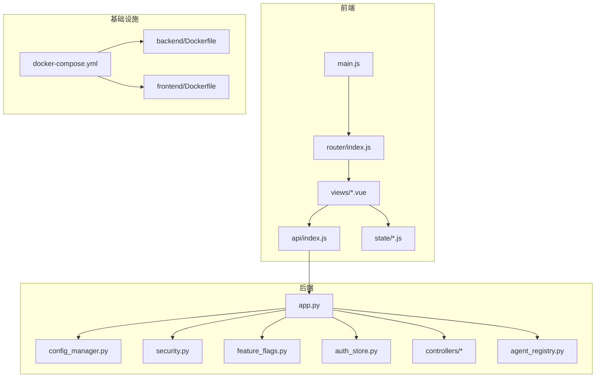
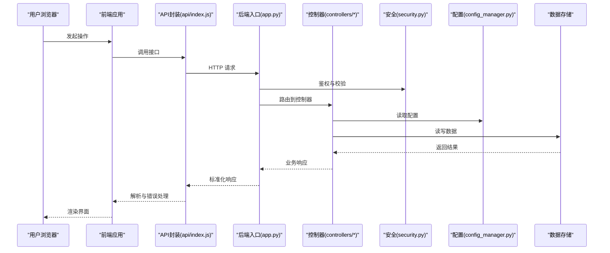
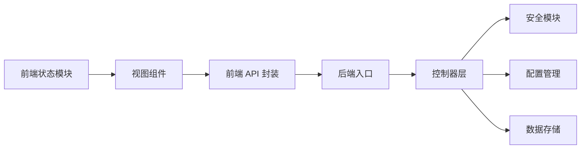

# 代码规范与约定

<cite>
**本文引用的文件**   
- [backend/app.py](file://backend/app.py)
- [backend/config_manager.py](file://backend/config_manager.py)
- [backend/security.py](file://backend/security.py)
- [backend/feature_flags.py](file://backend/feature_flags.py)
- [backend/auth_store.py](file://backend/auth_store.py)
- [backend/controllers/auth.py](file://backend/controllers/auth.py)
- [backend/controllers/ask_flow.py](file://backend/controllers/ask_flow.py)
- [backend/agent_registry.py](file://backend/agent_registry.py)
- [frontend/src/main.js](file://frontend/src/main.js)
- [frontend/src/router/index.js](file://frontend/src/router/index.js)
- [frontend/src/api/index.js](file://frontend/src/api/index.js)
- [frontend/src/state/smartAskSession.js](file://frontend/src/state/smartAskSession.js)
- [frontend/src/views/SmartAsk.vue](file://frontend/src/views/SmartAsk.vue)
- [frontend/package.json](file://frontend/package.json)
- [frontend/vite.config.js](file://frontend/vite.config.js)
- [docker-compose.yml](file://docker-compose.yml)
- [backend/Dockerfile](file://backend/Dockerfile)
- [frontend/Dockerfile](file://frontend/Dockerfile)
</cite>

## 目录
1. [引言](#引言)
2. [项目结构](#项目结构)
3. [核心组件](#核心组件)
4. [架构总览](#架构总览)
5. [详细组件分析](#详细组件分析)
6. [依赖关系分析](#依赖关系分析)
7. [性能考虑](#性能考虑)
8. [故障排查指南](#故障排查指南)
9. [结论](#结论)
10. [附录](#附录)

## 引言
本文件为 SmartAsk 项目的“代码规范与开发约定”权威文档，覆盖 Python 后端、JavaScript/Vue.js 前端、Git 版本控制、配置与环境变量、日志记录、性能优化以及 IDE 配置建议。目标是在保证一致性与可维护性的前提下，提升团队协作效率与交付质量。

## 项目结构
SmartAsk 采用前后端分离的模块化结构：
- backend：Python 后端服务，包含控制器、业务逻辑、数据访问、迁移脚本与工具脚本。
- frontend：Vue.js 前端应用，基于 Vite 构建，使用组合式 API 与模块化状态管理。
- docker：容器化编排与镜像构建。
- scripts：运维与测试脚本。
- docs：产品与工程文档。

**图表来源** 
- [backend/app.py](file://backend/app.py)
- [frontend/src/main.js](file://frontend/src/main.js)
- [frontend/src/router/index.js](file://frontend/src/router/index.js)
- [frontend/src/api/index.js](file://frontend/src/api/index.js)
- [docker-compose.yml](file://docker-compose.yml)

**章节来源**
- [backend/app.py](file://backend/app.py)
- [frontend/src/main.js](file://frontend/src/main.js)
- [frontend/src/router/index.js](file://frontend/src/router/index.js)
- [frontend/src/api/index.js](file://frontend/src/api/index.js)
- [docker-compose.yml](file://docker-compose.yml)

## 核心组件
- 后端入口与路由：由 app.py 统一注册路由与中间件，集中处理请求生命周期。
- 配置管理：config_manager.py 负责加载、校验与缓存配置项。
- 安全与鉴权：security.py 提供加密、签名与权限校验；auth_store.py 管理会话与用户上下文。
- 功能开关：feature_flags.py 实现运行时特性开关。
- 控制器层：controllers/* 按领域划分（认证、问数流程、数据集等）。
- 前端入口与路由：main.js 初始化应用，router/index.js 定义页面路由。
- API 封装：api/index.js 统一 HTTP 调用、错误处理与重试策略。
- 状态管理：state/*.js 以模块化的方式组织会话、历史与特性标志。

**章节来源**
- [backend/app.py](file://backend/app.py)
- [backend/config_manager.py](file://backend/config_manager.py)
- [backend/security.py](file://backend/security.py)
- [backend/feature_flags.py](file://backend/feature_flags.py)
- [backend/auth_store.py](file://backend/auth_store.py)
- [backend/controllers/auth.py](file://backend/controllers/auth.py)
- [backend/controllers/ask_flow.py](file://backend/controllers/ask_flow.py)
- [frontend/src/main.js](file://frontend/src/main.js)
- [frontend/src/router/index.js](file://frontend/src/router/index.js)
- [frontend/src/api/index.js](file://frontend/src/api/index.js)
- [frontend/src/state/smartAskSession.js](file://frontend/src/state/smartAskSession.js)

## 架构总览
SmartAsk 采用分层架构：
- 表现层：Vue 单页应用，通过 API 层与后端交互。
- 应用层：后端控制器协调业务流程，调用领域服务与存储。
- 数据层：数据库与外部系统（如飞书）集成。
- 横切关注点：配置、安全、日志、监控、特性开关。

**图表来源** 
- [frontend/src/api/index.js](file://frontend/src/api/index.js)
- [backend/app.py](file://backend/app.py)
- [backend/controllers/auth.py](file://backend/controllers/auth.py)
- [backend/security.py](file://backend/security.py)
- [backend/config_manager.py](file://backend/config_manager.py)

## 详细组件分析

### Python 后端代码规范
- PEP 8 遵循
  - 缩进与行宽：统一 4 空格缩进，行宽不超过 120 字符。
  - 导入顺序：标准库、第三方库、本地模块分组，空行分隔。
  - 命名规范：模块小写下划线，类大驼峰，函数/变量小写下划线，常量全大写。
  - 注释与文档字符串：模块级 docstring、函数级说明、关键逻辑内联注释。
- 文件组织结构
  - controllers/*：按领域划分的控制器，单一职责。
  - 业务逻辑：按能力域拆分（如 ask_flow、smartask_advanced/basic）。
  - 数据访问：独立仓储或 DAO 层，避免在控制器中直接写 SQL。
  - 配置与安全：集中管理，避免硬编码。
- 错误处理模式
  - 统一异常类型与错误码，区分客户端错误与服务端错误。
  - 控制器层捕获并转换为标准 JSON 响应。
  - 记录结构化日志，包含请求 ID、用户 ID、耗时与关键参数脱敏。
- 配置与环境变量
  - 使用 config_manager.py 加载环境变量与配置文件，提供默认值与校验。
  - 敏感信息通过环境变量注入，禁止写入仓库。
- 日志记录标准
  - 分级日志（DEBUG/INFO/WARNING/ERROR），统一格式与输出目标。
  - 关键路径埋点：请求进入/退出、外部调用、异常堆栈。
- 性能优化最佳实践
  - 数据库查询优化：索引、分页、批量操作、避免 N+1。
  - 缓存策略：热点数据缓存（内存/Redis），合理过期与失效。
  - 异步与并发：I/O 密集型任务使用异步或消息队列。
  - 资源限制：连接池大小、超时与重试上限。

**章节来源**
- [backend/app.py](file://backend/app.py)
- [backend/config_manager.py](file://backend/config_manager.py)
- [backend/security.py](file://backend/security.py)
- [backend/feature_flags.py](file://backend/feature_flags.py)
- [backend/auth_store.py](file://backend/auth_store.py)
- [backend/controllers/auth.py](file://backend/controllers/auth.py)
- [backend/controllers/ask_flow.py](file://backend/controllers/ask_flow.py)

### JavaScript/Vue.js 前端代码规范
- ES6+ 语法使用
  - 使用 const/let，避免 var；优先箭头函数与解构赋值。
  - 模块化管理：ESM 模块，按需导入，避免循环依赖。
  - 异步处理：Promise/async-await，统一错误处理与重试。
- 组件设计规范
  - 单一职责：每个组件聚焦一个 UI 能力，props/events 清晰。
  - 命名约定：组件 PascalCase，文件与目录小写下划线或短横线。
  - 样式组织：CSS Modules 或 scoped CSS，主题变量集中管理。
- 状态管理模式
  - 轻量状态：使用模块化 store（如 state/*.js），避免全局污染。
  - 数据流：单向数据流，事件驱动更新，避免双向绑定滥用。
  - 持久化：会话与偏好设置持久化到 localStorage/sessionStorage。
- API 调用封装
  - 统一封装：api/index.js 提供请求拦截、错误处理、重试与取消。
  - 错误映射：将后端错误码映射为用户友好提示。
  - 缓存策略：GET 请求缓存与失效策略，避免重复请求。
- 路由与视图
  - router/index.js 定义路由与守卫，懒加载页面组件。
  - views/*.vue 保持简洁，复杂逻辑下沉至 composables/utils。
- 样式组织
  - 主题变量：styles/angel-theme.css 统一管理颜色、字号、间距。
  - 组件样式：优先 scoped 与模块化，避免全局冲突。

**章节来源**
- [frontend/src/main.js](file://frontend/src/main.js)
- [frontend/src/router/index.js](file://frontend/src/router/index.js)
- [frontend/src/api/index.js](file://frontend/src/api/index.js)
- [frontend/src/state/smartAskSession.js](file://frontend/src/state/smartAskSession.js)
- [frontend/src/views/SmartAsk.vue](file://frontend/src/views/SmartAsk.vue)
- [frontend/package.json](file://frontend/package.json)
- [frontend/vite.config.js](file://frontend/vite.config.js)

### Git 版本控制规范
- 分支策略
  - main：稳定发布分支，仅接受合并与热修复。
  - develop：日常开发分支，集成功能分支。
  - feature/*：功能分支，按需求或任务创建，完成后合并回 develop。
  - hotfix/*：紧急修复分支，从 main 拉取，修复后合并回 main 与 develop。
- 提交信息格式
  - 类型：feat/fix/docs/style/refactor/test/chore/build/ci。
  - 格式：<type>(<scope>): <subject>，附变更原因与影响范围。
- 代码审查流程
  - 所有变更需通过 Pull Request，至少一名 reviewer 批准。
  - 自动化检查：lint、test、build 必须通过。
- 合并策略
  - 优先使用 Squash Merge 保持主分支整洁。
  - 冲突解决需在本地验证后再合并。

### 配置文件管理与环境变量
- 后端配置
  - 使用 config_manager.py 加载 .env 与配置文件，提供默认值与校验。
  - 敏感字段（密钥、密码）通过环境变量注入，禁止明文存储。
- 前端配置
  - 使用 vite.config.js 管理构建与代理，环境变量通过 import.meta.env 访问。
  - 多环境配置：dev/staging/prod 通过不同 .env.* 文件管理。
- Docker 与编排
  - docker-compose.yml 管理服务依赖与端口映射。
  - Dockerfile 固定基础镜像与依赖版本，确保可重现构建。

**章节来源**
- [backend/config_manager.py](file://backend/config_manager.py)
- [frontend/vite.config.js](file://frontend/vite.config.js)
- [docker-compose.yml](file://docker-compose.yml)
- [backend/Dockerfile](file://backend/Dockerfile)
- [frontend/Dockerfile](file://frontend/Dockerfile)

### 日志记录标准
- 后端日志
  - 分级记录：DEBUG（调试）、INFO（关键流程）、WARNING（潜在问题）、ERROR（异常）。
  - 结构化输出：JSON 格式，包含时间戳、级别、模块、请求 ID、用户 ID。
  - 脱敏规则：禁止记录敏感信息（密码、令牌、身份证号）。
- 前端日志
  - 控制台日志：生产环境关闭 DEBUG 日志，保留 ERROR 与警告。
  - 错误上报：统一错误收集与上报，包含堆栈与上下文。

### 性能优化最佳实践
- 后端
  - 数据库：索引优化、查询计划分析、慢查询监控。
  - 缓存：热点数据缓存、分布式锁避免击穿。
  - 并发：异步 I/O、连接池、限流与熔断。
- 前端
  - 打包优化：代码分割、Tree Shaking、压缩与缓存。
  - 网络优化：请求合并、缓存策略、CDN 加速。
  - 渲染优化：虚拟列表、懒加载、防抖节流。

## 依赖关系分析
SmartAsk 的依赖关系清晰分层，前后端通过 API 通信，基础设施由 Docker 编排。

**图表来源** 
- [frontend/src/api/index.js](file://frontend/src/api/index.js)
- [backend/app.py](file://backend/app.py)
- [backend/controllers/auth.py](file://backend/controllers/auth.py)
- [backend/security.py](file://backend/security.py)
- [backend/config_manager.py](file://backend/config_manager.py)

**章节来源**
- [frontend/src/api/index.js](file://frontend/src/api/index.js)
- [backend/app.py](file://backend/app.py)
- [backend/controllers/auth.py](file://backend/controllers/auth.py)
- [backend/security.py](file://backend/security.py)
- [backend/config_manager.py](file://backend/config_manager.py)

## 性能考虑
- 后端性能
  - 数据库查询优化：避免全表扫描，合理使用索引与分页。
  - 缓存策略：多级缓存（内存/Redis），合理设置过期时间。
  - 异步处理：I/O 密集型任务异步化，提升吞吐。
- 前端性能
  - 构建优化：代码分割、按需加载、资源压缩。
  - 网络优化：请求去重、缓存与 CDN。
  - 渲染优化：虚拟滚动、懒加载、减少重排重绘。

## 故障排查指南
- 后端排查
  - 查看错误日志：定位异常堆栈与请求上下文。
  - 检查配置：确认环境变量与配置文件正确加载。
  - 数据库诊断：慢查询分析与连接池状态。
- 前端排查
  - 网络请求：检查 API 响应与错误码。
  - 状态管理：确认状态更新与副作用执行。
  - 构建与部署：检查打包产物与运行环境。

**章节来源**
- [backend/security.py](file://backend/security.py)
- [backend/config_manager.py](file://backend/config_manager.py)
- [frontend/src/api/index.js](file://frontend/src/api/index.js)

## 结论
本规范旨在为 SmartAsk 项目建立统一的开发与协作标准，涵盖代码风格、架构设计、版本控制、配置管理、日志记录与性能优化。通过严格执行这些约定，可显著提升代码质量、团队协作效率与系统稳定性。

## 附录
- IDE 配置建议
  - VS Code：安装 Prettier、ESLint、Python 扩展，配置保存时自动格式化。
  - PyCharm：启用 PEP 8 检查，配置代码风格与导入排序。
  - WebStorm：启用 ESLint 与 Prettier，配置 Vue 插件与调试器。
- 常用命令
  - 后端启动：python backend/app.py
  - 前端开发：pnpm dev
  - 构建与部署：docker-compose up --build