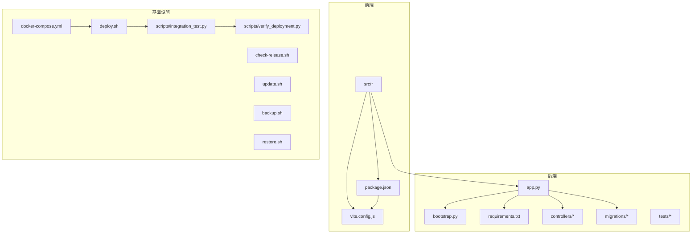
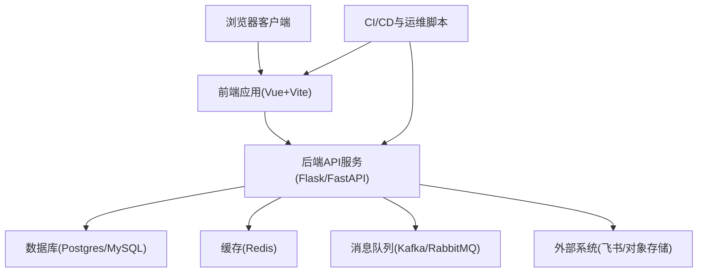
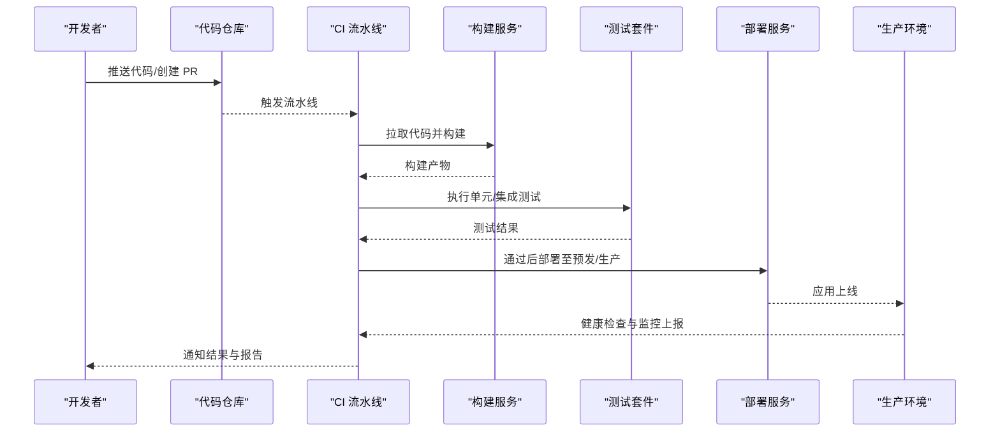
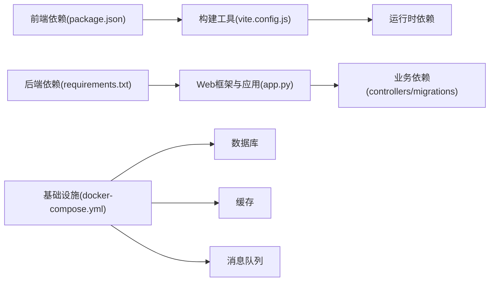

# 开发工作流程

<cite>
**本文档引用的文件**   
- [README.md](file://README.md)
- [docker-compose.yml](file://docker-compose.yml)
- [deploy.sh](file://deploy.sh)
- [check-release.sh](file://check-release.sh)
- [update.sh](file://update.sh)
- [backup.sh](file://backup.sh)
- [restore.sh](file://restore.sh)
- [backend/app.py](file://backend/app.py)
- [backend/bootstrap.py](file://backend/bootstrap.py)
- [backend/requirements.txt](file://backend/requirements.txt)
- [frontend/package.json](file://frontend/package.json)
- [frontend/vite.config.js](file://frontend/vite.config.js)
- [scripts/integration_test.py](file://scripts/integration_test.py)
- [scripts/verify_deployment.py](file://scripts/verify_deployment.py)
- [.agents/skills/smartask-skill-maintenance/SKILL.md](file://.agents/skills/smartask-skill-maintenance/SKILL.md)
- [.workbuddy/memory/MEMORY.md](file://.workbuddy/memory/MEMORY.md)
</cite>

## 目录
1. [引言](#引言)
2. [项目结构](#项目结构)
3. [核心组件](#核心组件)
4. [架构总览](#架构总览)
5. [详细组件分析](#详细组件分析)
6. [依赖分析](#依赖分析)
7. [性能考虑](#性能考虑)
8. [故障排查指南](#故障排查指南)
9. [结论](#结论)
10. [附录](#附录)

## 引言
本文件为 SmartAsk 项目定义标准化的开发工作流程，覆盖从需求分析、设计文档、技术方案、代码实现、自测验证、代码审查到合并发布的全链路。同时给出迭代与敏捷实践、版本与变更管理、团队协作规范以及持续集成与部署的配置说明，确保团队在高质量前提下高效交付。

## 项目结构
SmartAsk 采用前后端分离的模块化结构：
- 后端（Python）：以 Flask/FastAPI 风格的应用入口、控制器、领域服务、迁移脚本、测试与工具脚本组成。
- 前端（Vue/Vite）：按功能视图、组件、状态、路由与 API 封装组织。
- 基础设施：Docker Compose 编排、部署与回滚脚本、备份恢复脚本、CI/CD 辅助脚本。
- 文档与知识：产品策略、流程说明、技能维护与记忆库。

图表来源
- [docker-compose.yml](file://docker-compose.yml)
- [deploy.sh](file://deploy.sh)
- [check-release.sh](file://check-release.sh)
- [update.sh](file://update.sh)
- [backup.sh](file://backup.sh)
- [restore.sh](file://restore.sh)
- [backend/app.py](file://backend/app.py)
- [backend/bootstrap.py](file://backend/bootstrap.py)
- [backend/requirements.txt](file://backend/requirements.txt)
- [frontend/package.json](file://frontend/package.json)
- [frontend/vite.config.js](file://frontend/vite.config.js)
- [scripts/integration_test.py](file://scripts/integration_test.py)
- [scripts/verify_deployment.py](file://scripts/verify_deployment.py)

章节来源
- [README.md](file://README.md)
- [docker-compose.yml](file://docker-compose.yml)
- [backend/app.py](file://backend/app.py)
- [backend/bootstrap.py](file://backend/bootstrap.py)
- [backend/requirements.txt](file://backend/requirements.txt)
- [frontend/package.json](file://frontend/package.json)
- [frontend/vite.config.js](file://frontend/vite.config.js)

## 核心组件
- 应用入口与启动流程：后端应用初始化、配置加载、服务注册与中间件装配。
- 构建与运行：前端 Vite 构建、后端依赖安装与环境隔离。
- 数据与迁移：数据库迁移脚本与运行时配置导入导出。
- 质量保障：单元测试、集成测试与部署后健康检查。
- 运维脚本：部署、更新、备份、恢复与发布校验。

章节来源
- [backend/app.py](file://backend/app.py)
- [backend/bootstrap.py](file://backend/bootstrap.py)
- [backend/requirements.txt](file://backend/requirements.txt)
- [frontend/package.json](file://frontend/package.json)
- [frontend/vite.config.js](file://frontend/vite.config.js)
- [scripts/integration_test.py](file://scripts/integration_test.py)
- [scripts/verify_deployment.py](file://scripts/verify_deployment.py)

## 架构总览
SmartAsk 采用“前端单页应用 + 后端微服务化模块”的架构，通过 Docker Compose 统一编排。前端负责交互与页面渲染，后端提供 RESTful API 与业务逻辑，数据库与缓存等外部依赖由容器化环境提供。

[该图为概念性架构图，不直接映射具体源码文件]

## 详细组件分析

### 新功能开发标准流程
- 需求分析与设计
  - 产出：PRD/用例、交互原型、接口契约、数据模型变更草案。
  - 评审：产品、技术、测试三方评审，明确范围与风险。
- 技术方案设计
  - 产出：技术设计文档（时序图、类图、数据流、异常处理、可观测性）。
  - 评审：架构师/资深工程师评审，确认可扩展性与兼容性。
- 代码实现
  - 分支策略：feature/前缀分支，原子提交，清晰 Commit Message。
  - 编码规范：遵循语言规范与团队约定，新增注释与类型注解。
- 自测验证
  - 单元测试：覆盖率目标与边界用例。
  - 集成测试：端到端关键路径验证。
  - 本地联调：前后端 Mock/Stub 或沙箱环境联调。
- 代码审查
  - 自动化：静态检查、依赖漏洞扫描、格式化校验。
  - 人工审查：可读性、复杂度、安全性、性能、可测试性。
- 合并与发布
  - 合并条件：CI 全绿、至少 1 位 Reviewer 批准、无阻塞问题。
  - 发布节奏：主干稳定版 + 热修复分支并行。

章节来源
- [.agents/skills/smartask-skill-maintenance/SKILL.md](file://.agents/skills/smartask-skill-maintenance/SKILL.md)
- [.workbuddy/memory/MEMORY.md](file://.workbuddy/memory/MEMORY.md)

### 迭代开发与敏捷实践
- 任务分解：按用户故事拆分，粒度适中，验收标准明确。
- 优先级排序：价值/风险矩阵，依赖关系梳理。
- 每日站会：同步进度、阻塞与次日计划。
- 迭代回顾：复盘质量指标、效率指标与改进项。

章节来源
- [.workbuddy/memory/MEMORY.md](file://.workbuddy/memory/MEMORY.md)

### 代码审查标准与流程
- 审查清单
  - 正确性：逻辑正确、边界与异常处理完备。
  - 可维护性：命名清晰、函数短小、职责单一。
  - 安全性：鉴权、输入校验、敏感信息脱敏。
  - 性能：查询优化、缓存命中、避免 N+1。
  - 可测试性：可注入依赖、易 Mock。
- 自动化工具
  - 静态检查、格式化工具、依赖漏洞扫描、覆盖率统计。
- 人工审查要点
  - 架构一致性、接口契约、错误码与日志规范、监控埋点。

章节来源
- [.agents/skills/smartask-skill-maintenance/SKILL.md](file://.agents/skills/smartask-skill-maintenance/SKILL.md)

### 版本管理与发布流程
- 版本号规范：语义化版本（主.次.修订），特性/修复/破坏性变更标识。
- 变更日志：每次合并生成变更记录，标注影响面与回滚方案。
- 热修复流程：hotfix/前缀分支，快速回归与灰度发布。
- 回滚策略：一键回滚、数据兼容与补偿脚本。

章节来源
- [check-release.sh](file://check-release.sh)
- [deploy.sh](file://deploy.sh)
- [update.sh](file://update.sh)
- [backup.sh](file://backup.sh)
- [restore.sh](file://restore.sh)

### 团队协作工作规范
- 沟通渠道：即时通讯、问题跟踪、知识库沉淀。
- 文档同步：设计文档与接口契约集中管理，版本化归档。
- 知识分享：定期技术分享、案例复盘与最佳实践沉淀。
- 技术债务：识别、评估、排期与偿还闭环。

章节来源
- [.workbuddy/memory/MEMORY.md](file://.workbuddy/memory/MEMORY.md)

### 持续集成与持续部署（CI/CD）
- 触发条件：Push/Pull Request 事件，标签发布事件。
- 构建阶段：前端构建、后端依赖安装、镜像构建。
- 测试阶段：单元测试、集成测试、安全扫描。
- 部署阶段：灰度发布、健康检查、回滚预案。
- 监控告警：关键指标采集与告警规则。

[该序列图为概念流程，不直接映射具体源码文件]

## 依赖分析
- 前端依赖：包管理器与构建工具链，插件与主题样式。
- 后端依赖：Web 框架、ORM、认证授权、第三方 SDK。
- 基础设施依赖：数据库、缓存、消息队列、对象存储。
- 工具链依赖：测试框架、静态检查、安全扫描、打包发布。

图表来源
- [frontend/package.json](file://frontend/package.json)
- [frontend/vite.config.js](file://frontend/vite.config.js)
- [backend/requirements.txt](file://backend/requirements.txt)
- [backend/app.py](file://backend/app.py)
- [docker-compose.yml](file://docker-compose.yml)

章节来源
- [frontend/package.json](file://frontend/package.json)
- [frontend/vite.config.js](file://frontend/vite.config.js)
- [backend/requirements.txt](file://backend/requirements.txt)
- [backend/app.py](file://backend/app.py)
- [docker-compose.yml](file://docker-compose.yml)

## 性能考虑
- 前端
  - 资源压缩与懒加载，图片与字体优化，缓存策略。
- 后端
  - 接口幂等与限流，数据库索引与查询优化，连接池与缓存命中。
- 基础设施
  - 水平扩展、弹性伸缩、资源配额与监控告警。
- 测试
  - 压测与基准测试，瓶颈定位与容量规划。

[本节为通用指导，不直接分析具体文件]

## 故障排查指南
- 常见问题定位
  - 启动失败：检查端口占用、环境变量、依赖安装。
  - 构建失败：清理缓存、锁定依赖版本、检查 Node/Python 版本。
  - 测试失败：查看日志、复现步骤、Mock 数据一致性。
  - 部署失败：检查镜像、权限、网络与安全组。
- 诊断工具
  - 日志收集、链路追踪、指标采集、快照与回放。
- 应急流程
  - 快速回滚、降级开关、热点隔离、熔断限流。

章节来源
- [scripts/verify_deployment.py](file://scripts/verify_deployment.py)
- [scripts/integration_test.py](file://scripts/integration_test.py)
- [deploy.sh](file://deploy.sh)
- [check-release.sh](file://check-release.sh)

## 结论
通过标准化的开发流程、严格的代码审查、完善的版本与发布管理、高效的团队协作与可靠的 CI/CD，SmartAsk 能够在保证质量的前提下持续提升交付效率与稳定性。建议持续完善度量体系与自动化能力，形成闭环改进机制。

[本节为总结性内容，不直接分析具体文件]

## 附录
- 常用命令与脚本
  - 部署：deploy.sh
  - 更新：update.sh
  - 备份：backup.sh
  - 恢复：restore.sh
  - 发布检查：check-release.sh
  - 集成测试：scripts/integration_test.py
  - 部署验证：scripts/verify_deployment.py

章节来源
- [deploy.sh](file://deploy.sh)
- [update.sh](file://update.sh)
- [backup.sh](file://backup.sh)
- [restore.sh](file://restore.sh)
- [check-release.sh](file://check-release.sh)
- [scripts/integration_test.py](file://scripts/integration_test.py)
- [scripts/verify_deployment.py](file://scripts/verify_deployment.py)