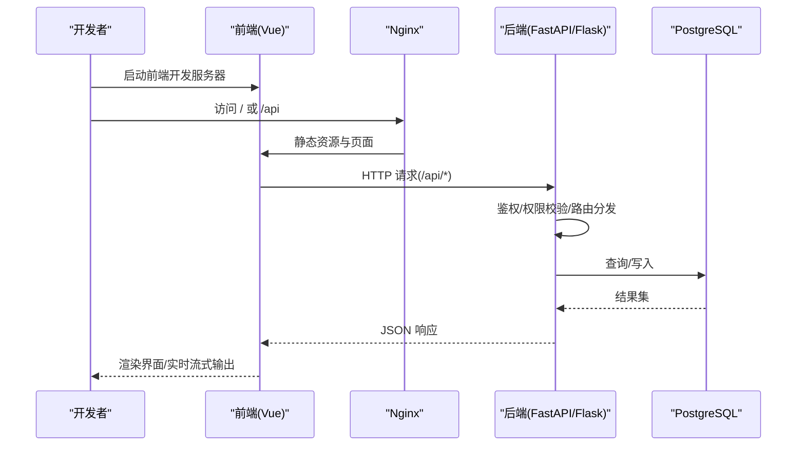
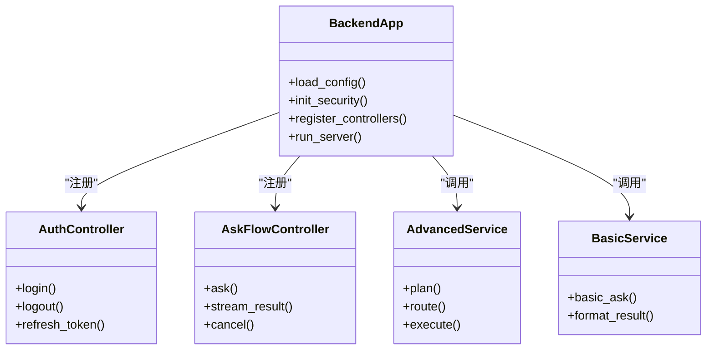
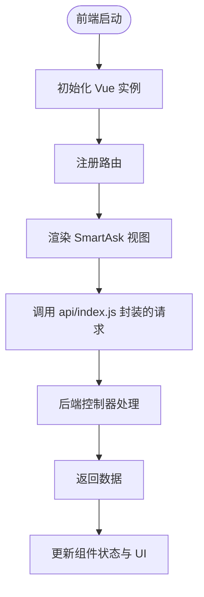
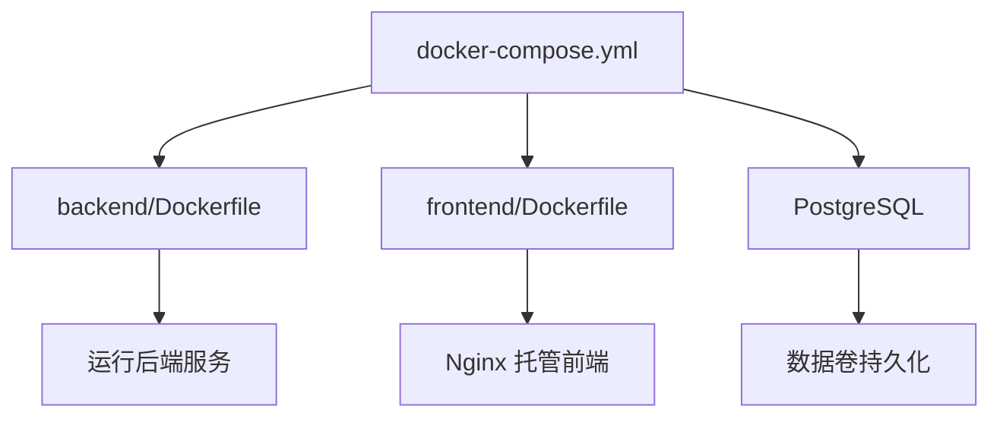
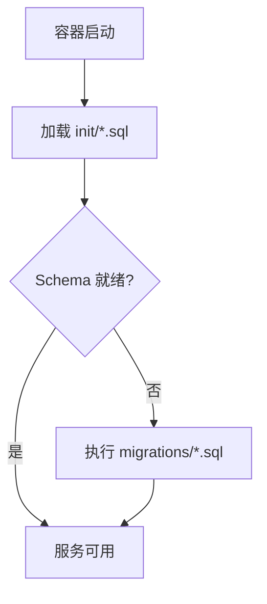
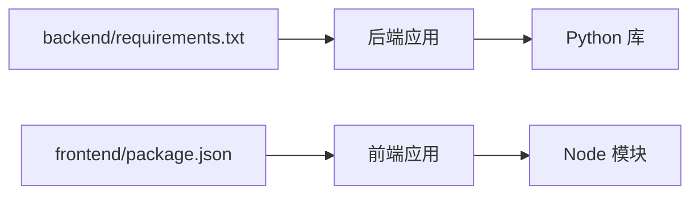

# 开发工具与效率提升

<cite>
**本文引用的文件**   
- [README.md](file://README.md)
- [docker-compose.yml](file://docker-compose.yml)
- [backend/Dockerfile](file://backend/Dockerfile)
- [frontend/Dockerfile](file://frontend/Dockerfile)
- [backend/requirements.txt](file://backend/requirements.txt)
- [frontend/package.json](file://frontend/package.json)
- [frontend/vite.config.js](file://frontend/vite.config.js)
- [deploy.sh](file://deploy.sh)
- [backup.sh](file://backup.sh)
- [restore.sh](file://restore.sh)
- [check-release.sh](file://check-release.sh)
- [start_all.bat](file://start_all.bat)
- [stop_all.bat](file://stop_all.bat)
- [update.sh](file://update.sh)
- [doctor.sh](file://doctor.sh)
- [scripts/integration_test.py](file://scripts/integration_test.py)
- [scripts/verify_deployment.py](file://scripts/verify_deployment.py)
- [backend/app.py](file://backend/app.py)
- [backend/bootstrap.py](file://backend/bootstrap.py)
- [backend/config_manager.py](file://backend/config_manager.py)
- [backend/security.py](file://backend/security.py)
- [backend/auth_store.py](file://backend/auth_store.py)
- [backend/rbac_store.py](file://backend/rbac_store.py)
- [backend/datasource_router.py](file://backend/datasource_router.py)
- [backend/agent_registry.py](file://backend/agent_registry.py)
- [backend/smartask_advanced/service.py](file://backend/smartask_advanced/service.py)
- [backend/smartask_basic/service.py](file://backend/smartask_basic/service.py)
- [backend/controllers/ask_flow.py](file://backend/controllers/ask_flow.py)
- [backend/controllers/auth.py](file://backend/controllers/auth.py)
- [backend/controllers/ai_models.py](file://backend/controllers/ai_models.py)
- [backend/controllers/bookshelf.py](file://backend/controllers/bookshelf.py)
- [backend/controllers/datasources.py](file://backend/controllers/datasources.py)
- [backend/controllers/feishu_sync.py](file://backend/controllers/feishu_sync.py)
- [backend/controllers/system_logs.py](file://backend/controllers/system_logs.py)
- [backend/tests/test_ask_flow_controller.py](file://backend/tests/test_ask_flow_controller.py)
- [backend/tests/test_security_guards.py](file://backend/tests/test_security_guards.py)
- [backend/migrations/20260330_bookshelf_schema.sql](file://backend/migrations/20260330_bookshelf_schema.sql)
- [docker/postgres/init/001_bookshelf_schema.sql](file://docker/postgres/init/001_bookshelf_schema.sql)
- [frontend/src/main.js](file://frontend/src/main.js)
- [frontend/src/router/index.js](file://frontend/src/router/index.js)
- [frontend/src/api/index.js](file://frontend/src/api/index.js)
- [frontend/src/views/SmartAsk.vue](file://frontend/src/views/SmartAsk.vue)
- [frontend/src/components/smartask/ChatHeader.vue](file://frontend/src/components/smartask/ChatHeader.vue)
- [frontend/src/components/smartask/LiveExecutionFeed.vue](file://frontend/src/components/smartask/LiveExecutionFeed.vue)
- [frontend/nginx.conf](file://frontend/nginx.conf)
</cite>

## 目录
1. [简介](#简介)
2. [项目结构](#项目结构)
3. [核心组件](#核心组件)
4. [架构总览](#架构总览)
5. [详细组件分析](#详细组件分析)
6. [依赖分析](#依赖分析)
7. [性能考虑](#性能考虑)
8. [故障排查指南](#故障排查指南)
9. [结论](#结论)
10. [附录](#附录)

## 简介
本文件面向 SmartAsk 项目的开发者与维护者，提供一套“开发工具与效率提升”的完整方案。内容覆盖 IDE 配置与优化（VS Code、PyCharm、WebStorm）、命令行工具与脚本、容器化与虚拟化环境、代码质量工具、性能分析工具以及协作与持续集成配置。目标是让团队在本地与 CI 环境中获得一致、高效、可观测的开发体验。

## 项目结构
SmartAsk 采用前后端分离架构：
- 后端：Python FastAPI/Flask 风格应用，模块化控制器与领域服务，数据库迁移与测试用例齐全。
- 前端：Vue 3 + Vite，组件化 UI，路由与状态管理清晰。
- 基础设施：Docker Compose 编排 PostgreSQL 与前后端镜像，提供一键启动、备份恢复与部署脚本。

```mermaid
graph TB
subgraph "前端"
FE_Main["main.js"]
FE_Router["router/index.js"]
FE_API["api/index.js"]
FE_View["views/SmartAsk.vue"]
FE_Comp["components/smartask/*"]
FE_Nginx["nginx.conf"]
end
subgraph "后端"
BE_App["app.py"]
BE_Bootstrap["bootstrap.py"]
BE_Config["config_manager.py"]
BE_Security["security.py"]
BE_Auth["auth_store.py"]
BE_RBAC["rbac_store.py"]
BE_DSR["datasource_router.py"]
BE_Agent["agent_registry.py"]
BE_AdvService["smartask_advanced/service.py"]
BE_BasicService["smartask_basic/service.py"]
BE_Ctrl_AskFlow["controllers/ask_flow.py"]
BE_Ctrl_Auth["controllers/auth.py"]
BE_Ctrl_Models["controllers/ai_models.py"]
BE_Ctrl_Bookshelf["controllers/bookshelf.py"]
BE_Ctrl_Datasources["controllers/datasources.py"]
BE_Ctrl_Feishu["controllers/feishu_sync.py"]
BE_Ctrl_Logs["controllers/system_logs.py"]
end
subgraph "数据与迁移"
DB_Init["postgres/init/*.sql"]
BE_Mig["migrations/*.sql"]
end
FE_Main --> FE_Router --> FE_View --> FE_Comp
FE_View --> FE_API
FE_Nginx --> FE_Main
BE_App --> BE_Bootstrap --> BE_Config
BE_App --> BE_Security --> BE_Auth --> BE_RBAC
BE_App --> BE_DSR --> BE_Agent
BE_App --> BE_AdvService
BE_App --> BE_BasicService
BE_App --> BE_Ctrl_AskFlow
BE_App --> BE_Ctrl_Auth
BE_App --> BE_Ctrl_Models
BE_App --> BE_Ctrl_Bookshelf
BE_App --> BE_Ctrl_Datasources
BE_App --> BE_Ctrl_Feishu
BE_App --> BE_Ctrl_Logs
BE_App --> DB_Init
BE_App --> BE_Mig
```

图表来源
- [frontend/src/main.js:1-200](file://frontend/src/main.js#L1-L200)
- [frontend/src/router/index.js:1-200](file://frontend/src/router/index.js#L1-L200)
- [frontend/src/api/index.js:1-200](file://frontend/src/api/index.js#L1-L200)
- [frontend/src/views/SmartAsk.vue:1-300](file://frontend/src/views/SmartAsk.vue#L1-L300)
- [frontend/src/components/smartask/ChatHeader.vue:1-200](file://frontend/src/components/smartask/ChatHeader.vue#L1-L200)
- [frontend/src/components/smartask/LiveExecutionFeed.vue:1-200](file://frontend/src/components/smartask/LiveExecutionFeed.vue#L1-L200)
- [frontend/nginx.conf:1-200](file://frontend/nginx.conf#L1-L200)
- [backend/app.py:1-300](file://backend/app.py#L1-L300)
- [backend/bootstrap.py:1-200](file://backend/bootstrap.py#L1-L200)
- [backend/config_manager.py:1-200](file://backend/config_manager.py#L1-L200)
- [backend/security.py:1-200](file://backend/security.py#L1-L200)
- [backend/auth_store.py:1-200](file://backend/auth_store.py#L1-L200)
- [backend/rbac_store.py:1-200](file://backend/rbac_store.py#L1-L200)
- [backend/datasource_router.py:1-200](file://backend/datasource_router.py#L1-L200)
- [backend/agent_registry.py:1-200](file://backend/agent_registry.py#L1-L200)
- [backend/smartask_advanced/service.py:1-200](file://backend/smartask_advanced/service.py#L1-L200)
- [backend/smartask_basic/service.py:1-200](file://backend/smartask_basic/service.py#L1-L200)
- [backend/controllers/ask_flow.py:1-300](file://backend/controllers/ask_flow.py#L1-L300)
- [backend/controllers/auth.py:1-200](file://backend/controllers/auth.py#L1-L200)
- [backend/controllers/ai_models.py:1-200](file://backend/controllers/ai_models.py#L1-L200)
- [backend/controllers/bookshelf.py:1-200](file://backend/controllers/bookshelf.py#L1-L200)
- [backend/controllers/datasources.py:1-200](file://backend/controllers/datasources.py#L1-L200)
- [backend/controllers/feishu_sync.py:1-200](file://backend/controllers/feishu_sync.py#L1-L200)
- [backend/controllers/system_logs.py:1-200](file://backend/controllers/system_logs.py#L1-L200)
- [docker/postgres/init/001_bookshelf_schema.sql:1-200](file://docker/postgres/init/001_bookshelf_schema.sql#L1-L200)
- [backend/migrations/20260330_bookshelf_schema.sql:1-200](file://backend/migrations/20260330_bookshelf_schema.sql#L1-L200)

章节来源
- [README.md:1-200](file://README.md#L1-L200)
- [docker-compose.yml:1-200](file://docker-compose.yml#L1-L200)

## 核心组件
- 后端入口与初始化
  - 应用启动、配置加载、安全策略、认证与权限存储、数据源路由与 Agent 注册。
- 控制器层
  - AskFlow、认证、AI 模型、书架、数据源、飞书同步、系统日志等控制器。
- 高级与基础服务
  - 高级能力编排与基础问数服务。
- 前端入口与视图
  - Vue 应用初始化、路由、API 封装、主视图与聊天组件。

章节来源
- [backend/app.py:1-300](file://backend/app.py#L1-L300)
- [backend/bootstrap.py:1-200](file://backend/bootstrap.py#L1-L200)
- [backend/config_manager.py:1-200](file://backend/config_manager.py#L1-L200)
- [backend/security.py:1-200](file://backend/security.py#L1-L200)
- [backend/auth_store.py:1-200](file://backend/auth_store.py#L1-L200)
- [backend/rbac_store.py:1-200](file://backend/rbac_store.py#L1-L200)
- [backend/datasource_router.py:1-200](file://backend/datasource_router.py#L1-L200)
- [backend/agent_registry.py:1-200](file://backend/agent_registry.py#L1-L200)
- [backend/smartask_advanced/service.py:1-200](file://backend/smartask_advanced/service.py#L1-L200)
- [backend/smartask_basic/service.py:1-200](file://backend/smartask_basic/service.py#L1-L200)
- [backend/controllers/ask_flow.py:1-300](file://backend/controllers/ask_flow.py#L1-L300)
- [backend/controllers/auth.py:1-200](file://backend/controllers/auth.py#L1-L200)
- [backend/controllers/ai_models.py:1-200](file://backend/controllers/ai_models.py#L1-L200)
- [backend/controllers/bookshelf.py:1-200](file://backend/controllers/bookshelf.py#L1-L200)
- [backend/controllers/datasources.py:1-200](file://backend/controllers/datasources.py#L1-L200)
- [backend/controllers/feishu_sync.py:1-200](file://backend/controllers/feishu_sync.py#L1-L200)
- [backend/controllers/system_logs.py:1-200](file://backend/controllers/system_logs.py#L1-L200)
- [frontend/src/main.js:1-200](file://frontend/src/main.js#L1-L200)
- [frontend/src/router/index.js:1-200](file://frontend/src/router/index.js#L1-L200)
- [frontend/src/api/index.js:1-200](file://frontend/src/api/index.js#L1-L200)
- [frontend/src/views/SmartAsk.vue:1-300](file://frontend/src/views/SmartAsk.vue#L1-L300)

## 架构总览
SmartAsk 的整体架构由前端、后端、数据库与编排脚本构成。前端通过 Nginx 反向代理与 API 网关，后端以模块化控制器暴露 REST 接口，数据持久化使用 PostgreSQL，并通过迁移脚本维护 schema。

图表来源
- [frontend/nginx.conf:1-200](file://frontend/nginx.conf#L1-L200)
- [frontend/src/api/index.js:1-200](file://frontend/src/api/index.js#L1-L200)
- [backend/app.py:1-300](file://backend/app.py#L1-L300)
- [backend/controllers/auth.py:1-200](file://backend/controllers/auth.py#L1-L200)
- [backend/controllers/ask_flow.py:1-300](file://backend/controllers/ask_flow.py#L1-L300)
- [docker/postgres/init/001_bookshelf_schema.sql:1-200](file://docker/postgres/init/001_bookshelf_schema.sql#L1-L200)

## 详细组件分析

### 后端应用与控制器
- 应用启动流程
  - 加载配置、初始化安全策略、注册控制器与中间件、启动服务。
- 控制器职责
  - ask_flow：问答流程编排与执行；auth：认证与令牌；ai_models：模型配置；bookshelf：书架与提示词；datasources：数据源连接；feishu_sync：飞书同步；system_logs：系统日志。
- 服务层
  - smartask_advanced：高级能力（规划、路由、证据投票、SQL 质量检查等）；smartask_basic：基础问数能力。

图表来源
- [backend/app.py:1-300](file://backend/app.py#L1-L300)
- [backend/controllers/auth.py:1-200](file://backend/controllers/auth.py#L1-L200)
- [backend/controllers/ask_flow.py:1-300](file://backend/controllers/ask_flow.py#L1-L300)
- [backend/smartask_advanced/service.py:1-200](file://backend/smartask_advanced/service.py#L1-L200)
- [backend/smartask_basic/service.py:1-200](file://backend/smartask_basic/service.py#L1-L200)

章节来源
- [backend/app.py:1-300](file://backend/app.py#L1-L300)
- [backend/controllers/ask_flow.py:1-300](file://backend/controllers/ask_flow.py#L1-L300)
- [backend/controllers/auth.py:1-200](file://backend/controllers/auth.py#L1-L200)
- [backend/controllers/ai_models.py:1-200](file://backend/controllers/ai_models.py#L1-L200)
- [backend/controllers/bookshelf.py:1-200](file://backend/controllers/bookshelf.py#L1-L200)
- [backend/controllers/datasources.py:1-200](file://backend/controllers/datasources.py#L1-L200)
- [backend/controllers/feishu_sync.py:1-200](file://backend/controllers/feishu_sync.py#L1-L200)
- [backend/controllers/system_logs.py:1-200](file://backend/controllers/system_logs.py#L1-L200)
- [backend/smartask_advanced/service.py:1-200](file://backend/smartask_advanced/service.py#L1-L200)
- [backend/smartask_basic/service.py:1-200](file://backend/smartask_basic/service.py#L1-L200)

### 前端应用与组件
- 应用初始化
  - main.js 创建 Vue 实例，挂载路由与全局样式。
- 路由与 API
  - router/index.js 定义页面路由；api/index.js 封装 HTTP 请求与拦截器。
- 视图与组件
  - SmartAsk.vue 主视图；ChatHeader.vue、LiveExecutionFeed.vue 等聊天与执行反馈组件。

图表来源
- [frontend/src/main.js:1-200](file://frontend/src/main.js#L1-L200)
- [frontend/src/router/index.js:1-200](file://frontend/src/router/index.js#L1-L200)
- [frontend/src/api/index.js:1-200](file://frontend/src/api/index.js#L1-L200)
- [frontend/src/views/SmartAsk.vue:1-300](file://frontend/src/views/SmartAsk.vue#L1-L300)
- [frontend/src/components/smartask/ChatHeader.vue:1-200](file://frontend/src/components/smartask/ChatHeader.vue#L1-L200)
- [frontend/src/components/smartask/LiveExecutionFeed.vue:1-200](file://frontend/src/components/smartask/LiveExecutionFeed.vue#L1-L200)

章节来源
- [frontend/src/main.js:1-200](file://frontend/src/main.js#L1-L200)
- [frontend/src/router/index.js:1-200](file://frontend/src/router/index.js#L1-L200)
- [frontend/src/api/index.js:1-200](file://frontend/src/api/index.js#L1-L200)
- [frontend/src/views/SmartAsk.vue:1-300](file://frontend/src/views/SmartAsk.vue#L1-L300)
- [frontend/src/components/smartask/ChatHeader.vue:1-200](file://frontend/src/components/smartask/ChatHeader.vue#L1-L200)
- [frontend/src/components/smartask/LiveExecutionFeed.vue:1-200](file://frontend/src/components/smartask/LiveExecutionFeed.vue#L1-L200)

### 容器化与编排
- Docker 镜像
  - backend/Dockerfile 构建 Python 后端镜像；frontend/Dockerfile 构建前端静态资源与 Nginx 镜像。
- 编排与服务
  - docker-compose.yml 统一编排后端、前端与 PostgreSQL，支持环境变量与数据卷持久化。

图表来源
- [docker-compose.yml:1-200](file://docker-compose.yml#L1-L200)
- [backend/Dockerfile:1-200](file://backend/Dockerfile#L1-L200)
- [frontend/Dockerfile:1-200](file://frontend/Dockerfile#L1-L200)

章节来源
- [docker-compose.yml:1-200](file://docker-compose.yml#L1-L200)
- [backend/Dockerfile:1-200](file://backend/Dockerfile#L1-L200)
- [frontend/Dockerfile:1-200](file://frontend/Dockerfile#L1-L200)

### 数据库迁移与初始化
- 初始化脚本
  - docker/postgres/init/*.sql 用于首次启动时初始化 schema。
- 版本化迁移
  - backend/migrations/*.sql 按时间戳命名，便于回滚与升级。

图表来源
- [docker/postgres/init/001_bookshelf_schema.sql:1-200](file://docker/postgres/init/001_bookshelf_schema.sql#L1-L200)
- [backend/migrations/20260330_bookshelf_schema.sql:1-200](file://backend/migrations/20260330_bookshelf_schema.sql#L1-L200)

章节来源
- [docker/postgres/init/001_bookshelf_schema.sql:1-200](file://docker/postgres/init/001_bookshelf_schema.sql#L1-L200)
- [backend/migrations/20260330_bookshelf_schema.sql:1-200](file://backend/migrations/20260330_bookshelf_schema.sql#L1-L200)

## 依赖分析
- 后端依赖
  - requirements.txt 声明 Python 包依赖，建议锁定版本并启用安全扫描。
- 前端依赖
  - package.json 声明 Node 模块与构建脚本，建议使用 pnpm 与缓存加速。

图表来源
- [backend/requirements.txt:1-200](file://backend/requirements.txt#L1-L200)
- [frontend/package.json:1-200](file://frontend/package.json#L1-L200)

章节来源
- [backend/requirements.txt:1-200](file://backend/requirements.txt#L1-L200)
- [frontend/package.json:1-200](file://frontend/package.json#L1-L200)

## 性能考虑
- 后端
  - 使用异步 I/O 与连接池；对热点接口添加缓存；限制大查询超时与分页。
- 前端
  - 组件懒加载与按需引入；图片与静态资源 CDN；减少重绘与计算。
- 数据库
  - 索引优化与慢查询监控；读写分离与分库分表评估。
- 容器
  - 镜像分层优化与多阶段构建；资源限制与健康检查。

[本节为通用指导，不直接分析具体文件]

## 故障排查指南
- 常见问题定位
  - 后端启动失败：检查配置文件与安全策略；查看日志与错误堆栈。
  - 前端无法访问 API：确认 Nginx 反向代理与 CORS 设置；检查网络连通性。
  - 数据库连接异常：验证环境变量与端口映射；检查迁移是否成功。
- 诊断与验证
  - 使用 doctor.sh 进行环境自检；使用 verify_deployment.py 验证部署状态；使用 integration_test.py 执行端到端测试。

章节来源
- [doctor.sh:1-200](file://doctor.sh#L1-L200)
- [scripts/verify_deployment.py:1-200](file://scripts/verify_deployment.py#L1-L200)
- [scripts/integration_test.py:1-200](file://scripts/integration_test.py#L1-L200)
- [backend/app.py:1-300](file://backend/app.py#L1-L300)
- [frontend/nginx.conf:1-200](file://frontend/nginx.conf#L1-L200)

## 结论
通过统一的 IDE 配置、完善的脚本与容器化编排、严格的代码质量与性能分析工具链，SmartAsk 项目能够在开发与生产环境中保持一致性与高可用性。建议团队遵循本文档的配置与实践，持续提升交付效率与系统稳定性。

## 附录

### IDE 配置与优化（VS Code、PyCharm、WebStorm）
- VS Code
  - 插件推荐：Python、Pylance、Ruff、Black Formatter、ESLint、Volar、Vue Language Features、Docker、GitLens。
  - 快捷键：格式化文档（Shift+Alt+F），运行测试（Ctrl+Shift+T），调试（F5）。
  - 代码片段：常用函数模板、API 请求封装、组件骨架。
  - 调试器：Python 断点与变量监视；Node 断点与网络面板。
- PyCharm
  - 插件推荐：Docker、Database Tools、Python Community/Professional、REST Client。
  - 快捷键：重构（Shift+F6），查找引用（Alt+F7），运行配置（Run/Debug Configurations）。
  - 代码片段：类与方法模板、单元测试样板。
  - 调试器：远程调试与线程视图。
- WebStorm
  - 插件推荐：Vue.js、JavaScript and TypeScript、Docker、HTTP Client。
  - 快捷键：快速修复（Alt+Enter），生成代码（Cmd+N），运行测试（Cmd+Shift+T）。
  - 代码片段：Vue 组件模板、API 调用样板。
  - 调试器：浏览器调试与 Node 调试。

[本节为通用指导，不直接分析具体文件]

### 命令行工具与脚本
- 常用命令别名
  - 后端：pip install -r requirements.txt；uvicorn/fastapi 启动；pytest 运行测试。
  - 前端：pnpm install；pnpm dev；pnpm build。
- 批量处理脚本
  - backup.sh：数据库与配置备份；restore.sh：恢复数据；check-release.sh：发布前检查。
- 自动化任务与部署
  - deploy.sh：构建镜像、推送仓库、滚动更新；update.sh：拉取最新代码并重启服务。
  - Windows 批处理：start_all.bat、stop_all.bat、update.ps1、deploy.bat、deploy.ps1。

章节来源
- [deploy.sh:1-200](file://deploy.sh#L1-L200)
- [backup.sh:1-200](file://backup.sh#L1-L200)
- [restore.sh:1-200](file://restore.sh#L1-L200)
- [check-release.sh:1-200](file://check-release.sh#L1-L200)
- [start_all.bat:1-200](file://start_all.bat#L1-L200)
- [stop_all.bat:1-200](file://stop_all.bat#L1-L200)
- [update.sh:1-200](file://update.sh#L1-L200)

### 容器化与虚拟化开发环境
- Docker 开发镜像构建
  - backend/Dockerfile：多阶段构建，安装依赖，复制源码，暴露端口。
  - frontend/Dockerfile：构建静态资源，Nginx 托管，健康检查。
- 多容器编排
  - docker-compose.yml：定义服务、网络、卷与环境变量；支持开发模式热重载。
- 开发环境隔离与数据持久化
  - 使用独立网络与卷；敏感信息通过环境变量注入；日志与数据持久化到宿主机。

章节来源
- [backend/Dockerfile:1-200](file://backend/Dockerfile#L1-L200)
- [frontend/Dockerfile:1-200](file://frontend/Dockerfile#L1-L200)
- [docker-compose.yml:1-200](file://docker-compose.yml#L1-L200)

### 代码质量工具
- 静态代码分析
  - Python：ruff、pylint、mypy；前端：eslint、typescript-eslint。
- 代码格式化
  - Black、isort（Python）；Prettier、Stylelint（前端）。
- 安全扫描
  - pip-audit、npm audit、trivy（容器镜像扫描）。
- 依赖漏洞检测
  - GitHub Dependabot、Snyk；CI 中阻断高危漏洞。

[本节为通用指导，不直接分析具体文件]

### 性能分析工具
- 内存分析
  - Python：memory_profiler、tracemalloc；前端：Chrome DevTools Memory 面板。
- CPU Profiling
  - Python：cProfile、py-spy；前端：Performance 面板录制。
- 网络请求分析
  - Chrome Network 面板；后端：请求耗时与日志追踪。
- 数据库查询优化
  - PostgreSQL EXPLAIN ANALYZE；慢查询日志与索引建议。

[本节为通用指导，不直接分析具体文件]

### 协作工具与持续集成
- 项目管理
  - Jira、GitHub Projects；看板与迭代计划。
- 文档协作
  - Notion、Confluence；Markdown 与版本控制。
- 代码审查
  - GitHub Pull Requests；Code Review 模板与检查清单。
- 持续集成
  - GitHub Actions：构建、测试、扫描、部署；流水线可视化与通知。

[本节为通用指导，不直接分析具体文件]