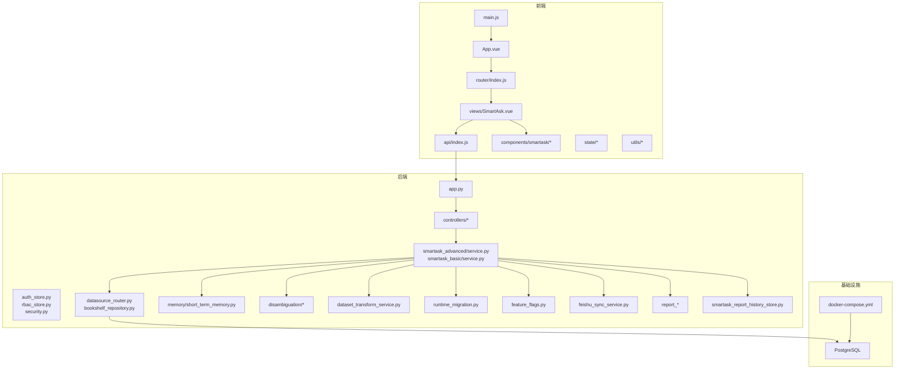
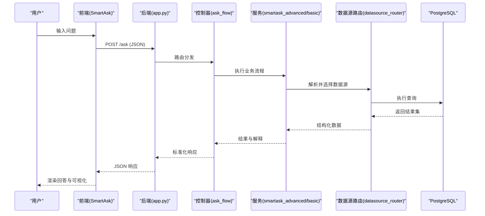
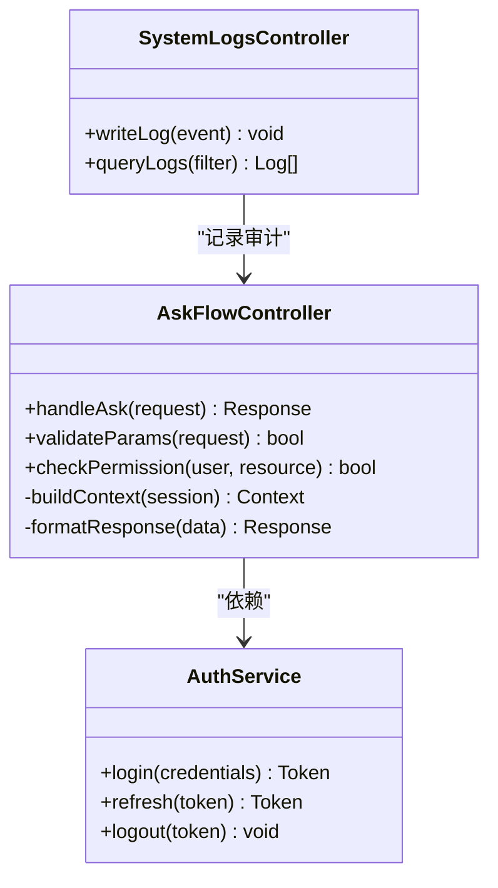
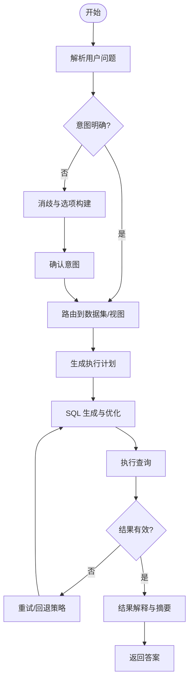
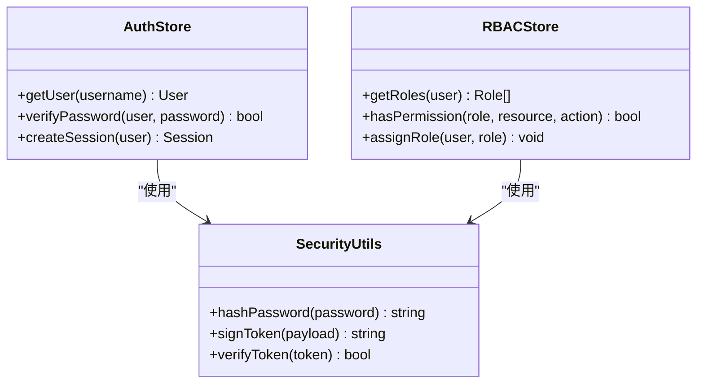
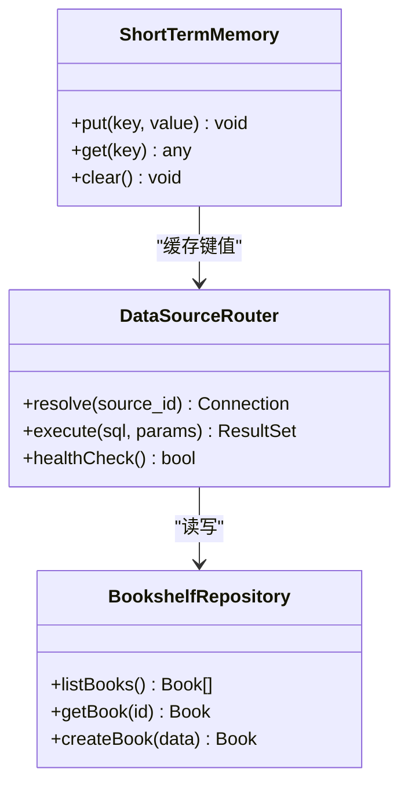
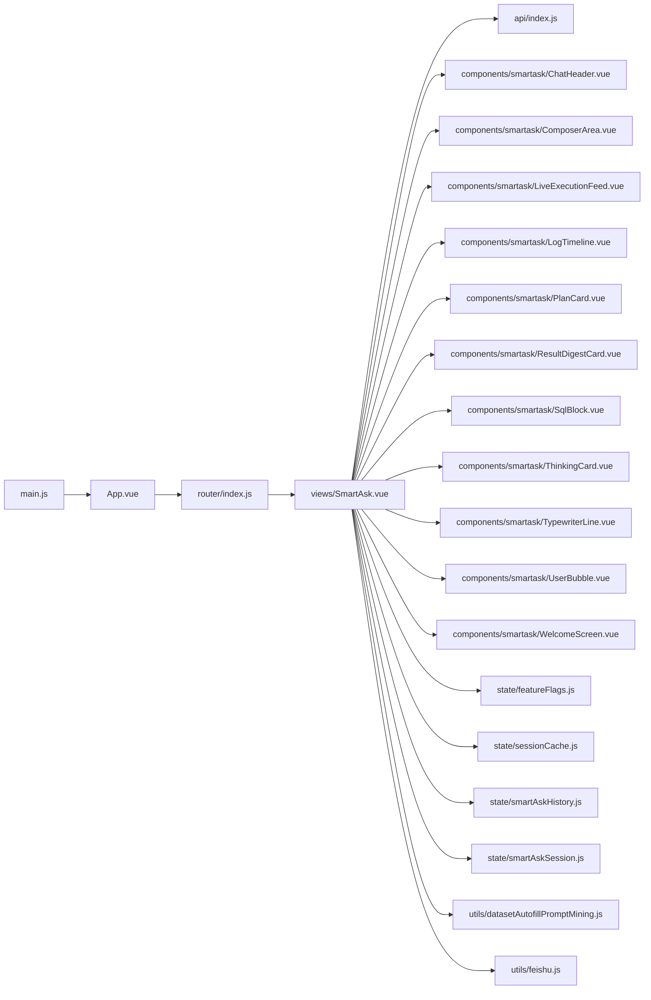
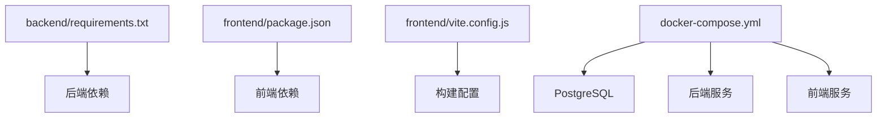

# 开发指南

<cite>
**本文引用的文件**   
- [README.md](file://README.md)
- [docker-compose.yml](file://docker-compose.yml)
- [backend/app.py](file://backend/app.py)
- [backend/requirements.txt](file://backend/requirements.txt)
- [frontend/package.json](file://frontend/package.json)
- [frontend/vite.config.js](file://frontend/vite.config.js)
- [scripts/integration_test.py](file://scripts/integration_test.py)
- [config/run_smartask_tests.py](file://config/run_smartask_tests.py)
- [backend/tests/test_ask_flow_controller.py](file://backend/tests/test_ask_flow_controller.py)
- [backend/bootstrap.py](file://backend/bootstrap.py)
- [backend/config_manager.py](file://backend/config_manager.py)
- [backend/security.py](file://backend/security.py)
- [backend/auth_store.py](file://backend/auth_store.py)
- [backend/rbac_store.py](file://backend/rbac_store.py)
- [backend/datasource_router.py](file://backend/datasource_router.py)
- [backend/agent_registry.py](file://backend/agent_registry.py)
- [backend/smartask_advanced/service.py](file://backend/smartask_advanced/service.py)
- [backend/smartask_basic/service.py](file://backend/smartask_basic/service.py)
- [backend/controllers/ask_flow.py](file://backend/controllers/ask_flow.py)
- [backend/controllers/auth.py](file://backend/controllers/auth.py)
- [backend/controllers/system_logs.py](file://backend/controllers/system_logs.py)
- [backend/memory/short_term_memory.py](file://backend/memory/short_term_memory.py)
- [backend/disambiguation/llm_arbiter.py](file://backend/disambiguation/llm_arbiter.py)
- [backend/disambiguation/scoring.py](file://backend/disambiguation/scoring.py)
- [backend/dataset_transform_service.py](file://backend/dataset_transform_service.py)
- [backend/runtime_migration.py](file://backend/runtime_migration.py)
- [backend/feature_flags.py](file://backend/feature_flags.py)
- [backend/feishu_sync_service.py](file://backend/feishu_sync_service.py)
- [backend/bookshelf_repository.py](file://backend/bookshelf_repository.py)
- [backend/data_permission_store.py](file://backend/data_permission_store.py)
- [backend/system_log_store.py](file://backend/system_log_store.py)
- [backend/organization_tree_store.py](file://backend/organization_tree_store.py)
- [backend/organization_route_resolver.py](file://backend/organization_route_resolver.py)
- [backend/report_contract_health.py](file://backend/report_contract_health.py)
- [backend/report_spec_builder.py](file://backend/report_spec_builder.py)
- [backend/report_scene_registry.py](file://backend/report_scene_registry.py)
- [backend/smartask_report_history_store.py](file://backend/smartask_report_history_store.py)
- [backend/encrypt_env_secrets.py](file://backend/encrypt_env_secrets.py)
- [backend/single_test.py](file://backend/single_test.py)
- [backend/batch_test_questions.py](file://backend/batch_test_questions.py)
- [backend/consumer_single_test.py](file://backend/consumer_single_test.py)
- [backend/export_runtime_config.py](file://backend/export_runtime_config.py)
- [backend/import_runtime_config.py](file://backend/import_runtime_config.py)
- [backend/regenerate_dataset_from_doc.py](file://backend/regenerate_dataset_from_doc.py)
- [backend/create_consumer_standard_dataset.py](file://backend/create_consumer_standard_dataset.py)
- [backend/get_feishu_tables.py](file://backend/get_feishu_tables.py)
- [backend/start_feishu_sync.py](file://backend/start_feishu_sync.py)
- [backend/update_syyb_profile_members.py](file://backend/update_syyb_profile_members.py)
- [backend/verify_deployment.py](file://backend/verify_deployment.py)
- [backend/analyze_batch_results.py](file://backend/analyze_batch_results.py)
- [backend/build_dataset_node_index.py](file://backend/build_dataset_node_index.py)
- [backend/four_agent_ask.py](file://backend/four_agent_ask.py)
- [backend/vanna_core.py](file://backend/vanna_core.py)
- [backend/ecommerce_batch_test_report.md](file://backend/ecommerce_batch_test_report.md)
- [backend/consumer_batch_test_results_report.md](file://backend/consumer_batch_test_results_report.md)
- [backend/batch_test_results.json](file://backend/batch_test_results.json)
- [backend/consumer_batch_test_results.json](file://backend/consumer_batch_results.json)
- [backend/Dockerfile](file://backend/Dockerfile)
- [frontend/src/main.js](file://frontend/src/main.js)
- [frontend/src/App.vue](file://frontend/src/App.vue)
- [frontend/src/router/index.js](file://frontend/src/router/index.js)
- [frontend/src/api/index.js](file://frontend/src/api/index.js)
- [frontend/src/views/SmartAsk.vue](file://frontend/src/views/SmartAsk.vue)
- [frontend/src/components/smartask/ChatHeader.vue](file://frontend/src/components/smartask/ChatHeader.vue)
- [frontend/src/components/smartask/ComposerArea.vue](file://frontend/src/components/smartask/ComposerArea.vue)
- [frontend/src/components/smartask/LiveExecutionFeed.vue](file://frontend/src/components/smartask/LiveExecutionFeed.vue)
- [frontend/src/components/smartask/LogTimeline.vue](file://frontend/src/components/smartask/LogTimeline.vue)
- [frontend/src/components/smartask/PlanCard.vue](file://frontend/src/components/smartask/PlanCard.vue)
- [frontend/src/components/smartask/ResultDigestCard.vue](file://frontend/src/components/smartask/ResultDigestCard.vue)
- [frontend/src/components/smartask/SqlBlock.vue](file://frontend/src/components/smartask/SqlBlock.vue)
- [frontend/src/components/smartask/ThinkingCard.vue](file://frontend/src/components/smartask/ThinkingCard.vue)
- [frontend/src/components/smartask/TypewriterLine.vue](file://frontend/src/components/smartask/TypewriterLine.vue)
- [frontend/src/components/smartask/UserBubble.vue](file://frontend/src/components/smartask/UserBubble.vue)
- [frontend/src/components/smartask/WelcomeScreen.vue](file://frontend/src/components/smartask/WelcomeScreen.vue)
- [frontend/src/composables/useOrgTree.js](file://frontend/src/composables/useOrgTree.js)
- [frontend/src/composables/useSmartAskReportHistory.js](file://frontend/src/composables/useSmartAskReportHistory.js)
- [frontend/src/state/featureFlags.js](file://frontend/src/state/featureFlags.js)
- [frontend/src/state/sessionCache.js](file://frontend/src/state/sessionCache.js)
- [frontend/src/state/smartAskHistory.js](file://frontend/src/state/smartAskHistory.js)
- [frontend/src/state/smartAskSession.js](file://frontend/src/state/smartAskSession.js)
- [frontend/src/utils/datasetAutofillPromptMining.js](file://frontend/src/utils/datasetAutofillPromptMining.js)
- [frontend/src/utils/feishu.js](file://frontend/src/utils/feishu.js)
- [frontend/src/styles/angel-theme.css](file://frontend/src/styles/angel-theme.css)
- [frontend/Dockerfile](file://frontend/Dockerfile)
- [frontend/nginx.conf](file://frontend/nginx.conf)
- [docker/postgres/init/001_bookshelf_schema.sql](file://docker/postgres/init/001_bookshelf_schema.sql)
- [docker/postgres/init/002_angel_group_data.sql](file://docker/postgres/init/002_angel_group_data.sql)
- [docker/postgres/init/003_bookshelf_agent1_prompt_upgrade.sql](file://docker/postgres/init/003_bookshelf_agent1_prompt_upgrade.sql)
- [docker/postgres/init/004_report_config.sql](file://docker/postgres/init/004_report_config.sql)
- [docker/postgres/init/005_report_thresholds.sql](file://docker/postgres/init/005_report_thresholds.sql)
- [docker/postgres/init/006_system_event_logs.sql](file://docker/postgres/init/006_system_event_logs.sql)
- [deploy.sh](file://deploy.sh)
- [start_all.bat](file://start_all.bat)
- [start_backend.bat](file://start_backend.bat)
- [start_frontend.bat](file://start_frontend.bat)
- [stop_all.bat](file://stop_all.bat)
- [update.sh](file://update.sh)
- [doctor.sh](file://doctor.sh)
- [backup.sh](file://backup.sh)
- [restore.sh](file://restore.sh)
</cite>

## 目录
1. [简介](#简介)
2. [项目结构](#项目结构)
3. [核心组件](#核心组件)
4. [架构总览](#架构总览)
5. [详细组件分析](#详细组件分析)
6. [依赖分析](#依赖分析)
7. [性能考虑](#性能考虑)
8. [故障排查指南](#故障排查指南)
9. [结论](#结论)
10. [附录](#附录)

## 简介
本指南面向 SmartAsk 智能问数平台的开发者，提供从本地环境搭建、代码规范、测试策略、调试与排障，到新功能开发与协作流程的完整说明。平台采用前后端分离架构：后端基于 Python（FastAPI/Flask 风格），前端基于 Vue 3 + Vite；数据层使用 PostgreSQL，并通过 Docker Compose 一键编排。文档同时覆盖数据库初始化、服务启动、环境变量与安全配置、端到端验证脚本等关键实践。

## 项目结构
仓库采用多模块组织方式：
- backend：Python 后端服务、控制器、业务逻辑、迁移脚本、测试与工具脚本
- frontend：Vue 3 + Vite 前端应用、路由、状态管理、组件与 API 封装
- docker/postgres/init：PostgreSQL 初始化 SQL
- scripts：集成测试与部署辅助脚本
- config：测试与配置相关资源
- docs：产品与交付文档
- .agents/.workbuddy：技能与工作记忆（非代码）

图表来源
- [frontend/src/main.js](file://frontend/src/main.js)
- [frontend/src/App.vue](file://frontend/src/App.vue)
- [frontend/src/router/index.js](file://frontend/src/router/index.js)
- [frontend/src/api/index.js](file://frontend/src/api/index.js)
- [frontend/src/views/SmartAsk.vue](file://frontend/src/views/SmartAsk.vue)
- [backend/app.py](file://backend/app.py)
- [backend/controllers/ask_flow.py](file://backend/controllers/ask_flow.py)
- [backend/smartask_advanced/service.py](file://backend/smartask_advanced/service.py)
- [backend/smartask_basic/service.py](file://backend/smartask_basic/service.py)
- [backend/datasource_router.py](file://backend/datasource_router.py)
- [backend/bookshelf_repository.py](file://backend/bookshelf_repository.py)
- [backend/memory/short_term_memory.py](file://backend/memory/short_term_memory.py)
- [backend/disambiguation/llm_arbiter.py](file://backend/disambiguation/llm_arbiter.py)
- [backend/dataset_transform_service.py](file://backend/dataset_transform_service.py)
- [backend/runtime_migration.py](file://backend/runtime_migration.py)
- [backend/feature_flags.py](file://backend/feature_flags.py)
- [backend/feishu_sync_service.py](file://backend/feishu_sync_service.py)
- [backend/report_spec_builder.py](file://backend/report_spec_builder.py)
- [backend/smartask_report_history_store.py](file://backend/smartask_report_history_store.py)
- [docker-compose.yml](file://docker-compose.yml)

章节来源
- [README.md](file://README.md)
- [docker-compose.yml](file://docker-compose.yml)

## 核心组件
- 后端入口与路由：app.py 负责应用初始化、中间件、路由注册与生命周期管理
- 控制器层：controllers/* 按功能域划分，如 ask_flow、auth、system_logs 等
- 服务层：smartask_advanced/basic service 实现问数核心流程（意图识别、路由、SQL 生成与执行、结果聚合）
- 认证与权限：auth_store、rbac_store、security 提供鉴权、RBAC 与访问控制
- 数据源路由：datasource_router 统一多数据源访问与解析
- 短期记忆：memory/short_term_memory 维护会话上下文
- 消歧与评分：disambiguation/* 处理意图消歧与选项打分
- 数据集转换：dataset_transform_service 负责数据模型转换与增强
- 运行时迁移：runtime_migration 支持在线 schema/配置演进
- 特性开关：feature_flags 控制功能灰度与实验
- 飞书同步：feishu_sync_service 对接飞书生态
- 报告与历史：report_* 与 smartask_report_history_store 支撑报告生成与历史回溯

章节来源
- [backend/app.py](file://backend/app.py)
- [backend/controllers/ask_flow.py](file://backend/controllers/ask_flow.py)
- [backend/smartask_advanced/service.py](file://backend/smartask_advanced/service.py)
- [backend/smartask_basic/service.py](file://backend/smartask_basic/service.py)
- [backend/auth_store.py](file://backend/auth_store.py)
- [backend/rbac_store.py](file://backend/rbac_store.py)
- [backend/security.py](file://backend/security.py)
- [backend/datasource_router.py](file://backend/datasource_router.py)
- [backend/memory/short_term_memory.py](file://backend/memory/short_term_memory.py)
- [backend/disambiguation/llm_arbiter.py](file://backend/disambiguation/llm_arbiter.py)
- [backend/disambiguation/scoring.py](file://backend/disambiguation/scoring.py)
- [backend/dataset_transform_service.py](file://backend/dataset_transform_service.py)
- [backend/runtime_migration.py](file://backend/runtime_migration.py)
- [backend/feature_flags.py](file://backend/feature_flags.py)
- [backend/feishu_sync_service.py](file://backend/feishu_sync_service.py)
- [backend/report_spec_builder.py](file://backend/report_spec_builder.py)
- [backend/smartask_report_history_store.py](file://backend/smartask_report_history_store.py)

## 架构总览
SmartAsk 采用分层架构与模块化设计：
- 表现层：前端通过 REST API 调用后端
- 控制层：控制器接收请求、参数校验、权限检查
- 服务层：编排问数流程（意图理解、路由、SQL 生成、执行、结果解释）
- 数据层：多数据源抽象与持久化存储（PostgreSQL）
- 横切关注点：认证授权、日志、特性开关、迁移、缓存/记忆

图表来源
- [backend/app.py](file://backend/app.py)
- [backend/controllers/ask_flow.py](file://backend/controllers/ask_flow.py)
- [backend/smartask_advanced/service.py](file://backend/smartask_advanced/service.py)
- [backend/smartask_basic/service.py](file://backend/smartask_basic/service.py)
- [backend/datasource_router.py](file://backend/datasource_router.py)
- [docker-compose.yml](file://docker-compose.yml)

## 详细组件分析

### 后端应用与控制器
- app.py：应用初始化、全局配置加载、中间件注册、健康检查与错误处理
- controllers/ask_flow.py：问数接口实现，包含参数校验、权限检查、流程编排与响应格式化
- controllers/auth.py：登录、令牌签发与刷新、会话管理
- controllers/system_logs.py：系统事件日志写入与查询

图表来源
- [backend/controllers/ask_flow.py](file://backend/controllers/ask_flow.py)
- [backend/controllers/auth.py](file://backend/controllers/auth.py)
- [backend/controllers/system_logs.py](file://backend/controllers/system_logs.py)

章节来源
- [backend/app.py](file://backend/app.py)
- [backend/controllers/ask_flow.py](file://backend/controllers/ask_flow.py)
- [backend/controllers/auth.py](file://backend/controllers/auth.py)
- [backend/controllers/system_logs.py](file://backend/controllers/system_logs.py)

### 问数服务（高级与基础）
- smartask_advanced/service.py：高阶问数流程，包括意图识别、多步规划、证据投票、SQL 质量评估、自我检查等
- smartask_basic/service.py：基础问数流程，聚焦单表/简单关联查询与快速回答

图表来源
- [backend/smartask_advanced/service.py](file://backend/smartask_advanced/service.py)
- [backend/smartask_basic/service.py](file://backend/smartask_basic/service.py)
- [backend/disambiguation/llm_arbiter.py](file://backend/disambiguation/llm_arbiter.py)
- [backend/disambiguation/scoring.py](file://backend/disambiguation/scoring.py)

章节来源
- [backend/smartask_advanced/service.py](file://backend/smartask_advanced/service.py)
- [backend/smartask_basic/service.py](file://backend/smartask_basic/service.py)
- [backend/disambiguation/llm_arbiter.py](file://backend/disambiguation/llm_arbiter.py)
- [backend/disambiguation/scoring.py](file://backend/disambiguation/scoring.py)

### 认证与权限
- auth_store.py：用户与凭据存储
- rbac_store.py：角色与权限映射
- security.py：安全工具（签名、加密、校验）

图表来源
- [backend/auth_store.py](file://backend/auth_store.py)
- [backend/rbac_store.py](file://backend/rbac_store.py)
- [backend/security.py](file://backend/security.py)

章节来源
- [backend/auth_store.py](file://backend/auth_store.py)
- [backend/rbac_store.py](file://backend/rbac_store.py)
- [backend/security.py](file://backend/security.py)

### 数据源与内存
- datasource_router.py：多数据源路由与连接管理
- bookshelf_repository.py：书架/知识库数据访问
- memory/short_term_memory.py：会话级短期记忆

图表来源
- [backend/datasource_router.py](file://backend/datasource_router.py)
- [backend/bookshelf_repository.py](file://backend/bookshelf_repository.py)
- [backend/memory/short_term_memory.py](file://backend/memory/short_term_memory.py)

章节来源
- [backend/datasource_router.py](file://backend/datasource_router.py)
- [backend/bookshelf_repository.py](file://backend/bookshelf_repository.py)
- [backend/memory/short_term_memory.py](file://backend/memory/short_term_memory.py)

### 前端应用与组件
- main.js：应用入口与插件注册
- App.vue：根组件与全局状态
- router/index.js：路由定义与导航守卫
- api/index.js：HTTP 客户端封装与拦截器
- views/SmartAsk.vue：主界面与交互逻辑
- components/smartask/*：聊天、思考、计划、结果、SQL 展示等组件
- state/*：状态管理（特性开关、会话、历史）
- utils/*：工具函数（飞书、提示词挖掘）

图表来源
- [frontend/src/main.js](file://frontend/src/main.js)
- [frontend/src/App.vue](file://frontend/src/App.vue)
- [frontend/src/router/index.js](file://frontend/src/router/index.js)
- [frontend/src/api/index.js](file://frontend/src/api/index.js)
- [frontend/src/views/SmartAsk.vue](file://frontend/src/views/SmartAsk.vue)
- [frontend/src/components/smartask/ChatHeader.vue](file://frontend/src/components/smartask/ChatHeader.vue)
- [frontend/src/components/smartask/ComposerArea.vue](file://frontend/src/components/smartask/ComposerArea.vue)
- [frontend/src/components/smartask/LiveExecutionFeed.vue](file://frontend/src/components/smartask/LiveExecutionFeed.vue)
- [frontend/src/components/smartask/LogTimeline.vue](file://frontend/src/components/smartask/LogTimeline.vue)
- [frontend/src/components/smartask/PlanCard.vue](file://frontend/src/components/smartask/PlanCard.vue)
- [frontend/src/components/smartask/ResultDigestCard.vue](file://frontend/src/components/smartask/ResultDigestCard.vue)
- [frontend/src/components/smartask/SqlBlock.vue](file://frontend/src/components/smartask/SqlBlock.vue)
- [frontend/src/components/smartask/ThinkingCard.vue](file://frontend/src/components/smartask/ThinkingCard.vue)
- [frontend/src/components/smartask/TypewriterLine.vue](file://frontend/src/components/smartask/TypewriterLine.vue)
- [frontend/src/components/smartask/UserBubble.vue](file://frontend/src/components/smartask/UserBubble.vue)
- [frontend/src/components/smartask/WelcomeScreen.vue](file://frontend/src/components/smartask/WelcomeScreen.vue)
- [frontend/src/state/featureFlags.js](file://frontend/src/state/featureFlags.js)
- [frontend/src/state/sessionCache.js](file://frontend/src/state/sessionCache.js)
- [frontend/src/state/smartAskHistory.js](file://frontend/src/state/smartAskHistory.js)
- [frontend/src/state/smartAskSession.js](file://frontend/src/state/smartAskSession.js)
- [frontend/src/utils/datasetAutofillPromptMining.js](file://frontend/src/utils/datasetAutofillPromptMining.js)
- [frontend/src/utils/feishu.js](file://frontend/src/utils/feishu.js)

章节来源
- [frontend/src/main.js](file://frontend/src/main.js)
- [frontend/src/App.vue](file://frontend/src/App.vue)
- [frontend/src/router/index.js](file://frontend/src/router/index.js)
- [frontend/src/api/index.js](file://frontend/src/api/index.js)
- [frontend/src/views/SmartAsk.vue](file://frontend/src/views/SmartAsk.vue)

## 依赖分析
- 后端依赖：Python 包由 requirements.txt 管理，Dockerfile 定义镜像构建步骤
- 前端依赖：package.json 管理 Node 依赖，vite.config.js 配置构建与代理
- 基础设施：docker-compose.yml 编排后端、前端与 PostgreSQL 容器

图表来源
- [backend/requirements.txt](file://backend/requirements.txt)
- [backend/Dockerfile](file://backend/Dockerfile)
- [frontend/package.json](file://frontend/package.json)
- [frontend/vite.config.js](file://frontend/vite.config.js)
- [docker-compose.yml](file://docker-compose.yml)

章节来源
- [backend/requirements.txt](file://backend/requirements.txt)
- [backend/Dockerfile](file://backend/Dockerfile)
- [frontend/package.json](file://frontend/package.json)
- [frontend/vite.config.js](file://frontend/vite.config.js)
- [docker-compose.yml](file://docker-compose.yml)

## 性能考虑
- 数据库层面：合理索引、分页与批量操作，避免全表扫描；使用连接池与慢查询日志
- 后端层面：异步 I/O、缓存热点数据、减少大对象传输；对 LLM 调用进行限流与超时控制
- 前端层面：组件懒加载、虚拟滚动、图片与资源压缩；WebSocket/SSE 用于实时反馈
- 监控与度量：引入指标采集与链路追踪，定位瓶颈

[本节为通用指导，不直接分析具体文件]

## 故障排查指南
- 日志分析：查看 system_logs 控制器与 store，结合后端日志输出定位问题
- 健康检查：使用 verify_deployment 与 report_contract_health 验证服务与契约
- 常见问题：
  - 数据库连接失败：检查 docker-compose 网络与初始化 SQL
  - 认证失败：核对 token 签发与校验逻辑
  - 问数结果异常：检查意图消歧、路由与 SQL 生成环节
  - 前端无法调用后端：检查 vite 代理与跨域配置

章节来源
- [backend/controllers/system_logs.py](file://backend/controllers/system_logs.py)
- [backend/system_log_store.py](file://backend/system_log_store.py)
- [backend/verify_deployment.py](file://backend/verify_deployment.py)
- [backend/report_contract_health.py](file://backend/report_contract_health.py)
- [frontend/vite.config.js](file://frontend/vite.config.js)

## 结论
SmartAsk 以清晰的分层与模块化设计支撑智能问数能力。通过 Docker Compose 与完善的脚本工具，开发者可快速搭建本地环境、运行测试与验证部署。遵循本文档的代码规范、测试策略与协作流程，将显著提升交付质量与团队效率。

[本节为总结性内容，不直接分析具体文件]

## 附录

### 本地开发环境搭建
- 安装要求：
  - Python 3.x、Node.js、pnpm、Docker 与 Docker Compose
- 依赖安装：
  - 后端：进入 backend 目录，安装 requirements.txt 中的依赖
  - 前端：进入 frontend 目录，使用 pnpm 安装依赖
- 数据库设置：
  - 使用 docker-compose 启动 PostgreSQL，并自动执行 init SQL
- 服务启动：
  - 后端：运行后端入口或脚本
  - 前端：运行 Vite 开发服务器
  - 全部服务：使用 start_all 系列脚本

章节来源
- [backend/requirements.txt](file://backend/requirements.txt)
- [frontend/package.json](file://frontend/package.json)
- [docker-compose.yml](file://docker-compose.yml)
- [docker/postgres/init/001_bookshelf_schema.sql](file://docker/postgres/init/001_bookshelf_schema.sql)
- [docker/postgres/init/002_angel_group_data.sql](file://docker/postgres/init/002_angel_group_data.sql)
- [docker/postgres/init/003_bookshelf_agent1_prompt_upgrade.sql](file://docker/postgres/init/003_bookshelf_agent1_prompt_upgrade.sql)
- [docker/postgres/init/004_report_config.sql](file://docker/postgres/init/004_report_config.sql)
- [docker/postgres/init/005_report_thresholds.sql](file://docker/postgres/init/005_report_thresholds.sql)
- [docker/postgres/init/006_system_event_logs.sql](file://docker/postgres/init/006_system_event_logs.sql)
- [start_all.bat](file://start_all.bat)
- [start_backend.bat](file://start_backend.bat)
- [start_frontend.bat](file://start_frontend.bat)

### 代码规范与开发约定
- Python：
  - 命名：模块小写下划线，类名帕斯卡，函数/变量小写
  - 注释：函数级 docstring，复杂逻辑行内注释
  - 文件组织：按功能域划分 controllers/services/models
- JavaScript/Vue：
  - 命名：组件 PascalCase，文件 kebab-case
  - 结构：views/components/state/utils 分层清晰
  - 样式：CSS 模块化，主题变量集中管理
- 提交规范：
  - 类型前缀 feat/fix/docs/style/refactor/test/chore
  - 描述简洁明确，关联 Issue/PR

[本节为通用指导，不直接分析具体文件]

### 测试策略与用例编写
- 单元测试：针对控制器与服务方法，覆盖边界条件与异常路径
- 集成测试：使用 scripts/integration_test.py 与 config/run_smartask_tests.py 验证端到端流程
- 批测与消费测试：backend 下的 batch_test_* 与 consumer_* 脚本
- 报告与分析：analyze_batch_results 与报告生成

章节来源
- [scripts/integration_test.py](file://scripts/integration_test.py)
- [config/run_smartask_tests.py](file://config/run_smartask_tests.py)
- [backend/tests/test_ask_flow_controller.py](file://backend/tests/test_ask_flow_controller.py)
- [backend/batch_test_questions.py](file://backend/batch_test_questions.py)
- [backend/consumer_single_test.py](file://backend/consumer_single_test.py)
- [backend/analyze_batch_results.py](file://backend/analyze_batch_results.py)
- [backend/ecommerce_batch_test_report.md](file://backend/ecommerce_batch_test_report.md)
- [backend/consumer_batch_test_results_report.md](file://backend/consumer_batch_test_results_report.md)

### 调试技巧与性能分析
- 日志：启用系统日志与请求追踪，结合 system_logs 控制器查询
- 断点与调试：IDE 中设置断点，逐步跟踪控制器与服务
- 性能分析：使用 profiling 工具定位 CPU/IO 热点，优化数据库查询
- 常见问题：
  - 连接超时：检查网络与数据库配置
  - 权限拒绝：核对 RBAC 与 token
  - 前端白屏：检查路由与静态资源路径

章节来源
- [backend/controllers/system_logs.py](file://backend/controllers/system_logs.py)
- [backend/system_log_store.py](file://backend/system_log_store.py)
- [backend/security.py](file://backend/security.py)
- [frontend/vite.config.js](file://frontend/vite.config.js)

### 新功能开发流程
- 需求分析：明确目标与约束，产出 PRD
- 设计文档：接口设计、数据模型、流程图
- 代码实现：遵循规范，拆分任务，提交频繁
- 测试验证：单元/集成/端到端测试覆盖
- 代码审查：CR 清单与自动化检查

[本节为通用指导，不直接分析具体文件]

### 版本控制与协作最佳实践
- Git 工作流：主干分支保护，功能分支开发，合并请求评审
- 分支策略：feature/fix/hotfix 分支命名规范
- 提交规范：语义化提交信息，附变更说明
- 协作：Issue 驱动，标签与里程碑管理

[本节为通用指导，不直接分析具体文件]

### 开发效率工具与 IDE 配置建议
- 后端：PyCharm/VS Code + Python 插件，启用 lint 与格式化
- 前端：VS Code + Vue 插件，启用 ESLint/Prettier
- 容器：Docker Desktop，Compose 快捷命令
- 脚本：使用 doctor.sh、update.sh、deploy.sh 提升效率

章节来源
- [doctor.sh](file://doctor.sh)
- [update.sh](file://update.sh)
- [deploy.sh](file://deploy.sh)