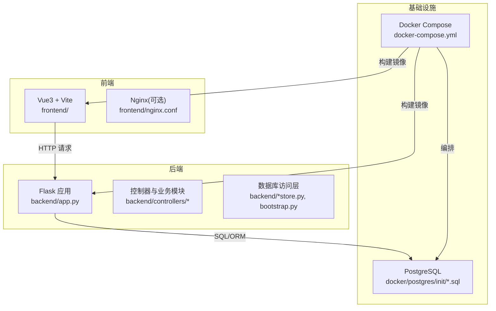
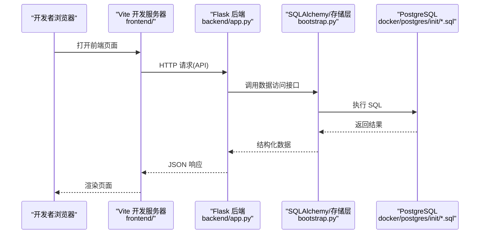
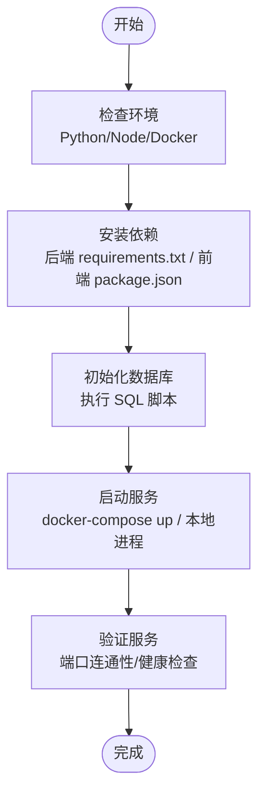
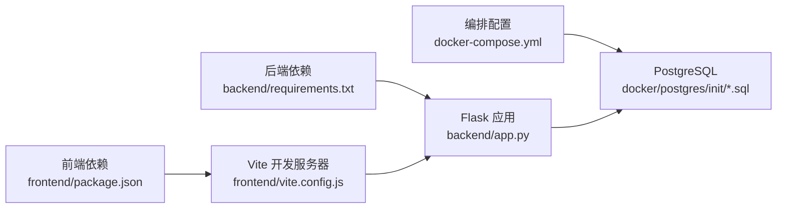

# 本地开发环境搭建

<cite>
**本文引用的文件**   
- [docker-compose.yml](file://docker-compose.yml)
- [backend/requirements.txt](file://backend/requirements.txt)
- [frontend/package.json](file://frontend/package.json)
- [frontend/vite.config.js](file://frontend/vite.config.js)
- [backend/app.py](file://backend/app.py)
- [backend/bootstrap.py](file://backend/bootstrap.py)
- [backend/config_manager.py](file://backend/config_manager.py)
- [backend/Dockerfile](file://backend/Dockerfile)
- [frontend/Dockerfile](file://frontend/Dockerfile)
- [docker/postgres/init/001_bookshelf_schema.sql](file://docker/postgres/init/001_bookshelf_schema.sql)
- [docker/postgres/init/002_angel_group_data.sql](file://docker/postgres/init/002_angel_group_data.sql)
- [docker/postgres/init/003_bookshelf_agent1_prompt_upgrade.sql](file://docker/postgres/init/003_bookshelf_agent1_prompt_upgrade.sql)
- [docker/postgres/init/004_report_config.sql](file://docker/postgres/init/004_report_config.sql)
- [docker/postgres/init/005_report_thresholds.sql](file://docker/postgres/init/005_report_thresholds.sql)
- [docker/postgres/init/006_system_event_logs.sql](file://docker/postgres/init/006_system_event_logs.sql)
- [start_backend.bat](file://start_backend.bat)
- [start_frontend.bat](file://start_frontend.bat)
- [start_all.bat](file://start_all.bat)
- [deploy.sh](file://deploy.sh)
- [doctor.sh](file://doctor.sh)
- [README.md](file://README.md)
</cite>

## 目录
1. [简介](#简介)
2. [项目结构](#项目结构)
3. [核心组件](#核心组件)
4. [架构总览](#架构总览)
5. [详细组件分析](#详细组件分析)
6. [依赖关系分析](#依赖关系分析)
7. [性能考虑](#性能考虑)
8. [故障排查指南](#故障排查指南)
9. [结论](#结论)
10. [附录](#附录)

## 简介
本指南面向希望在本地快速搭建 SmartAsk 智能问数平台的开发者，覆盖以下目标：
- 安装与配置 Python 3.8+、Node.js 16+、PostgreSQL 数据库及环境变量
- 安装后端（Flask、SQLAlchemy、Pydantic 等）与前端（Vue 3、Vite、Element Plus 等）依赖
- 使用 Docker 与 docker-compose 启动服务
- 初始化数据库表结构与导入初始数据
- Windows、macOS、Linux 的差异化配置说明
- 常见环境问题排查（端口冲突、权限问题、网络配置等）

## 项目结构
SmartAsk 采用前后端分离架构：
- 后端：Python Flask 应用，位于 backend 目录，包含控制器、业务逻辑、迁移脚本与测试
- 前端：Vue 3 + Vite 应用，位于 frontend 目录，包含页面、组件、路由与状态管理
- 数据库：PostgreSQL，通过 docker-compose 启动，并挂载初始化 SQL 脚本
- 容器化：根目录提供 docker-compose.yml，以及前后端各自的 Dockerfile

图表来源
- [docker-compose.yml](file://docker-compose.yml)
- [backend/app.py](file://backend/app.py)
- [frontend/vite.config.js](file://frontend/vite.config.js)
- [docker/postgres/init/001_bookshelf_schema.sql](file://docker/postgres/init/001_bookshelf_schema.sql)

章节来源
- [README.md](file://README.md)

## 核心组件
- 后端服务：Flask 应用入口与配置加载，负责路由、鉴权、数据访问与业务处理
- 前端应用：Vue 3 + Vite 开发服务器，提供热重载与代理到后端 API
- 数据库：PostgreSQL，包含书柜、报告配置、系统日志等初始表结构与数据
- 容器编排：docker-compose 统一启动数据库、后端与前端服务

章节来源
- [backend/app.py](file://backend/app.py)
- [backend/bootstrap.py](file://backend/bootstrap.py)
- [backend/config_manager.py](file://backend/config_manager.py)
- [frontend/vite.config.js](file://frontend/vite.config.js)
- [docker/postgres/init/001_bookshelf_schema.sql](file://docker/postgres/init/001_bookshelf_schema.sql)

## 架构总览
下图展示了本地开发环境的整体交互流程：前端通过 Vite 开发服务器发起请求，经代理转发至后端 Flask；后端通过 SQLAlchemy 访问 PostgreSQL。Docker Compose 负责拉起数据库与容器化服务。

图表来源
- [frontend/vite.config.js](file://frontend/vite.config.js)
- [backend/app.py](file://backend/app.py)
- [backend/bootstrap.py](file://backend/bootstrap.py)
- [docker/postgres/init/001_bookshelf_schema.sql](file://docker/postgres/init/001_bookshelf_schema.sql)

## 详细组件分析

### 环境与工具准备
- Python 3.8+：用于运行后端 Flask 应用与脚本
- Node.js 16+：用于运行前端 Vue 3 + Vite 开发服务器
- PostgreSQL：推荐使用 Docker 方式启动，便于初始化脚本自动执行
- Docker & Docker Compose：用于一键拉起数据库与容器化服务

章节来源
- [backend/requirements.txt](file://backend/requirements.txt)
- [frontend/package.json](file://frontend/package.json)
- [docker-compose.yml](file://docker-compose.yml)

### 后端依赖安装与配置
- 依赖清单：Flask、SQLAlchemy、Pydantic 等由 requirements.txt 定义
- 虚拟环境：建议使用 venv 或 conda 创建隔离环境
- 环境变量：后端通过 config_manager 读取配置，需设置数据库连接、密钥等关键变量
- 启动方式：可直接运行 app.py，或通过提供的批处理脚本启动

章节来源
- [backend/requirements.txt](file://backend/requirements.txt)
- [backend/config_manager.py](file://backend/config_manager.py)
- [backend/app.py](file://backend/app.py)
- [start_backend.bat](file://start_backend.bat)

### 前端依赖安装与配置
- 依赖清单：Vue 3、Vite、Element Plus 等由 package.json 定义
- 包管理器：支持 npm/pnpm/yarn，推荐 pnpm 以获得更快的安装速度
- 开发服务器：vite.config.js 中配置了代理到后端 API，避免跨域问题
- 启动方式：直接运行 vite dev，或使用 start_frontend.bat

章节来源
- [frontend/package.json](file://frontend/package.json)
- [frontend/vite.config.js](file://frontend/vite.config.js)
- [start_frontend.bat](file://start_frontend.bat)

### Docker 环境搭建与服务启动
- 编排文件：docker-compose.yml 定义了数据库、后端、前端等服务
- 初始化脚本：docker/postgres/init/*.sql 在数据库首次启动时自动执行
- 镜像构建：backend/Dockerfile 与 frontend/Dockerfile 分别定义构建步骤
- 启动命令：使用 docker-compose up -d 拉起所有服务

章节来源
- [docker-compose.yml](file://docker-compose.yml)
- [backend/Dockerfile](file://backend/Dockerfile)
- [frontend/Dockerfile](file://frontend/Dockerfile)
- [docker/postgres/init/001_bookshelf_schema.sql](file://docker/postgres/init/001_bookshelf_schema.sql)
- [docker/postgres/init/002_angel_group_data.sql](file://docker/postgres/init/002_angel_group_data.sql)
- [docker/postgres/init/003_bookshelf_agent1_prompt_upgrade.sql](file://docker/postgres/init/003_bookshelf_agent1_prompt_upgrade.sql)
- [docker/postgres/init/004_report_config.sql](file://docker/postgres/init/004_report_config.sql)
- [docker/postgres/init/005_report_thresholds.sql](file://docker/postgres/init/005_report_thresholds.sql)
- [docker/postgres/init/006_system_event_logs.sql](file://docker/postgres/init/006_system_event_logs.sql)

### 数据库初始化过程
- 表结构创建：001_bookshelf_schema.sql 定义基础表结构
- 初始数据导入：002_angel_group_data.sql 导入示例数据集
- 提示词升级：003_bookshelf_agent1_prompt_upgrade.sql 更新 Agent 提示词
- 报告配置：004_report_config.sql、005_report_thresholds.sql 初始化报告相关配置
- 系统日志：006_system_event_logs.sql 创建系统事件日志表

章节来源
- [docker/postgres/init/001_bookshelf_schema.sql](file://docker/postgres/init/001_bookshelf_schema.sql)
- [docker/postgres/init/002_angel_group_data.sql](file://docker/postgres/init/002_angel_group_data.sql)
- [docker/postgres/init/003_bookshelf_agent1_prompt_upgrade.sql](file://docker/postgres/init/003_bookshelf_agent1_prompt_upgrade.sql)
- [docker/postgres/init/004_report_config.sql](file://docker/postgres/init/004_report_config.sql)
- [docker/postgres/init/005_report_thresholds.sql](file://docker/postgres/init/005_report_thresholds.sql)
- [docker/postgres/init/006_system_event_logs.sql](file://docker/postgres/init/006_system_event_logs.sql)

### 平台启动流程
- 一键启动：使用 start_all.bat 或 deploy.sh 拉起全部服务
- 分步启动：先启动数据库，再启动后端与前端
- 健康检查：可通过 doctor.sh 进行环境诊断

图表来源
- [start_all.bat](file://start_all.bat)
- [deploy.sh](file://deploy.sh)
- [doctor.sh](file://doctor.sh)

章节来源
- [start_all.bat](file://start_all.bat)
- [deploy.sh](file://deploy.sh)
- [doctor.sh](file://doctor.sh)

## 依赖关系分析
- 后端依赖：Flask、SQLAlchemy、Pydantic 等由 requirements.txt 管理
- 前端依赖：Vue 3、Vite、Element Plus 等由 package.json 管理
- 容器依赖：docker-compose.yml 协调数据库与应用的版本与网络

图表来源
- [backend/requirements.txt](file://backend/requirements.txt)
- [frontend/package.json](file://frontend/package.json)
- [docker-compose.yml](file://docker-compose.yml)

章节来源
- [backend/requirements.txt](file://backend/requirements.txt)
- [frontend/package.json](file://frontend/package.json)
- [docker-compose.yml](file://docker-compose.yml)

## 性能考虑
- 数据库连接池：合理配置 SQLAlchemy 连接池参数，避免连接耗尽
- 前端资源优化：启用 Vite 生产模式下的代码分割与压缩
- 缓存策略：对热点查询结果进行缓存，减少数据库压力
- 容器资源限制：为各服务设置合理的 CPU 与内存限制，避免资源争用

[本节为通用指导，不直接分析具体文件]

## 故障排查指南
- 端口冲突：检查本机是否占用 80/443/5432 等端口，必要时修改 docker-compose 或 vite.config 中的端口映射
- 权限问题：确保数据库初始化脚本有执行权限，后端进程对配置文件具有读权限
- 网络配置：确认 Vite 代理地址与后端服务地址一致，防火墙允许相应端口通信
- 环境变量缺失：检查 config_manager 所需的环境变量是否已正确设置
- 依赖安装失败：清理缓存后重试安装，或切换国内镜像源

章节来源
- [backend/config_manager.py](file://backend/config_manager.py)
- [frontend/vite.config.js](file://frontend/vite.config.js)
- [docker-compose.yml](file://docker-compose.yml)

## 结论
通过本指南，您可以在 Windows、macOS 与 Linux 环境下快速搭建 SmartAsk 智能问数平台的本地开发环境。建议优先使用 Docker 与 docker-compose 简化依赖与环境差异，结合提供的批处理脚本提升开发效率。遇到问题时，可参考故障排查指南逐步定位与解决。

[本节为总结性内容，不直接分析具体文件]

## 附录
- 常用命令
  - 启动全部服务：start_all.bat 或 deploy.sh
  - 仅启动后端：start_backend.bat
  - 仅启动前端：start_frontend.bat
  - 环境诊断：doctor.sh
- 配置文件位置
  - 后端配置：backend/config_manager.py
  - 前端代理：frontend/vite.config.js
  - 数据库初始化：docker/postgres/init/*.sql

章节来源
- [start_all.bat](file://start_all.bat)
- [deploy.sh](file://deploy.sh)
- [start_backend.bat](file://start_backend.bat)
- [start_frontend.bat](file://start_frontend.bat)
- [doctor.sh](file://doctor.sh)
- [backend/config_manager.py](file://backend/config_manager.py)
- [frontend/vite.config.js](file://frontend/vite.config.js)
- [docker/postgres/init/001_bookshelf_schema.sql](file://docker/postgres/init/001_bookshelf_schema.sql)