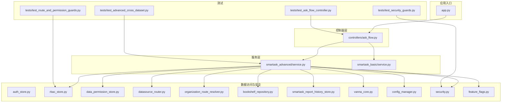
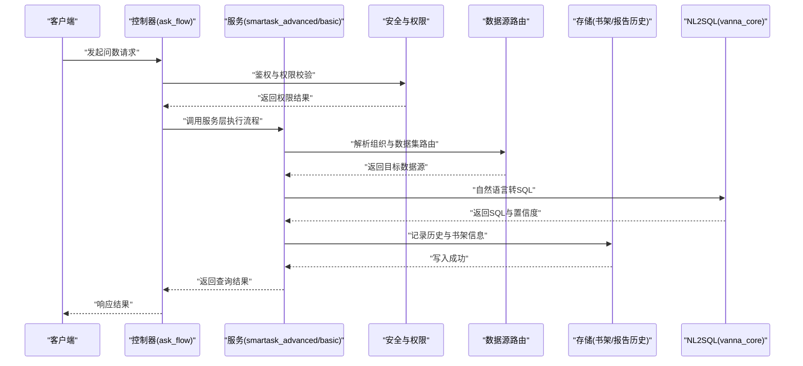
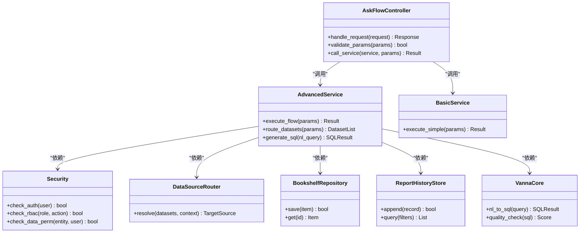
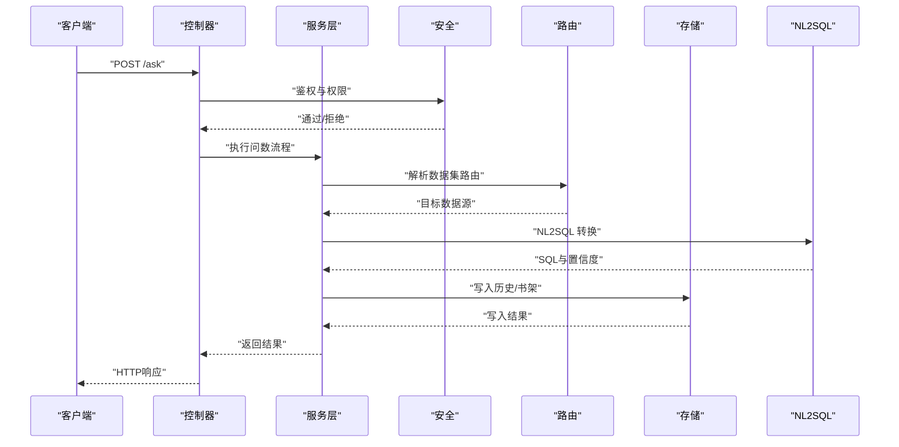
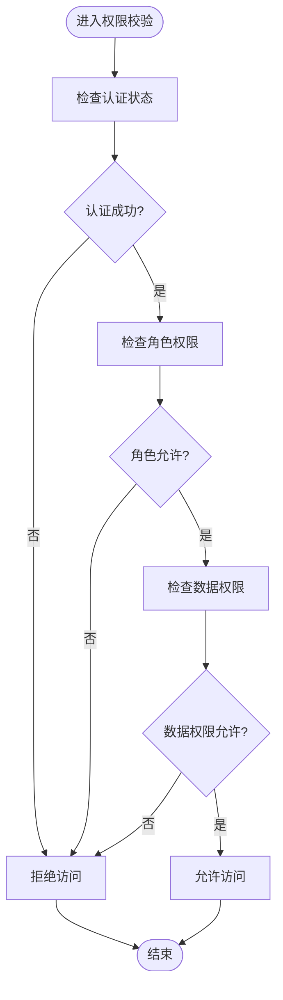
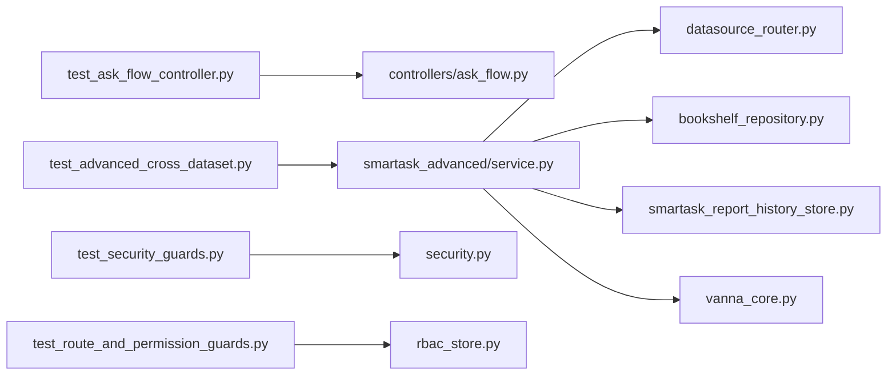

# 单元测试

<cite>
**本文引用的文件**   
- [backend/tests/test_ask_flow_controller.py](file://backend/tests/test_ask_flow_controller.py)
- [backend/tests/test_advanced_cross_dataset.py](file://backend/tests/test_advanced_cross数据集.py)
- [backend/tests/test_security_guards.py](file://backend/tests/test_security_guards.py)
- [backend/tests/test_route_and_permission_guards.py](file://backend/tests/test_route_and_permission_guards.py)
- [backend/tests/test_basic_unique_level_routing.py](file://backend/tests/test_basic_unique_level_routing.py)
- [backend/tests/test_ecommerce_filter_intent.py](file://backend/tests/test_ecommerce_filter_intent.py)
- [backend/tests/test_entity_resolution_guard.py](file://backend/tests/test_entity_resolution_guard.py)
- [backend/tests/test_filter_intent_phrases.py](file://backend/tests/test_filter_intent_phrases.py)
- [backend/tests/test_query_intent_metrics.py](file://backend/tests/test_query_intent_metrics.py)
- [backend/tests/test_build_dataset_node_index.py](file://backend/tests/test_build_dataset_node_index.py)
- [backend/tests/test_amount_formatting.py](file://backend/tests/test_amount_formatting.py)
- [backend/tests/test_basic_route_branch_disambiguation.py](file://backend/tests/test_basic_route分支消歧.py)
- [backend/tests/test_advanced_route_guard_confirmation.py](file://backend/tests/test_advanced_route_guard_confirmation.py)
- [backend/tests/test_smartask_report_history_store.py](file://backend/tests/test_smartask_report_history_store.py)
- [backend/app.py](file://backend/app.py)
- [backend/controllers/ask_flow.py](file://backend/controllers/ask_flow.py)
- [backend/smartask_advanced/service.py](file://backend/smartask_advanced/service.py)
- [backend/smartask_basic/service.py](file://backend/smartask_basic/service.py)
- [backend/auth_store.py](file://backend/auth_store.py)
- [backend/data_permission_store.py](file://backend/data_permission_store.py)
- [backend/rbac_store.py](file://backend/rbac_store.py)
- [backend/datasource_router.py](file://backend/datasource_router.py)
- [backend/config_manager.py](file://backend/config_manager.py)
- [backend/security.py](file://backend/security.py)
- [backend/organization_route_resolver.py](file://backend/organization_route_resolver.py)
- [backend/bookshelf_repository.py](file://backend/bookshelf_repository.py)
- [backend/smartask_report_history_store.py](file://backend/smartask_report_history_store.py)
- [backend/vanna_core.py](file://backend/vanna_core.py)
- [backend/feature_flags.py](file://backend/feature_flags.py)
- [config/run_smartask_tests.py](file://config/run_smartask_tests.py)
</cite>

## 目录
1. [简介](#简介)
2. [项目结构](#项目结构)
3. [核心组件](#核心组件)
4. [架构总览](#架构总览)
5. [详细组件分析](#详细组件分析)
6. [依赖关系分析](#依赖关系分析)
7. [性能考量](#性能考量)
8. [故障排查指南](#故障排查指南)
9. [结论](#结论)
10. [附录](#附录)

## 简介
本指南面向 SmartAsk 项目的后端测试，聚焦 pytest 框架的配置与使用、测试组织与命名规范、高质量用例编写（数据准备、Mock、断言）、分层测试策略（控制器层、服务层、数据访问层）、NL2SQL 转换逻辑、权限验证、数据集路由等核心功能的测试方法。同时涵盖覆盖率要求与报告生成、异步代码测试与错误处理最佳实践，帮助团队建立稳定、可维护的测试体系。

## 项目结构
SmartAsk 后端采用模块化分层设计：
- 控制器层：对外暴露 HTTP API，负责请求解析、参数校验、调用服务层。
- 服务层：封装业务编排与领域逻辑，协调多个子系统完成复杂流程。
- 数据访问层：封装数据库、缓存、外部系统交互，提供稳定的数据接口。
- 安全与权限：统一鉴权、RBAC、数据权限控制。
- 配置与特性开关：集中管理运行时配置与功能开关。

测试目录位于 backend/tests，按功能域划分测试文件，便于定位与维护。

图表来源
- [backend/app.py](file://backend/app.py)
- [backend/controllers/ask_flow.py](file://backend/controllers/ask_flow.py)
- [backend/smartask_advanced/service.py](file://backend/smartask_advanced/service.py)
- [backend/smartask_basic/service.py](file://backend/smartask_basic/service.py)
- [backend/auth_store.py](file://backend/auth_store.py)
- [backend/rbac_store.py](file://backend/rbac_store.py)
- [backend/data_permission_store.py](file://backend/data_permission_store.py)
- [backend/datasource_router.py](file://backend/datasource_router.py)
- [backend/organization_route_resolver.py](file://backend/organization_route_resolver.py)
- [backend/bookshelf_repository.py](file://backend/bookshelf_repository.py)
- [backend/smartask_report_history_store.py](file://backend/smartask_report_history_store.py)
- [backend/vanna_core.py](file://backend/vanna_core.py)
- [backend/config_manager.py](file://backend/config_manager.py)
- [backend/security.py](file://backend/security.py)
- [backend/feature_flags.py](file://backend/feature_flags.py)
- [backend/tests/test_ask_flow_controller.py](file://backend/tests/test_ask_flow_controller.py)
- [backend/tests/test_advanced_cross_dataset.py](file://backend/tests/test_advanced_cross_dataset.py)
- [backend/tests/test_security_guards.py](file://backend/tests/test_security_guards.py)
- [backend/tests/test_route_and_permission_guards.py](file://backend/tests/test_route_and_permission_guards.py)

章节来源
- [backend/app.py](file://backend/app.py)
- [backend/controllers/ask_flow.py](file://backend/controllers/ask_flow.py)
- [backend/smartask_advanced/service.py](file://backend/smartask_advanced/service.py)
- [backend/smartask_basic/service.py](file://backend/smartask_basic/service.py)
- [backend/auth_store.py](file://backend/auth_store.py)
- [backend/rbac_store.py](file://backend/rbac_store.py)
- [backend/data_permission_store.py](file://backend/data_permission_store.py)
- [backend/datasource_router.py](file://backend/datasource_router.py)
- [backend/organization_route_resolver.py](file://backend/organization_route_resolver.py)
- [backend/bookshelf_repository.py](file://backend/bookshelf_repository.py)
- [backend/smartask_report_history_store.py](file://backend/smartask_report_history_store.py)
- [backend/vanna_core.py](file://backend/vanna_core.py)
- [backend/config_manager.py](file://backend/config_manager.py)
- [backend/security.py](file://backend/security.py)
- [backend/feature_flags.py](file://backend/feature_flags.py)
- [backend/tests/test_ask_flow_controller.py](file://backend/tests/test_ask_flow_controller.py)
- [backend/tests/test_advanced_cross_dataset.py](file://backend/tests/test_advanced_cross_dataset.py)
- [backend/tests/test_security_guards.py](file://backend/tests/test_security_guards.py)
- [backend/tests/test_route_and_permission_guards.py](file://backend/tests/test_route_and_permission_guards.py)

## 核心组件
- 控制器层（ask_flow）：接收用户问数请求，进行参数校验、权限检查、路由决策，并调用服务层执行 NL2SQL 与结果聚合。
- 高级服务（smartask_advanced/service）：实现跨数据集路由、意图识别、证据投票、SQL 质量评估、模板策略等复杂流程。
- 基础服务（smartask_basic/service）：提供基础问数能力，如单数据集查询、简单过滤与排序。
- 安全与权限（security、rbac_store、data_permission_store）：统一鉴权、角色权限、数据级权限控制。
- 数据源路由（datasource_router、organization_route_resolver）：根据组织与上下文选择合适的数据源与视图。
- 存储与历史（bookshelf_repository、smartask_report_history_store）：持久化书架、报告历史等元数据。
- NL2SQL 核心（vanna_core）：将自然语言转换为 SQL，并与数据源交互。
- 配置与特性（config_manager、feature_flags）：集中管理配置项与功能开关。

章节来源
- [backend/controllers/ask_flow.py](file://backend/controllers/ask_flow.py)
- [backend/smartask_advanced/service.py](file://backend/smartask_advanced/service.py)
- [backend/smartask_basic/service.py](file://backend/smartask_basic/service.py)
- [backend/security.py](file://backend/security.py)
- [backend/rbac_store.py](file://backend/rbac_store.py)
- [backend/data_permission_store.py](file://backend/data_permission_store.py)
- [backend/datasource_router.py](file://backend/datasource_router.py)
- [backend/organization_route_resolver.py](file://backend/organization_route_resolver.py)
- [backend/bookshelf_repository.py](file://backend/bookshelf_repository.py)
- [backend/smartask_report_history_store.py](file://backend/smartask_report_history_store.py)
- [backend/vanna_core.py](file://backend/vanna_core.py)
- [backend/config_manager.py](file://backend/config_manager.py)
- [backend/feature_flags.py](file://backend/feature_flags.py)

## 架构总览
SmartAsk 的后端以“控制器-服务-数据访问”三层为核心，配合安全与权限模块、配置与特性开关、NL2SQL 引擎与存储组件，形成完整的智能问数链路。测试覆盖从控制器入参到服务编排、再到数据访问与权限校验的全链路。

图表来源
- [backend/controllers/ask_flow.py](file://backend/controllers/ask_flow.py)
- [backend/smartask_advanced/service.py](file://backend/smartask_advanced/service.py)
- [backend/smartask_basic/service.py](file://backend/smartask_basic/service.py)
- [backend/security.py](file://backend/security.py)
- [backend/datasource_router.py](file://backend/datasource_router.py)
- [backend/bookshelf_repository.py](file://backend/bookshelf_repository.py)
- [backend/smartask_report_history_store.py](file://backend/smartask_report_history_store.py)
- [backend/vanna_core.py](file://backend/vanna_core.py)

## 详细组件分析

### 控制器层测试策略（ask_flow）
- 职责边界：参数校验、权限前置检查、调用服务层、组装响应。
- 测试要点：
  - 入参合法性与缺失字段处理。
  - 权限拦截路径（未授权、越权）。
  - 服务层异常回退与错误码映射。
  - 响应结构与字段完整性。
- Mock 建议：
  - 模拟权限校验结果（通过/拒绝）。
  - 模拟服务层返回（成功/失败/部分成功）。
  - 模拟外部依赖（NL2SQL、存储）抛出异常或返回空结果。

章节来源
- [backend/controllers/ask_flow.py](file://backend/controllers/ask_flow.py)
- [backend/tests/test_ask_flow_controller.py](file://backend/tests/test_ask_flow_controller.py)

### 服务层测试策略（advanced/basic）
- 职责边界：业务编排、意图识别、路由决策、证据聚合、SQL 质量评估。
- 测试要点：
  - 跨数据集路由的正确性（多表关联、冲突解决）。
  - 意图识别与过滤短语匹配。
  - 实体解析与消歧策略。
  - 指标计算与格式化（金额、时间等）。
- Mock 建议：
  - 模拟数据源路由返回不同数据集。
  - 模拟 NL2SQL 返回多种 SQL 与置信度。
  - 模拟存储写入成功或失败。

章节来源
- [backend/smartask_advanced/service.py](file://backend/smartask_advanced/service.py)
- [backend/smartask_basic/service.py](file://backend/smartask_basic/service.py)
- [backend/tests/test_advanced_cross_dataset.py](file://backend/tests/test_advanced_cross_dataset.py)
- [backend/tests/test_filter_intent_phrases.py](file://backend/tests/test_filter_intent_phrases.py)
- [backend/tests/test_entity_resolution_guard.py](file://backend/tests/test_entity_resolution_guard.py)
- [backend/tests/test_amount_formatting.py](file://backend/tests/test_amount_formatting.py)

### 数据访问层测试策略（存储与路由）
- 职责边界：数据读写、事务控制、外部系统交互。
- 测试要点：
  - 数据一致性（插入、更新、删除）。
  - 并发场景下的锁与幂等性。
  - 路由规则正确性（组织维度、数据源选择）。
- Mock 建议：
  - 模拟数据库连接失败、超时、死锁。
  - 模拟外部 API 限流、降级。

章节来源
- [backend/bookshelf_repository.py](file://backend/bookshelf_repository.py)
- [backend/smartask_report_history_store.py](file://backend/smartask_report_history_store.py)
- [backend/datasource_router.py](file://backend/datasource_router.py)
- [backend/organization_route_resolver.py](file://backend/organization_route_resolver.py)
- [backend/tests/test_build_dataset_node_index.py](file://backend/tests/test_build_dataset_node_index.py)

### 安全与权限测试策略
- 职责边界：鉴权、RBAC、数据权限控制。
- 测试要点：
  - 未登录访问拦截。
  - 角色权限不足时的拒绝。
  - 数据级权限（行级、列级）限制。
- Mock 建议：
  - 模拟用户会话、角色、权限矩阵。
  - 模拟权限存储返回不同结果。

章节来源
- [backend/security.py](file://backend/security.py)
- [backend/rbac_store.py](file://backend/rbac_store.py)
- [backend/data_permission_store.py](file://backend/data_permission_store.py)
- [backend/tests/test_security_guards.py](file://backend/tests/test_security_guards.py)
- [backend/tests/test_route_and_permission_guards.py](file://backend/tests/test_route_and_permission_guards.py)

### NL2SQL 转换逻辑测试
- 职责边界：自然语言到 SQL 的转换、置信度评估、SQL 质量校验。
- 测试要点：
  - 意图到 SQL 的映射准确性。
  - 多意图组合与优先级。
  - SQL 语法与语义校验。
- Mock 建议：
  - 模拟 LLM 返回不同 SQL 与置信度。
  - 模拟 SQL 解析器报错与修复。

章节来源
- [backend/vanna_core.py](file://backend/vanna_core.py)
- [backend/smartask_advanced/service.py](file://backend/smartask_advanced/service.py)
- [backend/tests/test_query_intent_metrics.py](file://backend/tests/test_query_intent_metrics.py)

### 数据集路由与确认守卫
- 职责边界：根据上下文选择数据集、处理歧义与确认。
- 测试要点：
  - 唯一级别路由（单数据集优先）。
  - 分支消歧（多候选集选择）。
  - 确认守卫（用户确认后再执行）。
- Mock 建议：
  - 模拟路由规则库与组织树。
  - 模拟用户确认输入。

章节来源
- [backend/datasource_router.py](file://backend/datasource_router.py)
- [backend/organization_route_resolver.py](file://backend/organization_route_resolver.py)
- [backend/tests/test_basic_unique_level_routing.py](file://backend/tests/test_basic_unique_level_routing.py)
- [backend/tests/test_basic_route_branch_disambiguation.py](file://backend/tests/test_basic_route_branch_disambiguation.py)
- [backend/tests/test_advanced_route_guard_confirmation.py](file://backend/tests/test_advanced_route_guard_confirmation.py)

### 电商过滤意图测试
- 职责边界：电商场景下的过滤条件解析与组合。
- 测试要点：
  - 价格区间、品牌、类目等过滤词识别。
  - 多条件组合与优先级。
- Mock 建议：
  - 模拟意图词典与规则引擎。

章节来源
- [backend/tests/test_ecommerce_filter_intent.py](file://backend/tests/test_ecommerce_filter_intent.py)

### 报告历史存储测试
- 职责边界：报告历史记录的增删改查与一致性。
- 测试要点：
  - 写入成功与失败回滚。
  - 查询分页与排序。
- Mock 建议：
  - 模拟存储层异常与延迟。

章节来源
- [backend/smartask_report_history_store.py](file://backend/smartask_report_history_store.py)
- [backend/tests/test_smartask_report_history_store.py](file://backend/tests/test_smartask_report_history_store.py)

#### 类图（示例：服务层与依赖）

图表来源
- [backend/controllers/ask_flow.py](file://backend/controllers/ask_flow.py)
- [backend/smartask_advanced/service.py](file://backend/smartask_advanced/service.py)
- [backend/smartask_basic/service.py](file://backend/smartask_basic/service.py)
- [backend/security.py](file://backend/security.py)
- [backend/datasource_router.py](file://backend/datasource_router.py)
- [backend/bookshelf_repository.py](file://backend/bookshelf_repository.py)
- [backend/smartask_report_history_store.py](file://backend/smartask_report_history_store.py)
- [backend/vanna_core.py](file://backend/vanna_core.py)

#### 序列图（控制器调用服务）

图表来源
- [backend/controllers/ask_flow.py](file://backend/controllers/ask_flow.py)
- [backend/smartask_advanced/service.py](file://backend/smartask_advanced/service.py)
- [backend/security.py](file://backend/security.py)
- [backend/datasource_router.py](file://backend/datasource_router.py)
- [backend/smartask_report_history_store.py](file://backend/smartask_report_history_store.py)
- [backend/vanna_core.py](file://backend/vanna_core.py)

#### 流程图（权限校验）

图表来源
- [backend/security.py](file://backend/security.py)
- [backend/rbac_store.py](file://backend/rbac_store.py)
- [backend/data_permission_store.py](file://backend/data_permission_store.py)

## 依赖关系分析
- 控制器依赖服务层，服务层依赖安全、路由、存储与 NL2SQL。
- 测试文件按功能域组织，分别覆盖控制器、服务、安全与权限、NL2SQL、存储等。
- 外部依赖（数据库、LLM、文件系统）应通过 Mock 隔离，确保测试稳定性与速度。

图表来源
- [backend/tests/test_ask_flow_controller.py](file://backend/tests/test_ask_flow_controller.py)
- [backend/tests/test_advanced_cross_dataset.py](file://backend/tests/test_advanced_cross_dataset.py)
- [backend/tests/test_security_guards.py](file://backend/tests/test_security_guards.py)
- [backend/tests/test_route_and_permission_guards.py](file://backend/tests/test_route_and_permission_guards.py)
- [backend/controllers/ask_flow.py](file://backend/controllers/ask_flow.py)
- [backend/smartask_advanced/service.py](file://backend/smartask_advanced/service.py)
- [backend/security.py](file://backend/security.py)
- [backend/rbac_store.py](file://backend/rbac_store.py)
- [backend/datasource_router.py](file://backend/datasource_router.py)
- [backend/bookshelf_repository.py](file://backend/bookshelf_repository.py)
- [backend/smartask_report_history_store.py](file://backend/smartask_report_history_store.py)
- [backend/vanna_core.py](file://backend/vanna_core.py)

章节来源
- [backend/tests/test_ask_flow_controller.py](file://backend/tests/test_ask_flow_controller.py)
- [backend/tests/test_advanced_cross_dataset.py](file://backend/tests/test_advanced_cross_dataset.py)
- [backend/tests/test_security_guards.py](file://backend/tests/test_security_guards.py)
- [backend/tests/test_route_and_permission_guards.py](file://backend/tests/test_route_and_permission_guards.py)
- [backend/controllers/ask_flow.py](file://backend/controllers/ask_flow.py)
- [backend/smartask_advanced/service.py](file://backend/smartask_advanced/service.py)
- [backend/security.py](file://backend/security.py)
- [backend/rbac_store.py](file://backend/rbac_store.py)
- [backend/datasource_router.py](file://backend/datasource_router.py)
- [backend/bookshelf_repository.py](file://backend/bookshelf_repository.py)
- [backend/smartask_report_history_store.py](file://backend/smartask_report_history_store.py)
- [backend/vanna_core.py](file://backend/vanna_core.py)

## 性能考量
- 测试数据准备：使用轻量级固定数据与工厂模式，避免大对象构建开销。
- Mock 策略：仅 Mock 外部依赖，保持核心逻辑真实执行，提高覆盖率与真实性。
- 并行执行：pytest-xdist 并行运行测试，缩短 CI 时间。
- 资源清理：每个测试用例结束后清理临时数据，避免污染。
- 慢测试隔离：将耗时测试标记为慢测试，按需运行。

## 故障排查指南
- 常见错误：
  - 权限校验失败：检查用户会话、角色与数据权限配置。
  - 路由错误：核对组织树与数据集映射规则。
  - NL2SQL 异常：检查提示词与模型返回格式。
  - 存储写入失败：检查事务与重试机制。
- 调试技巧：
  - 启用详细日志与追踪 ID。
  - 使用 pytest-sugar 增强输出可读性。
  - 针对失败用例添加最小复现数据与断言。

章节来源
- [backend/security.py](file://backend/security.py)
- [backend/rbac_store.py](file://backend/rbac_store.py)
- [backend/data_permission_store.py](file://backend/data_permission_store.py)
- [backend/datasource_router.py](file://backend/datasource_router.py)
- [backend/vanna_core.py](file://backend/vanna_core.py)
- [backend/smartask_report_history_store.py](file://backend/smartask_report_history_store.py)

## 结论
通过分层测试策略、严格的 Mock 与断言、以及完善的覆盖率与报告机制，SmartAsk 的测试体系能够有效保障 NL2SQL 转换、权限验证、数据集路由等核心功能的稳定性与可维护性。建议持续优化测试数据工厂、扩展异步测试覆盖、完善错误处理用例，以提升整体质量与交付效率。

## 附录

### pytest 配置与运行
- 配置文件：在仓库根目录或 backend 目录下创建 pytest.ini 或 pyproject.toml，指定测试目录、插件与选项。
- 运行命令：
  - 全量运行：pytest
  - 指定目录：pytest backend/tests
  - 并行执行：pytest -n auto
  - 覆盖率：pytest --cov=backend --cov-report=html
- 覆盖率阈值：在配置中设置 minimum-converage 以阻止低覆盖率合并。

章节来源
- [config/run_smartask_tests.py](file://config/run_smartask_tests.py)

### 测试文件组织与命名规范
- 目录结构：按功能域划分测试文件，如 test_ask_flow_controller.py、test_security_guards.py。
- 命名约定：
  - 文件名以 test_ 开头，描述被测模块或功能。
  - 函数名以 test_ 开头，描述具体场景。
  - 类名以 Test 开头，用于分组相关用例。
- 数据准备：
  - 使用 fixtures 提供共享数据。
  - 使用工厂函数生成动态数据。
  - 使用 JSON/YAML 管理静态测试数据。

章节来源
- [backend/tests/test_ask_flow_controller.py](file://backend/tests/test_ask_flow_controller.py)
- [backend/tests/test_security_guards.py](file://backend/tests/test_security_guards.py)

### Mock 对象与依赖注入
- 依赖注入：在服务层通过构造函数或参数注入依赖，便于替换为 Mock。
- Mock 策略：
  - 使用 unittest.mock.patch 或 pytest-mock 替换外部依赖。
  - 模拟异常路径（网络错误、数据库超时、权限拒绝）。
  - 验证调用次数与参数。
- 示例场景：
  - 模拟权限存储返回不同结果。
  - 模拟 NL2SQL 返回多种 SQL 与置信度。
  - 模拟存储写入成功或失败。

章节来源
- [backend/smartask_advanced/service.py](file://backend/smartask_advanced/service.py)
- [backend/security.py](file://backend/security.py)
- [backend/vanna_core.py](file://backend/vanna_core.py)

### 断言技巧与高质量用例
- 断言原则：
  - 明确预期行为与边界条件。
  - 使用精确断言（类型、结构、值）。
  - 覆盖正常、异常与边界路径。
- 常用技巧：
  - 使用 assert 与自定义断言函数。
  - 使用 pytest.raises 捕获异常。
  - 使用 assert_called_with 验证 Mock 调用。
- 示例场景：
  - 权限校验失败时抛出特定异常。
  - NL2SQL 返回空结果时降级处理。
  - 存储写入失败时回滚事务。

章节来源
- [backend/tests/test_security_guards.py](file://backend/tests/test_security_guards.py)
- [backend/tests/test_ask_flow_controller.py](file://backend/tests/test_ask_flow_controller.py)

### 异步代码测试与错误处理
- 异步测试：
  - 使用 pytest-asyncio 支持 async def 测试函数。
  - 使用 asyncio.run 或 aiohttp.ClientSession 模拟异步调用。
- 错误处理：
  - 模拟超时、重试、熔断等场景。
  - 验证错误码与消息格式。
  - 确保日志与监控上报。

章节来源
- [backend/smartask_advanced/service.py](file://backend/smartask_advanced/service.py)
- [backend/security.py](file://backend/security.py)

### 覆盖率要求与报告生成
- 覆盖率目标：
  - 行覆盖率 ≥ 80%。
  - 分支覆盖率 ≥ 70%。
  - 关键模块（安全、路由、NL2SQL）≥ 90%。
- 报告生成：
  - HTML 报告：pytest --cov=backend --cov-report=html
  - XML 报告：pytest --cov=backend --cov-report=xml
  - 终端输出：pytest --cov=backend --cov-report=term-missing
- 集成 CI：
  - 在流水线中运行覆盖率检查。
  - 低于阈值时阻断合并。

章节来源
- [config/run_smartask_tests.py](file://config/run_smartask_tests.py)