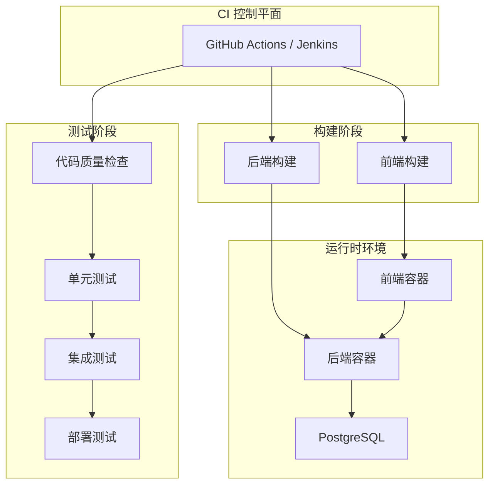
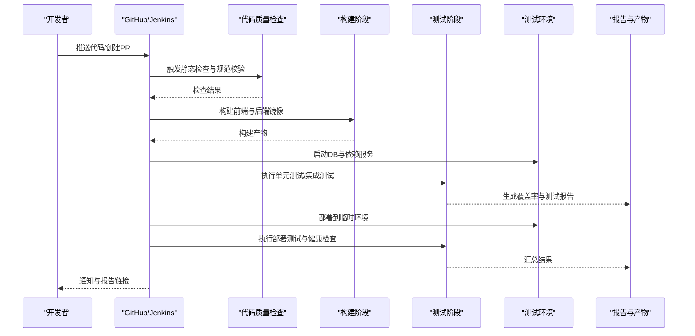
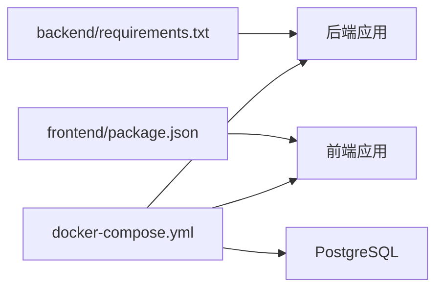

# 持续集成测试

<cite>
**本文引用的文件**   
- [docker-compose.yml](file://docker-compose.yml)
- [backend/requirements.txt](file://backend/requirements.txt)
- [backend/app.py](file://backend/app.py)
- [backend/tests/test_ask_flow_controller.py](file://backend/tests/test_ask_flow_controller.py)
- [scripts/integration_test.py](file://scripts/integration_test.py)
- [scripts/verify_deployment.py](file://scripts/verify_deployment.py)
- [frontend/package.json](file://frontend/package.json)
- [frontend/Dockerfile](file://frontend/Dockerfile)
- [backend/Dockerfile](file://backend/Dockerfile)
- [deploy.sh](file://deploy.sh)
- [check-release.sh](file://check-release.sh)
- [config/run_smartask_tests.py](file://config/run_smartask_tests.py)
</cite>

## 目录
1. [简介](#简介)
2. [项目结构](#项目结构)
3. [核心组件](#核心组件)
4. [架构总览](#架构总览)
5. [详细组件分析](#详细组件分析)
6. [依赖关系分析](#依赖关系分析)
7. [性能考虑](#性能考虑)
8. [故障排查指南](#故障排查指南)
9. [结论](#结论)
10. [附录](#附录)

## 简介
本文件为 SmartAsk 项目提供完整的持续集成（CI）测试流水线设计与实现指南，覆盖 GitHub Actions 与 Jenkins 两种方案。内容包含：代码提交触发、自动构建与测试执行、多阶段流水线（代码质量检查、单元测试、集成测试、部署测试）、测试结果收集与报告生成（覆盖率、测试报告、失败分析）、并行测试策略与环境自动化搭建销毁、发布前质量门禁与自动化部署、回滚与故障恢复机制。文档同时给出基于仓库现有脚本与配置的落地建议，确保可操作、可观测、可回滚。

## 项目结构
SmartAsk 采用前后端分离架构，后端 Python 应用与前端 Vue 应用分别独立构建与运行，通过 Docker Compose 编排数据库等依赖服务。关键目录与职责如下：
- backend：后端 Python 应用、控制器、迁移脚本、测试用例、Dockerfile、依赖清单
- frontend：前端 Vue 应用、构建配置、Dockerfile、包管理
- scripts：集成测试、部署验证等辅助脚本
- config：测试运行器与配置
- docker-compose.yml：本地与 CI 环境的服务编排

图表来源
- [docker-compose.yml](file://docker-compose.yml)
- [frontend/Dockerfile](file://frontend/Dockerfile)
- [backend/Dockerfile](file://backend/Dockerfile)

章节来源
- [docker-compose.yml](file://docker-compose.yml)
- [frontend/package.json](file://frontend/package.json)
- [backend/requirements.txt](file://backend/requirements.txt)

## 核心组件
- 后端应用入口与依赖
  - 后端主应用入口位于 backend/app.py，依赖由 backend/requirements.txt 管理
- 测试套件
  - 单元测试位于 backend/tests，示例包括 test_ask_flow_controller.py
  - 集成测试脚本 scripts/integration_test.py
  - 部署验证脚本 scripts/verify_deployment.py
  - 统一测试运行器 config/run_smartask_tests.py
- 前端构建与测试
  - 前端包管理与脚本定义在 frontend/package.json
  - 前端镜像构建在 frontend/Dockerfile
- 服务编排与部署
  - docker-compose.yml 编排数据库与应用
  - deploy.sh 提供一键部署能力
  - check-release.sh 用于发布前质量门禁

章节来源
- [backend/app.py](file://backend/app.py)
- [backend/requirements.txt](file://backend/requirements.txt)
- [backend/tests/test_ask_flow_controller.py](file://backend/tests/test_ask_flow_controller.py)
- [scripts/integration_test.py](file://scripts/integration_test.py)
- [scripts/verify_deployment.py](file://scripts/verify_deployment.py)
- [config/run_smartask_tests.py](file://config/run_smartask_tests.py)
- [frontend/package.json](file://frontend/package.json)
- [frontend/Dockerfile](file://frontend/Dockerfile)
- [docker-compose.yml](file://docker-compose.yml)
- [deploy.sh](file://deploy.sh)
- [check-release.sh](file://check-release.sh)

## 架构总览
下图展示从代码提交到部署测试的端到端流水线，涵盖质量门禁、构建、测试、报告与部署。

图表来源
- [docker-compose.yml](file://docker-compose.yml)
- [scripts/integration_test.py](file://scripts/integration_test.py)
- [scripts/verify_deployment.py](file://scripts/verify_deployment.py)
- [config/run_smartask_tests.py](file://config/run_smartask_tests.py)

## 详细组件分析

### 代码质量检查（Lint）
- 目标：在 PR 或 push 时快速发现风格与潜在问题，避免低质量代码进入主干
- 建议步骤
  - 安装后端依赖并执行 lint 工具（如 flake8、black、mypy），依据 backend/requirements.txt 版本锁定
  - 前端执行 ESLint/Prettier，依据 frontend/package.json 脚本
  - 失败即阻断后续阶段，输出标准化报告

章节来源
- [backend/requirements.txt](file://backend/requirements.txt)
- [frontend/package.json](file://frontend/package.json)

### 单元测试
- 目标：覆盖核心业务逻辑与控制器行为
- 建议步骤
  - 使用 config/run_smartask_tests.py 作为统一入口，按模块并行执行
  - 启用覆盖率统计（如 coverage），输出 XML 与 HTML 报告
  - 对关键路径设置最低覆盖率阈值，未达标则失败

章节来源
- [config/run_smartask_tests.py](file://config/run_smartask_tests.py)
- [backend/tests/test_ask_flow_controller.py](file://backend/tests/test_ask_flow_controller.py)

### 集成测试
- 目标：验证跨模块交互、外部依赖（数据库）与接口契约
- 建议步骤
  - 使用 scripts/integration_test.py 启动依赖服务（PostgreSQL），执行端到端用例
  - 使用 docker-compose 拉起测试数据库，隔离数据与网络
  - 失败用例需附带日志与快照，便于定位

章节来源
- [scripts/integration_test.py](file://scripts/integration_test.py)
- [docker-compose.yml](file://docker-compose.yml)

### 部署测试
- 目标：验证镜像构建、服务启动、健康检查与基础功能可用
- 建议步骤
  - 使用 scripts/verify_deployment.py 进行健康检查与冒烟测试
  - 结合 docker-compose 启动最小化环境，减少资源占用
  - 失败时保留容器日志与状态，支持快速复现

章节来源
- [scripts/verify_deployment.py](file://scripts/verify_deployment.py)
- [docker-compose.yml](file://docker-compose.yml)

### 前端构建与测试
- 目标：确保前端资源构建成功、静态资源正确打包、基础脚本可用
- 建议步骤
  - 使用 frontend/package.json 中的脚本进行构建与测试
  - 将构建产物缓存至 CI 缓存层，加速后续构建
  - 若存在 UI 测试，可在独立阶段执行，避免阻塞主流程

章节来源
- [frontend/package.json](file://frontend/package.json)
- [frontend/Dockerfile](file://frontend/Dockerfile)

### 后端构建与镜像
- 目标：生成可重复的后端镜像，保证生产一致性
- 建议步骤
  - 使用 backend/Dockerfile 构建镜像，固定依赖版本
  - 镜像扫描与安全加固（可选）
  - 推送至镜像仓库供部署阶段使用

章节来源
- [backend/Dockerfile](file://backend/Dockerfile)
- [backend/requirements.txt](file://backend/requirements.txt)

### 质量门禁与发布检查
- 目标：在发布前强制执行质量门槛，防止不合格版本流入生产
- 建议步骤
  - 使用 check-release.sh 执行预检（覆盖率、测试通过率、依赖漏洞扫描）
  - 门禁失败阻断发布流程，并输出详细诊断信息

章节来源
- [check-release.sh](file://check-release.sh)

### 自动化部署
- 目标：将经过测试的版本安全部署到目标环境
- 建议步骤
  - 使用 deploy.sh 完成环境准备、镜像拉取与服务重启
  - 部署后执行健康检查与冒烟测试，确保服务可用
  - 记录部署版本与变更摘要，便于审计与回滚

章节来源
- [deploy.sh](file://deploy.sh)

## 依赖关系分析
- 后端依赖
  - Python 依赖由 backend/requirements.txt 管理，建议在 CI 中缓存 pip 包以加速构建
- 前端依赖
  - Node.js 依赖由 frontend/package.json 管理，建议使用 pnpm/npm 缓存
- 运行时依赖
  - docker-compose.yml 编排 PostgreSQL 与应用服务，确保测试环境一致性与隔离

图表来源
- [backend/requirements.txt](file://backend/requirements.txt)
- [frontend/package.json](file://frontend/package.json)
- [docker-compose.yml](file://docker-compose.yml)

章节来源
- [backend/requirements.txt](file://backend/requirements.txt)
- [frontend/package.json](file://frontend/package.json)
- [docker-compose.yml](file://docker-compose.yml)

## 性能考虑
- 并行测试
  - 使用 pytest-xdist 或类似工具并行执行单元测试，按模块划分任务
  - 集成测试按场景分片，避免单用例过长影响整体耗时
- 缓存优化
  - 缓存 pip/pnpm 依赖与构建产物，减少重复下载与编译时间
- 资源隔离
  - 每个 CI 作业使用独立容器或命名空间，避免资源竞争
- 选择性执行
  - 基于变更范围仅执行相关测试，缩短反馈周期

[本节为通用指导，不直接分析具体文件]

## 故障排查指南
- 常见问题
  - 依赖安装失败：检查 requirements.txt 与 package.json 版本冲突
  - 数据库连接失败：确认 docker-compose 服务已启动且端口映射正确
  - 测试超时：增加超时阈值或拆分长用例
  - 覆盖率不达标：补充缺失用例或调整阈值
- 调试建议
  - 保留容器日志与测试输出，便于定位问题
  - 使用本地 docker-compose 复现 CI 环境
  - 逐步禁用阶段以缩小问题范围

章节来源
- [docker-compose.yml](file://docker-compose.yml)
- [scripts/integration_test.py](file://scripts/integration_test.py)
- [scripts/verify_deployment.py](file://scripts/verify_deployment.py)

## 结论
通过本指南，SmartAsk 项目可建立稳定、高效、可观测的持续集成测试流水线。借助 GitHub Actions 或 Jenkins，结合仓库现有脚本与配置，可实现从代码质量检查到自动化部署的全链路闭环。并行测试、缓存优化与环境隔离将显著提升效率；质量门禁与回滚机制保障发布质量与稳定性。

[本节为总结性内容，不直接分析具体文件]

## 附录

### GitHub Actions 流水线示例（概念性）
- 触发条件：push 与 pull_request
- 阶段：
  - 代码质量检查（Lint）
  - 构建前端与后端镜像
  - 启动测试环境（PostgreSQL）
  - 执行单元测试与集成测试
  - 生成覆盖率与测试报告
  - 部署到临时环境并执行健康检查
  - 归档报告与产物

[本节为概念性说明，不直接分析具体文件]

### Jenkins 流水线示例（概念性）
- 触发条件：SCM 变更与定时任务
- 阶段：
  - 代码质量检查（Lint）
  - 构建与镜像打包
  - 启动测试环境（PostgreSQL）
  - 执行单元测试与集成测试
  - 生成覆盖率与测试报告
  - 部署到临时环境并执行健康检查
  - 归档报告与产物

[本节为概念性说明，不直接分析具体文件]

### 测试结果收集与报告
- 覆盖率报告：coverage XML/HTML，便于与 CI 平台集成
- 测试报告：JUnit XML，便于可视化与趋势分析
- 失败分析：保留日志、快照与容器状态，支持快速复现

章节来源
- [config/run_smartask_tests.py](file://config/run_smartask_tests.py)
- [scripts/integration_test.py](file://scripts/integration_test.py)
- [scripts/verify_deployment.py](file://scripts/verify_deployment.py)

### 回滚策略与故障恢复
- 回滚策略
  - 基于镜像标签与配置文件版本进行快速回滚
  - 数据库迁移具备向下兼容或可逆脚本
- 故障恢复
  - 自动重试与降级策略
  - 健康检查失败自动切换至上一稳定版本

[本节为通用指导，不直接分析具体文件]