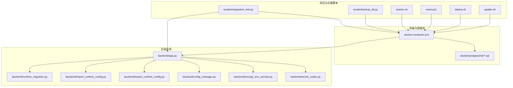
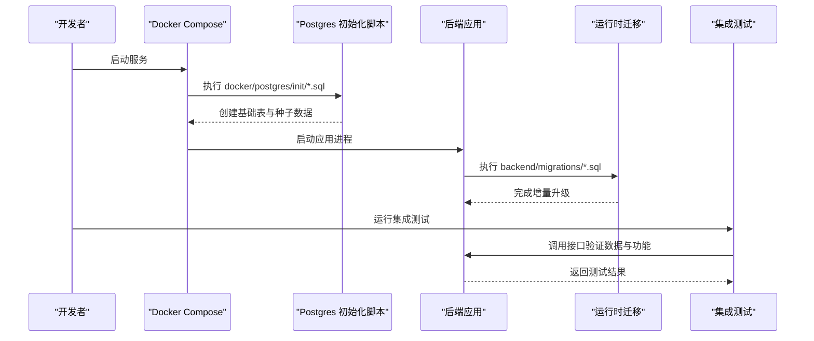
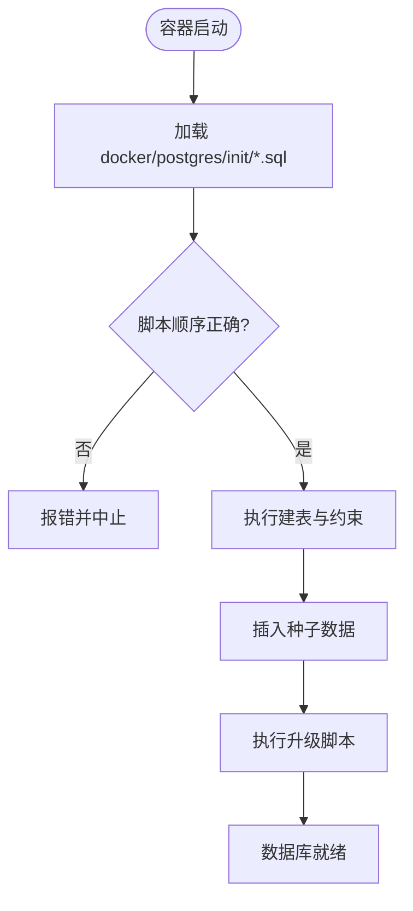
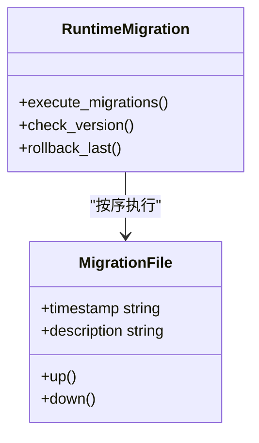
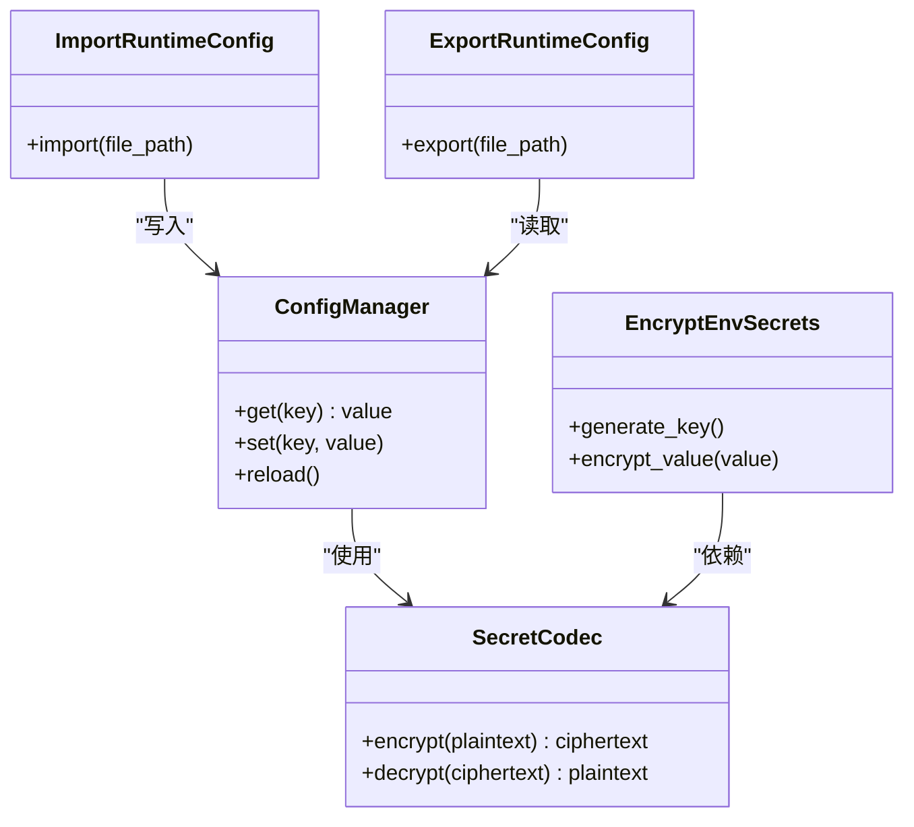
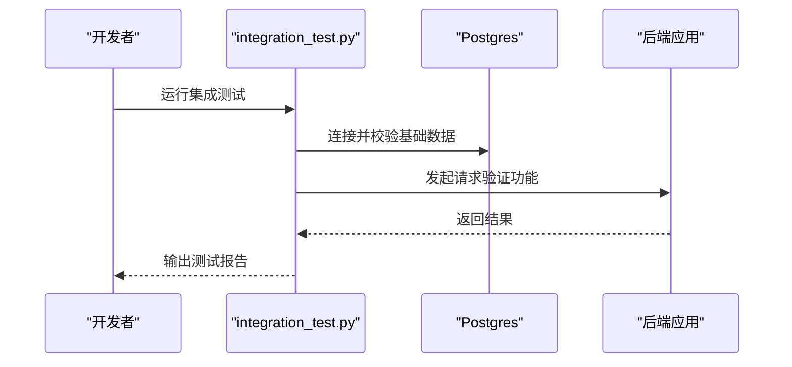
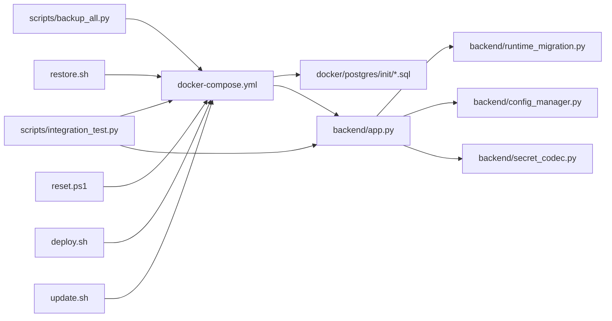

# 测试数据管理

<cite>
**本文引用的文件**   
- [docker-compose.yml](file://docker-compose.yml)
- [docker/postgres/init/001_bookshelf_schema.sql](file://docker/postgres/init/001_bookshelf_schema.sql)
- [docker/postgres/init/002_angel_group_data.sql](file://docker/postgres/init/002_angel_group_data.sql)
- [docker/postgres/init/003_bookshelf_agent1_prompt_upgrade.sql](file://docker/postgres/init/003_bookshelf_agent1_prompt_upgrade.sql)
- [docker/postgres/init/004_report_config.sql](file://docker/postgres/init/004_report_config.sql)
- [docker/postgres/init/005_report_thresholds.sql](file://docker/postgres/init/005_report_thresholds.sql)
- [docker/postgres/init/006_system_event_logs.sql](file://docker/postgres/init/006_system_event_logs.sql)
- [backend/migrations/20260330_bookshelf_schema.sql](file://backend/migrations/20260330_bookshelf_schema.sql)
- [backend/migrations/20260430_report_config.sql](file://backend/migrations/20260430_report_config.sql)
- [backend/migrations/20260509_report_thresholds.sql](file://backend/migrations/20260509_report_thresholds.sql)
- [backend/migrations/20260512_system_event_logs.sql](file://backend/migrations/20260512_system_event_logs.sql)
- [backend/migrations/20260627_ecommerce_standard_view.sql](file://backend/migrations/20260627_ecommerce_standard_view.sql)
- [backend/migrations/20260630_dataset_transforms.sql](file://backend/migrations/20260630_dataset_transforms.sql)
- [scripts/integration_test.py](file://scripts/integration_test.py)
- [scripts/backup_all.py](file://scripts/backup_all.py)
- [restore.sh](file://restore.sh)
- [reset.ps1](file://reset.ps1)
- [deploy.sh](file://deploy.sh)
- [update.sh](file://update.sh)
- [backend/app.py](file://backend/app.py)
- [backend/runtime_migration.py](file://backend/runtime_migration.py)
- [backend/import_runtime_config.py](file://backend/import_runtime_config.py)
- [backend/export_runtime_config.py](file://backend/export_runtime_config.py)
- [backend/config_manager.py](file://backend/config_manager.py)
- [backend/encrypt_env_secrets.py](file://backend/encrypt_env_secrets.py)
- [backend/secret_codec.py](file://backend/secret_codec.py)
- [config/run_smartask_tests.py](file://config/run_smartask_tests.py)
</cite>

## 目录
1. [简介](#简介)
2. [项目结构](#项目结构)
3. [核心组件](#核心组件)
4. [架构总览](#架构总览)
5. [详细组件分析](#详细组件分析)
6. [依赖关系分析](#依赖关系分析)
7. [性能考虑](#性能考虑)
8. [故障排查指南](#故障排查指南)
9. [结论](#结论)
10. [附录](#附录)

## 简介
本文件为 SmartAsk 项目制定“测试数据管理策略”，覆盖测试数据库设计、版本与迁移、数据准备（SQL 脚本、Python 生成、外部导入）、清理与重置机制、多环境差异处理、敏感数据脱敏与安全策略，以及大数据集测试优化与性能考量。目标是确保测试的独立性、可重复性与可维护性，同时兼顾开发与生产环境的差异与安全性。

## 项目结构
SmartAsk 的测试数据管理与部署相关的关键位置如下：
- Docker 初始化 SQL：用于容器启动时一次性构建基础库表与初始数据
- 后端迁移脚本：按时间戳命名，用于应用运行期增量变更
- 集成测试与工具脚本：负责执行测试、备份/恢复、配置导入导出等
- 运行时配置与密钥管理：提供配置注入与敏感信息加密能力

图表来源
- [docker-compose.yml](file://docker-compose.yml)
- [docker/postgres/init/001_bookshelf_schema.sql](file://docker/postgres/init/001_bookshelf_schema.sql)
- [backend/app.py](file://backend/app.py)
- [backend/runtime_migration.py](file://backend/runtime_migration.py)
- [backend/import_runtime_config.py](file://backend/import_runtime_config.py)
- [backend/export_runtime_config.py](file://backend/export_runtime_config.py)
- [backend/config_manager.py](file://backend/config_manager.py)
- [backend/encrypt_env_secrets.py](file://backend/encrypt_env_secrets.py)
- [backend/secret_codec.py](file://backend/secret_codec.py)
- [scripts/integration_test.py](file://scripts/integration_test.py)
- [scripts/backup_all.py](file://scripts/backup_all.py)
- [restore.sh](file://restore.sh)
- [reset.ps1](file://reset.ps1)
- [deploy.sh](file://deploy.sh)
- [update.sh](file://update.sh)

章节来源
- [docker-compose.yml](file://docker-compose.yml)
- [docker/postgres/init/001_bookshelf_schema.sql](file://docker/postgres/init/001_bookshelf_schema.sql)
- [docker/postgres/init/002_angel_group_data.sql](file://docker/postgres/init/002_angel_group_data.sql)
- [docker/postgres/init/003_bookshelf_agent1_prompt_upgrade.sql](file://docker/postgres/init/003_bookshelf_agent1_prompt_upgrade.sql)
- [docker/postgres/init/004_report_config.sql](file://docker/postgres/init/004_report_config.sql)
- [docker/postgres/init/005_report_thresholds.sql](file://docker/postgres/init/005_report_thresholds.sql)
- [docker/postgres/init/006_system_event_logs.sql](file://docker/postgres/init/006_system_event_logs.sql)
- [backend/migrations/20260330_bookshelf_schema.sql](file://backend/migrations/20260330_bookshelf_schema.sql)
- [backend/migrations/20260430_report_config.sql](file://backend/migrations/20260430_report_config.sql)
- [backend/migrations/20260509_report_thresholds.sql](file://backend/migrations/20260509_report_thresholds.sql)
- [backend/migrations/20260512_system_event_logs.sql](file://backend/migrations/20260512_system_event_logs.sql)
- [backend/migrations/20260627_ecommerce_standard_view.sql](file://backend/migrations/20260627_ecommerce_standard_view.sql)
- [backend/migrations/20260630_dataset_transforms.sql](file://backend/migrations/20260630_dataset_transforms.sql)
- [scripts/integration_test.py](file://scripts/integration_test.py)
- [scripts/backup_all.py](file://scripts/backup_all.py)
- [restore.sh](file://restore.sh)
- [reset.ps1](file://reset.ps1)
- [deploy.sh](file://deploy.sh)
- [update.sh](file://update.sh)

## 核心组件
- 数据库初始化脚本（容器级）：在容器启动阶段执行，建立基础 schema 与种子数据，保证环境一致性
- 运行时迁移脚本（应用级）：按时间戳顺序执行，支持增量升级与回滚策略
- 配置与密钥管理：通过环境变量与加密工具管理敏感信息，避免明文泄露
- 测试与运维脚本：集成测试、备份/恢复、一键部署与更新，保障测试流程自动化

章节来源
- [docker/postgres/init/001_bookshelf_schema.sql](file://docker/postgres/init/001_bookshelf_schema.sql)
- [docker/postgres/init/002_angel_group_data.sql](file://docker/postgres/init/002_angel_group_data.sql)
- [docker/postgres/init/003_bookshelf_agent1_prompt_upgrade.sql](file://docker/postgres/init/003_bookshelf_agent1_prompt_upgrade.sql)
- [docker/postgres/init/004_report_config.sql](file://docker/postgres/init/004_report_config.sql)
- [docker/postgres/init/005_report_thresholds.sql](file://docker/postgres/init/005_report_thresholds.sql)
- [docker/postgres/init/006_system_event_logs.sql](file://docker/postgres/init/006_system_event_logs.sql)
- [backend/migrations/20260330_bookshelf_schema.sql](file://backend/migrations/20260330_bookshelf_schema.sql)
- [backend/migrations/20260430_report_config.sql](file://backend/migrations/20260430_report_config.sql)
- [backend/migrations/20260509_report_thresholds.sql](file://backend/migrations/20260509_report_thresholds.sql)
- [backend/migrations/20260512_system_event_logs.sql](file://backend/migrations/20260512_system_event_logs.sql)
- [backend/migrations/20260627_ecommerce_standard_view.sql](file://backend/migrations/20260627_ecommerce_standard_view.sql)
- [backend/migrations/20260630_dataset_transforms.sql](file://backend/migrations/20260630_dataset_transforms.sql)
- [backend/config_manager.py](file://backend/config_manager.py)
- [backend/encrypt_env_secrets.py](file://backend/encrypt_env_secrets.py)
- [backend/secret_codec.py](file://backend/secret_codec.py)

## 架构总览
SmartAsk 的测试数据管理由“容器初始化 + 应用迁移 + 配置与密钥 + 测试与运维脚本”四层构成，形成从环境搭建到数据就绪的完整链路。

图表来源
- [docker-compose.yml](file://docker-compose.yml)
- [docker/postgres/init/001_bookshelf_schema.sql](file://docker/postgres/init/001_bookshelf_schema.sql)
- [backend/runtime_migration.py](file://backend/runtime_migration.py)
- [scripts/integration_test.py](file://scripts/integration_test.py)

## 详细组件分析

### 数据库初始化脚本（容器级）
- 作用：在容器首次启动时创建必要表结构与基础数据，确保所有环境一致
- 组织方式：按数字前缀排序，先建表后填充数据，再执行升级脚本
- 关键脚本：
  - 书架与基础结构：[001_bookshelf_schema.sql](file://docker/postgres/init/001_bookshelf_schema.sql)
  - 安吉尔组数据种子：[002_angel_group_data.sql](file://docker/postgres/init/002_angel_group_data.sql)
  - 提示词升级：[003_bookshelf_agent1_prompt_upgrade.sql](file://docker/postgres/init/003_bookshelf_agent1_prompt_upgrade.sql)
  - 报告配置与阈值：[004_report_config.sql](file://docker/postgres/init/004_report_config.sql)、[005_report_thresholds.sql](file://docker/postgres/init/005_report_thresholds.sql)
  - 系统事件日志：[006_system_event_logs.sql](file://docker/postgres/init/006_system_event_logs.sql)

图表来源
- [docker/postgres/init/001_bookshelf_schema.sql](file://docker/postgres/init/001_bookshelf_schema.sql)
- [docker/postgres/init/002_angel_group_data.sql](file://docker/postgres/init/002_angel_group_data.sql)
- [docker/postgres/init/003_bookshelf_agent1_prompt_upgrade.sql](file://docker/postgres/init/003_bookshelf_agent1_prompt_upgrade.sql)
- [docker/postgres/init/004_report_config.sql](file://docker/postgres/init/004_report_config.sql)
- [docker/postgres/init/005_report_thresholds.sql](file://docker/postgres/init/005_report_thresholds.sql)
- [docker/postgres/init/006_system_event_logs.sql](file://docker/postgres/init/006_system_event_logs.sql)

章节来源
- [docker/postgres/init/001_bookshelf_schema.sql](file://docker/postgres/init/001_bookshelf_schema.sql)
- [docker/postgres/init/002_angel_group_data.sql](file://docker/postgres/init/002_angel_group_data.sql)
- [docker/postgres/init/003_bookshelf_agent1_prompt_upgrade.sql](file://docker/postgres/init/003_bookshelf_agent1_prompt_upgrade.sql)
- [docker/postgres/init/004_report_config.sql](file://docker/postgres/init/004_report_config.sql)
- [docker/postgres/init/005_report_thresholds.sql](file://docker/postgres/init/005_report_thresholds.sql)
- [docker/postgres/init/006_system_event_logs.sql](file://docker/postgres/init/006_system_event_logs.sql)

### 运行时迁移脚本（应用级）
- 作用：应用启动或部署时执行增量变更，保证数据库结构与业务逻辑同步
- 组织方式：以时间戳命名，按顺序执行；建议幂等与可回滚
- 关键脚本：
  - 书架结构：[20260330_bookshelf_schema.sql](file://backend/migrations/20260330_bookshelf_schema.sql)
  - 报告配置：[20260430_report_config.sql](file://backend/migrations/20260430_report_config.sql)
  - 报告阈值：[20260509_report_thresholds.sql](file://backend/migrations/20260509_report_thresholds.sql)
  - 系统事件日志：[20260512_system_event_logs.sql](file://backend/migrations/20260512_system_event_logs.sql)
  - 电商标准视图：[20260627_ecommerce_standard_view.sql](file://backend/migrations/20260627_ecommerce_standard_view.sql)
  - 数据集转换：[20260630_dataset_transforms.sql](file://backend/migrations/20260630_dataset_transforms.sql)

图表来源
- [backend/runtime_migration.py](file://backend/runtime_migration.py)
- [backend/migrations/20260330_bookshelf_schema.sql](file://backend/migrations/20260330_bookshelf_schema.sql)
- [backend/migrations/20260430_report_config.sql](file://backend/migrations/20260430_report_config.sql)
- [backend/migrations/20260509_report_thresholds.sql](file://backend/migrations/20260509_report_thresholds.sql)
- [backend/migrations/20260512_system_event_logs.sql](file://backend/migrations/20260512_system_event_logs.sql)
- [backend/migrations/20260627_ecommerce_standard_view.sql](file://backend/migrations/20260627_ecommerce_standard_view.sql)
- [backend/migrations/20260630_dataset_transforms.sql](file://backend/migrations/20260630_dataset_transforms.sql)

章节来源
- [backend/runtime_migration.py](file://backend/runtime_migration.py)
- [backend/migrations/20260330_bookshelf_schema.sql](file://backend/migrations/20260330_bookshelf_schema.sql)
- [backend/migrations/20260430_report_config.sql](file://backend/migrations/20260430_report_config.sql)
- [backend/migrations/20260509_report_thresholds.sql](file://backend/migrations/20260509_report_thresholds.sql)
- [backend/migrations/20260512_system_event_logs.sql](file://backend/migrations/20260512_system_event_logs.sql)
- [backend/migrations/20260627_ecommerce_standard_view.sql](file://backend/migrations/20260627_ecommerce_standard_view.sql)
- [backend/migrations/20260630_dataset_transforms.sql](file://backend/migrations/20260630_dataset_transforms.sql)

### 配置与密钥管理
- 配置管理：集中读取与缓存配置，支持热更新与环境变量注入
- 密钥加密：对敏感信息进行加密存储与解码，避免明文泄露
- 配置导入导出：便于在不同环境间迁移配置

图表来源
- [backend/config_manager.py](file://backend/config_manager.py)
- [backend/secret_codec.py](file://backend/secret_codec.py)
- [backend/encrypt_env_secrets.py](file://backend/encrypt_env_secrets.py)
- [backend/import_runtime_config.py](file://backend/import_runtime_config.py)
- [backend/export_runtime_config.py](file://backend/export_runtime_config.py)

章节来源
- [backend/config_manager.py](file://backend/config_manager.py)
- [backend/secret_codec.py](file://backend/secret_codec.py)
- [backend/encrypt_env_secrets.py](file://backend/encrypt_env_secrets.py)
- [backend/import_runtime_config.py](file://backend/import_runtime_config.py)
- [backend/export_runtime_config.py](file://backend/export_runtime_config.py)

### 测试与运维脚本
- 集成测试：统一入口执行测试套件，连接数据库与应用接口进行验证
- 备份与恢复：全量备份数据库，支持快速恢复到指定快照
- 一键部署与更新：封装常用操作，减少人为错误

图表来源
- [scripts/integration_test.py](file://scripts/integration_test.py)
- [docker-compose.yml](file://docker-compose.yml)

章节来源
- [scripts/integration_test.py](file://scripts/integration_test.py)
- [scripts/backup_all.py](file://scripts/backup_all.py)
- [restore.sh](file://restore.sh)
- [reset.ps1](file://reset.ps1)
- [deploy.sh](file://deploy.sh)
- [update.sh](file://update.sh)

## 依赖关系分析
- 容器编排依赖初始化脚本与后端镜像
- 后端依赖运行时迁移与配置管理
- 测试脚本依赖容器化环境与数据库连通性
- 备份/恢复脚本依赖数据库客户端与权限

图表来源
- [docker-compose.yml](file://docker-compose.yml)
- [docker/postgres/init/001_bookshelf_schema.sql](file://docker/postgres/init/001_bookshelf_schema.sql)
- [backend/app.py](file://backend/app.py)
- [backend/runtime_migration.py](file://backend/runtime_migration.py)
- [backend/config_manager.py](file://backend/config_manager.py)
- [backend/secret_codec.py](file://backend/secret_codec.py)
- [scripts/integration_test.py](file://scripts/integration_test.py)
- [scripts/backup_all.py](file://scripts/backup_all.py)
- [restore.sh](file://restore.sh)
- [reset.ps1](file://reset.ps1)
- [deploy.sh](file://deploy.sh)
- [update.sh](file://update.sh)

章节来源
- [docker-compose.yml](file://docker-compose.yml)
- [backend/app.py](file://backend/app.py)
- [backend/runtime_migration.py](file://backend/runtime_migration.py)
- [backend/config_manager.py](file://backend/config_manager.py)
- [backend/secret_codec.py](file://backend/secret_codec.py)
- [scripts/integration_test.py](file://scripts/integration_test.py)
- [scripts/backup_all.py](file://scripts/backup_all.py)
- [restore.sh](file://restore.sh)
- [reset.ps1](file://reset.ps1)
- [deploy.sh](file://deploy.sh)
- [update.sh](file://update.sh)

## 性能考虑
- 容器初始化阶段批量执行 SQL，避免多次连接开销
- 运行时迁移采用事务与幂等设计，降低失败重试成本
- 测试数据尽量精简且具备代表性，减少 I/O 与网络延迟
- 大数据集测试建议使用只读副本或内存数据库加速
- 索引与视图预构建（如电商标准视图）提升查询性能

## 故障排查指南
- 容器启动失败：检查初始化脚本顺序与语法，确认端口与卷挂载
- 迁移失败：查看迁移日志，确认版本号与幂等性，必要时回滚
- 配置错误：核对环境变量与加密密钥，确保导入导出路径正确
- 测试不通：验证数据库连通性、应用健康检查与接口响应

章节来源
- [docker/postgres/init/001_bookshelf_schema.sql](file://docker/postgres/init/001_bookshelf_schema.sql)
- [backend/runtime_migration.py](file://backend/runtime_migration.py)
- [backend/config_manager.py](file://backend/config_manager.py)
- [backend/encrypt_env_secrets.py](file://backend/encrypt_env_secrets.py)
- [scripts/integration_test.py](file://scripts/integration_test.py)

## 结论
通过“容器初始化 + 应用迁移 + 配置与密钥 + 测试与运维脚本”的分层策略，SmartAsk 实现了稳定、可重复、安全的测试数据管理。建议在后续迭代中持续完善幂等迁移、数据快照与性能基准，以提升整体质量与效率。

## 附录
- 测试数据准备方法
  - SQL 脚本：按数字前缀组织，先结构后数据，再升级
  - Python 数据生成：结合配置与模板生成批量数据，保持字段一致性
  - 外部数据导入：通过导入脚本将 CSV/JSON 转换为内部格式并入库
- 清理与重置机制
  - 使用备份脚本保存快照，恢复脚本快速回滚
  - 重置脚本清空测试状态，确保每次测试独立
- 多环境差异处理
  - 开发环境：启用调试日志与宽松校验
  - 测试环境：严格校验与隔离数据
  - 生产环境：最小权限与审计日志
- 敏感数据脱敏与安全策略
  - 使用加密工具对密钥与敏感字段进行处理
  - 禁止在生产测试中使用真实用户数据
- 大数据集测试优化
  - 使用分片与分页加载
  - 预热索引与缓存热点数据
  - 监控慢查询与资源占用