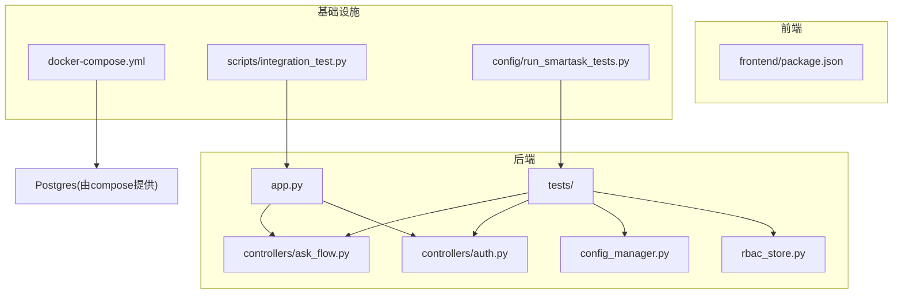
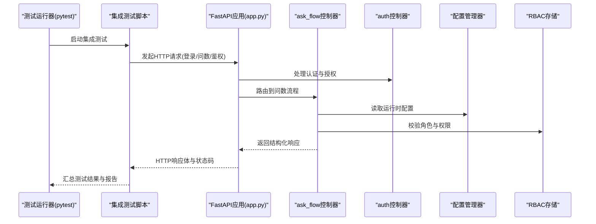
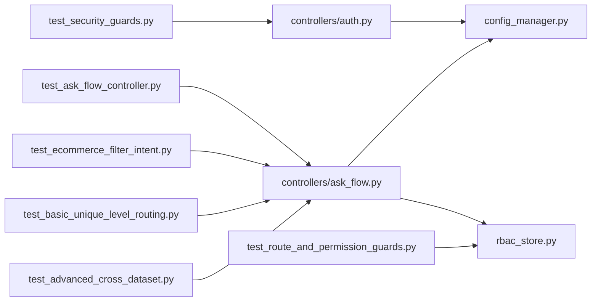

# 测试策略与实践

<cite>
**本文档引用的文件**   
- [backend/tests/test_ask_flow_controller.py](file://backend/tests/test_ask_flow_controller.py)
- [backend/tests/test_security_guards.py](file://backend/tests/test_security_guards.py)
- [backend/tests/test_route_and_permission_guards.py](file://backend/tests/test_route_and_permission_guards.py)
- [backend/tests/test_ecommerce_filter_intent.py](file://backend/tests/test_ecommerce_filter_intent.py)
- [backend/tests/test_basic_unique_level_routing.py](file://backend/tests/test_basic_unique_level_routing.py)
- [backend/tests/test_advanced_cross_dataset.py](file://backend/tests/test_advanced_cross_dataset.py)
- [backend/app.py](file://backend/app.py)
- [backend/controllers/ask_flow.py](file://backend/controllers/ask_flow.py)
- [backend/controllers/auth.py](file://backend/controllers/auth.py)
- [backend/config_manager.py](file://backend/config_manager.py)
- [backend/rbac_store.py](file://backend/rbac_store.py)
- [docker-compose.yml](file://docker-compose.yml)
- [scripts/integration_test.py](file://scripts/integration_test.py)
- [config/run_smartask_tests.py](file://config/run_smartask_tests.py)
- [frontend/package.json](file://frontend/package.json)
</cite>

## 目录
1. [简介](#简介)
2. [项目结构](#项目结构)
3. [核心组件](#核心组件)
4. [架构总览](#架构总览)
5. [详细组件分析](#详细组件分析)
6. [依赖关系分析](#依赖关系分析)
7. [性能考虑](#性能考虑)
8. [故障排查指南](#故障排查指南)
9. [结论](#结论)
10. [附录](#附录)

## 简介
本指南面向 SmartAsk 项目的测试体系建设，覆盖单元测试、集成测试与端到端测试的策略与实践。重点包括：
- 使用 pytest 编写高质量单元测试的最佳实践（用例设计、Mock 技巧、断言规范）
- 集成测试的 API 接口测试、数据库操作测试、第三方服务模拟
- 端到端测试的用户界面交互、业务流程验证与跨浏览器兼容性
- 测试数据管理（测试库搭建、数据准备与清理）
- 覆盖率要求与报告生成
- 持续集成中的自动化测试流水线配置（GitHub Actions、Jenkins）
- 性能测试与负载测试的实施方法

## 项目结构
SmartAsk 后端采用 Python + FastAPI 风格的分层架构，前端为 Vue 应用。测试相关代码主要位于 backend/tests 目录，集成测试脚本位于 scripts 和 config 目录，容器编排通过 docker-compose 提供数据库等依赖环境。

图表来源
- [backend/app.py](file://backend/app.py)
- [backend/controllers/ask_flow.py](file://backend/controllers/ask_flow.py)
- [backend/controllers/auth.py](file://backend/controllers/auth.py)
- [backend/config_manager.py](file://backend/config_manager.py)
- [backend/rbac_store.py](file://backend/rbac_store.py)
- [docker-compose.yml](file://docker-compose.yml)
- [scripts/integration_test.py](file://scripts/integration_test.py)
- [config/run_smartask_tests.py](file://config/run_smartask_tests.py)

章节来源
- [backend/app.py](file://backend/app.py)
- [backend/controllers/ask_flow.py](file://backend/controllers/ask_flow.py)
- [backend/controllers/auth.py](file://backend/controllers/auth.py)
- [backend/config_manager.py](file://backend/config_manager.py)
- [backend/rbac_store.py](file://backend/rbac_store.py)
- [docker-compose.yml](file://docker-compose.yml)
- [scripts/integration_test.py](file://scripts/integration_test.py)
- [config/run_smartask_tests.py](file://config/run_smartask_tests.py)

## 核心组件
- 测试框架与运行器
  - 使用 pytest 作为统一测试框架，结合 fixtures、参数化、插件生态进行用例组织与执行。
  - 通过配置文件或命令行参数控制测试范围、并发度与输出格式。
- 控制器与服务
  - ask_flow 控制器负责问数流程编排；auth 控制器处理认证授权；config_manager 管理配置；rbac_store 管理权限模型。
- 集成测试入口
  - integration_test.py 用于端到端/集成场景的编排与结果汇总。
  - run_smartask_tests.py 用于在特定环境下批量运行测试集。

章节来源
- [backend/tests/test_ask_flow_controller.py](file://backend/tests/test_ask_flow_controller.py)
- [backend/tests/test_security_guards.py](file://backend/tests/test_security_guards.py)
- [backend/tests/test_route_and_permission_guards.py](file://backend/tests/test_route_and_permission_guards.py)
- [backend/tests/test_ecommerce_filter_intent.py](file://backend/tests/test_ecommerce_filter_intent.py)
- [backend/tests/test_basic_unique_level_routing.py](file://backend/tests/test_basic_unique_level_routing.py)
- [backend/tests/test_advanced_cross_dataset.py](file://backend/tests/test_advanced_cross_dataset.py)
- [backend/controllers/ask_flow.py](file://backend/controllers/ask_flow.py)
- [backend/controllers/auth.py](file://backend/controllers/auth.py)
- [backend/config_manager.py](file://backend/config_manager.py)
- [backend/rbac_store.py](file://backend/rbac_store.py)
- [scripts/integration_test.py](file://scripts/integration_test.py)
- [config/run_smartask_tests.py](file://config/run_smartask_tests.py)

## 架构总览
下图展示从测试入口到业务控制器的调用链路与依赖关系，便于理解测试如何覆盖关键路径。

图表来源
- [backend/app.py](file://backend/app.py)
- [backend/controllers/ask_flow.py](file://backend/controllers/ask_flow.py)
- [backend/controllers/auth.py](file://backend/controllers/auth.py)
- [backend/config_manager.py](file://backend/config_manager.py)
- [backend/rbac_store.py](file://backend/rbac_store.py)
- [scripts/integration_test.py](file://scripts/integration_test.py)

## 详细组件分析

### 单元测试策略与最佳实践
- 用例设计原则
  - 以功能点为中心，每个用例聚焦单一职责，遵循 Given-When-Then 结构。
  - 对边界条件、异常分支、权限拒绝、非法输入等进行覆盖。
- Mock 对象的使用
  - 对外部依赖（数据库、缓存、第三方API）使用 unittest.mock 或 pytest-mock 进行隔离。
  - 针对配置与权限模块，使用 fixture 注入可控的替代实现。
- 断言技巧
  - 优先断言行为结果与副作用（如调用次数、参数），避免过度耦合内部实现细节。
  - 对 JSON 响应使用结构化断言（字段存在性、类型、取值范围）。
- 推荐工具
  - pytest、pytest-cov（覆盖率）、pytest-xdist（并行）、httpx/requests（HTTP 客户端）、factory-boy（数据工厂，可选）

章节来源
- [backend/tests/test_ask_flow_controller.py](file://backend/tests/test_ask_flow_controller.py)
- [backend/tests/test_security_guards.py](file://backend/tests/test_security_guards.py)
- [backend/tests/test_route_and_permission_guards.py](file://backend/tests/test_route_and_permission_guards.py)
- [backend/tests/test_ecommerce_filter_intent.py](file://backend/tests/test_ecommerce_filter_intent.py)
- [backend/tests/test_basic_unique_level_routing.py](file://backend/tests/test_basic_unique_level_routing.py)
- [backend/tests/test_advanced_cross_dataset.py](file://backend/tests/test_advanced_cross_dataset.py)

### 集成测试策略
- API 接口测试
  - 通过 httpx/requests 构造请求，覆盖登录、鉴权、问数查询、权限校验等主流程。
  - 使用测试数据库实例，确保数据一致性；必要时使用事务回滚或快照恢复。
- 数据库操作测试
  - 使用独立的测试库，初始化 schema 后执行 DDL/DML，验证读写、事务、约束与索引效果。
  - 对复杂查询使用最小数据集，保证可重复性与稳定性。
- 第三方服务模拟
  - 使用本地 mock 服务或内存替换，模拟 LLM、消息队列、外部 API 的行为与错误场景。
  - 记录并断言回调、重试、超时与降级逻辑。

章节来源
- [scripts/integration_test.py](file://scripts/integration_test.py)
- [docker-compose.yml](file://docker-compose.yml)

### 端到端测试方案
- 用户界面交互测试
  - 基于 Playwright 或 Cypress，模拟用户登录、对话输入、结果查看与导出等操作。
  - 断言页面元素、网络请求与状态变化的一致性。
- 业务流程验证
  - 覆盖从“提问—意图识别—路由—权限校验—数据查询—结果渲染”的全链路。
- 跨浏览器兼容性
  - 在 CI 中并行执行多浏览器用例，收集截图与视频以便定位问题。

章节来源
- [frontend/package.json](file://frontend/package.json)

### 测试数据管理
- 测试数据库搭建
  - 使用 docker-compose 启动 Postgres，预置 schema 与基础数据。
  - 通过迁移脚本或初始化 SQL 保证环境一致。
- 数据准备与清理
  - 使用夹具或工厂函数生成稳定、可复用的测试数据。
  - 每个用例结束后自动清理或回滚，避免数据污染。
- 数据版本与种子
  - 将种子数据纳入版本控制，按环境区分（开发/测试/预发/生产）。

章节来源
- [docker-compose.yml](file://docker-compose.yml)

### 覆盖率要求与报告生成
- 覆盖率目标
  - 建议行覆盖率不低于 80%，分支覆盖率不低于 70%；核心模块（认证、权限、问数路由）应更高。
- 报告生成
  - 使用 pytest-cov 生成 HTML/XML 报告，上传至 CI 归档或质量门禁。
  - 结合 SonarQube 等平台进行趋势分析与质量阈值检查。

章节来源
- [config/run_smartask_tests.py](file://config/run_smartask_tests.py)

### 持续集成中的测试自动化
- GitHub Actions
  - 定义工作流触发条件（push、PR），安装依赖、启动依赖服务（Postgres）、执行单元测试与集成测试、生成覆盖率报告。
- Jenkins
  - 构建 Pipeline，分阶段执行 lint、unit、integration、e2e，失败即阻断合并。
- 并行与缓存
  - 利用 pytest-xdist 并行执行单元用例；缓存依赖与镜像加速流水线。

章节来源
- [scripts/integration_test.py](file://scripts/integration_test.py)
- [config/run_smartask_tests.py](file://config/run_smartask_tests.py)

### 性能测试与负载测试
- 工具选择
  - 使用 Locust 或 k6 模拟并发用户访问关键接口（登录、问数查询、报表生成）。
- 指标采集
  - 监控 P95/P99 延迟、吞吐、错误率、资源利用率（CPU/内存/IO）。
- 基线与回归
  - 建立性能基线，CI 中执行轻量负载用例，超阈即告警。

章节来源
- [scripts/integration_test.py](file://scripts/integration_test.py)

## 依赖关系分析
下图展示测试与后端模块之间的依赖关系，帮助识别潜在耦合与改进点。

图表来源
- [backend/tests/test_ask_flow_controller.py](file://backend/tests/test_ask_flow_controller.py)
- [backend/tests/test_security_guards.py](file://backend/tests/test_security_guards.py)
- [backend/tests/test_route_and_permission_guards.py](file://backend/tests/test_route_and_permission_guards.py)
- [backend/tests/test_ecommerce_filter_intent.py](file://backend/tests/test_ecommerce_filter_intent.py)
- [backend/tests/test_basic_unique_level_routing.py](file://backend/tests/test_basic_unique_level_routing.py)
- [backend/tests/test_advanced_cross_dataset.py](file://backend/tests/test_advanced_cross_dataset.py)
- [backend/controllers/ask_flow.py](file://backend/controllers/ask_flow.py)
- [backend/controllers/auth.py](file://backend/controllers/auth.py)
- [backend/config_manager.py](file://backend/config_manager.py)
- [backend/rbac_store.py](file://backend/rbac_store.py)

章节来源
- [backend/controllers/ask_flow.py](file://backend/controllers/ask_flow.py)
- [backend/controllers/auth.py](file://backend/controllers/auth.py)
- [backend/config_manager.py](file://backend/config_manager.py)
- [backend/rbac_store.py](file://backend/rbac_store.py)

## 性能考虑
- 测试执行优化
  - 使用 pytest-xdist 并行执行；合理划分用例粒度，避免长耗时 IO。
  - 对慢依赖使用内存替代或本地缓存。
- 数据与连接池
  - 复用数据库连接，减少握手开销；批量插入/更新时启用事务。
- 监控与诊断
  - 在关键路径埋点计时，输出性能日志；结合 APM 工具定位瓶颈。

[本节为通用指导，不直接分析具体文件]

## 故障排查指南
- 常见问题
  - 测试环境不一致：确认 docker-compose 服务状态与端口映射。
  - 权限与认证失败：检查 RBAC 数据与 token 生成逻辑。
  - 第三方服务不可用：切换至 mock 服务并验证回调。
- 调试技巧
  - 使用 pytest -s 打印日志；增加 --capture=no 保留 stdout。
  - 对异步请求使用 httpx.AsyncClient 并设置超时。
  - 对数据库问题启用慢查询日志与 EXPLAIN 分析。

章节来源
- [docker-compose.yml](file://docker-compose.yml)
- [backend/rbac_store.py](file://backend/rbac_store.py)
- [backend/controllers/auth.py](file://backend/controllers/auth.py)

## 结论
通过分层测试体系（单元、集成、端到端）与完善的测试数据管理、覆盖率与 CI 流水线，SmartAsk 可在快速迭代中保持质量与稳定性。建议持续完善用例覆盖、引入性能基线并在 CI 中强化质量门禁，从而降低回归风险、提升交付效率。

[本节为总结性内容，不直接分析具体文件]

## 附录
- 快速开始
  - 启动依赖服务：使用 docker-compose 拉起 Postgres 等。
  - 运行单元测试：执行 pytest 指定目录与标记。
  - 运行集成测试：执行 scripts/integration_test.py 或 config/run_smartask_tests.py。
- 常用命令
  - 覆盖率：pytest --cov=backend --cov-report=html
  - 并行：pytest -n auto
  - 筛选：pytest -k "auth or rbac"

[本节为补充信息，不直接分析具体文件]