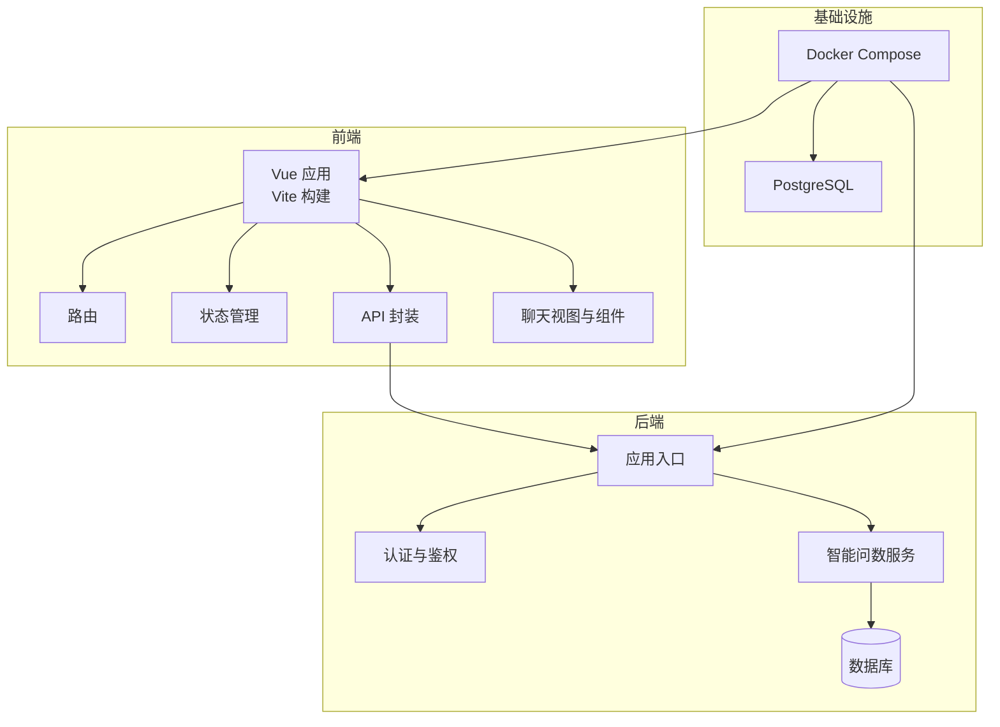
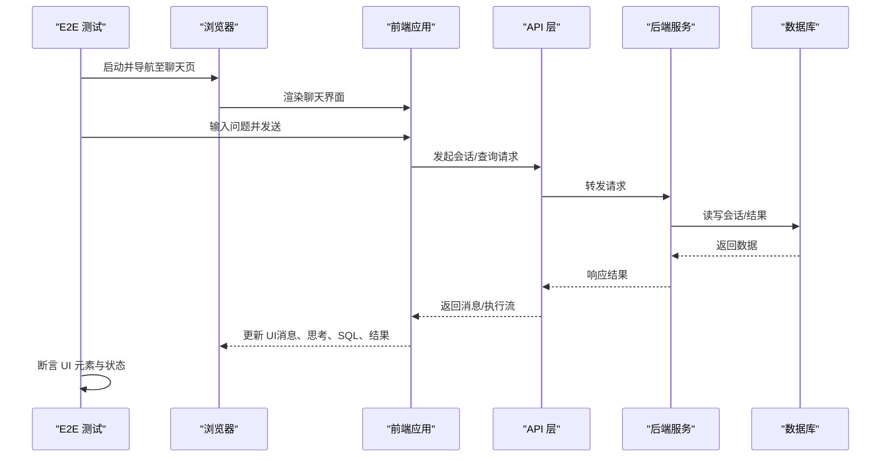
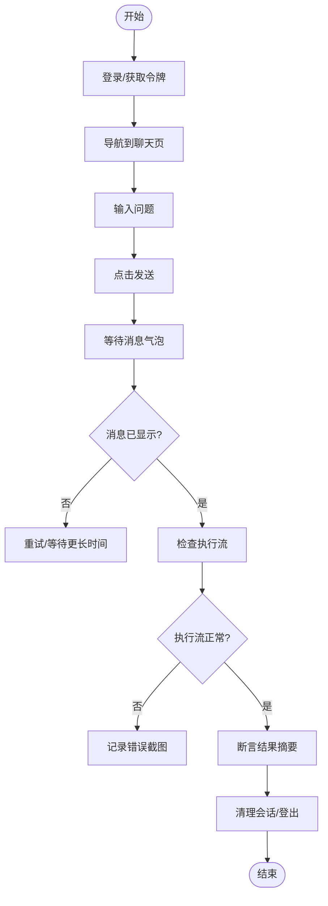
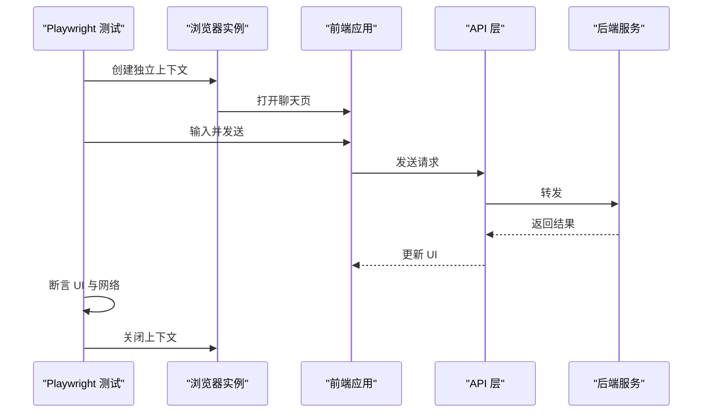
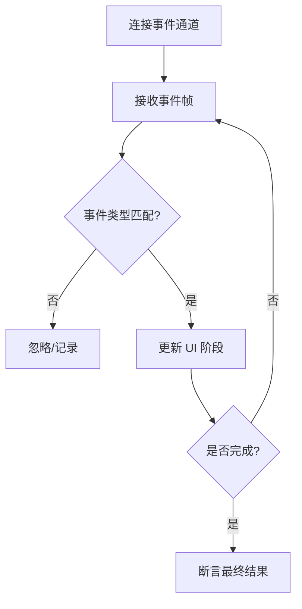
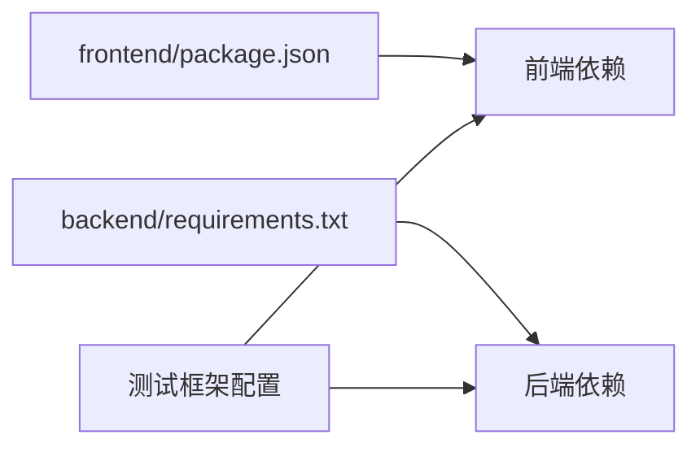
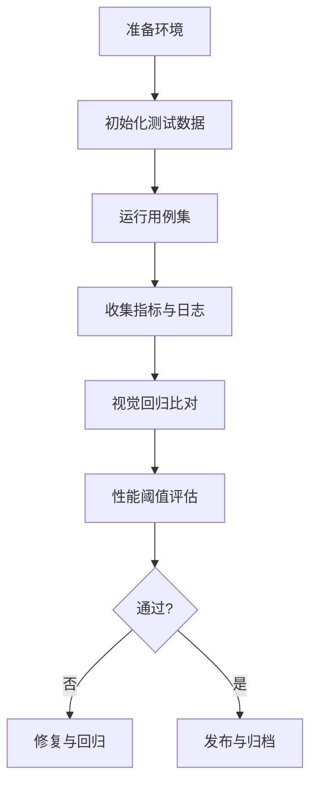

# 端到端测试

<cite>
**本文引用的文件**   
- [docker-compose.yml](file://docker-compose.yml)
- [frontend/package.json](file://frontend/package.json)
- [frontend/vite.config.js](file://frontend/vite.config.js)
- [frontend/Dockerfile](file://frontend/Dockerfile)
- [backend/app.py](file://backend/app.py)
- [backend/requirements.txt](file://backend/requirements.txt)
- [scripts/integration_test.py](file://scripts/integration_test.py)
- [frontend/src/views/SmartAsk.vue](file://frontend/src/views/SmartAsk.vue)
- [frontend/src/components/smartask/ChatHeader.vue](file://frontend/src/components/smartask/ChatHeader.vue)
- [frontend/src/components/smartask/ComposerArea.vue](file://frontend/src/components/smartask/ComposerArea.vue)
- [frontend/src/components/smartask/LiveExecutionFeed.vue](file://frontend/src/components/smartask/LiveExecutionFeed.vue)
- [frontend/src/api/index.js](file://frontend/src/api/index.js)
- [frontend/src/state/smartAskSession.js](file://frontend/src/state/smartAskSession.js)
- [frontend/src/router/index.js](file://frontend/src/router/index.js)
</cite>

## 目录
1. [简介](#简介)
2. [项目结构](#项目结构)
3. [核心组件](#核心组件)
4. [架构总览](#架构总览)
5. [详细组件分析](#详细组件分析)
6. [依赖分析](#依赖分析)
7. [性能考虑](#性能考虑)
8. [故障排查指南](#故障排查指南)
9. [结论](#结论)
10. [附录](#附录)

## 简介
本方案为 SmartAsk 前端应用提供端到端（E2E）测试实施指南，覆盖基于 Cypress 或 Playwright 的框架选型与配置、聊天界面交互自动化（消息发送、结果展示、实时执行反馈）、跨浏览器兼容性策略、测试数据准备与管理、测试环境搭建与隔离（含 Docker Compose 与测试数据库管理），以及视觉回归测试与性能监控集成。文档面向不同技术背景的读者，既提供高层概览，也给出代码级映射与可操作清单。

## 项目结构
SmartAsk 采用前后端分离架构：
- 前端：Vue 3 + Vite，包含聊天相关视图与组件、状态管理与 API 封装。
- 后端：Python FastAPI/Flask 风格服务，提供认证、会话、数据集、报告等接口。
- 基础设施：Docker Compose 编排前端、后端与数据库，便于本地与 CI 环境一致运行。

图表来源
- [frontend/vite.config.js](file://frontend/vite.config.js)
- [frontend/src/router/index.js](file://frontend/src/router/index.js)
- [frontend/src/api/index.js](file://frontend/src/api/index.js)
- [backend/app.py](file://backend/app.py)
- [docker-compose.yml](file://docker-compose.yml)

章节来源
- [frontend/package.json](file://frontend/package.json)
- [frontend/vite.config.js](file://frontend/vite.config.js)
- [backend/app.py](file://backend/app.py)
- [docker-compose.yml](file://docker-compose.yml)

## 核心组件
- 聊天视图与组件：负责用户输入、消息气泡、思考过程、SQL 片段、结果摘要、实时执行流等。
- 会话与历史：维护当前会话上下文与历史消息，支撑多轮对话与回放。
- API 层：统一封装后端接口调用，处理错误与重试。
- 后端服务：提供认证、权限、数据集、报告、系统日志等能力。

章节来源
- [frontend/src/views/SmartAsk.vue](file://frontend/src/views/SmartAsk.vue)
- [frontend/src/components/smartask/ChatHeader.vue](file://frontend/src/components/smartask/ChatHeader.vue)
- [frontend/src/components/smartask/ComposerArea.vue](file://frontend/src/components/smartask/ComposerArea.vue)
- [frontend/src/components/smartask/LiveExecutionFeed.vue](file://frontend/src/components/smartask/LiveExecutionFeed.vue)
- [frontend/src/api/index.js](file://frontend/src/api/index.js)
- [frontend/src/state/smartAskSession.js](file://frontend/src/state/smartAskSession.js)
- [backend/app.py](file://backend/app.py)

## 架构总览
下图展示了 E2E 测试在整体系统中的位置与交互路径：测试驱动浏览器访问前端，触发聊天交互，前端通过 API 调用后端，后端持久化到数据库；测试同时断言 UI 行为、网络请求与数据一致性。

图表来源
- [frontend/src/views/SmartAsk.vue](file://frontend/src/views/SmartAsk.vue)
- [frontend/src/api/index.js](file://frontend/src/api/index.js)
- [backend/app.py](file://backend/app.py)
- [docker-compose.yml](file://docker-compose.yml)

## 详细组件分析

### 聊天界面交互测试（Cypress）
- 目标：验证用户输入、消息发送、结果展示与实时执行反馈。
- 关键步骤：
  - 登录与权限初始化（可选，视后端鉴权策略）。
  - 进入聊天页面，定位输入框与发送按钮。
  - 输入问题并触发发送，等待消息气泡出现。
  - 断言思考卡片、SQL 片段、结果摘要依次渲染。
  - 监听 WebSocket/SSE 事件，断言实时执行流输出。
  - 清理会话或切换用户，确保用例隔离。

图表来源
- [frontend/src/components/smartask/ComposerArea.vue](file://frontend/src/components/smartask/ComposerArea.vue)
- [frontend/src/components/smartask/LiveExecutionFeed.vue](file://frontend/src/components/smartask/LiveExecutionFeed.vue)
- [frontend/src/api/index.js](file://frontend/src/api/index.js)

章节来源
- [frontend/src/components/smartask/ComposerArea.vue](file://frontend/src/components/smartask/ComposerArea.vue)
- [frontend/src/components/smartask/LiveExecutionFeed.vue](file://frontend/src/components/smartask/LiveExecutionFeed.vue)
- [frontend/src/api/index.js](file://frontend/src/api/index.js)

### 聊天界面交互测试（Playwright）
- 目标：与 Cypress 类似，但强调跨浏览器与并行执行。
- 关键步骤：
  - 使用浏览器上下文隔离每个用例。
  - 通过 API 预置会话或模拟登录态。
  - 使用选择器稳定定位输入框与发送按钮。
  - 拦截网络请求，断言请求参数与响应结构。
  - 捕获控制台日志与未处理异常，辅助调试。

图表来源
- [frontend/src/views/SmartAsk.vue](file://frontend/src/views/SmartAsk.vue)
- [frontend/src/api/index.js](file://frontend/src/api/index.js)
- [backend/app.py](file://backend/app.py)

章节来源
- [frontend/src/views/SmartAsk.vue](file://frontend/src/views/SmartAsk.vue)
- [frontend/src/api/index.js](file://frontend/src/api/index.js)
- [backend/app.py](file://backend/app.py)

### 实时执行反馈测试
- 目标：验证 SSE/WebSocket 事件驱动的实时流式输出。
- 关键点：
  - 监听事件通道，按顺序断言阶段标签（如“解析意图”、“生成 SQL”、“执行查询”）。
  - 校验时间戳与延迟阈值，避免误判。
  - 在网络抖动场景下增加重试与超时控制。

图表来源
- [frontend/src/components/smartask/LiveExecutionFeed.vue](file://frontend/src/components/smartask/LiveExecutionFeed.vue)
- [frontend/src/api/index.js](file://frontend/src/api/index.js)

章节来源
- [frontend/src/components/smartask/LiveExecutionFeed.vue](file://frontend/src/components/smartask/LiveExecutionFeed.vue)
- [frontend/src/api/index.js](file://frontend/src/api/index.js)

### 视觉回归测试
- 工具：Cypress Visual Regression / Playwright Snapshot。
- 策略：
  - 对关键页面与组件（聊天头部、结果摘要、SQL 块）进行快照对比。
  - 设置像素容差与区域裁剪，减少布局抖动影响。
  - 在 CI 中自动比对基线，失败时生成差异图。

章节来源
- [frontend/src/components/smartask/ChatHeader.vue](file://frontend/src/components/smartask/ChatHeader.vue)
- [frontend/src/components/smartask/ResultDigestCard.vue](file://frontend/src/components/smartask/ResultDigestCard.vue)
- [frontend/src/components/smartask/SqlBlock.vue](file://frontend/src/components/smartask/SqlBlock.vue)

### 性能监控集成
- 指标：首屏加载、输入响应时间、事件流到达延迟、长任务阻塞。
- 方法：
  - 使用浏览器 Performance API 采集 LCP、FID、CLS。
  - 在 E2E 中插入度量点，结合 CI 上报到监控平台。
  - 设定阈值告警，防止性能退化。

章节来源
- [frontend/src/api/index.js](file://frontend/src/api/index.js)
- [frontend/src/state/smartAskSession.js](file://frontend/src/state/smartAskSession.js)

## 依赖分析
- 前端依赖：Vue、Vite、路由与状态管理库、API 客户端。
- 后端依赖：Python Web 框架、ORM、认证与权限模块、数据库驱动。
- 测试依赖：Cypress 或 Playwright、截图/快照插件、性能采集 SDK。

图表来源
- [frontend/package.json](file://frontend/package.json)
- [backend/requirements.txt](file://backend/requirements.txt)

章节来源
- [frontend/package.json](file://frontend/package.json)
- [backend/requirements.txt](file://backend/requirements.txt)

## 性能考虑
- 测试稳定性：
  - 使用稳定的选择器与语义化 ID，避免 CSS 类名变更导致失效。
  - 合理设置等待策略（显式等待优先于固定延时）。
- 并发与资源：
  - 使用独立浏览器上下文与端口，避免冲突。
  - 限制并发用例数量，降低 CI 资源压力。
- 数据与缓存：
  - 每次用例前重置会话与缓存，保证幂等性。
  - 对热点接口启用轻量缓存，缩短响应时间。

## 故障排查指南
- 常见问题：
  - 登录态丢失：检查令牌刷新与存储策略。
  - 网络超时：调整超时阈值与重试次数。
  - 选择器不稳定：改用 data-testid 或文本锚点。
  - 实时事件丢失：增加事件重连与缓冲机制。
- 诊断手段：
  - 录制视频与截图，定位 UI 状态。
  - 抓取网络面板与控制台日志，分析请求链路。
  - 使用后端日志与数据库快照，核对数据一致性。

章节来源
- [scripts/integration_test.py](file://scripts/integration_test.py)
- [frontend/src/api/index.js](file://frontend/src/api/index.js)
- [backend/app.py](file://backend/app.py)

## 结论
本方案为 SmartAsk 前端提供了完整的 E2E 测试实施路径，涵盖框架选型、交互自动化、实时流验证、视觉回归与性能监控，并通过 Docker Compose 实现环境与数据隔离。建议逐步落地：先建立基础聊天用例，再扩展实时流与视觉回归，最后引入性能监控与 CI 集成，持续保障质量与体验。

## 附录

### 测试环境搭建与隔离（Docker Compose）
- 容器编排：
  - 前端：静态资源由 Nginx 托管，开发模式使用 Vite 热更新。
  - 后端：Python 服务暴露 API，连接 PostgreSQL。
  - 数据库：PostgreSQL 初始化脚本与种子数据。
- 环境变量：
  - 前端代理后端地址、功能开关、日志级别。
  - 后端数据库连接、认证密钥、第三方服务凭据。
- 数据隔离：
  - 每个测试套件使用独立数据库 schema 或命名空间。
  - 用例前后执行数据清理与恢复脚本。

章节来源
- [docker-compose.yml](file://docker-compose.yml)
- [frontend/Dockerfile](file://frontend/Dockerfile)
- [backend/app.py](file://backend/app.py)

### 测试数据准备与管理
- 用户与权限：
  - 预置测试用户与角色，分配数据集访问权限。
  - 支持动态创建临时用户，避免污染生产数据。
- 数据集与提示词：
  - 预加载标准数据集与提示词模板。
  - 提供数据版本化与回滚机制。
- 会话与历史：
  - 清空历史会话，确保用例初始状态一致。
  - 导出/导入会话快照，用于复现问题。

章节来源
- [backend/app.py](file://backend/app.py)
- [frontend/src/state/smartAskSession.js](file://frontend/src/state/smartAskSession.js)

### 跨浏览器兼容性测试策略
- 浏览器矩阵：
  - Chrome、Firefox、Safari、Edge 最新两个主版本。
- 执行方式：
  - Playwright 原生多浏览器支持，Cypress 通过插件扩展。
- 断言策略：
  - 针对布局差异使用相对定位与弹性布局断言。
  - 对字体与渲染差异设置像素容差。

章节来源
- [frontend/package.json](file://frontend/package.json)
- [frontend/vite.config.js](file://frontend/vite.config.js)

### 端到端测试流程（推荐）

[本图为概念流程图，不直接映射具体源码文件]