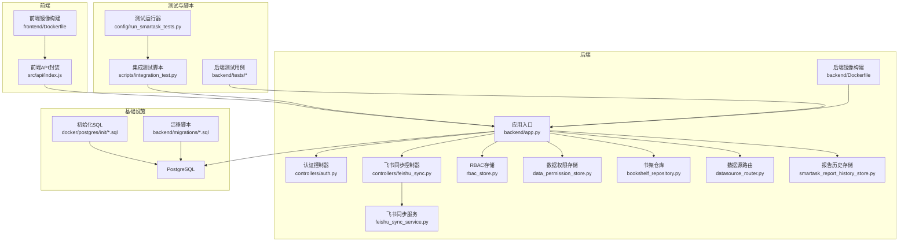
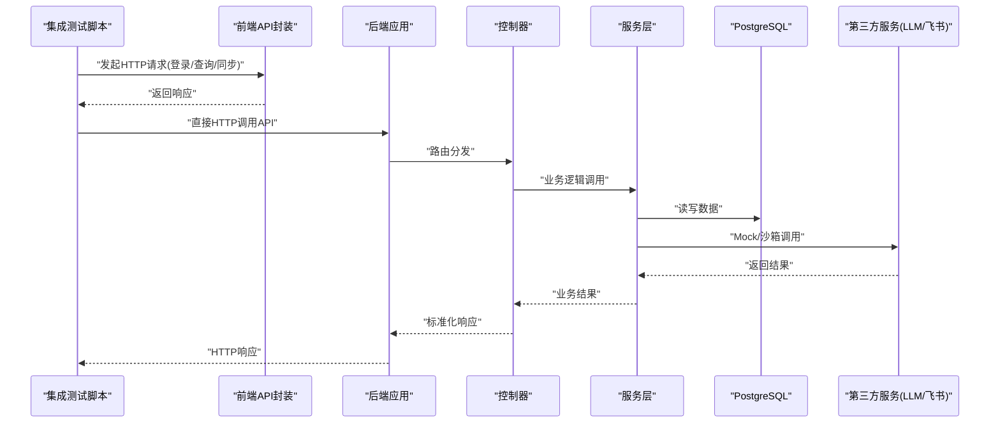
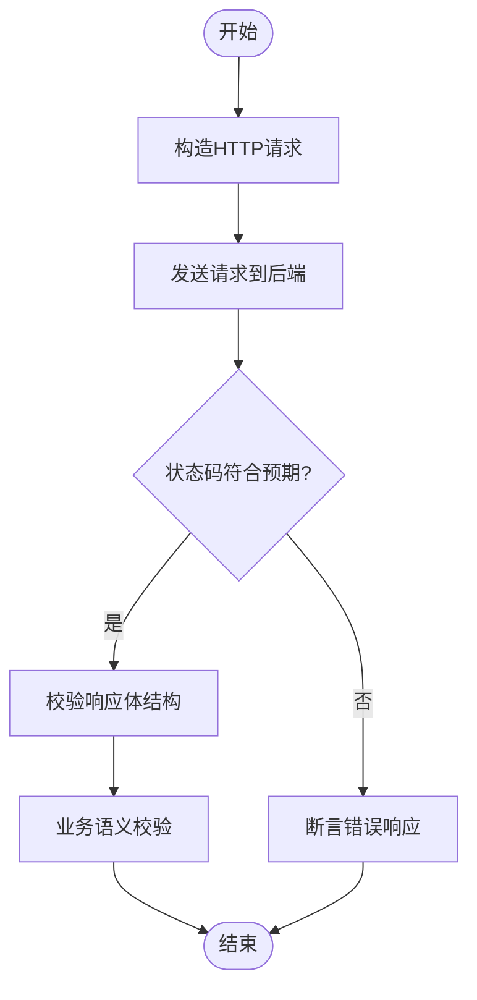
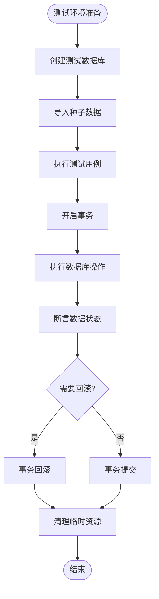
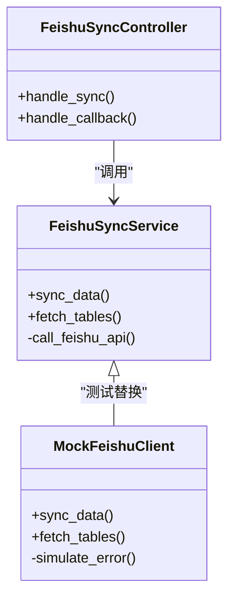
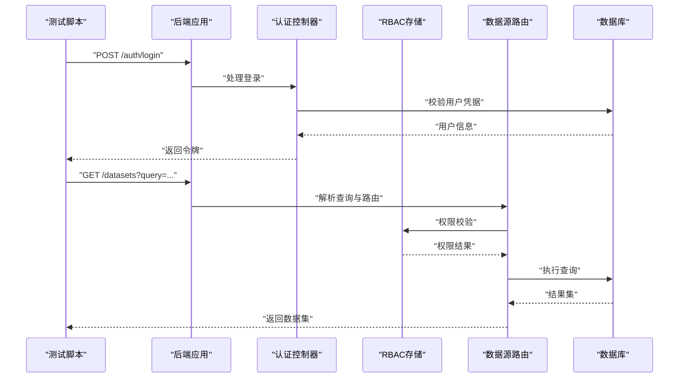
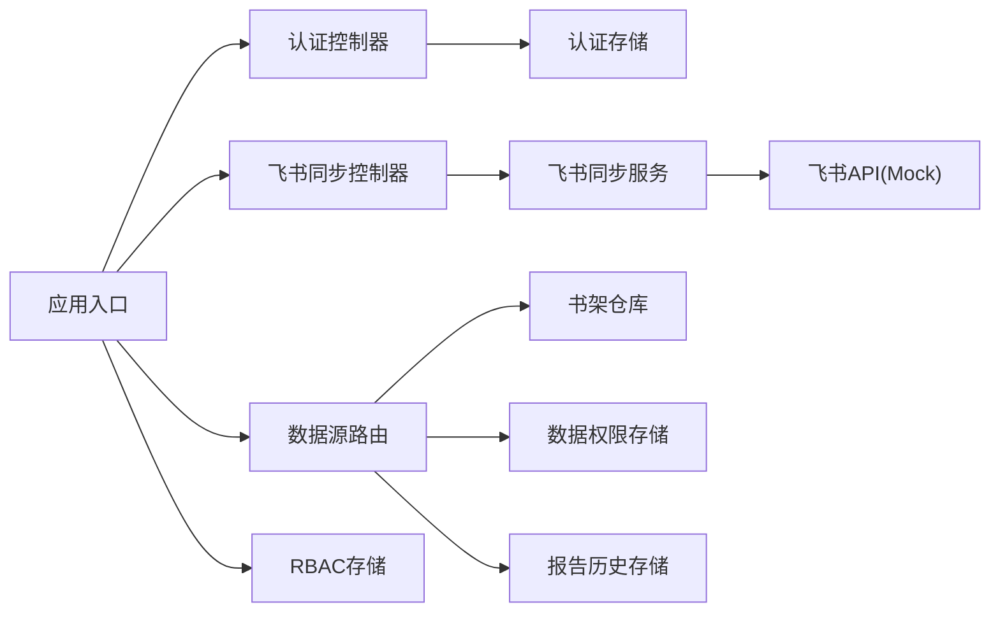

# 集成测试

<cite>
**本文引用的文件**   
- [docker-compose.yml](file://docker-compose.yml)
- [backend/app.py](file://backend/app.py)
- [backend/controllers/auth.py](file://backend/controllers/auth.py)
- [backend/controllers/feishu_sync.py](file://backend/controllers/feishu_sync.py)
- [backend/feishu_sync_service.py](file://backend/feishu_sync_service.py)
- [backend/rbac_store.py](file://backend/rbac_store.py)
- [backend/data_permission_store.py](file://backend/data_permission_store.py)
- [backend/bookshelf_repository.py](file://backend/bookshelf_repository.py)
- [backend/datasource_router.py](file://backend/datasource_router.py)
- [backend/smartask_report_history_store.py](file://backend/smartask_report_history_store.py)
- [backend/migrations/20260330_bookshelf_schema.sql](file://backend/migrations/20260330_bookshelf_schema.sql)
- [docker/postgres/init/001_bookshelf_schema.sql](file://docker/postgres/init/001_bookshelf_schema.sql)
- [scripts/integration_test.py](file://scripts/integration_test.py)
- [config/run_smartask_tests.py](file://config/run_smartask_tests.py)
- [backend/tests/test_ask_flow_controller.py](file://backend/tests/test_ask_flow_controller.py)
- [backend/tests/test_security_guards.py](file://backend/tests/test_security_guards.py)
- [backend/tests/test_route_and_permission_guards.py](file://backend/tests/test_route_and_permission_guards.py)
- [frontend/src/api/index.js](file://frontend/src/api/index.js)
- [frontend/Dockerfile](file://frontend/Dockerfile)
- [backend/Dockerfile](file://backend/Dockerfile)
</cite>

## 目录
1. [简介](#简介)
2. [项目结构](#项目结构)
3. [核心组件](#核心组件)
4. [架构总览](#架构总览)
5. [详细组件分析](#详细组件分析)
6. [依赖关系分析](#依赖关系分析)
7. [性能考虑](#性能考虑)
8. [故障排查指南](#故障排查指南)
9. [结论](#结论)
10. [附录](#附录)

## 简介
本文件为 SmartAsk 项目制定完整的集成测试策略，覆盖以下关键方面：
- API 接口集成测试：HTTP 请求模拟、响应验证与错误处理。
- 数据库操作集成测试：事务管理、数据清理与测试数据库搭建。
- 第三方服务集成 Mock：LLM API 调用、飞书同步服务的 Mock 实现。
- 端到端业务流程测试：用户登录、数据集查询、权限验证等完整流程。
- 测试环境配置与管理：Docker 容器使用、测试数据准备。
- 性能基准与负载测试：实施方法与指标采集。

目标是为开发、测试与运维提供可执行的测试方案与最佳实践，确保系统稳定性与质量。

## 项目结构
SmartAsk 采用前后端分离架构，后端基于 Python（FastAPI/Flask 风格），前端基于 Vue/Vite，通过 Docker Compose 统一编排。测试相关脚本位于 scripts 与 config 目录，后端单元测试位于 backend/tests。

图表来源
- [docker-compose.yml](file://docker-compose.yml)
- [backend/app.py](file://backend/app.py)
- [frontend/src/api/index.js](file://frontend/src/api/index.js)
- [backend/Dockerfile](file://backend/Dockerfile)
- [frontend/Dockerfile](file://frontend/Dockerfile)

章节来源
- [docker-compose.yml](file://docker-compose.yml)
- [backend/app.py](file://backend/app.py)
- [frontend/src/api/index.js](file://frontend/src/api/index.js)
- [backend/Dockerfile](file://backend/Dockerfile)
- [frontend/Dockerfile](file://frontend/Dockerfile)

## 核心组件
- 应用入口与路由注册：负责挂载控制器、中间件与全局配置。
- 认证与授权：用户登录、令牌签发与校验、RBAC 与数据权限控制。
- 飞书同步：控制器与服务层解耦，支持外部飞书 API 的调用与回调处理。
- 数据访问层：书架、数据源路由、报告历史等仓储模块，对接数据库。
- 测试与运行：集成测试脚本、测试运行器与后端测试用例。

章节来源
- [backend/app.py](file://backend/app.py)
- [backend/controllers/auth.py](file://backend/controllers/auth.py)
- [backend/controllers/feishu_sync.py](file://backend/controllers/feishu_sync.py)
- [backend/feishu_sync_service.py](file://backend/feishu_sync_service.py)
- [backend/rbac_store.py](file://backend/rbac_store.py)
- [backend/data_permission_store.py](file://backend/data_permission_store.py)
- [backend/bookshelf_repository.py](file://backend/bookshelf_repository.py)
- [backend/datasource_router.py](file://backend/datasource_router.py)
- [backend/smartask_report_history_store.py](file://backend/smartask_report_history_store.py)
- [scripts/integration_test.py](file://scripts/integration_test.py)
- [config/run_smartask_tests.py](file://config/run_smartask_tests.py)
- [backend/tests/test_ask_flow_controller.py](file://backend/tests/test_ask_flow_controller.py)
- [backend/tests/test_security_guards.py](file://backend/tests/test_security_guards.py)
- [backend/tests/test_route_and_permission_guards.py](file://backend/tests/test_route_and_permission_guards.py)

## 架构总览
下图展示集成测试在整体架构中的位置与交互：测试脚本通过 HTTP 调用后端 API，后端经控制器与仓储访问数据库；第三方服务（如 LLM、飞书）通过 Mock 或沙箱替换；Docker Compose 提供一致的测试环境。

图表来源
- [scripts/integration_test.py](file://scripts/integration_test.py)
- [backend/app.py](file://backend/app.py)
- [backend/controllers/auth.py](file://backend/controllers/auth.py)
- [backend/controllers/feishu_sync.py](file://backend/controllers/feishu_sync.py)
- [backend/feishu_sync_service.py](file://backend/feishu_sync_service.py)
- [backend/datasource_router.py](file://backend/datasource_router.py)
- [backend/bookshelf_repository.py](file://backend/bookshelf_repository.py)
- [backend/smartask_report_history_store.py](file://backend/smartask_report_history_store.py)

## 详细组件分析

### API 接口集成测试方法
- 请求模拟：使用测试脚本构造 HTTP 请求，覆盖正常路径与异常分支（参数缺失、非法值、鉴权失败）。
- 响应验证：断言状态码、数据结构、关键字段与业务语义一致性。
- 错误处理：验证错误码、错误消息与日志输出是否满足预期。
- 建议工具：pytest + requests/httpx，结合 fixtures 管理测试数据与上下文。

章节来源
- [scripts/integration_test.py](file://scripts/integration_test.py)
- [backend/app.py](file://backend/app.py)
- [backend/controllers/auth.py](file://backend/controllers/auth.py)
- [backend/controllers/feishu_sync.py](file://backend/controllers/feishu_sync.py)

### 数据库操作集成测试
- 事务管理：每个测试用例应在独立事务中执行，保证隔离性；必要时使用回滚恢复。
- 数据清理：测试前准备种子数据，测试后清理或回滚，避免污染。
- 测试数据库：通过 Docker Compose 启动独立的 PostgreSQL 实例，使用初始化 SQL 与迁移脚本建立 schema。
- 连接配置：通过环境变量注入测试数据库连接信息，避免硬编码。

章节来源
- [docker-compose.yml](file://docker-compose.yml)
- [docker/postgres/init/001_bookshelf_schema.sql](file://docker/postgres/init/001_bookshelf_schema.sql)
- [backend/migrations/20260330_bookshelf_schema.sql](file://backend/migrations/20260330_bookshelf_schema.sql)
- [backend/bookshelf_repository.py](file://backend/bookshelf_repository.py)
- [backend/datasource_router.py](file://backend/datasource_router.py)
- [backend/smartask_report_history_store.py](file://backend/smartask_report_history_store.py)

### 第三方服务集成 Mock
- LLM API 调用：通过本地 Mock 服务器或内存替换实现，拦截真实网络请求，返回预设响应。
- 飞书同步服务：控制器与服务层解耦，测试时注入 Mock 实现，模拟成功、失败、超时等场景。
- 配置开关：通过环境变量或特性标志切换真实与 Mock 行为，便于不同环境复用。

图表来源
- [backend/controllers/feishu_sync.py](file://backend/controllers/feishu_sync.py)
- [backend/feishu_sync_service.py](file://backend/feishu_sync_service.py)

章节来源
- [backend/controllers/feishu_sync.py](file://backend/controllers/feishu_sync.py)
- [backend/feishu_sync_service.py](file://backend/feishu_sync_service.py)

### 端到端业务流程测试
- 用户登录：模拟登录流程，获取并缓存令牌，后续请求携带认证头。
- 数据集查询：构造查询意图，触发路由与权限校验，验证返回的数据集与结果。
- 权限验证：覆盖 RBAC 与数据权限，确保越权访问被拒绝。
- 报告历史：记录查询历史，验证持久化与检索。

图表来源
- [backend/controllers/auth.py](file://backend/controllers/auth.py)
- [backend/rbac_store.py](file://backend/rbac_store.py)
- [backend/datasource_router.py](file://backend/datasource_router.py)
- [backend/bookshelf_repository.py](file://backend/bookshelf_repository.py)
- [backend/smartask_report_history_store.py](file://backend/smartask_report_history_store.py)

章节来源
- [backend/controllers/auth.py](file://backend/controllers/auth.py)
- [backend/rbac_store.py](file://backend/rbac_store.py)
- [backend/datasource_router.py](file://backend/datasource_router.py)
- [backend/bookshelf_repository.py](file://backend/bookshelf_repository.py)
- [backend/smartask_report_history_store.py](file://backend/smartask_report_history_store.py)

### 测试环境配置与管理
- Docker Compose：统一编排后端、前端与数据库服务，提供一致的环境。
- 镜像构建：前后端分别定义 Dockerfile，确保依赖与构建过程可重复。
- 环境变量：通过 .env 或 Compose 变量注入数据库连接、第三方服务地址与开关。
- 数据准备：使用初始化 SQL 与迁移脚本建立 schema，并通过脚本导入种子数据。

章节来源
- [docker-compose.yml](file://docker-compose.yml)
- [backend/Dockerfile](file://backend/Dockerfile)
- [frontend/Dockerfile](file://frontend/Dockerfile)
- [docker/postgres/init/001_bookshelf_schema.sql](file://docker/postgres/init/001_bookshelf_schema.sql)
- [backend/migrations/20260330_bookshelf_schema.sql](file://backend/migrations/20260330_bookshelf_schema.sql)

## 依赖关系分析
- 控制器依赖服务层，服务层依赖仓储与外部服务。
- 仓储模块依赖数据库连接与迁移脚本。
- 测试脚本依赖应用入口与控制器暴露的 API。
- 前端通过 API 封装与后端交互，测试时可绕过前端直接调用后端。

图表来源
- [backend/app.py](file://backend/app.py)
- [backend/controllers/auth.py](file://backend/controllers/auth.py)
- [backend/controllers/feishu_sync.py](file://backend/controllers/feishu_sync.py)
- [backend/feishu_sync_service.py](file://backend/feishu_sync_service.py)
- [backend/rbac_store.py](file://backend/rbac_store.py)
- [backend/data_permission_store.py](file://backend/data_permission_store.py)
- [backend/bookshelf_repository.py](file://backend/bookshelf_repository.py)
- [backend/datasource_router.py](file://backend/datasource_router.py)
- [backend/smartask_report_history_store.py](file://backend/smartask_report_history_store.py)

章节来源
- [backend/app.py](file://backend/app.py)
- [backend/controllers/auth.py](file://backend/controllers/auth.py)
- [backend/controllers/feishu_sync.py](file://backend/controllers/feishu_sync.py)
- [backend/feishu_sync_service.py](file://backend/feishu_sync_service.py)
- [backend/rbac_store.py](file://backend/rbac_store.py)
- [backend/data_permission_store.py](file://backend/data_permission_store.py)
- [backend/bookshelf_repository.py](file://backend/bookshelf_repository.py)
- [backend/datasource_router.py](file://backend/datasource_router.py)
- [backend/smartask_report_history_store.py](file://backend/smartask_report_history_store.py)

## 性能考虑
- 基准测试：对关键 API（登录、查询、同步）进行单接口性能测量，关注延迟与吞吐。
- 负载测试：模拟多用户并发访问，观察系统瓶颈（CPU、内存、IO、数据库连接池）。
- 指标采集：收集响应时间、错误率、资源利用率，生成报告用于回归对比。
- 优化建议：缓存热点数据、分页与限流、异步任务处理、数据库索引优化。

[本节为通用指导，不直接分析具体文件]

## 故障排查指南
- 常见问题：
  - 数据库连接失败：检查环境变量与 Docker 网络连通性。
  - 第三方服务超时：确认 Mock 配置与网络可达性。
  - 权限校验失败：核对 RBAC 与数据权限规则。
- 调试手段：
  - 启用详细日志，定位错误堆栈。
  - 使用测试脚本逐步复现问题。
  - 通过数据库快照与迁移脚本恢复一致状态。

章节来源
- [scripts/integration_test.py](file://scripts/integration_test.py)
- [backend/app.py](file://backend/app.py)
- [backend/controllers/auth.py](file://backend/controllers/auth.py)
- [backend/controllers/feishu_sync.py](file://backend/controllers/feishu_sync.py)
- [backend/feishu_sync_service.py](file://backend/feishu_sync_service.py)

## 结论
本集成测试策略覆盖了 API、数据库、第三方服务与端到端流程，结合 Docker 与脚本化工具，形成可重复、可扩展的测试体系。建议持续完善测试用例与性能基线，保障系统质量与稳定性。

[本节为总结，不直接分析具体文件]

## 附录
- 测试运行命令示例：参考测试运行器与集成测试脚本。
- 数据准备清单：初始化 SQL 与迁移脚本列表。
- 环境变量模板：数据库、第三方服务与开关配置。

章节来源
- [config/run_smartask_tests.py](file://config/run_smartask_tests.py)
- [scripts/integration_test.py](file://scripts/integration_test.py)
- [docker/postgres/init/001_bookshelf_schema.sql](file://docker/postgres/init/001_bookshelf_schema.sql)
- [backend/migrations/20260330_bookshelf_schema.sql](file://backend/migrations/20260330_bookshelf_schema.sql)