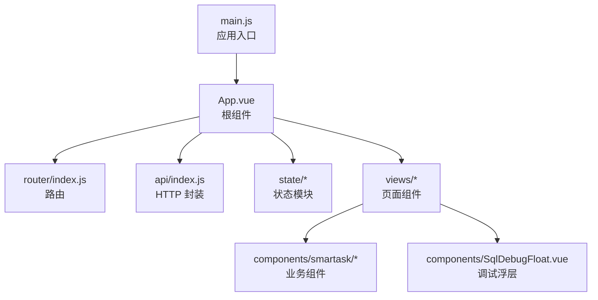
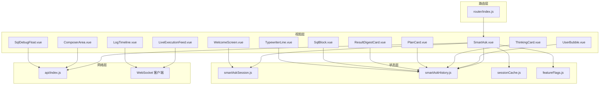
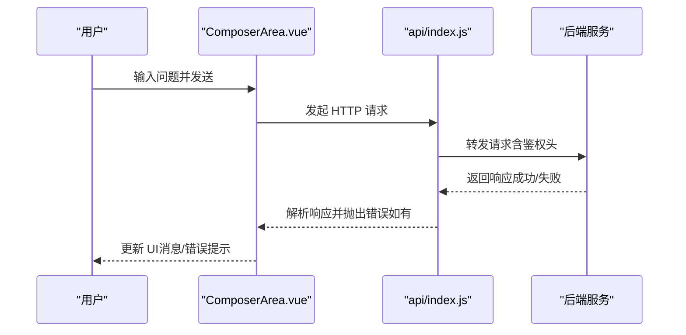
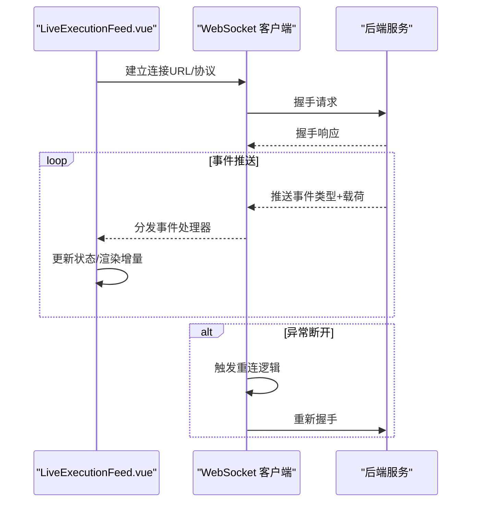
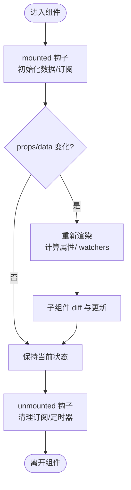
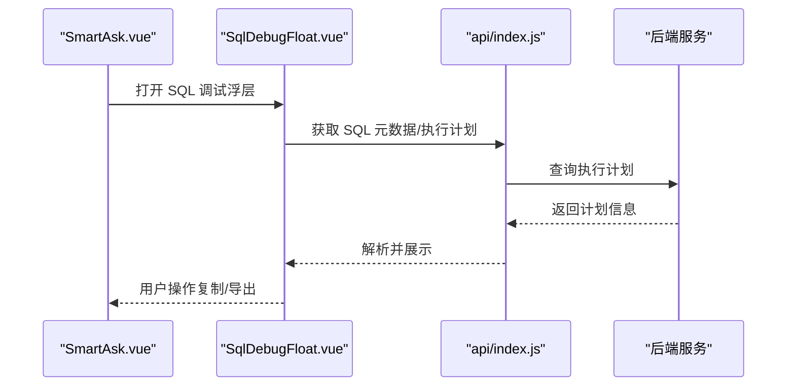
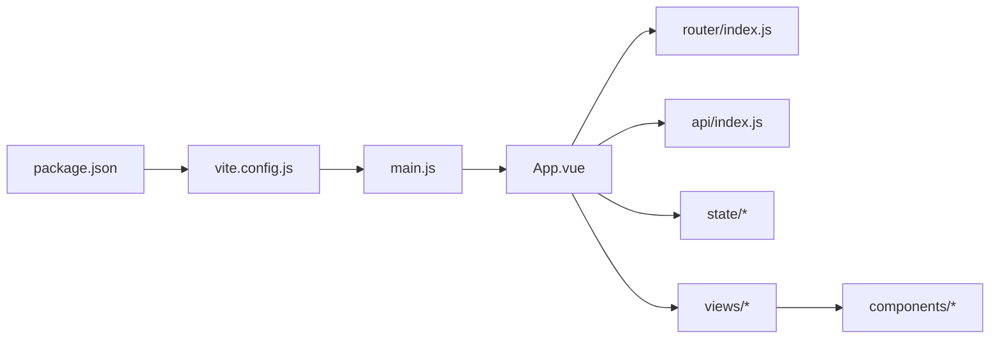

# 前端调试

<cite>
**本文引用的文件**   
- [frontend/src/main.js](file://frontend/src/main.js)
- [frontend/src/App.vue](file://frontend/src/App.vue)
- [frontend/src/router/index.js](file://frontend/src/router/index.js)
- [frontend/src/api/index.js](file://frontend/src/api/index.js)
- [frontend/src/state/smartAskSession.js](file://frontend/src/state/smartAskSession.js)
- [frontend/src/state/smartAskHistory.js](file://frontend/src/state/smartAskHistory.js)
- [frontend/src/state/sessionCache.js](file://frontend/src/state/sessionCache.js)
- [frontend/src/state/featureFlags.js](file://frontend/src/state/featureFlags.js)
- [frontend/src/views/SmartAsk.vue](file://frontend/src/views/SmartAsk.vue)
- [frontend/src/components/smartask/LiveExecutionFeed.vue](file://frontend/src/components/smartask/LiveExecutionFeed.vue)
- [frontend/src/components/smartask/LogTimeline.vue](file://frontend/src/components/smartask/LogTimeline.vue)
- [frontend/src/components/smartask/ChatHeader.vue](file://frontend/src/components/smartask/ChatHeader.vue)
- [frontend/src/components/smartask/ComposerArea.vue](file://frontend/src/components/smartask/ComposerArea.vue)
- [frontend/src/components/smartask/UserBubble.vue](file://frontend/src/components/smartask/UserBubble.vue)
- [frontend/src/components/smartask/ThinkingCard.vue](file://frontend/src/components/smartask/ThinkingCard.vue)
- [frontend/src/components/smartask/PlanCard.vue](file://frontend/src/components/smartask/PlanCard.vue)
- [frontend/src/components/smartask/ResultDigestCard.vue](file://frontend/src/components/smartask/ResultDigestCard.vue)
- [frontend/src/components/smartask/SqlBlock.vue](file://frontend/src/components/smartask/SqlBlock.vue)
- [frontend/src/components/smartask/TypewriterLine.vue](file://frontend/src/components/smartask/TypewriterLine.vue)
- [frontend/src/components/smartask/WelcomeScreen.vue](file://frontend/src/components/smartask/WelcomeScreen.vue)
- [frontend/src/components/SqlDebugFloat.vue](file://frontend/src/components/SqlDebugFloat.vue)
- [frontend/vite.config.js](file://frontend/vite.config.js)
- [frontend/package.json](file://frontend/package.json)
</cite>

## 目录
1. [简介](#简介)
2. [项目结构](#项目结构)
3. [核心组件](#核心组件)
4. [架构总览](#架构总览)
5. [详细组件分析](#详细组件分析)
6. [依赖分析](#依赖分析)
7. [性能考虑](#性能考虑)
8. [故障排查指南](#故障排查指南)
9. [结论](#结论)
10. [附录](#附录)

## 简介
本指南面向 SmartAsk 前端 Vue.js 应用，提供从浏览器开发者工具到 Vue DevTools 的完整调试方法。内容覆盖：
- 网络面板调试 API 请求与 WebSocket 连接
- 控制台调试 JavaScript 代码与断点
- 元素检查器调试 UI 组件样式与布局
- Vue DevTools 配置与使用（组件树、状态、路由、性能）
- 实时执行流调试（WebSocket、事件流、生命周期）
- 前端性能优化（渲染、内存、网络）
- 常见问题排查（跨域、状态同步、组件通信、第三方库集成）

## 项目结构
SmartAsk 前端基于 Vite + Vue 3 构建，主要目录与职责如下：
- src/main.js：应用入口，初始化 Vue 实例、插件与全局配置
- src/App.vue：根组件，挂载路由与全局容器
- src/router/index.js：Vue Router 路由定义与导航守卫
- src/api/index.js：统一 HTTP 请求封装与拦截器
- src/state/*：状态管理（会话、历史、缓存、特性开关）
- src/views/*：页面级视图组件
- src/components/smartask/*：聊天与执行流相关 UI 组件
- src/components/SqlDebugFloat.vue：SQL 调试浮层
- vite.config.js：Vite 构建与开发服务器配置
- package.json：依赖与脚本

**图表来源** 
- [frontend/src/main.js](file://frontend/src/main.js)
- [frontend/src/App.vue](file://frontend/src/App.vue)
- [frontend/src/router/index.js](file://frontend/src/router/index.js)
- [frontend/src/api/index.js](file://frontend/src/api/index.js)
- [frontend/src/state/smartAskSession.js](file://frontend/src/state/smartAskSession.js)
- [frontend/src/state/smartAskHistory.js](file://frontend/src/state/smartAskHistory.js)
- [frontend/src/state/sessionCache.js](file://frontend/src/state/sessionCache.js)
- [frontend/src/state/featureFlags.js](file://frontend/src/state/featureFlags.js)
- [frontend/src/views/SmartAsk.vue](file://frontend/src/views/SmartAsk.vue)
- [frontend/src/components/smartask/LiveExecutionFeed.vue](file://frontend/src/components/smartask/LiveExecutionFeed.vue)
- [frontend/src/components/SqlDebugFloat.vue](file://frontend/src/components/SqlDebugFloat.vue)

**章节来源**
- [frontend/src/main.js](file://frontend/src/main.js)
- [frontend/src/App.vue](file://frontend/src/App.vue)
- [frontend/src/router/index.js](file://frontend/src/router/index.js)
- [frontend/src/api/index.js](file://frontend/src/api/index.js)
- [frontend/src/state/smartAskSession.js](file://frontend/src/state/smartAskSession.js)
- [frontend/src/state/smartAskHistory.js](file://frontend/src/state/smartAskHistory.js)
- [frontend/src/state/sessionCache.js](file://frontend/src/state/sessionCache.js)
- [frontend/src/state/featureFlags.js](file://frontend/src/state/featureFlags.js)
- [frontend/src/views/SmartAsk.vue](file://frontend/src/views/SmartAsk.vue)
- [frontend/src/components/smartask/LiveExecutionFeed.vue](file://frontend/src/components/smartask/LiveExecutionFeed.vue)
- [frontend/src/components/SqlDebugFloat.vue](file://frontend/src/components/SqlDebugFloat.vue)

## 核心组件
- 应用入口与根组件
  - main.js：创建 Vue 应用、安装插件、挂载 DOM
  - App.vue：挂载路由、全局错误边界与主题
- 路由与导航
  - router/index.js：定义页面路由、嵌套路由与导航守卫
- 网络与 API
  - api/index.js：封装 fetch/axios、设置基础 URL、请求/响应拦截、错误处理
- 状态管理
  - smartAskSession.js：当前会话上下文（用户、租户、会话ID等）
  - smartAskHistory.js：问答历史列表与持久化
  - sessionCache.js：会话级缓存（临时数据、中间结果）
  - featureFlags.js：功能开关与灰度策略
- 视图与组件
  - views/SmartAsk.vue：主对话页，组合聊天输入、消息列表、执行流展示
  - components/smartask/*：聊天气泡、思考卡片、计划卡片、结果摘要、SQL 块、打字机效果、欢迎屏、执行流时间线等
  - components/SqlDebugFloat.vue：SQL 调试浮层，便于查看与复制 SQL

**章节来源**
- [frontend/src/main.js](file://frontend/src/main.js)
- [frontend/src/App.vue](file://frontend/src/App.vue)
- [frontend/src/router/index.js](file://frontend/src/router/index.js)
- [frontend/src/api/index.js](file://frontend/src/api/index.js)
- [frontend/src/state/smartAskSession.js](file://frontend/src/state/smartAskSession.js)
- [frontend/src/state/smartAskHistory.js](file://frontend/src/state/smartAskHistory.js)
- [frontend/src/state/sessionCache.js](file://frontend/src/state/sessionCache.js)
- [frontend/src/state/featureFlags.js](file://frontend/src/state/featureFlags.js)
- [frontend/src/views/SmartAsk.vue](file://frontend/src/views/SmartAsk.vue)
- [frontend/src/components/smartask/LiveExecutionFeed.vue](file://frontend/src/components/smartask/LiveExecutionFeed.vue)
- [frontend/src/components/smartask/LogTimeline.vue](file://frontend/src/components/smartask/LogTimeline.vue)
- [frontend/src/components/smartask/ChatHeader.vue](file://frontend/src/components/smartask/ChatHeader.vue)
- [frontend/src/components/smartask/ComposerArea.vue](file://frontend/src/components/smartask/ComposerArea.vue)
- [frontend/src/components/smartask/UserBubble.vue](file://frontend/src/components/smartask/UserBubble.vue)
- [frontend/src/components/smartask/ThinkingCard.vue](file://frontend/src/components/smartask/ThinkingCard.vue)
- [frontend/src/components/smartask/PlanCard.vue](file://frontend/src/components/smartask/PlanCard.vue)
- [frontend/src/components/smartask/ResultDigestCard.vue](file://frontend/src/components/smartask/ResultDigestCard.vue)
- [frontend/src/components/smartask/SqlBlock.vue](file://frontend/src/components/smartask/SqlBlock.vue)
- [frontend/src/components/smartask/TypewriterLine.vue](file://frontend/src/components/smartask/TypewriterLine.vue)
- [frontend/src/components/smartask/WelcomeScreen.vue](file://frontend/src/components/smartask/WelcomeScreen.vue)
- [frontend/src/components/SqlDebugFloat.vue](file://frontend/src/components/SqlDebugFloat.vue)

## 架构总览
SmartAsk 前端采用“视图-状态-网络”分层：
- 视图层：Vue 组件负责 UI 渲染与交互
- 状态层：会话、历史、缓存与特性开关集中管理
- 网络层：统一的 API 封装与拦截器，支持 REST 与 WebSocket
- 路由层：页面导航与权限控制

**图表来源** 
- [frontend/src/views/SmartAsk.vue](file://frontend/src/views/SmartAsk.vue)
- [frontend/src/components/smartask/LiveExecutionFeed.vue](file://frontend/src/components/smartask/LiveExecutionFeed.vue)
- [frontend/src/components/smartask/LogTimeline.vue](file://frontend/src/components/smartask/LogTimeline.vue)
- [frontend/src/components/smartask/ComposerArea.vue](file://frontend/src/components/smartask/ComposerArea.vue)
- [frontend/src/components/smartask/UserBubble.vue](file://frontend/src/components/smartask/UserBubble.vue)
- [frontend/src/components/smartask/ThinkingCard.vue](file://frontend/src/components/smartask/ThinkingCard.vue)
- [frontend/src/components/smartask/PlanCard.vue](file://frontend/src/components/smartask/PlanCard.vue)
- [frontend/src/components/smartask/ResultDigestCard.vue](file://frontend/src/components/smartask/ResultDigestCard.vue)
- [frontend/src/components/smartask/SqlBlock.vue](file://frontend/src/components/smartask/SqlBlock.vue)
- [frontend/src/components/smartask/TypewriterLine.vue](file://frontend/src/components/smartask/TypewriterLine.vue)
- [frontend/src/components/smartask/WelcomeScreen.vue](file://frontend/src/components/smartask/WelcomeScreen.vue)
- [frontend/src/components/SqlDebugFloat.vue](file://frontend/src/components/SqlDebugFloat.vue)
- [frontend/src/state/smartAskSession.js](file://frontend/src/state/smartAskSession.js)
- [frontend/src/state/smartAskHistory.js](file://frontend/src/state/smartAskHistory.js)
- [frontend/src/state/sessionCache.js](file://frontend/src/state/sessionCache.js)
- [frontend/src/state/featureFlags.js](file://frontend/src/state/featureFlags.js)
- [frontend/src/api/index.js](file://frontend/src/api/index.js)
- [frontend/src/router/index.js](file://frontend/src/router/index.js)

## 详细组件分析

### 网络与 API 调试（REST）
- 定位请求：在浏览器“网络”面板筛选 XHR/Fetch，查看请求头、参数、响应体与耗时
- 拦截器调试：在 api/index.js 的请求/响应拦截器中打日志或断点，观察统一错误码与重试逻辑
- 常见错误：
  - 401/403：检查认证令牌是否过期或缺失
  - 4xx/5xx：核对后端接口契约与入参校验
  - CORS：确认后端 Access-Control-Allow-* 与前端代理配置

**图表来源** 
- [frontend/src/components/smartask/ComposerArea.vue](file://frontend/src/components/smartask/ComposerArea.vue)
- [frontend/src/api/index.js](file://frontend/src/api/index.js)

**章节来源**
- [frontend/src/api/index.js](file://frontend/src/api/index.js)
- [frontend/src/components/smartask/ComposerArea.vue](file://frontend/src/components/smartask/ComposerArea.vue)

### 实时执行流调试（WebSocket）
- 连接建立：在 LiveExecutionFeed.vue 或 LogTimeline.vue 中打开 WS 连接，记录握手 URL、协议与子协议
- 消息收发：在网络面板的 WS 标签查看帧内容，确认事件类型、载荷结构与顺序
- 重连与心跳：检查重连策略、心跳间隔与超时处理；必要时手动触发重连
- 断点调试：在 WS 接收回调处打断点，逐步跟踪事件处理与状态更新

**图表来源** 
- [frontend/src/components/smartask/LiveExecutionFeed.vue](file://frontend/src/components/smartask/LiveExecutionFeed.vue)
- [frontend/src/components/smartask/LogTimeline.vue](file://frontend/src/components/smartask/LogTimeline.vue)

**章节来源**
- [frontend/src/components/smartask/LiveExecutionFeed.vue](file://frontend/src/components/smartask/LiveExecutionFeed.vue)
- [frontend/src/components/smartask/LogTimeline.vue](file://frontend/src/components/smartask/LogTimeline.vue)

### 组件状态与生命周期调试
- 组件树：在 Vue DevTools 中展开组件树，查看 props、data、computed、slots
- 状态变更：监听 state 变化，结合控制台打印与断点定位触发源
- 生命周期：在 created/mounted/updated/unmounted 等钩子中打日志，追踪数据加载与销毁
- 性能分析：使用 Profiler 捕获渲染开销，识别不必要的重渲染

**图表来源** 
- [frontend/src/views/SmartAsk.vue](file://frontend/src/views/SmartAsk.vue)
- [frontend/src/components/smartask/LiveExecutionFeed.vue](file://frontend/src/components/smartask/LiveExecutionFeed.vue)
- [frontend/src/components/smartask/LogTimeline.vue](file://frontend/src/components/smartask/LogTimeline.vue)

**章节来源**
- [frontend/src/views/SmartAsk.vue](file://frontend/src/views/SmartAsk.vue)
- [frontend/src/components/smartask/LiveExecutionFeed.vue](file://frontend/src/components/smartask/LiveExecutionFeed.vue)
- [frontend/src/components/smartask/LogTimeline.vue](file://frontend/src/components/smartask/LogTimeline.vue)

### SQL 调试浮层
- 用途：快速查看生成的 SQL、复制与对比差异
- 调试要点：
  - 在 SqlDebugFloat.vue 中插入断点，检查 SQL 生成流程
  - 结合后端日志验证 SQL 执行结果与性能
  - 对复杂查询进行 EXPLAIN 分析

**图表来源** 
- [frontend/src/views/SmartAsk.vue](file://frontend/src/views/SmartAsk.vue)
- [frontend/src/components/SqlDebugFloat.vue](file://frontend/src/components/SqlDebugFloat.vue)
- [frontend/src/api/index.js](file://frontend/src/api/index.js)

**章节来源**
- [frontend/src/components/SqlDebugFloat.vue](file://frontend/src/components/SqlDebugFloat.vue)
- [frontend/src/views/SmartAsk.vue](file://frontend/src/views/SmartAsk.vue)
- [frontend/src/api/index.js](file://frontend/src/api/index.js)

## 依赖分析
- 构建与开发
  - vite.config.js：开发服务器代理、路径别名、插件配置
  - package.json：依赖版本、脚本命令（dev/build/preview）
- 运行时依赖
  - Vue 3、Vue Router、状态模块、HTTP 客户端、WebSocket 客户端
- 外部集成
  - 后端 API 网关、认证服务、数据库访问（通过后端）

**图表来源** 
- [frontend/package.json](file://frontend/package.json)
- [frontend/vite.config.js](file://frontend/vite.config.js)
- [frontend/src/main.js](file://frontend/src/main.js)
- [frontend/src/App.vue](file://frontend/src/App.vue)
- [frontend/src/router/index.js](file://frontend/src/router/index.js)
- [frontend/src/api/index.js](file://frontend/src/api/index.js)
- [frontend/src/state/smartAskSession.js](file://frontend/src/state/smartAskSession.js)
- [frontend/src/state/smartAskHistory.js](file://frontend/src/state/smartAskHistory.js)
- [frontend/src/state/sessionCache.js](file://frontend/src/state/sessionCache.js)
- [frontend/src/state/featureFlags.js](file://frontend/src/state/featureFlags.js)
- [frontend/src/views/SmartAsk.vue](file://frontend/src/views/SmartAsk.vue)
- [frontend/src/components/smartask/LiveExecutionFeed.vue](file://frontend/src/components/smartask/LiveExecutionFeed.vue)

**章节来源**
- [frontend/package.json](file://frontend/package.json)
- [frontend/vite.config.js](file://frontend/vite.config.js)
- [frontend/src/main.js](file://frontend/src/main.js)
- [frontend/src/App.vue](file://frontend/src/App.vue)
- [frontend/src/router/index.js](file://frontend/src/router/index.js)
- [frontend/src/api/index.js](file://frontend/src/api/index.js)
- [frontend/src/state/smartAskSession.js](file://frontend/src/state/smartAskSession.js)
- [frontend/src/state/smartAskHistory.js](file://frontend/src/state/smartAskHistory.js)
- [frontend/src/state/sessionCache.js](file://frontend/src/state/sessionCache.js)
- [frontend/src/state/featureFlags.js](file://frontend/src/state/featureFlags.js)
- [frontend/src/views/SmartAsk.vue](file://frontend/src/views/SmartAsk.vue)
- [frontend/src/components/smartask/LiveExecutionFeed.vue](file://frontend/src/components/smartask/LiveExecutionFeed.vue)

## 性能考虑
- 组件渲染优化
  - 使用 v-memo、computed、watchers 精准监听变化
  - 避免在模板中进行昂贵计算，提取为 computed
  - 大列表使用虚拟滚动或分页加载
- 内存使用分析
  - 使用浏览器“内存”面板进行堆快照对比，查找泄漏
  - 及时清理定时器、事件监听器与 WebSocket 连接
  - 避免闭包持有大对象引用
- 网络请求优化
  - 合并请求、缓存热点数据（sessionCache.js）
  - 启用 gzip/压缩，减少响应体积
  - 合理设置超时与重试策略，避免雪崩

[本节为通用指导，不直接分析具体文件]

## 故障排查指南
- 跨域问题（CORS）
  - 现象：控制台报 CORS 错误，网络面板显示预检失败
  - 排查：检查后端 Access-Control-Allow-Origin/Methods/Headers；本地开发使用 vite.config.js 代理
- 状态同步问题
  - 现象：组件间状态不一致，刷新后丢失
  - 排查：确认状态模块（smartAskSession.js、smartAskHistory.js）是否正确持久化与初始化；检查 watchers 触发条件
- 组件通信问题
  - 现象：父子组件 props 未更新，事件未触发
  - 排查：在 Vue DevTools 中检查 props 值与事件冒泡；确保 emit 调用正确
- 第三方库集成问题
  - 现象：插件未生效或冲突
  - 排查：检查 main.js 中的插件注册顺序与版本兼容性；在控制台输出插件实例
- WebSocket 连接问题
  - 现象：无法建立连接或频繁断开
  - 排查：检查 URL、协议、子协议；查看握手响应码；实现心跳与重连逻辑
- SQL 生成与执行问题
  - 现象：SQL 错误或性能差
  - 排查：使用 SqlDebugFloat.vue 查看 SQL；结合后端日志与 EXPLAIN 分析

**章节来源**
- [frontend/src/state/smartAskSession.js](file://frontend/src/state/smartAskSession.js)
- [frontend/src/state/smartAskHistory.js](file://frontend/src/state/smartAskHistory.js)
- [frontend/src/state/sessionCache.js](file://frontend/src/state/sessionCache.js)
- [frontend/src/api/index.js](file://frontend/src/api/index.js)
- [frontend/src/components/smartask/LiveExecutionFeed.vue](file://frontend/src/components/smartask/LiveExecutionFeed.vue)
- [frontend/src/components/smartask/LogTimeline.vue](file://frontend/src/components/smartask/LogTimeline.vue)
- [frontend/src/components/SqlDebugFloat.vue](file://frontend/src/components/SqlDebugFloat.vue)
- [frontend/vite.config.js](file://frontend/vite.config.js)

## 结论
通过系统化的浏览器开发者工具与 Vue DevTools 使用，结合对网络、状态、组件与路由的深入理解，可以高效定位与解决 SmartAsk 前端的各类问题。建议在日常开发中养成以下习惯：
- 在关键路径添加结构化日志与断点
- 使用性能面板定期评估渲染与内存占用
- 对 WebSocket 与 API 调用进行端到端测试
- 维护清晰的组件职责与状态边界

[本节为总结性内容，不直接分析具体文件]

## 附录
- 常用快捷键
  - 控制台：console.log/debugger
  - 网络：过滤 XHR/Fetch、保存请求/响应
  - 元素：右键“检查”，切换设备模拟
  - Vue DevTools：组件树、状态、路由、Profiler
- 参考文件
  - 入口与根组件：main.js、App.vue
  - 路由与 API：router/index.js、api/index.js
  - 状态模块：smartAskSession.js、smartAskHistory.js、sessionCache.js、featureFlags.js
  - 视图与组件：views/SmartAsk.vue、components/smartask/*、components/SqlDebugFloat.vue
  - 构建配置：vite.config.js、package.json

**章节来源**
- [frontend/src/main.js](file://frontend/src/main.js)
- [frontend/src/App.vue](file://frontend/src/App.vue)
- [frontend/src/router/index.js](file://frontend/src/router/index.js)
- [frontend/src/api/index.js](file://frontend/src/api/index.js)
- [frontend/src/state/smartAskSession.js](file://frontend/src/state/smartAskSession.js)
- [frontend/src/state/smartAskHistory.js](file://frontend/src/state/smartAskHistory.js)
- [frontend/src/state/sessionCache.js](file://frontend/src/state/sessionCache.js)
- [frontend/src/state/featureFlags.js](file://frontend/src/state/featureFlags.js)
- [frontend/src/views/SmartAsk.vue](file://frontend/src/views/SmartAsk.vue)
- [frontend/src/components/smartask/LiveExecutionFeed.vue](file://frontend/src/components/smartask/LiveExecutionFeed.vue)
- [frontend/src/components/smartask/LogTimeline.vue](file://frontend/src/components/smartask/LogTimeline.vue)
- [frontend/src/components/SqlDebugFloat.vue](file://frontend/src/components/SqlDebugFloat.vue)
- [frontend/vite.config.js](file://frontend/vite.config.js)
- [frontend/package.json](file://frontend/package.json)