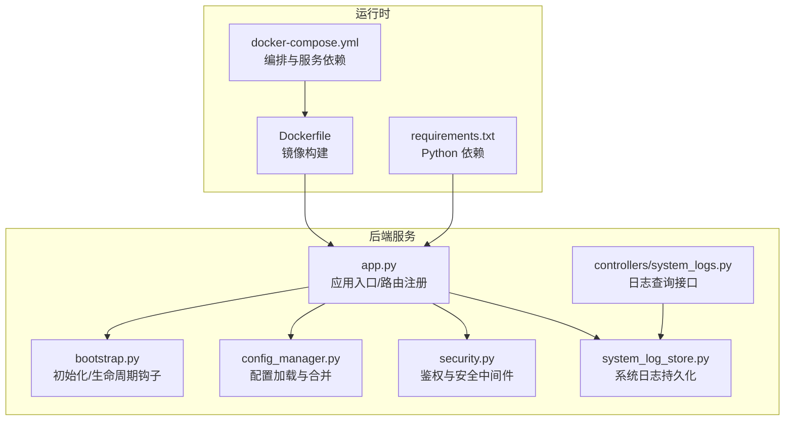
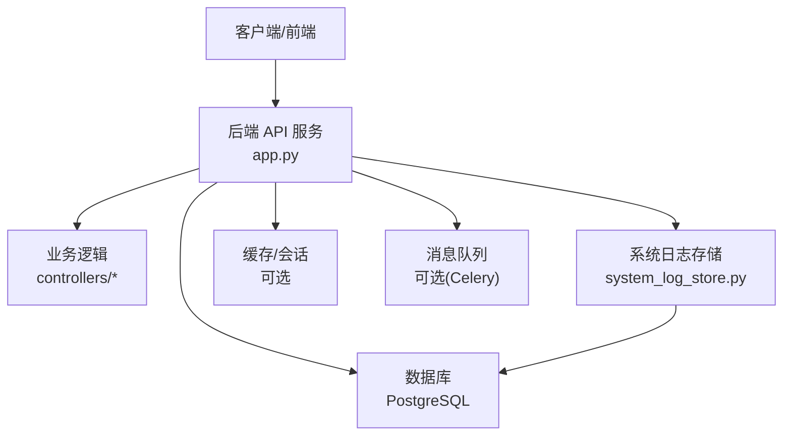
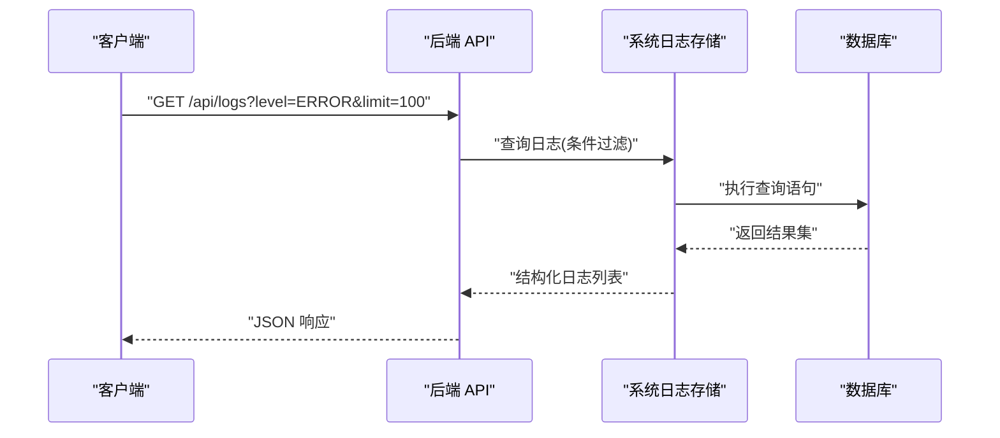
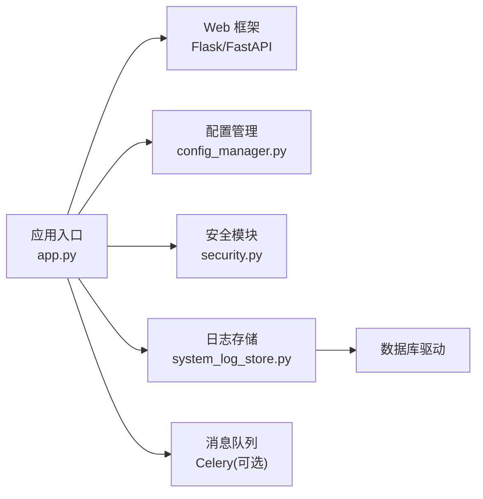

# 后端调试

<cite>
**本文引用的文件**   
- [backend/app.py](file://backend/app.py)
- [backend/bootstrap.py](file://backend/bootstrap.py)
- [backend/config_manager.py](file://backend/config_manager.py)
- [backend/security.py](file://backend/security.py)
- [backend/system_log_store.py](file://backend/system_log_store.py)
- [backend/controllers/system_logs.py](file://backend/controllers/system_logs.py)
- [docker-compose.yml](file://docker-compose.yml)
- [backend/Dockerfile](file://backend/Dockerfile)
- [backend/requirements.txt](file://backend/requirements.txt)
</cite>

## 目录
1. [简介](#简介)
2. [项目结构](#项目结构)
3. [核心组件](#核心组件)
4. [架构总览](#架构总览)
5. [详细组件分析](#详细组件分析)
6. [依赖关系分析](#依赖关系分析)
7. [性能考虑](#性能考虑)
8. [故障排查指南](#故障排查指南)
9. [结论](#结论)
10. [附录](#附录)

## 简介
本指南面向 SmartAsk 后端 Python 应用的调试与排障，覆盖以下主题：
- Flask/FastAPI 应用调试模式配置（开发/生产环境日志级别、错误捕获、异常堆栈分析）
- 系统日志存储机制（日志格式规范、轮转策略、查询方法）
- 性能分析方法（内存泄漏检测、CPU 使用率监控、数据库连接池监控、请求响应时间分析）
- 异步任务调试技巧（Celery 任务追踪、消息队列状态检查、失败重试机制）
- 常见后端问题排查步骤（数据库连接问题、API 超时、内存溢出、并发冲突等）

说明：SmartAsk 后端以 Python 为主，结合容器化部署。调试指南将基于仓库中的后端代码与配置文件进行系统化梳理，并提供可操作的实践建议。

## 项目结构
后端位于 backend 目录，关键入口与配置包括：
- 应用启动与中间件：app.py、bootstrap.py
- 配置管理：config_manager.py
- 安全与鉴权：security.py
- 系统日志存储：system_log_store.py 与控制器 system_logs.py
- 运行环境与依赖：Dockerfile、requirements.txt、docker-compose.yml

图表来源
- [backend/app.py](file://backend/app.py)
- [backend/bootstrap.py](file://backend/bootstrap.py)
- [backend/config_manager.py](file://backend/config_manager.py)
- [backend/security.py](file://backend/security.py)
- [backend/system_log_store.py](file://backend/system_log_store.py)
- [backend/controllers/system_logs.py](file://backend/controllers/system_logs.py)
- [backend/Dockerfile](file://backend/Dockerfile)
- [docker-compose.yml](file://docker-compose.yml)
- [backend/requirements.txt](file://backend/requirements.txt)

章节来源
- [backend/app.py](file://backend/app.py)
- [backend/bootstrap.py](file://backend/bootstrap.py)
- [backend/config_manager.py](file://backend/config_manager.py)
- [backend/security.py](file://backend/security.py)
- [backend/system_log_store.py](file://backend/system_log_store.py)
- [backend/controllers/system_logs.py](file://backend/controllers/system_logs.py)
- [backend/Dockerfile](file://backend/Dockerfile)
- [docker-compose.yml](file://docker-compose.yml)
- [backend/requirements.txt](file://backend/requirements.txt)

## 核心组件
- 应用入口与中间件：负责路由注册、全局异常处理、请求/响应拦截、跨域与认证等。
- 配置管理：统一加载环境变量、配置文件与环境差异（开发/测试/生产）。
- 安全模块：鉴权、权限校验、敏感信息保护。
- 系统日志：结构化日志写入、持久化存储、查询接口。
- 容器化：镜像构建、依赖安装、环境变量注入。

章节来源
- [backend/app.py](file://backend/app.py)
- [backend/config_manager.py](file://backend/config_manager.py)
- [backend/security.py](file://backend/security.py)
- [backend/system_log_store.py](file://backend/system_log_store.py)
- [backend/controllers/system_logs.py](file://backend/controllers/system_logs.py)

## 架构总览
下图展示后端服务在容器化环境中的基本交互：客户端通过 HTTP 访问 API，应用层调用业务逻辑与系统日志存储，依赖数据库与外部服务。

图表来源
- [backend/app.py](file://backend/app.py)
- [backend/system_log_store.py](file://backend/system_log_store.py)
- [docker-compose.yml](file://docker-compose.yml)

## 详细组件分析

### 应用启动与调试模式
- 调试模式开关：通常由环境变量控制（如 FLASK_DEBUG/FASTAPI_DEBUG），用于启用热重载、详细错误页与更丰富的日志输出。
- 日志级别：开发环境建议设置为 DEBUG/INFO；生产环境建议 INFO/WARNING，避免泄露敏感信息。
- 全局异常捕获：在应用入口注册异常处理器，统一返回错误码与结构化错误信息，并记录完整堆栈到系统日志。
- 请求跟踪：为每个请求生成唯一 ID，贯穿日志链路，便于关联查询。

章节来源
- [backend/app.py](file://backend/app.py)
- [backend/bootstrap.py](file://backend/bootstrap.py)
- [backend/config_manager.py](file://backend/config_manager.py)

### 配置管理与环境差异
- 配置来源优先级：默认配置 < 环境变量 < 配置文件 < 运行时覆盖。
- 环境标识：通过环境变量区分 dev/test/prod，影响日志级别、调试开关、数据库连接参数等。
- 敏感配置：密码、密钥等应通过环境变量或加密存储，避免硬编码。

章节来源
- [backend/config_manager.py](file://backend/config_manager.py)

### 安全与鉴权
- 鉴权流程：验证令牌、权限校验、资源访问控制。
- 安全中间件：输入校验、速率限制、CORS、请求体大小限制。
- 错误处理：鉴权失败时返回标准错误码，并记录审计日志。

章节来源
- [backend/security.py](file://backend/security.py)

### 系统日志存储与查询
- 日志格式：JSON 结构化字段，包含时间戳、级别、请求 ID、模块、消息、堆栈等。
- 存储策略：本地文件 + 数据库持久化；支持按模块/级别/时间范围过滤。
- 查询接口：提供 REST 接口用于检索、分页、导出。
- 轮转策略：按文件大小或时间切分，保留周期与压缩策略。

图表来源
- [backend/controllers/system_logs.py](file://backend/controllers/system_logs.py)
- [backend/system_log_store.py](file://backend/system_log_store.py)

章节来源
- [backend/system_log_store.py](file://backend/system_log_store.py)
- [backend/controllers/system_logs.py](file://backend/controllers/system_logs.py)

### 容器化与运行环境
- 镜像构建：安装依赖、拷贝代码、设置环境变量。
- 编排：定义服务、端口映射、数据卷挂载、依赖服务（数据库、缓存、队列）。
- 健康检查：探针确保服务就绪。

章节来源
- [backend/Dockerfile](file://backend/Dockerfile)
- [docker-compose.yml](file://docker-compose.yml)

## 依赖关系分析
- 框架依赖：Flask/FastAPI（根据实际实现选择），HTTP 服务器（Gunicorn/Uvicorn）。
- 数据库驱动：SQLAlchemy/psycopg2 等。
- 日志库：logging/structlog，文件轮转（RotatingFileHandler）。
- 异步任务（可选）：Celery + Redis/RabbitMQ。

图表来源
- [backend/app.py](file://backend/app.py)
- [backend/config_manager.py](file://backend/config_manager.py)
- [backend/security.py](file://backend/security.py)
- [backend/system_log_store.py](file://backend/system_log_store.py)
- [backend/requirements.txt](file://backend/requirements.txt)

章节来源
- [backend/requirements.txt](file://backend/requirements.txt)

## 性能考虑
- 内存泄漏检测
  - 使用 tracemalloc、memory_profiler 定位增长对象。
  - 定期采样 RSS/VSZ，观察趋势。
- CPU 使用率监控
  - 使用 cProfile/py-spy 分析热点函数。
  - 结合系统工具 top/htop 与容器指标。
- 数据库连接池监控
  - 监控连接数、等待时间、慢查询。
  - 调整 pool_size/max_overflow 与超时参数。
- 请求响应时间分析
  - 在中间件记录请求开始/结束时间，计算耗时。
  - 使用 APM 工具（如 OpenTelemetry）采集指标。

[本节为通用指导，不直接分析具体文件]

## 故障排查指南

### 调试模式与日志级别
- 开发环境
  - 开启调试模式，启用详细错误页与热重载。
  - 日志级别设为 DEBUG，输出详细堆栈。
- 生产环境
  - 关闭调试模式，禁用详细错误页。
  - 日志级别设为 INFO/WARNING，仅记录必要信息。
- 错误捕获
  - 全局异常处理器统一捕获未处理异常，记录堆栈并返回标准错误码。
  - 对第三方库异常进行包装，避免泄露内部细节。

章节来源
- [backend/app.py](file://backend/app.py)
- [backend/config_manager.py](file://backend/config_manager.py)

### 系统日志存储与查询
- 日志格式规范
  - JSON 结构化字段：timestamp、level、request_id、module、message、stacktrace。
- 轮转策略
  - 按文件大小或时间切分，保留 N 天，压缩归档。
- 查询方法
  - 通过日志查询接口按级别、模块、时间范围过滤。
  - 支持分页与导出，便于离线分析。

章节来源
- [backend/system_log_store.py](file://backend/system_log_store.py)
- [backend/controllers/system_logs.py](file://backend/controllers/system_logs.py)

### 性能分析方法
- 内存泄漏检测
  - 使用 tracemalloc 对比快照，定位持续增长对象。
  - 结合 GC 统计与对象引用图分析。
- CPU 使用率监控
  - 使用 cProfile 生成调用图，识别热点。
  - 使用 py-spy 在线采样，无需重启。
- 数据库连接池监控
  - 监控连接池状态（活跃/空闲/等待）。
  - 调整池大小与超时，避免连接耗尽。
- 请求响应时间分析
  - 中间件记录耗时，按端点聚合。
  - 结合分布式追踪，定位慢调用链。

[本节为通用指导，不直接分析具体文件]

### 异步任务调试技巧（Celery）
- 任务追踪
  - 为每个任务分配唯一 ID，记录到系统日志。
  - 使用 Celery 的 result_backend 查询任务状态。
- 消息队列状态检查
  - 监控队列长度、消费者数量、延迟。
  - 使用 broker CLI 查看队列详情。
- 失败重试机制
  - 配置 retry_backoff 与 max_retries。
  - 记录失败原因与重试次数，支持人工干预。

[本节为通用指导，不直接分析具体文件]

### 常见后端问题排查步骤
- 数据库连接问题
  - 检查连接字符串、用户名密码、网络连通性。
  - 查看连接池状态与慢查询日志。
- API 超时
  - 增加超时阈值，优化慢查询与外部调用。
  - 使用超时与熔断策略保护服务。
- 内存溢出
  - 定位大对象与循环引用，减少一次性加载。
  - 使用流式处理与分页降低内存峰值。
- 并发冲突
  - 检查锁粒度与事务隔离级别。
  - 使用幂等设计与重试机制避免重复提交。

[本节为通用指导，不直接分析具体文件]

## 结论
本指南围绕 SmartAsk 后端的调试与排障提供了系统化方法，涵盖应用调试模式、日志存储与查询、性能分析与异步任务调试。通过统一的错误捕获、结构化日志与容器化部署，可显著提升问题定位效率与系统稳定性。建议在生产环境中持续监控关键指标，并结合 APM 工具进行全链路追踪。

## 附录
- 常用命令
  - 启动服务：参考 docker-compose 编排。
  - 查看日志：使用系统日志查询接口或容器日志。
  - 性能分析：使用 cProfile/py-spy/tracemalloc。
- 参考文档
  - 容器化部署：Dockerfile 与 docker-compose.yml。
  - 依赖清单：requirements.txt。

[本节为补充信息，不直接分析具体文件]