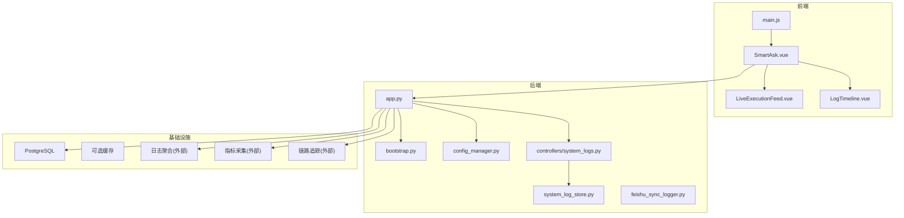
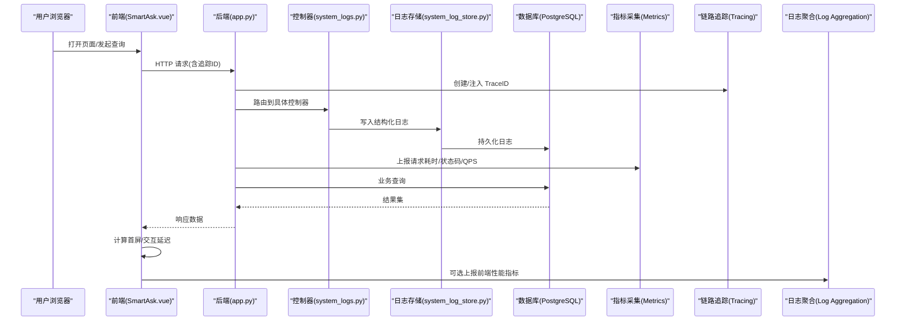
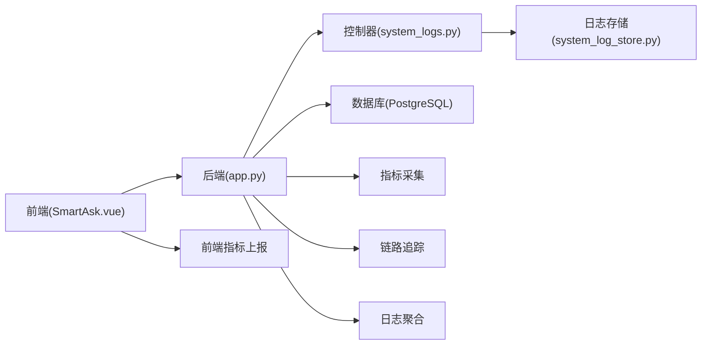

# 性能监控

<cite>
**本文引用的文件**   
- [backend/app.py](file://backend/app.py)
- [backend/bootstrap.py](file://backend/bootstrap.py)
- [backend/config_manager.py](file://backend/config_manager.py)
- [backend/system_log_store.py](file://backend/system_log_store.py)
- [backend/feishu_sync_logger.py](file://backend/feishu_sync_logger.py)
- [backend/controllers/system_logs.py](file://backend/controllers/system_logs.py)
- [backend/Dockerfile](file://backend/Dockerfile)
- [frontend/src/main.js](file://frontend/src/main.js)
- [frontend/src/views/SmartAsk.vue](file://frontend/src/views/SmartAsk.vue)
- [frontend/src/components/smartask/LiveExecutionFeed.vue](file://frontend/src/components/smartask/LiveExecutionFeed.vue)
- [frontend/src/components/smartask/LogTimeline.vue](file://frontend/src/components/smartask/LogTimeline.vue)
- [docker-compose.yml](file://docker-compose.yml)
</cite>

## 目录
1. [简介](#简介)
2. [项目结构](#项目结构)
3. [核心组件](#核心组件)
4. [架构总览](#架构总览)
5. [详细组件分析](#详细组件分析)
6. [依赖关系分析](#依赖关系分析)
7. [性能考虑](#性能考虑)
8. [故障排查指南](#故障排查指南)
9. [结论](#结论)
10. [附录](#附录)

## 简介
本指南面向 SmartAsk 项目的生产与运维团队，提供端到端的性能监控与告警方案。内容覆盖：
- 应用层指标：CPU、内存、磁盘 I/O、网络带宽
- 数据库性能：查询响应时间、连接池使用率、锁等待、缓冲区命中率
- 前端性能：页面加载时间、交互响应、资源加载优化
- 日志与 APM：结构化日志收集、聚合分析、异常告警、链路追踪、瓶颈定位、容量规划
- 基准测试与回归检测：方法与实践
- 生产最佳实践与应急预案

## 项目结构
SmartAsk 采用前后端分离架构，后端基于 Python Web 框架，前端基于 Vue/Vite。关键路径包括：
- 后端入口与启动流程：app.py、bootstrap.py
- 配置管理：config_manager.py
- 系统日志存储与接口：system_log_store.py、controllers/system_logs.py
- 飞书同步日志：feishu_sync_logger.py
- 前端主入口与视图：main.js、SmartAsk.vue、LiveExecutionFeed.vue、LogTimeline.vue
- 容器编排：docker-compose.yml、backend/Dockerfile

**图表来源** 
- [backend/app.py](file://backend/app.py)
- [backend/bootstrap.py](file://backend/bootstrap.py)
- [backend/config_manager.py](file://backend/config_manager.py)
- [backend/system_log_store.py](file://backend/system_log_store.py)
- [backend/controllers/system_logs.py](file://backend/controllers/system_logs.py)
- [frontend/src/main.js](file://frontend/src/main.js)
- [frontend/src/views/SmartAsk.vue](file://frontend/src/views/SmartAsk.vue)
- [frontend/src/components/smartask/LiveExecutionFeed.vue](file://frontend/src/components/smartask/LiveExecutionFeed.vue)
- [frontend/src/components/smartask/LogTimeline.vue](file://frontend/src/components/smartask/LogTimeline.vue)

**章节来源**
- [backend/app.py](file://backend/app.py)
- [backend/bootstrap.py](file://backend/bootstrap.py)
- [backend/config_manager.py](file://backend/config_manager.py)
- [backend/system_log_store.py](file://backend/system_log_store.py)
- [backend/controllers/system_logs.py](file://backend/controllers/system_logs.py)
- [frontend/src/main.js](file://frontend/src/main.js)
- [frontend/src/views/SmartAsk.vue](file://frontend/src/views/SmartAsk.vue)
- [frontend/src/components/smartask/LiveExecutionFeed.vue](file://frontend/src/components/smartask/LiveExecutionFeed.vue)
- [frontend/src/components/smartask/LogTimeline.vue](file://frontend/src/components/smartask/LogTimeline.vue)
- [docker-compose.yml](file://docker-compose.yml)

## 核心组件
- 后端应用入口与中间件：负责请求生命周期、错误处理、指标埋点与日志输出
- 配置管理：集中化环境变量与运行时配置，支撑监控开关与采样率控制
- 系统日志存储与接口：统一写入结构化日志，暴露查询接口供前端展示
- 飞书同步日志：异步记录同步任务执行细节，便于问题回溯
- 前端主流程与可视化：页面加载、用户交互、实时执行流与日志时间线

**章节来源**
- [backend/app.py](file://backend/app.py)
- [backend/config_manager.py](file://backend/config_manager.py)
- [backend/system_log_store.py](file://backend/system_log_store.py)
- [backend/controllers/system_logs.py](file://backend/controllers/system_logs.py)
- [backend/feishu_sync_logger.py](file://backend/feishu_sync_logger.py)
- [frontend/src/main.js](file://frontend/src/main.js)
- [frontend/src/views/SmartAsk.vue](file://frontend/src/views/SmartAsk.vue)
- [frontend/src/components/smartask/LiveExecutionFeed.vue](file://frontend/src/components/smartask/LiveExecutionFeed.vue)
- [frontend/src/components/smartask/LogTimeline.vue](file://frontend/src/components/smartask/LogTimeline.vue)

## 架构总览
下图展示了从前端到后端、再到数据库与外部监控系统的整体数据流与控制流，涵盖指标采集、日志聚合与链路追踪的集成点。

**图表来源** 
- [backend/app.py](file://backend/app.py)
- [backend/controllers/system_logs.py](file://backend/controllers/system_logs.py)
- [backend/system_log_store.py](file://backend/system_log_store.py)
- [frontend/src/views/SmartAsk.vue](file://frontend/src/views/SmartAsk.vue)

## 详细组件分析

### 后端应用与中间件（app.py）
- 职责：注册路由、全局中间件、错误处理、指标埋点、日志上下文注入
- 监控要点：
  - 请求级指标：入站 QPS、P95/P99 延迟、错误率、HTTP 状态码分布
  - 线程/进程模型：并发度、队列长度、GC 停顿
  - 资源指标：CPU、内存、磁盘 I/O、网络带宽
- 建议实现：
  - 在请求进入/退出时记录耗时并上报指标
  - 统一异常捕获并附带 TraceID、请求摘要、堆栈信息
  - 通过配置开关控制采样率与敏感字段脱敏

**章节来源**
- [backend/app.py](file://backend/app.py)

### 启动与初始化（bootstrap.py）
- 职责：应用初始化、依赖注入、健康检查端点、监控探针接入
- 监控要点：
  - 启动耗时、依赖就绪状态（DB、缓存、消息队列）
  - 健康检查端点用于负载均衡与健康探测
- 建议实现：
  - 启动阶段拉取配置、预热缓存、校验外部依赖
  - 暴露 /health 与 /ready 端点，返回服务状态与依赖状态

**章节来源**
- [backend/bootstrap.py](file://backend/bootstrap.py)

### 配置管理（config_manager.py）
- 职责：集中化管理环境变量、运行时配置、功能开关
- 监控相关配置项：
  - 指标上报开关、采样率、日志级别、追踪采样率
  - 数据库连接池大小、超时、重试策略
- 建议实现：
  - 提供类型安全的配置读取与默认值
  - 支持热更新或重启生效的配置项分类

**章节来源**
- [backend/config_manager.py](file://backend/config_manager.py)

### 系统日志存储与接口（system_log_store.py, controllers/system_logs.py）
- 职责：结构化日志写入、查询接口、分页与过滤
- 监控要点：
  - 日志写入吞吐、延迟、失败率
  - 查询接口性能（慢查询、索引命中）
- 建议实现：
  - 使用批量写入与异步落盘降低阻塞
  - 对高频查询字段建立索引，限制最大分页深度
  - 暴露查询接口供前端 LogTimeline 展示

**章节来源**
- [backend/system_log_store.py](file://backend/system_log_store.py)
- [backend/controllers/system_logs.py](file://backend/controllers/system_logs.py)

### 飞书同步日志（feishu_sync_logger.py）
- 职责：记录飞书同步任务的执行细节、错误与重试
- 监控要点：
  - 同步任务成功率、平均耗时、失败原因分布
  - 外部 API 限流与重试退避
- 建议实现：
  - 结构化字段包含任务 ID、批次号、源/目标表、行数、耗时、错误码
  - 失败自动重试与死信队列归档

**章节来源**
- [backend/feishu_sync_logger.py](file://backend/feishu_sync_logger.py)

### 前端性能监控（main.js, SmartAsk.vue, LiveExecutionFeed.vue, LogTimeline.vue）
- 职责：页面加载计时、用户交互延迟、资源加载统计、实时执行流与日志展示
- 监控要点：
  - 首屏时间、TTFB、FCP、LCP、CLS、FID/INP
  - 交互响应延迟（点击到反馈）、长任务阻塞
  - 资源体积与缓存命中率
- 建议实现：
  - 使用 PerformanceObserver 与 Navigation Timing API 采集指标
  - 将关键事件与 TraceID 关联，便于跨端归因
  - 对大资源启用懒加载与 CDN 缓存

**章节来源**
- [frontend/src/main.js](file://frontend/src/main.js)
- [frontend/src/views/SmartAsk.vue](file://frontend/src/views/SmartAsk.vue)
- [frontend/src/components/smartask/LiveExecutionFeed.vue](file://frontend/src/components/smartask/LiveExecutionFeed.vue)
- [frontend/src/components/smartask/LogTimeline.vue](file://frontend/src/components/smartask/LogTimeline.vue)

### 容器与部署（Dockerfile, docker-compose.yml）
- 职责：镜像构建、服务编排、端口映射、环境变量注入
- 监控要点：
  - 容器 CPU/内存限额与配额
  - 卷挂载与日志驱动配置
  - 健康检查与自动重启策略
- 建议实现：
  - 为各服务设置合理的资源限制与探针
  - 使用外部日志驱动将 stdout/stderr 转发至聚合平台

**章节来源**
- [backend/Dockerfile](file://backend/Dockerfile)
- [docker-compose.yml](file://docker-compose.yml)

## 依赖关系分析
- 前端依赖后端 REST/WS 接口；后端依赖数据库与外部服务（如飞书）
- 监控与 APM 作为横切关注点，贯穿前后端与数据库
- 日志与指标需统一 TraceID 进行关联

**图表来源** 
- [backend/app.py](file://backend/app.py)
- [backend/controllers/system_logs.py](file://backend/controllers/system_logs.py)
- [backend/system_log_store.py](file://backend/system_log_store.py)
- [frontend/src/views/SmartAsk.vue](file://frontend/src/views/SmartAsk.vue)

**章节来源**
- [backend/app.py](file://backend/app.py)
- [backend/controllers/system_logs.py](file://backend/controllers/system_logs.py)
- [backend/system_log_store.py](file://backend/system_log_store.py)
- [frontend/src/views/SmartAsk.vue](file://frontend/src/views/SmartAsk.vue)

## 性能考虑
- 应用层
  - 使用连接池与缓存减少热点访问
  - 合理设置超时与重试，避免雪崩
  - 异步化处理非关键路径（如日志落盘、通知）
- 数据库层
  - 慢查询分析与索引优化
  - 连接池上限与空闲回收策略
  - 分库分表与读写分离评估
- 前端层
  - 代码分割与按需加载
  - 静态资源压缩与缓存策略
  - 减少长任务与主线程阻塞
- 可观测性
  - 统一 TraceID、标准化日志格式
  - 指标维度设计（服务、接口、用户、租户）
  - 告警阈值与降噪策略

[本节为通用指导，不直接分析具体文件]

## 故障排查指南
- 快速定位
  - 通过 TraceID 串联前端、后端、数据库与外部调用
  - 查看系统日志接口与 LogTimeline 组件，按时间线与关键字过滤
- 常见问题
  - 高延迟：检查慢查询、外部 API 超时、GC 停顿
  - 高错误率：检查上游依赖健康、认证与权限、参数校验
  - 资源耗尽：检查连接池、线程池、内存泄漏
- 应急措施
  - 降级与熔断：关闭非核心功能，限制流量
  - 扩容与回滚：滚动发布与快速回滚
  - 隔离与限流：按租户/接口维度限流

**章节来源**
- [backend/controllers/system_logs.py](file://backend/controllers/system_logs.py)
- [backend/system_log_store.py](file://backend/system_log_store.py)
- [frontend/src/components/smartask/LogTimeline.vue](file://frontend/src/components/smartask/LogTimeline.vue)

## 结论
通过统一的指标、日志与链路追踪体系，结合前端性能采集与数据库优化，SmartAsk 可实现全链路的性能可视与可控。建议在生产环境落地以下能力：
- 指标采集与告警（SLO/SLI）
- 结构化日志聚合与检索
- 分布式链路追踪与瓶颈定位
- 基准测试与回归检测自动化
- 容量规划与弹性伸缩策略

[本节为总结性内容，不直接分析具体文件]

## 附录

### 应用性能监控指标清单
- 通用指标
  - 请求量（QPS）、错误率、延迟分位（P50/P95/P99）
  - CPU 使用率、内存占用、GC 次数与停顿、线程数
  - 磁盘 I/O 吞吐与延迟、网络带宽与丢包率
- 数据库指标
  - 查询响应时间、连接池使用率、活跃连接数
  - 锁等待时间、死锁次数、缓冲区命中率
  - 慢查询数量、索引命中率、复制延迟
- 前端指标
  - 首屏时间、TTFB、FCP、LCP、CLS、FID/INP
  - 交互响应时间、资源加载体积与缓存命中率
  - 错误率（JS 异常、网络失败）

[本节为通用清单，不直接分析具体文件]

### 日志分析与监控工具配置
- 结构化日志
  - 字段：时间戳、TraceID、级别、服务名、接口、耗时、状态码、错误码、用户/租户
  - 脱敏：隐藏敏感字段（密码、密钥、PII）
- 日志聚合
  - 使用外部聚合平台（如 ELK/ Loki/云厂商日志服务）
  - 索引策略与保留周期、冷热分层
- 异常告警
  - 错误率突增、延迟超阈、资源耗尽、依赖不可用
  - 告警通道：邮件、短信、IM、电话
  - 降噪：去重、抑制、升级策略

[本节为通用配置指导，不直接分析具体文件]

### APM（应用性能监控）使用指南
- 链路追踪
  - 注入 TraceID，跨服务传递
  - 标注关键节点（HTTP、DB、缓存、MQ、外部 API）
- 性能瓶颈定位
  - 热点接口与慢调用链
  - 数据库慢查询与锁竞争
  - GC 与内存泄漏分析
- 容量规划
  - 基于历史峰值与增长趋势预测
  - 弹性伸缩策略与成本优化

[本节为通用实践指导，不直接分析具体文件]

### 性能基准测试与回归检测
- 基准方法
  - 压测工具（JMeter/Locust/k6），模拟真实负载
  - 场景设计：读多写少、混合负载、突发流量
- 回归检测
  - 自动化流水线集成压测与指标对比
  - 阈值判定与失败阻断
  - 报告生成与趋势分析

[本节为通用方法论，不直接分析具体文件]

### 生产环境监控告警最佳实践与应急预案
- 最佳实践
  - 明确 SLO/SLI，设定分级告警
  - 指标维度一致，标签规范
  - 演练与复盘机制
- 应急预案
  - 预案文档与责任人
  - 一键降级/熔断/限流
  - 快速回滚与灰度发布

[本节为通用最佳实践，不直接分析具体文件]