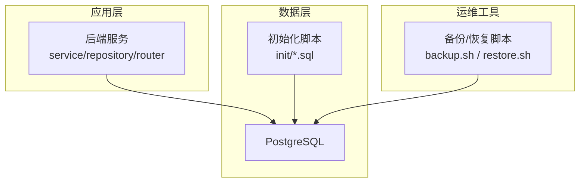
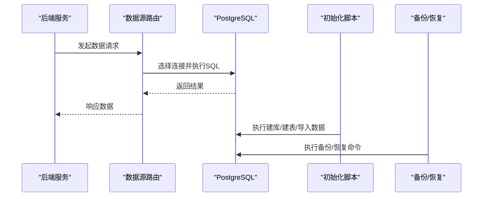
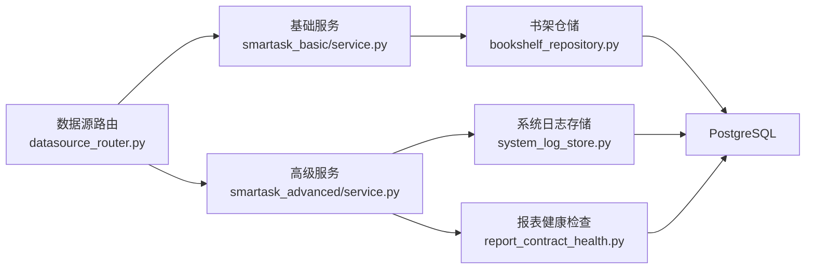

# 数据库调试

<cite>
**本文引用的文件**   
- [docker-compose.yml](file://docker-compose.yml)
- [001_bookshelf_schema.sql](file://docker/postgres/init/001_bookshelf_schema.sql)
- [002_angel_group_data.sql](file://docker/postgres/init/002_angel_group_data.sql)
- [003_bookshelf_agent1_prompt_upgrade.sql](file://docker/postgres/init/003_bookshelf_agent1_prompt_upgrade.sql)
- [004_report_config.sql](file://docker/postgres/init/004_report_config.sql)
- [005_report_thresholds.sql](file://docker/postgres/init/005_report_thresholds.sql)
- [006_system_event_logs.sql](file://docker/postgres/init/006_system_event_logs.sql)
- [backup.sh](file://backup.sh)
- [restore.sh](file://restore.sh)
- [smartask_basic/service.py](file://backend/smartask_basic/service.py)
- [smartask_advanced/service.py](file://backend/smartask_advanced/service.py)
- [datasource_router.py](file://backend/datasource_router.py)
- [bookshelf_repository.py](file://backend/bookshelf_repository.py)
- [system_log_store.py](file://backend/system_log_store.py)
- [report_contract_health.py](file://backend/report_contract_health.py)
- [verify_deployment.py](file://backend/verify_deployment.py)
</cite>

## 目录
1. [简介](#简介)
2. [项目结构](#项目结构)
3. [核心组件](#核心组件)
4. [架构总览](#架构总览)
5. [详细组件分析](#详细组件分析)
6. [依赖关系分析](#依赖关系分析)
7. [性能考虑](#性能考虑)
8. [故障排查指南](#故障排查指南)
9. [结论](#结论)
10. [附录](#附录)

## 简介
本指南面向 SmartAsk 项目的 PostgreSQL 数据库，提供系统化的调试与优化方法。内容覆盖慢查询分析（EXPLAIN、监控、索引检查）、连接池配置与泄漏检测、事务问题诊断（死锁、长事务、回滚）、数据一致性排查（主从延迟、同步问题、并发冲突），以及索引设计、SQL 与表结构优化、存储管理，并给出常见问题的解决方案（连接超时、查询缓慢、数据损坏、备份恢复）。

## 项目结构
SmartAsk 使用 Docker Compose 编排服务，PostgreSQL 初始化脚本位于 docker/postgres/init 目录；后端通过 Python 模块访问数据库，包括数据源路由、仓库层与服务层。关键位置如下：
- 容器编排与数据库服务定义：docker-compose.yml
- 数据库初始化与迁移脚本：docker/postgres/init/*.sql
- 后端数据库访问入口与仓储：backend 下的 service、repository、router 等模块

图表来源
- [docker-compose.yml](file://docker-compose.yml)
- [001_bookshelf_schema.sql](file://docker/postgres/init/001_bookshelf_schema.sql)
- [002_angel_group_data.sql](file://docker/postgres/init/002_angel_group_data.sql)
- [003_bookshelf_agent1_prompt_upgrade.sql](file://docker/postgres/init/003_bookshelf_agent1_prompt_upgrade.sql)
- [004_report_config.sql](file://docker/postgres/init/004_report_config.sql)
- [005_report_thresholds.sql](file://docker/postgres/init/005_report_thresholds.sql)
- [006_system_event_logs.sql](file://docker/postgres/init/006_system_event_logs.sql)
- [backup.sh](file://backup.sh)
- [restore.sh](file://restore.sh)

章节来源
- [docker-compose.yml](file://docker-compose.yml)
- [001_bookshelf_schema.sql](file://docker/postgres/init/001_bookshelf_schema.sql)
- [002_angel_group_data.sql](file://docker/postgres/init/002_angel_group_data.sql)
- [003_bookshelf_agent1_prompt_upgrade.sql](file://docker/postgres/init/003_bookshelf_agent1_prompt_upgrade.sql)
- [004_report_config.sql](file://docker/postgres/init/004_report_config.sql)
- [005_report_thresholds.sql](file://docker/postgres/init/005_report_thresholds.sql)
- [006_system_event_logs.sql](file://docker/postgres/init/006_system_event_logs.sql)

## 核心组件
- 数据库服务与初始化
  - 通过 docker-compose.yml 启动 PostgreSQL，并使用 init 目录中的 SQL 脚本完成库表结构与基础数据初始化。
- 后端数据访问
  - backend/smartask_basic/service.py 与 backend/smartask_advanced/service.py 封装业务服务逻辑，通常通过 ORM/驱动访问数据库。
  - backend/datasource_router.py 负责多数据源路由，决定请求落点与连接选择。
  - backend/bookshelf_repository.py、backend/system_log_store.py、backend/report_contract_health.py 等实现具体仓储与报表健康检查的持久化逻辑。
- 运维脚本
  - backup.sh 与 restore.sh 提供备份与恢复能力，用于数据保护与灾难恢复。

章节来源
- [docker-compose.yml](file://docker-compose.yml)
- [smartask_basic/service.py](file://backend/smartask_basic/service.py)
- [smartask_advanced/service.py](file://backend/smartask_advanced/service.py)
- [datasource_router.py](file://backend/datasource_router.py)
- [bookshelf_repository.py](file://backend/bookshelf_repository.py)
- [system_log_store.py](file://backend/system_log_store.py)
- [report_contract_health.py](file://backend/report_contract_health.py)
- [backup.sh](file://backup.sh)
- [restore.sh](file://restore.sh)

## 架构总览
下图展示应用、数据库与运维脚本之间的交互关系，以及初始化脚本对数据库结构的构建过程。

图表来源
- [docker-compose.yml](file://docker-compose.yml)
- [001_bookshelf_schema.sql](file://docker/postgres/init/001_bookshelf_schema.sql)
- [002_angel_group_data.sql](file://docker/postgres/init/002_angel_group_data.sql)
- [003_bookshelf_agent1_prompt_upgrade.sql](file://docker/postgres/init/003_bookshelf_agent1_prompt_upgrade.sql)
- [004_report_config.sql](file://docker/postgres/init/004_report_config.sql)
- [005_report_thresholds.sql](file://docker/postgres/init/005_report_thresholds.sql)
- [006_system_event_logs.sql](file://docker/postgres/init/006_system_event_logs.sql)
- [backup.sh](file://backup.sh)
- [restore.sh](file://restore.sh)

## 详细组件分析

### 数据库连接池与连接管理
- 连接池目标
  - 控制最大连接数、最小空闲连接、连接超时与获取超时，避免连接耗尽与泄漏。
- 建议配置项（按通用实践）
  - 最大连接数：根据 CPU 核数与 I/O 能力设置，避免超过数据库 max_connections。
  - 最小空闲连接：保持一定预热连接，降低冷启动延迟。
  - 连接超时：客户端连接建立超时、获取连接超时、Socket 读写超时。
  - 连接回收：空闲连接存活时间、最大生命周期、泄漏检测阈值。
- 泄漏检测
  - 启用连接借用/归还日志，统计未归还的连接；在异常路径强制释放。
  - 定期巡检活跃连接与等待队列长度，发现异常增长。
- 与后端集成
  - 在 datasource_router.py 中集中管理连接选择与复用策略。
  - 在 service.py 中确保每个请求的生命周期内正确提交或回滚事务，关闭连接。

章节来源
- [datasource_router.py](file://backend/datasource_router.py)
- [smartask_basic/service.py](file://backend/smartask_basic/service.py)
- [smartask_advanced/service.py](file://backend/smartask_advanced/service.py)

### 事务问题诊断
- 死锁检测
  - 查看 pg_locks、pg_stat_activity，识别阻塞链路与持有锁的事务。
  - 结合 EXPLAIN 与执行计划，定位热点更新与范围扫描导致的锁竞争。
- 长事务识别
  - 监控长时间未提交的事务，关注会话状态与等待事件。
  - 将长事务拆分为小批次，减少锁持有时间与资源占用。
- 事务回滚分析
  - 记录回滚原因与触发条件，区分业务校验失败与约束冲突。
  - 针对频繁回滚的路径进行重试与幂等性设计。

章节来源
- [system_log_store.py](file://backend/system_log_store.py)
- [report_contract_health.py](file://backend/report_contract_health.py)

### 数据一致性排查
- 主从复制延迟
  - 监控 replay_lag、application_lag，评估从库滞后程度。
  - 调整 wal_level、max_wal_senders、recovery.conf 参数以平衡一致性与吞吐。
- 数据同步问题
  - 对比主从表行数与校验和，定位不一致对象。
  - 检查触发器、物化视图刷新与增量同步任务。
- 并发更新冲突
  - 使用行级锁与版本号字段解决乐观锁冲突。
  - 对热点行采用分片或队列串行化处理。

章节来源
- [docker-compose.yml](file://docker-compose.yml)
- [001_bookshelf_schema.sql](file://docker/postgres/init/001_bookshelf_schema.sql)

### 慢查询分析与优化
- EXPLAIN 计划分析
  - 使用 EXPLAIN (ANALYZE, BUFFERS) 观察实际执行成本与缓存命中。
  - 关注全表扫描、嵌套循环、排序与临时表生成。
- 查询性能监控
  - 启用 pg_stat_statements，统计高频与高成本语句。
  - 基于 top-N 查询制定优化优先级。
- 索引使用情况检查
  - 查询 pg_stat_user_indexes 与 pg_stat_user_tables，评估索引命中率与扫描次数。
  - 删除无用索引，合并重复索引，覆盖高频过滤与排序列。

章节来源
- [001_bookshelf_schema.sql](file://docker/postgres/init/001_bookshelf_schema.sql)
- [002_angel_group_data.sql](file://docker/postgres/init/002_angel_group_data.sql)
- [004_report_config.sql](file://docker/postgres/init/004_report_config.sql)
- [005_report_thresholds.sql](file://docker/postgres/init/005_report_thresholds.sql)
- [006_system_event_logs.sql](file://docker/postgres/init/006_system_event_logs.sql)

### 表结构与存储空间管理
- 表结构优化
  - 合理拆分大表为分区表，提升查询与维护效率。
  - 规范数据类型与默认值，减少空值与冗余字段。
- 存储空间管理
  - 定期 VACUUM 与 ANALYZE，回收空间并更新统计信息。
  - 监控表与索引大小，清理历史数据与归档冷数据。

章节来源
- [001_bookshelf_schema.sql](file://docker/postgres/init/001_bookshelf_schema.sql)
- [006_system_event_logs.sql](file://docker/postgres/init/006_system_event_logs.sql)

### 备份与恢复
- 备份策略
  - 使用 pg_dump 或物理备份工具，结合 cron 定时任务。
  - 保留多版本备份，支持时间点恢复（PITR）。
- 恢复流程
  - 验证备份完整性，先在测试环境演练恢复。
  - 切换流量至新实例，逐步验证数据一致性。

章节来源
- [backup.sh](file://backup.sh)
- [restore.sh](file://restore.sh)

## 依赖关系分析
后端模块与数据库的依赖关系如下：
- datasource_router.py 作为数据源路由中心，协调连接选择与请求分发。
- service.py 系列封装业务逻辑，调用 repository 层进行数据存取。
- repository 与 store 模块直接操作数据库表与视图。
- 初始化脚本构建表结构与基础数据，保障服务启动时的数据可用性。

图表来源
- [datasource_router.py](file://backend/datasource_router.py)
- [smartask_basic/service.py](file://backend/smartask_basic/service.py)
- [smartask_advanced/service.py](file://backend/smartask_advanced/service.py)
- [bookshelf_repository.py](file://backend/bookshelf_repository.py)
- [system_log_store.py](file://backend/system_log_store.py)
- [report_contract_health.py](file://backend/report_contract_health.py)

章节来源
- [datasource_router.py](file://backend/datasource_router.py)
- [smartask_basic/service.py](file://backend/smartask_basic/service.py)
- [smartask_advanced/service.py](file://backend/smartask_advanced/service.py)
- [bookshelf_repository.py](file://backend/bookshelf_repository.py)
- [system_log_store.py](file://backend/system_log_store.py)
- [report_contract_health.py](file://backend/report_contract_health.py)

## 性能考虑
- 索引设计优化
  - 为高频过滤、JOIN 与 ORDER BY 列创建合适索引，避免过度索引导致写入退化。
  - 使用复合索引与部分索引覆盖特定查询模式。
- 查询语句优化
  - 避免 SELECT *，仅选取必要字段；合理使用分页与限制返回行数。
  - 将复杂子查询改写为 JOIN 或临时表，减少嵌套循环。
- 表结构优化
  - 规范化与反规范化权衡，热点数据可适度冗余以提升读取性能。
  - 分区表与归档策略结合，降低热表体积。
- 存储与统计信息
  - 定期 VACUUM FULL 与 ANALYZE，确保优化器获得准确统计。
  - 监控磁盘 I/O 与 WAL 增长，避免瓶颈。

[本节为通用指导，不直接分析具体文件]

## 故障排查指南
- 连接超时
  - 检查客户端连接超时与服务器 max_connections；扩容连接池上限与增加服务器连接配额。
  - 排查网络延迟与防火墙规则，确保连接可达。
- 查询缓慢
  - 使用 EXPLAIN 定位全表扫描与高成本节点；补充缺失索引或改写 SQL。
  - 开启 pg_stat_statements 监控 Top 慢查询，持续迭代优化。
- 数据损坏
  - 使用 pg_verifymbd 或一致性校验工具检查页级别错误；必要时从备份恢复。
  - 检查 WAL 与归档是否完整，确保 PITR 可用。
- 备份恢复问题
  - 验证备份文件完整性与权限；在预生产环境演练恢复流程。
  - 记录恢复步骤与回滚方案，确保可快速恢复。

章节来源
- [verify_deployment.py](file://backend/verify_deployment.py)
- [backup.sh](file://backup.sh)
- [restore.sh](file://restore.sh)

## 结论
通过对 SmartAsk 的 PostgreSQL 数据库进行系统化调试与优化，可以显著提升稳定性与性能。建议以 EXPLAIN 与监控为核心抓手，完善连接池与事务治理，强化索引与表结构设计，并建立完善的备份恢复体系。持续跟踪指标与问题闭环，是保障生产环境高质量运行的关键。

[本节为总结性内容，不直接分析具体文件]

## 附录
- 常用诊断命令（示例思路）
  - 查看活跃会话与锁：SELECT * FROM pg_stat_activity; SELECT * FROM pg_locks;
  - 慢查询统计：SELECT query, calls, mean_exec_time FROM pg_stat_statements ORDER BY mean_exec_time DESC LIMIT 20;
  - 索引使用率：SELECT schemaname, tablename, indexname, idx_scan, idx_tup_read FROM pg_stat_user_indexes;
- 优化清单
  - 索引：覆盖高频查询、避免重复与低效索引。
  - SQL：精简字段、合理使用分页与聚合。
  - 表：分区与归档、类型与默认值规范。
  - 存储：VACUUM/ANALYZE、WAL 与归档策略。
  - 备份：定时备份、演练恢复、多版本保留。

[本节为补充信息，不直接分析具体文件]