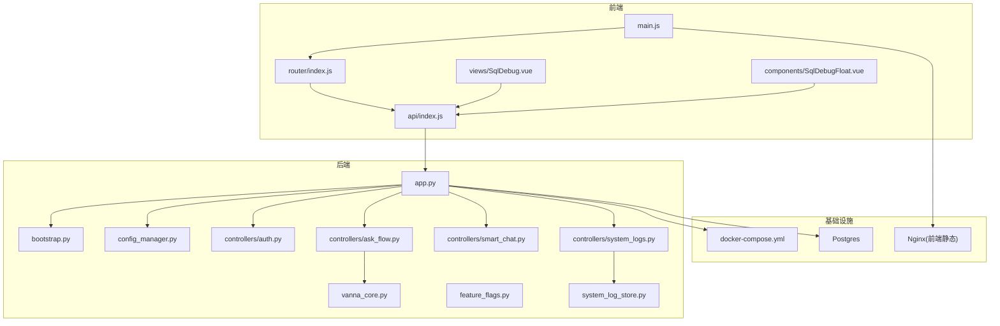
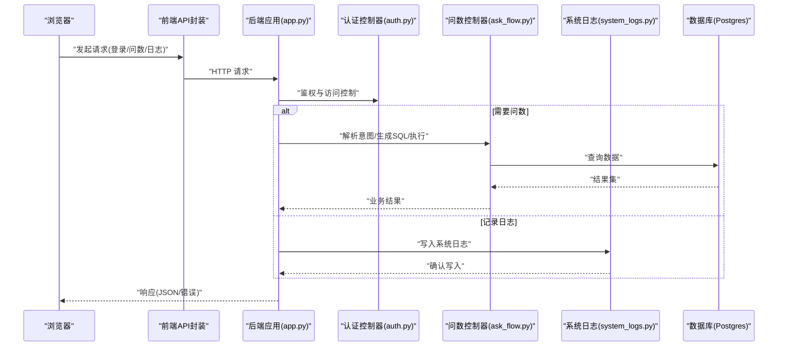
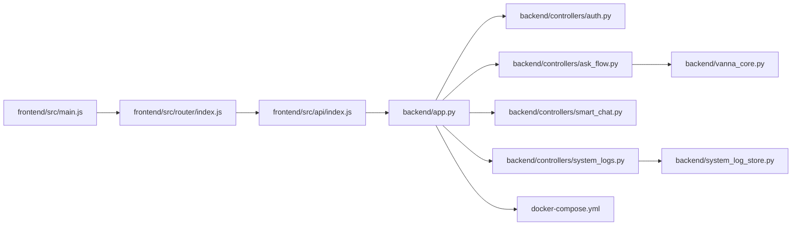

# 调试与故障排查

<cite>
**本文引用的文件**   
- [backend/app.py](file://backend/app.py)
- [backend/bootstrap.py](file://backend/bootstrap.py)
- [backend/config_manager.py](file://backend/config_manager.py)
- [backend/security.py](file://backend/security.py)
- [backend/system_log_store.py](file://backend/system_log_store.py)
- [backend/feature_flags.py](file://backend/feature_flags.py)
- [backend/controllers/auth.py](file://backend/controllers/auth.py)
- [backend/controllers/ask_flow.py](file://backend/controllers/ask_flow.py)
- [backend/controllers/smart_chat.py](file://backend/controllers/smart_chat.py)
- [backend/controllers/system_logs.py](file://backend/controllers/system_logs.py)
- [backend/agent_registry.py](file://agent_registry.py)
- [backend/vanna_core.py](file://backend/vanna_core.py)
- [frontend/src/main.js](file://frontend/src/main.js)
- [frontend/src/router/index.js](file://frontend/src/router/index.js)
- [frontend/src/api/index.js](file://frontend/src/api/index.js)
- [frontend/src/views/SqlDebug.vue](file://frontend/src/views/SqlDebug.vue)
- [frontend/src/components/SqlDebugFloat.vue](file://frontend/src/components/SqlDebugFloat.vue)
- [frontend/src/state/sessionCache.js](file://frontend/src/state/sessionCache.js)
- [frontend/src/composables/useSmartAskReportHistory.js](file://frontend/src/composables/useSmartAskReportHistory.js)
- [docker-compose.yml](file://docker-compose.yml)
- [backend/Dockerfile](file://backend/Dockerfile)
- [frontend/Dockerfile](file://frontend/Dockerfile)
- [scripts/integration_test.py](file://scripts/integration_test.py)
- [scripts/verify_deployment.py](file://scripts/verify_deployment.py)
</cite>

## 目录
1. [简介](#简介)
2. [项目结构](#项目结构)
3. [核心组件](#核心组件)
4. [架构总览](#架构总览)
5. [详细组件分析](#详细组件分析)
6. [依赖关系分析](#依赖关系分析)
7. [性能考虑](#性能考虑)
8. [故障排查指南](#故障排查指南)
9. [结论](#结论)
10. [附录](#附录)

## 简介
本指南面向 SmartAsk 项目的开发与运维人员，提供从后端 Python 应用到前端 Vue.js、数据库查询优化、分布式系统调试到生产监控告警的全链路调试与故障排查方法。内容覆盖：
- 后端（Flask/FastAPI）调试模式、日志级别配置、异常堆栈分析、内存泄漏检测与性能瓶颈定位
- 前端（Vue.js）浏览器开发者工具、Vue DevTools、网络请求调试、组件状态检查与性能分析
- 数据库慢查询分析、索引优化、连接池配置与事务问题诊断
- 微服务间通信调试、消息队列监控、缓存一致性与并发冲突解决
- 常见错误清单与解决方案（部署、配置、权限、第三方集成）
- 生产环境诊断工具与监控告警配置建议

## 项目结构
SmartAsk 采用前后端分离架构：
- 后端：Python + Flask/FastAPI（以 app.py 为入口），模块化 controllers、services、migrations、tests 等
- 前端：Vue 3 + Vite，路由、状态管理、API 封装、视图与组件分层清晰
- 基础设施：Docker Compose 编排，Postgres 初始化脚本，Nginx 反向代理（前端构建产物）

图表来源
- [backend/app.py](file://backend/app.py)
- [backend/bootstrap.py](file://backend/bootstrap.py)
- [backend/config_manager.py](file://backend/config_manager.py)
- [backend/controllers/auth.py](file://backend/controllers/auth.py)
- [backend/controllers/ask_flow.py](file://backend/controllers/ask_flow.py)
- [backend/controllers/smart_chat.py](file://backend/controllers/smart_chat.py)
- [backend/controllers/system_logs.py](file://backend/controllers/system_logs.py)
- [backend/system_log_store.py](file://backend/system_log_store.py)
- [backend/vanna_core.py](file://backend/vanna_core.py)
- [frontend/src/main.js](file://frontend/src/main.js)
- [frontend/src/router/index.js](file://frontend/src/router/index.js)
- [frontend/src/api/index.js](file://frontend/src/api/index.js)
- [frontend/src/views/SqlDebug.vue](file://frontend/src/views/SqlDebug.vue)
- [frontend/src/components/SqlDebugFloat.vue](file://frontend/src/components/SqlDebugFloat.vue)
- [docker-compose.yml](file://docker-compose.yml)

章节来源
- [backend/app.py](file://backend/app.py)
- [frontend/src/main.js](file://frontend/src/main.js)
- [docker-compose.yml](file://docker-compose.yml)

## 核心组件
- 应用启动与配置
  - 后端入口与引导：app.py、bootstrap.py、config_manager.py
  - 特性开关与安全策略：feature_flags.py、security.py
- 控制器层
  - 认证授权：controllers/auth.py
  - 问数流程：controllers/ask_flow.py
  - 智能对话：controllers/smart_chat.py
  - 系统日志：controllers/system_logs.py
- 存储与日志
  - 系统日志持久化：system_log_store.py
- 前端关键模块
  - 应用入口与路由：main.js、router/index.js
  - API 封装：api/index.js
  - SQL 调试视图与浮窗：views/SqlDebug.vue、components/SqlDebugFloat.vue
  - 会话缓存与历史：state/sessionCache.js、composables/useSmartAskReportHistory.js

章节来源
- [backend/app.py](file://backend/app.py)
- [backend/bootstrap.py](file://backend/bootstrap.py)
- [backend/config_manager.py](file://backend/config_manager.py)
- [backend/feature_flags.py](file://backend/feature_flags.py)
- [backend/security.py](file://backend/security.py)
- [backend/controllers/auth.py](file://backend/controllers/auth.py)
- [backend/controllers/ask_flow.py](file://backend/controllers/ask_flow.py)
- [backend/controllers/smart_chat.py](file://backend/controllers/smart_chat.py)
- [backend/controllers/system_logs.py](file://backend/controllers/system_logs.py)
- [backend/system_log_store.py](file://backend/system_log_store.py)
- [frontend/src/main.js](file://frontend/src/main.js)
- [frontend/src/router/index.js](file://frontend/src/router/index.js)
- [frontend/src/api/index.js](file://frontend/src/api/index.js)
- [frontend/src/views/SqlDebug.vue](file://frontend/src/views/SqlDebug.vue)
- [frontend/src/components/SqlDebugFloat.vue](file://frontend/src/components/SqlDebugFloat.vue)
- [frontend/src/state/sessionCache.js](file://frontend/src/state/sessionCache.js)
- [frontend/src/composables/useSmartAskReportHistory.js](file://frontend/src/composables/useSmartAskReportHistory.js)

## 架构总览
SmartAsk 的调试架构围绕“可观测性”展开：
- 后端：结构化日志、统一异常处理、特性开关控制、安全校验、外部依赖（数据库、LLM）调用链追踪
- 前端：网络请求拦截、SQL 执行可视化、组件状态快照、性能指标上报
- 基础设施：容器化部署、环境变量注入、数据库初始化脚本、Nginx 静态资源服务

图表来源
- [backend/app.py](file://backend/app.py)
- [backend/controllers/auth.py](file://backend/controllers/auth.py)
- [backend/controllers/ask_flow.py](file://backend/controllers/ask_flow.py)
- [backend/controllers/system_logs.py](file://backend/controllers/system_logs.py)
- [docker-compose.yml](file://docker-compose.yml)

## 详细组件分析

### 后端调试与排错
- 调试模式与日志级别
  - 通过环境变量或配置文件启用调试模式，设置日志级别（DEBUG/INFO/WARNING/ERROR）
  - 使用结构化日志输出，便于集中收集与分析
- 异常堆栈分析
  - 统一异常处理器捕获未处理异常，返回标准化错误信息
  - 结合请求ID与上下文信息，快速定位问题链路
- 内存泄漏检测与性能瓶颈定位
  - 使用内存分析工具（如 tracemalloc、memory_profiler）定位对象增长热点
  - 使用性能剖析工具（如 cProfile、py-spy）识别 CPU 热点与阻塞点
  - 对数据库连接池、外部 API 调用进行超时与重试策略配置

章节来源
- [backend/config_manager.py](file://backend/config_manager.py)
- [backend/security.py](file://backend/security.py)
- [backend/system_log_store.py](file://backend/system_log_store.py)
- [backend/feature_flags.py](file://backend/feature_flags.py)

### 前端调试技巧
- 浏览器开发者工具
  - Network 面板：查看请求/响应、延迟、错误码
  - Console 面板：打印日志、执行表达式、捕获异常
  - Performance 面板：录制页面加载与交互性能
- Vue DevTools 配置
  - 安装并启用 Vue DevTools，查看组件树、状态、事件与 Vuex/Pinia 状态
- 网络请求调试
  - 在 api/index.js 中增加请求拦截器，打印 URL、参数、响应体与耗时
- 组件状态检查与性能分析
  - 在 SqlDebug.vue 与 SqlDebugFloat.vue 中展示 SQL 执行计划与结果
  - 使用 sessionCache.js 缓存会话状态，避免重复请求

章节来源
- [frontend/src/api/index.js](file://frontend/src/api/index.js)
- [frontend/src/views/SqlDebug.vue](file://frontend/src/views/SqlDebug.vue)
- [frontend/src/components/SqlDebugFloat.vue](file://frontend/src/components/SqlDebugFloat.vue)
- [frontend/src/state/sessionCache.js](file://frontend/src/state/sessionCache.js)
- [frontend/src/composables/useSmartAskReportHistory.js](file://frontend/src/composables/useSmartAskReportHistory.js)

### 数据库查询优化与问题排查
- 慢查询分析
  - 开启 Postgres 慢查询日志，分析执行计划（EXPLAIN ANALYZE）
  - 关注全表扫描、缺失索引、复杂 JOIN 与子查询
- 索引优化
  - 根据查询条件创建合适索引，避免过度索引导致写性能下降
  - 定期分析索引使用情况，删除无用索引
- 连接池配置
  - 调整连接池大小、超时时间与最大空闲时间，避免连接耗尽
- 事务问题诊断
  - 检查事务边界、锁等待与死锁情况，确保 ACID 特性

章节来源
- [docker-compose.yml](file://docker-compose.yml)
- [backend/vanna_core.py](file://backend/vanna_core.py)

### 分布式系统调试方法
- 微服务间通信调试
  - 使用请求 ID 贯穿调用链，便于跨服务追踪
  - 检查 HTTP/gRPC 接口契约、超时与重试策略
- 消息队列监控
  - 监控队列长度、消费速率、失败重试与死信队列
- 缓存一致性
  - 使用版本号或时间戳保证缓存与数据库一致性
  - 设置合理的过期时间与失效策略
- 并发冲突解决
  - 使用乐观锁或分布式锁避免竞态条件

章节来源
- [backend/agent_registry.py](file://agent_registry.py)
- [backend/controllers/smart_chat.py](file://backend/controllers/smart_chat.py)

### 常见错误排查清单
- 部署问题
  - 检查 Docker 镜像构建与容器启动日志
  - 验证端口映射、环境变量与卷挂载
- 配置错误
  - 核对数据库连接串、Redis 地址、第三方 API 密钥
  - 使用 feature_flags.py 动态关闭有问题的功能
- 权限问题
  - 检查 RBAC 配置与用户角色权限
  - 验证文件系统与数据库权限
- 第三方服务集成
  - 检查网络连通性、证书与限流策略
  - 实现降级与熔断机制

章节来源
- [backend/Dockerfile](file://backend/Dockerfile)
- [frontend/Dockerfile](file://frontend/Dockerfile)
- [backend/feature_flags.py](file://backend/feature_flags.py)

## 依赖关系分析
SmartAsk 的依赖关系清晰，模块间耦合度低，便于独立调试与扩展。

图表来源
- [frontend/src/main.js](file://frontend/src/main.js)
- [frontend/src/router/index.js](file://frontend/src/router/index.js)
- [frontend/src/api/index.js](file://frontend/src/api/index.js)
- [backend/app.py](file://backend/app.py)
- [backend/controllers/auth.py](file://backend/controllers/auth.py)
- [backend/controllers/ask_flow.py](file://backend/controllers/ask_flow.py)
- [backend/controllers/smart_chat.py](file://backend/controllers/smart_chat.py)
- [backend/controllers/system_logs.py](file://backend/controllers/system_logs.py)
- [backend/system_log_store.py](file://backend/system_log_store.py)
- [backend/vanna_core.py](file://backend/vanna_core.py)
- [docker-compose.yml](file://docker-compose.yml)

章节来源
- [backend/app.py](file://backend/app.py)
- [frontend/src/api/index.js](file://frontend/src/api/index.js)
- [docker-compose.yml](file://docker-compose.yml)

## 性能考虑
- 后端性能
  - 使用异步 I/O 提升并发处理能力
  - 对热点数据进行缓存（Redis/Memcached）
  - 优化数据库查询与索引，减少锁竞争
- 前端性能
  - 懒加载路由与组件，减少首屏体积
  - 使用虚拟滚动与分页加载大数据集
  - 避免不必要的重渲染，使用 computed 与 watch 优化
- 基础设施性能
  - 合理配置容器资源限制与调度策略
  - 使用 CDN 加速静态资源分发

[本节为通用指导，不直接分析具体文件]

## 故障排查指南
- 后端问题定位
  - 查看应用日志与系统日志，过滤 ERROR 与 WARNING 级别
  - 使用集成测试脚本验证核心流程
  - 检查环境变量与配置文件是否正确加载
- 前端问题定位
  - 使用浏览器开发者工具捕获网络错误与 JavaScript 异常
  - 通过 Vue DevTools 检查组件状态与事件流
  - 在 SqlDebug.vue 中验证 SQL 执行与结果
- 数据库问题定位
  - 分析慢查询日志与执行计划
  - 检查连接池配置与事务隔离级别
  - 使用监控工具观察数据库负载与锁等待
- 分布式问题定位
  - 使用分布式追踪工具（如 Jaeger/Zipkin）串联调用链
  - 监控消息队列与健康检查接口
  - 检查缓存一致性与并发冲突

章节来源
- [scripts/integration_test.py](file://scripts/integration_test.py)
- [scripts/verify_deployment.py](file://scripts/verify_deployment.py)
- [backend/system_log_store.py](file://backend/system_log_store.py)
- [frontend/src/views/SqlDebug.vue](file://frontend/src/views/SqlDebug.vue)

## 结论
SmartAsk 的调试与故障排查体系围绕“可观测性、可追溯性、可恢复性”设计。通过统一的日志、特性开关、SQL 调试界面与集成测试，能够快速定位问题并恢复服务。在生产环境中，建议结合监控告警与自动化运维工具，持续提升系统的稳定性与可维护性。

[本节为总结性内容，不直接分析具体文件]

## 附录
- 常用命令与工具
  - 后端调试：python -m flask run --debug / uvicorn main:app --reload
  - 前端调试：npm run dev / pnpm dev
  - 数据库工具：psql、pgAdmin、EXPLAIN ANALYZE
  - 性能分析：cProfile、py-spy、memory_profiler
- 监控与告警
  - 应用指标：Prometheus + Grafana
  - 日志收集：ELK/EFK Stack
  - 分布式追踪：Jaeger/Zipkin
  - 告警规则：基于阈值与异常模式的告警策略

[本节为补充信息，不直接分析具体文件]