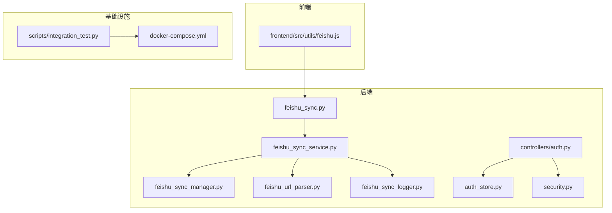
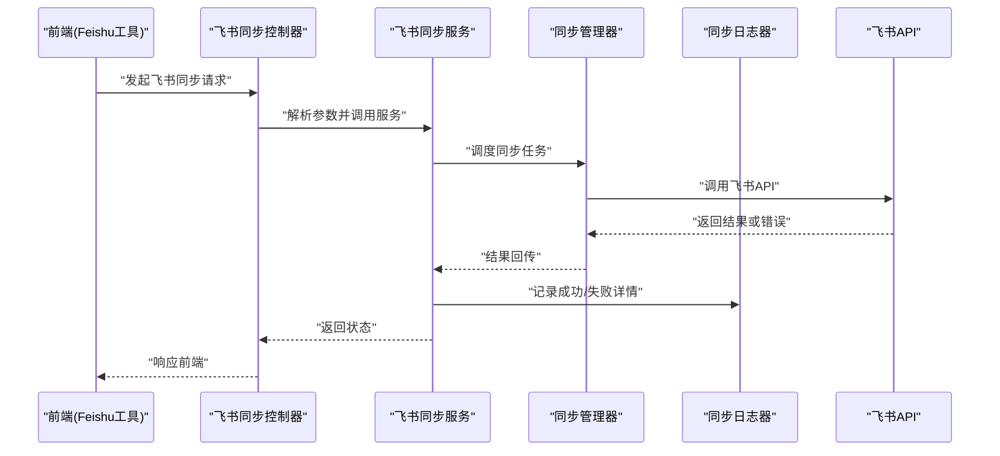
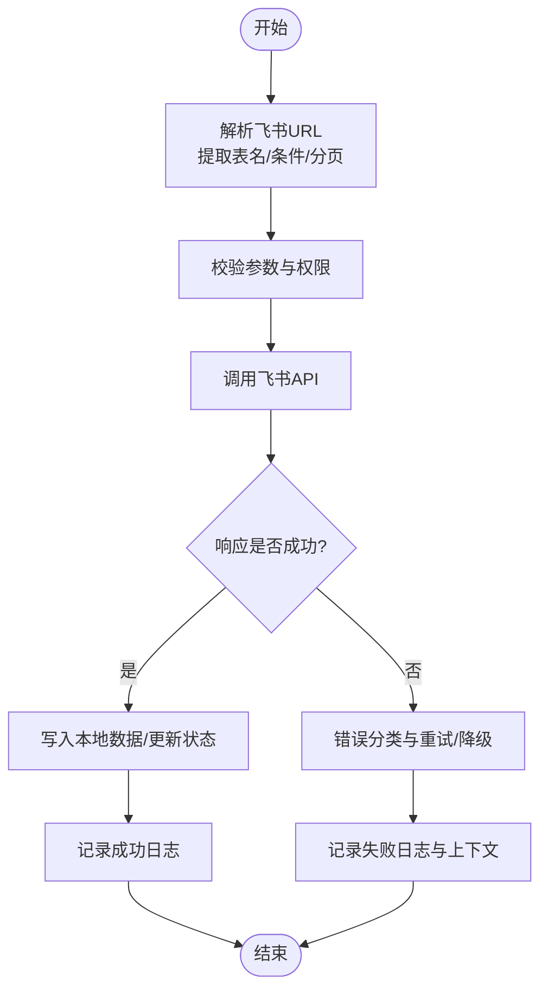
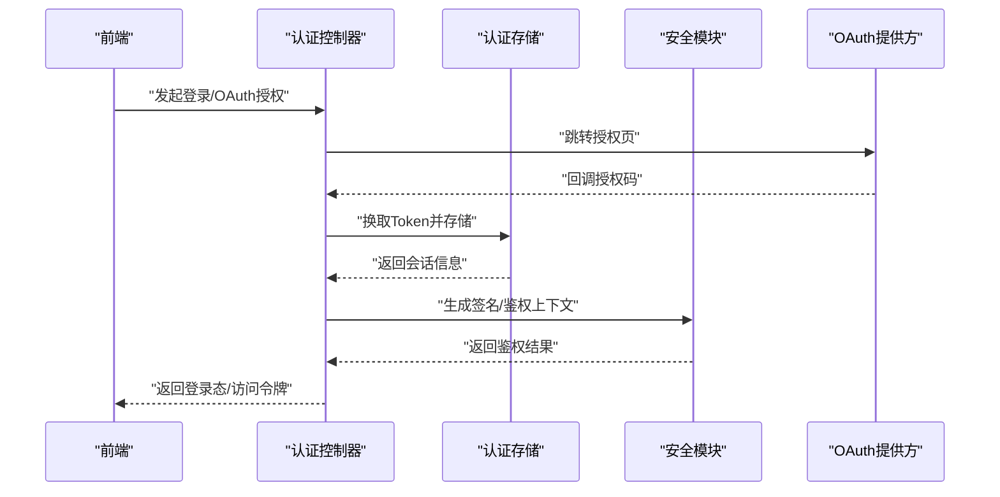
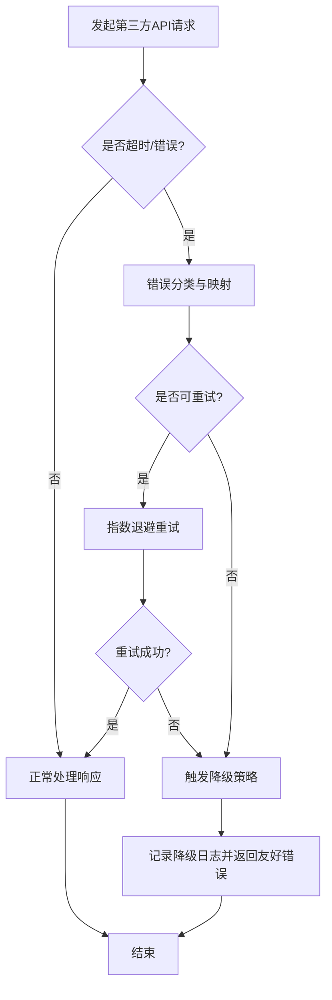
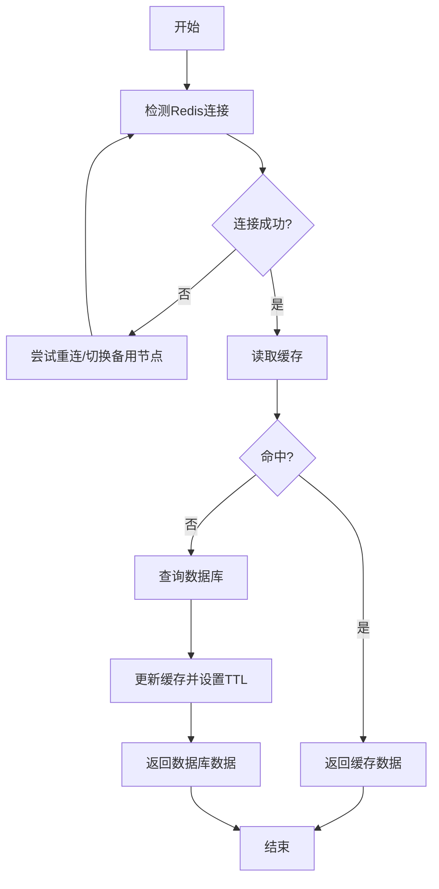
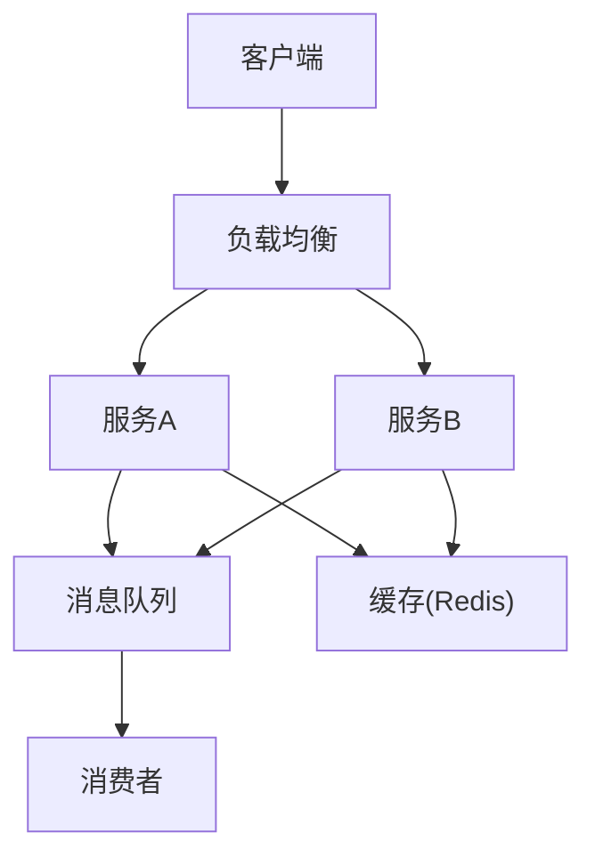
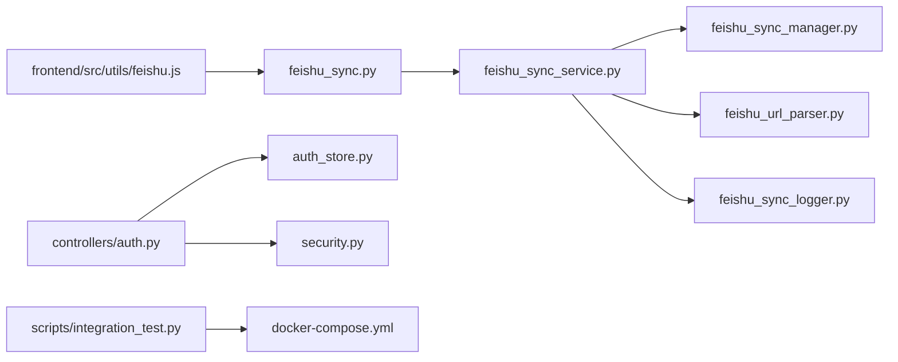

# 集成调试

<cite>
**本文引用的文件**   
- [backend/controllers/feishu_sync.py](file://backend/controllers/feishu_sync.py)
- [backend/feishu_sync_manager.py](file://backend/feishu_sync_manager.py)
- [backend/feishu_sync_service.py](file://backend/feishu_sync_service.py)
- [backend/feishu_url_parser.py](file://backend/feishu_url_parser.py)
- [backend/feishu_sync_logger.py](file://backend/feishu_sync_logger.py)
- [backend/start_feishu_sync.py](file://backend/start_feishu_sync.py)
- [backend/auth_store.py](file://backend/auth_store.py)
- [backend/controllers/auth.py](file://backend/controllers/auth.py)
- [backend/security.py](file://backend/security.py)
- [frontend/src/utils/feishu.js](file://frontend/src/utils/feishu.js)
- [scripts/integration_test.py](file://scripts/integration_test.py)
- [docker-compose.yml](file://docker-compose.yml)
</cite>

## 目录
1. [简介](#简介)
2. [项目结构](#项目结构)
3. [核心组件](#核心组件)
4. [架构总览](#架构总览)
5. [详细组件分析](#详细组件分析)
6. [依赖关系分析](#依赖关系分析)
7. [性能考虑](#性能考虑)
8. [故障排查指南](#故障排查指南)
9. [结论](#结论)
10. [附录](#附录)

## 简介
本指南面向 SmartAsk 项目的外部服务集成调试，重点覆盖：
- 飞书集成的 API 调用失败处理、数据同步错误排查、权限验证问题与消息推送故障定位
- 认证系统调试技巧：OAuth 流程、Token 刷新机制、会话管理与权限验证问题
- 第三方 API 集成调试：网络超时、错误码映射、重试与降级策略
- 缓存系统（Redis）调试：连接问题、失效策略与数据一致性检查
- 分布式系统调试：微服务通信、消息队列监控、服务发现与负载均衡配置
- 集成测试方法与模拟服务搭建技巧

## 项目结构
SmartAsk 后端采用模块化组织，外部集成相关代码主要分布在 backend 目录下的控制器与服务层；前端提供飞书工具函数与页面。关键路径如下：
- 飞书同步控制器与服务：controllers/feishu_sync.py、feishu_sync_service.py、feishu_sync_manager.py、feishu_url_parser.py、feishu_sync_logger.py、start_feishu_sync.py
- 认证与安全：auth_store.py、controllers/auth.py、security.py
- 前端飞书工具：frontend/src/utils/feishu.js
- 集成测试与编排：scripts/integration_test.py、docker-compose.yml

**图示来源**
- [backend/controllers/feishu_sync.py](file://backend/controllers/feishu_sync.py)
- [backend/feishu_sync_service.py](file://backend/feishu_sync_service.py)
- [backend/feishu_sync_manager.py](file://backend/feishu_sync_manager.py)
- [backend/feishu_url_parser.py](file://backend/feishu_url_parser.py)
- [backend/feishu_sync_logger.py](file://backend/feishu_sync_logger.py)
- [backend/auth_store.py](file://backend/auth_store.py)
- [backend/controllers/auth.py](file://backend/controllers/auth.py)
- [backend/security.py](file://backend/security.py)
- [frontend/src/utils/feishu.js](file://frontend/src/utils/feishu.js)
- [scripts/integration_test.py](file://scripts/integration_test.py)
- [docker-compose.yml](file://docker-compose.yml)

**章节来源**
- [backend/controllers/feishu_sync.py](file://backend/controllers/feishu_sync.py)
- [backend/feishu_sync_service.py](file://backend/feishu_sync_service.py)
- [backend/feishu_sync_manager.py](file://backend/feishu_sync_manager.py)
- [backend/feishu_url_parser.py](file://backend/feishu_url_parser.py)
- [backend/feishu_sync_logger.py](file://backend/feishu_sync_logger.py)
- [backend/auth_store.py](file://backend/auth_store.py)
- [backend/controllers/auth.py](file://backend/controllers/auth.py)
- [backend/security.py](file://backend/security.py)
- [frontend/src/utils/feishu.js](file://frontend/src/utils/feishu.js)
- [scripts/integration_test.py](file://scripts/integration_test.py)
- [docker-compose.yml](file://docker-compose.yml)

## 核心组件
- 飞书同步控制器与服务：负责接收请求、解析 URL、调度同步任务、记录日志与错误分类
- 认证存储与安全：管理 Token、会话、权限校验与签名验证
- 前端飞书工具：封装对后端的飞书相关接口调用与参数构造
- 集成测试与编排：统一启动依赖服务并执行端到端用例

**章节来源**
- [backend/controllers/feishu_sync.py](file://backend/controllers/feishu_sync.py)
- [backend/feishu_sync_service.py](file://backend/feishu_sync_service.py)
- [backend/feishu_sync_manager.py](file://backend/feishu_sync_manager.py)
- [backend/feishu_url_parser.py](file://backend/feishu_url_parser.py)
- [backend/feishu_sync_logger.py](file://backend/feishu_sync_logger.py)
- [backend/auth_store.py](file://backend/auth_store.py)
- [backend/controllers/auth.py](file://backend/controllers/auth.py)
- [backend/security.py](file://backend/security.py)
- [frontend/src/utils/feishu.js](file://frontend/src/utils/feishu.js)

## 架构总览
下图展示从前端到后端、再到飞书服务的整体调用链路与关键调试点。

**图示来源**
- [backend/controllers/feishu_sync.py](file://backend/controllers/feishu_sync.py)
- [backend/feishu_sync_service.py](file://backend/feishu_sync_service.py)
- [backend/feishu_sync_manager.py](file://backend/feishu_sync_manager.py)
- [backend/feishu_sync_logger.py](file://backend/feishu_sync_logger.py)
- [frontend/src/utils/feishu.js](file://frontend/src/utils/feishu.js)

## 详细组件分析

### 飞书集成调试
- API 调用失败处理
  - 关注网络异常、HTTP 状态码、飞书业务错误码的分类与重试策略
  - 通过日志器记录请求上下文、参数与响应体摘要，便于快速定位
- 数据同步错误排查
  - 核对 URL 解析结果、表名/字段映射、分页与增量同步逻辑
  - 使用同步管理器查看任务状态、失败重试次数与最终状态
- 权限验证问题
  - 检查应用凭证、权限范围、用户授权状态与访问令牌有效性
- 消息推送故障
  - 确认回调地址、事件订阅、签名校验与消息格式是否符合飞书规范

**图示来源**
- [backend/feishu_url_parser.py](file://backend/feishu_url_parser.py)
- [backend/feishu_sync_service.py](file://backend/feishu_sync_service.py)
- [backend/feishu_sync_manager.py](file://backend/feishu_sync_manager.py)
- [backend/feishu_sync_logger.py](file://backend/feishu_sync_logger.py)

**章节来源**
- [backend/controllers/feishu_sync.py](file://backend/controllers/feishu_sync.py)
- [backend/feishu_sync_service.py](file://backend/feishu_sync_service.py)
- [backend/feishu_sync_manager.py](file://backend/feishu_sync_manager.py)
- [backend/feishu_url_parser.py](file://backend/feishu_url_parser.py)
- [backend/feishu_sync_logger.py](file://backend/feishu_sync_logger.py)

### 认证系统调试
- OAuth 流程调试
  - 检查授权码获取、回调处理、状态参数与防重放机制
  - 对比前端跳转链接与后端回调路由参数一致性
- Token 刷新机制
  - 关注过期时间、刷新令牌有效期、并发刷新冲突处理
  - 在失败时进行限流与退避重试，避免雪崩
- 会话管理
  - 验证会话创建、续期、注销与跨域 Cookie/Token 传递
- 权限验证问题
  - 核对角色/资源映射、RBAC 规则与动态权限加载

**图示来源**
- [backend/controllers/auth.py](file://backend/controllers/auth.py)
- [backend/auth_store.py](file://backend/auth_store.py)
- [backend/security.py](file://backend/security.py)
- [frontend/src/utils/feishu.js](file://frontend/src/utils/feishu.js)

**章节来源**
- [backend/controllers/auth.py](file://backend/controllers/auth.py)
- [backend/auth_store.py](file://backend/auth_store.py)
- [backend/security.py](file://backend/security.py)
- [frontend/src/utils/feishu.js](file://frontend/src/utils/feishu.js)

### 第三方 API 集成调试
- 网络请求超时处理
  - 设置合理的连接与读取超时，捕获超时异常并重试或降级
- 错误码映射
  - 将第三方错误码映射为内部错误类型，便于统一处理与告警
- 重试机制
  - 针对幂等接口实施指数退避重试，非幂等接口谨慎重试
- 降级策略
  - 在依赖不可用时返回缓存或默认值，保障核心链路可用

[此图为概念性流程图，不直接对应具体源码文件]

### 缓存系统调试（Redis）
- 连接问题
  - 检查 Redis 地址、端口、密码与网络连通性；观察连接池状态与超时
- 缓存失效策略
  - 核对 TTL、键命名空间、热点键保护与批量失效策略
- 数据一致性检查
  - 比对缓存与数据库差异，必要时强制刷新或重建索引

[此图为概念性流程图，不直接对应具体源码文件]

### 分布式系统调试
- 微服务间通信调试
  - 检查服务注册、健康检查、超时与熔断配置；追踪请求链路 ID
- 消息队列监控
  - 观察队列堆积、消费延迟、重复消费与死信队列
- 服务发现问题
  - 核对 DNS/注册中心配置、服务实例上下线与权重分配
- 负载均衡配置
  - 检查算法（轮询/加权/一致性哈希）、会话粘性与健康探针

[此图为概念性架构图，不直接对应具体源码文件]

## 依赖关系分析
- 飞书同步控制器依赖同步服务与 URL 解析器，并通过日志器记录运行状态
- 认证控制器依赖认证存储与安全模块，完成令牌签发与权限校验
- 前端飞书工具依赖后端控制器暴露的接口，用于发起同步与查询操作
- 集成测试脚本依赖 docker-compose 编排的基础设施（数据库、缓存、服务等）

**图示来源**
- [backend/controllers/feishu_sync.py](file://backend/controllers/feishu_sync.py)
- [backend/feishu_sync_service.py](file://backend/feishu_sync_service.py)
- [backend/feishu_sync_manager.py](file://backend/feishu_sync_manager.py)
- [backend/feishu_url_parser.py](file://backend/feishu_url_parser.py)
- [backend/feishu_sync_logger.py](file://backend/feishu_sync_logger.py)
- [backend/controllers/auth.py](file://backend/controllers/auth.py)
- [backend/auth_store.py](file://backend/auth_store.py)
- [backend/security.py](file://backend/security.py)
- [frontend/src/utils/feishu.js](file://frontend/src/utils/feishu.js)
- [scripts/integration_test.py](file://scripts/integration_test.py)
- [docker-compose.yml](file://docker-compose.yml)

**章节来源**
- [backend/controllers/feishu_sync.py](file://backend/controllers/feishu_sync.py)
- [backend/feishu_sync_service.py](file://backend/feishu_sync_service.py)
- [backend/feishu_sync_manager.py](file://backend/feishu_sync_manager.py)
- [backend/feishu_url_parser.py](file://backend/feishu_url_parser.py)
- [backend/feishu_sync_logger.py](file://backend/feishu_sync_logger.py)
- [backend/controllers/auth.py](file://backend/controllers/auth.py)
- [backend/auth_store.py](file://backend/auth_store.py)
- [backend/security.py](file://backend/security.py)
- [frontend/src/utils/feishu.js](file://frontend/src/utils/feishu.js)
- [scripts/integration_test.py](file://scripts/integration_test.py)
- [docker-compose.yml](file://docker-compose.yml)

## 性能考虑
- 飞书 API 调用应启用分页与增量同步，减少全量拉取带来的压力
- 合理设置超时与重试退避，避免级联失败
- 缓存热点数据，降低下游依赖负载
- 使用连接池与异步 IO 提升吞吐

[本节为通用指导，不直接分析具体文件]

## 故障排查指南
- 飞书集成
  - 检查 URL 解析与权限配置，查看同步日志中的错误分类与上下文
  - 对失败请求进行最小化复现，逐步缩小问题范围
- 认证系统
  - 核对 OAuth 回调参数与状态校验，检查 Token 刷新与过期处理
  - 验证会话持久化与跨域配置
- 第三方 API
  - 捕获超时与错误码，确认重试与降级策略生效
  - 使用独立工具（如 curl/Postman）直连第三方 API 验证连通性
- 缓存系统
  - 检查 Redis 连接与健康探针，核对键空间与 TTL 策略
  - 对比缓存与数据库一致性，必要时强制刷新
- 分布式系统
  - 追踪请求链路 ID，检查服务健康与负载均衡策略
  - 监控消息队列堆积与消费者延迟，及时处理死信消息

**章节来源**
- [backend/feishu_sync_logger.py](file://backend/feishu_sync_logger.py)
- [backend/controllers/auth.py](file://backend/controllers/auth.py)
- [backend/auth_store.py](file://backend/auth_store.py)
- [backend/security.py](file://backend/security.py)
- [scripts/integration_test.py](file://scripts/integration_test.py)

## 结论
通过分层调试与可视化链路追踪，能够快速定位飞书集成、认证系统与第三方 API 的问题根源。结合合理的超时、重试与降级策略，以及缓存与分布式组件的健康监控，可显著提升系统的稳定性与可维护性。建议在日常运维中建立标准化的排障清单与自动化巡检脚本。

[本节为总结性内容，不直接分析具体文件]

## 附录
- 集成测试方法
  - 使用 scripts/integration_test.py 启动 docker-compose 编排的环境，执行端到端用例
  - 针对飞书同步与认证流程编写专项用例，覆盖成功、失败与边界场景
- 模拟服务搭建技巧
  - 使用 Mock 服务模拟飞书 API 与第三方依赖，断言请求参数与响应行为
  - 注入故障（超时、错误码、限流）验证重试与降级策略

**章节来源**
- [scripts/integration_test.py](file://scripts/integration_test.py)
- [docker-compose.yml](file://docker-compose.yml)